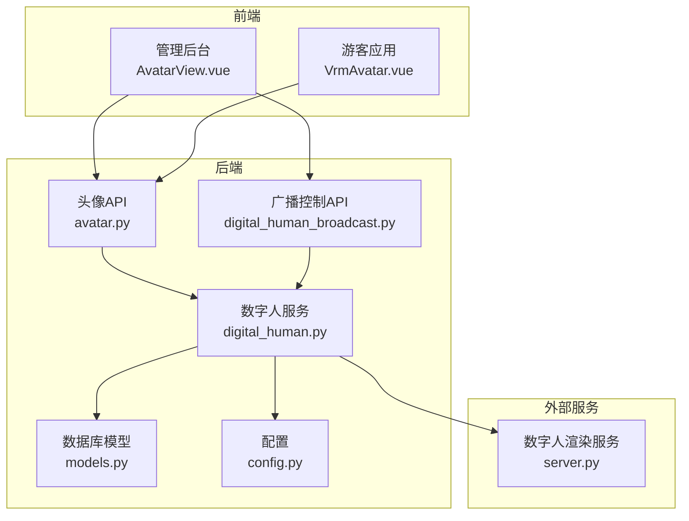
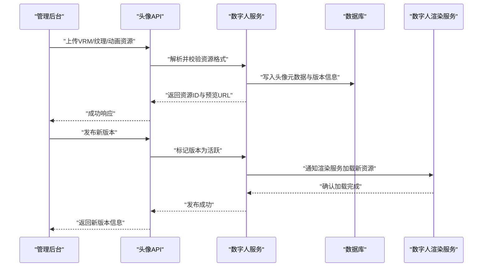
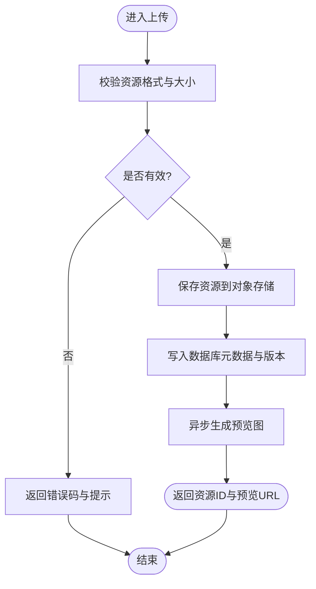
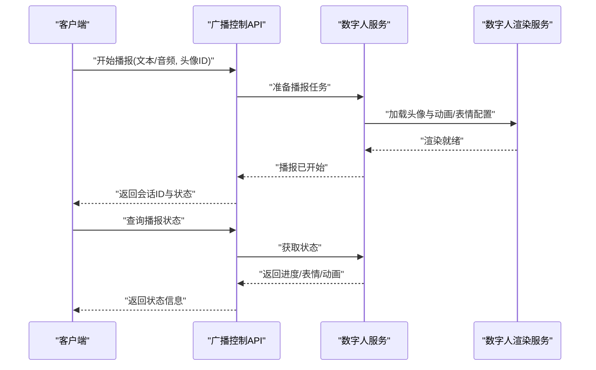
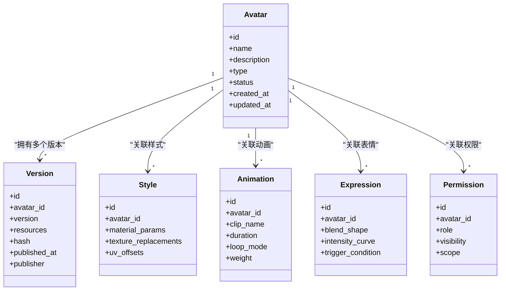
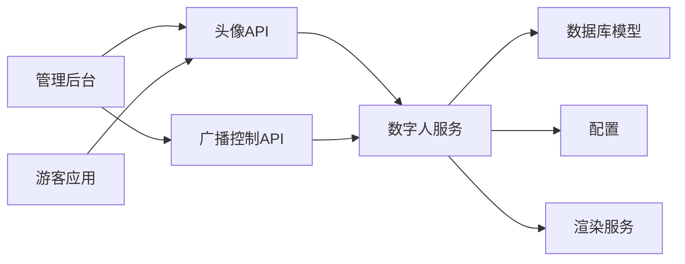

# 头像配置API

<cite>
**本文引用的文件**   
- [backend/app/api/avatar.py](file://backend/app/api/avatar.py)
- [backend/app/api/digital_human_broadcast.py](file://backend/app/api/digital_human_broadcast.py)
- [backend/app/services/digital_human.py](file://backend/app/services/digital_human.py)
- [backend/app/db/models.py](file://backend/app/db/models.py)
- [backend/app/config.py](file://backend/app/config.py)
- [frontend/admin-panel/src/views/AvatarConfig/AvatarView.vue](file://frontend/admin-panel/src/views/AvatarConfig/AvatarView.vue)
- [frontend/tourist-app/src/components/DigitalHuman/VrmAvatar.vue](file://frontend/tourist-app/src/components/DigitalHuman/VrmAvatar.vue)
- [digital_human/server.py](file://digital_human/server.py)
</cite>

## 目录
1. [简介](#简介)
2. [项目结构](#项目结构)
3. [核心组件](#核心组件)
4. [架构总览](#架构总览)
5. [详细组件分析](#详细组件分析)
6. [依赖关系分析](#依赖关系分析)
7. [性能考虑](#性能考虑)
8. [故障排查指南](#故障排查指南)
9. [结论](#结论)
10. [附录](#附录)

## 简介
本文件面向内容管理员与开发者，系统化说明“数字人头像管理系统”的头像配置API设计、数据模型、渲染与版本控制机制，以及数字人播报服务的集成方式。文档覆盖以下关键能力：
- 头像上传、编辑、发布与版本管理
- VRM模型文件格式支持与3D资源管理
- 头像预览生成、批量管理与权限控制
- 样式定制、动画配置与广播控制接口
- 数字人播报服务集成（音频同步、表情驱动、动作控制）

## 项目结构
本项目采用前后端分离架构，后端提供REST API与数字人服务交互，前端包含管理后台与游客应用两个界面。与头像配置相关的关键位置如下：
- 后端API层：头像CRUD与广播控制接口定义
- 服务层：数字人服务封装（VRM加载、渲染、动画、TTS/ASR联动）
- 数据层：数据库模型（头像、版本、样式、动画等实体）
- 前端管理面板：头像配置页面与API调用
- 游客应用：VRM头像渲染与交互
- 独立数字人服务：负责3D渲染与媒体处理

图表来源
- [backend/app/api/avatar.py](file://backend/app/api/avatar.py)
- [backend/app/api/digital_human_broadcast.py](file://backend/app/api/digital_human_broadcast.py)
- [backend/app/services/digital_human.py](file://backend/app/services/digital_human.py)
- [backend/app/db/models.py](file://backend/app/db/models.py)
- [backend/app/config.py](file://backend/app/config.py)
- [frontend/admin-panel/src/views/AvatarConfig/AvatarView.vue](file://frontend/admin-panel/src/views/AvatarConfig/AvatarView.vue)
- [frontend/tourist-app/src/components/DigitalHuman/VrmAvatar.vue](file://frontend/tourist-app/src/components/DigitalHuman/VrmAvatar.vue)
- [digital_human/server.py](file://digital_human/server.py)

章节来源
- [backend/app/api/avatar.py](file://backend/app/api/avatar.py)
- [backend/app/api/digital_human_broadcast.py](file://backend/app/api/digital_human_broadcast.py)
- [backend/app/services/digital_human.py](file://backend/app/services/digital_human.py)
- [backend/app/db/models.py](file://backend/app/db/models.py)
- [backend/app/config.py](file://backend/app/config.py)
- [frontend/admin-panel/src/views/AvatarConfig/AvatarView.vue](file://frontend/admin-panel/src/views/AvatarConfig/AvatarView.vue)
- [frontend/tourist-app/src/components/DigitalHuman/VrmAvatar.vue](file://frontend/tourist-app/src/components/DigitalHuman/VrmAvatar.vue)
- [digital_human/server.py](file://digital_human/server.py)

## 核心组件
- 头像API模块：提供头像资源的创建、读取、更新、删除、版本化、预览与批量操作接口
- 广播控制API：提供数字人播报相关的控制接口（开始/停止、切换头像、设置动画与表情）
- 数字人服务：封装VRM模型加载、材质与动画控制、TTS/ASR事件映射、渲染任务调度
- 数据模型：定义头像、版本、样式、动画、权限等持久化结构
- 配置中心：集中管理渲染路径、存储路径、第三方服务地址等参数
- 前端管理面板：可视化配置头像、预览效果、批量导入导出、权限分配
- 游客应用：在浏览器中加载并渲染VRM头像，响应播报与交互事件
- 数字人渲染服务：独立进程或容器，负责3D场景渲染与媒体流输出

章节来源
- [backend/app/api/avatar.py](file://backend/app/api/avatar.py)
- [backend/app/api/digital_human_broadcast.py](file://backend/app/api/digital_human_broadcast.py)
- [backend/app/services/digital_human.py](file://backend/app/services/digital_human.py)
- [backend/app/db/models.py](file://backend/app/db/models.py)
- [backend/app/config.py](file://backend/app/config.py)
- [frontend/admin-panel/src/views/AvatarConfig/AvatarView.vue](file://frontend/admin-panel/src/views/AvatarConfig/AvatarView.vue)
- [frontend/tourist-app/src/components/DigitalHuman/VrmAvatar.vue](file://frontend/tourist-app/src/components/DigitalHuman/VrmAvatar.vue)
- [digital_human/server.py](file://digital_human/server.py)

## 架构总览
系统通过后端API统一暴露头像与广播控制能力，数字人服务作为中间层协调3D渲染与媒体处理。前端管理面板用于配置与管理，游客应用负责最终渲染展示。

图表来源
- [backend/app/api/avatar.py](file://backend/app/api/avatar.py)
- [backend/app/services/digital_human.py](file://backend/app/services/digital_human.py)
- [backend/app/db/models.py](file://backend/app/db/models.py)
- [digital_human/server.py](file://digital_human/server.py)

## 详细组件分析

### 头像API（CRUD、版本、预览、批量）
- 功能范围
  - 创建：支持上传VRM模型、纹理贴图、骨骼动画、材质配置文件
  - 读取：按ID或名称查询头像详情、版本列表、预览图
  - 更新：修改样式参数、动画绑定、权限策略
  - 删除：软删除与硬删除策略，保留历史版本
  - 版本控制：每次发布生成新版本，支持回滚与对比
  - 预览生成：异步生成缩略图与静态帧，缓存到对象存储
  - 批量管理：批量导入/导出、批量启用/禁用、批量迁移资源路径
- 典型流程
  - 上传与校验：检查扩展名、文件大小、VRM规范、纹理分辨率
  - 资源落盘：按命名空间组织，记录哈希与元数据
  - 版本化：版本号递增，记录变更摘要与发布者
  - 预览：触发渲染服务生成预览帧，返回可访问URL
  - 发布：将指定版本设为活跃，通知渲染服务热加载

图表来源
- [backend/app/api/avatar.py](file://backend/app/api/avatar.py)
- [backend/app/services/digital_human.py](file://backend/app/services/digital_human.py)
- [backend/app/db/models.py](file://backend/app/db/models.py)

章节来源
- [backend/app/api/avatar.py](file://backend/app/api/avatar.py)
- [backend/app/services/digital_human.py](file://backend/app/services/digital_human.py)
- [backend/app/db/models.py](file://backend/app/db/models.py)

### 广播控制API（播报、动画、表情）
- 功能范围
  - 播报控制：开始/停止播报、切换目标头像、设置音量与语速
  - 动画与表情：播放预设动画、驱动面部表情、同步口型
  - 状态查询：获取当前播报状态、正在播放的动画与表情
  - 事件回调：上报播报进度、表情变化、渲染异常
- 典型流程
  - 客户端请求播报，服务端下发指令至渲染服务
  - 渲染服务根据TTS文本生成音轨，驱动口型与表情
  - 前端轮询或接收回调更新UI状态

图表来源
- [backend/app/api/digital_human_broadcast.py](file://backend/app/api/digital_human_broadcast.py)
- [backend/app/services/digital_human.py](file://backend/app/services/digital_human.py)
- [digital_human/server.py](file://digital_human/server.py)

章节来源
- [backend/app/api/digital_human_broadcast.py](file://backend/app/api/digital_human_broadcast.py)
- [backend/app/services/digital_human.py](file://backend/app/services/digital_human.py)
- [digital_human/server.py](file://digital_human/server.py)

### 数字人服务（VRM加载、渲染、动画、TTS/ASR联动）
- 职责
  - VRM模型解析：验证骨架、材质、动画片段、表情形变
  - 资源管理：纹理压缩、LOD生成、缓存策略
  - 动画与表情：时间轴控制、混合权重、口型同步
  - TTS/ASR集成：文本转语音、语音识别事件映射
  - 渲染调度：与渲染服务通信，管理会话与资源生命周期
- 关键数据结构
  - 头像：标识、名称、描述、类型（VRM/图片）、状态
  - 版本：版本号、资源清单、哈希、发布时间、发布者
  - 样式：材质参数、颜色、贴图替换、UV偏移
  - 动画：片段列表、时长、循环模式、权重
  - 表情：形变键值、强度曲线、触发条件
  - 权限：角色、可见性、使用范围

图表来源
- [backend/app/db/models.py](file://backend/app/db/models.py)
- [backend/app/services/digital_human.py](file://backend/app/services/digital_human.py)

章节来源
- [backend/app/db/models.py](file://backend/app/db/models.py)
- [backend/app/services/digital_human.py](file://backend/app/services/digital_human.py)

### 前端管理面板（头像配置）
- 功能点
  - 头像列表与搜索、筛选、分页
  - 上传与预览：拖拽上传、实时预览、失败重试
  - 版本管理：查看历史版本、发布新版本、回滚
  - 样式与动画：可视化调整材质参数、绑定动画片段
  - 权限设置：按角色分配可见性与使用范围
  - 批量操作：批量导入/导出、批量启用/禁用
- 交互流程
  - 选择头像后加载版本与样式配置
  - 修改后提交变更，触发后端版本化与预览刷新
  - 权限变更后即时生效于游客应用

章节来源
- [frontend/admin-panel/src/views/AvatarConfig/AvatarView.vue](file://frontend/admin-panel/src/views/AvatarConfig/AvatarView.vue)

### 游客应用（VRM渲染）
- 功能点
  - 加载VRM模型与纹理
  - 响应播报控制指令，驱动动画与表情
  - 渲染循环与性能优化（帧率、内存占用）
- 集成要点
  - 从后端获取活跃版本资源清单
  - 订阅播报状态与事件回调
  - 本地缓存与断线重连

章节来源
- [frontend/tourist-app/src/components/DigitalHuman/VrmAvatar.vue](file://frontend/tourist-app/src/components/DigitalHuman/VrmAvatar.vue)

### 数字人渲染服务
- 职责
  - 3D场景初始化与资源加载
  - 动画与表情驱动、口型同步
  - 媒体流输出（截图/视频/WebRTC）
  - 健康检查与资源清理
- 与后端协作
  - 接收渲染指令与会话管理
  - 上报状态与异常日志
  - 支持热重载与灰度发布

章节来源
- [digital_human/server.py](file://digital_human/server.py)

## 依赖关系分析
- 组件耦合
  - 头像API依赖数字人服务进行资源校验与预览生成
  - 广播控制API依赖数字人服务进行播报调度
  - 数字人服务依赖数据库模型与配置中心
  - 前端管理面板与游客应用分别依赖头像API与广播控制API
- 外部依赖
  - 对象存储：头像资源与预览图持久化
  - 渲染服务：3D渲染与媒体处理
  - TTS/ASR服务：文本转语音与语音识别

图表来源
- [backend/app/api/avatar.py](file://backend/app/api/avatar.py)
- [backend/app/api/digital_human_broadcast.py](file://backend/app/api/digital_human_broadcast.py)
- [backend/app/services/digital_human.py](file://backend/app/services/digital_human.py)
- [backend/app/db/models.py](file://backend/app/db/models.py)
- [backend/app/config.py](file://backend/app/config.py)
- [frontend/admin-panel/src/views/AvatarConfig/AvatarView.vue](file://frontend/admin-panel/src/views/AvatarConfig/AvatarView.vue)
- [frontend/tourist-app/src/components/DigitalHuman/VrmAvatar.vue](file://frontend/tourist-app/src/components/DigitalHuman/VrmAvatar.vue)
- [digital_human/server.py](file://digital_human/server.py)

章节来源
- [backend/app/api/avatar.py](file://backend/app/api/avatar.py)
- [backend/app/api/digital_human_broadcast.py](file://backend/app/api/digital_human_broadcast.py)
- [backend/app/services/digital_human.py](file://backend/app/services/digital_human.py)
- [backend/app/db/models.py](file://backend/app/db/models.py)
- [backend/app/config.py](file://backend/app/config.py)
- [frontend/admin-panel/src/views/AvatarConfig/AvatarView.vue](file://frontend/admin-panel/src/views/AvatarConfig/AvatarView.vue)
- [frontend/tourist-app/src/components/DigitalHuman/VrmAvatar.vue](file://frontend/tourist-app/src/components/DigitalHuman/VrmAvatar.vue)
- [digital_human/server.py](file://digital_human/server.py)

## 性能考虑
- 资源优化
  - VRM纹理压缩与多分辨率LOD
  - 动画片段裁剪与按需加载
  - 预览图缓存与CDN分发
- 渲染性能
  - 帧率自适应与降级策略
  - 材质与着色器优化
  - 内存泄漏检测与资源回收
- 并发与扩展
  - 渲染服务无状态化与水平扩展
  - 任务队列与异步处理
  - 连接池与超时控制

[本节为通用指导，不直接分析具体文件]

## 故障排查指南
- 常见问题
  - 上传失败：检查文件格式、大小限制、对象存储权限
  - 预览不显示：确认预览生成任务状态与缓存命中
  - 播报不同步：核对TTS服务可用性、音频轨道长度与帧率匹配
  - 渲染异常：查看渲染服务日志、资源路径与版本一致性
- 定位步骤
  - 检查后端API响应码与错误消息
  - 查看数字人服务日志与会话状态
  - 验证数据库模型一致性与外键约束
  - 确认前端请求参数与渲染服务指令格式

章节来源
- [backend/app/api/avatar.py](file://backend/app/api/avatar.py)
- [backend/app/api/digital_human_broadcast.py](file://backend/app/api/digital_human_broadcast.py)
- [backend/app/services/digital_human.py](file://backend/app/services/digital_human.py)
- [backend/app/db/models.py](file://backend/app/db/models.py)
- [digital_human/server.py](file://digital_human/server.py)

## 结论
本系统通过清晰的API分层与模块化设计，实现了头像全生命周期管理与数字人播报集成。借助版本控制、样式与动画配置、权限控制与预览机制，内容管理员可高效维护数字人形象；游客应用则获得稳定流畅的渲染体验。建议在生产环境完善监控告警、资源审计与灰度发布流程，以进一步提升稳定性与可观测性。

[本节为总结性内容，不直接分析具体文件]

## 附录

### HTTP端点参考（概念性）
- 头像资源
  - 创建：POST /api/v1/avatars
  - 读取：GET /api/v1/avatars/{id}
  - 更新：PUT /api/v1/avatars/{id}
  - 删除：DELETE /api/v1/avatars/{id}
  - 版本列表：GET /api/v1/avatars/{id}/versions
  - 发布版本：POST /api/v1/avatars/{id}/publish
  - 预览生成：POST /api/v1/avatars/{id}/preview
  - 批量操作：POST /api/v1/avatars/batch
- 广播控制
  - 开始播报：POST /api/v1/broadcast/start
  - 停止播报：POST /api/v1/broadcast/stop
  - 切换头像：POST /api/v1/broadcast/set-avatar
  - 设置动画：POST /api/v1/broadcast/set-animation
  - 设置表情：POST /api/v1/broadcast/set-expression
  - 状态查询：GET /api/v1/broadcast/status

[本节为概念性端点说明，不直接分析具体文件]

### 数字人播报集成指南
- 音频同步
  - 文本转语音生成音轨，计算每帧口型权重
  - 基于时间戳对齐动画与表情变化
- 表情驱动
  - 根据语义与情感分析结果驱动面部形变
  - 支持自定义表情曲线与过渡效果
- 动作控制
  - 预设动作片段与组合序列
  - 支持手势与肢体动作的权重混合

[本节为概念性集成指南，不直接分析具体文件]

### 内容管理员教程（概览）
- 登录管理后台，进入头像配置页面
- 上传VRM模型与配套资源，填写基本信息
- 生成预览并确认无误后发布新版本
- 配置样式与动画，设置权限与可见性
- 在游客应用中验证渲染效果与播报同步
- 定期审计版本与资源，清理废弃资产

[本节为概念性教程，不直接分析具体文件]