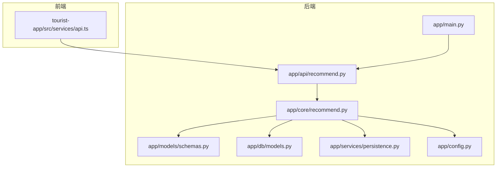
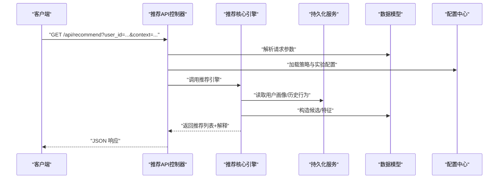
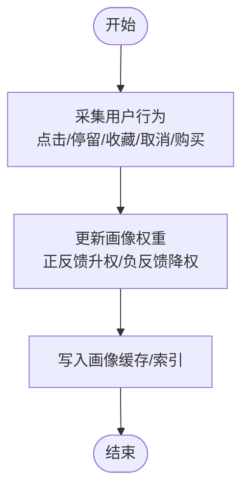
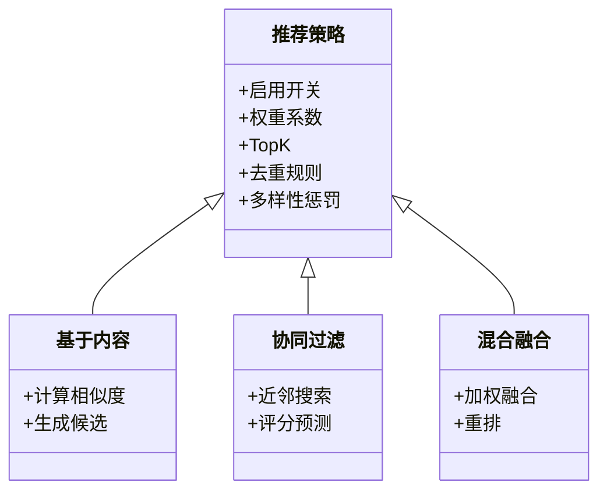
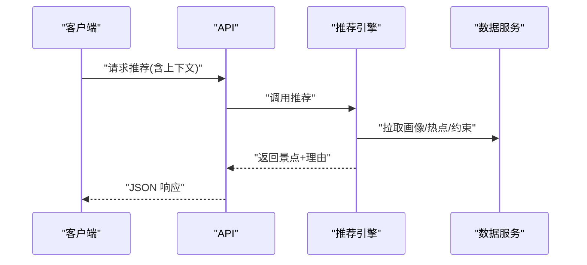
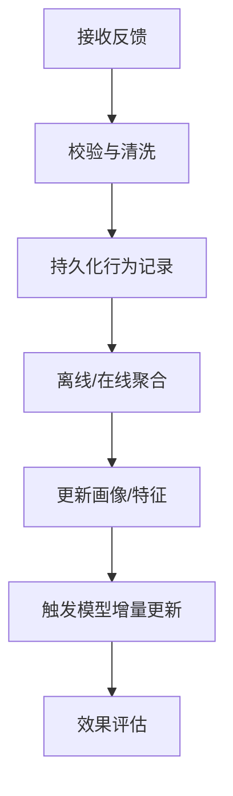
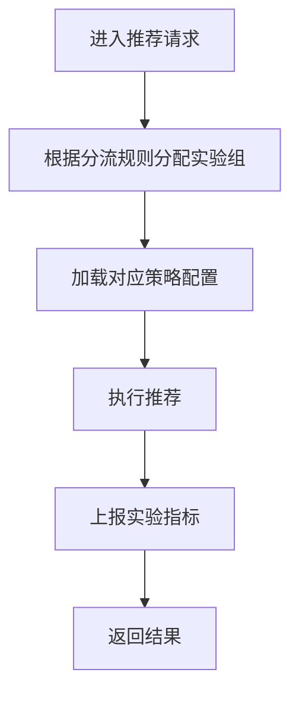
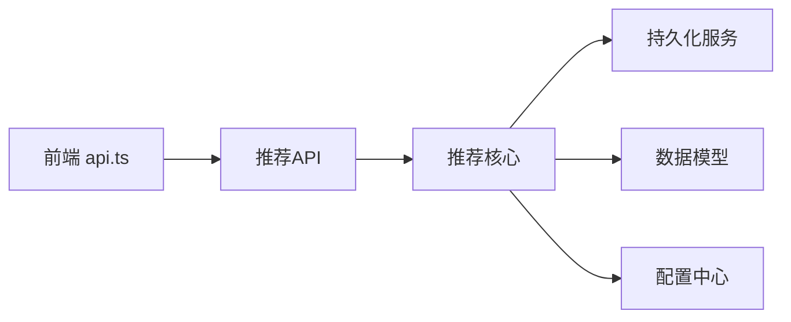

# 推荐系统API

<cite>
**本文引用的文件**   
- [backend/app/api/recommend.py](file://backend/app/api/recommend.py)
- [backend/app/core/recommend.py](file://backend/app/core/recommend.py)
- [backend/app/models/schemas.py](file://backend/app/models/schemas.py)
- [backend/app/db/models.py](file://backend/app/db/models.py)
- [backend/app/services/persistence.py](file://backend/app/services/persistence.py)
- [backend/app/config.py](file://backend/app/config.py)
- [backend/app/main.py](file://backend/app/main.py)
- [frontend/tourist-app/src/services/api.ts](file://frontend/tourist-app/src/services/api.ts)
</cite>

## 目录
1. [简介](#简介)
2. [项目结构](#项目结构)
3. [核心组件](#核心组件)
4. [架构总览](#架构总览)
5. [详细组件分析](#详细组件分析)
6. [依赖关系分析](#依赖关系分析)
7. [性能与可扩展性](#性能与可扩展性)
8. [故障排查指南](#故障排查指南)
9. [结论](#结论)
10. [附录：运营配置指南](#附录：运营配置指南)

## 简介
本文件面向业务运营与技术同学，系统化文档化 SmartTour 项目的“个性化旅游推荐”能力。内容覆盖用户画像分析、景点推荐、路线规划、偏好学习、策略配置（基于内容、协同过滤、混合）、HTTP 接口规范（获取推荐、反馈收集、模型更新、效果评估）、A/B 测试支持、结果可解释性说明、监控指标与调优建议等。

## 项目结构
后端采用分层设计：API 层暴露 HTTP 端点；核心逻辑封装在 core 层；数据模型与持久化服务位于 db 与 services 层；配置集中于 config；前端通过 api.ts 调用后端接口。

图表来源
- [backend/app/main.py](file://backend/app/main.py)
- [backend/app/api/recommend.py](file://backend/app/api/recommend.py)
- [backend/app/core/recommend.py](file://backend/app/core/recommend.py)
- [backend/app/models/schemas.py](file://backend/app/models/schemas.py)
- [backend/app/db/models.py](file://backend/app/db/models.py)
- [backend/app/services/persistence.py](file://backend/app/services/persistence.py)
- [backend/app/config.py](file://backend/app/config.py)
- [frontend/tourist-app/src/services/api.ts](file://frontend/tourist-app/src/services/api.ts)

章节来源
- [backend/app/main.py](file://backend/app/main.py)
- [backend/app/api/recommend.py](file://backend/app/api/recommend.py)
- [backend/app/core/recommend.py](file://backend/app/core/recommend.py)
- [backend/app/models/schemas.py](file://backend/app/models/schemas.py)
- [backend/app/db/models.py](file://backend/app/db/models.py)
- [backend/app/services/persistence.py](file://backend/app/services/persistence.py)
- [backend/app/config.py](file://backend/app/config.py)
- [frontend/tourist-app/src/services/api.ts](file://frontend/tourist-app/src/services/api.ts)

## 核心组件
- API 控制器：负责请求校验、参数解析、路由分发与响应组装。
- 推荐核心：实现用户画像构建、候选生成、排序融合、策略选择与可解释性输出。
- 数据模型与持久化：定义领域实体、存储交互与缓存/索引访问。
- 配置中心：集中管理推荐策略开关、权重、阈值与实验分流参数。

章节来源
- [backend/app/api/recommend.py](file://backend/app/api/recommend.py)
- [backend/app/core/recommend.py](file://backend/app/core/recommend.py)
- [backend/app/models/schemas.py](file://backend/app/models/schemas.py)
- [backend/app/db/models.py](file://backend/app/db/models.py)
- [backend/app/services/persistence.py](file://backend/app/services/persistence.py)
- [backend/app/config.py](file://backend/app/config.py)

## 架构总览
推荐系统整体流程：客户端发起请求 → API 层校验与路由 → 核心层按策略执行推荐 → 读取/写入用户画像与行为数据 → 返回推荐结果与可解释信息。

图表来源
- [backend/app/api/recommend.py](file://backend/app/api/recommend.py)
- [backend/app/core/recommend.py](file://backend/app/core/recommend.py)
- [backend/app/models/schemas.py](file://backend/app/models/schemas.py)
- [backend/app/services/persistence.py](file://backend/app/services/persistence.py)
- [backend/app/config.py](file://backend/app/config.py)

## 详细组件分析

### 用户画像与偏好学习
- 画像维度：兴趣标签、预算区间、出行天数、同行人数、交通偏好、时间偏好、历史点击/收藏/购买等。
- 偏好学习：基于近期行为加权更新画像权重；对负反馈进行降权或屏蔽；支持冷启动默认画像。
- 数据流：行为事件写入持久化 → 异步聚合更新画像 → 推荐时实时读取。

章节来源
- [backend/app/core/recommend.py](file://backend/app/core/recommend.py)
- [backend/app/services/persistence.py](file://backend/app/services/persistence.py)
- [backend/app/db/models.py](file://backend/app/db/models.py)

### 推荐策略与算法
- 基于内容的推荐：依据用户画像与景点属性相似度生成候选。
- 协同过滤：基于用户-物品交互矩阵或序列模式发现相似用户/物品。
- 混合推荐：将内容与协同结果融合，支持权重可调与策略优先级。
- 策略配置：通过配置中心控制各策略开关、权重、TopK、去重规则与多样性惩罚。

图表来源
- [backend/app/core/recommend.py](file://backend/app/core/recommend.py)
- [backend/app/config.py](file://backend/app/config.py)

章节来源
- [backend/app/core/recommend.py](file://backend/app/core/recommend.py)
- [backend/app/config.py](file://backend/app/config.py)

### 景点推荐与路线规划
- 景点推荐：结合上下文（位置、天气、节假日）与用户画像，输出 TopN 景点及理由。
- 路线规划：在景点间考虑距离、开放时间、排队时长、体力消耗等约束，生成多日行程。
- 可解释性：为每个推荐项提供关键因素（如“与您历史偏好匹配度高”、“同类型热门”）。

图表来源
- [backend/app/api/recommend.py](file://backend/app/api/recommend.py)
- [backend/app/core/recommend.py](file://backend/app/core/recommend.py)
- [backend/app/services/persistence.py](file://backend/app/services/persistence.py)

章节来源
- [backend/app/api/recommend.py](file://backend/app/api/recommend.py)
- [backend/app/core/recommend.py](file://backend/app/core/recommend.py)

### 反馈收集与模型更新
- 反馈类型：显式（评分、点赞/踩）、隐式（停留时长、点击、收藏、下单）。
- 更新机制：实时写入行为日志，异步聚合至画像与模型特征库；支持增量训练与回滚。
- 质量保障：异常值检测、去噪、样本均衡。

图表来源
- [backend/app/core/recommend.py](file://backend/app/core/recommend.py)
- [backend/app/services/persistence.py](file://backend/app/services/persistence.py)

章节来源
- [backend/app/core/recommend.py](file://backend/app/core/recommend.py)
- [backend/app/services/persistence.py](file://backend/app/services/persistence.py)

### A/B 测试与实验分流
- 分流维度：用户ID、会话ID、设备指纹等。
- 实验变量：策略版本、权重、TopK、排序器。
- 指标上报：曝光、点击、转化、停留时长等埋点上报至分析服务。

图表来源
- [backend/app/core/recommend.py](file://backend/app/core/recommend.py)
- [backend/app/config.py](file://backend/app/config.py)

章节来源
- [backend/app/core/recommend.py](file://backend/app/core/recommend.py)
- [backend/app/config.py](file://backend/app/config.py)

### 可解释性说明
- 归因维度：用户偏好匹配度、热度/趋势、地理位置、时间窗口、社交热度。
- 展示形式：每条推荐附带“推荐理由”字段，便于前端渲染与运营分析。

章节来源
- [backend/app/core/recommend.py](file://backend/app/core/recommend.py)

## 依赖关系分析
- API 层依赖核心推荐引擎与配置中心。
- 核心引擎依赖持久化服务与数据模型。
- 前端通过 api.ts 调用后端 REST 接口。

图表来源
- [frontend/tourist-app/src/services/api.ts](file://frontend/tourist-app/src/services/api.ts)
- [backend/app/api/recommend.py](file://backend/app/api/recommend.py)
- [backend/app/core/recommend.py](file://backend/app/core/recommend.py)
- [backend/app/services/persistence.py](file://backend/app/services/persistence.py)
- [backend/app/db/models.py](file://backend/app/db/models.py)
- [backend/app/config.py](file://backend/app/config.py)

章节来源
- [frontend/tourist-app/src/services/api.ts](file://frontend/tourist-app/src/services/api.ts)
- [backend/app/api/recommend.py](file://backend/app/api/recommend.py)
- [backend/app/core/recommend.py](file://backend/app/core/recommend.py)
- [backend/app/services/persistence.py](file://backend/app/services/persistence.py)
- [backend/app/db/models.py](file://backend/app/db/models.py)
- [backend/app/config.py](file://backend/app/config.py)

## 性能与可扩展性
- 缓存与索引：热点用户画像与候选集缓存，减少重复计算。
- 异步处理：反馈聚合与模型更新异步化，降低主链路延迟。
- 水平扩展：无状态推荐服务可横向扩容；持久化层使用读写分离与分片。
- 降级策略：当外部依赖不可用时，回退到规则推荐或本地缓存结果。

[本节为通用指导，不直接分析具体文件]

## 故障排查指南
- 常见问题
  - 参数缺失或类型错误：检查请求体与查询参数是否符合模型定义。
  - 推荐结果为空：确认用户画像是否存在、策略是否启用、候选池是否为空。
  - 延迟过高：检查缓存命中率、数据库慢查询、外部依赖超时。
- 定位步骤
  - 查看请求日志与追踪ID。
  - 核对策略配置与实验分组。
  - 检查持久化服务健康状态与容量水位。
- 恢复手段
  - 快速切换策略或关闭某子策略。
  - 清理异常缓存条目。
  - 回滚最近一次模型更新。

章节来源
- [backend/app/api/recommend.py](file://backend/app/api/recommend.py)
- [backend/app/core/recommend.py](file://backend/app/core/recommend.py)
- [backend/app/services/persistence.py](file://backend/app/services/persistence.py)

## 结论
本推荐系统以“策略可配、数据驱动、可解释、可观测”为核心目标，通过清晰的层次划分与模块化设计，支撑个性化旅游场景下的景点推荐与路线规划。配合完善的反馈闭环与A/B实验体系，可实现持续优化与稳定演进。

[本节为总结性内容，不直接分析具体文件]

## 附录：运营配置指南
- 策略开关与权重
  - 基于内容/协同/混合的启用开关与权重比例。
  - TopK、去重规则、多样性惩罚系数。
- 实验与分流
  - 实验名称、版本、分流比例、目标指标。
- 阈值与限制
  - 最小候选数、最大停留时长、地理范围、时间窗。
- 变更流程
  - 灰度发布、回滚策略、影响面评估。

章节来源
- [backend/app/config.py](file://backend/app/config.py)
- [backend/app/core/recommend.py](file://backend/app/core/recommend.py)