# 数据分析API

<cite>
**本文引用的文件**   
- [backend/app/api/analytics.py](file://backend/app/api/analytics.py)
- [backend/app/services/analytics.py](file://backend/app/services/analytics.py)
- [backend/app/db/models.py](file://backend/app/db/models.py)
- [backend/app/db/session.py](file://backend/app/db/session.py)
- [backend/app/main.py](file://backend/app/main.py)
- [frontend/admin-panel/src/views/Analytics/AnalyticsView.vue](file://frontend/admin-panel/src/views/Analytics/AnalyticsView.vue)
- [frontend/admin-panel/src/services/api.ts](file://frontend/admin-panel/src/services/api.ts)
</cite>

## 目录
1. [简介](#简介)
2. [项目结构](#项目结构)
3. [核心组件](#核心组件)
4. [架构总览](#架构总览)
5. [详细组件分析](#详细组件分析)
6. [依赖关系分析](#依赖关系分析)
7. [性能考虑](#性能考虑)
8. [故障排查指南](#故障排查指南)
9. [结论](#结论)
10. [附录](#附录)

## 简介
本文件面向数据分析师与系统管理员，系统化文档化“数据分析API”的设计与使用。内容覆盖：
- 用户行为分析、系统性能监控、业务数据统计的接口设计
- 指标采集方式、计算逻辑与存储结构说明
- 数据可视化相关接口（图表数据获取、趋势分析、报表生成）
- 实时监控接口、告警规则与自定义分析查询
- 数据导出接口与第三方系统集成方案
- 面向使用者的完整查询与分析工具使用指南

## 项目结构
后端采用分层架构：API层暴露REST接口，服务层封装业务逻辑与指标计算，数据访问层通过ORM模型与数据库会话管理持久化数据。前端管理面板提供可视化界面调用上述接口。

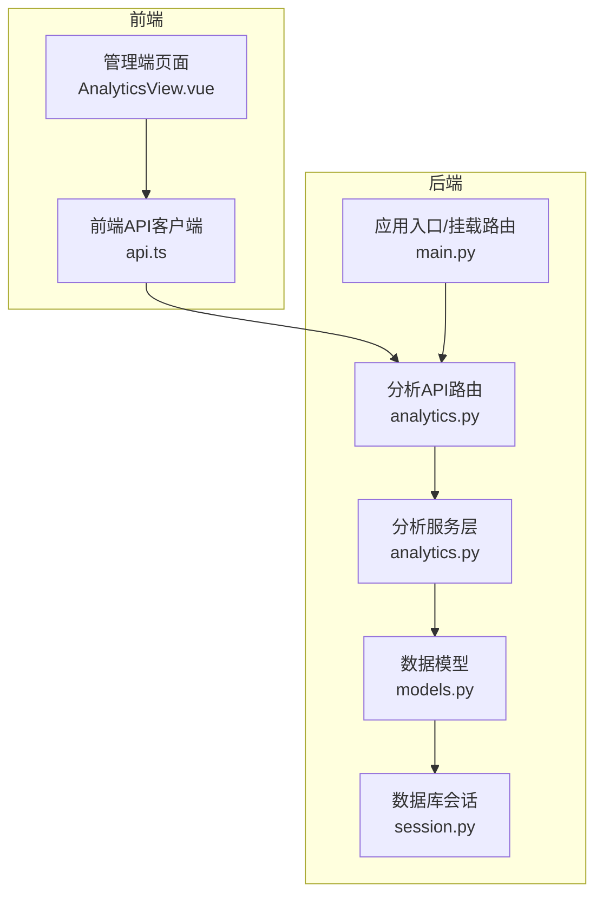

图示来源
- [backend/app/api/analytics.py](file://backend/app/api/analytics.py)
- [backend/app/services/analytics.py](file://backend/app/services/analytics.py)
- [backend/app/db/models.py](file://backend/app/db/models.py)
- [backend/app/db/session.py](file://backend/app/db/session.py)
- [backend/app/main.py](file://backend/app/main.py)
- [frontend/admin-panel/src/views/Analytics/AnalyticsView.vue](file://frontend/admin-panel/src/views/Analytics/AnalyticsView.vue)
- [frontend/admin-panel/src/services/api.ts](file://frontend/admin-panel/src/services/api.ts)

章节来源
- [backend/app/api/analytics.py](file://backend/app/api/analytics.py)
- [backend/app/services/analytics.py](file://backend/app/services/analytics.py)
- [backend/app/db/models.py](file://backend/app/db/models.py)
- [backend/app/db/session.py](file://backend/app/db/session.py)
- [backend/app/main.py](file://backend/app/main.py)
- [frontend/admin-panel/src/views/Analytics/AnalyticsView.vue](file://frontend/admin-panel/src/views/Analytics/AnalyticsView.vue)
- [frontend/admin-panel/src/services/api.ts](file://frontend/admin-panel/src/services/api.ts)

## 核心组件
- 分析API路由：定义用户行为、性能监控、业务统计等REST端点，负责参数校验、权限控制与响应封装。
- 分析服务层：实现指标采集、聚合计算、趋势分析与报表生成等核心逻辑，协调数据访问与外部集成。
- 数据模型与会话：定义事件、指标、报表等实体表结构，并通过会话管理连接数据库。
- 应用入口：注册路由、初始化中间件与全局配置。
- 前端管理面板：提供可视化界面，调用分析API展示图表与报表。

章节来源
- [backend/app/api/analytics.py](file://backend/app/api/analytics.py)
- [backend/app/services/analytics.py](file://backend/app/services/analytics.py)
- [backend/app/db/models.py](file://backend/app/db/models.py)
- [backend/app/db/session.py](file://backend/app/db/session.py)
- [backend/app/main.py](file://backend/app/main.py)
- [frontend/admin-panel/src/views/Analytics/AnalyticsView.vue](file://frontend/admin-panel/src/views/Analytics/AnalyticsView.vue)
- [frontend/admin-panel/src/services/api.ts](file://frontend/admin-panel/src/services/api.ts)

## 架构总览
整体数据流从前端发起请求到后端API路由，服务层进行指标计算与数据聚合，再通过数据模型与会话读写数据库；必要时调用外部系统进行实时或离线处理。

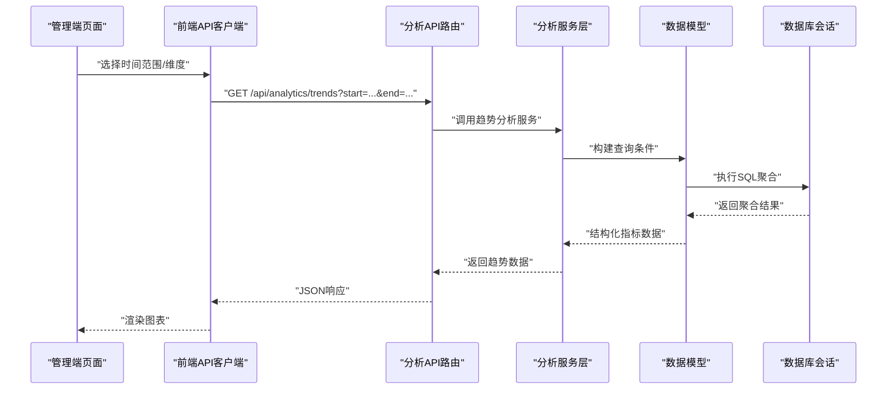

图示来源
- [backend/app/api/analytics.py](file://backend/app/api/analytics.py)
- [backend/app/services/analytics.py](file://backend/app/services/analytics.py)
- [backend/app/db/models.py](file://backend/app/db/models.py)
- [backend/app/db/session.py](file://backend/app/db/session.py)
- [frontend/admin-panel/src/views/Analytics/AnalyticsView.vue](file://frontend/admin-panel/src/views/Analytics/AnalyticsView.vue)
- [frontend/admin-panel/src/services/api.ts](file://frontend/admin-panel/src/services/api.ts)

## 详细组件分析

### 用户行为分析接口
- 功能范围：页面浏览、点击、停留时长、转化漏斗、用户分群等。
- 采集方式：前端埋点上报事件，后端接收并落库；支持批量写入与去重策略。
- 计算逻辑：按时间窗口与维度（如渠道、设备、地域）聚合，计算UV/PV、转化率、留存率等。
- 存储结构：事件明细表、指标汇总表、用户画像表。
- 典型接口：
  - 获取趋势数据：按日/周/月粒度返回关键行为指标序列。
  - 获取分布数据：按维度分组统计计数与占比。
  - 自定义查询：支持多维过滤、排序与分页。

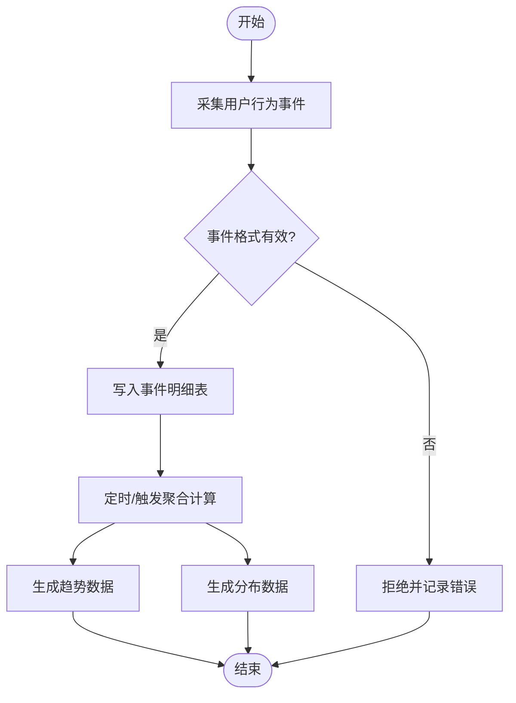

图示来源
- [backend/app/api/analytics.py](file://backend/app/api/analytics.py)
- [backend/app/services/analytics.py](file://backend/app/services/analytics.py)
- [backend/app/db/models.py](file://backend/app/db/models.py)
- [backend/app/db/session.py](file://backend/app/db/session.py)

章节来源
- [backend/app/api/analytics.py](file://backend/app/api/analytics.py)
- [backend/app/services/analytics.py](file://backend/app/services/analytics.py)
- [backend/app/db/models.py](file://backend/app/db/models.py)
- [backend/app/db/session.py](file://backend/app/db/session.py)

### 系统性能监控接口
- 功能范围：CPU/内存/磁盘/网络、请求延迟、错误率、吞吐等。
- 采集方式：服务端探针收集运行时指标，异步写入时序或关系型存储。
- 计算逻辑：滑动窗口聚合、异常检测、阈值比较。
- 存储结构：性能指标表、告警历史表。
- 典型接口：
  - 实时指标：按秒/分钟粒度返回当前系统状态。
  - 历史回溯：按时间范围查询指标曲线。
  - 告警规则：配置阈值与通知通道。

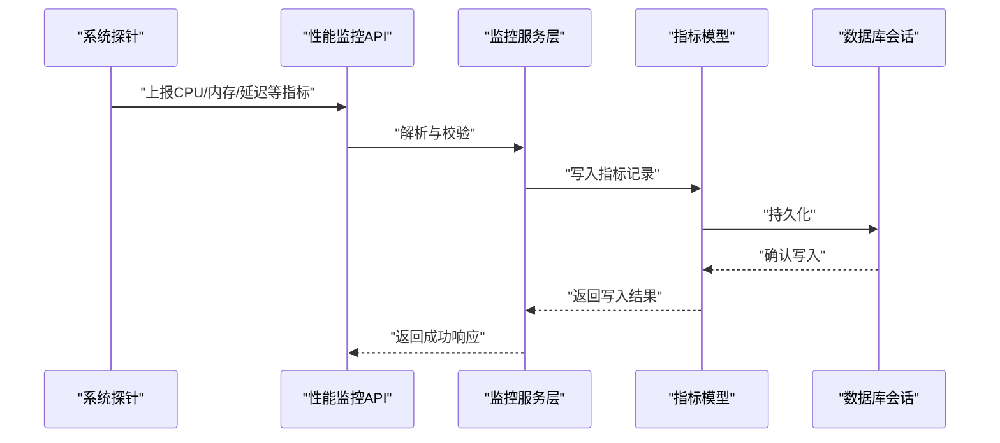

图示来源
- [backend/app/api/analytics.py](file://backend/app/api/analytics.py)
- [backend/app/services/analytics.py](file://backend/app/services/analytics.py)
- [backend/app/db/models.py](file://backend/app/db/models.py)
- [backend/app/db/session.py](file://backend/app/db/session.py)

章节来源
- [backend/app/api/analytics.py](file://backend/app/api/analytics.py)
- [backend/app/services/analytics.py](file://backend/app/services/analytics.py)
- [backend/app/db/models.py](file://backend/app/db/models.py)
- [backend/app/db/session.py](file://backend/app/db/session.py)

### 业务数据统计接口
- 功能范围：订单量、GMV、客单价、复购率、渠道贡献等。
- 采集方式：交易流水、库存变动、营销活动日志等源数据接入。
- 计算逻辑：按业务维度（商品、地区、渠道）聚合，计算KPI与同比环比。
- 存储结构：业务事实表、维度表、汇总快照表。
- 典型接口：
  - 报表生成：按周期输出结构化报表数据。
  - 多维钻取：支持下钻至明细与上卷至汇总。
  - 对比分析：同环比、目标达成率。

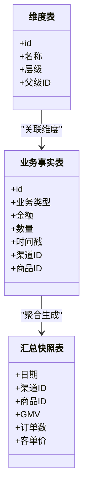

图示来源
- [backend/app/db/models.py](file://backend/app/db/models.py)
- [backend/app/services/analytics.py](file://backend/app/services/analytics.py)

章节来源
- [backend/app/db/models.py](file://backend/app/db/models.py)
- [backend/app/services/analytics.py](file://backend/app/services/analytics.py)

### 数据可视化接口
- 图表数据获取：统一返回折线、柱状、饼图所需的数据结构。
- 趋势分析：支持多序列对比、平滑与插值。
- 报表生成：导出CSV/Excel，支持模板与分页。
- 典型接口：
  - 图表数据：按维度与时间范围返回系列数据。
  - 报表下载：异步任务返回下载链接。
  - 自定义查询：DSL或表单式查询构建器。

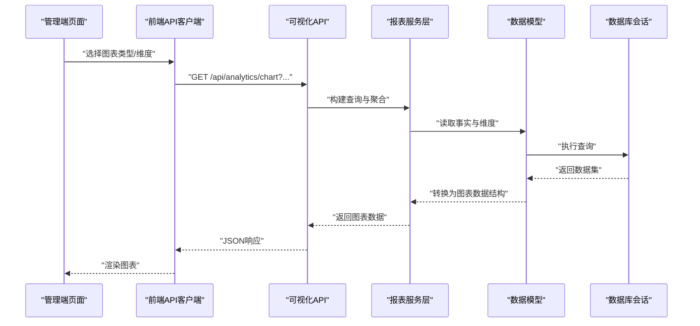

图示来源
- [backend/app/api/analytics.py](file://backend/app/api/analytics.py)
- [backend/app/services/analytics.py](file://backend/app/services/analytics.py)
- [backend/app/db/models.py](file://backend/app/db/models.py)
- [backend/app/db/session.py](file://backend/app/db/session.py)
- [frontend/admin-panel/src/views/Analytics/AnalyticsView.vue](file://frontend/admin-panel/src/views/Analytics/AnalyticsView.vue)
- [frontend/admin-panel/src/services/api.ts](file://frontend/admin-panel/src/services/api.ts)

章节来源
- [backend/app/api/analytics.py](file://backend/app/api/analytics.py)
- [backend/app/services/analytics.py](file://backend/app/services/analytics.py)
- [backend/app/db/models.py](file://backend/app/db/models.py)
- [backend/app/db/session.py](file://backend/app/db/session.py)
- [frontend/admin-panel/src/views/Analytics/AnalyticsView.vue](file://frontend/admin-panel/src/views/Analytics/AnalyticsView.vue)
- [frontend/admin-panel/src/services/api.ts](file://frontend/admin-panel/src/services/api.ts)

### 实时监控与告警
- 实时监控：WebSocket或长轮询推送最新指标。
- 告警规则：阈值、持续时间、静默期、升级策略。
- 通知通道：邮件、短信、企业IM、Webhook。
- 典型接口：
  - 订阅实时流：建立连接后持续接收指标增量。
  - 规则管理：增删改查告警规则。
  - 告警历史：查看触发与恢复记录。

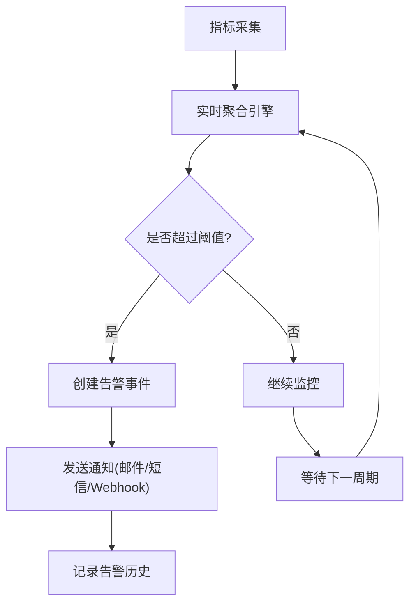

图示来源
- [backend/app/services/analytics.py](file://backend/app/services/analytics.py)
- [backend/app/db/models.py](file://backend/app/db/models.py)
- [backend/app/db/session.py](file://backend/app/db/session.py)

章节来源
- [backend/app/services/analytics.py](file://backend/app/services/analytics.py)
- [backend/app/db/models.py](file://backend/app/db/models.py)
- [backend/app/db/session.py](file://backend/app/db/session.py)

### 自定义分析查询
- 查询构建：支持字段选择、过滤条件、分组、排序、分页。
- 表达式与函数：内置常用统计函数与时间窗口函数。
- 缓存与预计算：热点查询结果缓存，复杂查询物化视图。
- 典型接口：
  - 提交查询任务：异步执行并返回任务ID。
  - 查询结果：按任务ID拉取结果集。
  - 保存为报表：将查询结果保存为可复用报表。

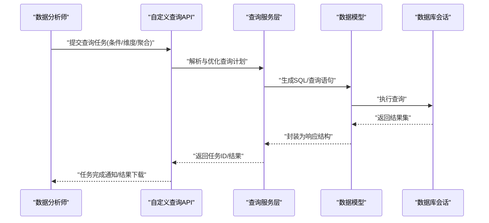

图示来源
- [backend/app/api/analytics.py](file://backend/app/api/analytics.py)
- [backend/app/services/analytics.py](file://backend/app/services/analytics.py)
- [backend/app/db/models.py](file://backend/app/db/models.py)
- [backend/app/db/session.py](file://backend/app/db/session.py)

章节来源
- [backend/app/api/analytics.py](file://backend/app/api/analytics.py)
- [backend/app/services/analytics.py](file://backend/app/services/analytics.py)
- [backend/app/db/models.py](file://backend/app/db/models.py)
- [backend/app/db/session.py](file://backend/app/db/session.py)

### 数据导出与第三方集成
- 导出格式：CSV、Excel、JSON。
- 导出策略：全量导出、增量导出、分页导出。
- 第三方集成：消息队列（Kafka/RabbitMQ）、对象存储（S3/OSS）、BI工具（Tableau/Power BI）。
- 典型接口：
  - 导出任务：创建导出任务并返回下载链接。
  - 同步/异步：根据数据规模选择模式。
  - Webhook回调：导出完成后通知下游系统。

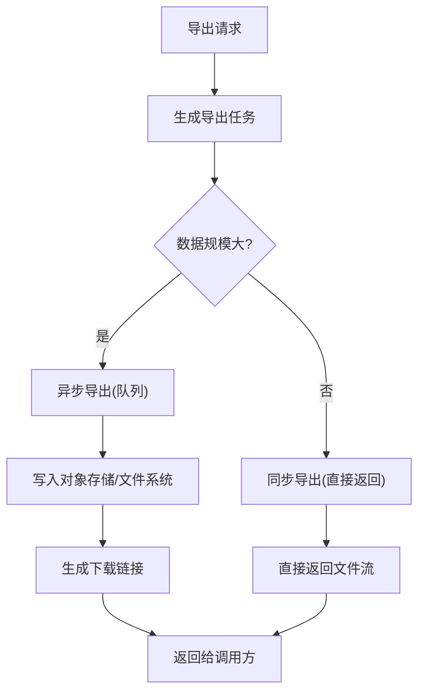

图示来源
- [backend/app/api/analytics.py](file://backend/app/api/analytics.py)
- [backend/app/services/analytics.py](file://backend/app/services/analytics.py)
- [backend/app/db/models.py](file://backend/app/db/models.py)
- [backend/app/db/session.py](file://backend/app/db/session.py)

章节来源
- [backend/app/api/analytics.py](file://backend/app/api/analytics.py)
- [backend/app/services/analytics.py](file://backend/app/services/analytics.py)
- [backend/app/db/models.py](file://backend/app/db/models.py)
- [backend/app/db/session.py](file://backend/app/db/session.py)

### 前端管理面板集成
- 页面组件：AnalyticsView.vue负责渲染图表与交互。
- API客户端：api.ts封装HTTP请求、错误处理与重试。
- 使用流程：选择维度与时间范围，调用分析API，渲染结果。

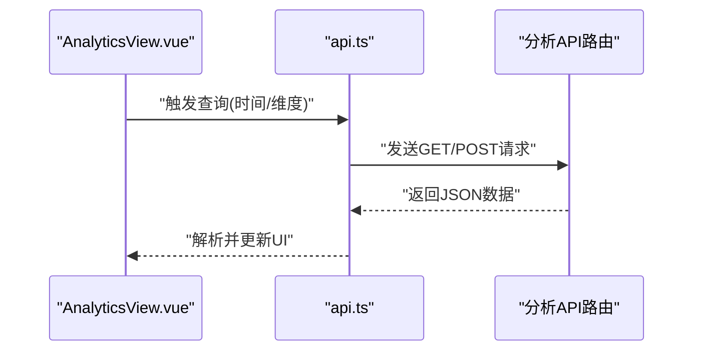

图示来源
- [frontend/admin-panel/src/views/Analytics/AnalyticsView.vue](file://frontend/admin-panel/src/views/Analytics/AnalyticsView.vue)
- [frontend/admin-panel/src/services/api.ts](file://frontend/admin-panel/src/services/api.ts)
- [backend/app/api/analytics.py](file://backend/app/api/analytics.py)

章节来源
- [frontend/admin-panel/src/views/Analytics/AnalyticsView.vue](file://frontend/admin-panel/src/views/Analytics/AnalyticsView.vue)
- [frontend/admin-panel/src/services/api.ts](file://frontend/admin-panel/src/services/api.ts)
- [backend/app/api/analytics.py](file://backend/app/api/analytics.py)

## 依赖关系分析
- 模块耦合：API层依赖服务层，服务层依赖数据模型与会话；前端依赖后端API。
- 外部依赖：数据库、对象存储、消息队列、通知通道。
- 潜在循环：确保服务层不反向依赖API层，避免循环导入。

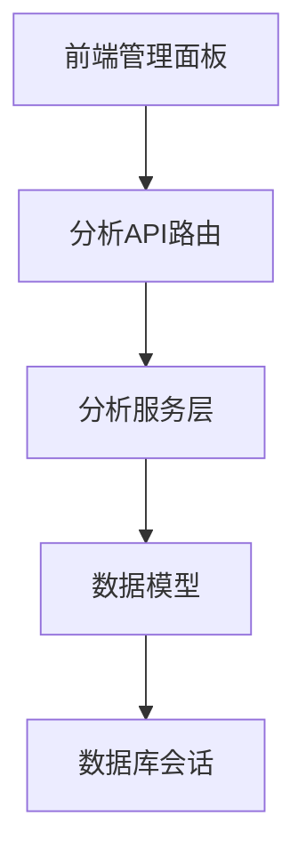

图示来源
- [backend/app/api/analytics.py](file://backend/app/api/analytics.py)
- [backend/app/services/analytics.py](file://backend/app/services/analytics.py)
- [backend/app/db/models.py](file://backend/app/db/models.py)
- [backend/app/db/session.py](file://backend/app/db/session.py)
- [frontend/admin-panel/src/views/Analytics/AnalyticsView.vue](file://frontend/admin-panel/src/views/Analytics/AnalyticsView.vue)
- [frontend/admin-panel/src/services/api.ts](file://frontend/admin-panel/src/services/api.ts)

章节来源
- [backend/app/api/analytics.py](file://backend/app/api/analytics.py)
- [backend/app/services/analytics.py](file://backend/app/services/analytics.py)
- [backend/app/db/models.py](file://backend/app/db/models.py)
- [backend/app/db/session.py](file://backend/app/db/session.py)
- [frontend/admin-panel/src/views/Analytics/AnalyticsView.vue](file://frontend/admin-panel/src/views/Analytics/AnalyticsView.vue)
- [frontend/admin-panel/src/services/api.ts](file://frontend/admin-panel/src/services/api.ts)

## 性能考虑
- 查询优化：合理索引、分区表、物化视图与缓存策略。
- 批处理：批量写入与聚合，降低I/O压力。
- 异步化：耗时任务（导出、复杂查询）异步执行，提升响应性。
- 限流与熔断：保护后端资源，防止雪崩。
- 水平扩展：无状态服务横向扩展，数据库读写分离。

[本节为通用指导，无需具体文件引用]

## 故障排查指南
- 常见问题：
  - 参数校验失败：检查时间范围、维度与必填字段。
  - 数据缺失：确认埋点上报与ETL链路是否正常。
  - 性能问题：定位慢查询与热点指标，调整索引与缓存。
  - 告警风暴：设置静默期与合并策略。
- 诊断步骤：
  - 查看API日志与服务日志，定位错误堆栈。
  - 检查数据库会话与事务状态。
  - 验证外部依赖（存储、消息队列、通知通道）连通性。
  - 使用前端控制台与网络面板观察请求与响应。

章节来源
- [backend/app/api/analytics.py](file://backend/app/api/analytics.py)
- [backend/app/services/analytics.py](file://backend/app/services/analytics.py)
- [backend/app/db/session.py](file://backend/app/db/session.py)

## 结论
本API体系围绕用户行为、系统性能与业务统计三大主题，提供从数据采集、计算、存储到可视化与导出的完整能力。通过清晰的层次划分与可扩展的服务设计，既满足日常分析需求，也支撑大规模监控与告警场景。建议结合业务实际完善指标字典与数据治理规范，持续提升数据质量与可用性。

[本节为总结性内容，无需具体文件引用]

## 附录
- 术语表：
  - UV/PV：独立访客/页面浏览量
  - GMV：商品交易总额
  - 留存率：用户在特定时间段内再次活跃的比例
  - 物化视图：预先计算的查询结果，用于加速复杂查询
- 最佳实践：
  - 明确指标口径与维度定义
  - 建立数据血缘与版本管理
  - 定期审计与清理低价值指标
  - 强化安全与权限控制

[本节为补充信息，无需具体文件引用]