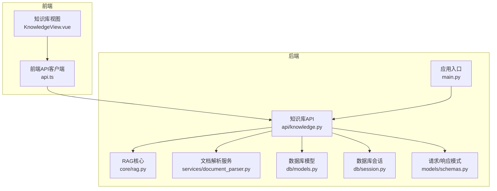
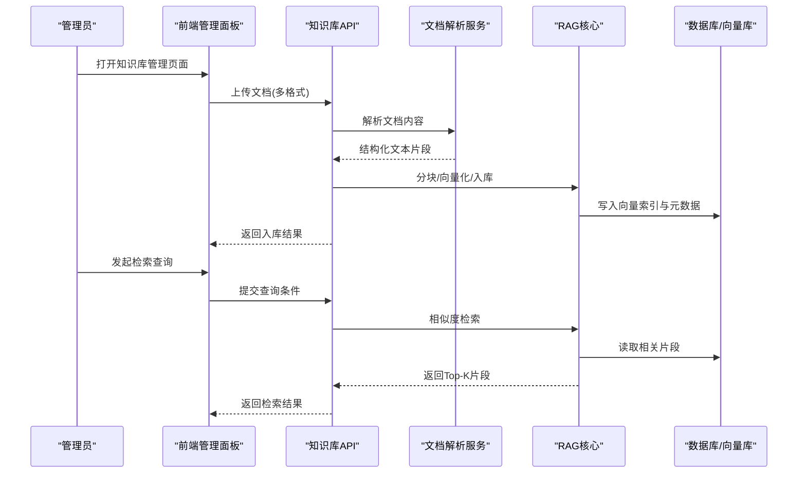
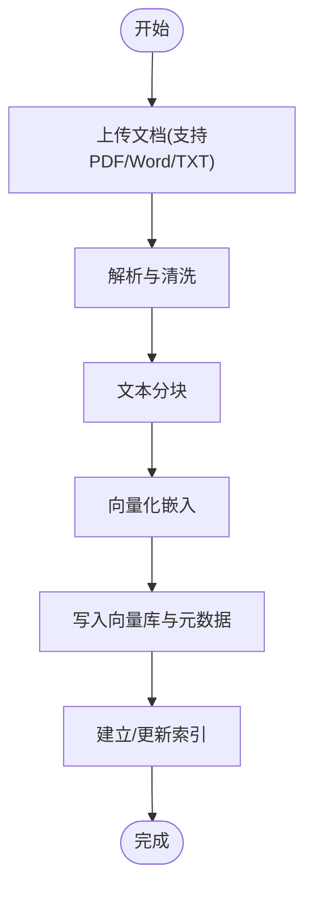
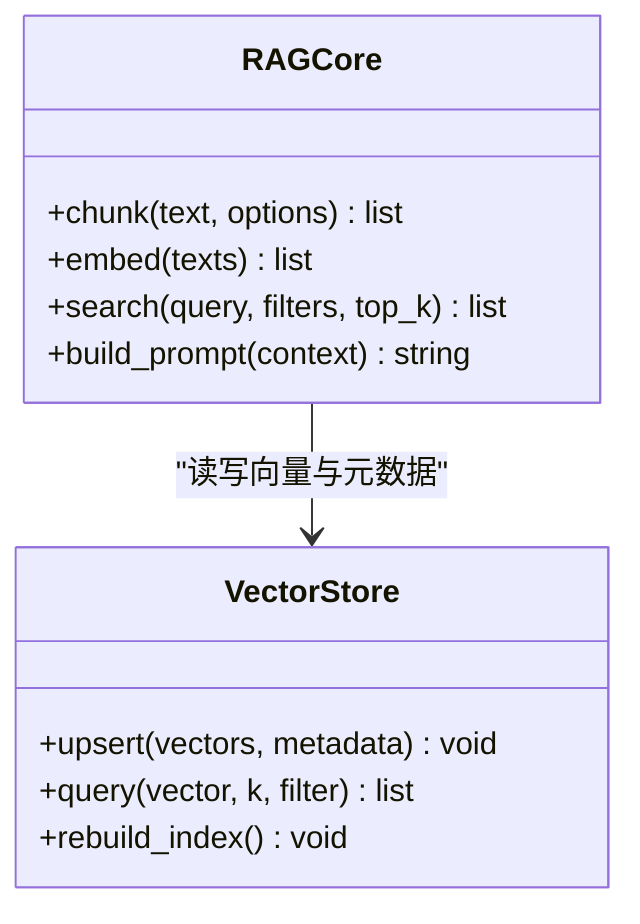
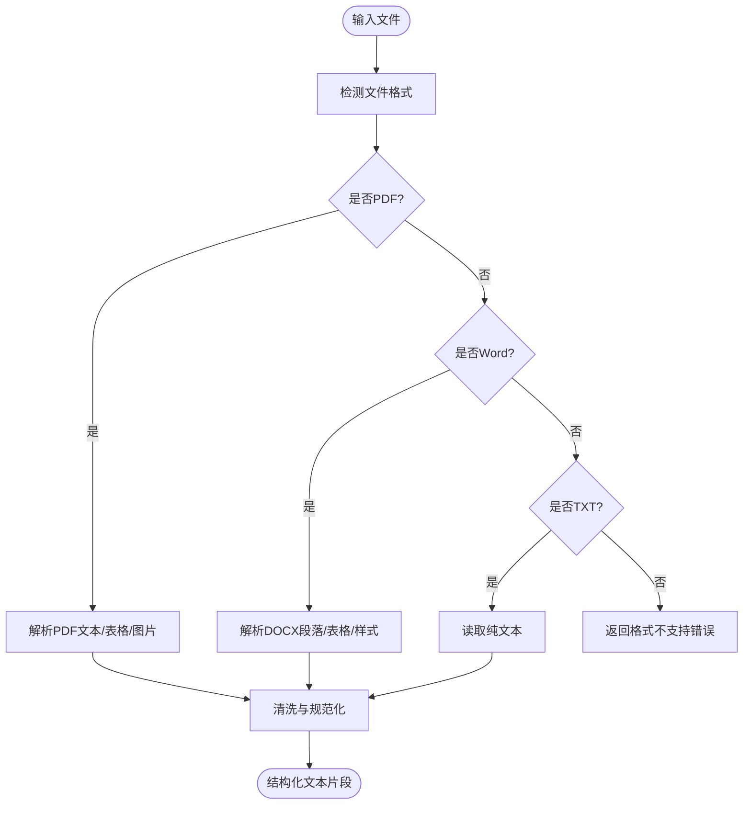
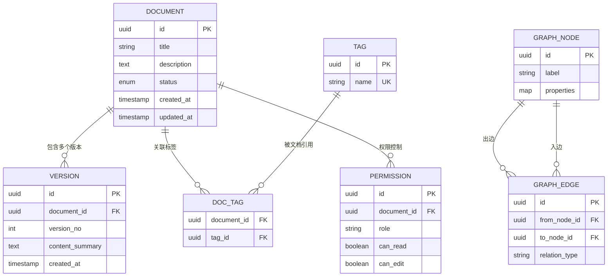
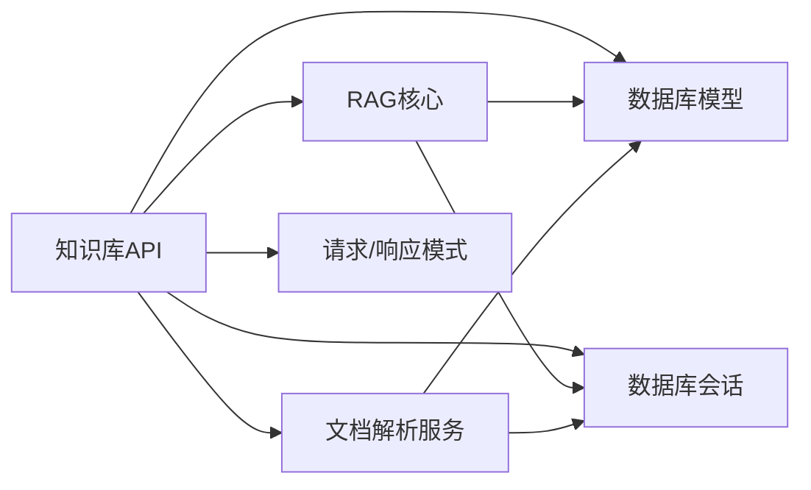

# 知识库管理API

<cite>
**本文引用的文件**   
- [backend/app/api/knowledge.py](file://backend/app/api/knowledge.py)
- [backend/app/core/rag.py](file://backend/app/core/rag.py)
- [backend/app/services/document_parser.py](file://backend/app/services/document_parser.py)
- [backend/app/db/models.py](file://backend/app/db/models.py)
- [backend/app/db/session.py](file://backend/app/db/session.py)
- [backend/app/models/schemas.py](file://backend/app/models/schemas.py)
- [backend/app/main.py](file://backend/app/main.py)
- [frontend/admin-panel/src/views/KnowledgeBase/KnowledgeView.vue](file://frontend/admin-panel/src/views/KnowledgeBase/KnowledgeView.vue)
- [frontend/admin-panel/src/services/api.ts](file://frontend/admin-panel/src/services/api.ts)
</cite>

## 目录
1. [简介](#简介)
2. [项目结构](#项目结构)
3. [核心组件](#核心组件)
4. [架构总览](#架构总览)
5. [详细组件分析](#详细组件分析)
6. [依赖关系分析](#依赖关系分析)
7. [性能考虑](#性能考虑)
8. [故障排除指南](#故障排除指南)
9. [结论](#结论)
10. [附录](#附录)

## 简介
本文件面向管理员与开发者，系统化说明“知识库管理API”的设计与使用方式。该API围绕RAG（检索增强生成）流程构建，覆盖文档上传、解析、向量化存储、检索查询等关键能力，并提供知识库的CRUD操作、分类标签、权限控制、版本管理、批量导入导出、索引重建与性能优化接口；同时提供知识图谱构建与关联关系管理的API说明，以及完整的使用指南与故障排除方法。

## 项目结构
后端采用分层架构：API层暴露REST接口，服务层封装业务逻辑，数据访问层通过ORM模型与数据库会话交互，配置与启动入口位于应用主模块。前端管理面板提供知识库管理界面，调用后端API完成文档管理与检索操作。

图表来源
- [backend/app/main.py](file://backend/app/main.py)
- [backend/app/api/knowledge.py](file://backend/app/api/knowledge.py)
- [backend/app/core/rag.py](file://backend/app/core/rag.py)
- [backend/app/services/document_parser.py](file://backend/app/services/document_parser.py)
- [backend/app/db/models.py](file://backend/app/db/models.py)
- [backend/app/db/session.py](file://backend/app/db/session.py)
- [backend/app/models/schemas.py](file://backend/app/models/schemas.py)
- [frontend/admin-panel/src/views/KnowledgeBase/KnowledgeView.vue](file://frontend/admin-panel/src/views/KnowledgeBase/KnowledgeView.vue)
- [frontend/admin-panel/src/services/api.ts](file://frontend/admin-panel/src/services/api.ts)

章节来源
- [backend/app/main.py](file://backend/app/main.py)
- [backend/app/api/knowledge.py](file://backend/app/api/knowledge.py)
- [backend/app/core/rag.py](file://backend/app/core/rag.py)
- [backend/app/services/document_parser.py](file://backend/app/services/document_parser.py)
- [backend/app/db/models.py](file://backend/app/db/models.py)
- [backend/app/db/session.py](file://backend/app/db/session.py)
- [backend/app/models/schemas.py](file://backend/app/models/schemas.py)
- [frontend/admin-panel/src/views/KnowledgeBase/KnowledgeView.vue](file://frontend/admin-panel/src/views/KnowledgeBase/KnowledgeView.vue)
- [frontend/admin-panel/src/services/api.ts](file://frontend/admin-panel/src/services/api.ts)

## 核心组件
- 知识库API层：负责接收HTTP请求、参数校验、权限检查、编排业务流程并返回标准化响应。
- RAG核心：封装检索增强生成的关键流程，包括文本分块、向量嵌入、相似度检索与结果组装。
- 文档解析服务：统一处理多格式文档（PDF、Word、TXT等）的内容提取与清洗。
- 数据库模型与会话：定义知识库实体（文档、版本、标签、权限、图谱节点与边），并通过会话进行持久化。
- 请求/响应模式：集中定义输入输出数据结构，确保前后端契约一致。
- 前端管理面板：提供可视化操作界面，驱动知识库的日常管理与检索体验。

章节来源
- [backend/app/api/knowledge.py](file://backend/app/api/knowledge.py)
- [backend/app/core/rag.py](file://backend/app/core/rag.py)
- [backend/app/services/document_parser.py](file://backend/app/services/document_parser.py)
- [backend/app/db/models.py](file://backend/app/db/models.py)
- [backend/app/db/session.py](file://backend/app/db/session.py)
- [backend/app/models/schemas.py](file://backend/app/models/schemas.py)
- [frontend/admin-panel/src/views/KnowledgeBase/KnowledgeView.vue](file://frontend/admin-panel/src/views/KnowledgeBase/KnowledgeView.vue)
- [frontend/admin-panel/src/services/api.ts](file://frontend/admin-panel/src/services/api.ts)

## 架构总览
知识库管理API的整体架构遵循“API层—服务层—数据层”的分层设计，结合RAG核心能力实现从文档到可检索知识的端到端流水线。

图表来源
- [backend/app/api/knowledge.py](file://backend/app/api/knowledge.py)
- [backend/app/services/document_parser.py](file://backend/app/services/document_parser.py)
- [backend/app/core/rag.py](file://backend/app/core/rag.py)
- [backend/app/db/models.py](file://backend/app/db/models.py)
- [backend/app/db/session.py](file://backend/app/db/session.py)

## 详细组件分析

### 知识库API（CRUD、标签、权限、版本、批量、索引、优化）
- 文档管理
  - 创建/更新/删除文档条目，支持元数据（标题、描述、作者、来源等）。
  - 文档状态流转（草稿、已发布、归档）。
- 分类标签
  - 为文档添加/移除标签，支持标签聚合与筛选。
- 权限控制
  - 基于角色的访问控制（RBAC），支持文档级可见性与编辑权限。
- 版本管理
  - 同一文档的多版本记录，支持回滚与差异对比。
- 批量导入导出
  - 批量上传与解析，失败重试与进度回调；导出为ZIP或CSV。
- 索引重建与性能优化
  - 触发全量/增量索引重建；提供缓存开关、并发度、批大小等调优参数。

图表来源
- [backend/app/api/knowledge.py](file://backend/app/api/knowledge.py)
- [backend/app/services/document_parser.py](file://backend/app/services/document_parser.py)
- [backend/app/core/rag.py](file://backend/app/core/rag.py)
- [backend/app/db/models.py](file://backend/app/db/models.py)

章节来源
- [backend/app/api/knowledge.py](file://backend/app/api/knowledge.py)
- [backend/app/models/schemas.py](file://backend/app/models/schemas.py)

### RAG核心（检索增强生成）
- 文本分块：按段落/语义边界切分，避免过度碎片化。
- 向量化嵌入：将文本片段映射为高维向量，便于相似度检索。
- 相似度检索：在向量库中执行Top-K检索，结合元数据过滤。
- 结果组装：合并片段、去重、排序与摘要提示构造。

图表来源
- [backend/app/core/rag.py](file://backend/app/core/rag.py)
- [backend/app/db/models.py](file://backend/app/db/models.py)

章节来源
- [backend/app/core/rag.py](file://backend/app/core/rag.py)
- [backend/app/db/models.py](file://backend/app/db/models.py)

### 文档解析服务（多格式支持）
- 支持格式：PDF、Word（doc/docx）、TXT，可扩展至其他格式。
- 内容提取：抽取正文、表格、图片OCR（可选）、超链接与页码信息。
- 清洗策略：去除噪声、统一编码、规范化空白与特殊字符。
- 错误处理：对损坏文件、加密文档、超大文件进行异常捕获与降级处理。

图表来源
- [backend/app/services/document_parser.py](file://backend/app/services/document_parser.py)

章节来源
- [backend/app/services/document_parser.py](file://backend/app/services/document_parser.py)

### 数据库模型与会话（实体、关系、事务）
- 实体定义：文档、版本、标签、权限、图谱节点与边、索引任务等。
- 关系建模：文档与版本一对多；文档与标签多对多；权限与角色关联；图谱节点与边构成有向图。
- 会话管理：连接池、事务边界、重试与超时控制。

图表来源
- [backend/app/db/models.py](file://backend/app/db/models.py)
- [backend/app/db/session.py](file://backend/app/db/session.py)

章节来源
- [backend/app/db/models.py](file://backend/app/db/models.py)
- [backend/app/db/session.py](file://backend/app/db/session.py)

### 请求/响应模式（契约）
- 统一字段：分页、排序、过滤、时间戳、状态码与消息。
- 文档对象：包含基础元数据、版本列表、标签集合、权限标识。
- 检索对象：包含查询词、过滤条件、Top-K数量、上下文片段与评分。

章节来源
- [backend/app/models/schemas.py](file://backend/app/models/schemas.py)

### 前端管理面板（知识库视图与API客户端）
- 知识库视图：展示文档列表、上传表单、检索框、标签筛选与版本切换。
- API客户端：封装HTTP请求、鉴权头、错误重试与加载状态。

章节来源
- [frontend/admin-panel/src/views/KnowledgeBase/KnowledgeView.vue](file://frontend/admin-panel/src/views/KnowledgeBase/KnowledgeView.vue)
- [frontend/admin-panel/src/services/api.ts](file://frontend/admin-panel/src/services/api.ts)

## 依赖关系分析
- API层依赖RAG核心与文档解析服务，协调数据流与业务规则。
- RAG核心依赖向量库与元数据存储，负责检索与结果组装。
- 文档解析服务独立于RAG，专注于内容提取与清洗。
- 数据库模型与会话为所有数据操作提供持久化能力。
- 前端通过API客户端与后端交互，形成完整的用户操作闭环。

图表来源
- [backend/app/api/knowledge.py](file://backend/app/api/knowledge.py)
- [backend/app/core/rag.py](file://backend/app/core/rag.py)
- [backend/app/services/document_parser.py](file://backend/app/services/document_parser.py)
- [backend/app/db/models.py](file://backend/app/db/models.py)
- [backend/app/db/session.py](file://backend/app/db/session.py)
- [backend/app/models/schemas.py](file://backend/app/models/schemas.py)

章节来源
- [backend/app/api/knowledge.py](file://backend/app/api/knowledge.py)
- [backend/app/core/rag.py](file://backend/app/core/rag.py)
- [backend/app/services/document_parser.py](file://backend/app/services/document_parser.py)
- [backend/app/db/models.py](file://backend/app/db/models.py)
- [backend/app/db/session.py](file://backend/app/db/session.py)
- [backend/app/models/schemas.py](file://backend/app/models/schemas.py)

## 性能考虑
- 分块策略：根据文档类型与语义边界调整分块大小，平衡检索精度与召回率。
- 向量化批处理：批量嵌入减少网络往返与计算开销。
- 索引重建：支持增量更新与全量重建，建议在低峰期执行。
- 缓存与预取：热点查询结果缓存，提升响应速度。
- 并发与限流：合理设置并发度与队列长度，防止资源耗尽。
- 监控与告警：记录耗时、错误率与资源占用，及时发现问题。

[本节为通用指导，不直接分析具体文件]

## 故障排除指南
- 上传失败
  - 检查文件格式支持与文件大小限制。
  - 查看解析日志，确认是否存在损坏文件或加密保护。
- 解析异常
  - 验证编码与字符集，尝试转换为UTF-8。
  - 对大文档启用分段解析与内存限制。
- 检索无结果
  - 确认索引是否成功重建，检查向量库连通性。
  - 调整Top-K与相似度阈值，扩大检索范围。
- 权限问题
  - 核对当前用户的角色与文档权限配置。
  - 检查权限中间件与路由守卫是否正确生效。
- 性能退化
  - 观察CPU/内存/IO指标，评估是否需要扩容或优化分块策略。
  - 清理过期索引与冗余数据，定期维护。

章节来源
- [backend/app/api/knowledge.py](file://backend/app/api/knowledge.py)
- [backend/app/services/document_parser.py](file://backend/app/services/document_parser.py)
- [backend/app/core/rag.py](file://backend/app/core/rag.py)
- [backend/app/db/models.py](file://backend/app/db/models.py)
- [backend/app/db/session.py](file://backend/app/db/session.py)

## 结论
知识库管理API以清晰的层次结构与完善的RAG能力为核心，提供了从文档上传、解析、向量化到检索查询的完整链路，并配套了CRUD、标签、权限、版本、批量、索引与性能优化等管理能力。通过合理的分块与索引策略、严格的权限控制与完善的监控告警，系统可在复杂场景下稳定运行，满足企业级知识库的管理与使用需求。

[本节为总结性内容，不直接分析具体文件]

## 附录

### 管理员使用指南
- 初始化与准备
  - 部署后端服务与数据库/向量库，确认连接正常。
  - 配置管理员账号与角色权限。
- 文档管理
  - 上传单个或多个文档，选择目标分类与标签。
  - 查看文档详情、版本历史与权限设置。
- 检索与问答
  - 在检索框输入关键词，调整Top-K与过滤条件。
  - 查看命中片段与来源定位，必要时进行二次筛选。
- 批量操作
  - 使用批量导入模板，上传ZIP包或CSV清单。
  - 监控导入进度与失败重试，下载失败报告。
- 索引维护
  - 执行增量或全量索引重建，关注耗时与资源占用。
  - 定期清理无效文档与过期版本，释放存储空间。
- 知识图谱
  - 在文档详情页添加节点与边，构建领域知识关联。
  - 使用图谱查询接口探索实体关系与路径。

[本节为概念性指导，不直接分析具体文件]