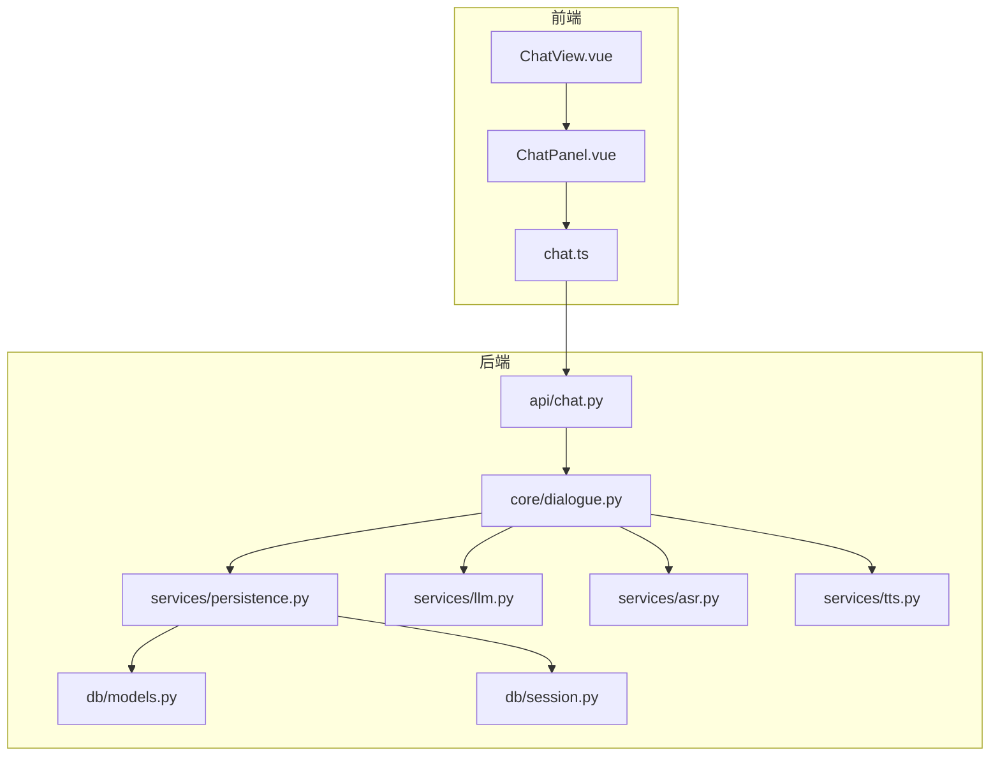
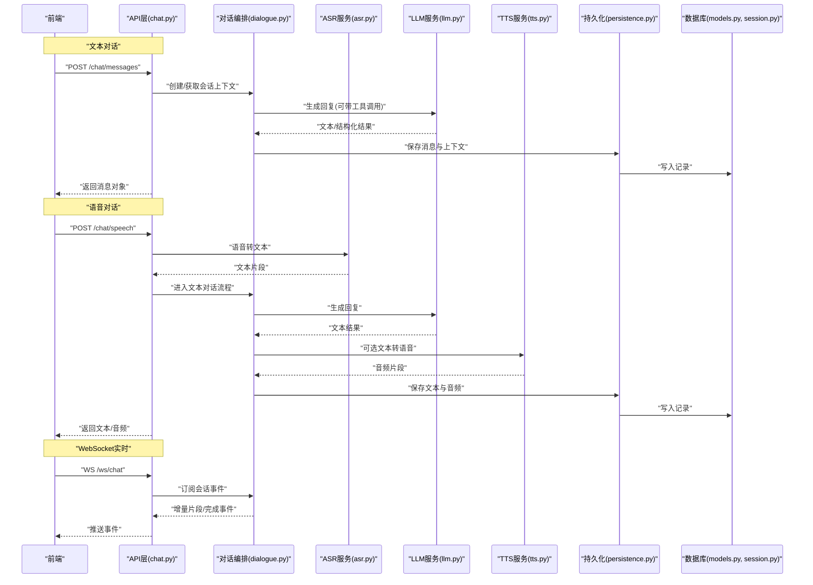
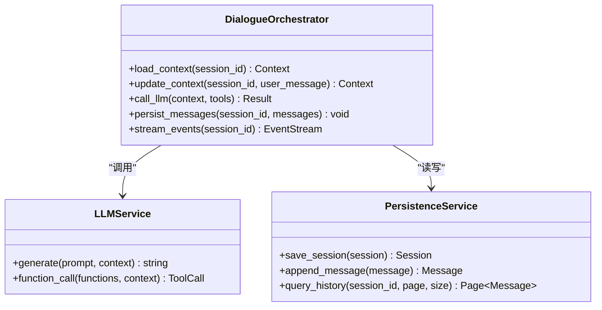
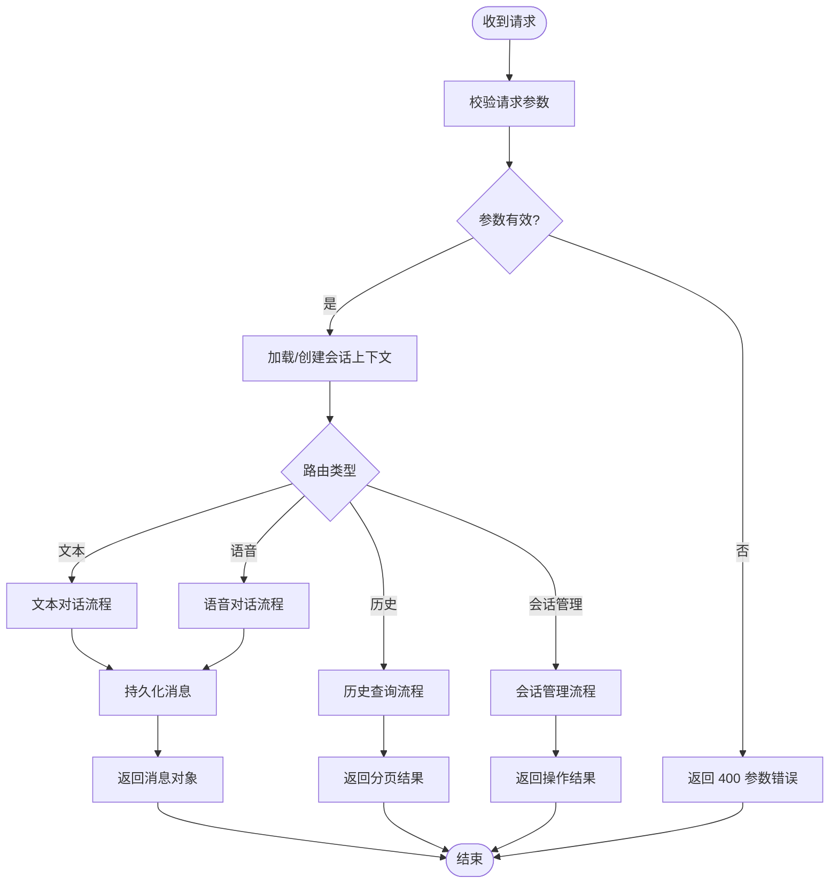
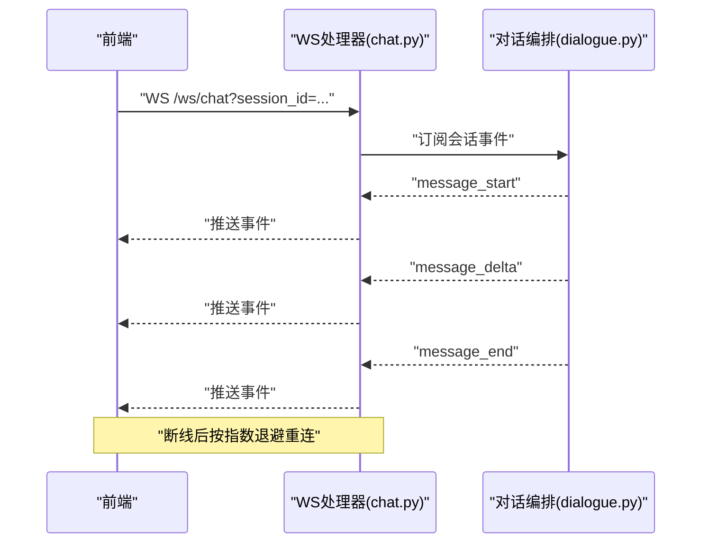
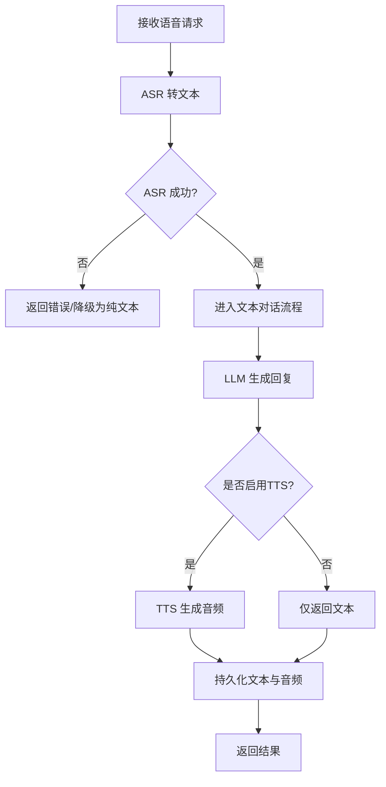
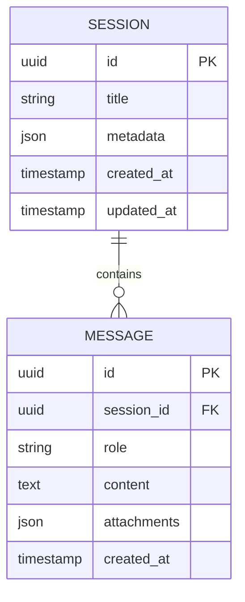
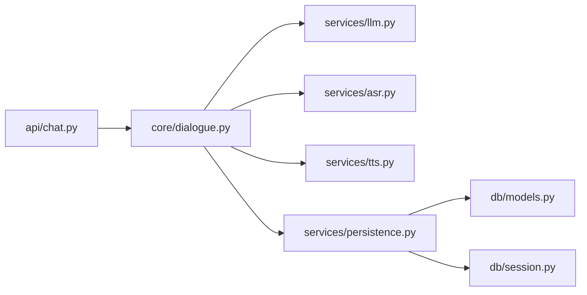

# 聊天对话API

<cite>
**本文引用的文件**   
- [backend/app/api/chat.py](file://backend/app/api/chat.py)
- [backend/app/core/dialogue.py](file://backend/app/core/dialogue.py)
- [backend/app/services/persistence.py](file://backend/app/services/persistence.py)
- [backend/app/db/models.py](file://backend/app/db/models.py)
- [backend/app/db/session.py](file://backend/app/db/session.py)
- [backend/app/services/asr.py](file://backend/app/services/asr.py)
- [backend/app/services/tts.py](file://backend/app/services/tts.py)
- [backend/app/services/llm.py](file://backend/app/services/llm.py)
- [frontend/tourist-app/src/stores/chat.ts](file://frontend/tourist-app/src/stores/chat.ts)
- [frontend/tourist-app/src/components/ChatPanel/ChatPanel.vue](file://frontend/tourist-app/src/components/ChatPanel/ChatPanel.vue)
- [frontend/tourist-app/src/views/ChatView.vue](file://frontend/tourist-app/src/views/ChatView.vue)
</cite>

## 目录
1. [简介](#简介)
2. [项目结构](#项目结构)
3. [核心组件](#核心组件)
4. [架构总览](#架构总览)
5. [详细组件分析](#详细组件分析)
6. [依赖关系分析](#依赖关系分析)
7. [性能考虑](#性能考虑)
8. [故障排查指南](#故障排查指南)
9. [结论](#结论)
10. [附录](#附录)

## 简介
本文件面向前端与后端开发者，系统化文档化智能旅游项目的“聊天对话API”。内容覆盖：
- 文本对话、语音对话（ASR/TTS）、多轮对话处理
- 对话状态管理、上下文保持与会话持久化
- HTTP 端点定义（消息发送、接收、历史查询、会话管理）
- WebSocket 实时通信接口（连接建立、消息推送、断线重连）
- 请求参数校验、响应格式与错误处理策略
- 前端集成示例与最佳实践

## 项目结构
本项目采用前后端分离架构。后端基于 Python 提供 REST 与 WebSocket 服务；前端使用 Vue 3 + TypeScript 构建游客应用与管理后台。与聊天相关的核心代码分布如下：
- API 层：HTTP 路由与请求处理
- 核心逻辑：对话编排、上下文管理
- 服务层：LLM、ASR、TTS、持久化
- 数据层：数据库模型与会话管理
- 前端：聊天面板、语音输入、状态存储与视图

图表来源
- [backend/app/api/chat.py](file://backend/app/api/chat.py)
- [backend/app/core/dialogue.py](file://backend/app/core/dialogue.py)
- [backend/app/services/persistence.py](file://backend/app/services/persistence.py)
- [backend/app/services/llm.py](file://backend/app/services/llm.py)
- [backend/app/services/asr.py](file://backend/app/services/asr.py)
- [backend/app/services/tts.py](file://backend/app/services/tts.py)
- [backend/app/db/models.py](file://backend/app/db/models.py)
- [backend/app/db/session.py](file://backend/app/db/session.py)
- [frontend/tourist-app/src/views/ChatView.vue](file://frontend/tourist-app/src/views/ChatView.vue)
- [frontend/tourist-app/src/components/ChatPanel/ChatPanel.vue](file://frontend/tourist-app/src/components/ChatPanel/ChatPanel.vue)
- [frontend/tourist-app/src/stores/chat.ts](file://frontend/tourist-app/src/stores/chat.ts)

章节来源
- [backend/app/api/chat.py](file://backend/app/api/chat.py)
- [backend/app/core/dialogue.py](file://backend/app/core/dialogue.py)
- [backend/app/services/persistence.py](file://backend/app/services/persistence.py)
- [backend/app/db/models.py](file://backend/app/db/models.py)
- [backend/app/db/session.py](file://backend/app/db/session.py)
- [backend/app/services/asr.py](file://backend/app/services/asr.py)
- [backend/app/services/tts.py](file://backend/app/services/tts.py)
- [backend/app/services/llm.py](file://backend/app/services/llm.py)
- [frontend/tourist-app/src/stores/chat.ts](file://frontend/tourist-app/src/stores/chat.ts)
- [frontend/tourist-app/src/components/ChatPanel/ChatPanel.vue](file://frontend/tourist-app/src/components/ChatPanel/ChatPanel.vue)
- [frontend/tourist-app/src/views/ChatView.vue](file://frontend/tourist-app/src/views/ChatView.vue)

## 核心组件
- 对话控制器（API 层）
  - 职责：暴露 HTTP 与 WebSocket 接口，解析请求参数，调用核心对话编排器，返回统一响应或推送事件。
  - 关键能力：文本/语音消息收发、历史查询、会话管理、WebSocket 事件分发。
- 对话编排器（核心层）
  - 职责：维护对话上下文、多轮对话状态、意图识别与工具调用编排、结果组装。
  - 关键能力：上下文窗口管理、记忆压缩、流式输出控制。
- 服务层
  - LLM：生成回复、结构化输出、函数调用。
  - ASR：语音转文本。
  - TTS：文本转语音。
  - 持久化：会话与消息落库、索引与分页。
- 数据层
  - 模型：会话、消息、附件等实体定义。
  - 会话：数据库连接与事务管理。

章节来源
- [backend/app/api/chat.py](file://backend/app/api/chat.py)
- [backend/app/core/dialogue.py](file://backend/app/core/dialogue.py)
- [backend/app/services/llm.py](file://backend/app/services/llm.py)
- [backend/app/services/asr.py](file://backend/app/services/asr.py)
- [backend/app/services/tts.py](file://backend/app/services/tts.py)
- [backend/app/services/persistence.py](file://backend/app/services/persistence.py)
- [backend/app/db/models.py](file://backend/app/db/models.py)
- [backend/app/db/session.py](file://backend/app/db/session.py)

## 架构总览
下图展示了从前端到后端的端到端流程，包括文本与语音路径以及 WebSocket 实时通道。

图表来源
- [backend/app/api/chat.py](file://backend/app/api/chat.py)
- [backend/app/core/dialogue.py](file://backend/app/core/dialogue.py)
- [backend/app/services/asr.py](file://backend/app/services/asr.py)
- [backend/app/services/llm.py](file://backend/app/services/llm.py)
- [backend/app/services/tts.py](file://backend/app/services/tts.py)
- [backend/app/services/persistence.py](file://backend/app/services/persistence.py)
- [backend/app/db/models.py](file://backend/app/db/models.py)
- [backend/app/db/session.py](file://backend/app/db/session.py)

## 详细组件分析

### 组件A：对话编排器（核心层）
对话编排器负责在多轮对话中维护上下文、协调外部服务并产出最终结果。其典型职责包括：
- 会话上下文加载与更新
- 用户意图理解与工具调用编排
- 流式输出控制与事件分发
- 错误降级与重试策略

图表来源
- [backend/app/core/dialogue.py](file://backend/app/core/dialogue.py)
- [backend/app/services/llm.py](file://backend/app/services/llm.py)
- [backend/app/services/persistence.py](file://backend/app/services/persistence.py)

章节来源
- [backend/app/core/dialogue.py](file://backend/app/core/dialogue.py)
- [backend/app/services/llm.py](file://backend/app/services/llm.py)
- [backend/app/services/persistence.py](file://backend/app/services/persistence.py)

### 组件B：HTTP 聊天接口（API 层）
本节列出所有聊天相关 HTTP 端点，包含方法、路径、用途、请求体字段、响应结构与错误码。

- 文本对话
  - POST /chat/messages
    - 用途：发送文本消息并获取回复
    - 请求体关键字段：session_id、content、attachments（可选）
    - 响应体关键字段：message_id、role、content、created_at、next_suggestions（可选）
    - 错误码：400 参数校验失败、404 会话不存在、500 内部错误
- 语音对话
  - POST /chat/speech
    - 用途：上传语音片段，返回文本与可选音频
    - 请求体关键字段：session_id、audio_base64 或 audio_url、language（可选）
    - 响应体关键字段：text、audio_url（可选）、message_id
    - 错误码：400 音频格式不支持、413 过大、500 服务异常
- 历史查询
  - GET /chat/history
    - 用途：分页查询会话历史
    - 查询参数：session_id、page、size、order_by、direction
    - 响应体关键字段：items、total、page、size
    - 错误码：400 参数非法、404 会话不存在
- 会话管理
  - POST /chat/sessions
    - 用途：创建新会话
    - 请求体关键字段：title（可选）、metadata（可选）
    - 响应体关键字段：session_id、title、created_at
    - 错误码：400 参数非法、500 内部错误
  - DELETE /chat/sessions/{session_id}
    - 用途：删除会话及其历史
    - 响应体：空或操作结果
    - 错误码：404 会话不存在、500 内部错误

图表来源
- [backend/app/api/chat.py](file://backend/app/api/chat.py)
- [backend/app/services/persistence.py](file://backend/app/services/persistence.py)

章节来源
- [backend/app/api/chat.py](file://backend/app/api/chat.py)
- [backend/app/services/persistence.py](file://backend/app/services/persistence.py)

### 组件C：WebSocket 实时通信接口
- 连接建立
  - WS /ws/chat?session_id=...
  - 客户端在 URL 中携带 session_id，服务端据此绑定会话上下文
- 消息推送
  - 服务端事件类型：
    - message_start：开始生成
    - message_delta：增量片段
    - message_end：完整结果
    - error：错误事件
- 断线重连
  - 客户端实现指数退避重连，附带 session_id 恢复上下文
  - 服务端对重复连接进行去重与幂等处理

图表来源
- [backend/app/api/chat.py](file://backend/app/api/chat.py)
- [backend/app/core/dialogue.py](file://backend/app/core/dialogue.py)

章节来源
- [backend/app/api/chat.py](file://backend/app/api/chat.py)
- [backend/app/core/dialogue.py](file://backend/app/core/dialogue.py)

### 组件D：语音对话链路（ASR/TTS）
- ASR：将语音片段转为文本，支持语言参数与置信度返回
- TTS：将文本转为音频，支持语速、音色等参数
- 错误处理：超时、格式不支持、服务不可用时的降级策略（仅返回文本）

图表来源
- [backend/app/services/asr.py](file://backend/app/services/asr.py)
- [backend/app/services/tts.py](file://backend/app/services/tts.py)
- [backend/app/services/llm.py](file://backend/app/services/llm.py)
- [backend/app/services/persistence.py](file://backend/app/services/persistence.py)

章节来源
- [backend/app/services/asr.py](file://backend/app/services/asr.py)
- [backend/app/services/tts.py](file://backend/app/services/tts.py)
- [backend/app/services/llm.py](file://backend/app/services/llm.py)
- [backend/app/services/persistence.py](file://backend/app/services/persistence.py)

### 组件E：数据模型与会话持久化
- 数据模型
  - 会话：标识、标题、元数据、时间戳
  - 消息：角色、内容、附件、时间戳、关联会话
- 持久化服务
  - 会话创建/删除
  - 消息追加与分页查询
  - 上下文快照与压缩

图表来源
- [backend/app/db/models.py](file://backend/app/db/models.py)
- [backend/app/services/persistence.py](file://backend/app/services/persistence.py)

章节来源
- [backend/app/db/models.py](file://backend/app/db/models.py)
- [backend/app/services/persistence.py](file://backend/app/services/persistence.py)
- [backend/app/db/session.py](file://backend/app/db/session.py)

## 依赖关系分析
- 耦合与内聚
  - API 层仅负责协议适配与参数校验，业务逻辑集中在对话编排器，内聚性良好
  - 服务层通过接口解耦 LLM/ASR/TTS/Persistence，便于替换与测试
- 外部依赖
  - LLM 服务：可能为本地模型或远程 API
  - ASR/TTS：第三方语音服务或本地引擎
  - 数据库：用于会话与消息持久化
- 潜在循环依赖
  - 当前分层清晰，未见循环导入风险

图表来源
- [backend/app/api/chat.py](file://backend/app/api/chat.py)
- [backend/app/core/dialogue.py](file://backend/app/core/dialogue.py)
- [backend/app/services/llm.py](file://backend/app/services/llm.py)
- [backend/app/services/asr.py](file://backend/app/services/asr.py)
- [backend/app/services/tts.py](file://backend/app/services/tts.py)
- [backend/app/services/persistence.py](file://backend/app/services/persistence.py)
- [backend/app/db/models.py](file://backend/app/db/models.py)
- [backend/app/db/session.py](file://backend/app/db/session.py)

章节来源
- [backend/app/api/chat.py](file://backend/app/api/chat.py)
- [backend/app/core/dialogue.py](file://backend/app/core/dialogue.py)
- [backend/app/services/llm.py](file://backend/app/services/llm.py)
- [backend/app/services/asr.py](file://backend/app/services/asr.py)
- [backend/app/services/tts.py](file://backend/app/services/tts.py)
- [backend/app/services/persistence.py](file://backend/app/services/persistence.py)
- [backend/app/db/models.py](file://backend/app/db/models.py)
- [backend/app/db/session.py](file://backend/app/db/session.py)

## 性能考虑
- 流式输出：优先使用 WebSocket 推送增量片段，降低首字延迟
- 上下文窗口：限制历史长度，必要时进行摘要压缩
- 并发与缓存：热点会话的上下文可短期缓存；避免频繁全量重建
- 异步处理：长耗时任务（ASR/TTS/LLM）采用异步队列与超时控制
- 资源限制：音频大小上限、并发连接数限制、速率限制

[本节为通用指导，不直接分析具体文件]

## 故障排查指南
- 常见问题
  - 参数校验失败：检查必填字段、类型与范围
  - 会话不存在：确认 session_id 是否正确传递
  - 语音格式不支持：检查编码、采样率与时长
  - 服务超时：检查 LLM/ASR/TTS 健康状态与网络连通性
- 日志与追踪
  - 建议在 API 层记录请求 ID，贯穿至服务层与数据库层
  - 对关键步骤（上下文加载、LLM 调用、持久化）埋点统计
- 错误码规范
  - 4xx：客户端问题（参数、权限、资源不存在）
  - 5xx：服务端问题（上游服务异常、内部错误）

章节来源
- [backend/app/api/chat.py](file://backend/app/api/chat.py)
- [backend/app/services/persistence.py](file://backend/app/services/persistence.py)

## 结论
本 API 以清晰的层次划分与模块化设计实现了文本、语音与多轮对话能力，并通过 WebSocket 提供低延迟的实时交互体验。结合统一的错误处理与完善的持久化机制，能够满足复杂场景下的稳定运行需求。建议在生产环境完善监控告警与限流熔断策略，进一步提升系统韧性。

[本节为总结性内容，不直接分析具体文件]

## 附录

### 前端集成示例与最佳实践
- 状态管理
  - 使用 chat.ts 集中管理会话列表、当前会话与消息队列
  - 对消息进行去重与排序，保证 UI 一致性
- 组件组织
  - ChatPanel.vue 负责消息渲染、输入框与滚动行为
  - ChatView.vue 负责页面级布局与生命周期管理
- 实时通信
  - 使用 WebSocket 连接 /ws/chat，监听 message_delta 增量渲染
  - 断线重连采用指数退避，并在重连成功后拉取最近 N 条消息补齐
- 语音输入
  - 采集音频后先做静音检测与分段，再调用 /chat/speech
  - 若 TTS 失败，回退为纯文本展示

章节来源
- [frontend/tourist-app/src/stores/chat.ts](file://frontend/tourist-app/src/stores/chat.ts)
- [frontend/tourist-app/src/components/ChatPanel/ChatPanel.vue](file://frontend/tourist-app/src/components/ChatPanel/ChatPanel.vue)
- [frontend/tourist-app/src/views/ChatView.vue](file://frontend/tourist-app/src/views/ChatView.vue)