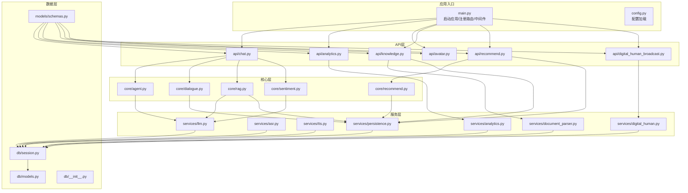
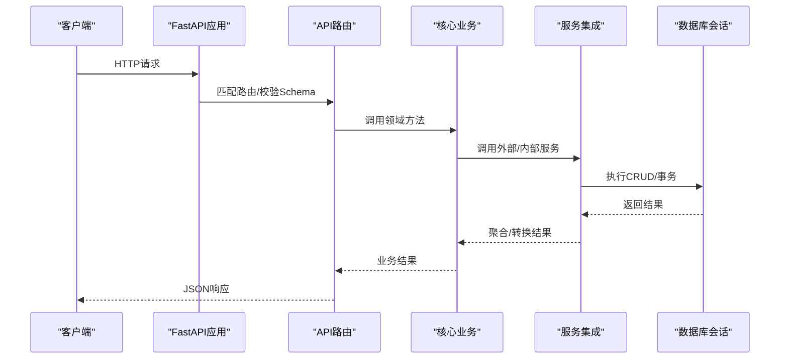
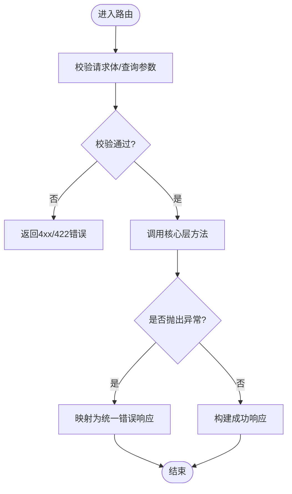
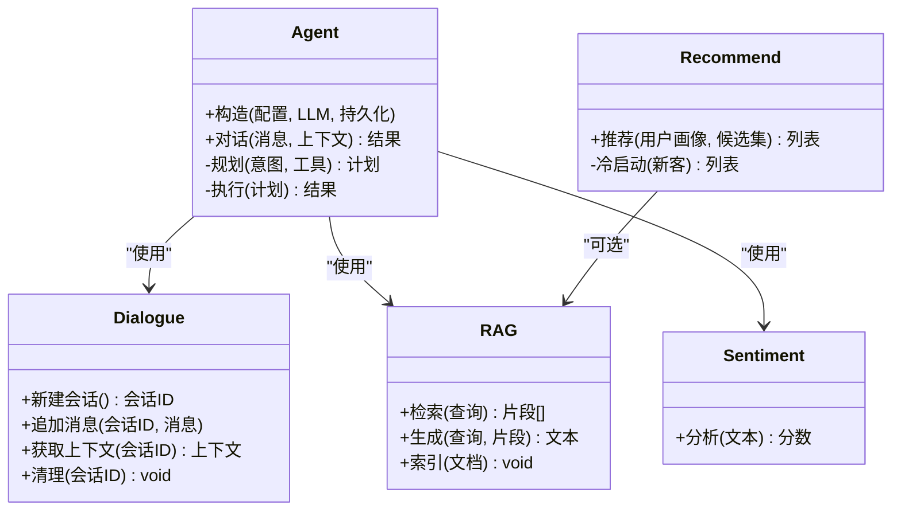
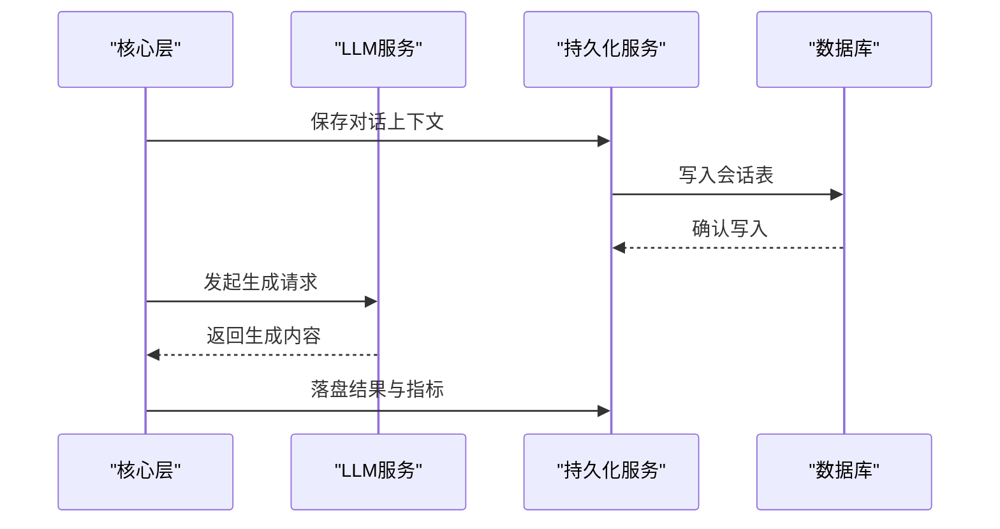
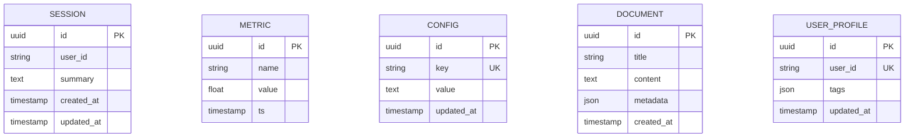
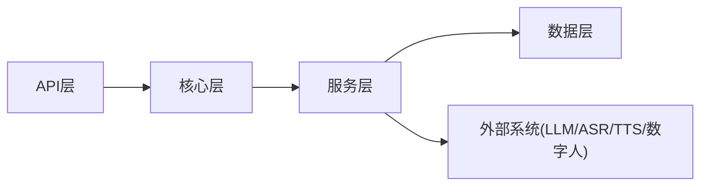

# 后端服务架构

<cite>
**本文引用的文件**   
- [backend/app/main.py](file://backend/app/main.py)
- [backend/app/config.py](file://backend/app/config.py)
- [backend/app/api/analytics.py](file://backend/app/api/analytics.py)
- [backend/app/api/avatar.py](file://backend/app/api/avatar.py)
- [backend/app/api/chat.py](file://backend/app/api/chat.py)
- [backend/app/api/digital_human_broadcast.py](file://backend/app/api/digital_human_broadcast.py)
- [backend/app/api/knowledge.py](file://backend/app/api/knowledge.py)
- [backend/app/api/recommend.py](file://backend/app/api/recommend.py)
- [backend/app/core/agent.py](file://backend/app/core/agent.py)
- [backend/app/core/dialogue.py](file://backend/app/core/dialogue.py)
- [backend/app/core/rag.py](file://backend/app/core/rag.py)
- [backend/app/core/recommend.py](file://backend/app/core/recommend.py)
- [backend/app/core/sentiment.py](file://backend/app/core/sentiment.py)
- [backend/app/services/analytics.py](file://backend/app/services/analytics.py)
- [backend/app/services/asr.py](file://backend/app/services/asr.py)
- [backend/app/services/digital_human.py](file://backend/app/services/digital_human.py)
- [backend/app/services/document_parser.py](file://backend/app/services/document_parser.py)
- [backend/app/services/llm.py](file://backend/app/services/llm.py)
- [backend/app/services/persistence.py](file://backend/app/services/persistence.py)
- [backend/app/services/tts.py](file://backend/app/services/tts.py)
- [backend/app/db/__init__.py](file://backend/app/db/__init__.py)
- [backend/app/db/models.py](file://backend/app/db/models.py)
- [backend/app/db/session.py](file://backend/app/db/session.py)
- [backend/app/models/schemas.py](file://backend/app/models/schemas.py)
- [backend/pyproject.toml](file://backend/pyproject.toml)
- [docker-compose.yml](file://docker-compose.yml)
</cite>

## 目录
1. [简介](#简介)
2. [项目结构](#项目结构)
3. [核心组件](#核心组件)
4. [架构总览](#架构总览)
5. [详细组件分析](#详细组件分析)
6. [依赖关系分析](#依赖关系分析)
7. [性能考虑](#性能考虑)
8. [故障排查指南](#故障排查指南)
9. [结论](#结论)
10. [附录](#附录)

## 简介
本文件面向SmartTour后端服务的开发者与运维人员，系统化阐述基于FastAPI的分层架构设计。文档覆盖API接口层、核心业务逻辑层、服务集成层和数据访问层的职责划分；解释模块间依赖关系、数据流转过程与错误处理机制；并给出RESTful API设计规范、中间件使用、异常处理与日志记录策略；同时包含服务发现、负载均衡、缓存策略和数据库连接池的配置建议，帮助团队形成一致的开发指导与最佳实践。

## 项目结构
后端采用按“功能域+分层”组织的方式：
- API层：路由定义、请求校验、响应格式化
- 核心层：领域模型与业务流程编排
- 服务层：外部系统（LLM、ASR/TTS、数字人、文档解析、持久化等）集成
- 数据层：ORM模型、会话管理、配置
- 公共模型：Pydantic Schema用于入参出参校验

图示来源
- [backend/app/main.py](file://backend/app/main.py)
- [backend/app/config.py](file://backend/app/config.py)
- [backend/app/api/chat.py](file://backend/app/api/chat.py)
- [backend/app/api/analytics.py](file://backend/app/api/analytics.py)
- [backend/app/api/avatar.py](file://backend/app/api/avatar.py)
- [backend/app/api/knowledge.py](file://backend/app/api/knowledge.py)
- [backend/app/api/recommend.py](file://backend/app/api/recommend.py)
- [backend/app/api/digital_human_broadcast.py](file://backend/app/api/digital_human_broadcast.py)
- [backend/app/core/agent.py](file://backend/app/core/agent.py)
- [backend/app/core/dialogue.py](file://backend/app/core/dialogue.py)
- [backend/app/core/rag.py](file://backend/app/core/rag.py)
- [backend/app/core/recommend.py](file://backend/app/core/recommend.py)
- [backend/app/core/sentiment.py](file://backend/app/core/sentiment.py)
- [backend/app/services/llm.py](file://backend/app/services/llm.py)
- [backend/app/services/asr.py](file://backend/app/services/asr.py)
- [backend/app/services/tts.py](file://backend/app/services/tts.py)
- [backend/app/services/digital_human.py](file://backend/app/services/digital_human.py)
- [backend/app/services/document_parser.py](file://backend/app/services/document_parser.py)
- [backend/app/services/persistence.py](file://backend/app/services/persistence.py)
- [backend/app/services/analytics.py](file://backend/app/services/analytics.py)
- [backend/app/db/models.py](file://backend/app/db/models.py)
- [backend/app/db/session.py](file://backend/app/db/session.py)
- [backend/app/db/__init__.py](file://backend/app/db/__init__.py)
- [backend/app/models/schemas.py](file://backend/app/models/schemas.py)

章节来源
- [backend/app/main.py](file://backend/app/main.py)
- [backend/app/config.py](file://backend/app/config.py)
- [backend/pyproject.toml](file://backend/pyproject.toml)

## 核心组件
- 应用入口与生命周期
  - 负责创建FastAPI实例、挂载路由、注册中间件、初始化全局资源（如数据库会话、外部服务客户端），并在启动/关闭钩子中完成资源准备与释放。
- 配置中心
  - 集中管理环境变量、数据库连接参数、第三方服务地址、缓存与限流策略等，提供强类型配置对象供各层读取。
- API路由
  - 每个功能域一个路由文件，统一进行请求体校验、鉴权、速率限制、审计日志埋点，并将调用委派给核心层或具体服务。
- 核心业务
  - 编排领域流程，组合多个服务能力（如对话Agent、RAG检索增强生成、情感分析、推荐策略）。
- 服务集成
  - 封装外部系统调用（LLM、ASR/TTS、数字人、文档解析、持久化、分析统计），提供重试、超时、熔断、降级与指标上报。
- 数据访问
  - 通过ORM模型与数据库会话管理，提供事务、连接池、读写分离与查询优化支持。
- 公共Schema
  - 使用Pydantic定义统一的输入输出结构，确保前后端契约稳定。

章节来源
- [backend/app/main.py](file://backend/app/main.py)
- [backend/app/config.py](file://backend/app/config.py)
- [backend/app/models/schemas.py](file://backend/app/models/schemas.py)
- [backend/app/db/session.py](file://backend/app/db/session.py)
- [backend/app/db/models.py](file://backend/app/db/models.py)

## 架构总览
整体采用“API层 -> 核心层 -> 服务层 -> 数据层”的清晰分层，配合中间件实现横切关注点（鉴权、限流、CORS、请求追踪、异常转换、日志）。

图示来源
- [backend/app/main.py](file://backend/app/main.py)
- [backend/app/api/chat.py](file://backend/app/api/chat.py)
- [backend/app/core/agent.py](file://backend/app/core/agent.py)
- [backend/app/services/llm.py](file://backend/app/services/llm.py)
- [backend/app/db/session.py](file://backend/app/db/session.py)

## 详细组件分析

### API接口层
- 职责
  - 定义RESTful路径与方法，绑定Pydantic Schema进行入参校验，统一错误码与响应格式，注入上下文（用户、租户、追踪ID）。
- 关键路由
  - 聊天对话：接收消息、流式返回、历史上下文管理
  - 知识管理：文档上传、解析入库、检索更新
  - 推荐：基于用户画像与知识库的推荐策略
  - 数字人广播：触发播报、状态查询、媒体资源管理
  - 头像配置：头像上传、预览、替换
  - 分析统计：对话量、热词、满意度等指标
- 规范
  - 使用HTTP语义动词，资源名词复数形式，分页与过滤参数标准化，错误响应包含code/message/detail。

图示来源
- [backend/app/api/chat.py](file://backend/app/api/chat.py)
- [backend/app/api/knowledge.py](file://backend/app/api/knowledge.py)
- [backend/app/api/recommend.py](file://backend/app/api/recommend.py)
- [backend/app/api/digital_human_broadcast.py](file://backend/app/api/digital_human_broadcast.py)
- [backend/app/api/avatar.py](file://backend/app/api/avatar.py)
- [backend/app/api/analytics.py](file://backend/app/api/analytics.py)
- [backend/app/models/schemas.py](file://backend/app/models/schemas.py)

章节来源
- [backend/app/api/chat.py](file://backend/app/api/chat.py)
- [backend/app/api/knowledge.py](file://backend/app/api/knowledge.py)
- [backend/app/api/recommend.py](file://backend/app/api/recommend.py)
- [backend/app/api/digital_human_broadcast.py](file://backend/app/api/digital_human_broadcast.py)
- [backend/app/api/avatar.py](file://backend/app/api/avatar.py)
- [backend/app/api/analytics.py](file://backend/app/api/analytics.py)
- [backend/app/models/schemas.py](file://backend/app/models/schemas.py)

### 核心业务逻辑层
- 职责
  - 编排领域流程，协调多服务协作，维护会话状态与上下文，实现可插拔的策略（如推荐算法、RAG检索策略）。
- 关键模块
  - Agent：对话意图识别、工具调用、多轮上下文管理
  - Dialogue：会话生命周期、记忆与摘要
  - RAG：检索增强生成，结合向量检索与LLM生成
  - Recommend：个性化推荐策略
  - Sentiment：情感分析，辅助体验优化
- 设计要点
  - 无副作用优先，纯函数与有副作用操作解耦
  - 策略模式扩展推荐/检索算法
  - 事件驱动记录关键业务指标

图示来源
- [backend/app/core/agent.py](file://backend/app/core/agent.py)
- [backend/app/core/dialogue.py](file://backend/app/core/dialogue.py)
- [backend/app/core/rag.py](file://backend/app/core/rag.py)
- [backend/app/core/recommend.py](file://backend/app/core/recommend.py)
- [backend/app/core/sentiment.py](file://backend/app/core/sentiment.py)

章节来源
- [backend/app/core/agent.py](file://backend/app/core/agent.py)
- [backend/app/core/dialogue.py](file://backend/app/core/dialogue.py)
- [backend/app/core/rag.py](file://backend/app/core/rag.py)
- [backend/app/core/recommend.py](file://backend/app/core/recommend.py)
- [backend/app/core/sentiment.py](file://backend/app/core/sentiment.py)

### 服务集成层
- 职责
  - 封装外部系统与内部子系统调用，提供重试、超时、熔断、降级、指标采集与链路追踪。
- 关键服务
  - LLM：大模型调用、提示词模板、流式输出
  - ASR/TTS：语音转文字、文字转语音
  - Digital Human：数字人播报控制、媒体资源管理
  - Document Parser：文档解析、分块、向量化
  - Persistence：通用持久化（会话、指标、配置）
  - Analytics：分析统计、报表聚合
- 健壮性
  - 对不稳定依赖设置超时与重试退避
  - 失败快速返回默认值或降级策略
  - 结构化日志与Trace ID透传

图示来源
- [backend/app/services/llm.py](file://backend/app/services/llm.py)
- [backend/app/services/persistence.py](file://backend/app/services/persistence.py)
- [backend/app/services/asr.py](file://backend/app/services/asr.py)
- [backend/app/services/tts.py](file://backend/app/services/tts.py)
- [backend/app/services/digital_human.py](file://backend/app/services/digital_human.py)
- [backend/app/services/document_parser.py](file://backend/app/services/document_parser.py)
- [backend/app/services/analytics.py](file://backend/app/services/analytics.py)

章节来源
- [backend/app/services/llm.py](file://backend/app/services/llm.py)
- [backend/app/services/persistence.py](file://backend/app/services/persistence.py)
- [backend/app/services/asr.py](file://backend/app/services/asr.py)
- [backend/app/services/tts.py](file://backend/app/services/tts.py)
- [backend/app/services/digital_human.py](file://backend/app/services/digital_human.py)
- [backend/app/services/document_parser.py](file://backend/app/services/document_parser.py)
- [backend/app/services/analytics.py](file://backend/app/services/analytics.py)

### 数据访问层
- 职责
  - 定义ORM模型、管理数据库会话与连接池、提供事务边界与查询封装。
- 关键点
  - 连接池大小、最大空闲时间、SQL日志开关
  - 读写分离与只读副本（按需）
  - 慢查询监控与索引建议
  - 迁移脚本与版本管理

图示来源
- [backend/app/db/models.py](file://backend/app/db/models.py)
- [backend/app/db/session.py](file://backend/app/db/session.py)
- [backend/app/db/__init__.py](file://backend/app/db/__init__.py)

章节来源
- [backend/app/db/models.py](file://backend/app/db/models.py)
- [backend/app/db/session.py](file://backend/app/db/session.py)
- [backend/app/db/__init__.py](file://backend/app/db/__init__.py)

## 依赖关系分析
- 耦合与内聚
  - API层仅依赖核心层与Schema，保持薄控制器
  - 核心层依赖服务层，避免直接IO
  - 服务层依赖数据层与外部系统，具备容错
- 外部依赖
  - FastAPI、Uvicorn、Pydantic、SQLAlchemy/异步驱动、Redis（可选）、对象存储（可选）
- 循环依赖检查
  - 通过分层与依赖注入避免循环引用

图示来源
- [backend/app/main.py](file://backend/app/main.py)
- [backend/app/api/chat.py](file://backend/app/api/chat.py)
- [backend/app/core/agent.py](file://backend/app/core/agent.py)
- [backend/app/services/llm.py](file://backend/app/services/llm.py)
- [backend/app/db/session.py](file://backend/app/db/session.py)

章节来源
- [backend/app/main.py](file://backend/app/main.py)
- [backend/pyproject.toml](file://backend/pyproject.toml)

## 性能考虑
- 并发与I/O
  - 使用异步路由与服务调用，减少阻塞
  - 合理设置Uvicorn工作进程与线程数
- 缓存策略
  - 热点问答/推荐结果缓存（TTL、失效策略）
  - 向量检索预取与分页
- 数据库
  - 连接池大小与超时调优
  - 慢查询分析与索引优化
- 外部服务
  - 超时、重试、熔断与降级
  - 批量与流式传输降低延迟
- 可观测性
  - 指标、日志、链路追踪三件套

[本节为通用性能建议，不直接分析具体文件]

## 故障排查指南
- 常见问题定位
  - 422校验错误：检查Pydantic Schema与字段约束
  - 5xx服务异常：查看服务层日志与下游健康状态
  - 数据库连接失败：核对连接串、权限、连接池耗尽
  - 外部服务超时：调整超时与重试策略，启用熔断
- 诊断手段
  - 开启SQL日志与慢查询告警
  - 增加Trace ID贯穿请求链路
  - 收集关键指标（QPS、P99、错误率、下游RT）
- 恢复策略
  - 自动重试与幂等键
  - 降级返回默认值或缓存兜底
  - 灰度发布与快速回滚

章节来源
- [backend/app/api/chat.py](file://backend/app/api/chat.py)
- [backend/app/services/llm.py](file://backend/app/services/llm.py)
- [backend/app/services/persistence.py](file://backend/app/services/persistence.py)
- [backend/app/db/session.py](file://backend/app/db/session.py)

## 结论
SmartTour后端以清晰的层次化架构与稳定的分层依赖为基础，结合中间件与统一异常处理，实现了高内聚、低耦合的可扩展系统。通过合理的缓存、连接池与外部服务容错策略，可在保证可用性的同时提升性能与可观测性。建议持续完善指标与日志体系，推进自动化测试与CI/CD流水线，保障质量与交付效率。

[本节为总结性内容，不直接分析具体文件]

## 附录

### RESTful API设计规范
- 命名与路径
  - 使用名词复数表示资源，层级体现从属关系
  - 示例：/chats、/documents、/recommendations、/avatars、/analytics
- 方法与状态码
  - GET/POST/PUT/PATCH/DELETE对应标准语义
  - 200/201/204成功，4xx客户端错误，5xx服务端错误
- 请求与响应
  - 统一JSON结构，分页参数page/page_size，排序sort/order
  - 错误响应包含code/message/detail
- 鉴权与安全
  - Bearer Token或OAuth2，敏感头不落盘
  - CORS白名单、CSRF防护（如需）
- 版本化
  - URL前缀或Header版本控制，向后兼容

[本节为通用规范，不直接分析具体文件]

### 中间件与异常处理
- 中间件清单
  - CORS、请求ID注入、审计日志、限流、压缩、安全头
- 异常处理
  - 统一捕获并转换为标准错误响应
  - 区分业务异常与系统异常，记录不同级别日志
- 日志策略
  - 结构化JSON日志，包含trace_id、user_id、耗时、状态码
  - 分级输出（INFO/WARN/ERROR），脱敏敏感信息

[本节为通用实践，不直接分析具体文件]

### 服务发现与负载均衡
- 容器化部署
  - 使用Docker镜像与docker-compose编排
  - 反向代理（Nginx/Ingress）做负载均衡与健康检查
- 服务发现
  - 本地开发：静态配置
  - 生产环境：Kubernetes Service/DNS或服务网格
- 弹性伸缩
  - 基于CPU/内存/QPS的HPA策略

章节来源
- [docker-compose.yml](file://docker-compose.yml)

### 缓存策略
- 缓存层
  - Redis作为分布式缓存，支持TTL与过期策略
- 缓存粒度
  - 细粒度：单条问答/推荐结果
  - 粗粒度：页面级或聚合报表
- 一致性
  - 写扩散或失效通知，避免脏读

[本节为通用策略，不直接分析具体文件]

### 数据库连接池配置
- 连接池参数
  - pool_size/max_overflow/idle_timeout/echo
- 读写分离
  - 主库写、从库读，按查询类型路由
- 监控
  - 连接使用率、等待队列、慢查询

章节来源
- [backend/app/db/session.py](file://backend/app/db/session.py)

### 开发环境与运行
- 依赖安装
  - 使用pyproject.toml管理依赖与脚本
- 本地启动
  - 配置环境变量，启动Uvicorn服务
- 测试
  - 单元测试与集成测试，Mock外部依赖

章节来源
- [backend/pyproject.toml](file://backend/pyproject.toml)