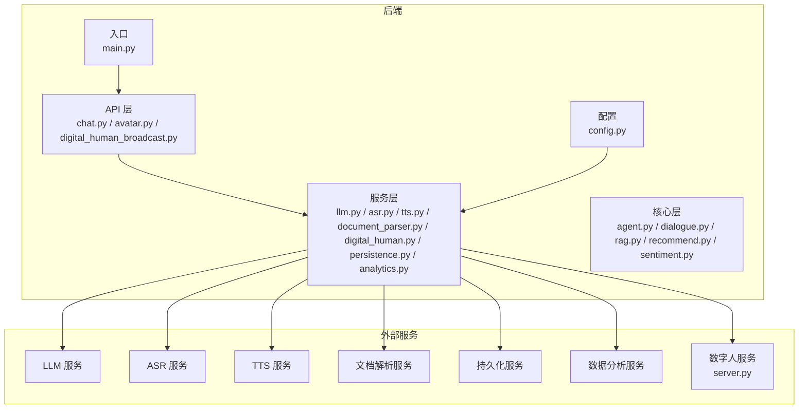
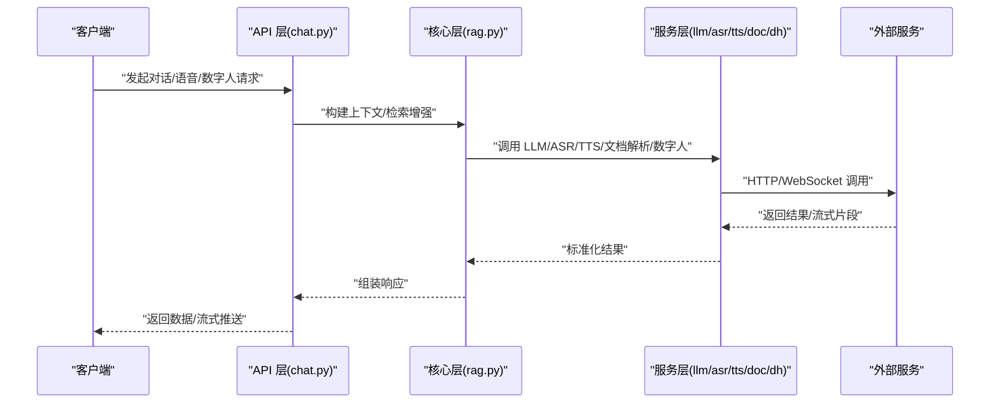
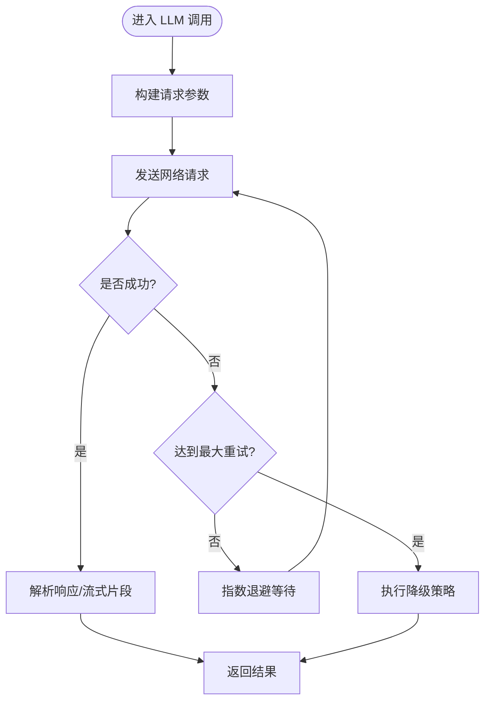
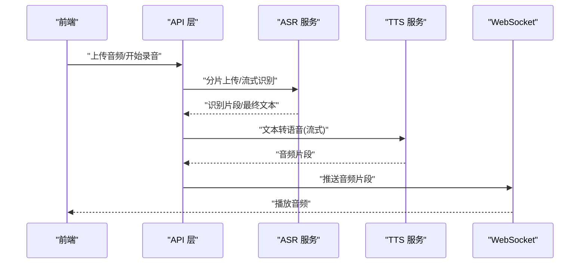
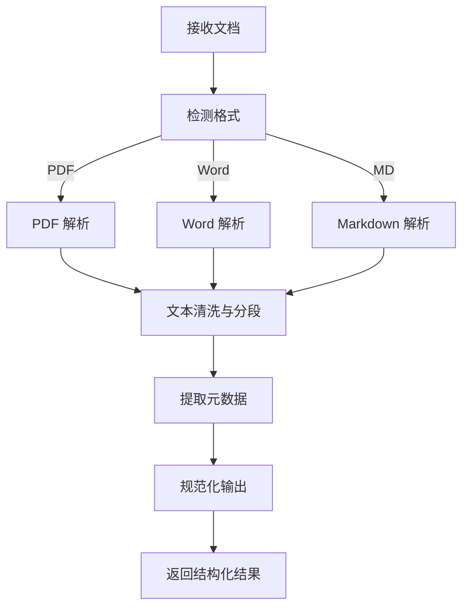
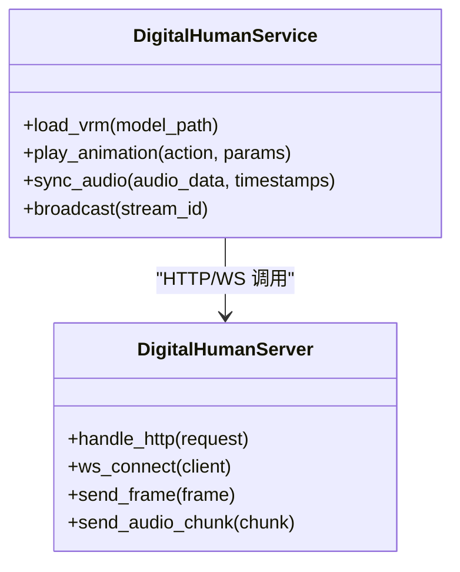
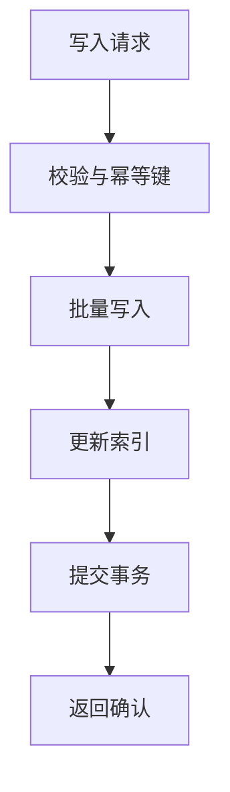
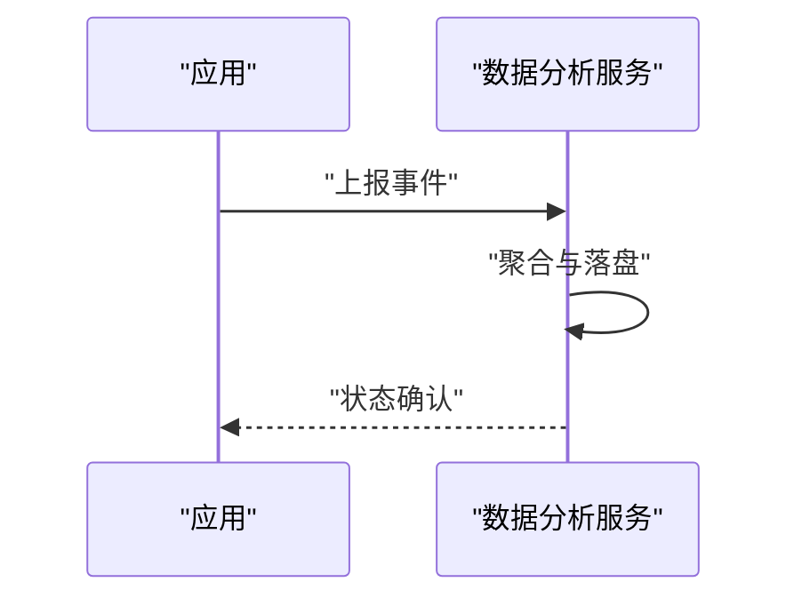
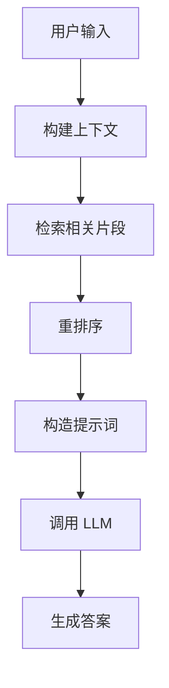
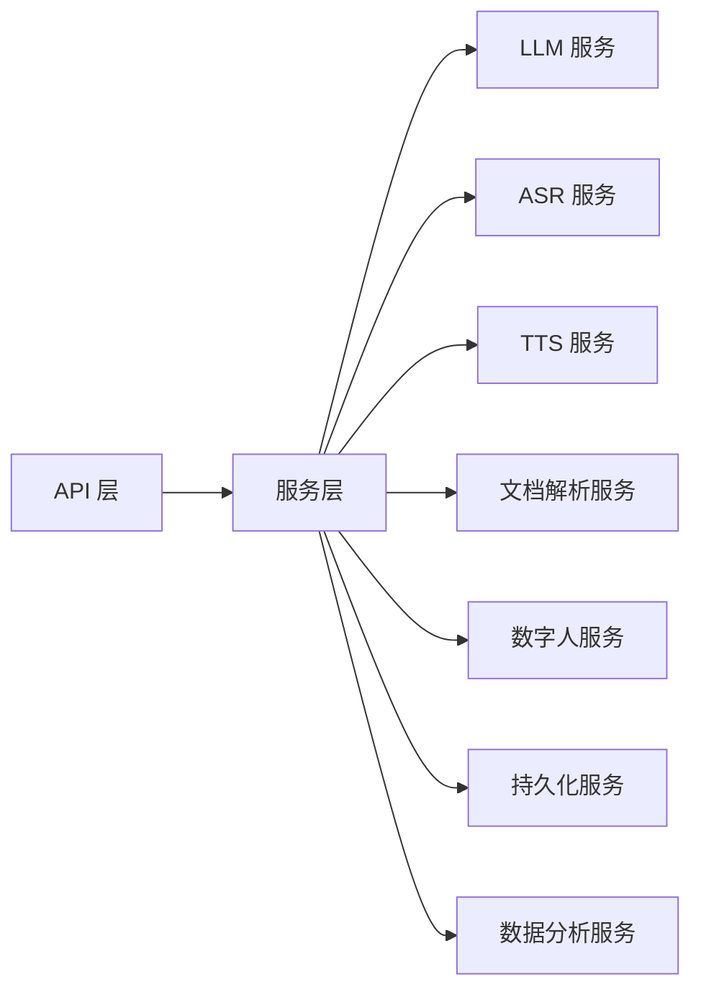

# 外部服务集成

<cite>
**本文引用的文件**   
- [backend/app/main.py](file://backend/app/main.py)
- [backend/app/config.py](file://backend/app/config.py)
- [backend/app/services/llm.py](file://backend/app/services/llm.py)
- [backend/app/services/asr.py](file://backend/app/services/asr.py)
- [backend/app/services/tts.py](file://backend/app/services/tts.py)
- [backend/app/services/document_parser.py](file://backend/app/services/document_parser.py)
- [backend/app/services/digital_human.py](file://backend/app/services/digital_human.py)
- [backend/app/services/persistence.py](file://backend/app/services/persistence.py)
- [backend/app/services/analytics.py](file://backend/app/services/analytics.py)
- [backend/app/api/chat.py](file://backend/app/api/chat.py)
- [backend/app/api/avatar.py](file://backend/app/api/avatar.py)
- [backend/app/api/digital_human_broadcast.py](file://backend/app/api/digital_human_broadcast.py)
- [backend/app/core/rag.py](file://backend/app/core/rag.py)
- [digital_human/server.py](file://digital_human/server.py)
- [docker-compose.yml](file://docker-compose.yml)
</cite>

## 目录
1. [简介](#简介)
2. [项目结构](#项目结构)
3. [核心组件](#核心组件)
4. [架构总览](#架构总览)
5. [详细组件分析](#详细组件分析)
6. [依赖关系分析](#依赖关系分析)
7. [性能与可靠性](#性能与可靠性)
8. [故障排查指南](#故障排查指南)
9. [结论](#结论)
10. [附录](#附录)

## 简介
本技术文档聚焦于 SmartTour 的外部服务集成，覆盖大语言模型(LLM)、语音识别(ASR)、语音合成(TTS)、文档解析、数字人、持久化与数据分析等服务的对接方案。文档从系统架构、数据流、错误处理、重试与熔断、监控告警、服务发现与负载均衡、插件化抽象等方面展开，帮助集成开发者快速理解并扩展第三方服务。

## 项目结构
后端采用分层设计：API 层负责路由与请求校验，服务层封装外部调用与业务编排，核心层提供对话、检索增强生成(RAG)等能力；前端包含游客端与管理端。数字人服务独立部署并通过 HTTP/WebSocket 与后端交互。

图表来源
- [backend/app/main.py](file://backend/app/main.py)
- [backend/app/api/chat.py](file://backend/app/api/chat.py)
- [backend/app/services/llm.py](file://backend/app/services/llm.py)
- [backend/app/services/asr.py](file://backend/app/services/asr.py)
- [backend/app/services/tts.py](file://backend/app/services/tts.py)
- [backend/app/services/document_parser.py](file://backend/app/services/document_parser.py)
- [backend/app/services/digital_human.py](file://backend/app/services/digital_human.py)
- [backend/app/services/persistence.py](file://backend/app/services/persistence.py)
- [backend/app/services/analytics.py](file://backend/app/services/analytics.py)
- [backend/app/core/rag.py](file://backend/app/core/rag.py)
- [digital_human/server.py](file://digital_human/server.py)

章节来源
- [backend/app/main.py](file://backend/app/main.py)
- [backend/app/config.py](file://backend/app/config.py)

## 核心组件
- LLM 服务封装：统一接口、重试与超时控制、流式响应支持、错误分类与回退策略。
- ASR/TTS 服务封装：音频格式转换、分片上传、流式处理、实时通信（WebSocket）。
- 文档解析服务：多格式解析（PDF、Word、Markdown）、文本清洗与结构化输出。
- 数字人服务：VRM 模型加载、动画控制、音频同步、事件驱动。
- 持久化服务：会话与消息存储、索引更新、事务与一致性保障。
- 数据分析服务：埋点采集、指标聚合、报表导出。

章节来源
- [backend/app/services/llm.py](file://backend/app/services/llm.py)
- [backend/app/services/asr.py](file://backend/app/services/asr.py)
- [backend/app/services/tts.py](file://backend/app/services/tts.py)
- [backend/app/services/document_parser.py](file://backend/app/services/document_parser.py)
- [backend/app/services/digital_human.py](file://backend/app/services/digital_human.py)
- [backend/app/services/persistence.py](file://backend/app/services/persistence.py)
- [backend/app/services/analytics.py](file://backend/app/services/analytics.py)

## 架构总览
整体采用“API 层 -> 服务层 -> 外部服务”的解耦模式。服务层通过配置中心获取各外部服务地址与参数，结合重试、熔断、限流与监控实现高可用。数字人服务独立运行，通过 HTTP/WebSocket 与后端进行音视频与指令交互。

图表来源
- [backend/app/api/chat.py](file://backend/app/api/chat.py)
- [backend/app/core/rag.py](file://backend/app/core/rag.py)
- [backend/app/services/llm.py](file://backend/app/services/llm.py)
- [backend/app/services/asr.py](file://backend/app/services/asr.py)
- [backend/app/services/tts.py](file://backend/app/services/tts.py)
- [backend/app/services/document_parser.py](file://backend/app/services/document_parser.py)
- [backend/app/services/digital_human.py](file://backend/app/services/digital_human.py)

## 详细组件分析

### LLM 服务集成
- 目标：统一 LLM 调用接口，支持非流式与流式输出，具备重试、超时、错误分类与降级。
- 关键流程：
  - 构建请求体（模型、提示词、参数）
  - 发送 HTTP 请求（或 SSE/WS）
  - 解析响应（文本/增量片段）
  - 异常捕获与重试（指数退避）
  - 失败回退（缓存/默认回答）
- 配置项：基础 URL、鉴权头、超时、最大重试次数、并发限制。

图表来源
- [backend/app/services/llm.py](file://backend/app/services/llm.py)

章节来源
- [backend/app/services/llm.py](file://backend/app/services/llm.py)

### ASR 与 TTS 服务集成
- 目标：完成语音到文本(ASR)与文本到语音(TTS)的端到端链路，支持音频格式转换、分片上传、流式处理与实时通信。
- 关键点：
  - 音频预处理：采样率/编码格式转换、静音裁剪、分片策略
  - ASR：长语音分片、流式识别、纠错与拼接
  - TTS：流式合成、音素对齐、延迟优化
  - 实时通信：WebSocket 双向通道，心跳保活
- 配置项：服务地址、鉴权、音频格式、分片大小、超时、重连策略。

图表来源
- [backend/app/services/asr.py](file://backend/app/services/asr.py)
- [backend/app/services/tts.py](file://backend/app/services/tts.py)
- [backend/app/api/chat.py](file://backend/app/api/chat.py)

章节来源
- [backend/app/services/asr.py](file://backend/app/services/asr.py)
- [backend/app/services/tts.py](file://backend/app/services/tts.py)
- [backend/app/api/chat.py](file://backend/app/api/chat.py)

### 文档解析服务
- 目标：对 PDF、Word、Markdown 等多格式文档进行解析、清洗与结构化输出，供 RAG 使用。
- 关键点：
  - 格式适配：不同解析器选择与容错
  - 文本清洗：去除噪声、分段、去重
  - 元数据提取：标题、作者、时间戳
  - 输出规范：统一 JSON 结构，便于下游索引
- 配置项：解析器列表、超时、并发、缓存键策略。

图表来源
- [backend/app/services/document_parser.py](file://backend/app/services/document_parser.py)

章节来源
- [backend/app/services/document_parser.py](file://backend/app/services/document_parser.py)

### 数字人服务集成
- 目标：加载 VRM 模型、控制动画、与音频同步，提供广播与互动能力。
- 关键点：
  - 模型管理：VRM 资源加载、版本切换、热更新
  - 动画控制：动作序列、表情、口型同步
  - 音频同步：基于时间戳对齐音频与动画帧
  - 通信协议：HTTP 控制 + WebSocket 媒体流
- 配置项：模型路径、端口、帧率、同步阈值、超时。

图表来源
- [backend/app/services/digital_human.py](file://backend/app/services/digital_human.py)
- [digital_human/server.py](file://digital_human/server.py)

章节来源
- [backend/app/services/digital_human.py](file://backend/app/services/digital_human.py)
- [digital_human/server.py](file://digital_human/server.py)

### 持久化服务
- 目标：会话与消息持久化、索引更新、事务与一致性保障。
- 关键点：
  - 写入策略：批量写入、幂等键、冲突解决
  - 查询优化：索引字段、分页与过滤
  - 一致性：读写分离、最终一致
- 配置项：连接池、超时、重试、备份策略。

图表来源
- [backend/app/services/persistence.py](file://backend/app/services/persistence.py)

章节来源
- [backend/app/services/persistence.py](file://backend/app/services/persistence.py)

### 数据分析服务
- 目标：采集用户行为与系统指标，提供聚合与报表。
- 关键点：
  - 埋点：事件类型、维度、数值
  - 聚合：窗口统计、TopN、趋势
  - 导出：CSV/JSON、定时任务
- 配置项：上报间隔、批大小、保留周期。

图表来源
- [backend/app/services/analytics.py](file://backend/app/services/analytics.py)

章节来源
- [backend/app/services/analytics.py](file://backend/app/services/analytics.py)

### 对话与 RAG 编排
- 目标：将用户输入与知识库检索结合，生成高质量回复。
- 关键点：
  - 意图识别与上下文维护
  - 检索增强：向量检索、重排序
  - 提示工程：模板与约束
- 配置项：检索阈值、TopK、重排权重。

图表来源
- [backend/app/core/rag.py](file://backend/app/core/rag.py)

章节来源
- [backend/app/core/rag.py](file://backend/app/core/rag.py)

## 依赖关系分析
- 模块耦合：API 层仅依赖服务层，服务层通过配置中心访问外部服务，降低硬耦合。
- 外部依赖：LLM/ASR/TTS/文档解析/数字人/持久化/数据分析均为可替换的外部服务。
- 潜在循环：服务层内部避免互相强引用，通过核心层共享能力。

图表来源
- [backend/app/api/chat.py](file://backend/app/api/chat.py)
- [backend/app/services/llm.py](file://backend/app/services/llm.py)
- [backend/app/services/asr.py](file://backend/app/services/asr.py)
- [backend/app/services/tts.py](file://backend/app/services/tts.py)
- [backend/app/services/document_parser.py](file://backend/app/services/document_parser.py)
- [backend/app/services/digital_human.py](file://backend/app/services/digital_human.py)
- [backend/app/services/persistence.py](file://backend/app/services/persistence.py)
- [backend/app/services/analytics.py](file://backend/app/services/analytics.py)

章节来源
- [backend/app/api/chat.py](file://backend/app/api/chat.py)
- [backend/app/services/llm.py](file://backend/app/services/llm.py)
- [backend/app/services/asr.py](file://backend/app/services/asr.py)
- [backend/app/services/tts.py](file://backend/app/services/tts.py)
- [backend/app/services/document_parser.py](file://backend/app/services/document_parser.py)
- [backend/app/services/digital_human.py](file://backend/app/services/digital_human.py)
- [backend/app/services/persistence.py](file://backend/app/services/persistence.py)
- [backend/app/services/analytics.py](file://backend/app/services/analytics.py)

## 性能与可靠性
- 重试机制：指数退避、抖动、最大重试次数、可重试错误分类。
- 熔断降级：失败率阈值、半开探测、快速失败与默认回退。
- 限流与背压：令牌桶/滑动窗口、队列长度上限、丢弃策略。
- 超时与连接池：合理设置 I/O 超时、复用连接、避免泄漏。
- 监控告警：QPS、延迟、错误率、饱和度指标；分级告警与自愈。
- 服务发现与负载均衡：动态注册、健康检查、轮询/加权/一致性哈希。
- 实时通信：WebSocket 心跳、断线重连、拥塞控制。

[本节为通用指导，不直接分析具体文件]

## 故障排查指南
- 常见问题定位：
  - 网络连通性：DNS、端口、防火墙、证书
  - 鉴权失败：Token 过期、签名错误、权限不足
  - 超时与重试：日志查看重试次数、退避策略是否生效
  - 音频问题：格式不支持、采样率不匹配、丢包导致卡顿
  - 数字人不同步：时间戳偏移、帧率不一致、缓冲过大
- 诊断步骤：
  - 开启调试日志与追踪 ID
  - 复现最小用例，隔离外部依赖
  - 检查配置项与服务健康状态
  - 使用抓包工具验证报文与流式数据
- 恢复策略：
  - 快速回退到默认回答或本地缓存
  - 切换备用服务实例或降级功能
  - 重启连接池与清理僵尸连接

章节来源
- [backend/app/services/llm.py](file://backend/app/services/llm.py)
- [backend/app/services/asr.py](file://backend/app/services/asr.py)
- [backend/app/services/tts.py](file://backend/app/services/tts.py)
- [backend/app/services/digital_human.py](file://backend/app/services/digital_human.py)

## 结论
SmartTour 的外部服务集成以“服务层封装 + 配置驱动 + 可插拔”为核心，实现了 LLM、ASR、TTS、文档解析、数字人、持久化与数据分析的统一接入。通过重试、熔断、限流、监控与服务发现，系统在稳定性与可扩展性上具备良好基础。建议持续完善插件化抽象与自动化测试，提升第三方服务切换效率与质量。

[本节为总结，不直接分析具体文件]

## 附录
- 配置示例要点：
  - 服务地址与鉴权
  - 超时与重试参数
  - 音频格式与分片大小
  - 数字人模型路径与帧率
- 部署参考：
  - 容器编排与服务间通信
  - 环境变量注入与密钥管理

章节来源
- [backend/app/config.py](file://backend/app/config.py)
- [docker-compose.yml](file://docker-compose.yml)