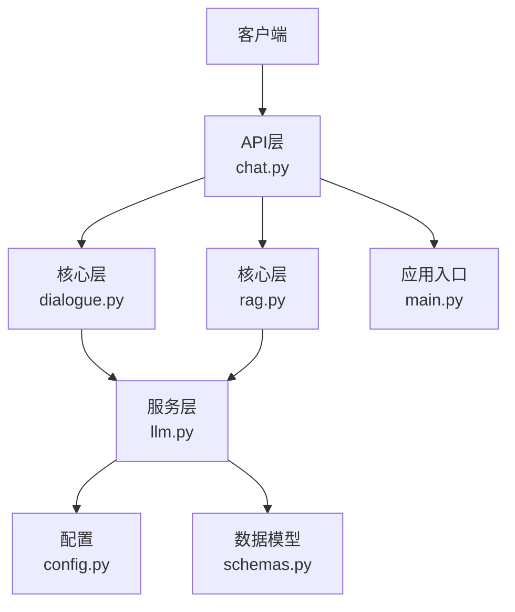
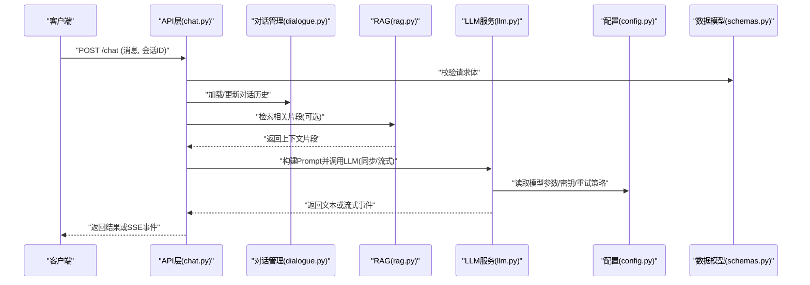
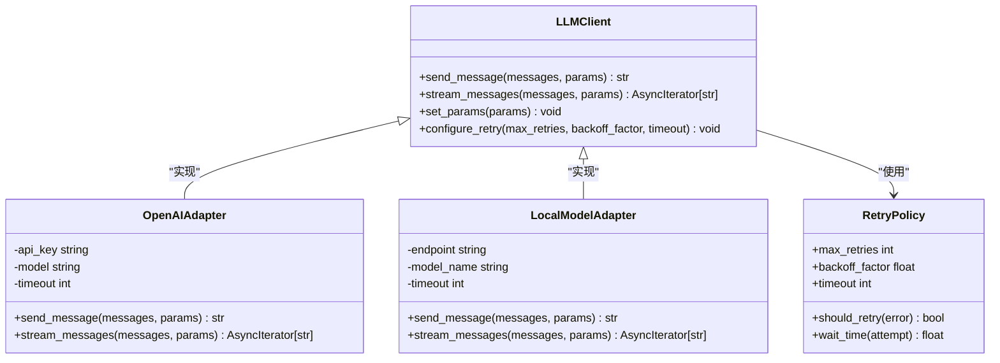
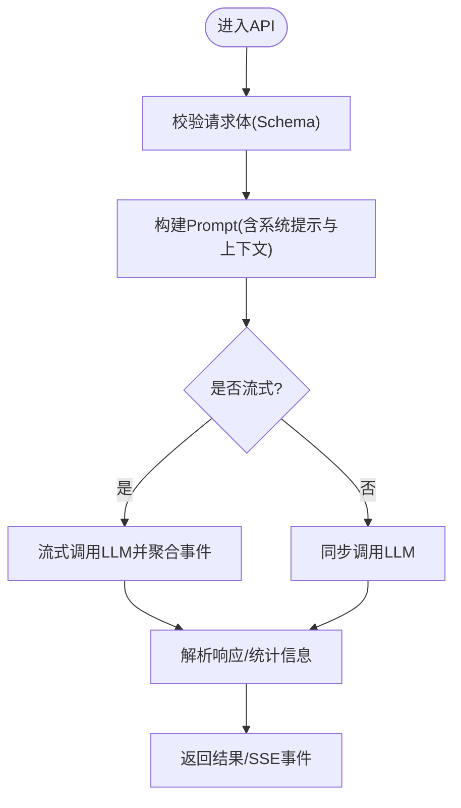
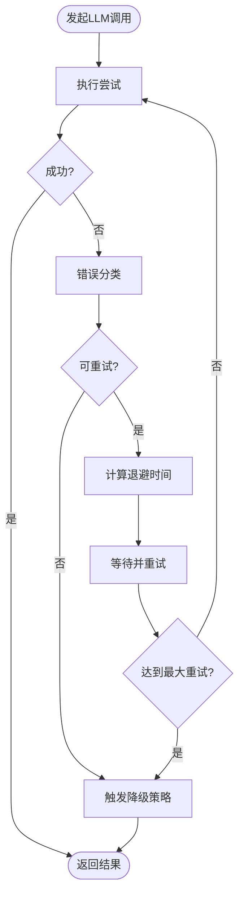
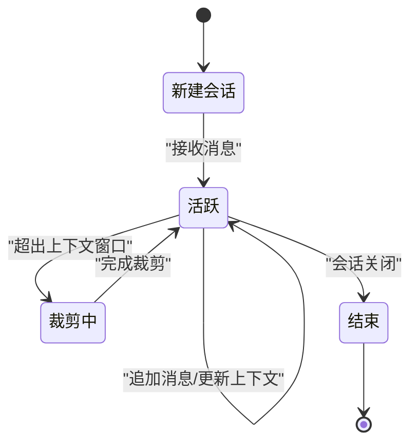
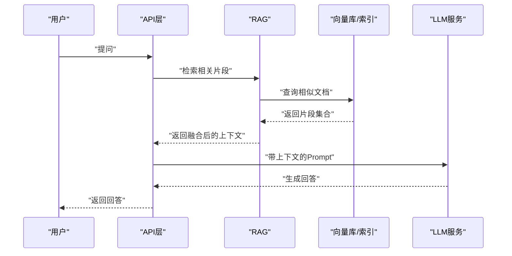
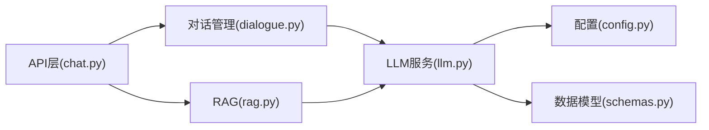

# 大语言模型服务集成

<cite>
**本文引用的文件**   
- [backend/app/services/llm.py](file://backend/app/services/llm.py)
- [backend/app/config.py](file://backend/app/config.py)
- [backend/app/core/dialogue.py](file://backend/app/core/dialogue.py)
- [backend/app/api/chat.py](file://backend/app/api/chat.py)
- [backend/app/core/rag.py](file://backend/app/core/rag.py)
- [backend/app/models/schemas.py](file://backend/app/models/schemas.py)
- [backend/app/main.py](file://backend/app/main.py)
</cite>

## 目录
1. [简介](#简介)
2. [项目结构](#项目结构)
3. [核心组件](#核心组件)
4. [架构总览](#架构总览)
5. [详细组件分析](#详细组件分析)
6. [依赖关系分析](#依赖关系分析)
7. [性能考虑](#性能考虑)
8. [故障排查指南](#故障排查指南)
9. [结论](#结论)
10. [附录](#附录)

## 简介
本技术文档聚焦于后端的大语言模型(LLM)服务集成，围绕统一抽象接口、多后端封装（如OpenAI与本地部署模型）、API调用封装（请求构建、响应解析、流式输出）、重试机制（指数退避、超时控制、错误分类）、上下文管理与对话历史维护、配置管理（API密钥、模型参数、监控）以及扩展新LLM后端的完整指导展开。目标是帮助开发者快速理解并稳定地集成多种LLM提供商，同时保证系统的可观测性与可扩展性。

## 项目结构
本项目采用分层组织方式：
- API层：对外暴露REST接口，处理HTTP请求与响应
- 核心业务层：对话管理、RAG检索增强生成等
- 服务层：LLM服务封装、ASR/TTS、数字人等
- 数据模型层：Pydantic Schema定义
- 配置与环境：集中管理环境变量与默认值
- 应用入口：FastAPI应用初始化与中间件注册

图表来源
- [backend/app/api/chat.py](file://backend/app/api/chat.py)
- [backend/app/core/dialogue.py](file://backend/app/core/dialogue.py)
- [backend/app/core/rag.py](file://backend/app/core/rag.py)
- [backend/app/services/llm.py](file://backend/app/services/llm.py)
- [backend/app/config.py](file://backend/app/config.py)
- [backend/app/models/schemas.py](file://backend/app/models/schemas.py)
- [backend/app/main.py](file://backend/app/main.py)

章节来源
- [backend/app/main.py](file://backend/app/main.py)
- [backend/app/api/chat.py](file://backend/app/api/chat.py)
- [backend/app/core/dialogue.py](file://backend/app/core/dialogue.py)
- [backend/app/core/rag.py](file://backend/app/core/rag.py)
- [backend/app/services/llm.py](file://backend/app/services/llm.py)
- [backend/app/config.py](file://backend/app/config.py)
- [backend/app/models/schemas.py](file://backend/app/models/schemas.py)

## 核心组件
- LLM服务抽象与多后端封装：提供统一的接口以适配不同LLM提供商（如OpenAI与本地部署模型），屏蔽底层差异，支持同步与流式调用。
- 对话上下文管理：维护会话级消息历史、系统提示词与上下文窗口策略，确保长对话的稳定性与一致性。
- RAG集成：在生成前进行检索增强，结合知识库提升回答质量与事实准确性。
- 配置管理：集中管理API密钥、模型参数、超时与重试策略，支持运行时切换与热更新。
- 数据模型：使用Pydantic定义输入输出Schema，保障类型安全与校验。

章节来源
- [backend/app/services/llm.py](file://backend/app/services/llm.py)
- [backend/app/core/dialogue.py](file://backend/app/core/dialogue.py)
- [backend/app/core/rag.py](file://backend/app/core/rag.py)
- [backend/app/config.py](file://backend/app/config.py)
- [backend/app/models/schemas.py](file://backend/app/models/schemas.py)

## 架构总览
下图展示了从API到LLM服务的端到端流程，包括对话上下文、RAG检索、LLM调用与流式输出。

图表来源
- [backend/app/api/chat.py](file://backend/app/api/chat.py)
- [backend/app/core/dialogue.py](file://backend/app/core/dialogue.py)
- [backend/app/core/rag.py](file://backend/app/core/rag.py)
- [backend/app/services/llm.py](file://backend/app/services/llm.py)
- [backend/app/config.py](file://backend/app/config.py)
- [backend/app/models/schemas.py](file://backend/app/models/schemas.py)

## 详细组件分析

### LLM服务抽象与多后端封装
- 统一接口设计：定义标准化的方法用于发送消息、获取流式输出、设置模型参数与重试策略。
- 多后端适配：通过工厂或策略模式选择具体实现（如OpenAI、本地部署模型），对外暴露一致的行为。
- 请求构建：根据后端差异自动组装头部、鉴权信息、模型参数与消息格式。
- 响应解析：统一将不同后端的响应转换为内部标准结构，便于上层消费。
- 流式输出：对支持SSE/流式的后端进行事件聚合与增量推送。

图表来源
- [backend/app/services/llm.py](file://backend/app/services/llm.py)

章节来源
- [backend/app/services/llm.py](file://backend/app/services/llm.py)

### API调用封装机制
- 请求构建：基于数据模型校验输入，组合系统提示词、用户消息与上下文片段，生成标准化请求体。
- 响应解析：将后端返回的结构化内容映射为内部对象，提取文本、元信息与统计字段。
- 流式输出：对SSE事件进行解析与合并，按时间片推送增量文本，降低首字延迟。

图表来源
- [backend/app/api/chat.py](file://backend/app/api/chat.py)
- [backend/app/models/schemas.py](file://backend/app/models/schemas.py)
- [backend/app/services/llm.py](file://backend/app/services/llm.py)

章节来源
- [backend/app/api/chat.py](file://backend/app/api/chat.py)
- [backend/app/models/schemas.py](file://backend/app/models/schemas.py)
- [backend/app/services/llm.py](file://backend/app/services/llm.py)

### 重试机制与错误分类
- 指数退避算法：根据失败次数计算等待时间，避免雪崩效应。
- 超时控制：为网络I/O与模型推理分别设置合理超时，防止长时间阻塞。
- 错误分类：区分可重试错误（如网络抖动、限流）与不可重试错误（如参数非法、鉴权失败）。
- 降级方案：当主LLM不可用时，切换到轻量模型或缓存回复，保障可用性。

图表来源
- [backend/app/services/llm.py](file://backend/app/services/llm.py)

章节来源
- [backend/app/services/llm.py](file://backend/app/services/llm.py)

### 上下文管理与对话历史维护
- 会话状态：每个会话维护消息列表、系统提示词与上下文窗口策略。
- 历史裁剪：当超出上下文限制时，采用滑动窗口或摘要压缩策略保留关键信息。
- 持久化：将对话历史持久化存储，支持跨进程/重启恢复。
- 一致性：在并发场景下保证会话状态的原子更新。

图表来源
- [backend/app/core/dialogue.py](file://backend/app/core/dialogue.py)

章节来源
- [backend/app/core/dialogue.py](file://backend/app/core/dialogue.py)

### RAG检索增强生成
- 检索阶段：对用户问题与上下文进行向量化检索，召回相关片段。
- 融合阶段：将检索片段与Prompt融合，提升答案的事实性与相关性。
- 缓存与索引：对高频知识建立索引与缓存，减少重复检索开销。

图表来源
- [backend/app/core/rag.py](file://backend/app/core/rag.py)
- [backend/app/api/chat.py](file://backend/app/api/chat.py)
- [backend/app/services/llm.py](file://backend/app/services/llm.py)

章节来源
- [backend/app/core/rag.py](file://backend/app/core/rag.py)
- [backend/app/api/chat.py](file://backend/app/api/chat.py)
- [backend/app/services/llm.py](file://backend/app/services/llm.py)

### 配置管理指南
- API密钥管理：通过环境变量注入，避免硬编码；支持多提供商密钥隔离。
- 模型参数调优：温度、TopP、最大生成长度、频率惩罚等参数集中配置。
- 性能监控：记录调用耗时、Token用量、错误率与重试次数，便于分析与优化。
- 动态切换：支持运行时切换模型与后端，满足灰度发布与A/B测试需求。

章节来源
- [backend/app/config.py](file://backend/app/config.py)
- [backend/app/services/llm.py](file://backend/app/services/llm.py)

### 代码示例路径（调用不同LLM提供商）
- 同步调用OpenAI风格接口：参考[backend/app/services/llm.py](file://backend/app/services/llm.py)中的统一方法调用位置
- 流式调用本地部署模型：参考[backend/app/services/llm.py](file://backend/app/services/llm.py)中的流式方法与事件聚合逻辑
- 在API层发起聊天请求：参考[backend/app/api/chat.py](file://backend/app/api/chat.py)中的路由处理与响应构造

章节来源
- [backend/app/services/llm.py](file://backend/app/services/llm.py)
- [backend/app/api/chat.py](file://backend/app/api/chat.py)

## 依赖关系分析
- 模块耦合：API层依赖对话管理与RAG，二者共同依赖LLM服务；LLM服务依赖配置与数据模型。
- 外部依赖：网络库（HTTP/HTTPS）、JSON解析、日志与指标采集。
- 潜在循环依赖：应避免LLM服务反向依赖API层，保持单向依赖链。

图表来源
- [backend/app/api/chat.py](file://backend/app/api/chat.py)
- [backend/app/core/dialogue.py](file://backend/app/core/dialogue.py)
- [backend/app/core/rag.py](file://backend/app/core/rag.py)
- [backend/app/services/llm.py](file://backend/app/services/llm.py)
- [backend/app/config.py](file://backend/app/config.py)
- [backend/app/models/schemas.py](file://backend/app/models/schemas.py)

章节来源
- [backend/app/api/chat.py](file://backend/app/api/chat.py)
- [backend/app/core/dialogue.py](file://backend/app/core/dialogue.py)
- [backend/app/core/rag.py](file://backend/app/core/rag.py)
- [backend/app/services/llm.py](file://backend/app/services/llm.py)
- [backend/app/config.py](file://backend/app/config.py)
- [backend/app/models/schemas.py](file://backend/app/models/schemas.py)

## 性能考虑
- 连接池与复用：为HTTP客户端配置连接池，减少握手开销。
- 批处理与缓存：对相似问题与检索结果进行缓存，降低重复计算。
- 流式优先：优先使用流式输出以降低首字延迟，提升用户体验。
- 资源隔离：对不同模型与租户进行线程/进程隔离，避免相互影响。
- 监控告警：对关键指标（延迟、错误率、吞吐）设置阈值告警。

## 故障排查指南
- 常见问题定位：检查API密钥是否正确、模型名称是否匹配、网络连通性与超时设置。
- 日志与追踪：为每次LLM调用添加唯一追踪ID，串联上游下游日志。
- 重试与降级：观察重试次数与退避效果，确认降级策略是否生效。
- 上下文溢出：监控上下文长度与裁剪策略，必要时调整窗口大小或启用摘要压缩。

章节来源
- [backend/app/services/llm.py](file://backend/app/services/llm.py)
- [backend/app/core/dialogue.py](file://backend/app/core/dialogue.py)
- [backend/app/api/chat.py](file://backend/app/api/chat.py)

## 结论
通过统一的LLM服务抽象、完善的API封装、健壮的重试与降级机制、精细的上下文管理与配置治理，本项目实现了多后端LLM的稳定集成与高效调用。建议在生产环境持续完善监控与可观测性，并结合业务特性优化上下文策略与检索增强流程，以获得更高质量与更低延迟的服务体验。

## 附录
- 扩展新LLM后端步骤：
  - 新增适配器类，实现统一接口（同步与流式方法）
  - 在配置中注册新后端与默认参数
  - 在API层增加路由或开关以选择后端
  - 编写单元测试覆盖请求构建、响应解析与异常分支
  - 接入监控指标与日志追踪，验证性能与稳定性