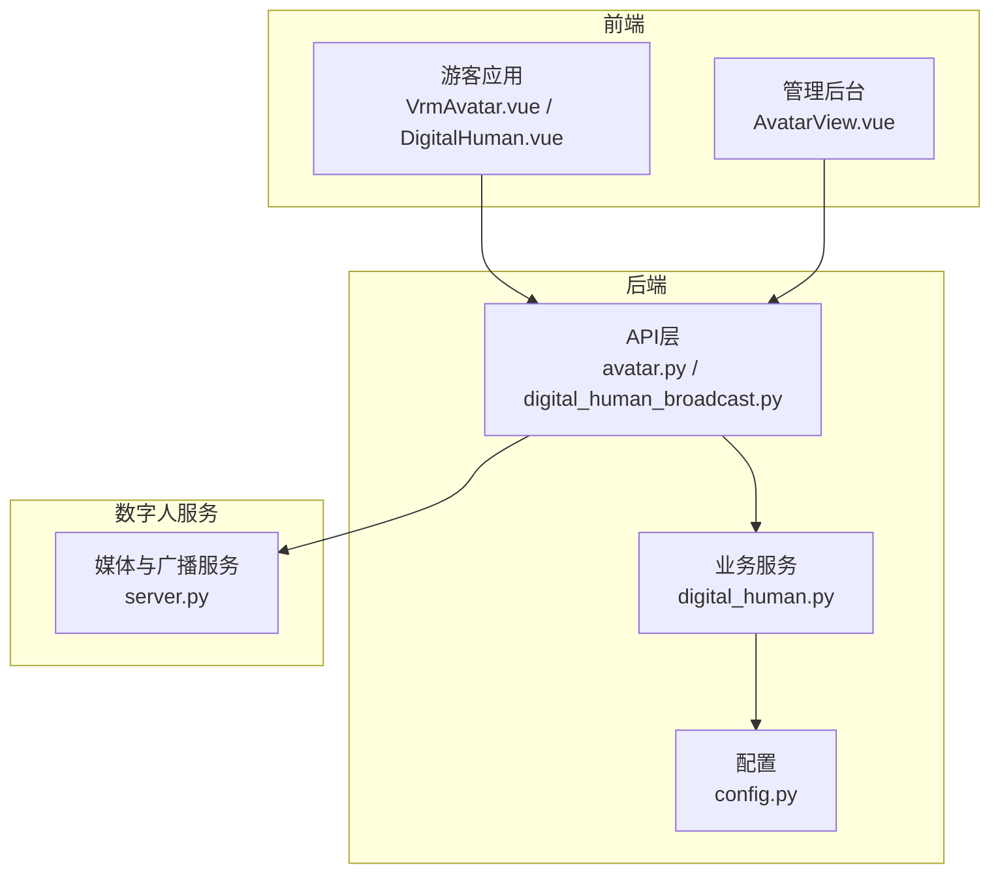
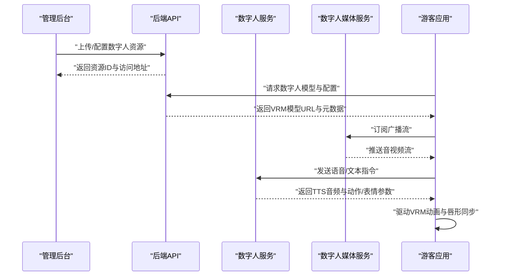
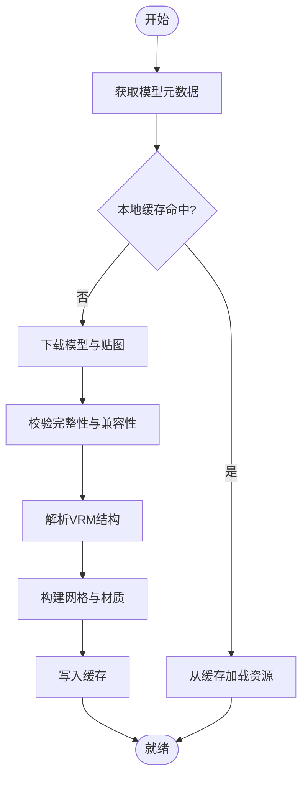
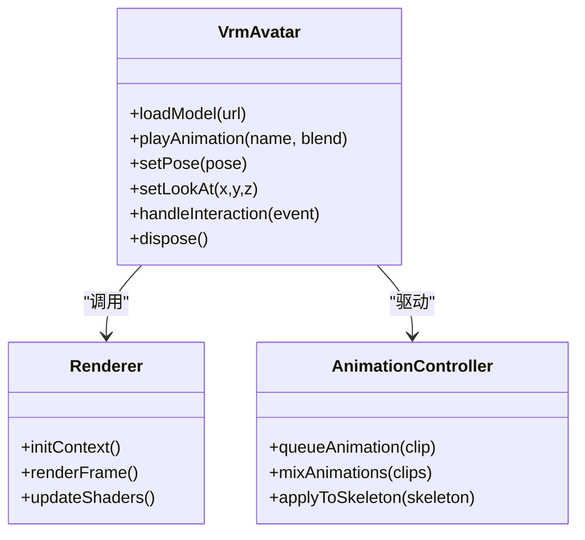
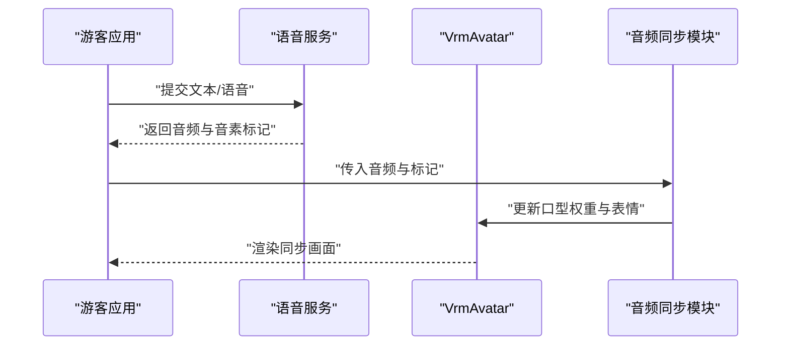
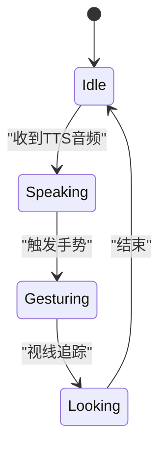
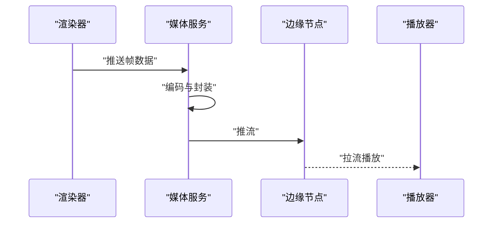
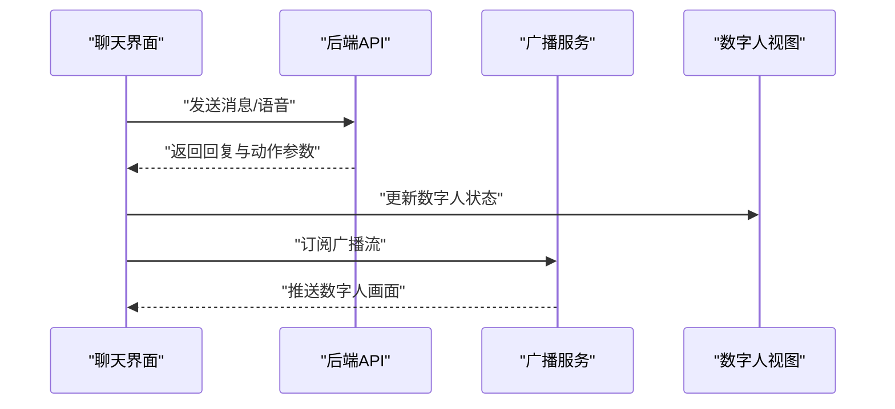
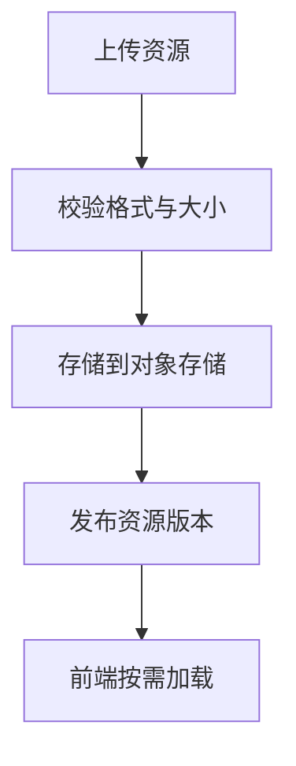
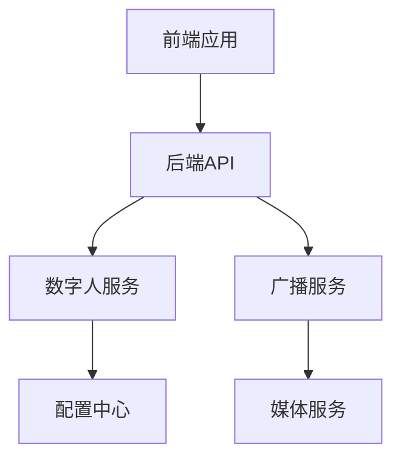

# 数字人服务集成

<cite>
**本文引用的文件**   
- [backend/app/api/digital_human_broadcast.py](file://backend/app/api/digital_human_broadcast.py)
- [backend/app/services/digital_human.py](file://backend/app/services/digital_human.py)
- [digital_human/server.py](file://digital_human/server.py)
- [frontend/tourist-app/src/components/DigitalHuman/VrmAvatar.vue](file://frontend/tourist-app/src/components/DigitalHuman/VrmAvatar.vue)
- [frontend/tourist-app/src/components/DigitalHuman/ImageAvatar.vue](file://frontend/tourist-app/src/components/DigitalHuman/ImageAvatar.vue)
- [frontend/tourist-app/src/components/DigitalHuman/DigitalHuman.vue](file://frontend/tourist-app/src/components/DigitalHuman/DigitalHuman.vue)
- [frontend/tourist-app/src/services/speech.ts](file://frontend/tourist-app/src/services/speech.ts)
- [frontend/tourist-app/src/views/ChatView.vue](file://frontend/tourist-app/src/views/ChatView.vue)
- [frontend/admin-panel/src/views/AvatarConfig/AvatarView.vue](file://frontend/admin-panel/src/views/AvatarConfig/AvatarView.vue)
- [backend/app/api/avatar.py](file://backend/app/api/avatar.py)
- [backend/app/models/schemas.py](file://backend/app/models/schemas.py)
- [backend/app/config.py](file://backend/app/config.py)
- [docker-compose.yml](file://docker-compose.yml)
</cite>

## 目录
1. [简介](#简介)
2. [项目结构](#项目结构)
3. [核心组件](#核心组件)
4. [架构总览](#架构总览)
5. [详细组件分析](#详细组件分析)
6. [依赖关系分析](#依赖关系分析)
7. [性能考虑](#性能考虑)
8. [故障排查指南](#故障排查指南)
9. [结论](#结论)
10. [附录](#附录)

## 简介
本技术文档面向“数字人服务集成”，围绕VRM模型加载与管理、3D渲染引擎集成、音频同步（唇形动画与表情映射）、状态管理（姿势控制、视线追踪、手势表达）、广播服务（视频流生成、编码优化、实时传输）以及前端交互与后端API协作，提供端到端的实现说明与最佳实践。文档同时给出性能优化策略与调试方法，帮助开发者快速完成集成与排障。

## 项目结构
本项目采用前后端分离与微服务化组织：
- 前端游客应用负责VRM模型渲染、语音输入输出、对话界面与数字人展示。
- 管理后台用于配置与上传数字人资源（如头像、VRM模型）。
- 后端提供数字人相关API、TTS/ASR服务编排、知识库检索与推荐等能力。
- 独立的数字人服务进程负责媒体处理与广播分发。

图表来源
- [frontend/tourist-app/src/components/DigitalHuman/VrmAvatar.vue](file://frontend/tourist-app/src/components/DigitalHuman/VrmAvatar.vue)
- [frontend/tourist-app/src/components/DigitalHuman/DigitalHuman.vue](file://frontend/tourist-app/src/components/DigitalHuman/DigitalHuman.vue)
- [frontend/admin-panel/src/views/AvatarConfig/AvatarView.vue](file://frontend/admin-panel/src/views/AvatarConfig/AvatarView.vue)
- [backend/app/api/avatar.py](file://backend/app/api/avatar.py)
- [backend/app/api/digital_human_broadcast.py](file://backend/app/api/digital_human_broadcast.py)
- [backend/app/services/digital_human.py](file://backend/app/services/digital_human.py)
- [backend/app/config.py](file://backend/app/config.py)
- [digital_human/server.py](file://digital_human/server.py)

章节来源
- [frontend/tourist-app/src/components/DigitalHuman/VrmAvatar.vue](file://frontend/tourist-app/src/components/DigitalHuman/VrmAvatar.vue)
- [frontend/tourist-app/src/components/DigitalHuman/DigitalHuman.vue](file://frontend/tourist-app/src/components/DigitalHuman/DigitalHuman.vue)
- [frontend/admin-panel/src/views/AvatarConfig/AvatarView.vue](file://frontend/admin-panel/src/views/AvatarConfig/AvatarView.vue)
- [backend/app/api/avatar.py](file://backend/app/api/avatar.py)
- [backend/app/api/digital_human_broadcast.py](file://backend/app/api/digital_human_broadcast.py)
- [backend/app/services/digital_human.py](file://backend/app/services/digital_human.py)
- [backend/app/config.py](file://backend/app/config.py)
- [digital_human/server.py](file://digital_human/server.py)

## 核心组件
- VRM模型加载与管理
  - 支持VRM格式模型的元数据管理与资源预取，结合CDN或静态资源服务器进行缓存。
  - 通过统一接口获取模型URL、材质贴图路径、骨骼绑定信息，供前端渲染器消费。
- 3D渲染引擎集成
  - 基于WebGL管线在浏览器中加载VRM模型，驱动骨骼动画与材质更新。
  - 事件系统对接用户交互（点击、拖拽、语音输入），将交互事件转换为数字人动作或表情变化。
- 音频同步机制
  - TTS合成音频后，前端根据音素/能量曲线驱动唇形与表情映射，触发对应动作片段。
- 数字人状态管理
  - 集中维护姿势、视线方向、手势与表情状态，提供跨组件共享与回放能力。
- 广播服务
  - 将数字人的屏幕录制或渲染帧编码为H.264/H.265，并通过WebRTC或SRT推送到边缘节点，供多端拉流观看。

章节来源
- [frontend/tourist-app/src/components/DigitalHuman/VrmAvatar.vue](file://frontend/tourist-app/src/components/DigitalHuman/VrmAvatar.vue)
- [frontend/tourist-app/src/components/DigitalHuman/DigitalHuman.vue](file://frontend/tourist-app/src/components/DigitalHuman/DigitalHuman.vue)
- [frontend/tourist-app/src/services/speech.ts](file://frontend/tourist-app/src/services/speech.ts)
- [backend/app/api/avatar.py](file://backend/app/api/avatar.py)
- [backend/app/api/digital_human_broadcast.py](file://backend/app/api/digital_human_broadcast.py)
- [backend/app/services/digital_human.py](file://backend/app/services/digital_human.py)
- [digital_human/server.py](file://digital_human/server.py)

## 架构总览
整体流程包括：管理员上传并配置数字人资源；游客端加载VRM模型并进行交互；后端编排TTS/ASR与知识库；数字人服务对渲染结果进行编码与分发。

图表来源
- [frontend/admin-panel/src/views/AvatarConfig/AvatarView.vue](file://frontend/admin-panel/src/views/AvatarConfig/AvatarView.vue)
- [backend/app/api/avatar.py](file://backend/app/api/avatar.py)
- [frontend/tourist-app/src/components/DigitalHuman/VrmAvatar.vue](file://frontend/tourist-app/src/components/DigitalHuman/VrmAvatar.vue)
- [frontend/tourist-app/src/services/speech.ts](file://frontend/tourist-app/src/services/speech.ts)
- [backend/app/api/digital_human_broadcast.py](file://backend/app/api/digital_human_broadcast.py)
- [digital_human/server.py](file://digital_human/server.py)

## 详细组件分析

### VRM模型加载与管理
- 模型格式规范
  - VRM作为标准3D虚拟角色格式，包含网格、材质、骨骼、动画与附加属性。
  - 建议在前端使用兼容的VRM解析库进行加载，确保材质贴图与动画片段正确映射。
- 资源预加载与内存优化
  - 按场景按需加载模型与贴图，避免一次性载入全部资源。
  - 使用纹理压缩与LOD策略降低显存占用；对不活跃的数字人实例释放资源。
- 资源管理接口
  - 通过后端API提供模型清单与版本信息，前端根据设备能力选择合适分辨率与材质质量。

图表来源
- [backend/app/api/avatar.py](file://backend/app/api/avatar.py)
- [frontend/tourist-app/src/components/DigitalHuman/VrmAvatar.vue](file://frontend/tourist-app/src/components/DigitalHuman/VrmAvatar.vue)

章节来源
- [backend/app/api/avatar.py](file://backend/app/api/avatar.py)
- [frontend/tourist-app/src/components/DigitalHuman/VrmAvatar.vue](file://frontend/tourist-app/src/components/DigitalHuman/VrmAvatar.vue)

### 3D渲染引擎集成（WebGL管线）
- WebGL渲染管线
  - 初始化WebGL上下文，创建着色器程序，设置顶点缓冲与索引缓冲。
  - 启用深度测试、混合与纹理采样，合理设置光照与阴影参数。
- 动画播放控制
  - 将VRM动画片段映射到骨骼变换，使用时间轴与插值平滑过渡。
  - 支持动画混合与优先级，保证关键动作不被覆盖。
- 交互事件处理
  - 捕获鼠标/触摸事件，转换为相机控制或角色姿态调整。
  - 将语音输入事件与唇形动画同步，保持口型与音频一致。

图表来源
- [frontend/tourist-app/src/components/DigitalHuman/VrmAvatar.vue](file://frontend/tourist-app/src/components/DigitalHuman/VrmAvatar.vue)

章节来源
- [frontend/tourist-app/src/components/DigitalHuman/VrmAvatar.vue](file://frontend/tourist-app/src/components/DigitalHuman/VrmAvatar.vue)

### 音频同步机制（唇形动画、表情映射、动作触发）
- 唇形动画驱动
  - 根据TTS输出的音频特征（如音素、能量包络）计算口型权重，映射至VRM的Viseme或BlendShape。
- 表情映射
  - 将语义标签（高兴、惊讶、疑惑）映射到预设表情序列，并与口型叠加。
- 动作触发
  - 当检测到关键词或意图时，触发相应动作片段（点头、挥手、指向）。

图表来源
- [frontend/tourist-app/src/services/speech.ts](file://frontend/tourist-app/src/services/speech.ts)
- [frontend/tourist-app/src/components/DigitalHuman/VrmAvatar.vue](file://frontend/tourist-app/src/components/DigitalHuman/VrmAvatar.vue)

章节来源
- [frontend/tourist-app/src/services/speech.ts](file://frontend/tourist-app/src/services/speech.ts)
- [frontend/tourist-app/src/components/DigitalHuman/VrmAvatar.vue](file://frontend/tourist-app/src/components/DigitalHuman/VrmAvatar.vue)

### 数字人状态管理（姿势控制、视线追踪、手势表达）
- 状态模型
  - 定义统一的数字人状态对象，包含姿势、视线向量、手势与表情权重。
- 状态更新与回放
  - 支持增量更新与关键帧回放，确保状态一致性。
- 跨组件共享
  - 通过全局状态或事件总线在聊天面板、数字人视图之间同步。

图表来源
- [frontend/tourist-app/src/components/DigitalHuman/DigitalHuman.vue](file://frontend/tourist-app/src/components/DigitalHuman/DigitalHuman.vue)

章节来源
- [frontend/tourist-app/src/components/DigitalHuman/DigitalHuman.vue](file://frontend/tourist-app/src/components/DigitalHuman/DigitalHuman.vue)

### 数字人广播服务（视频流生成、编码优化、实时传输）
- 视频流生成
  - 采集渲染帧或屏幕区域，封装为媒体容器。
- 编码优化
  - 使用硬件加速编码器（H.264/H.265），动态码率与分辨率自适应。
- 实时传输
  - 通过WebRTC或SRT推流，客户端低延迟拉流播放。

图表来源
- [backend/app/api/digital_human_broadcast.py](file://backend/app/api/digital_human_broadcast.py)
- [digital_human/server.py](file://digital_human/server.py)

章节来源
- [backend/app/api/digital_human_broadcast.py](file://backend/app/api/digital_human_broadcast.py)
- [digital_human/server.py](file://digital_human/server.py)

### 前端交互与后端API协作
- 游客应用
  - 聊天界面发起对话，语音输入经TTS处理后驱动数字人。
- 管理后台
  - 上传与配置数字人资源，发布后可被游客端加载。

图表来源
- [frontend/tourist-app/src/views/ChatView.vue](file://frontend/tourist-app/src/views/ChatView.vue)
- [frontend/tourist-app/src/components/DigitalHuman/DigitalHuman.vue](file://frontend/tourist-app/src/components/DigitalHuman/DigitalHuman.vue)
- [backend/app/api/digital_human_broadcast.py](file://backend/app/api/digital_human_broadcast.py)

章节来源
- [frontend/tourist-app/src/views/ChatView.vue](file://frontend/tourist-app/src/views/ChatView.vue)
- [frontend/tourist-app/src/components/DigitalHuman/DigitalHuman.vue](file://frontend/tourist-app/src/components/DigitalHuman/DigitalHuman.vue)
- [backend/app/api/digital_human_broadcast.py](file://backend/app/api/digital_human_broadcast.py)

### 数字人外观与资源管理
- 头像与VRM模型管理
  - 通过API上传与替换数字人外观资源，支持多套皮肤与服装。
- 资源版本与回滚
  - 记录资源版本，支持快速回滚与灰度发布。

图表来源
- [frontend/admin-panel/src/views/AvatarConfig/AvatarView.vue](file://frontend/admin-panel/src/views/AvatarConfig/AvatarView.vue)
- [backend/app/api/avatar.py](file://backend/app/api/avatar.py)

章节来源
- [frontend/admin-panel/src/views/AvatarConfig/AvatarView.vue](file://frontend/admin-panel/src/views/AvatarConfig/AvatarView.vue)
- [backend/app/api/avatar.py](file://backend/app/api/avatar.py)

## 依赖关系分析
- 前端依赖
  - 游客应用依赖VRM渲染与语音服务，管理后台依赖资源上传与配置API。
- 后端依赖
  - API层依赖数字人服务与广播服务，配置中心提供运行时参数。
- 外部依赖
  - 媒体服务可能依赖硬件编码器与流媒体协议栈。

图表来源
- [frontend/tourist-app/src/components/DigitalHuman/VrmAvatar.vue](file://frontend/tourist-app/src/components/DigitalHuman/VrmAvatar.vue)
- [frontend/admin-panel/src/views/AvatarConfig/AvatarView.vue](file://frontend/admin-panel/src/views/AvatarConfig/AvatarView.vue)
- [backend/app/api/avatar.py](file://backend/app/api/avatar.py)
- [backend/app/api/digital_human_broadcast.py](file://backend/app/api/digital_human_broadcast.py)
- [backend/app/services/digital_human.py](file://backend/app/services/digital_human.py)
- [backend/app/config.py](file://backend/app/config.py)
- [digital_human/server.py](file://digital_human/server.py)

章节来源
- [frontend/tourist-app/src/components/DigitalHuman/VrmAvatar.vue](file://frontend/tourist-app/src/components/DigitalHuman/VrmAvatar.vue)
- [frontend/admin-panel/src/views/AvatarConfig/AvatarView.vue](file://frontend/admin-panel/src/views/AvatarConfig/AvatarView.vue)
- [backend/app/api/avatar.py](file://backend/app/api/avatar.py)
- [backend/app/api/digital_human_broadcast.py](file://backend/app/api/digital_human_broadcast.py)
- [backend/app/services/digital_human.py](file://backend/app/services/digital_human.py)
- [backend/app/config.py](file://backend/app/config.py)
- [digital_human/server.py](file://digital_human/server.py)

## 性能考虑
- 模型压缩
  - 使用glTF/VRM压缩工具减少体积；贴图采用ASTC/ETC2等GPU友好格式。
- 渲染优化
  - 合并批次绘制、减少状态切换；启用遮挡剔除与视锥剔除。
- 带宽控制
  - 动态码率与分辨率自适应；优先保障关键帧与音频同步。
- 内存管理
  - 及时释放不再使用的模型与纹理；限制并发加载数量。

[本节为通用指导，无需特定文件引用]

## 故障排查指南
- 常见问题
  - VRM模型加载失败：检查模型完整性与材质路径；确认CDN可达性。
  - 唇形不同步：核对音素标记与口型权重映射；调整时间偏移。
  - 广播卡顿：检查编码器负载与网络抖动；降低分辨率或码率。
- 调试工具
  - 前端：打开浏览器控制台查看渲染帧率与错误日志；使用网络面板检查资源加载耗时。
  - 后端：查看API响应时间与错误堆栈；监控媒体服务CPU/GPU使用率。

章节来源
- [frontend/tourist-app/src/components/DigitalHuman/VrmAvatar.vue](file://frontend/tourist-app/src/components/DigitalHuman/VrmAvatar.vue)
- [frontend/tourist-app/src/services/speech.ts](file://frontend/tourist-app/src/services/speech.ts)
- [backend/app/api/digital_human_broadcast.py](file://backend/app/api/digital_human_broadcast.py)
- [digital_human/server.py](file://digital_human/server.py)

## 结论
本方案通过前后端协同与独立媒体服务，实现了VRM数字人的加载、渲染、音频同步与广播分发。借助合理的资源管理与性能优化策略，可在多终端环境下提供流畅的数字人体验。开发者可依据本文档逐步完成集成与调优，并结合调试工具定位问题。

[本节为总结，无需特定文件引用]

## 附录
- 部署与环境
  - 使用容器编排启动前后端与媒体服务，确保端口与域名配置正确。
- 示例与参考
  - 游客应用中的数字人组件与管理后台的资源配置页面可作为集成参考。

章节来源
- [docker-compose.yml](file://docker-compose.yml)
- [frontend/tourist-app/src/components/DigitalHuman/DigitalHuman.vue](file://frontend/tourist-app/src/components/DigitalHuman/DigitalHuman.vue)
- [frontend/admin-panel/src/views/AvatarConfig/AvatarView.vue](file://frontend/admin-panel/src/views/AvatarConfig/AvatarView.vue)