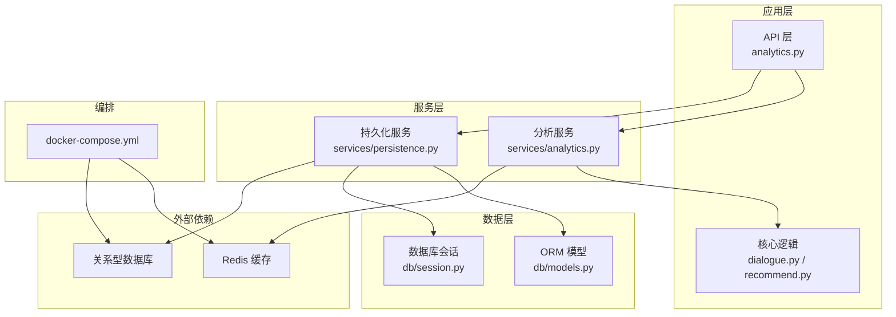
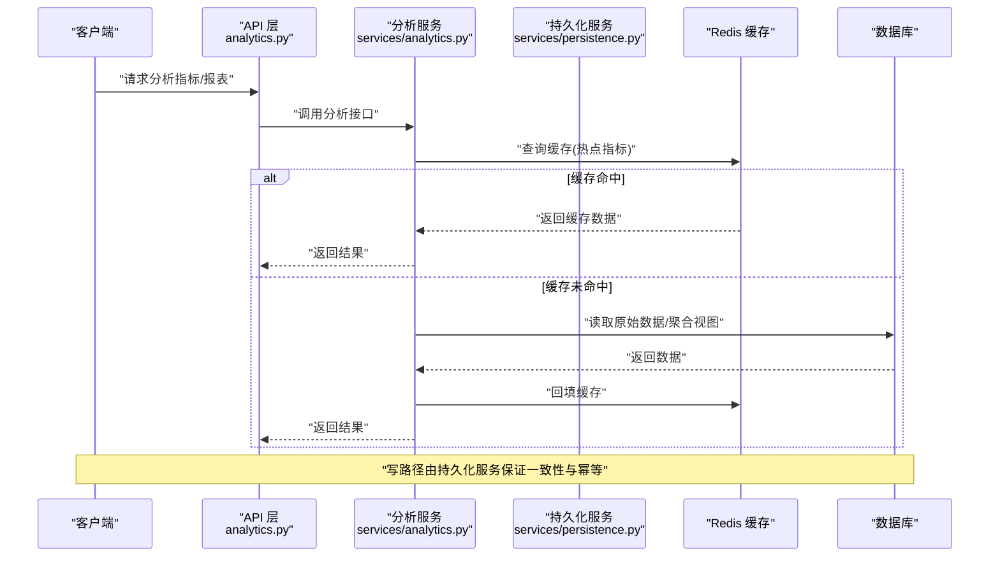
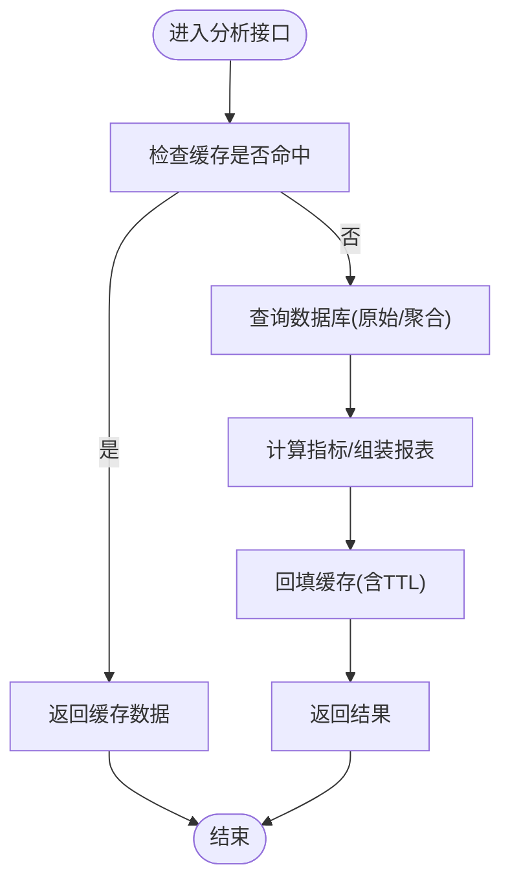
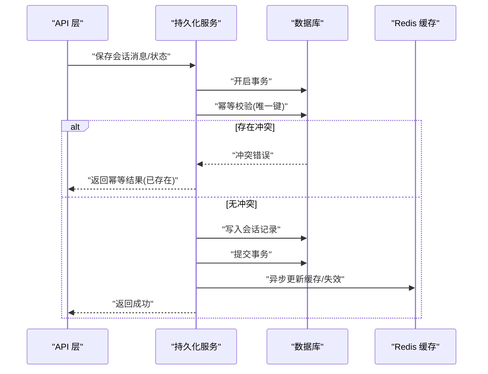
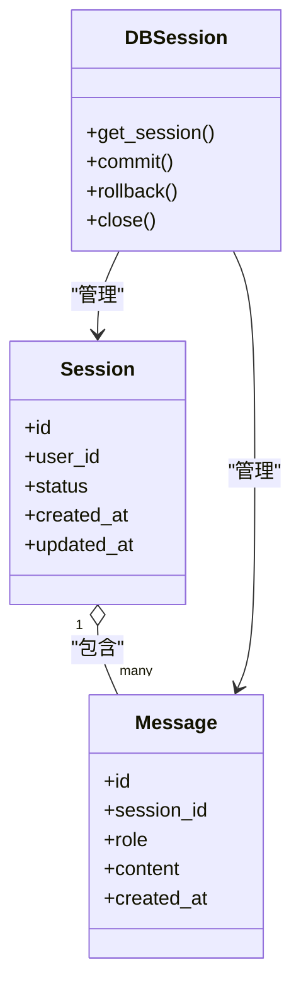
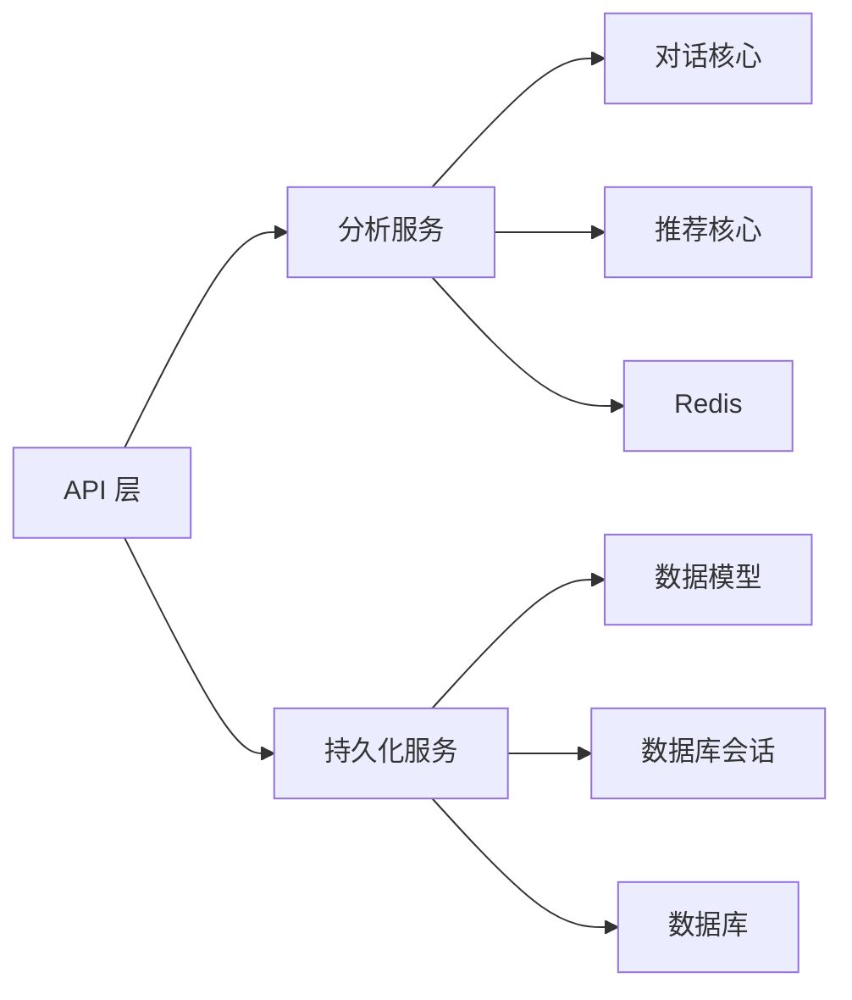

# 数据分析与持久化服务

<cite>
**本文引用的文件**   
- [backend/app/main.py](file://backend/app/main.py)
- [backend/app/api/analytics.py](file://backend/app/api/analytics.py)
- [backend/app/services/analytics.py](file://backend/app/services/analytics.py)
- [backend/app/services/persistence.py](file://backend/app/services/persistence.py)
- [backend/app/db/models.py](file://backend/app/db/models.py)
- [backend/app/db/session.py](file://backend/app/db/session.py)
- [backend/app/core/dialogue.py](file://backend/app/core/dialogue.py)
- [backend/app/core/recommend.py](file://backend/app/core/recommend.py)
- [backend/app/config.py](file://backend/app/config.py)
- [docker-compose.yml](file://docker-compose.yml)
</cite>

## 目录
1. [简介](#简介)
2. [项目结构](#项目结构)
3. [核心组件](#核心组件)
4. [架构总览](#架构总览)
5. [详细组件分析](#详细组件分析)
6. [依赖关系分析](#依赖关系分析)
7. [性能考虑](#性能考虑)
8. [故障排查指南](#故障排查指南)
9. [结论](#结论)
10. [附录](#附录)

## 简介
本技术文档聚焦于“数据分析与持久化服务”，围绕用户行为分析系统的数据采集、指标计算、统计报表生成，会话持久化（对话历史存储、状态管理、数据同步），缓存层设计（多级缓存、策略与一致性），数据聚合与分析引擎（实时统计、趋势分析、个性化推荐基础），以及备份恢复与迁移方案进行系统化说明。同时提供扩展指导与监控告警配置建议，帮助开发者快速理解并高效使用相关接口与服务。

## 项目结构
后端采用分层架构：API 层暴露 REST 接口，服务层封装业务逻辑（分析与持久化），数据访问层基于 ORM 模型与会话管理，核心领域逻辑位于 core 模块，配置集中于 config 模块。容器编排通过 docker-compose 统一管理服务。

图表来源
- [backend/app/api/analytics.py](file://backend/app/api/analytics.py)
- [backend/app/services/analytics.py](file://backend/app/services/analytics.py)
- [backend/app/services/persistence.py](file://backend/app/services/persistence.py)
- [backend/app/db/models.py](file://backend/app/db/models.py)
- [backend/app/db/session.py](file://backend/app/db/session.py)
- [docker-compose.yml](file://docker-compose.yml)

章节来源
- [backend/app/main.py](file://backend/app/main.py)
- [backend/app/api/analytics.py](file://backend/app/api/analytics.py)
- [backend/app/services/analytics.py](file://backend/app/services/analytics.py)
- [backend/app/services/persistence.py](file://backend/app/services/persistence.py)
- [backend/app/db/models.py](file://backend/app/db/models.py)
- [backend/app/db/session.py](file://backend/app/db/session.py)
- [docker-compose.yml](file://docker-compose.yml)

## 核心组件
- 分析服务（services/analytics.py）
  - 负责数据采集接入、指标计算、统计报表生成；对外提供查询与分析接口。
  - 与核心推荐/对话逻辑协作，为趋势分析与个性化推荐提供数据基础。
- 持久化服务（services/persistence.py）
  - 负责会话历史、状态与元数据的持久化；提供读写、批量写入与同步策略。
  - 基于 ORM 模型与会话管理，确保事务一致性与可恢复性。
- 数据模型与会话（db/models.py, db/session.py）
  - 定义实体表结构与关联关系；封装连接池、会话生命周期与重试策略。
- 核心领域逻辑（core/dialogue.py, core/recommend.py）
  - 对话上下文与状态机；推荐特征抽取与排序基础。
- 配置（config.py）
  - 集中管理数据库、缓存、分析任务等运行时参数。

章节来源
- [backend/app/services/analytics.py](file://backend/app/services/analytics.py)
- [backend/app/services/persistence.py](file://backend/app/services/persistence.py)
- [backend/app/db/models.py](file://backend/app/db/models.py)
- [backend/app/db/session.py](file://backend/app/db/session.py)
- [backend/app/core/dialogue.py](file://backend/app/core/dialogue.py)
- [backend/app/core/recommend.py](file://backend/app/core/recommend.py)
- [backend/app/config.py](file://backend/app/config.py)

## 架构总览
整体架构遵循“API 层 -> 服务层 -> 数据层”的分层模式，结合 Redis 作为热点数据与中间结果缓存，数据库作为权威源。分析服务在读取路径上优先命中缓存，写路径通过持久化服务落库并异步更新缓存与统计物化视图。

图表来源
- [backend/app/api/analytics.py](file://backend/app/api/analytics.py)
- [backend/app/services/analytics.py](file://backend/app/services/analytics.py)
- [backend/app/services/persistence.py](file://backend/app/services/persistence.py)
- [backend/app/db/models.py](file://backend/app/db/models.py)
- [backend/app/db/session.py](file://backend/app/db/session.py)

## 详细组件分析

### 分析服务（数据采集、指标计算、统计报表）
- 职责边界
  - 数据采集：对接上游事件流或接口，完成清洗、归一化与入库。
  - 指标计算：按时间窗口、维度切片进行聚合，产出常用指标（如活跃、留存、转化）。
  - 统计报表：组合多指标形成报表，支持分页、过滤与导出。
- 关键流程
  - 读路径：先查缓存，再回源数据库；对热点指标设置合理 TTL 与失效策略。
  - 写路径：通过持久化服务落库，随后触发异步统计刷新与缓存更新。
- 与核心逻辑的协作
  - 从对话与推荐核心中抽取特征，用于趋势分析与个性化推荐的基础数据。

图表来源
- [backend/app/services/analytics.py](file://backend/app/services/analytics.py)
- [backend/app/db/models.py](file://backend/app/db/models.py)
- [backend/app/db/session.py](file://backend/app/db/session.py)

章节来源
- [backend/app/services/analytics.py](file://backend/app/services/analytics.py)
- [backend/app/db/models.py](file://backend/app/db/models.py)
- [backend/app/db/session.py](file://backend/app/db/session.py)

### 持久化服务（会话历史、状态管理与数据同步）
- 职责边界
  - 会话历史：以会话为单位持久化消息、上下文与元数据。
  - 状态管理：维护会话生命周期状态（创建、进行中、结束、归档）。
  - 数据同步：提供幂等写入、冲突解决与增量同步能力。
- 关键流程
  - 写入：开启事务 -> 校验幂等键 -> 写入主表 -> 更新索引/物化视图 -> 提交事务 -> 异步通知缓存与统计。
  - 读取：优先读本地/二级缓存，未命中则回源数据库。
- 一致性保障
  - 使用唯一约束与幂等键避免重复写入。
  - 失败重试与补偿机制，确保最终一致。

图表来源
- [backend/app/services/persistence.py](file://backend/app/services/persistence.py)
- [backend/app/db/models.py](file://backend/app/db/models.py)
- [backend/app/db/session.py](file://backend/app/db/session.py)

章节来源
- [backend/app/services/persistence.py](file://backend/app/services/persistence.py)
- [backend/app/db/models.py](file://backend/app/db/models.py)
- [backend/app/db/session.py](file://backend/app/db/session.py)

### 数据模型与会话管理
- 模型设计要点
  - 会话与会话消息一对多关系；会话状态枚举；审计字段（创建/更新时间）。
  - 为高频查询列建立索引（如会话ID、时间戳、用户标识）。
- 会话管理
  - 连接池配置、超时与最大空闲数；自动重试与退避。
  - 事务边界清晰，异常时回滚并记录日志。

图表来源
- [backend/app/db/models.py](file://backend/app/db/models.py)
- [backend/app/db/session.py](file://backend/app/db/session.py)

章节来源
- [backend/app/db/models.py](file://backend/app/db/models.py)
- [backend/app/db/session.py](file://backend/app/db/session.py)

### 核心领域逻辑（对话与推荐）
- 对话核心（core/dialogue.py）
  - 维护对话上下文、意图识别与槽位填充；输出结构化状态供分析服务消费。
- 推荐核心（core/recommend.py）
  - 基于用户画像与上下文特征进行候选召回与排序；为分析服务提供特征与结果埋点。

章节来源
- [backend/app/core/dialogue.py](file://backend/app/core/dialogue.py)
- [backend/app/core/recommend.py](file://backend/app/core/recommend.py)

### 配置与环境
- 配置项涵盖数据库连接、缓存地址、分析任务调度、日志级别等。
- 通过环境变量或配置文件注入，便于多环境部署与灰度发布。

章节来源
- [backend/app/config.py](file://backend/app/config.py)

## 依赖关系分析
- 组件耦合
  - API 层仅依赖服务层接口，降低与具体实现的耦合。
  - 服务层通过抽象的会话与模型访问数据，屏蔽底层差异。
- 外部依赖
  - Redis 用于热点指标与中间结果缓存。
  - 关系型数据库作为权威数据源。
- 潜在循环依赖
  - 当前分层清晰，未发现直接循环导入；建议在新增模块时保持单向依赖。

图表来源
- [backend/app/api/analytics.py](file://backend/app/api/analytics.py)
- [backend/app/services/analytics.py](file://backend/app/services/analytics.py)
- [backend/app/services/persistence.py](file://backend/app/services/persistence.py)
- [backend/app/db/models.py](file://backend/app/db/models.py)
- [backend/app/db/session.py](file://backend/app/db/session.py)

章节来源
- [backend/app/api/analytics.py](file://backend/app/api/analytics.py)
- [backend/app/services/analytics.py](file://backend/app/services/analytics.py)
- [backend/app/services/persistence.py](file://backend/app/services/persistence.py)
- [backend/app/db/models.py](file://backend/app/db/models.py)
- [backend/app/db/session.py](file://backend/app/db/session.py)

## 性能考虑
- 查询优化
  - 针对高频查询条件建立复合索引（如会话ID+时间戳）。
  - 使用覆盖索引减少回表；分页查询使用游标式分页替代偏移量。
- 缓存策略
  - 多级缓存：进程内 L1 缓存（短 TTL）+ Redis L2 缓存（长 TTL）。
  - 热点数据预加载与延迟加载结合；缓存穿透防护（布隆过滤器或空值缓存）。
- 分库分表
  - 按用户或会话 ID 哈希分片；跨分片聚合通过分布式查询或物化视图汇总。
- 异步与批处理
  - 写放大场景采用批量写入与异步刷新；统计指标定时聚合与增量更新。
- 资源隔离
  - 读写分离与连接池隔离；分析任务与在线服务线程池分离。

[本节为通用性能建议，不直接分析具体文件]

## 故障排查指南
- 常见问题定位
  - 缓存不一致：核对缓存失效策略与写路径更新顺序；增加一致性校验日志。
  - 数据库慢查询：启用慢查询日志，结合 EXPLAIN 分析执行计划，补充索引。
  - 事务冲突：关注幂等键与唯一约束冲突日志，必要时引入重试与退避。
- 监控与告警
  - 指标：QPS、P99 延迟、错误率、缓存命中率、连接池使用率、磁盘 IO。
  - 告警阈值：错误率突增、延迟飙升、缓存命中率骤降、连接池耗尽。
- 日志规范
  - 统一 trace_id 贯穿请求链路；关键步骤打点；敏感信息脱敏。

[本节为通用排障建议，不直接分析具体文件]

## 结论
本服务通过分层架构与清晰的职责划分，实现了用户行为分析与会话持久化的稳定运行。借助多级缓存与合理的索引设计，系统在吞吐与延迟方面具备良好表现。后续可在分库分表、离线分析流水线与更细粒度的监控告警方面持续演进。

[本节为总结性内容，不直接分析具体文件]

## 附录

### 使用示例（接口与调用方式）
- 获取分析指标
  - 调用位置：API 层分析接口
  - 参考路径：[backend/app/api/analytics.py](file://backend/app/api/analytics.py)
- 保存会话消息
  - 调用位置：持久化服务
  - 参考路径：[backend/app/services/persistence.py](file://backend/app/services/persistence.py)
- 查询会话历史
  - 调用位置：持久化服务
  - 参考路径：[backend/app/services/persistence.py](file://backend/app/services/persistence.py)
- 构建统计报表
  - 调用位置：分析服务
  - 参考路径：[backend/app/services/analytics.py](file://backend/app/services/analytics.py)

章节来源
- [backend/app/api/analytics.py](file://backend/app/api/analytics.py)
- [backend/app/services/analytics.py](file://backend/app/services/analytics.py)
- [backend/app/services/persistence.py](file://backend/app/services/persistence.py)

### 数据备份与恢复（方案建议）
- 全量备份
  - 定期快照数据库与对象存储中的附件；保留多版本以便回滚。
- 增量备份
  - 基于 WAL/Binlog 的增量捕获；结合时间点恢复（PITR）。
- 灾难恢复
  - 演练恢复流程，验证 RTO/RPO 目标；跨可用区复制关键数据。
- 数据迁移
  - 双写过渡与灰度切换；数据校验与回滚预案；变更脚本版本化管理。

[本节为通用方案建议，不直接分析具体文件]

### 扩展指导与监控告警配置
- 扩展点
  - 新增指标：在分析服务中注册新的聚合规则与缓存键。
  - 新增数据源：实现统一的适配器接口，接入新的事件通道。
- 监控告警
  - 集成 APM 与日志平台；定义关键业务与系统指标看板。
  - 配置告警规则与通知渠道（邮件、IM、短信）。

[本节为通用实施建议，不直接分析具体文件]