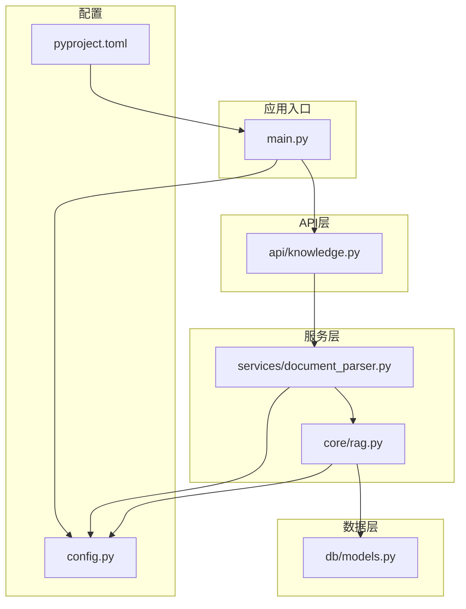
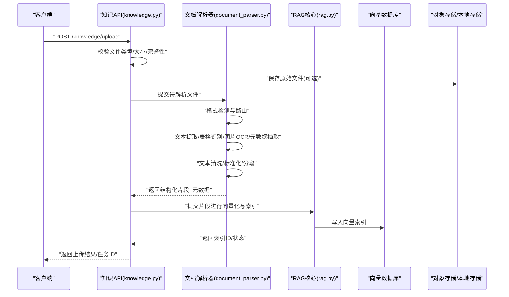
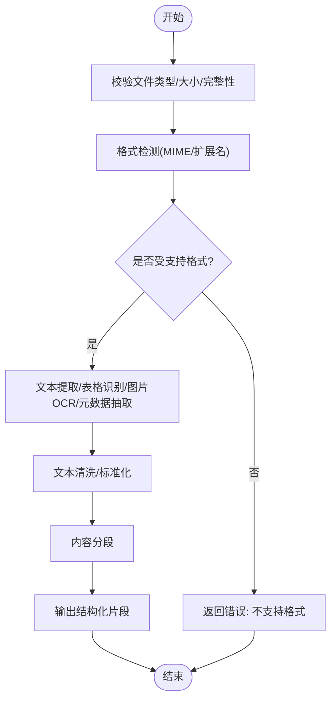
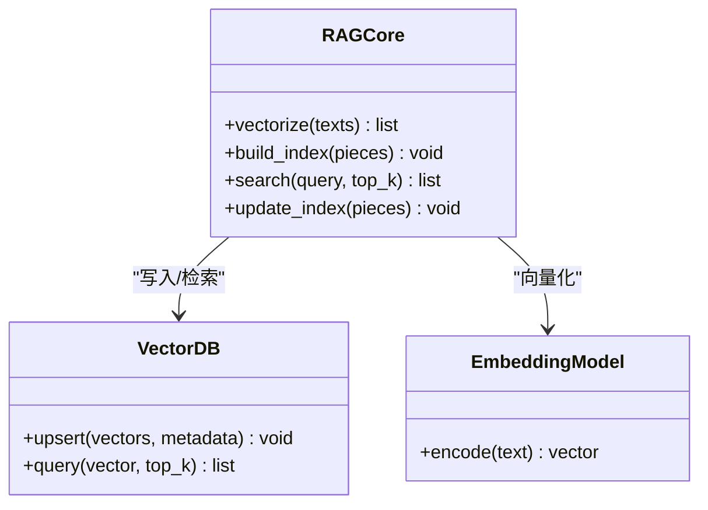
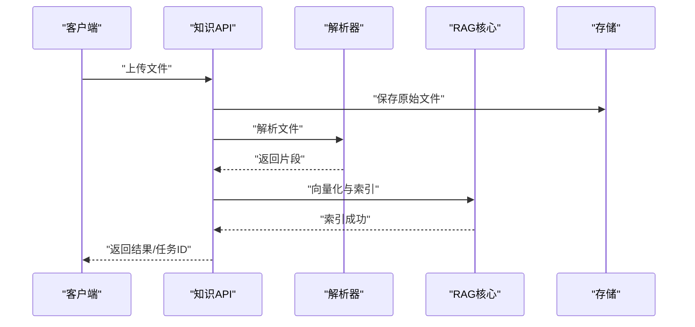
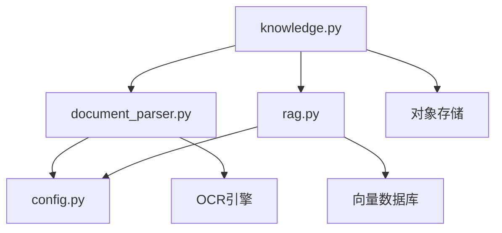

# 文档解析服务

<cite>
**本文引用的文件**   
- [backend/app/services/document_parser.py](file://backend/app/services/document_parser.py)
- [backend/app/api/knowledge.py](file://backend/app/api/knowledge.py)
- [backend/app/core/rag.py](file://backend/app/core/rag.py)
- [backend/app/db/models.py](file://backend/app/db/models.py)
- [backend/app/config.py](file://backend/app/config.py)
- [backend/app/main.py](file://backend/app/main.py)
- [backend/pyproject.toml](file://backend/pyproject.toml)
</cite>

## 目录
1. [简介](#简介)
2. [项目结构](#项目结构)
3. [核心组件](#核心组件)
4. [架构总览](#架构总览)
5. [详细组件分析](#详细组件分析)
6. [依赖关系分析](#依赖关系分析)
7. [性能考虑](#性能考虑)
8. [故障排查指南](#故障排查指南)
9. [结论](#结论)
10. [附录](#附录)

## 简介
本技术文档聚焦于“文档解析服务”，覆盖多格式文档（PDF、Word、Excel、Markdown、HTML）的解析与结构化处理，包括文本提取、表格识别、图片OCR、元数据提取、预处理与后处理（清洗、标准化、分段）、向量数据库集成（向量化、索引构建、检索优化），以及上传管理流程（验证、格式检测、存储策略）。同时提供扩展指导与性能优化建议，帮助开发者快速理解并二次开发。

## 项目结构
后端采用分层架构：API层暴露接口，服务层封装业务逻辑（含文档解析、RAG等），数据层负责模型与持久化，配置集中管理。文档解析相关代码主要位于服务层与API层，并与RAG模块协同完成向量化与检索。

图表来源
- [backend/app/main.py](file://backend/app/main.py)
- [backend/app/api/knowledge.py](file://backend/app/api/knowledge.py)
- [backend/app/services/document_parser.py](file://backend/app/services/document_parser.py)
- [backend/app/core/rag.py](file://backend/app/core/rag.py)
- [backend/app/db/models.py](file://backend/app/db/models.py)
- [backend/app/config.py](file://backend/app/config.py)
- [backend/pyproject.toml](file://backend/pyproject.toml)

章节来源
- [backend/app/main.py](file://backend/app/main.py)
- [backend/app/api/knowledge.py](file://backend/app/api/knowledge.py)
- [backend/app/services/document_parser.py](file://backend/app/services/document_parser.py)
- [backend/app/core/rag.py](file://backend/app/core/rag.py)
- [backend/app/db/models.py](file://backend/app/db/models.py)
- [backend/app/config.py](file://backend/app/config.py)
- [backend/pyproject.toml](file://backend/pyproject.toml)

## 核心组件
- 文档解析器（Document Parser）
  - 职责：统一接入多种文档格式，执行文本提取、表格识别、图片OCR、元数据抽取；进行文本清洗、格式标准化与内容分段；输出结构化片段供后续向量化使用。
  - 关键能力：
    - PDF：文本层提取、表格区域定位、内嵌图片OCR。
    - Word/Excel：段落与表格结构解析、样式信息保留用于分段。
    - Markdown/HTML：标签解析、标题层级识别、链接与媒体资源处理。
    - 通用：编码检测、乱码修复、空白规范化、标点统一、段落切分、去重与过滤。
- RAG核心（RAG Core）
  - 职责：将解析后的文本片段进行向量化、索引构建与检索优化；与向量数据库交互，支持相似度检索与上下文拼接。
- API接口（Knowledge API）
  - 职责：接收上传请求，校验文件类型与大小，调度解析器，触发RAG入库，返回任务状态或结果。
- 数据模型（DB Models）
  - 职责：定义知识库条目、解析片段、元数据等持久化结构。
- 配置（Config）
  - 职责：集中管理解析器参数、OCR引擎开关、向量库连接、存储路径等。

章节来源
- [backend/app/services/document_parser.py](file://backend/app/services/document_parser.py)
- [backend/app/core/rag.py](file://backend/app/core/rag.py)
- [backend/app/api/knowledge.py](file://backend/app/api/knowledge.py)
- [backend/app/db/models.py](file://backend/app/db/models.py)
- [backend/app/config.py](file://backend/app/config.py)

## 架构总览
文档解析服务整体流程如下：前端或外部系统通过API上传文档，API层进行基础校验并调用解析器；解析器按格式选择对应处理器，完成文本提取、表格识别、图片OCR与元数据抽取；随后对文本进行清洗、标准化与分段；RAG模块将片段向量化并写入向量数据库；检索时根据查询召回相关片段并组装回答。

图表来源
- [backend/app/api/knowledge.py](file://backend/app/api/knowledge.py)
- [backend/app/services/document_parser.py](file://backend/app/services/document_parser.py)
- [backend/app/core/rag.py](file://backend/app/core/rag.py)

## 详细组件分析

### 文档解析器（Document Parser）
- 设计要点
  - 统一入口：基于MIME类型或扩展名进行格式路由。
  - 模块化处理器：每种格式实现独立的解析策略，便于扩展与维护。
  - 结构化输出：以片段为单位，包含文本、类型（段落/表格/图片描述）、位置信息、元数据。
- 处理流程
  - 输入校验：检查文件头、扩展名、大小限制。
  - 格式检测：优先依据MIME类型，其次回退到扩展名。
  - 文本提取：
    - PDF：优先使用文本层；若为扫描图则走OCR。
    - Word/Excel：解析XML结构，提取段落、表格、列表。
    - Markdown/HTML：解析DOM树，提取标题层级、正文、链接、图片。
  - 表格识别：定位表格区域，转换为行列结构，必要时进行单元格合并处理。
  - 图片OCR：对嵌入图片进行OCR，生成图片描述文本。
  - 元数据抽取：作者、创建时间、修改时间、关键词、摘要等。
  - 文本清洗：去除不可见字符、统一全半角、规范化空格与换行、标点统一。
  - 格式标准化：统一编码、转义特殊字符、保留必要标记（如标题级别）。
  - 内容分段：按语义或固定长度切分，保证片段可独立检索。
- 错误处理
  - 捕获解析异常，记录日志，返回失败片段与错误原因，支持重试与降级（如跳过损坏页）。
- 性能优化
  - 流式读取大文件，避免一次性加载内存。
  - OCR与向量化异步执行，提升吞吐。
  - 缓存已解析片段，避免重复计算。

图表来源
- [backend/app/services/document_parser.py](file://backend/app/services/document_parser.py)

章节来源
- [backend/app/services/document_parser.py](file://backend/app/services/document_parser.py)

### RAG核心（RAG Core）
- 设计要点
  - 向量化：将文本片段转为向量，支持不同Embedding模型。
  - 索引构建：维护向量索引，支持增量更新与批量导入。
  - 检索优化：相似度阈值、Top-K、重排序、上下文窗口控制。
- 处理流程
  - 接收片段列表，批量向量化。
  - 写入向量数据库，建立索引。
  - 查询时召回相关片段，拼接上下文，返回结果。
- 错误处理
  - 向量维度不一致、索引写入失败、检索超时等异常需记录并告警。
- 性能优化
  - 批处理向量化，减少网络往返。
  - 索引分区与分片，提高检索效率。
  - 缓存热点片段向量，降低重复计算。

图表来源
- [backend/app/core/rag.py](file://backend/app/core/rag.py)

章节来源
- [backend/app/core/rag.py](file://backend/app/core/rag.py)

### 知识API（Knowledge API）
- 设计要点
  - 上传接口：接收文件，校验类型与大小，落盘或对象存储。
  - 解析调度：调用解析器，等待结果或异步任务回调。
  - 状态反馈：返回任务ID与进度，支持轮询或WebSocket推送。
- 处理流程
  - 接收请求，校验文件。
  - 保存原始文件（可选）。
  - 调用解析器，获取结构化片段。
  - 调用RAG核心进行向量化与索引。
  - 返回结果。
- 错误处理
  - 文件过大、类型不支持、解析失败、索引写入失败等错误需明确返回。

图表来源
- [backend/app/api/knowledge.py](file://backend/app/api/knowledge.py)

章节来源
- [backend/app/api/knowledge.py](file://backend/app/api/knowledge.py)

### 数据模型（DB Models）
- 设计要点
  - 知识库条目：包含标题、来源、版本、状态等。
  - 解析片段：包含文本、类型、位置、元数据、向量ID等。
  - 索引映射：片段与向量ID的关联表。
- 约束与索引
  - 主键、唯一约束、外键关系。
  - 常用查询字段建立索引以提升检索性能。

章节来源
- [backend/app/db/models.py](file://backend/app/db/models.py)

### 配置（Config）
- 设计要点
  - 解析器参数：最大文件大小、支持的格式列表、分段长度、清洗规则。
  - OCR配置：引擎地址、超时、并发数。
  - 向量库配置：连接字符串、索引名称、相似度算法。
  - 存储路径：本地或对象存储桶配置。
- 环境变量与默认值
  - 支持从环境变量覆盖默认配置，便于部署与环境隔离。

章节来源
- [backend/app/config.py](file://backend/app/config.py)

## 依赖关系分析
- 内部依赖
  - API层依赖服务层（解析器、RAG）。
  - 服务层依赖数据层（模型）与配置。
  - RAG依赖向量数据库与Embedding模型。
- 外部依赖
  - 文档解析库（PDF/Word/Excel/Markdown/HTML）。
  - OCR引擎（本地或远程服务）。
  - 向量数据库（如Milvus、Chroma、FAISS等）。
  - 对象存储（如MinIO、S3）。
- 潜在循环依赖
  - 确保API不直接依赖模型，服务层解耦模型与外部库。

图表来源
- [backend/app/api/knowledge.py](file://backend/app/api/knowledge.py)
- [backend/app/services/document_parser.py](file://backend/app/services/document_parser.py)
- [backend/app/core/rag.py](file://backend/app/core/rag.py)
- [backend/app/config.py](file://backend/app/config.py)

章节来源
- [backend/pyproject.toml](file://backend/pyproject.toml)

## 性能考虑
- 异步处理
  - 解析与向量化异步执行，避免阻塞API响应。
  - 使用消息队列或后台任务调度器（如Celery、APScheduler）管理长任务。
- 缓存机制
  - 缓存已解析片段与向量，避免重复计算。
  - 缓存热门查询结果，降低向量检索压力。
- 内存管理
  - 流式读取大文件，分块处理。
  - 及时释放临时对象，避免内存泄漏。
- 批处理与并行
  - 批量向量化，减少网络往返。
  - 并行OCR与解析，提升吞吐。
- 索引优化
  - 合理设置Top-K与相似度阈值。
  - 索引分区与分片，提高检索效率。

[本节为通用性能建议，无需具体文件引用]

## 故障排查指南
- 常见问题
  - 文件格式不支持：检查MIME类型与扩展名映射，确认解析器路由逻辑。
  - 解析失败：查看日志中的异常堆栈，确认依赖库安装与版本兼容。
  - OCR失败：检查OCR服务连通性与超时配置，尝试降级为纯文本解析。
  - 向量写入失败：检查向量数据库连接与权限，确认向量维度一致。
  - 内存溢出：调整分块大小与并发度，启用流式处理。
- 诊断步骤
  - 启用详细日志，记录每个阶段的输入输出摘要。
  - 使用最小复现用例测试特定格式。
  - 监控CPU、内存、磁盘I/O与网络延迟。
- 恢复策略
  - 失败重试与幂等性设计。
  - 断点续传与任务补偿。
  - 降级模式（跳过损坏页、仅文本解析）。

章节来源
- [backend/app/services/document_parser.py](file://backend/app/services/document_parser.py)
- [backend/app/core/rag.py](file://backend/app/core/rag.py)
- [backend/app/api/knowledge.py](file://backend/app/api/knowledge.py)

## 结论
文档解析服务通过统一的解析器与RAG核心，实现了多格式文档的结构化提取与检索增强生成。合理的预处理与后处理、完善的错误处理与性能优化策略，确保了系统的稳定性与可扩展性。开发者可基于现有架构快速扩展新格式与新功能，并通过配置与插件化方式灵活适配不同环境。

[本节为总结性内容，无需具体文件引用]

## 附录

### 扩展指导
- 新增格式支持
  - 在解析器中注册新的格式处理器，实现文本提取、表格识别与元数据抽取。
  - 更新配置中的支持格式列表与MIME映射。
- 自定义清洗与分段规则
  - 在清洗阶段添加正则表达式与规则引擎。
  - 在分段阶段引入语义分割或主题边界检测。
- 替换OCR引擎
  - 抽象OCR接口，注入不同实现（本地PaddleOCR、云端Tesseract等）。
- 向量数据库切换
  - 抽象向量库接口，支持Milvus、Chroma、FAISS等。

[本节为概念性指导，无需具体文件引用]

### 代码示例路径
- 上传与解析流程
  - [backend/app/api/knowledge.py](file://backend/app/api/knowledge.py)
- 解析器实现
  - [backend/app/services/document_parser.py](file://backend/app/services/document_parser.py)
- RAG向量化与检索
  - [backend/app/core/rag.py](file://backend/app/core/rag.py)
- 数据模型定义
  - [backend/app/db/models.py](file://backend/app/db/models.py)
- 配置项说明
  - [backend/app/config.py](file://backend/app/config.py)
- 依赖声明
  - [backend/pyproject.toml](file://backend/pyproject.toml)