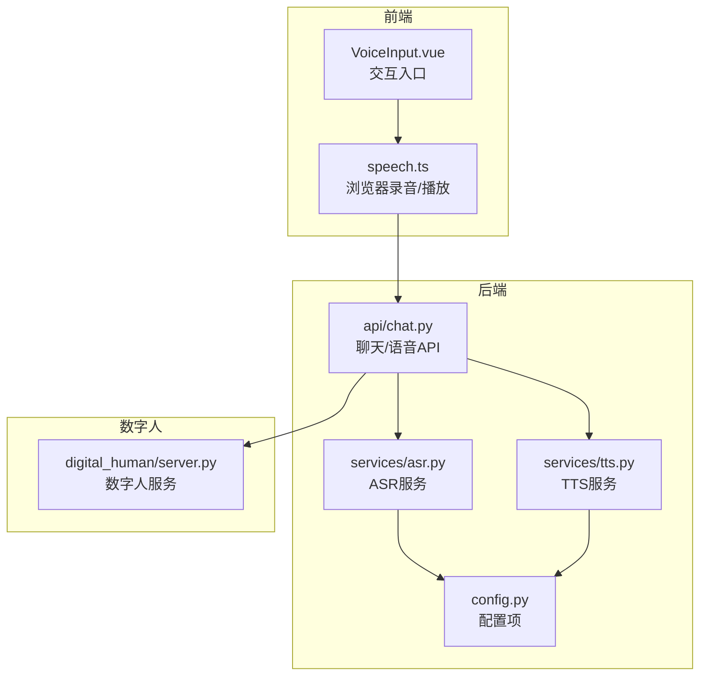
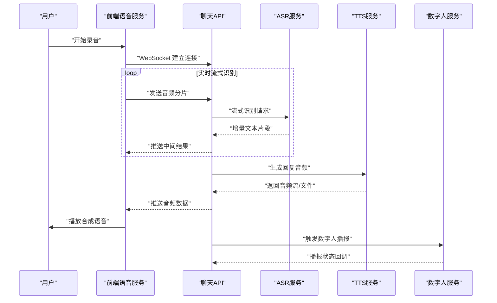
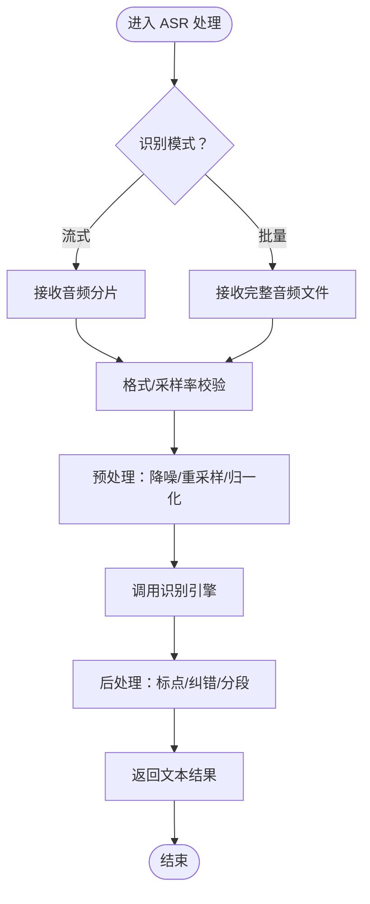
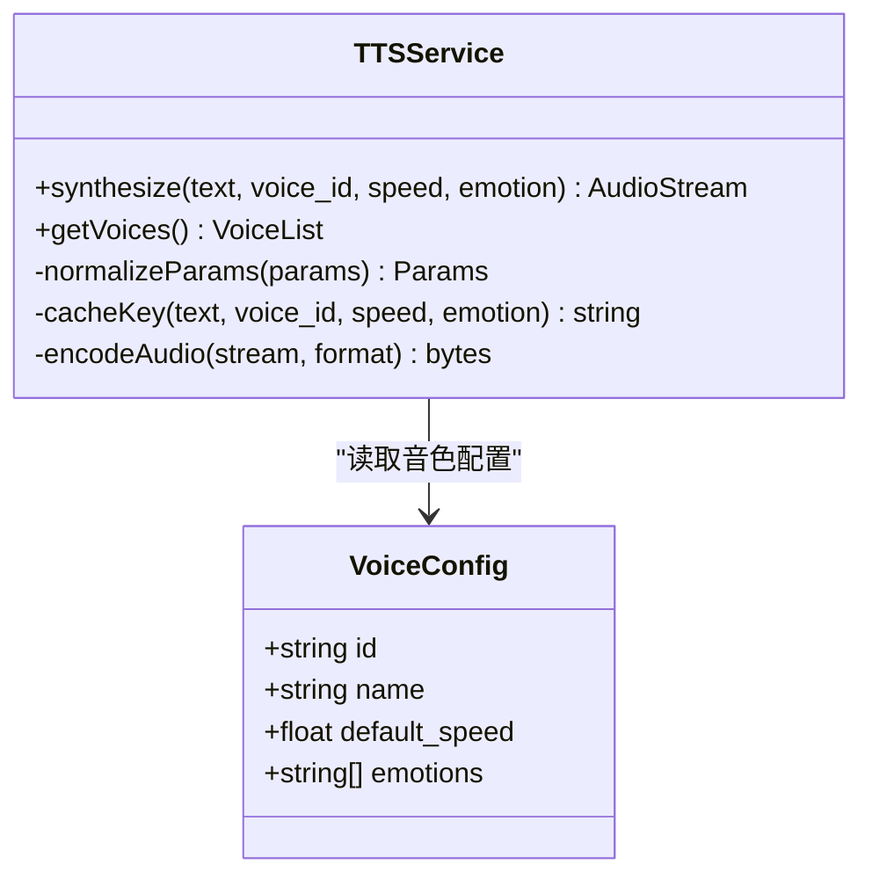
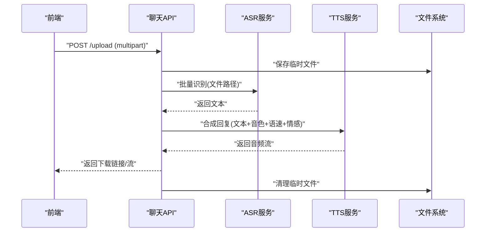
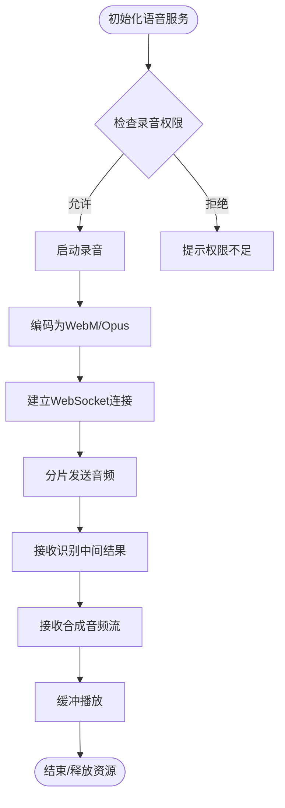
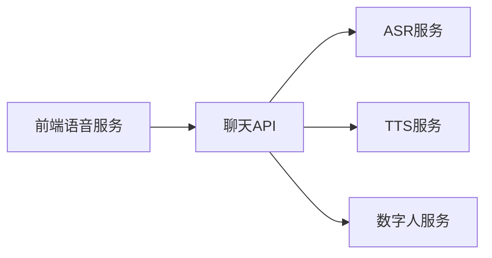

# 语音服务集成

<cite>
**本文引用的文件**   
- [backend/app/services/asr.py](file://backend/app/services/asr.py)
- [backend/app/services/tts.py](file://backend/app/services/tts.py)
- [backend/app/api/chat.py](file://backend/app/api/chat.py)
- [backend/app/config.py](file://backend/app/config.py)
- [frontend/tourist-app/src/services/speech.ts](file://frontend/tourist-app/src/services/speech.ts)
- [frontend/tourist-app/src/components/VoiceInput/VoiceInput.vue](file://frontend/tourist-app/src/components/VoiceInput/VoiceInput.vue)
- [digital_human/server.py](file://digital_human/server.py)
</cite>

## 目录
1. [简介](#简介)
2. [项目结构](#项目结构)
3. [核心组件](#核心组件)
4. [架构总览](#架构总览)
5. [详细组件分析](#详细组件分析)
6. [依赖关系分析](#依赖关系分析)
7. [性能考虑](#性能考虑)
8. [故障排查指南](#故障排查指南)
9. [结论](#结论)
10. [附录](#附录)

## 简介
本技术文档聚焦于智能旅游项目的语音服务集成，覆盖以下关键主题：
- 语音识别（ASR）服务集成：音频格式支持、实时流式识别与批量处理模式
- 语音合成（TTS）服务架构：音色选择、语速控制、情感表达
- 音频格式转换与处理流程：采样率调整、降噪处理、格式标准化
- WebSocket 实时通信方案：连接管理、消息协议、错误恢复
- 音频文件上传下载：大小限制、格式验证、存储策略
- 集成示例与最佳实践
- 性能优化技巧：缓存策略、并发控制、资源管理
- 面向开发者的完整语音功能开发指南

## 项目结构
本项目采用前后端分离架构，后端基于 Python 提供 ASR/TTS 能力与 API 暴露，前端通过 TypeScript/JavaScript 调用后端接口并实现浏览器端录音与播放。数字人模块独立部署，负责驱动虚拟形象同步说话。

图表来源
- [backend/app/api/chat.py](file://backend/app/api/chat.py)
- [backend/app/services/asr.py](file://backend/app/services/asr.py)
- [backend/app/services/tts.py](file://backend/app/services/tts.py)
- [backend/app/config.py](file://backend/app/config.py)
- [frontend/tourist-app/src/services/speech.ts](file://frontend/tourist-app/src/services/speech.ts)
- [frontend/tourist-app/src/components/VoiceInput/VoiceInput.vue](file://frontend/tourist-app/src/components/VoiceInput/VoiceInput.vue)
- [digital_human/server.py](file://digital_human/server.py)

章节来源
- [backend/app/api/chat.py](file://backend/app/api/chat.py)
- [backend/app/services/asr.py](file://backend/app/services/asr.py)
- [backend/app/services/tts.py](file://backend/app/services/tts.py)
- [backend/app/config.py](file://backend/app/config.py)
- [frontend/tourist-app/src/services/speech.ts](file://frontend/tourist-app/src/services/speech.ts)
- [frontend/tourist-app/src/components/VoiceInput/VoiceInput.vue](file://frontend/tourist-app/src/components/VoiceInput/VoiceInput.vue)
- [digital_human/server.py](file://digital_human/server.py)

## 核心组件
- ASR 服务：封装语音识别能力，支持多种音频格式输入，提供流式与批量两种处理路径，统一返回文本结果。
- TTS 服务：封装语音合成能力，支持多音色、语速调节与情感表达，输出标准音频格式供前端播放或持久化。
- 聊天 API：聚合 ASR/TTS 能力，对外暴露 REST/WebSocket 接口，协调数字人同步。
- 前端语音服务：浏览器端采集麦克风数据、编码为适合传输的格式，维护 WebSocket 连接，播放合成音频。
- 数字人服务：接收文本或音频事件，驱动虚拟形象口型与动作。

章节来源
- [backend/app/services/asr.py](file://backend/app/services/asr.py)
- [backend/app/services/tts.py](file://backend/app/services/tts.py)
- [backend/app/api/chat.py](file://backend/app/api/chat.py)
- [frontend/tourist-app/src/services/speech.ts](file://frontend/tourist-app/src/services/speech.ts)
- [digital_human/server.py](file://digital_human/server.py)

## 架构总览
整体语音链路包括“前端采集 → 后端识别/合成 → 前端播放/展示”的闭环，同时支持数字人同步。

图表来源
- [backend/app/api/chat.py](file://backend/app/api/chat.py)
- [backend/app/services/asr.py](file://backend/app/services/asr.py)
- [backend/app/services/tts.py](file://backend/app/services/tts.py)
- [frontend/tourist-app/src/services/speech.ts](file://frontend/tourist-app/src/services/speech.ts)
- [digital_human/server.py](file://digital_human/server.py)

## 详细组件分析

### ASR 服务（语音识别）
- 音频格式支持：兼容常见 PCM/WAV/MP3/OGG 等格式；在接入层进行格式校验与转码，确保下游模型稳定消费。
- 实时流式识别：将音频按时间切片（如 20-50ms），以二进制帧或 Base64 块形式通过 WebSocket 推送，服务端增量返回识别片段，降低端到端延迟。
- 批量处理模式：支持一次性上传长音频文件，服务端排队处理并异步返回结果，适用于离线转写场景。
- 错误处理：网络中断、超时、解码失败、模型不可用等异常均会返回结构化错误码，便于客户端重试与降级。
- 性能优化：启用连接池、线程池与批处理合并；对热点音频片段做缓存；按需降采样减少带宽占用。

图表来源
- [backend/app/services/asr.py](file://backend/app/services/asr.py)

章节来源
- [backend/app/services/asr.py](file://backend/app/services/asr.py)

### TTS 服务（语音合成）
- 音色选择：支持多音色切换，可通过参数指定音色 ID 或名称，适配不同角色与场景。
- 语速控制：提供语速调节参数，支持加速/减速，满足不同对话节奏需求。
- 情感表达：支持情感标签或风格参数，使合成语音具备更自然的语气与情绪。
- 输出格式：默认输出标准 PCM/WAV，可按需转换为 MP3/OGG 以降低带宽；支持流式播放与断点续播。
- 缓存策略：对短文本与常用音色组合进行结果缓存，命中时直接返回，提升响应速度。
- 错误处理：引擎不可用、参数非法、配额超限等异常均返回明确错误信息，便于前端提示与重试。

图表来源
- [backend/app/services/tts.py](file://backend/app/services/tts.py)

章节来源
- [backend/app/services/tts.py](file://backend/app/services/tts.py)

### 聊天 API（REST/WebSocket 聚合）
- 职责：统一暴露语音相关接口，协调 ASR/TTS 与数字人服务；管理会话上下文与权限校验。
- 实时通信：基于 WebSocket 维持长连接，双向推送识别中间结果与合成音频片段；支持心跳保活与自动重连。
- 文件上传下载：提供 REST 接口用于音频文件上传与下载，包含大小限制、MIME 类型校验与存储策略。
- 错误恢复：连接断开时自动重连，识别/合成分片丢失时请求补发；服务端记录日志与指标以便定位问题。

图表来源
- [backend/app/api/chat.py](file://backend/app/api/chat.py)
- [backend/app/services/asr.py](file://backend/app/services/asr.py)
- [backend/app/services/tts.py](file://backend/app/services/tts.py)

章节来源
- [backend/app/api/chat.py](file://backend/app/api/chat.py)

### 前端语音服务（浏览器端）
- 录音与编码：使用浏览器 MediaRecorder 采集麦克风数据，编码为 WebM/Opus 或 AAC，再转为后端可接受的格式。
- WebSocket 管理：维护连接生命周期，处理握手、心跳、断线重连与消息路由；支持分片发送与顺序保证。
- 播放与缓冲：对 TTS 返回的音频流进行缓冲播放，避免卡顿；支持暂停/继续与音量控制。
- 错误提示：网络异常、权限拒绝、解码失败等场景给出友好提示与重试建议。

图表来源
- [frontend/tourist-app/src/services/speech.ts](file://frontend/tourist-app/src/services/speech.ts)

章节来源
- [frontend/tourist-app/src/services/speech.ts](file://frontend/tourist-app/src/services/speech.ts)
- [frontend/tourist-app/src/components/VoiceInput/VoiceInput.vue](file://frontend/tourist-app/src/components/VoiceInput/VoiceInput.vue)

### 数字人服务
- 职责：接收文本或音频事件，驱动虚拟形象口型与动作，提供播报状态回调。
- 接口：提供 REST/WebSocket 接口，支持同步/异步播报；可配置表情与动作库。
- 容错：播报失败时回退到纯语音播放；记录日志与监控指标。

章节来源
- [digital_human/server.py](file://digital_human/server.py)

## 依赖关系分析
- 组件耦合：聊天 API 作为编排层，依赖 ASR/TTS 与数字人服务；前端仅依赖聊天 API，屏蔽底层差异。
- 外部依赖：ASR/TTS 可能依赖第三方引擎或服务；数字人服务可能依赖渲染引擎或媒体服务器。
- 潜在循环：应避免 API 层反向依赖具体服务实现，保持清晰的分层边界。

图表来源
- [backend/app/api/chat.py](file://backend/app/api/chat.py)
- [backend/app/services/asr.py](file://backend/app/services/asr.py)
- [backend/app/services/tts.py](file://backend/app/services/tts.py)
- [frontend/tourist-app/src/services/speech.ts](file://frontend/tourist-app/src/services/speech.ts)
- [digital_human/server.py](file://digital_human/server.py)

章节来源
- [backend/app/api/chat.py](file://backend/app/api/chat.py)
- [backend/app/services/asr.py](file://backend/app/services/asr.py)
- [backend/app/services/tts.py](file://backend/app/services/tts.py)
- [frontend/tourist-app/src/services/speech.ts](file://frontend/tourist-app/src/services/speech.ts)
- [digital_human/server.py](file://digital_human/server.py)

## 性能考虑
- 缓存策略：对短文本 TTS 结果与热门 ASR 片段进行缓存，设置合理 TTL，降低重复计算与网络开销。
- 并发控制：对 ASR/TTS 请求进行限流与队列管理，避免雪崩；使用连接池与线程池提高吞吐。
- 资源管理：及时释放录音、播放与文件句柄；对大文件采用流式读写，避免内存峰值过高。
- 传输优化：优先使用低延迟编解码（如 Opus），合理切分音频分片，启用压缩与去抖。
- 监控与告警：记录关键指标（延迟、成功率、CPU/内存占用），设置阈值告警与自动扩容。

[本节为通用指导，不直接分析具体文件]

## 故障排查指南
- 常见问题
  - 录音权限被拒：检查浏览器权限弹窗与用户授权；在前端给出明确提示与引导。
  - WebSocket 频繁断线：检查心跳间隔与超时配置；增加重连退避与最大重试次数。
  - 音频格式不支持：确认前端编码与后端期望一致；必要时在服务端进行格式转换。
  - 识别/合成失败：查看服务端日志与错误码；核对模型可用性、配额与参数合法性。
  - 数字人不同步：检查文本/音频事件到达顺序；必要时引入序列号与去重逻辑。
- 调试建议
  - 开启详细日志与追踪 ID，关联一次请求的全链路日志。
  - 使用抓包工具验证消息体结构与时序。
  - 对关键路径添加埋点与指标上报。

章节来源
- [backend/app/api/chat.py](file://backend/app/api/chat.py)
- [backend/app/services/asr.py](file://backend/app/services/asr.py)
- [backend/app/services/tts.py](file://backend/app/services/tts.py)
- [frontend/tourist-app/src/services/speech.ts](file://frontend/tourist-app/src/services/speech.ts)

## 结论
本方案通过清晰的层次划分与模块化设计，实现了从前端采集到后端识别/合成再到数字人展示的完整语音链路。结合缓存、并发控制与资源管理，可在保证用户体验的同时提升系统稳定性与可扩展性。开发者可依据本文档快速集成与扩展语音功能。

[本节为总结性内容，不直接分析具体文件]

## 附录

### 集成示例与最佳实践
- 实时对话
  - 前端：启动录音，建立 WebSocket，分片发送音频；接收中间文本与音频流，边收边播。
  - 后端：WS 接入层转发至 ASR，增量返回文本；根据业务逻辑调用 TTS，推送音频片段。
- 批量转写
  - 前端：选择音频文件上传；后端落盘并调度 ASR 任务；完成后返回下载链接或通知。
- 音色与情感
  - 前端：提供音色选择器与语速滑块；提交参数至 TTS 接口；根据反馈更新 UI。
- 错误恢复
  - 前端：断线重连、丢包补发、播放缓冲；用户可见的错误提示与重试按钮。
  - 后端：幂等处理、重试队列、熔断与降级策略。

[本节为概念性指导，不直接分析具体文件]

### 配置与环境
- 后端配置项：ASR/TTS 引擎地址、鉴权密钥、超时与重试、缓存开关与容量、数字人服务地址等。
- 前端配置项：WebSocket 地址、心跳间隔、最大分片时长、默认音色与语速。

章节来源
- [backend/app/config.py](file://backend/app/config.py)