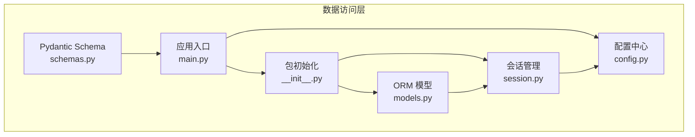
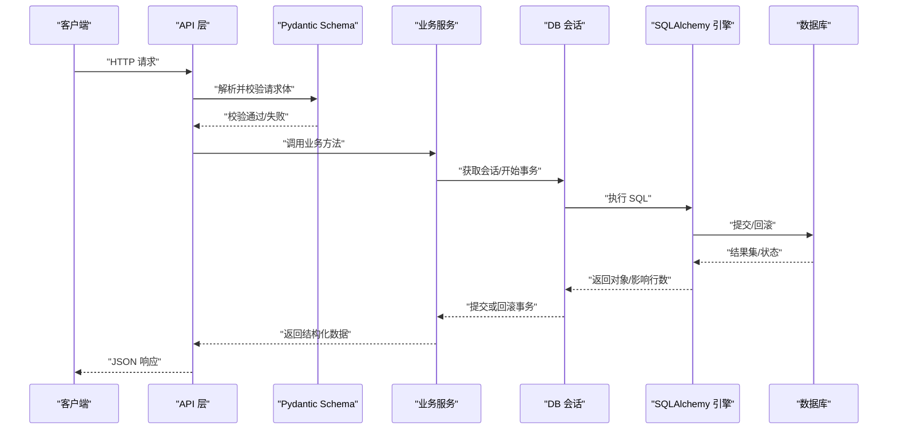
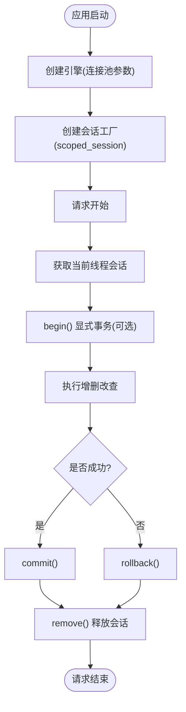
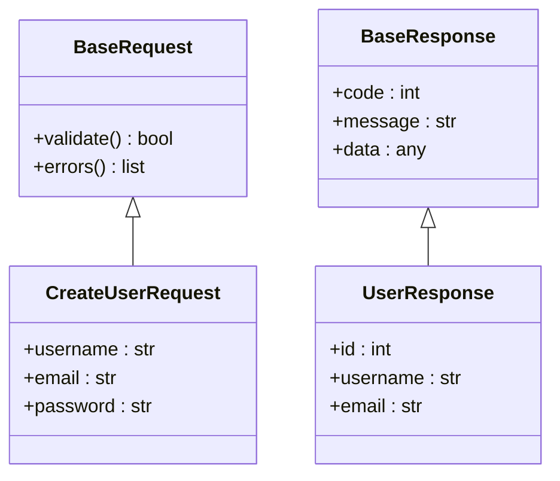
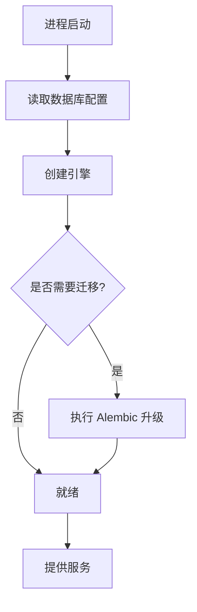
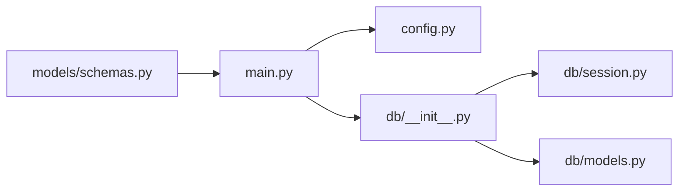

# 数据访问层

<cite>
**本文引用的文件**   
- [backend/app/db/models.py](file://backend/app/db/models.py)
- [backend/app/db/session.py](file://backend/app/db/session.py)
- [backend/app/db/__init__.py](file://backend/app/db/__init__.py)
- [backend/app/models/schemas.py](file://backend/app/models/schemas.py)
- [backend/app/config.py](file://backend/app/config.py)
- [backend/app/main.py](file://backend/app/main.py)
</cite>

## 目录
1. [简介](#简介)
2. [项目结构](#项目结构)
3. [核心组件](#核心组件)
4. [架构总览](#架构总览)
5. [详细组件分析](#详细组件分析)
6. [依赖关系分析](#依赖关系分析)
7. [性能考虑](#性能考虑)
8. [故障排查指南](#故障排查指南)
9. [结论](#结论)
10. [附录](#附录)

## 简介
本文件聚焦于 SmartTour 后端的数据访问层，围绕基于 SQLAlchemy 的 ORM 模型、数据库会话管理、Pydantic 数据验证 Schema、数据库初始化与迁移策略、备份恢复机制、查询优化与索引设计、并发控制、事务处理、异常处理与日志记录等主题，提供系统化、可操作的技术文档。目标读者为数据层开发者与维护者，旨在帮助快速理解并高质量地扩展数据访问能力。

## 项目结构
数据访问层主要位于 backend/app/db 与 backend/app/models 两个目录：
- db 模块负责 SQLAlchemy 引擎/会话生命周期、模型定义与数据库连接配置
- models 模块负责 Pydantic Schema，用于请求校验与响应序列化
- config 模块集中管理数据库连接参数与环境变量
- main 模块作为应用入口，负责启动时初始化数据库资源



图表来源
- [backend/app/db/models.py](file://backend/app/db/models.py)
- [backend/app/db/session.py](file://backend/app/db/session.py)
- [backend/app/db/__init__.py](file://backend/app/db/__init__.py)
- [backend/app/models/schemas.py](file://backend/app/models/schemas.py)
- [backend/app/config.py](file://backend/app/config.py)
- [backend/app/main.py](file://backend/app/main.py)

章节来源
- [backend/app/db/models.py](file://backend/app/db/models.py)
- [backend/app/db/session.py](file://backend/app/db/session.py)
- [backend/app/db/__init__.py](file://backend/app/db/__init__.py)
- [backend/app/models/schemas.py](file://backend/app/models/schemas.py)
- [backend/app/config.py](file://backend/app/config.py)
- [backend/app/main.py](file://backend/app/main.py)

## 核心组件
- ORM 模型（SQLAlchemy）：定义实体、字段、约束与关系映射，统一数据持久化契约
- 会话管理（Session）：封装连接池、会话生命周期、事务边界与并发安全
- Pydantic Schema：实现请求入参校验、响应出参序列化与类型安全
- 配置中心（Config）：集中管理数据库 URL、连接池参数、调试开关等
- 应用入口（Main）：在进程启动时完成引擎与会话的初始化与销毁

章节来源
- [backend/app/db/models.py](file://backend/app/db/models.py)
- [backend/app/db/session.py](file://backend/app/db/session.py)
- [backend/app/models/schemas.py](file://backend/app/models/schemas.py)
- [backend/app/config.py](file://backend/app/config.py)
- [backend/app/main.py](file://backend/app/main.py)

## 架构总览
下图展示了从 HTTP 请求到数据库写入的关键路径，以及会话与事务的协作方式。



图表来源
- [backend/app/models/schemas.py](file://backend/app/models/schemas.py)
- [backend/app/db/session.py](file://backend/app/db/session.py)
- [backend/app/db/models.py](file://backend/app/db/models.py)
- [backend/app/main.py](file://backend/app/main.py)

## 详细组件分析

### ORM 模型设计（SQLAlchemy）
- 实体与表映射：每个模型类对应一张表，使用 declarative base 进行声明式映射
- 字段定义：包括主键、外键、唯一性、非空、默认值、长度限制、枚举等
- 关系映射：一对多、多对一等关系通过 relationship 表达，配合 backref 简化双向访问
- 约束与校验：利用 Column 约束与自定义 validator 保证数据一致性
- 审计字段：建议包含创建时间、更新时间等通用字段，便于追踪

```mermaid
classDiagram
class BaseModel {
+id : int
+created_at : datetime
+updated_at : datetime
+to_dict() dict
}
class User {
+username : str
+email : str
+avatar_url : str
+role : enum
+get_profile() Profile
}
class KnowledgeBase {
+title : str
+content : text
+owner_id : int
+tags : list
+is_public : bool
}
class RoutePlan {
+name : str
+user_id : int
+segments : json
+status : enum
}
BaseModel <|-- User
BaseModel <|-- KnowledgeBase
BaseModel <|-- RoutePlan
User ||--o{ RoutePlan : "拥有"
User ||--o{ KnowledgeBase : "拥有"
```

图表来源
- [backend/app/db/models.py](file://backend/app/db/models.py)

章节来源
- [backend/app/db/models.py](file://backend/app/db/models.py)

### 数据库会话管理（连接池、事务、并发）
- 连接池配置：通过 engine 参数设置 pool_size、max_overflow、pool_recycle、pool_pre_ping 等，提升稳定性与吞吐
- 会话生命周期：使用 scoped_session 绑定线程局部上下文，确保同一线程内复用会话
- 事务边界：在请求级或任务级开启事务，成功提交、异常回滚
- 并发控制：避免跨线程共享会话；长事务会占用连接，需严格控制事务范围
- 健康检查：启用 pre-ping 检测连接有效性，自动重建失效连接



图表来源
- [backend/app/db/session.py](file://backend/app/db/session.py)
- [backend/app/config.py](file://backend/app/config.py)

章节来源
- [backend/app/db/session.py](file://backend/app/db/session.py)
- [backend/app/config.py](file://backend/app/config.py)

### Pydantic 数据验证 Schema
- 请求校验：使用 BaseRequest 派生具体请求模型，内置必填、长度、格式、枚举等校验规则
- 响应序列化：使用 BaseResponse 派生响应模型，结合 Field 描述元信息，统一输出结构
- 类型安全：严格类型标注与转换，减少运行时错误
- 嵌套结构：支持复杂对象的嵌套校验与默认值
- 兼容旧接口：通过别名与弃用标记平滑演进



图表来源
- [backend/app/models/schemas.py](file://backend/app/models/schemas.py)

章节来源
- [backend/app/models/schemas.py](file://backend/app/models/schemas.py)

### 数据库初始化流程与迁移策略
- 初始化流程：应用启动时加载配置，创建引擎与会话，必要时执行建表或版本检查
- 迁移策略：推荐使用 Alembic 管理 schema 变更，生成迁移脚本并在部署阶段执行
- 幂等性：迁移脚本应支持重复执行与回滚，保障发布安全
- 环境隔离：开发/测试/生产使用不同数据库实例与凭据



图表来源
- [backend/app/main.py](file://backend/app/main.py)
- [backend/app/config.py](file://backend/app/config.py)

章节来源
- [backend/app/main.py](file://backend/app/main.py)
- [backend/app/config.py](file://backend/app/config.py)

### 备份与恢复机制
- 逻辑备份：定期导出关键表数据（CSV/JSON），保留历史版本
- 物理备份：针对生产库采用快照或增量备份策略
- 恢复演练：在预发环境定期演练恢复流程，验证完整性与一致性
- 脱敏与合规：备份数据脱敏，遵循数据安全规范

[本节为通用实践说明，不直接分析具体文件]

## 依赖关系分析
数据访问层内部依赖关系如下：
- main 依赖 config 与 db 初始化
- db.__init__ 聚合 session 与 models
- schemas 独立于 db，供 API 层使用
- models 依赖 session 提供的会话上下文



图表来源
- [backend/app/main.py](file://backend/app/main.py)
- [backend/app/db/__init__.py](file://backend/app/db/__init__.py)
- [backend/app/db/session.py](file://backend/app/db/session.py)
- [backend/app/db/models.py](file://backend/app/db/models.py)
- [backend/app/models/schemas.py](file://backend/app/models/schemas.py)
- [backend/app/config.py](file://backend/app/config.py)

章节来源
- [backend/app/main.py](file://backend/app/main.py)
- [backend/app/db/__init__.py](file://backend/app/db/__init__.py)
- [backend/app/db/session.py](file://backend/app/db/session.py)
- [backend/app/db/models.py](file://backend/app/db/models.py)
- [backend/app/models/schemas.py](file://backend/app/models/schemas.py)
- [backend/app/config.py](file://backend/app/config.py)

## 性能考虑
- 连接池调优
  - 根据并发量调整 pool_size 与 max_overflow
  - 合理设置 pool_recycle 避免长连接被数据库回收
  - 启用 pool_pre_ping 降低死连接风险
- 查询优化
  - 使用 selectinload/joinedload 避免 N+1 问题
  - 分页查询限制返回列，减少网络与内存开销
  - 合理使用索引覆盖常用过滤与排序字段
- 事务与锁
  - 缩短事务范围，避免长时间持有写锁
  - 读多写少场景优先使用只读副本
- 缓存策略
  - 热点数据引入 Redis 缓存，注意缓存一致性与过期策略
- 监控与告警
  - 统计慢查询、连接池命中率、事务耗时
  - 建立阈值告警，及时定位瓶颈

[本节为通用指导，不直接分析具体文件]

## 故障排查指南
- 常见问题
  - 连接池耗尽：检查是否有未关闭的会话或长事务
  - 死锁与超时：分析事务顺序与锁粒度，拆分大事务
  - 数据不一致：确认事务边界与异常回滚路径
  - Schema 校验失败：核对请求字段类型与必填项
- 诊断步骤
  - 查看会话上下文是否正确绑定
  - 打印执行的 SQL 与参数，定位慢查询
  - 检查连接池指标与数据库端连接数
  - 复现最小用例，逐步缩小问题范围
- 日志与断点
  - 在关键路径增加结构化日志（请求ID、用户ID、耗时）
  - 使用断点或调试器观察会话状态与事务边界

章节来源
- [backend/app/db/session.py](file://backend/app/db/session.py)
- [backend/app/models/schemas.py](file://backend/app/models/schemas.py)

## 结论
SmartTour 数据访问层以 SQLAlchemy 为核心，结合会话管理与 Pydantic Schema，形成高内聚、低耦合的数据持久化体系。通过合理的连接池配置、事务边界控制与查询优化，可在保证一致性的同时获得良好的性能表现。建议在后续迭代中完善迁移与备份恢复流程，持续监控与调优，确保系统稳定可靠。

[本节为总结性内容，不直接分析具体文件]

## 附录
- 开发规范
  - 所有新增模型必须包含审计字段与必要约束
  - 所有对外接口必须使用 Pydantic Schema 进行输入输出校验
  - 禁止在视图层直接操作数据库，统一通过服务层封装
- 最佳实践
  - 使用只读会话处理报表与导出任务
  - 批量写入时使用 bulk_insert/bulk_update 提升吞吐
  - 敏感字段加密存储，日志中脱敏
- 调试清单
  - 确认环境变量与配置文件正确
  - 验证迁移脚本可逆且幂等
  - 在本地复现线上问题前，先对齐数据与配置

[本节为通用指导，不直接分析具体文件]