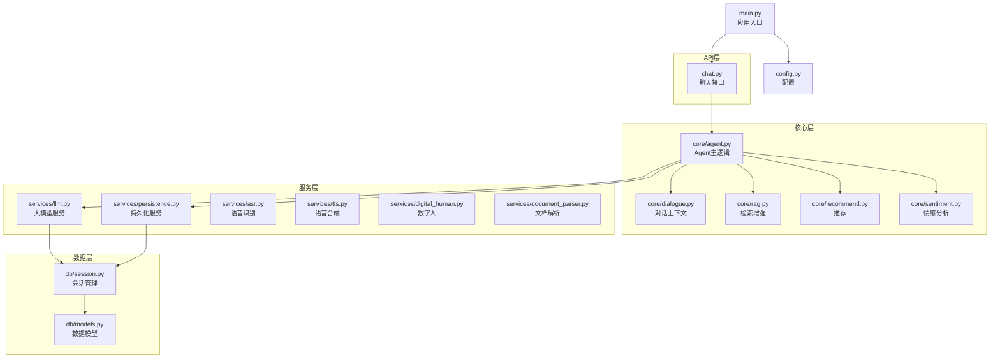
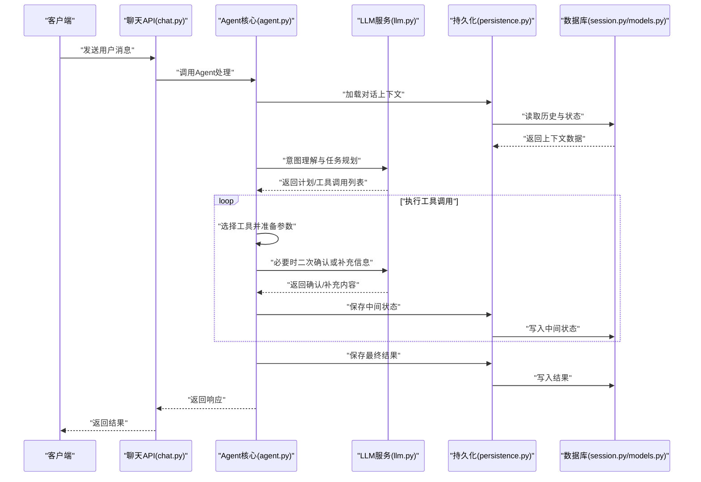
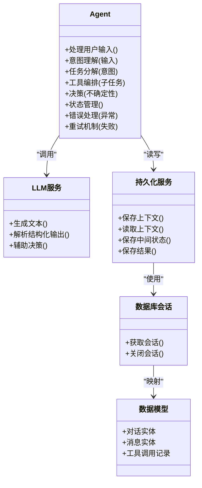
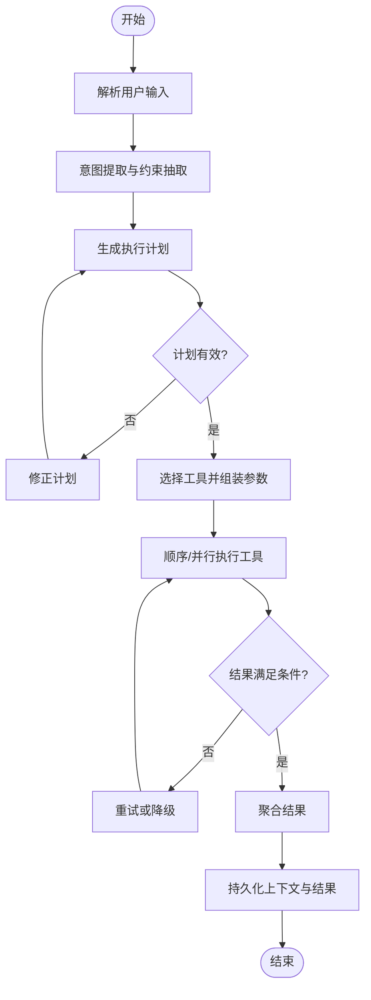
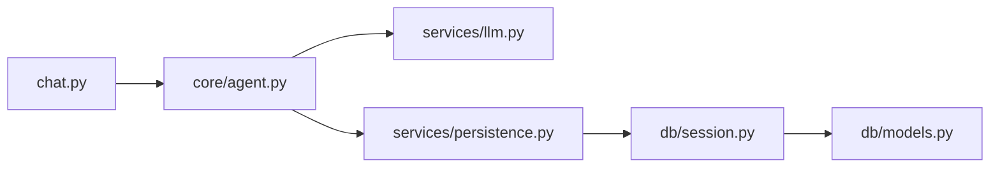

# Agent智能代理服务

<cite>
**本文引用的文件**   
- [backend/app/core/agent.py](file://backend/app/core/agent.py)
- [backend/app/api/chat.py](file://backend/app/api/chat.py)
- [backend/app/services/llm.py](file://backend/app/services/llm.py)
- [backend/app/services/persistence.py](file://backend/app/services/persistence.py)
- [backend/app/db/models.py](file://backend/app/db/models.py)
- [backend/app/db/session.py](file://backend/app/db/session.py)
- [backend/app/config.py](file://backend/app/config.py)
- [backend/app/main.py](file://backend/app/main.py)
- [backend/tests/test_agent.py](file://backend/tests/test_agent.py)
</cite>

## 目录
1. [简介](#简介)
2. [项目结构](#项目结构)
3. [核心组件](#核心组件)
4. [架构总览](#架构总览)
5. [详细组件分析](#详细组件分析)
6. [依赖关系分析](#依赖关系分析)
7. [性能考虑](#性能考虑)
8. [故障排查指南](#故障排查指南)
9. [结论](#结论)
10. [附录](#附录)

## 简介
本技术文档聚焦于后端Agent智能代理服务的整体设计与实现，围绕以下目标展开：
- 解释Agent的核心架构：任务分解、工具调用机制与决策逻辑
- 说明Agent如何理解用户意图、规划执行步骤并协调多个工具完成复杂任务
- 文档化状态管理、错误处理策略与重试机制
- 提供配置与使用示例（以路径引用形式）
- 描述与其他核心服务（LLM、持久化、数据库等）的交互模式与数据流转
- 给出性能优化建议与扩展开发指导

## 项目结构
本项目采用分层与按功能域组织相结合的结构。与Agent相关的核心代码位于后端模块中：
- API层：对外暴露聊天接口，接收用户输入并返回结果
- 核心层：包含Agent主逻辑、对话上下文、RAG检索、推荐与情感分析等
- 服务层：封装LLM调用、语音识别/合成、数字人、文档解析、持久化等能力
- 数据层：数据库模型与会话管理
- 配置与入口：应用配置与启动入口

图表来源
- [backend/app/api/chat.py](file://backend/app/api/chat.py)
- [backend/app/core/agent.py](file://backend/app/core/agent.py)
- [backend/app/services/llm.py](file://backend/app/services/llm.py)
- [backend/app/services/persistence.py](file://backend/app/services/persistence.py)
- [backend/app/db/models.py](file://backend/app/db/models.py)
- [backend/app/db/session.py](file://backend/app/db/session.py)
- [backend/app/config.py](file://backend/app/config.py)
- [backend/app/main.py](file://backend/app/main.py)

章节来源
- [backend/app/main.py](file://backend/app/main.py)
- [backend/app/config.py](file://backend/app/config.py)

## 核心组件
本节对Agent相关的关键组件进行概览性说明，重点包括职责边界与协作方式：
- Agent核心（core/agent.py）：负责意图理解、任务分解、工具编排、决策与状态管理
- LLM服务（services/llm.py）：封装大模型调用，提供文本生成、结构化输出解析等能力
- 持久化服务（services/persistence.py）：负责对话历史、中间状态与结果的存储与读取
- 数据库会话（db/session.py）：提供数据库连接与会话生命周期管理
- 数据模型（db/models.py）：定义对话、消息、工具调用记录等实体
- 聊天API（api/chat.py）：对外暴露REST接口，接收用户输入并驱动Agent流程

章节来源
- [backend/app/core/agent.py](file://backend/app/core/agent.py)
- [backend/app/services/llm.py](file://backend/app/services/llm.py)
- [backend/app/services/persistence.py](file://backend/app/services/persistence.py)
- [backend/app/db/session.py](file://backend/app/db/session.py)
- [backend/app/db/models.py](file://backend/app/db/models.py)
- [backend/app/api/chat.py](file://backend/app/api/chat.py)

## 架构总览
下图展示了从用户请求到Agent执行与返回的整体流程，涵盖意图理解、任务规划、工具调用、结果聚合与持久化。

图表来源
- [backend/app/api/chat.py](file://backend/app/api/chat.py)
- [backend/app/core/agent.py](file://backend/app/core/agent.py)
- [backend/app/services/llm.py](file://backend/app/services/llm.py)
- [backend/app/services/persistence.py](file://backend/app/services/persistence.py)
- [backend/app/db/session.py](file://backend/app/db/session.py)
- [backend/app/db/models.py](file://backend/app/db/models.py)

## 详细组件分析

### Agent核心（core/agent.py）
Agent是系统的“大脑”，承担以下职责：
- 意图理解：基于用户输入与大模型能力，提取关键意图与约束
- 任务分解：将复杂需求拆解为可执行的子任务序列
- 工具编排：根据子任务选择合适的工具，组装参数并调度执行
- 决策逻辑：在不确定场景下通过LLM辅助决策，必要时发起澄清
- 状态管理：维护对话上下文、中间状态与最终结果，支持断点续跑
- 错误处理与重试：对失败的工具调用进行重试、降级与回滚

图表来源
- [backend/app/core/agent.py](file://backend/app/core/agent.py)
- [backend/app/services/llm.py](file://backend/app/services/llm.py)
- [backend/app/services/persistence.py](file://backend/app/services/persistence.py)
- [backend/app/db/session.py](file://backend/app/db/session.py)
- [backend/app/db/models.py](file://backend/app/db/models.py)

章节来源
- [backend/app/core/agent.py](file://backend/app/core/agent.py)

#### 任务分解算法与流程图
任务分解遵循“意图→子任务→工具”的链路，结合LLM的结构化输出进行动态规划。

图表来源
- [backend/app/core/agent.py](file://backend/app/core/agent.py)
- [backend/app/services/llm.py](file://backend/app/services/llm.py)
- [backend/app/services/persistence.py](file://backend/app/services/persistence.py)

章节来源
- [backend/app/core/agent.py](file://backend/app/core/agent.py)

### 聊天API（api/chat.py）
- 职责：接收HTTP请求，校验输入，调用Agent核心，返回标准化响应
- 关键点：
  - 输入校验与格式化
  - 会话标识与上下文绑定
  - 异步处理与超时控制
  - 错误码与统一响应格式

章节来源
- [backend/app/api/chat.py](file://backend/app/api/chat.py)

### LLM服务（services/llm.py）
- 职责：封装大模型调用，提供文本生成与结构化输出解析
- 关键点：
  - 提示词模板与上下文注入
  - 结构化输出解析（如JSON）
  - 重试与超时控制
  - 日志与指标上报

章节来源
- [backend/app/services/llm.py](file://backend/app/services/llm.py)

### 持久化服务（services/persistence.py）
- 职责：对话历史、中间状态与最终结果的存取
- 关键点：
  - 原子写入与事务保障
  - 增量更新与版本控制
  - 查询优化与分页
  - 清理策略与归档

章节来源
- [backend/app/services/persistence.py](file://backend/app/services/persistence.py)

### 数据库会话与模型（db/session.py, db/models.py）
- 职责：数据库连接管理与实体映射
- 关键点：
  - 连接池与会话生命周期
  - 模型字段与约束
  - 索引与查询优化
  - 迁移与版本兼容

章节来源
- [backend/app/db/session.py](file://backend/app/db/session.py)
- [backend/app/db/models.py](file://backend/app/db/models.py)

### 配置与入口（config.py, main.py）
- 职责：应用配置项与启动入口
- 关键点：
  - 环境变量与默认值
  - 服务注册与路由挂载
  - 健康检查与优雅关闭

章节来源
- [backend/app/config.py](file://backend/app/config.py)
- [backend/app/main.py](file://backend/app/main.py)

## 依赖关系分析
Agent核心依赖LLM服务进行意图理解与决策，依赖持久化服务进行状态管理，并通过数据库会话访问数据模型。API层作为外部入口，驱动整个流程。

图表来源
- [backend/app/api/chat.py](file://backend/app/api/chat.py)
- [backend/app/core/agent.py](file://backend/app/core/agent.py)
- [backend/app/services/llm.py](file://backend/app/services/llm.py)
- [backend/app/services/persistence.py](file://backend/app/services/persistence.py)
- [backend/app/db/session.py](file://backend/app/db/session.py)
- [backend/app/db/models.py](file://backend/app/db/models.py)

章节来源
- [backend/app/api/chat.py](file://backend/app/api/chat.py)
- [backend/app/core/agent.py](file://backend/app/core/agent.py)
- [backend/app/services/llm.py](file://backend/app/services/llm.py)
- [backend/app/services/persistence.py](file://backend/app/services/persistence.py)
- [backend/app/db/session.py](file://backend/app/db/session.py)
- [backend/app/db/models.py](file://backend/app/db/models.py)

## 性能考虑
- 并发与批处理：对独立工具调用采用并发执行，减少端到端延迟
- 缓存与复用：对频繁查询的结果进行缓存，避免重复计算
- 流式响应：对长时任务采用流式返回，提升用户体验
- 资源限制：设置合理的超时、重试次数与熔断阈值
- 数据库优化：合理索引与分页，避免全表扫描
- 监控与度量：记录关键指标（耗时、成功率、错误率），便于定位瓶颈

[本节为通用性能建议，不直接分析具体文件]

## 故障排查指南
- 常见问题
  - 意图理解失败：检查提示词模板与上下文注入是否正确
  - 工具调用异常：查看工具参数组装与权限校验
  - 持久化失败：确认数据库连接与事务状态
  - 超时与重试：调整重试策略与超时阈值
- 诊断方法
  - 启用详细日志，追踪关键节点
  - 使用测试用例复现问题（参考测试文件）
  - 检查配置项与环境变量
- 恢复策略
  - 自动重试与降级
  - 人工介入与回滚
  - 告警与通知

章节来源
- [backend/tests/test_agent.py](file://backend/tests/test_agent.py)

## 结论
Agent智能代理服务通过清晰的层次划分与模块化设计，实现了意图理解、任务分解、工具编排与状态管理的闭环。借助LLM的推理能力与持久化的可靠性，系统能够稳定地处理复杂任务。后续可在并发优化、缓存策略与监控告警方面持续改进，以提升整体性能与可观测性。

[本节为总结性内容，不直接分析具体文件]

## 附录

### 配置与使用示例（路径引用）
- 配置项与环境变量
  - 参考：[backend/app/config.py](file://backend/app/config.py)
- 启动入口与服务注册
  - 参考：[backend/app/main.py](file://backend/app/main.py)
- 聊天接口调用
  - 参考：[backend/app/api/chat.py](file://backend/app/api/chat.py)
- Agent核心逻辑
  - 参考：[backend/app/core/agent.py](file://backend/app/core/agent.py)
- LLM服务调用
  - 参考：[backend/app/services/llm.py](file://backend/app/services/llm.py)
- 持久化与数据库
  - 参考：[backend/app/services/persistence.py](file://backend/app/services/persistence.py)
  - 参考：[backend/app/db/session.py](file://backend/app/db/session.py)
  - 参考：[backend/app/db/models.py](file://backend/app/db/models.py)
- 单元测试与回归
  - 参考：[backend/tests/test_agent.py](file://backend/tests/test_agent.py)