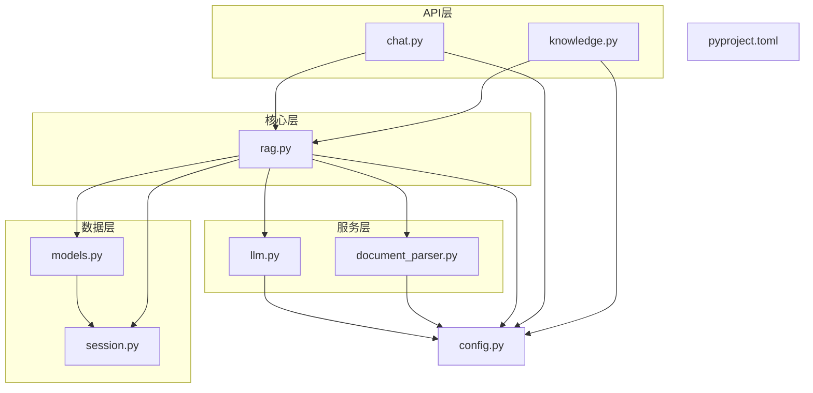
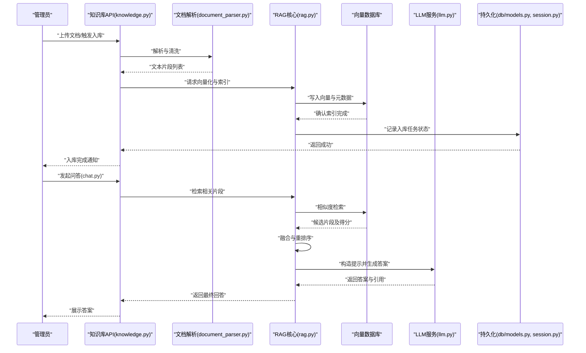
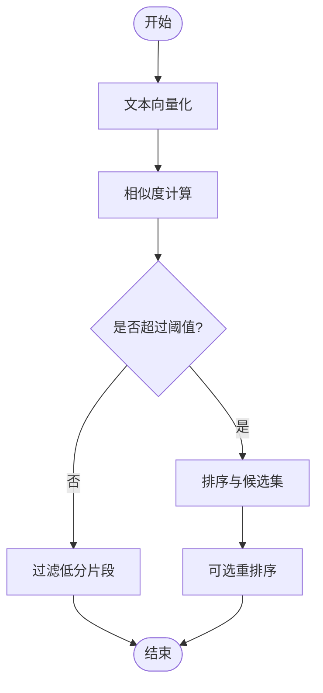
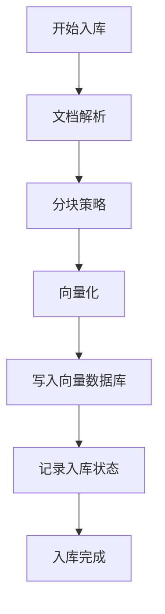
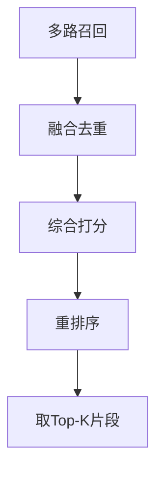
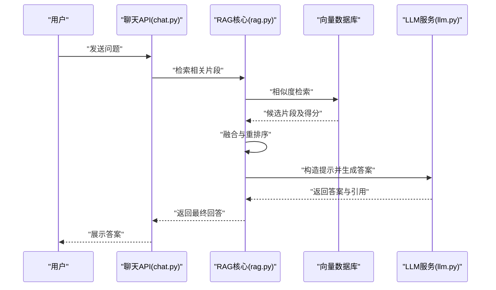
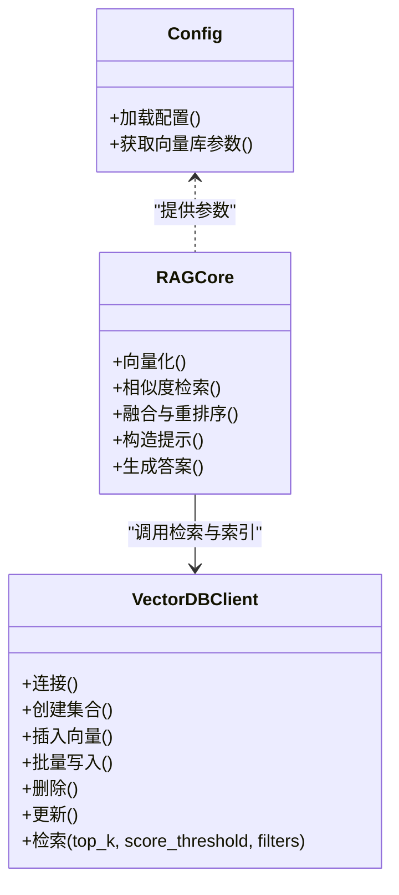
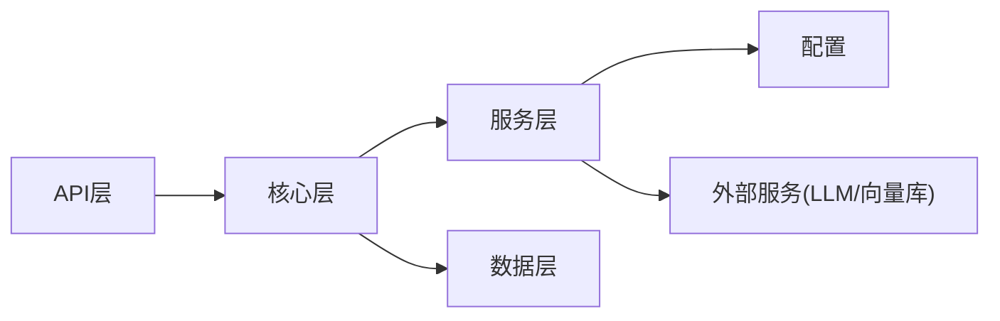

# RAG检索增强生成系统

<cite>
**本文引用的文件**   
- [backend/app/core/rag.py](file://backend/app/core/rag.py)
- [backend/app/services/document_parser.py](file://backend/app/services/document_parser.py)
- [backend/app/api/knowledge.py](file://backend/app/api/knowledge.py)
- [backend/app/api/chat.py](file://backend/app/api/chat.py)
- [backend/app/services/llm.py](file://backend/app/services/llm.py)
- [backend/app/config.py](file://backend/app/config.py)
- [backend/app/db/models.py](file://backend/app/db/models.py)
- [backend/app/db/session.py](file://backend/app/db/session.py)
- [backend/tests/test_rag.py](file://backend/tests/test_rag.py)
- [backend/pyproject.toml](file://backend/pyproject.toml)
</cite>

## 目录
1. [简介](#简介)
2. [项目结构](#项目结构)
3. [核心组件](#核心组件)
4. [架构总览](#架构总览)
5. [详细组件分析](#详细组件分析)
6. [依赖关系分析](#依赖关系分析)
7. [性能考虑](#性能考虑)
8. [故障排查指南](#故障排查指南)
9. [结论](#结论)
10. [附录](#附录)

## 简介
本技术文档围绕RAG（检索增强生成）系统的实现与使用，系统性阐述向量检索引擎、知识库构建、检索结果融合与重排序、答案生成流程，以及与向量数据库的集成和查询优化策略。同时提供配置参数调优指南、性能监控方法与知识库更新维护的最佳实践，帮助读者快速理解并高效运维该系统。

## 项目结构
后端采用分层架构：API层暴露接口，核心逻辑位于core层，服务层封装外部能力（如LLM、文档解析），数据访问通过db层管理持久化模型与会话。RAG相关的关键代码集中在以下模块：
- 核心RAG编排：backend/app/core/rag.py
- 文档解析与分块：backend/app/services/document_parser.py
- 知识库管理API：backend/app/api/knowledge.py
- 对话与RAG调用入口：backend/app/api/chat.py
- LLM服务封装：backend/app/services/llm.py
- 配置中心：backend/app/config.py
- 数据模型与会话：backend/app/db/models.py, backend/app/db/session.py
- 测试用例：backend/tests/test_rag.py
- 依赖声明：backend/pyproject.toml

图表来源
- [backend/app/api/knowledge.py](file://backend/app/api/knowledge.py)
- [backend/app/api/chat.py](file://backend/app/api/chat.py)
- [backend/app/core/rag.py](file://backend/app/core/rag.py)
- [backend/app/services/document_parser.py](file://backend/app/services/document_parser.py)
- [backend/app/services/llm.py](file://backend/app/services/llm.py)
- [backend/app/db/models.py](file://backend/app/db/models.py)
- [backend/app/db/session.py](file://backend/app/db/session.py)
- [backend/app/config.py](file://backend/app/config.py)
- [backend/pyproject.toml](file://backend/pyproject.toml)

章节来源
- [backend/app/core/rag.py](file://backend/app/core/rag.py)
- [backend/app/services/document_parser.py](file://backend/app/services/document_parser.py)
- [backend/app/api/knowledge.py](file://backend/app/api/knowledge.py)
- [backend/app/api/chat.py](file://backend/app/api/chat.py)
- [backend/app/services/llm.py](file://backend/app/services/llm.py)
- [backend/app/config.py](file://backend/app/config.py)
- [backend/app/db/models.py](file://backend/app/db/models.py)
- [backend/app/db/session.py](file://backend/app/db/session.py)
- [backend/pyproject.toml](file://backend/pyproject.toml)

## 核心组件
- 向量检索引擎
  - 文本向量化：将文档片段或查询转换为高维向量，用于相似度计算。
  - 相似度计算：基于余弦相似度等度量评估向量间相关性。
  - 检索排序：按相似度得分对候选片段进行排序，结合阈值过滤低质量结果。
- 知识库构建
  - 文档解析：支持多种格式（如PDF、Markdown、TXT等）的读取与清洗。
  - 分块策略：按段落、标题或固定长度切分，保留上下文信息。
  - 索引建立：将分块后的文本向量化并写入向量数据库，建立可检索索引。
- 检索结果融合与重排序
  - 多路召回：从不同索引或策略获取候选集。
  - 融合策略：去重、加权合并、时间/来源偏好等。
  - 重排序：利用更精细的打分器或LLM对候选片段进行二次排序。
- 答案生成
  - 提示词构造：将用户问题与检索到的相关片段组织为结构化提示。
  - LLM推理：调用大语言模型生成最终回答，并可附加引用来源。
- 向量数据库集成
  - 连接与认证：通过配置加载连接参数。
  - 索引操作：创建集合、插入向量、批量写入、删除与更新。
  - 查询优化：设置top_k、score_threshold、过滤条件、缓存热点查询。

章节来源
- [backend/app/core/rag.py](file://backend/app/core/rag.py)
- [backend/app/services/document_parser.py](file://backend/app/services/document_parser.py)
- [backend/app/services/llm.py](file://backend/app/services/llm.py)
- [backend/app/config.py](file://backend/app/config.py)
- [backend/app/db/models.py](file://backend/app/db/models.py)
- [backend/app/db/session.py](file://backend/app/db/session.py)

## 架构总览
下图展示了从知识库构建到在线问答的端到端流程，包括文档解析、分块、向量化、索引建立、检索、重排序与答案生成。

图表来源
- [backend/app/api/knowledge.py](file://backend/app/api/knowledge.py)
- [backend/app/api/chat.py](file://backend/app/api/chat.py)
- [backend/app/core/rag.py](file://backend/app/core/rag.py)
- [backend/app/services/document_parser.py](file://backend/app/services/document_parser.py)
- [backend/app/services/llm.py](file://backend/app/services/llm.py)
- [backend/app/db/models.py](file://backend/app/db/models.py)
- [backend/app/db/session.py](file://backend/app/db/session.py)

## 详细组件分析

### 向量检索引擎
- 文本向量化
  - 输入：原始文本或清洗后的片段。
  - 输出：固定维度的向量表示。
  - 关键点：统一编码、归一化、批处理提升吞吐。
- 相似度计算
  - 常用度量：余弦相似度、内积、欧氏距离等。
  - 阈值控制：score_threshold过滤低相关片段。
- 检索排序
  - 初排：基于相似度得分降序。
  - 精排：引入语义重排或交叉编码器，提高准确性。
  - 多路召回：不同索引或策略组合，再融合。

图表来源
- [backend/app/core/rag.py](file://backend/app/core/rag.py)

章节来源
- [backend/app/core/rag.py](file://backend/app/core/rag.py)

### 知识库构建流程
- 文档解析
  - 支持多格式读取、去除噪声、提取正文。
  - 输出标准化文本流。
- 分块策略
  - 按段落/标题/固定长度切分。
  - 保留上下文窗口，避免语义断裂。
- 索引建立
  - 对每个片段向量化并写入向量数据库。
  - 存储元数据（来源、时间戳、版本等）。
  - 记录入库任务状态至持久化层。

图表来源
- [backend/app/services/document_parser.py](file://backend/app/services/document_parser.py)
- [backend/app/core/rag.py](file://backend/app/core/rag.py)
- [backend/app/db/models.py](file://backend/app/db/models.py)
- [backend/app/db/session.py](file://backend/app/db/session.py)

章节来源
- [backend/app/services/document_parser.py](file://backend/app/services/document_parser.py)
- [backend/app/core/rag.py](file://backend/app/core/rag.py)
- [backend/app/db/models.py](file://backend/app/db/models.py)
- [backend/app/db/session.py](file://backend/app/db/session.py)

### 检索结果融合与重排序
- 多路召回
  - 从多个索引或策略获取候选片段。
- 融合策略
  - 去重、加权合并、来源/时间偏好。
- 重排序
  - 使用更精细的打分器或LLM对候选片段进行二次排序，提升相关性。

图表来源
- [backend/app/core/rag.py](file://backend/app/core/rag.py)

章节来源
- [backend/app/core/rag.py](file://backend/app/core/rag.py)

### 答案生成流程
- 提示词构造
  - 将用户问题与检索到的相关片段组织为结构化提示。
- LLM推理
  - 调用大语言模型生成最终回答，并可附加引用来源。
- 结果返回
  - 返回答案与引用片段，便于前端展示溯源。

图表来源
- [backend/app/api/chat.py](file://backend/app/api/chat.py)
- [backend/app/core/rag.py](file://backend/app/core/rag.py)
- [backend/app/services/llm.py](file://backend/app/services/llm.py)

章节来源
- [backend/app/api/chat.py](file://backend/app/api/chat.py)
- [backend/app/core/rag.py](file://backend/app/core/rag.py)
- [backend/app/services/llm.py](file://backend/app/services/llm.py)

### 向量数据库集成与查询优化
- 连接与认证
  - 通过配置加载连接参数，支持多环境切换。
- 索引操作
  - 创建集合、插入向量、批量写入、删除与更新。
- 查询优化
  - top_k：控制返回片段数量。
  - score_threshold：过滤低相关片段。
  - 过滤条件：按来源、时间、标签等维度筛选。
  - 缓存热点查询：减少重复计算与网络开销。

图表来源
- [backend/app/config.py](file://backend/app/config.py)
- [backend/app/core/rag.py](file://backend/app/core/rag.py)

章节来源
- [backend/app/config.py](file://backend/app/config.py)
- [backend/app/core/rag.py](file://backend/app/core/rag.py)

## 依赖关系分析
- 内部依赖
  - API层依赖核心层与服务层。
  - 核心层依赖服务层与数据层。
  - 服务层依赖配置与外部能力（如LLM）。
- 外部依赖
  - 向量数据库客户端。
  - LLM服务接口。
  - 文档解析库。
- 潜在循环依赖
  - 确保API不直接依赖数据层，避免耦合。
- 接口契约
  - RAG核心对外暴露统一的检索与生成接口。
  - 文档解析与LLM服务定义清晰的输入输出。

图表来源
- [backend/app/api/knowledge.py](file://backend/app/api/knowledge.py)
- [backend/app/api/chat.py](file://backend/app/api/chat.py)
- [backend/app/core/rag.py](file://backend/app/core/rag.py)
- [backend/app/services/document_parser.py](file://backend/app/services/document_parser.py)
- [backend/app/services/llm.py](file://backend/app/services/llm.py)
- [backend/app/config.py](file://backend/app/config.py)
- [backend/app/db/models.py](file://backend/app/db/models.py)
- [backend/app/db/session.py](file://backend/app/db/session.py)

章节来源
- [backend/app/api/knowledge.py](file://backend/app/api/knowledge.py)
- [backend/app/api/chat.py](file://backend/app/api/chat.py)
- [backend/app/core/rag.py](file://backend/app/core/rag.py)
- [backend/app/services/document_parser.py](file://backend/app/services/document_parser.py)
- [backend/app/services/llm.py](file://backend/app/services/llm.py)
- [backend/app/config.py](file://backend/app/config.py)
- [backend/app/db/models.py](file://backend/app/db/models.py)
- [backend/app/db/session.py](file://backend/app/db/session.py)

## 性能考虑
- 向量化与索引
  - 批处理写入，减少网络往返。
  - 合理设置向量维度与索引类型，平衡精度与速度。
- 检索与排序
  - 调整top_k与score_threshold，控制召回量与延迟。
  - 使用近似最近邻（ANN）索引提升大规模检索效率。
- 重排序与LLM
  - 重排序仅在必要场景启用，避免增加整体延迟。
  - 对LLM调用进行并发控制与超时保护。
- 缓存与预热
  - 缓存热点查询与常见提示模板。
  - 预加载常用索引与模型权重。
- 监控与告警
  - 记录关键指标：检索耗时、重排序耗时、LLM响应时间、错误率。
  - 设置阈值告警，及时发现问题。

[本节为通用指导，无需特定文件来源]

## 故障排查指南
- 常见问题
  - 向量库连接失败：检查配置参数与网络连通性。
  - 索引写入失败：确认权限与存储空间，重试机制。
  - 检索结果为空：调整score_threshold与top_k，检查分块策略。
  - LLM生成异常：检查提示词结构与模型可用性。
- 日志与调试
  - 在关键路径添加日志，记录输入输出摘要。
  - 使用单元测试验证各组件行为。
- 回滚与恢复
  - 维护版本化的索引与元数据，支持快速回滚。
  - 定期备份向量库与持久化数据。

章节来源
- [backend/tests/test_rag.py](file://backend/tests/test_rag.py)
- [backend/app/config.py](file://backend/app/config.py)
- [backend/app/core/rag.py](file://backend/app/core/rag.py)

## 结论
本RAG系统通过模块化设计实现了从知识库构建到在线问答的完整链路。向量检索引擎、知识库构建、检索结果融合与重排序、答案生成等环节相互协作，配合合理的配置与优化策略，能够在保证准确性的同时满足性能要求。建议在生产环境中持续监控与调优，遵循知识库更新与维护的最佳实践，确保系统稳定可靠。

[本节为总结，无需特定文件来源]

## 附录
- 配置参数调优指南
  - 向量库连接：host、port、database、auth等。
  - 检索参数：top_k、score_threshold、filters。
  - LLM参数：模型名称、温度、最大生成长度、超时时间。
- 性能监控方法
  - 指标采集：P95/P99延迟、QPS、错误率。
  - 可视化看板：检索耗时分布、重排序命中率、LLM调用成功率。
- 知识库更新与维护最佳实践
  - 增量更新：仅对变更文档进行重新解析与索引。
  - 版本管理：为每次入库生成唯一版本标识。
  - 清理策略：定期归档或删除过期片段，保持索引精简。
  - 质量评估：抽样评估检索与生成质量，持续优化分块与重排序策略。

章节来源
- [backend/pyproject.toml](file://backend/pyproject.toml)
- [backend/app/config.py](file://backend/app/config.py)
- [backend/app/core/rag.py](file://backend/app/core/rag.py)