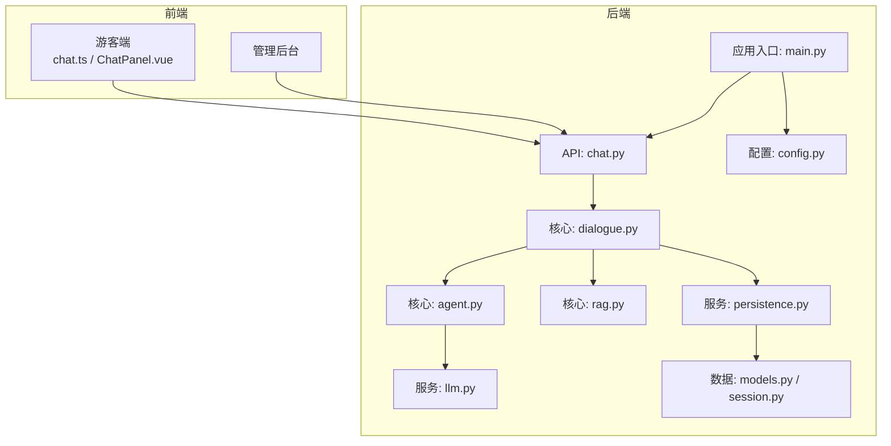
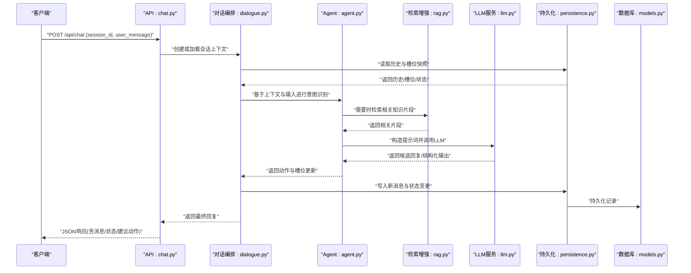
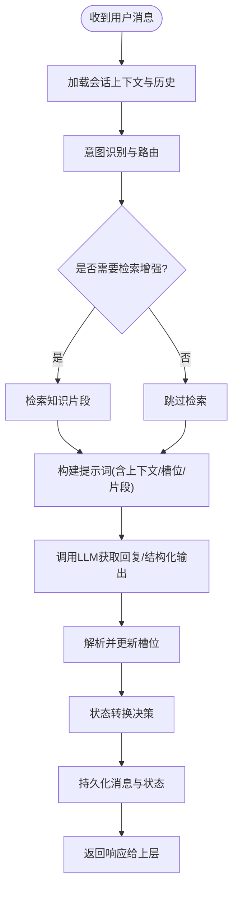
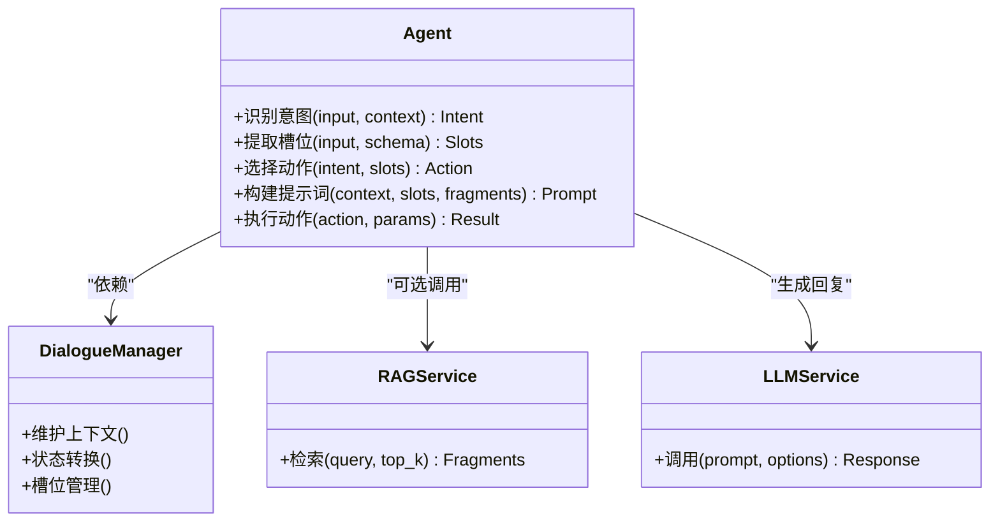
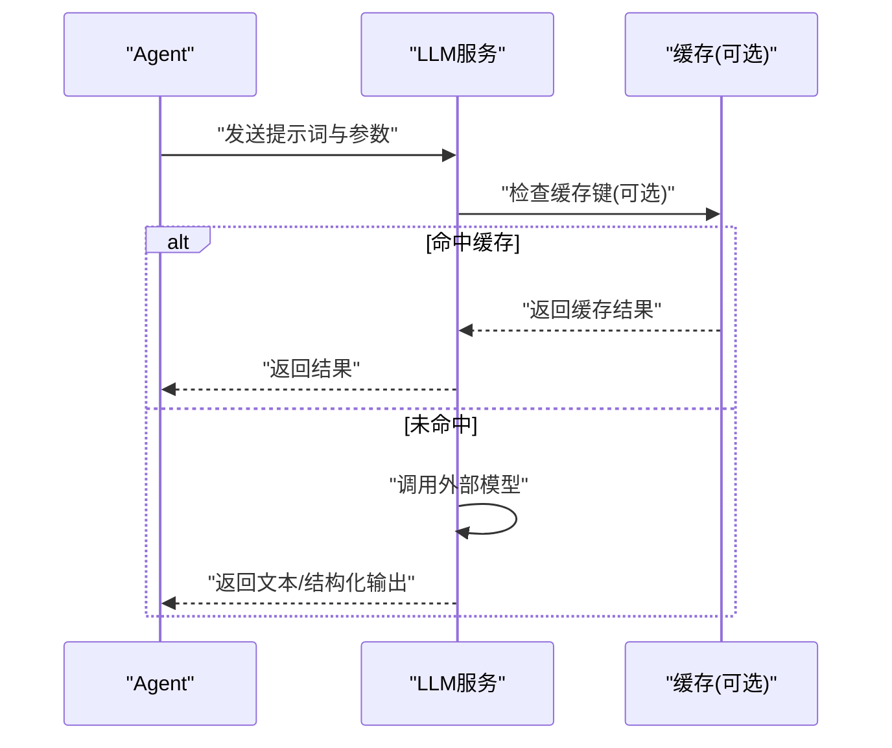
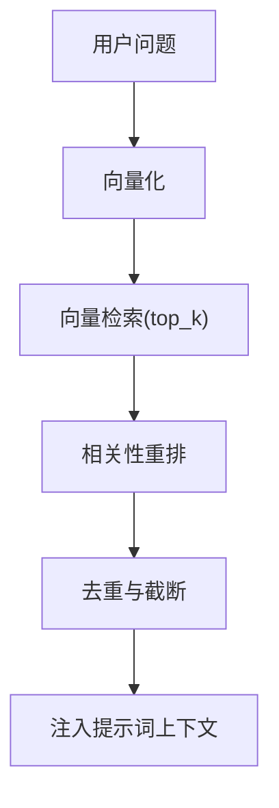
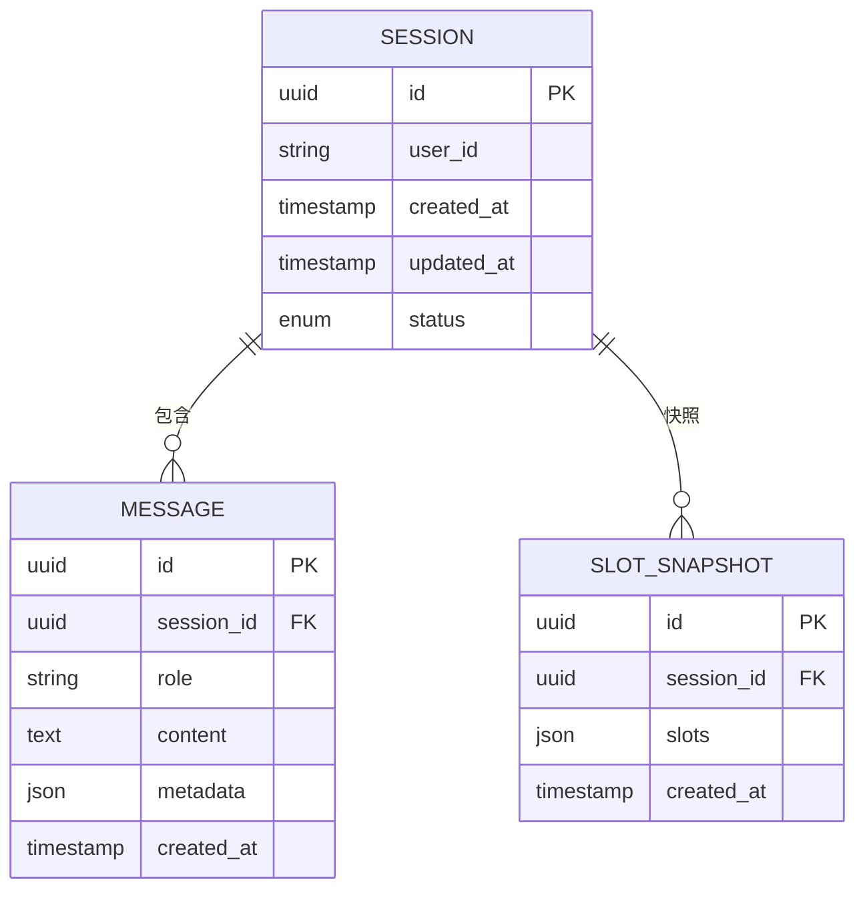
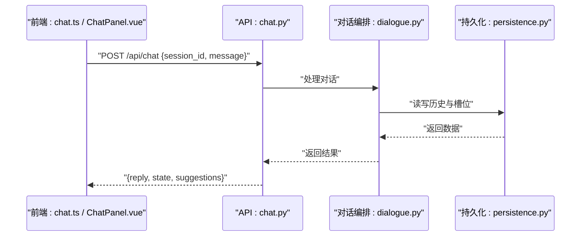
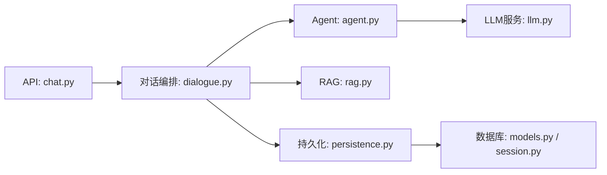

# 对话管理系统

<cite>
**本文引用的文件**   
- [backend/app/main.py](file://backend/app/main.py)
- [backend/app/api/chat.py](file://backend/app/api/chat.py)
- [backend/app/core/dialogue.py](file://backend/app/core/dialogue.py)
- [backend/app/core/agent.py](file://backend/app/core/agent.py)
- [backend/app/services/llm.py](file://backend/app/services/llm.py)
- [backend/app/services/persistence.py](file://backend/app/services/persistence.py)
- [backend/app/db/models.py](file://backend/app/db/models.py)
- [backend/app/db/session.py](file://backend/app/db/session.py)
- [backend/app/config.py](file://backend/app/config.py)
- [backend/app/core/rag.py](file://backend/app/core/rag.py)
- [frontend/tourist-app/src/stores/chat.ts](file://frontend/tourist-app/src/stores/chat.ts)
- [frontend/tourist-app/src/components/ChatPanel/ChatPanel.vue](file://frontend/tourist-app/src/components/ChatPanel/ChatPanel.vue)
</cite>

## 目录
1. [简介](#简介)
2. [项目结构](#项目结构)
3. [核心组件](#核心组件)
4. [架构总览](#架构总览)
5. [详细组件分析](#详细组件分析)
6. [依赖关系分析](#依赖关系分析)
7. [性能考虑](#性能考虑)
8. [故障排查指南](#故障排查指南)
9. [结论](#结论)
10. [附录](#附录)

## 简介
本技术文档面向“对话管理系统”，聚焦多轮对话的状态管理、会话上下文维护、记忆存储与状态转换逻辑；深入解释对话流程控制、意图识别与槽位填充的实现原理；文档化对话历史管理、上下文窗口控制与长对话优化策略；说明与LLM服务集成的方式（提示词构建与响应处理）；并提供API使用示例、配置选项以及对话质量评估与调试工具的使用方法。

## 项目结构
后端采用分层架构：API层暴露REST接口，核心层实现对话编排、Agent调度与RAG检索增强，服务层封装LLM调用与持久化，数据层提供模型定义与会话连接。前端包含游客端与管理后台，游客端负责聊天界面与语音输入，管理后台用于知识库与数据分析。

图表来源
- [backend/app/main.py](file://backend/app/main.py)
- [backend/app/api/chat.py](file://backend/app/api/chat.py)
- [backend/app/core/dialogue.py](file://backend/app/core/dialogue.py)
- [backend/app/core/agent.py](file://backend/app/core/agent.py)
- [backend/app/core/rag.py](file://backend/app/core/rag.py)
- [backend/app/services/llm.py](file://backend/app/services/llm.py)
- [backend/app/services/persistence.py](file://backend/app/services/persistence.py)
- [backend/app/db/models.py](file://backend/app/db/models.py)
- [backend/app/db/session.py](file://backend/app/db/session.py)
- [backend/app/config.py](file://backend/app/config.py)

章节来源
- [backend/app/main.py](file://backend/app/main.py)
- [backend/app/config.py](file://backend/app/config.py)

## 核心组件
- 对话编排器（Dialogue Manager）：维护会话上下文、消息历史、槽位与状态机，协调意图识别、槽位填充与下一步动作。
- Agent调度器：根据当前状态与用户输入选择具体执行路径（如问答、推荐、转人工等），并组装提示词。
- LLM服务：封装外部大模型调用，支持流式与非流式返回、重试与超时控制。
- RAG检索增强：将用户问题与知识库片段结合，提升回答准确性。
- 持久化服务：负责对话历史、槽位快照与状态变更的落盘与恢复。
- 数据库模型：定义会话、消息、槽位等实体及关系。
- 配置中心：集中管理LLM、RAG、持久化与系统参数。

章节来源
- [backend/app/core/dialogue.py](file://backend/app/core/dialogue.py)
- [backend/app/core/agent.py](file://backend/app/core/agent.py)
- [backend/app/services/llm.py](file://backend/app/services/llm.py)
- [backend/app/core/rag.py](file://backend/app/core/rag.py)
- [backend/app/services/persistence.py](file://backend/app/services/persistence.py)
- [backend/app/db/models.py](file://backend/app/db/models.py)
- [backend/app/db/session.py](file://backend/app/db/session.py)
- [backend/app/config.py](file://backend/app/config.py)

## 架构总览
下图展示一次典型的多轮对话请求从前端到后端的完整链路，包括对话编排、意图识别、槽位填充、RAG检索、LLM生成与结果返回。

图表来源
- [backend/app/api/chat.py](file://backend/app/api/chat.py)
- [backend/app/core/dialogue.py](file://backend/app/core/dialogue.py)
- [backend/app/core/agent.py](file://backend/app/core/agent.py)
- [backend/app/core/rag.py](file://backend/app/core/rag.py)
- [backend/app/services/llm.py](file://backend/app/services/llm.py)
- [backend/app/services/persistence.py](file://backend/app/services/persistence.py)
- [backend/app/db/models.py](file://backend/app/db/models.py)

## 详细组件分析

### 对话编排器（Dialogue Manager）
职责
- 会话上下文维护：保存最近N条消息、系统提示、用户画像与偏好。
- 记忆存储：按时间顺序追加消息，定期压缩或摘要以控制上下文窗口。
- 状态转换：基于当前状态与用户输入决定下一状态（如待确认、进行中、完成、异常）。
- 槽位管理：收集、校验与回填关键信息（目的地、时间、人数等）。
- 流程控制：驱动意图识别、RAG检索、LLM调用与后续动作。

关键数据结构
- 会话上下文对象：包含会话ID、消息列表、槽位字典、状态枚举、元数据（创建时间、最后活跃时间等）。
- 状态机：定义状态集合与转移条件（例如：空闲→待确认→进行中→完成）。

上下文窗口与长对话优化
- 滑动窗口：仅保留最近K条消息参与提示词构建。
- 摘要压缩：对早期对话进行摘要，降低Token消耗。
- 重要性排序：优先保留与当前任务相关的消息与槽位。

图表来源
- [backend/app/core/dialogue.py](file://backend/app/core/dialogue.py)
- [backend/app/core/agent.py](file://backend/app/core/agent.py)
- [backend/app/core/rag.py](file://backend/app/core/rag.py)
- [backend/app/services/llm.py](file://backend/app/services/llm.py)
- [backend/app/services/persistence.py](file://backend/app/services/persistence.py)

章节来源
- [backend/app/core/dialogue.py](file://backend/app/core/dialogue.py)
- [backend/app/services/persistence.py](file://backend/app/services/persistence.py)

### Agent调度器
职责
- 意图识别：将用户输入映射到预定义意图类别（如查询景点、规划路线、评价反馈）。
- 槽位填充：从自然语言中提取关键参数，进行类型校验与缺失补全。
- 动作编排：根据意图与槽位组合选择具体执行路径（直接回答、触发RAG、发起推荐、转人工等）。
- 提示词组装：将系统指令、上下文、槽位与检索片段组织为LLM可理解的提示词。

图表来源
- [backend/app/core/agent.py](file://backend/app/core/agent.py)
- [backend/app/core/rag.py](file://backend/app/core/rag.py)
- [backend/app/services/llm.py](file://backend/app/services/llm.py)
- [backend/app/core/dialogue.py](file://backend/app/core/dialogue.py)

章节来源
- [backend/app/core/agent.py](file://backend/app/core/agent.py)

### LLM服务集成
职责
- 统一封装外部LLM调用，支持多种后端（本地/云端）、不同模型与参数。
- 提示词构建：将系统指令、对话历史、槽位与检索片段拼接为结构化提示。
- 响应处理：解析文本或结构化输出，错误重试、超时与降级策略。
- 流式输出：支持SSE或流式传输以提升交互体验。

图表来源
- [backend/app/services/llm.py](file://backend/app/services/llm.py)

章节来源
- [backend/app/services/llm.py](file://backend/app/services/llm.py)

### RAG检索增强
职责
- 将用户问题转换为检索向量，匹配知识库片段。
- 片段重排与去重，确保与当前意图相关且信息密度高。
- 将片段注入提示词，提高答案准确性与可追溯性。

图表来源
- [backend/app/core/rag.py](file://backend/app/core/rag.py)

章节来源
- [backend/app/core/rag.py](file://backend/app/core/rag.py)

### 持久化与数据库模型
职责
- 会话与消息持久化：按会话ID分组存储消息序列。
- 槽位快照：在关键状态点保存槽位值，便于恢复与审计。
- 状态变更日志：记录状态迁移轨迹，支持回溯与诊断。

图表来源
- [backend/app/db/models.py](file://backend/app/db/models.py)
- [backend/app/db/session.py](file://backend/app/db/session.py)

章节来源
- [backend/app/db/models.py](file://backend/app/db/models.py)
- [backend/app/db/session.py](file://backend/app/db/session.py)
- [backend/app/services/persistence.py](file://backend/app/services/persistence.py)

### API层与前端集成
职责
- 暴露REST接口：接收会话ID与用户消息，返回结构化响应。
- 错误处理：统一错误码与提示信息，便于前端展示与调试。
- 前端状态同步：游客端通过store维护本地聊天状态，与服务端保持同步。

图表来源
- [backend/app/api/chat.py](file://backend/app/api/chat.py)
- [backend/app/core/dialogue.py](file://backend/app/core/dialogue.py)
- [backend/app/services/persistence.py](file://backend/app/services/persistence.py)
- [frontend/tourist-app/src/stores/chat.ts](file://frontend/tourist-app/src/stores/chat.ts)
- [frontend/tourist-app/src/components/ChatPanel/ChatPanel.vue](file://frontend/tourist-app/src/components/ChatPanel/ChatPanel.vue)

章节来源
- [backend/app/api/chat.py](file://backend/app/api/chat.py)
- [frontend/tourist-app/src/stores/chat.ts](file://frontend/tourist-app/src/stores/chat.ts)
- [frontend/tourist-app/src/components/ChatPanel/ChatPanel.vue](file://frontend/tourist-app/src/components/ChatPanel/ChatPanel.vue)

## 依赖关系分析
- 耦合度
  - API层与对话编排器强耦合，便于快速迭代对话流程。
  - 对话编排器与Agent、RAG、LLM服务松耦合，通过接口抽象替换实现。
  - 持久化服务与数据库模型解耦，便于切换存储后端。
- 外部依赖
  - LLM服务可能依赖第三方SDK或HTTP客户端。
  - RAG可能依赖向量数据库或嵌入模型服务。
- 潜在循环依赖
  - 避免对话编排器与Agent互相直接引用，应通过接口或事件总线通信。

图表来源
- [backend/app/api/chat.py](file://backend/app/api/chat.py)
- [backend/app/core/dialogue.py](file://backend/app/core/dialogue.py)
- [backend/app/core/agent.py](file://backend/app/core/agent.py)
- [backend/app/core/rag.py](file://backend/app/core/rag.py)
- [backend/app/services/llm.py](file://backend/app/services/llm.py)
- [backend/app/services/persistence.py](file://backend/app/services/persistence.py)
- [backend/app/db/models.py](file://backend/app/db/models.py)
- [backend/app/db/session.py](file://backend/app/db/session.py)

章节来源
- [backend/app/api/chat.py](file://backend/app/api/chat.py)
- [backend/app/core/dialogue.py](file://backend/app/core/dialogue.py)
- [backend/app/core/agent.py](file://backend/app/core/agent.py)
- [backend/app/core/rag.py](file://backend/app/core/rag.py)
- [backend/app/services/llm.py](file://backend/app/services/llm.py)
- [backend/app/services/persistence.py](file://backend/app/services/persistence.py)
- [backend/app/db/models.py](file://backend/app/db/models.py)
- [backend/app/db/session.py](file://backend/app/db/session.py)

## 性能考虑
- 上下文窗口控制
  - 限制消息数量与长度，避免超出模型最大上下文。
  - 对早期消息进行摘要或丢弃低价值内容。
- 并发与异步
  - 使用异步I/O处理LLM调用与数据库读写，提升吞吐。
- 缓存与复用
  - 对常见问题的答案或检索结果进行短期缓存。
- 流式输出
  - 采用SSE或流式传输减少首字延迟，提升用户体验。
- 资源隔离
  - 为不同租户或会话分配独立上下文与配额，防止相互影响。

[本节为通用指导，不直接分析具体文件]

## 故障排查指南
- 常见问题定位
  - 会话丢失：检查会话ID传递是否正确，持久化是否成功写入。
  - 槽位缺失：查看槽位校验与补全逻辑，确认用户输入是否满足约束。
  - 意图误判：增加意图样本与边界用例，调整分类阈值。
  - LLM超时或失败：启用重试与降级策略，记录错误码与堆栈。
- 调试工具
  - 启用详细日志：记录提示词、检索片段、槽位快照与状态迁移。
  - 回放模式：基于历史消息重建对话，验证状态机与Agent行为。
  - 指标采集：统计成功率、平均响应时间、槽位填充率与意图准确率。

章节来源
- [backend/app/services/persistence.py](file://backend/app/services/persistence.py)
- [backend/app/core/dialogue.py](file://backend/app/core/dialogue.py)
- [backend/app/core/agent.py](file://backend/app/core/agent.py)
- [backend/app/services/llm.py](file://backend/app/services/llm.py)

## 结论
本对话管理系统通过清晰的层次划分与模块化设计，实现了多轮对话的状态管理、意图识别、槽位填充与RAG增强，结合持久化与上下文窗口控制，能够在长对话场景下保持稳定与高效。未来可在意图分类精度、槽位抽取鲁棒性与检索质量方面持续优化，并引入更完善的监控与评估体系。

[本节为总结性内容，不直接分析具体文件]

## 附录

### API使用示例
- 新建或继续对话
  - 方法：POST
  - 路径：/api/chat
  - 请求体字段：session_id、message、可选metadata
  - 响应字段：reply、state、suggestions、slots_snapshot
- 获取会话历史
  - 方法：GET
  - 路径：/api/chat/history
  - 查询参数：session_id、limit
  - 响应字段：messages、total
- 重置会话
  - 方法：POST
  - 路径：/api/chat/reset
  - 请求体字段：session_id
  - 响应字段：status、new_session_id

章节来源
- [backend/app/api/chat.py](file://backend/app/api/chat.py)

### 配置选项
- LLM服务
  - 模型名称、基地址、密钥、超时、重试次数、温度与Top-p等生成参数。
- RAG检索
  - 向量库地址、嵌入模型、top_k、相似度阈值、片段长度与重叠。
- 持久化
  - 数据库连接串、表前缀、索引策略、备份周期。
- 系统参数
  - 上下文窗口大小、消息上限、摘要阈值、日志级别。

章节来源
- [backend/app/config.py](file://backend/app/config.py)

### 对话质量评估与调试
- 评估指标
  - 意图准确率、槽位F1、答案相关性评分、用户满意度。
- 评估方法
  - 离线评测集：标注标准答案与槽位，批量跑批计算指标。
  - A/B测试：对比不同提示词或检索策略的效果。
- 调试技巧
  - 打印提示词与检索片段，定位幻觉与噪声来源。
  - 回放关键会话，复现问题并逐步缩小范围。

章节来源
- [backend/app/core/agent.py](file://backend/app/core/agent.py)
- [backend/app/core/rag.py](file://backend/app/core/rag.py)
- [backend/app/services/llm.py](file://backend/app/services/llm.py)