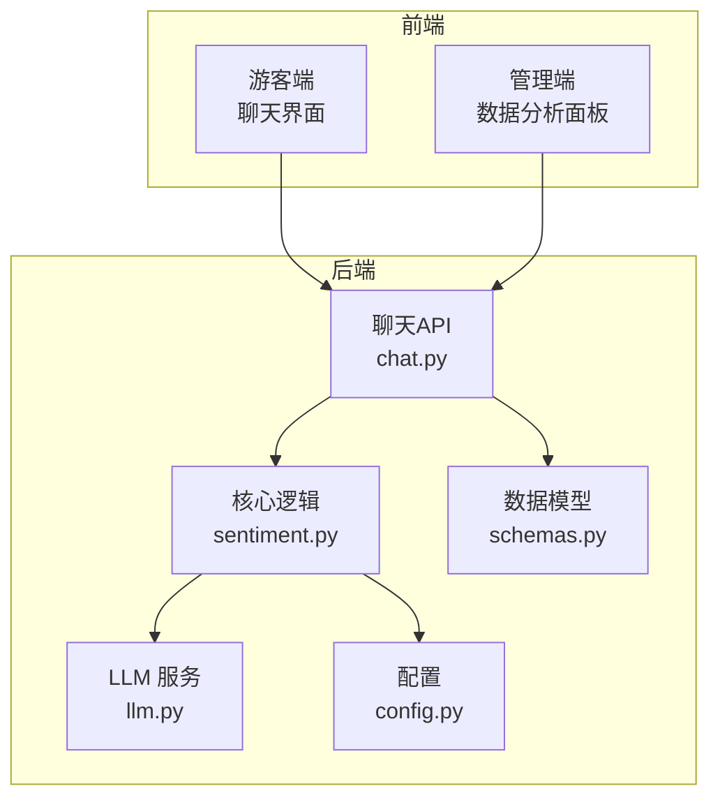
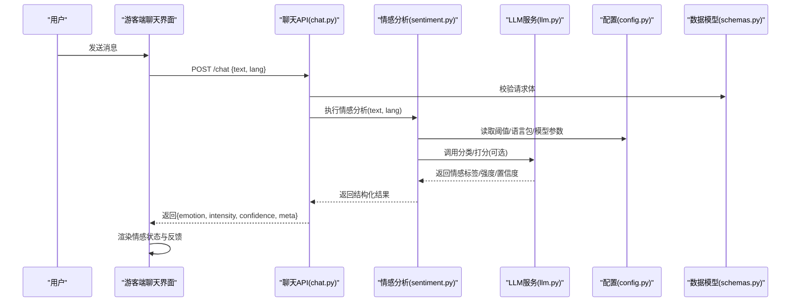
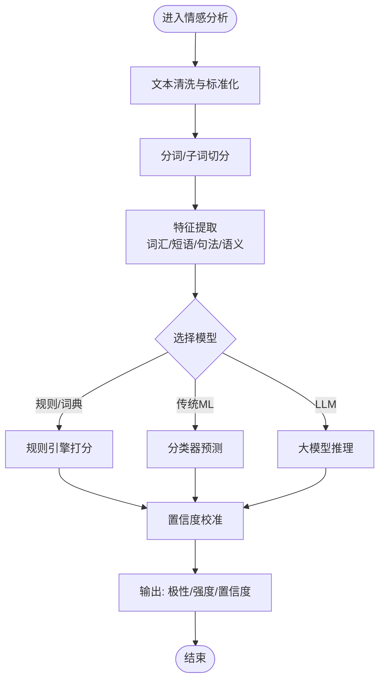
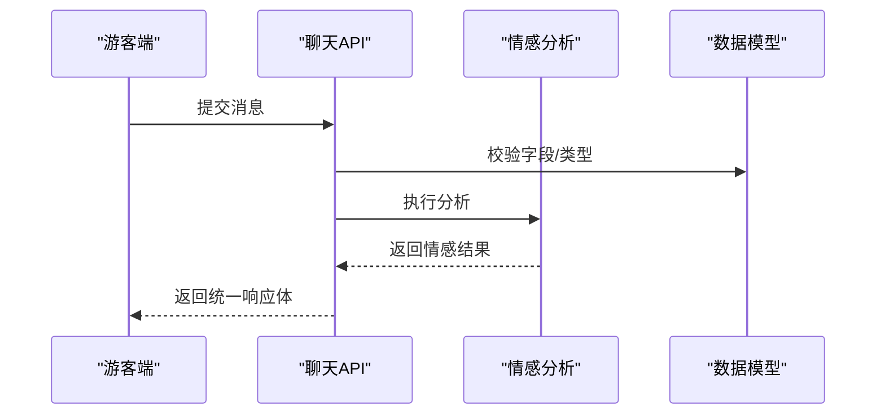
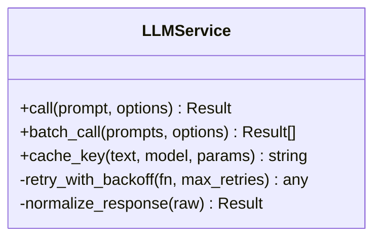
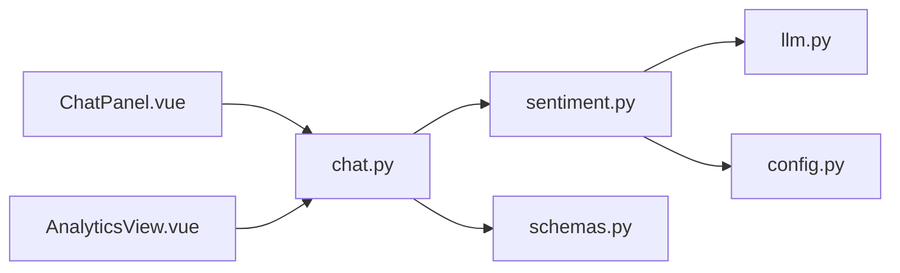

# 情感分析服务

<cite>
**本文引用的文件**   
- [backend/app/core/sentiment.py](file://backend/app/core/sentiment.py)
- [backend/app/api/chat.py](file://backend/app/api/chat.py)
- [backend/app/services/llm.py](file://backend/app/services/llm.py)
- [backend/app/config.py](file://backend/app/config.py)
- [backend/app/models/schemas.py](file://backend/app/models/schemas.py)
- [frontend/tourist-app/src/components/ChatPanel/ChatPanel.vue](file://frontend/tourist-app/src/components/ChatPanel/ChatPanel.vue)
- [frontend/admin-panel/src/views/Analytics/AnalyticsView.vue](file://frontend/admin-panel/src/views/Analytics/AnalyticsView.vue)
</cite>

## 目录
1. [简介](#简介)
2. [项目结构](#项目结构)
3. [核心组件](#核心组件)
4. [架构总览](#架构总览)
5. [详细组件分析](#详细组件分析)
6. [依赖关系分析](#依赖关系分析)
7. [性能与优化](#性能与优化)
8. [故障排查指南](#故障排查指南)
9. [结论](#结论)
10. [附录：API 使用示例与配置](#附录api-使用示例与配置)

## 简介
本技术文档聚焦于“智能旅游”系统中的情感分析服务，覆盖以下目标：
- 深入解释情感识别算法的实现原理：文本预处理、特征提取、情感分类模型。
- 说明多语言情感支持、领域适配与精度优化策略。
- 文档化情感强度评分、情感极性判断与置信度计算方法。
- 解释与对话系统的集成方式：实时情感检测与反馈机制。
- 提供 API 使用示例与配置选项。
- 展示结果可视化与用户反馈收集能力。

## 项目结构
本项目采用前后端分离的模块化架构，后端基于 Python（FastAPI），前端包含游客端与管理端。情感分析服务位于后端核心模块，并通过聊天接口暴露给前端；管理端提供可视化与分析面板。

图表来源
- [backend/app/api/chat.py](file://backend/app/api/chat.py)
- [backend/app/core/sentiment.py](file://backend/app/core/sentiment.py)
- [backend/app/services/llm.py](file://backend/app/services/llm.py)
- [backend/app/config.py](file://backend/app/config.py)
- [backend/app/models/schemas.py](file://backend/app/models/schemas.py)
- [frontend/tourist-app/src/components/ChatPanel/ChatPanel.vue](file://frontend/tourist-app/src/components/ChatPanel/ChatPanel.vue)
- [frontend/admin-panel/src/views/Analytics/AnalyticsView.vue](file://frontend/admin-panel/src/views/Analytics/AnalyticsView.vue)

章节来源
- [backend/app/api/chat.py](file://backend/app/api/chat.py)
- [backend/app/core/sentiment.py](file://backend/app/core/sentiment.py)
- [backend/app/services/llm.py](file://backend/app/services/llm.py)
- [backend/app/config.py](file://backend/app/config.py)
- [backend/app/models/schemas.py](file://backend/app/models/schemas.py)
- [frontend/tourist-app/src/components/ChatPanel/ChatPanel.vue](file://frontend/tourist-app/src/components/ChatPanel/ChatPanel.vue)
- [frontend/admin-panel/src/views/Analytics/AnalyticsView.vue](file://frontend/admin-panel/src/views/Analytics/AnalyticsView.vue)

## 核心组件
- 情感分析核心（sentiment.py）
  - 负责文本预处理、特征提取、调用分类器或 LLM 进行情感判定，输出情感极性、强度与置信度。
- 聊天 API（chat.py）
  - 接收用户消息，触发情感分析流程，返回结构化结果并支持实时反馈。
- LLM 服务（llm.py）
  - 封装大模型调用，用于零样本/少样本情感分类与多语言理解。
- 配置（config.py）
  - 管理模型路径、阈值、语言包、并发与超时等参数。
- 数据模型（schemas.py）
  - 定义请求/响应结构，包括情感标签、强度、置信度与元数据。
- 前端组件
  - 游客端聊天面板：展示情感状态与实时反馈。
  - 管理端分析面板：聚合历史情感指标与趋势。

章节来源
- [backend/app/core/sentiment.py](file://backend/app/core/sentiment.py)
- [backend/app/api/chat.py](file://backend/app/api/chat.py)
- [backend/app/services/llm.py](file://backend/app/services/llm.py)
- [backend/app/config.py](file://backend/app/config.py)
- [backend/app/models/schemas.py](file://backend/app/models/schemas.py)
- [frontend/tourist-app/src/components/ChatPanel/ChatPanel.vue](file://frontend/tourist-app/src/components/ChatPanel/ChatPanel.vue)
- [frontend/admin-panel/src/views/Analytics/AnalyticsView.vue](file://frontend/admin-panel/src/views/Analytics/AnalyticsView.vue)

## 架构总览
情感分析在对话链路中作为中间处理层，对输入文本进行清洗与建模，产出可量化的情感信号，供下游对话策略与可视化消费。

图表来源
- [backend/app/api/chat.py](file://backend/app/api/chat.py)
- [backend/app/core/sentiment.py](file://backend/app/core/sentiment.py)
- [backend/app/services/llm.py](file://backend/app/services/llm.py)
- [backend/app/config.py](file://backend/app/config.py)
- [backend/app/models/schemas.py](file://backend/app/models/schemas.py)

## 详细组件分析

### 情感分析核心（sentiment.py）
职责与流程
- 文本预处理：去噪、标准化、分词/子词切分、停用词过滤、同形异义归一。
- 特征提取：词汇级/短语级特征、句法/语义特征（如否定、强调）、上下文窗口编码。
- 情感分类模型：
  - 轻量规则/词典匹配（快速基线）。
  - 机器学习分类器（如线性模型+TF-IDF/词向量）。
  - 大模型（LLM）零样本/少样本推理（多语言、跨域）。
- 输出：情感极性（正/负/中性）、强度（连续值或离散等级）、置信度（概率或校准分数）。

关键实现要点
- 多语言支持：按语言加载词典与分词器，必要时通过 LLM 做跨语言对齐。
- 领域适配：引入领域词典、提示词模板与微调数据，提升垂直场景精度。
- 置信度计算：结合模型概率、一致性投票与不确定性估计，进行后验校准。
- 强度评分：将概率映射到[0,1]区间，或使用有序回归/阈值分段得到等级。

图表来源
- [backend/app/core/sentiment.py](file://backend/app/core/sentiment.py)

章节来源
- [backend/app/core/sentiment.py](file://backend/app/core/sentiment.py)

### 聊天 API（chat.py）
职责与流程
- 接收游客端消息，解析语言与上下文信息。
- 调用情感分析核心，获取情感信号。
- 组装响应结构，附加元数据（耗时、模型版本、语言等）。
- 支持流式/非流式返回，便于实时反馈。

图表来源
- [backend/app/api/chat.py](file://backend/app/api/chat.py)
- [backend/app/models/schemas.py](file://backend/app/models/schemas.py)

章节来源
- [backend/app/api/chat.py](file://backend/app/api/chat.py)
- [backend/app/models/schemas.py](file://backend/app/models/schemas.py)

### LLM 服务（llm.py）
职责与流程
- 封装外部大模型调用（鉴权、重试、限流、缓存）。
- 提供统一接口：文本→情感标签/强度/置信度。
- 支持多语言提示模板与领域定制。

图表来源
- [backend/app/services/llm.py](file://backend/app/services/llm.py)

章节来源
- [backend/app/services/llm.py](file://backend/app/services/llm.py)

### 配置（config.py）
- 模型与阈值：情感阈值、强度分段点、置信度下限。
- 语言与词典：语言列表、词典路径、分词器配置。
- 并发与超时：并发上限、请求超时、重试次数。
- 日志与监控：采样率、指标上报开关。

章节来源
- [backend/app/config.py](file://backend/app/config.py)

### 数据模型（schemas.py）
- 请求体：消息文本、语言代码、上下文标识、是否启用实时模式。
- 响应体：情感极性、强度、置信度、模型版本、语言、耗时、建议动作。

章节来源
- [backend/app/models/schemas.py](file://backend/app/models/schemas.py)

### 前端展示与反馈
- 游客端聊天面板：根据返回的情感结果动态调整 UI（表情、语气、推荐策略）。
- 管理端分析面板：聚合历史情感分布、趋势、异常波动告警。

章节来源
- [frontend/tourist-app/src/components/ChatPanel/ChatPanel.vue](file://frontend/tourist-app/src/components/ChatPanel/ChatPanel.vue)
- [frontend/admin-panel/src/views/Analytics/AnalyticsView.vue](file://frontend/admin-panel/src/views/Analytics/AnalyticsView.vue)

## 依赖关系分析
- 组件耦合
  - chat.py 依赖 sentiment.py 与 schemas.py。
  - sentiment.py 依赖 llm.py 与 config.py。
- 外部依赖
  - LLM 服务可能依赖第三方 SDK/HTTP 客户端。
  - 前端依赖 Vue 生态与图表库（用于可视化）。

图表来源
- [backend/app/api/chat.py](file://backend/app/api/chat.py)
- [backend/app/core/sentiment.py](file://backend/app/core/sentiment.py)
- [backend/app/services/llm.py](file://backend/app/services/llm.py)
- [backend/app/config.py](file://backend/app/config.py)
- [backend/app/models/schemas.py](file://backend/app/models/schemas.py)
- [frontend/tourist-app/src/components/ChatPanel/ChatPanel.vue](file://frontend/tourist-app/src/components/ChatPanel/ChatPanel.vue)
- [frontend/admin-panel/src/views/Analytics/AnalyticsView.vue](file://frontend/admin-panel/src/views/Analytics/AnalyticsView.vue)

章节来源
- [backend/app/api/chat.py](file://backend/app/api/chat.py)
- [backend/app/core/sentiment.py](file://backend/app/core/sentiment.py)
- [backend/app/services/llm.py](file://backend/app/services/llm.py)
- [backend/app/config.py](file://backend/app/config.py)
- [backend/app/models/schemas.py](file://backend/app/models/schemas.py)
- [frontend/tourist-app/src/components/ChatPanel/ChatPanel.vue](file://frontend/tourist-app/src/components/ChatPanel/ChatPanel.vue)
- [frontend/admin-panel/src/views/Analytics/AnalyticsView.vue](file://frontend/admin-panel/src/views/Analytics/AnalyticsView.vue)

## 性能与优化
- 文本预处理
  - 增量清洗与缓存：对重复片段复用清洗结果。
  - 并行分词与批处理：减少 I/O 与序列化开销。
- 特征提取
  - 预计算特征索引：热点词汇/短语缓存。
  - 降维与稀疏矩阵优化：控制内存占用。
- 模型推理
  - 多级路由：简单规则/轻量模型优先，复杂场景再走 LLM。
  - 批量推理与流水线：提高吞吐。
  - 结果缓存：相同输入短周期内命中缓存。
- 置信度与阈值
  - 动态阈值：按语言/领域自适应调整。
  - 校准方法：温度缩放/Platt 校准，提升可靠性。
- 前端体验
  - 局部更新与骨架屏：降低感知延迟。
  - 错误降级：网络失败时回退到本地规则。

## 故障排查指南
- 常见问题
  - 模型不可用：检查 LLM 服务健康与鉴权配置。
  - 超时/限流：增大并发上限或增加重试与退避策略。
  - 多语言错配：确认语言代码与词典/提示模板一致。
  - 低置信度：调高阈值或引入更多领域数据。
- 定位步骤
  - 查看请求/响应结构与字段完整性。
  - 核对配置项（阈值、语言包、模型路径）。
  - 开启调试日志，记录关键阶段耗时与中间结果。
  - 复现最小用例，隔离问题范围。

章节来源
- [backend/app/config.py](file://backend/app/config.py)
- [backend/app/services/llm.py](file://backend/app/services/llm.py)
- [backend/app/models/schemas.py](file://backend/app/models/schemas.py)

## 结论
本情感分析服务以“预处理—特征—模型—校准—输出”为主线，结合规则、传统机器学习与大模型，兼顾速度与精度；通过配置化与领域适配，在多语言与垂直场景中保持稳定表现；与对话系统深度集成，提供实时情感反馈与可视化分析能力。

## 附录：API 使用示例与配置

- 请求示例（聊天接口）
  - 方法：POST
  - 路径：/chat
  - 请求体字段（参考 schemas.py）
    - text: 字符串，用户消息
    - lang: 字符串，语言代码（如 zh/en/ja）
    - context_id: 字符串，会话上下文标识
    - realtime: 布尔，是否启用实时模式
  - 响应体字段（参考 schemas.py）
    - emotion: 字符串，情感极性（正/负/中性）
    - intensity: 数值，情感强度（0~1）
    - confidence: 数值，置信度（0~1）
    - meta: 对象，包含模型版本、语言、耗时等

- 配置项（参考 config.py）
  - thresholds.emotion: 情感阈值
  - thresholds.intensity_levels: 强度分段点
  - languages.supported: 支持语言列表
  - models.default: 默认模型/提示模板
  - concurrency.max_workers: 最大并发
  - timeout.request_ms: 请求超时毫秒数
  - retry.max_attempts: 最大重试次数
  - cache.enabled: 是否启用结果缓存
  - logging.sample_rate: 日志采样率

- 前端集成要点
  - 游客端聊天面板：根据返回的 emotion/intensity/confidence 动态渲染表情与提示语。
  - 管理端分析面板：聚合历史数据，绘制情感分布与趋势图，支持筛选与导出。

章节来源
- [backend/app/models/schemas.py](file://backend/app/models/schemas.py)
- [backend/app/config.py](file://backend/app/config.py)
- [frontend/tourist-app/src/components/ChatPanel/ChatPanel.vue](file://frontend/tourist-app/src/components/ChatPanel/ChatPanel.vue)
- [frontend/admin-panel/src/views/Analytics/AnalyticsView.vue](file://frontend/admin-panel/src/views/Analytics/AnalyticsView.vue)