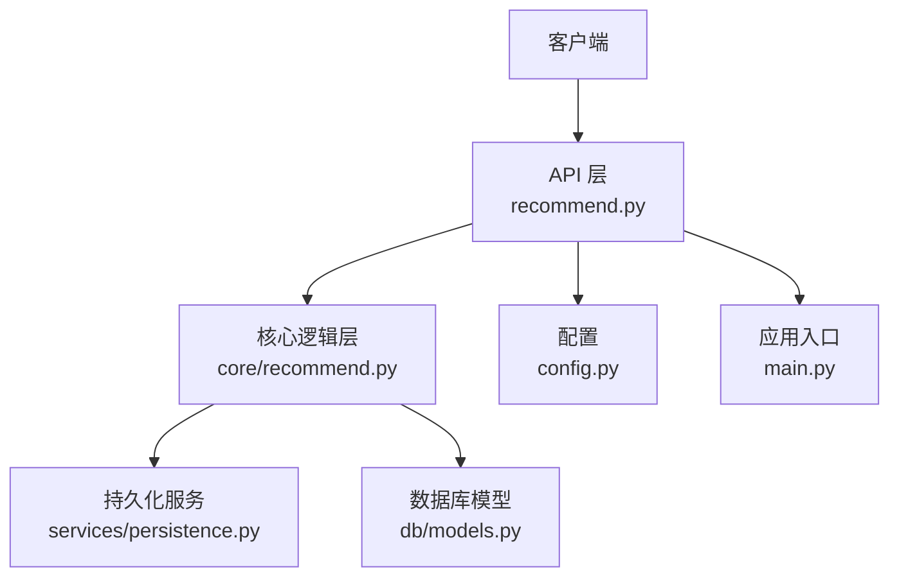
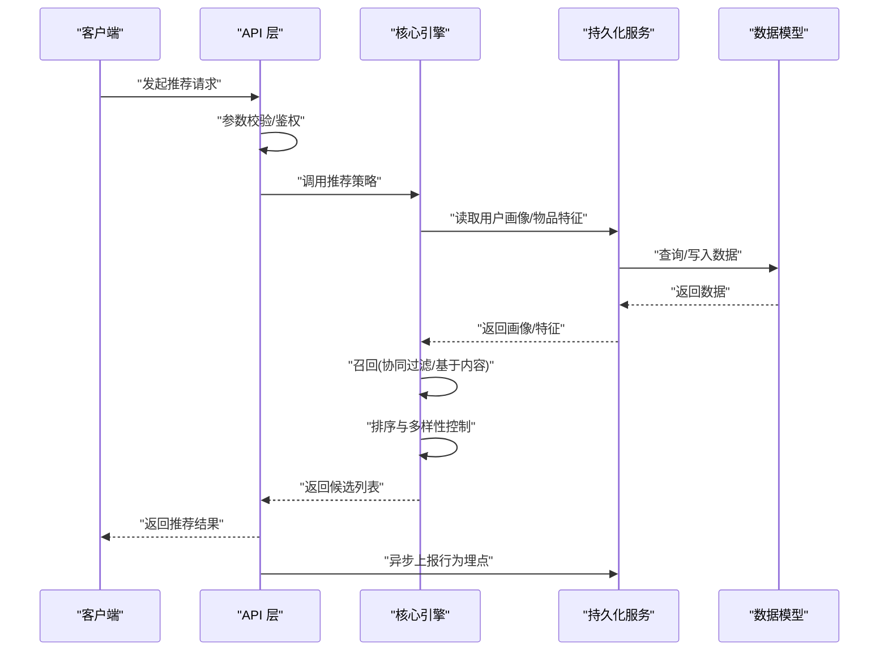
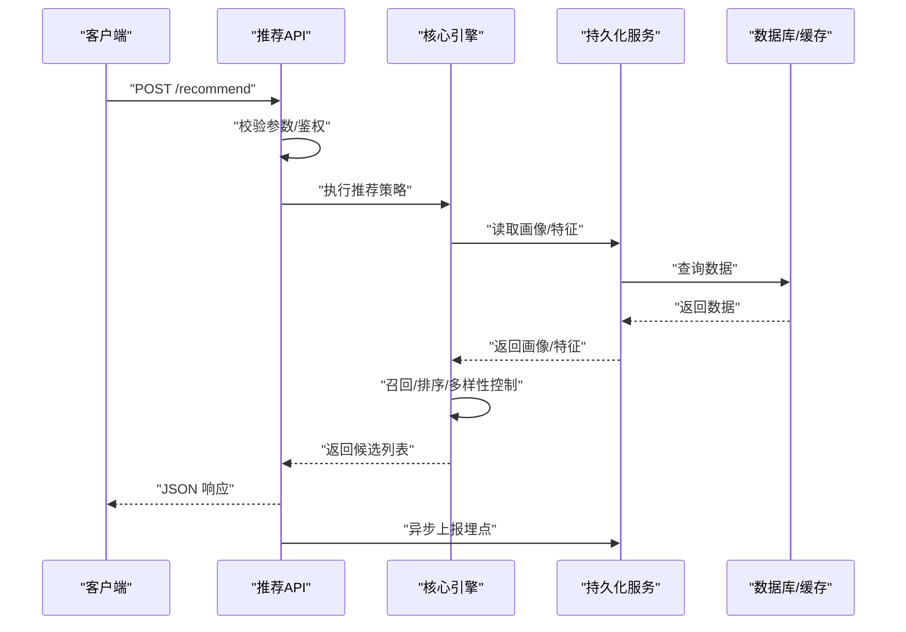
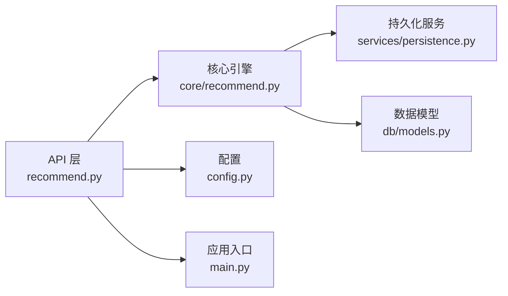

# 推荐引擎服务

<cite>
**本文引用的文件**   
- [backend/app/api/recommend.py](file://backend/app/api/recommend.py)
- [backend/app/core/recommend.py](file://backend/app/core/recommend.py)
- [backend/app/db/models.py](file://backend/app/db/models.py)
- [backend/app/services/persistence.py](file://backend/app/services/persistence.py)
- [backend/app/config.py](file://backend/app/config.py)
- [backend/app/main.py](file://backend/app/main.py)
- [backend/pyproject.toml](file://backend/pyproject.toml)
</cite>

## 目录
1. [简介](#简介)
2. [项目结构](#项目结构)
3. [核心组件](#核心组件)
4. [架构总览](#架构总览)
5. [详细组件分析](#详细组件分析)
6. [依赖关系分析](#依赖关系分析)
7. [性能考虑](#性能考虑)
8. [故障排查指南](#故障排查指南)
9. [结论](#结论)
10. [附录](#附录)

## 简介
本技术文档围绕“推荐引擎服务”展开，聚焦于个性化推荐算法与工程实现。内容涵盖用户画像构建、物品特征提取、协同过滤策略、基于内容与混合推荐、实时推荐机制、排序与多样性控制、冷启动处理、行为数据集成与实时更新、API 接口与调用示例，以及效果评估与 A/B 测试框架使用方法。文档旨在为开发者与产品/运营人员提供从算法到工程落地的完整参考。

## 项目结构
后端采用分层架构：API 层暴露 HTTP 接口；核心逻辑层封装推荐算法与策略；数据访问层通过模型与服务进行持久化；配置与入口位于应用主模块。

图表来源
- [backend/app/api/recommend.py](file://backend/app/api/recommend.py)
- [backend/app/core/recommend.py](file://backend/app/core/recommend.py)
- [backend/app/services/persistence.py](file://backend/app/services/persistence.py)
- [backend/app/db/models.py](file://backend/app/db/models.py)
- [backend/app/config.py](file://backend/app/config.py)
- [backend/app/main.py](file://backend/app/main.py)

章节来源
- [backend/app/main.py](file://backend/app/main.py)
- [backend/pyproject.toml](file://backend/pyproject.toml)

## 核心组件
- 推荐 API 控制器：负责请求校验、参数解析、路由分发与响应封装。
- 推荐核心引擎：实现用户画像、物品特征、召回（协同过滤/基于内容）、排序与多样性控制、冷启动策略与实时增量更新。
- 持久化服务：统一读写用户行为、物品元数据、画像与特征缓存等数据。
- 数据模型：定义用户、物品、交互事件、画像与特征的结构与约束。
- 配置管理：加载运行期配置项（如阈值、权重、缓存策略）。

章节来源
- [backend/app/api/recommend.py](file://backend/app/api/recommend.py)
- [backend/app/core/recommend.py](file://backend/app/core/recommend.py)
- [backend/app/services/persistence.py](file://backend/app/services/persistence.py)
- [backend/app/db/models.py](file://backend/app/db/models.py)
- [backend/app/config.py](file://backend/app/config.py)

## 架构总览
推荐系统整体流程包括：请求接入、上下文解析、画像与特征获取、候选召回、排序与重排、结果返回与埋点上报。

图表来源
- [backend/app/api/recommend.py](file://backend/app/api/recommend.py)
- [backend/app/core/recommend.py](file://backend/app/core/recommend.py)
- [backend/app/services/persistence.py](file://backend/app/services/persistence.py)
- [backend/app/db/models.py](file://backend/app/db/models.py)

## 详细组件分析

### 用户画像构建
- 数据来源：点击、收藏、购买、停留时长、搜索词、会话上下文等。
- 构建方式：统计型（频次、时间衰减）+ 向量型（兴趣标签、嵌入表示）。
- 更新机制：近实时增量更新（滑动窗口、指数衰减），离线批处理定期校准。
- 存储位置：画像表/缓存键空间，支持按用户维度快速检索。

章节来源
- [backend/app/core/recommend.py](file://backend/app/core/recommend.py)
- [backend/app/services/persistence.py](file://backend/app/services/persistence.py)
- [backend/app/db/models.py](file://backend/app/db/models.py)

### 物品特征提取
- 特征维度：类目、标签、价格区间、热度、时效性、内容摘要、向量嵌入等。
- 抽取流程：元数据清洗→特征工程→向量化→索引构建。
- 更新策略：新物上线即入库，周期性全量重建索引，热点物实时刷新。

章节来源
- [backend/app/core/recommend.py](file://backend/app/core/recommend.py)
- [backend/app/services/persistence.py](file://backend/app/services/persistence.py)
- [backend/app/db/models.py](file://backend/app/db/models.py)

### 协同过滤算法
- 用户-物品交互矩阵构建与稀疏化处理。
- 相似度计算：余弦相似度或改进的加权相似度（含时间衰减）。
- 候选生成：Top-N 相似用户/物品，聚合评分并去重。
- 优化要点：近似最近邻检索、分桶召回、预计算与增量更新。

章节来源
- [backend/app/core/recommend.py](file://backend/app/core/recommend.py)

### 基于内容的推荐
- 匹配依据：用户兴趣向量与物品特征向量相似度。
- 适用场景：冷启动、长尾物品曝光、可解释性要求高。
- 融合策略：与协同过滤结果加权融合或门控选择。

章节来源
- [backend/app/core/recommend.py](file://backend/app/core/recommend.py)

### 混合推荐与实时推荐机制
- 混合策略：多路召回（协同过滤 + 基于内容 + 热门/探索）→ 排序 → 多样性重排。
- 实时机制：流式行为事件入队，增量更新画像与特征，短周期触发重算。
- 降级策略：当实时链路异常时回退至离线快照。

章节来源
- [backend/app/core/recommend.py](file://backend/app/core/recommend.py)
- [backend/app/services/persistence.py](file://backend/app/services/persistence.py)

### 排序与多样性控制
- 排序目标：相关性、新颖性、多样性、商业权重等多目标加权。
- 多样性控制：打散策略、类别覆盖度、去重与去噪。
- 在线学习：反馈信号（点击/转化）用于动态调整权重。

章节来源
- [backend/app/core/recommend.py](file://backend/app/core/recommend.py)

### 冷启动处理方案
- 新用户：基于热门/探索策略与基础人口属性偏好初始化。
- 新物品：基于内容相似度与初始曝光配额逐步放量。
- 监控指标：冷启动覆盖率、早期点击率、曝光方差。

章节来源
- [backend/app/core/recommend.py](file://backend/app/core/recommend.py)

### 用户行为数据集成与实时更新
- 采集通道：前端埋点、服务端日志、消息队列。
- 处理管道：去重/清洗→聚合→画像/特征更新→索引刷新。
- 一致性保障：幂等写入、事务边界、失败重试与死信队列。

章节来源
- [backend/app/services/persistence.py](file://backend/app/services/persistence.py)
- [backend/app/db/models.py](file://backend/app/db/models.py)

### API 接口文档与调用示例
- 接口职责：接收推荐请求，返回排序后的候选列表，支持分页与过滤。
- 输入参数：用户标识、上下文信息（时间/地点/设备）、业务域、数量上限、过滤条件。
- 输出字段：候选 ID、得分、推荐理由、扩展信息。
- 错误码：参数错误、服务不可用、限流、无结果等。
- 调用示例：见下方序列图，展示一次完整的请求-响应流程。

章节来源
- [backend/app/api/recommend.py](file://backend/app/api/recommend.py)
- [backend/app/main.py](file://backend/app/main.py)

图表来源
- [backend/app/api/recommend.py](file://backend/app/api/recommend.py)
- [backend/app/core/recommend.py](file://backend/app/core/recommend.py)
- [backend/app/services/persistence.py](file://backend/app/services/persistence.py)
- [backend/app/db/models.py](file://backend/app/db/models.py)

### 推荐效果评估与 A/B 测试框架
- 评估指标：点击率、转化率、平均排名、覆盖率、多样性指数、新颖性、长期留存。
- 离线评估：历史回放、交叉验证、AUC/NDCG 等。
- 在线实验：分流策略、指标看板、显著性检验、自动止损。
- 回归检测：关键指标阈值告警、回滚策略。

章节来源
- [backend/app/core/recommend.py](file://backend/app/core/recommend.py)
- [backend/app/api/recommend.py](file://backend/app/api/recommend.py)

## 依赖关系分析
- 模块耦合：API 层仅依赖核心引擎与配置；核心引擎依赖持久化服务与数据模型；持久化服务封装底层存储。
- 外部依赖：数据库/缓存、消息队列（可选）、向量检索（可选）。
- 循环依赖：当前分层清晰，未见循环引用。

图表来源
- [backend/app/api/recommend.py](file://backend/app/api/recommend.py)
- [backend/app/core/recommend.py](file://backend/app/core/recommend.py)
- [backend/app/services/persistence.py](file://backend/app/services/persistence.py)
- [backend/app/db/models.py](file://backend/app/db/models.py)
- [backend/app/config.py](file://backend/app/config.py)
- [backend/app/main.py](file://backend/app/main.py)

章节来源
- [backend/pyproject.toml](file://backend/pyproject.toml)

## 性能考虑
- 缓存策略：用户画像与热门物品特征多级缓存，TTL 与失效策略可调。
- 索引优化：向量检索使用近似最近邻，减少在线延迟。
- 并发与限流：API 层加限流与熔断，核心引擎异步化非关键路径。
- 资源隔离：不同召回路与排序阶段独立线程池/进程池。
- 监控与告警：QPS、P99 延迟、错误率、缓存命中率、数据新鲜度。

[本节为通用指导，不直接分析具体文件]

## 故障排查指南
- 常见问题：参数缺失/非法、用户不存在、物品未入库、缓存不可用、下游超时。
- 定位步骤：检查请求参数→查看日志→确认缓存命中→核对数据模型→复现实验环境。
- 恢复策略：降级到默认策略、回滚到上一版本、重启依赖服务、清理脏数据。

章节来源
- [backend/app/api/recommend.py](file://backend/app/api/recommend.py)
- [backend/app/services/persistence.py](file://backend/app/services/persistence.py)
- [backend/app/db/models.py](file://backend/app/db/models.py)

## 结论
本推荐引擎服务以分层架构组织，核心引擎整合协同过滤与基于内容方法，结合混合策略与实时增量更新，提供稳定高效的个性化推荐能力。通过完善的评估与 A/B 测试框架，可实现持续迭代与质量保障。建议在生产环境中完善监控告警与容量规划，确保高可用与可扩展性。

[本节为总结性内容，不直接分析具体文件]

## 附录
- 术语说明：用户画像、物品特征、协同过滤、基于内容、混合推荐、多样性控制、冷启动、A/B 测试。
- 最佳实践：小步快跑、灰度发布、指标驱动、可观测性优先。

[本节为概念性内容，不直接分析具体文件]