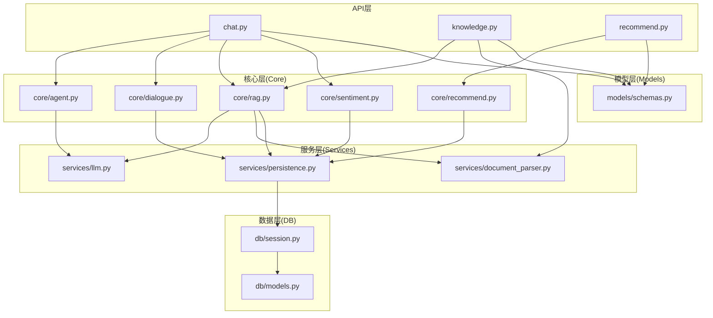
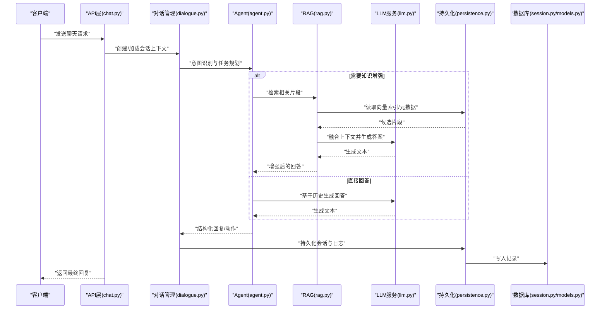
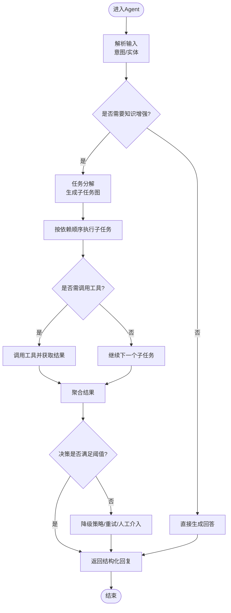
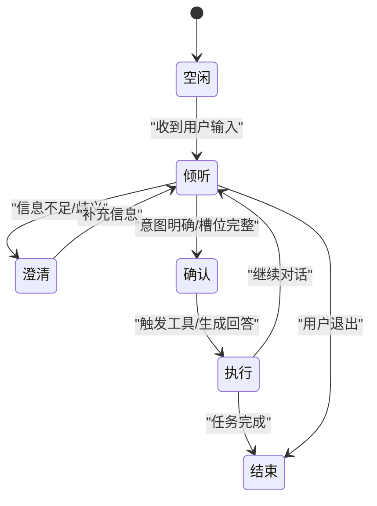
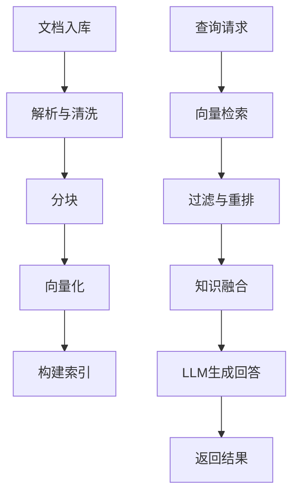
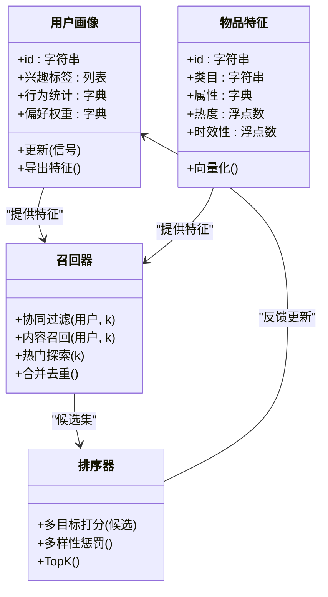
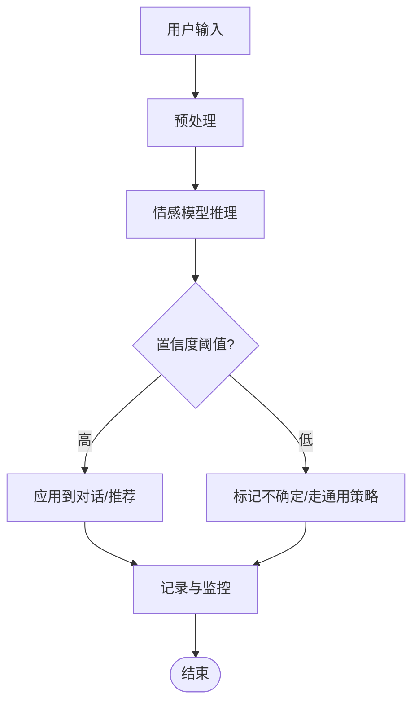
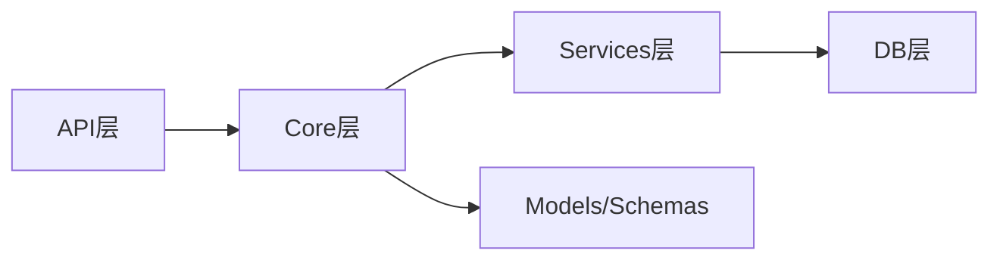

# 核心业务服务

<cite>
**本文引用的文件**   
- [backend/app/main.py](file://backend/app/main.py)
- [backend/app/config.py](file://backend/app/config.py)
- [backend/app/core/agent.py](file://backend/app/core/agent.py)
- [backend/app/core/dialogue.py](file://backend/app/core/dialogue.py)
- [backend/app/core/rag.py](file://backend/app/core/rag.py)
- [backend/app/core/recommend.py](file://backend/app/core/recommend.py)
- [backend/app/core/sentiment.py](file://backend/app/core/sentiment.py)
- [backend/app/api/chat.py](file://backend/app/api/chat.py)
- [backend/app/api/knowledge.py](file://backend/app/api/knowledge.py)
- [backend/app/api/recommend.py](file://backend/app/api/recommend.py)
- [backend/app/services/llm.py](file://backend/app/services/llm.py)
- [backend/app/services/document_parser.py](file://backend/app/services/document_parser.py)
- [backend/app/services/persistence.py](file://backend/app/services/persistence.py)
- [backend/app/db/models.py](file://backend/app/db/models.py)
- [backend/app/db/session.py](file://backend/app/db/session.py)
- [backend/app/models/schemas.py](file://backend/app/models/schemas.py)
</cite>

## 目录
1. [简介](#简介)
2. [项目结构](#项目结构)
3. [核心组件](#核心组件)
4. [架构总览](#架构总览)
5. [详细组件分析](#详细组件分析)
6. [依赖关系分析](#依赖关系分析)
7. [性能考虑](#性能考虑)
8. [故障排查指南](#故障排查指南)
9. [结论](#结论)
10. [附录](#附录)

## 简介
本文件面向SmartTour核心业务服务的开发者与架构师，系统性阐述Agent智能代理、对话管理、RAG检索增强生成、推荐引擎与情感分析模块的设计与实现。文档聚焦以下目标：
- Agent智能代理的任务分解、工具调用与决策逻辑
- 对话管理的会话状态维护、上下文理解与多轮对话处理
- RAG系统的向量检索、知识融合与回答生成
- 推荐引擎的用户画像构建、物品特征提取与个性化策略
- 情感分析的技术实现与应用场景
- 服务间依赖、数据流转与性能优化策略
- 设计模式与扩展指导

## 项目结构
后端采用分层组织方式：API层暴露HTTP接口；Core层承载核心业务（Agent、对话、RAG、推荐、情感）；Services层封装外部能力（LLM、文档解析、持久化等）；DB层提供模型与数据库会话；Models层定义请求/响应Schema。

图表来源
- [backend/app/api/chat.py](file://backend/app/api/chat.py)
- [backend/app/api/knowledge.py](file://backend/app/api/knowledge.py)
- [backend/app/api/recommend.py](file://backend/app/api/recommend.py)
- [backend/app/core/agent.py](file://backend/app/core/agent.py)
- [backend/app/core/dialogue.py](file://backend/app/core/dialogue.py)
- [backend/app/core/rag.py](file://backend/app/core/rag.py)
- [backend/app/core/recommend.py](file://backend/app/core/recommend.py)
- [backend/app/core/sentiment.py](file://backend/app/core/sentiment.py)
- [backend/app/services/llm.py](file://backend/app/services/llm.py)
- [backend/app/services/document_parser.py](file://backend/app/services/document_parser.py)
- [backend/app/services/persistence.py](file://backend/app/services/persistence.py)
- [backend/app/db/models.py](file://backend/app/db/models.py)
- [backend/app/db/session.py](file://backend/app/db/session.py)
- [backend/app/models/schemas.py](file://backend/app/models/schemas.py)

章节来源
- [backend/app/main.py](file://backend/app/main.py)
- [backend/app/config.py](file://backend/app/config.py)

## 核心组件
本节概述五大核心组件的职责与交互要点：
- Agent智能代理：负责意图识别、任务分解、工具编排与决策执行
- 对话管理：维护会话状态、上下文窗口、记忆与多轮对话流程控制
- RAG检索增强生成：文档解析、向量化、检索召回、知识融合与大模型生成
- 推荐引擎：用户画像、物品特征、召回与排序策略
- 情感分析：对用户输入进行情感极性/强度评估，驱动对话策略与内容适配

章节来源
- [backend/app/core/agent.py](file://backend/app/core/agent.py)
- [backend/app/core/dialogue.py](file://backend/app/core/dialogue.py)
- [backend/app/core/rag.py](file://backend/app/core/rag.py)
- [backend/app/core/recommend.py](file://backend/app/core/recommend.py)
- [backend/app/core/sentiment.py](file://backend/app/core/sentiment.py)

## 架构总览
整体架构遵循“API -> Core -> Services -> DB”的分层模式，结合事件与异步调用提升吞吐。关键路径包括：
- 聊天入口：API接收消息，路由至对话管理与Agent，必要时触发RAG与推荐
- 知识库入库：文档解析->分块->向量化->存储
- 推荐链路：读取用户画像与物品特征->召回->排序->返回结果

图表来源
- [backend/app/api/chat.py](file://backend/app/api/chat.py)
- [backend/app/core/dialogue.py](file://backend/app/core/dialogue.py)
- [backend/app/core/agent.py](file://backend/app/core/agent.py)
- [backend/app/core/rag.py](file://backend/app/core/rag.py)
- [backend/app/services/llm.py](file://backend/app/services/llm.py)
- [backend/app/services/persistence.py](file://backend/app/services/persistence.py)
- [backend/app/db/session.py](file://backend/app/db/session.py)
- [backend/app/db/models.py](file://backend/app/db/models.py)

## 详细组件分析

### Agent智能代理系统
职责与流程
- 意图识别：从用户输入中抽取意图与实体
- 任务分解：将复杂问题拆解为子任务序列或并行分支
- 工具调用：根据子任务选择工具（如搜索、计算、查询知识库）
- 决策逻辑：依据置信度、约束条件与历史上下文决定下一步动作
- 结果聚合：汇总各子任务输出，形成最终回复或行动指令

关键数据结构与复杂度
- 任务图：节点表示子任务，边表示依赖关系；拓扑排序时间复杂度O(V+E)
- 工具注册表：哈希映射，查找复杂度O(1)
- 决策评分：加权打分，线性复杂度O(n)

错误处理与容错
- 工具失败重试与降级策略
- 超时熔断与回退到默认策略
- 可观测性：记录工具调用轨迹与耗时

扩展点
- 新增工具：在工具注册表中声明参数、校验器与执行器
- 自定义决策器：替换评分函数或策略规则
- 插件式任务模板：通过配置注入新任务类型

图表来源
- [backend/app/core/agent.py](file://backend/app/core/agent.py)
- [backend/app/services/llm.py](file://backend/app/services/llm.py)

章节来源
- [backend/app/core/agent.py](file://backend/app/core/agent.py)
- [backend/app/services/llm.py](file://backend/app/services/llm.py)

### 对话管理系统
职责与流程
- 会话生命周期：创建、恢复、清理
- 上下文维护：滑动窗口、摘要压缩、长期记忆
- 多轮对话：槽位填充、指代消解、话题切换
- 状态机：基于状态机的对话流程控制（空闲、倾听、澄清、确认、执行、结束）

关键数据结构与复杂度
- 会话上下文：环形缓冲区或队列，插入/删除O(1)，范围查询O(k)
- 槽位表：键值映射，更新O(1)
- 状态转移：查表或规则匹配，平均O(1)

错误处理与容错
- 上下文溢出时的摘要策略
- 歧义输入的澄清机制
- 异常中断的会话恢复

图表来源
- [backend/app/core/dialogue.py](file://backend/app/core/dialogue.py)
- [backend/app/services/persistence.py](file://backend/app/services/persistence.py)

章节来源
- [backend/app/core/dialogue.py](file://backend/app/core/dialogue.py)
- [backend/app/services/persistence.py](file://backend/app/services/persistence.py)

### RAG检索增强生成系统
职责与流程
- 文档解析：格式兼容、清洗、分块
- 向量化：文本嵌入、索引构建与更新
- 检索召回：相似度检索、过滤与重排
- 知识融合：去重、冲突消解、相关性评分
- 回答生成：将检索片段作为上下文，驱动大模型生成

关键数据结构与复杂度
- 分块索引：倒排+向量索引，检索近似O(logN)
- 相似度计算：余弦相似度O(d)，d为向量维度
- 融合排序：Top-K合并，复杂度O(K log K)

错误处理与容错
- 解析失败的回退策略（跳过/标记）
- 检索空结果的兜底提示
- 生成超时与截断保护

图表来源
- [backend/app/core/rag.py](file://backend/app/core/rag.py)
- [backend/app/services/document_parser.py](file://backend/app/services/document_parser.py)
- [backend/app/services/persistence.py](file://backend/app/services/persistence.py)
- [backend/app/services/llm.py](file://backend/app/services/llm.py)

章节来源
- [backend/app/core/rag.py](file://backend/app/core/rag.py)
- [backend/app/services/document_parser.py](file://backend/app/services/document_parser.py)
- [backend/app/services/persistence.py](file://backend/app/services/persistence.py)
- [backend/app/services/llm.py](file://backend/app/services/llm.py)

### 推荐引擎算法
职责与流程
- 用户画像：兴趣标签、行为统计、偏好权重
- 物品特征：类目、属性、热度、时效性
- 召回策略：协同过滤、基于内容的召回、热门/探索混合
- 排序策略：多目标打分（相关性、多样性、新颖性、商业指标）
- 反馈闭环：点击/停留/转化信号回流更新画像与模型

关键数据结构与复杂度
- 用户-物品矩阵：稀疏矩阵，操作近似O(nnz)
- 特征向量：维度d，相似度计算O(d)
- 排序阶段：Top-K筛选O(N log K)

错误处理与容错
- 冷启动策略（热门/探索）
- 数据缺失的默认值与平滑
- 实时流式更新的幂等性

图表来源
- [backend/app/core/recommend.py](file://backend/app/core/recommend.py)
- [backend/app/services/persistence.py](file://backend/app/services/persistence.py)

章节来源
- [backend/app/core/recommend.py](file://backend/app/core/recommend.py)
- [backend/app/services/persistence.py](file://backend/app/services/persistence.py)

### 情感分析模块
职责与流程
- 输入预处理：清洗、标准化、语言检测
- 情感分类：极性（正/负/中性）、强度、情绪类别
- 应用联动：调整对话语气、推荐策略、风险提示
- 持续学习：标注回流、增量训练、漂移检测

关键数据结构与复杂度
- 词表/句向量：查询O(1)/O(d)
- 分类器推理：前向传播O(L*d)，L为序列长度
- 缓存命中：LRU缓存命中率影响端到端延迟

错误处理与容错
- 低置信度结果标记为不确定
- 多语言回退与默认策略
- 批量处理的批大小自适应

图表来源
- [backend/app/core/sentiment.py](file://backend/app/core/sentiment.py)
- [backend/app/services/persistence.py](file://backend/app/services/persistence.py)

章节来源
- [backend/app/core/sentiment.py](file://backend/app/core/sentiment.py)
- [backend/app/services/persistence.py](file://backend/app/services/persistence.py)

## 依赖关系分析
组件耦合与内聚
- API层仅依赖Core与Schemas，保持薄接口
- Core层依赖Services与DB，内聚业务逻辑
- Services层屏蔽外部差异，提供稳定契约
- DB层集中建模与会话管理，降低跨层耦合

潜在循环依赖
- Core不应反向依赖API
- Services避免直接引用Core内部实现

外部依赖与集成点
- LLM服务：统一抽象，支持多后端
- 文档解析：多格式兼容
- 持久化：统一读写接口，便于替换存储

图表来源
- [backend/app/api/chat.py](file://backend/app/api/chat.py)
- [backend/app/core/agent.py](file://backend/app/core/agent.py)
- [backend/app/services/llm.py](file://backend/app/services/llm.py)
- [backend/app/db/session.py](file://backend/app/db/session.py)
- [backend/app/models/schemas.py](file://backend/app/models/schemas.py)

章节来源
- [backend/app/api/chat.py](file://backend/app/api/chat.py)
- [backend/app/core/agent.py](file://backend/app/core/agent.py)
- [backend/app/services/llm.py](file://backend/app/services/llm.py)
- [backend/app/db/session.py](file://backend/app/db/session.py)
- [backend/app/models/schemas.py](file://backend/app/models/schemas.py)

## 性能考虑
- 并发与异步：在高QPS场景下使用异步I/O与连接池，减少阻塞
- 缓存策略：会话上下文、检索结果、推荐候选的短期缓存，降低重复计算
- 批处理：文档解析与向量化批量提交，提高吞吐
- 流式输出：LLM生成采用流式返回，缩短首字延迟
- 资源隔离：不同服务独立进程/容器，避免相互干扰
- 监控与限流：关键路径埋点，设置超时与熔断阈值

[本节为通用性能建议，不直接分析具体文件]

## 故障排查指南
常见问题与定位步骤
- 对话中断：检查会话持久化写入与恢复逻辑，确认会话ID一致性
- RAG无结果：验证索引构建是否成功，检索过滤条件是否过严
- 推荐冷启动：确认用户画像初始化与热门策略生效
- 情感分析误判：查看置信度分布与样本回流情况
- LLM超时：检查后端健康状态与重试策略

可观测性与日志
- 关键路径打点：请求ID、耗时、错误码
- 结构化日志：包含上下文摘要与关键参数
- 告警阈值：错误率、P95/P99延迟、资源水位

章节来源
- [backend/app/services/persistence.py](file://backend/app/services/persistence.py)
- [backend/app/core/dialogue.py](file://backend/app/core/dialogue.py)
- [backend/app/core/rag.py](file://backend/app/core/rag.py)
- [backend/app/core/recommend.py](file://backend/app/core/recommend.py)
- [backend/app/core/sentiment.py](file://backend/app/core/sentiment.py)

## 结论
SmartTour核心业务服务以分层架构为基础，围绕Agent、对话管理、RAG、推荐与情感分析五大模块构建。通过清晰的职责划分、稳定的服务契约与可扩展的插件机制，系统在功能完整性与工程可维护性之间取得平衡。建议在后续迭代中强化可观测性、完善冷启动策略与持续学习闭环，进一步提升用户体验与系统韧性。

[本节为总结性内容，不直接分析具体文件]

## 附录
- 设计模式参考
  - 策略模式：用于推荐排序与情感策略的可插拔实现
  - 工厂模式：用于工具与解析器的动态创建
  - 观察者模式：用于事件驱动的画像更新与推荐刷新
  - 责任链模式：用于对话状态机与中间件处理
- 扩展指导
  - 新增工具：在Agent工具注册表中声明签名与执行器
  - 新增解析器：实现统一接口并注册到解析流水线
  - 新增召回策略：接入召回器并参与合并去重与排序

[本节为概念性内容，不直接分析具体文件]