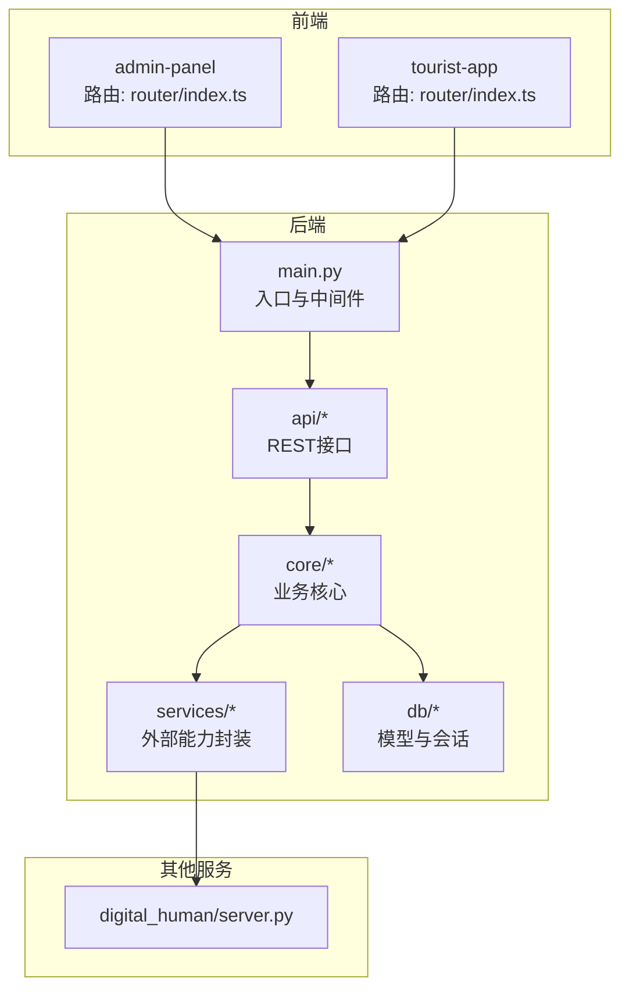
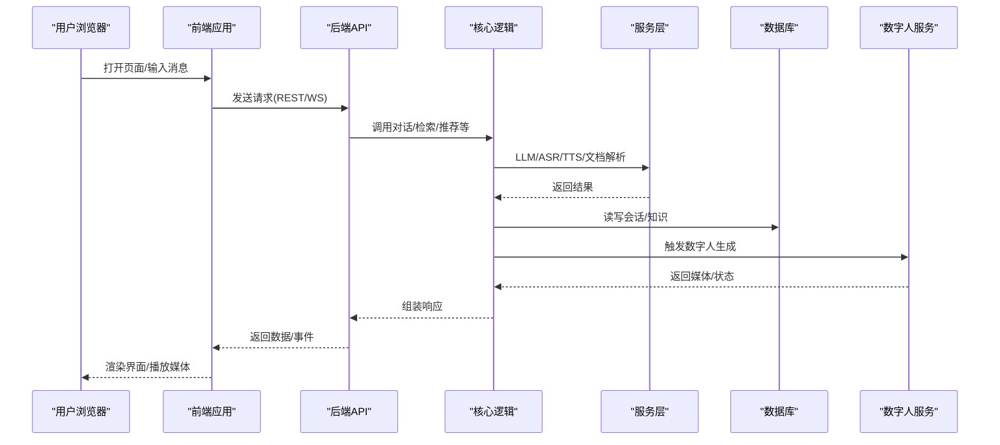
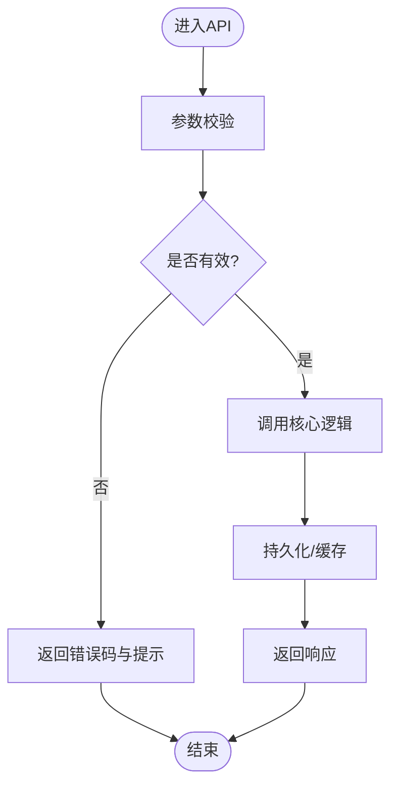
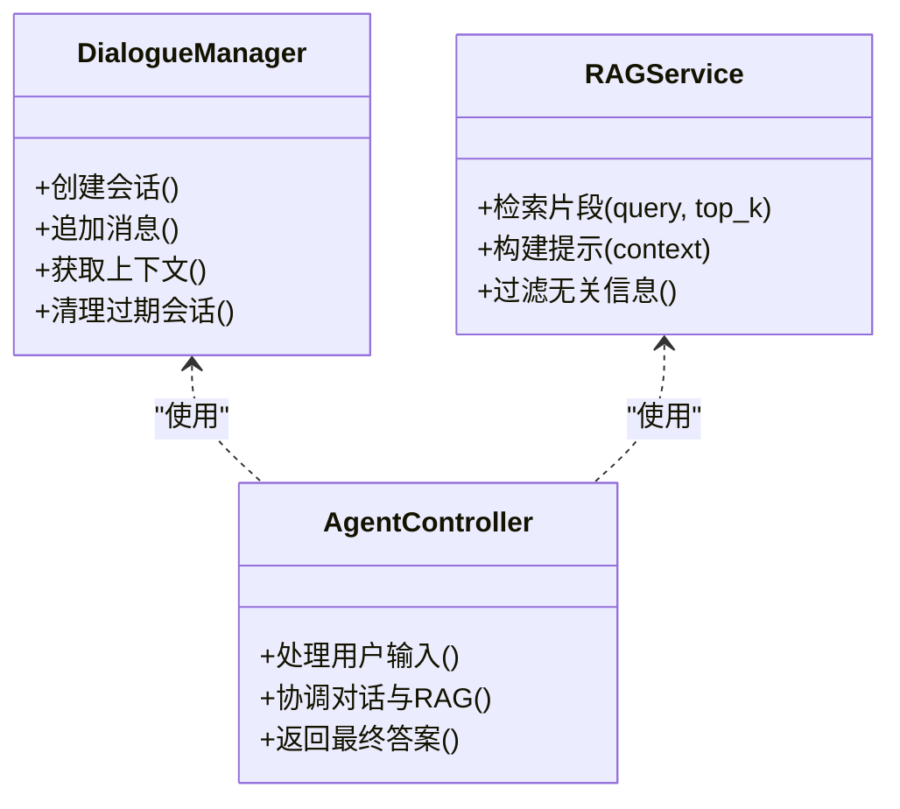
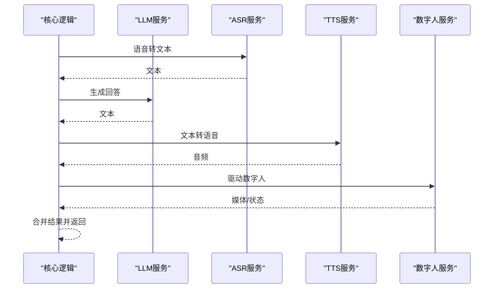
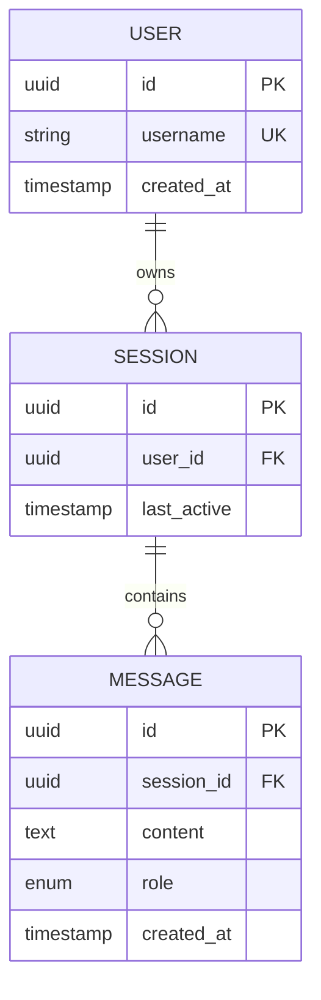
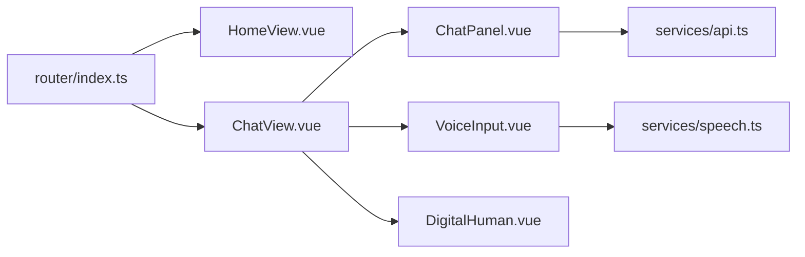
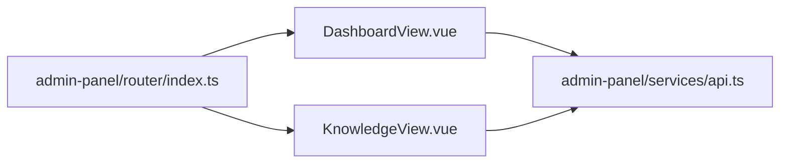
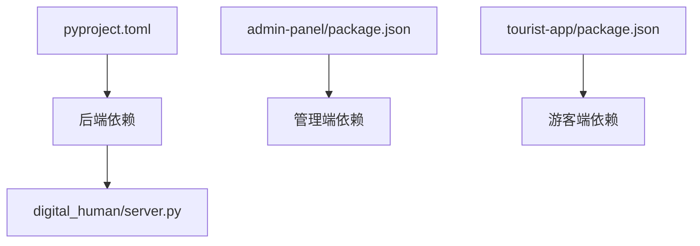

# 开发指南

<cite>
**本文引用的文件**   
- [README.md](file://README.md)
- [docker-compose.yml](file://docker-compose.yml)
- [backend/app/main.py](file://backend/app/main.py)
- [backend/app/config.py](file://backend/app/config.py)
- [backend/app/db/models.py](file://backend/app/db/models.py)
- [backend/app/db/session.py](file://backend/app/db/session.py)
- [backend/app/api/chat.py](file://backend/app/api/chat.py)
- [backend/app/core/agent.py](file://backend/app/core/agent.py)
- [backend/app/core/dialogue.py](file://backend/app/core/dialogue.py)
- [backend/app/core/rag.py](file://backend/app/core/rag.py)
- [backend/app/services/llm.py](file://backend/app/services/llm.py)
- [backend/app/services/asr.py](file://backend/app/services/asr.py)
- [backend/app/services/tts.py](file://backend/app/services/tts.py)
- [backend/app/services/digital_human.py](file://backend/app/services/digital_human.py)
- [backend/app/services/document_parser.py](file://backend/app/services/document_parser.py)
- [backend/app/services/persistence.py](file://backend/app/services/persistence.py)
- [backend/pyproject.toml](file://backend/pyproject.toml)
- [digital_human/server.py](file://digital_human/server.py)
- [frontend/admin-panel/src/router/index.ts](file://frontend/admin-panel/src/router/index.ts)
- [frontend/admin-panel/src/views/Dashboard/DashboardView.vue](file://frontend/admin-panel/src/views/Dashboard/DashboardView.vue)
- [frontend/admin-panel/src/views/KnowledgeBase/KnowledgeView.vue](file://frontend/admin-panel/src/views/KnowledgeBase/KnowledgeView.vue)
- [frontend/admin-panel/src/services/api.ts](file://frontend/admin-panel/src/services/api.ts)
- [frontend/tourist-app/src/router/index.ts](file://frontend/tourist-app/src/router/index.ts)
- [frontend/tourist-app/src/views/HomeView.vue](file://frontend/tourist-app/src/views/HomeView.vue)
- [frontend/tourist-app/src/views/ChatView.vue](file://frontend/tourist-app/src/views/ChatView.vue)
- [frontend/tourist-app/src/components/ChatPanel/ChatPanel.vue](file://frontend/tourist-app/src/components/ChatPanel/ChatPanel.vue)
- [frontend/tourist-app/src/components/VoiceInput/VoiceInput.vue](file://frontend/tourist-app/src/components/VoiceInput/VoiceInput.vue)
- [frontend/tourist-app/src/components/DigitalHuman/DigitalHuman.vue](file://frontend/tourist-app/src/components/DigitalHuman/DigitalHuman.vue)
- [frontend/tourist-app/src/services/speech.ts](file://frontend/tourist-app/src/services/speech.ts)
</cite>

## 目录
1. [简介](#简介)
2. [项目结构](#项目结构)
3. [核心组件](#核心组件)
4. [架构总览](#架构总览)
5. [详细组件分析](#详细组件分析)
6. [依赖分析](#依赖分析)
7. [性能考虑](#性能考虑)
8. [故障排查指南](#故障排查指南)
9. [结论](#结论)
10. [附录](#附录)

## 简介
本指南面向SmartTour项目的开发者，覆盖从环境搭建、代码规范、Git工作流到发布流程的全链路实践；同时提供调试技巧、性能分析方法与常见问题定位策略，并给出扩展开发与第三方服务集成的最佳实践。读者可据此快速上手并高效协作。

## 项目结构
仓库采用前后端分离与多服务编排的形态：
- backend：Python后端（FastAPI），包含API层、领域核心、数据库模型与服务层。
- digital_human：数字人独立服务，提供可视化交互能力。
- frontend：前端应用，分为游客端与管理员面板，均基于Vue生态。
- docs：设计文档与竞赛材料。
- docker-compose.yml：一键编排启动所有服务。

图表来源
- [backend/app/main.py](file://backend/app/main.py)
- [backend/app/api/chat.py](file://backend/app/api/chat.py)
- [backend/app/core/agent.py](file://backend/app/core/agent.py)
- [backend/app/services/llm.py](file://backend/app/services/llm.py)
- [digital_human/server.py](file://digital_human/server.py)
- [frontend/admin-panel/src/router/index.ts](file://frontend/admin-panel/src/router/index.ts)
- [frontend/tourist-app/src/router/index.ts](file://frontend/tourist-app/src/router/index.ts)

章节来源
- [README.md](file://README.md)
- [docker-compose.yml](file://docker-compose.yml)
- [backend/app/main.py](file://backend/app/main.py)
- [backend/app/config.py](file://backend/app/config.py)
- [backend/app/db/models.py](file://backend/app/db/models.py)
- [backend/app/db/session.py](file://backend/app/db/session.py)
- [backend/app/api/chat.py](file://backend/app/api/chat.py)
- [backend/app/core/agent.py](file://backend/app/core/agent.py)
- [backend/app/core/dialogue.py](file://backend/app/core/dialogue.py)
- [backend/app/core/rag.py](file://backend/app/core/rag.py)
- [backend/app/services/llm.py](file://backend/app/services/llm.py)
- [backend/app/services/asr.py](file://backend/app/services/asr.py)
- [backend/app/services/tts.py](file://backend/app/services/tts.py)
- [backend/app/services/digital_human.py](file://backend/app/services/digital_human.py)
- [backend/app/services/document_parser.py](file://backend/app/services/document_parser.py)
- [backend/app/services/persistence.py](file://backend/app/services/persistence.py)
- [backend/pyproject.toml](file://backend/pyproject.toml)
- [digital_human/server.py](file://digital_human/server.py)
- [frontend/admin-panel/src/router/index.ts](file://frontend/admin-panel/src/router/index.ts)
- [frontend/tourist-app/src/router/index.ts](file://frontend/tourist-app/src/router/index.ts)

## 核心组件
- API层：按功能域划分模块（聊天、知识、推荐、数字人广播等），对外暴露REST接口，负责参数校验、鉴权与响应格式化。
- 核心逻辑：对话管理、智能体调度、RAG检索增强生成、情感分析等。
- 服务层：LLM调用、ASR语音识别、TTS语音合成、数字人渲染、文档解析、持久化等。
- 数据层：SQLAlchemy模型定义与数据库会话管理。
- 前端：游客端侧重实时对话与数字人展示；管理端侧重知识库、分析与配置。

章节来源
- [backend/app/api/chat.py](file://backend/app/api/chat.py)
- [backend/app/core/agent.py](file://backend/app/core/agent.py)
- [backend/app/core/dialogue.py](file://backend/app/core/dialogue.py)
- [backend/app/core/rag.py](file://backend/app/core/rag.py)
- [backend/app/services/llm.py](file://backend/app/services/llm.py)
- [backend/app/services/asr.py](file://backend/app/services/asr.py)
- [backend/app/services/tts.py](file://backend/app/services/tts.py)
- [backend/app/services/digital_human.py](file://backend/app/services/digital_human.py)
- [backend/app/services/document_parser.py](file://backend/app/services/document_parser.py)
- [backend/app/services/persistence.py](file://backend/app/services/persistence.py)
- [backend/app/db/models.py](file://backend/app/db/models.py)
- [backend/app/db/session.py](file://backend/app/db/session.py)
- [frontend/tourist-app/src/views/ChatView.vue](file://frontend/tourist-app/src/views/ChatView.vue)
- [frontend/tourist-app/src/components/ChatPanel/ChatPanel.vue](file://frontend/tourist-app/src/components/ChatPanel/ChatPanel.vue)
- [frontend/admin-panel/src/views/KnowledgeBase/KnowledgeView.vue](file://frontend/admin-panel/src/views/KnowledgeBase/KnowledgeView.vue)

## 架构总览
系统由“前端—后端—外部服务”三层构成，通过HTTP/WebSocket进行通信。数字人服务作为独立进程运行，后端通过服务层与其交互。

图表来源
- [backend/app/main.py](file://backend/app/main.py)
- [backend/app/api/chat.py](file://backend/app/api/chat.py)
- [backend/app/core/agent.py](file://backend/app/core/agent.py)
- [backend/app/core/rag.py](file://backend/app/core/rag.py)
- [backend/app/services/llm.py](file://backend/app/services/llm.py)
- [backend/app/services/asr.py](file://backend/app/services/asr.py)
- [backend/app/services/tts.py](file://backend/app/services/tts.py)
- [backend/app/services/digital_human.py](file://backend/app/services/digital_human.py)
- [backend/app/db/session.py](file://backend/app/db/session.py)
- [digital_human/server.py](file://digital_human/server.py)

## 详细组件分析

### 后端API与核心流程
- 路由组织：按功能域拆分，便于维护与测试。
- 请求处理：参数校验→权限控制→调用核心→落库→返回。
- 错误处理：统一异常包装，区分业务错误与系统错误。

图表来源
- [backend/app/api/chat.py](file://backend/app/api/chat.py)
- [backend/app/core/agent.py](file://backend/app/core/agent.py)
- [backend/app/services/persistence.py](file://backend/app/services/persistence.py)

章节来源
- [backend/app/api/chat.py](file://backend/app/api/chat.py)
- [backend/app/core/agent.py](file://backend/app/core/agent.py)
- [backend/app/services/persistence.py](file://backend/app/services/persistence.py)

### 对话与RAG
- 对话管理：会话上下文维护、历史摘要、意图识别。
- RAG：检索相关片段→构造提示→调用大模型→结果后处理。

图表来源
- [backend/app/core/dialogue.py](file://backend/app/core/dialogue.py)
- [backend/app/core/rag.py](file://backend/app/core/rag.py)
- [backend/app/core/agent.py](file://backend/app/core/agent.py)

章节来源
- [backend/app/core/dialogue.py](file://backend/app/core/dialogue.py)
- [backend/app/core/rag.py](file://backend/app/core/rag.py)
- [backend/app/core/agent.py](file://backend/app/core/agent.py)

### 外部服务集成（LLM/ASR/TTS/数字人）
- LLM：统一抽象，支持多提供商切换与重试。
- ASR/TTS：音频流式处理与格式转换。
- 数字人：异步任务驱动，返回媒体或状态。

图表来源
- [backend/app/services/llm.py](file://backend/app/services/llm.py)
- [backend/app/services/asr.py](file://backend/app/services/asr.py)
- [backend/app/services/tts.py](file://backend/app/services/tts.py)
- [backend/app/services/digital_human.py](file://backend/app/services/digital_human.py)

章节来源
- [backend/app/services/llm.py](file://backend/app/services/llm.py)
- [backend/app/services/asr.py](file://backend/app/services/asr.py)
- [backend/app/services/tts.py](file://backend/app/services/tts.py)
- [backend/app/services/digital_human.py](file://backend/app/services/digital_human.py)

### 数据模型与会话
- 模型定义：实体关系清晰，字段约束明确。
- 会话管理：连接池、事务边界、资源释放。

图表来源
- [backend/app/db/models.py](file://backend/app/db/models.py)
- [backend/app/db/session.py](file://backend/app/db/session.py)

章节来源
- [backend/app/db/models.py](file://backend/app/db/models.py)
- [backend/app/db/session.py](file://backend/app/db/session.py)

### 前端游客端
- 路由与视图：首页、聊天页、路线规划等。
- 组件：聊天面板、语音输入、数字人展示。
- 服务：API封装与语音处理。

图表来源
- [frontend/tourist-app/src/router/index.ts](file://frontend/tourist-app/src/router/index.ts)
- [frontend/tourist-app/src/views/HomeView.vue](file://frontend/tourist-app/src/views/HomeView.vue)
- [frontend/tourist-app/src/views/ChatView.vue](file://frontend/tourist-app/src/views/ChatView.vue)
- [frontend/tourist-app/src/components/ChatPanel/ChatPanel.vue](file://frontend/tourist-app/src/components/ChatPanel/ChatPanel.vue)
- [frontend/tourist-app/src/components/VoiceInput/VoiceInput.vue](file://frontend/tourist-app/src/components/VoiceInput/VoiceInput.vue)
- [frontend/tourist-app/src/components/DigitalHuman/DigitalHuman.vue](file://frontend/tourist-app/src/components/DigitalHuman/DigitalHuman.vue)
- [frontend/tourist-app/src/services/api.ts](file://frontend/tourist-app/src/services/api.ts)
- [frontend/tourist-app/src/services/speech.ts](file://frontend/tourist-app/src/services/speech.ts)

章节来源
- [frontend/tourist-app/src/router/index.ts](file://frontend/tourist-app/src/router/index.ts)
- [frontend/tourist-app/src/views/HomeView.vue](file://frontend/tourist-app/src/views/HomeView.vue)
- [frontend/tourist-app/src/views/ChatView.vue](file://frontend/tourist-app/src/views/ChatView.vue)
- [frontend/tourist-app/src/components/ChatPanel/ChatPanel.vue](file://frontend/tourist-app/src/components/ChatPanel/ChatPanel.vue)
- [frontend/tourist-app/src/components/VoiceInput/VoiceInput.vue](file://frontend/tourist-app/src/components/VoiceInput/VoiceInput.vue)
- [frontend/tourist-app/src/components/DigitalHuman/DigitalHuman.vue](file://frontend/tourist-app/src/components/DigitalHuman/DigitalHuman.vue)
- [frontend/tourist-app/src/services/api.ts](file://frontend/tourist-app/src/services/api.ts)
- [frontend/tourist-app/src/services/speech.ts](file://frontend/tourist-app/src/services/speech.ts)

### 前端管理端
- 路由与视图：仪表盘、知识库、头像配置、数据分析。
- 服务：统一的API封装。

图表来源
- [frontend/admin-panel/src/router/index.ts](file://frontend/admin-panel/src/router/index.ts)
- [frontend/admin-panel/src/views/Dashboard/DashboardView.vue](file://frontend/admin-panel/src/views/Dashboard/DashboardView.vue)
- [frontend/admin-panel/src/views/KnowledgeBase/KnowledgeView.vue](file://frontend/admin-panel/src/views/KnowledgeBase/KnowledgeView.vue)
- [frontend/admin-panel/src/services/api.ts](file://frontend/admin-panel/src/services/api.ts)

章节来源
- [frontend/admin-panel/src/router/index.ts](file://frontend/admin-panel/src/router/index.ts)
- [frontend/admin-panel/src/views/Dashboard/DashboardView.vue](file://frontend/admin-panel/src/views/Dashboard/DashboardView.vue)
- [frontend/admin-panel/src/views/KnowledgeBase/KnowledgeView.vue](file://frontend/admin-panel/src/views/KnowledgeBase/KnowledgeView.vue)
- [frontend/admin-panel/src/services/api.ts](file://frontend/admin-panel/src/services/api.ts)

## 依赖分析
- 后端依赖：FastAPI、数据库ORM、外部AI服务SDK、音视频编解码库。
- 前端依赖：Vue生态、路由、状态管理、HTTP客户端、WebRTC/媒体API。
- 服务间依赖：后端通过HTTP/WS与数字人服务通信。

图表来源
- [backend/pyproject.toml](file://backend/pyproject.toml)
- [digital_human/server.py](file://digital_human/server.py)

章节来源
- [backend/pyproject.toml](file://backend/pyproject.toml)
- [digital_human/server.py](file://digital_human/server.py)

## 性能考虑
- 后端
  - 连接池与超时：合理设置数据库连接池大小与查询超时，避免连接耗尽。
  - 并发与限流：对热点接口增加限流与熔断，防止雪崩。
  - 缓存策略：对静态知识与高频问答结果做缓存，降低LLM调用成本。
  - 流式传输：对长文本与音频采用流式返回，提升首字节时间。
- 前端
  - 组件懒加载与路由级分包，减少首屏体积。
  - 媒体资源按需加载与压缩，避免阻塞主线程。
  - 防抖节流：对搜索与输入进行节流，降低请求频率。
- 数字人服务
  - 批处理与队列：将渲染任务入队，平滑峰值负载。
  - 资源复用：共享模型与纹理，减少重复初始化开销。

[本节为通用指导，不直接分析具体文件]

## 故障排查指南
- 日志与追踪
  - 在API入口与关键分支记录结构化日志，包含请求ID、耗时与关键参数。
  - 对跨服务调用添加链路追踪ID，便于端到端定位。
- 常见错误
  - 数据库连接失败：检查连接串、端口、账号权限与网络连通性。
  - LLM/ASR/TTS超时：检查密钥、配额、网络代理与重试策略。
  - 数字人服务不可用：确认服务进程存活、端口监听与健康检查。
- 前端问题
  - CORS与跨域：确保后端允许前端域名与方法头。
  - 媒体权限：浏览器需HTTPS且用户授权麦克风/摄像头。
- 工具建议
  - 使用容器日志聚合与集中查看。
  - 使用APM或指标采集监控QPS、延迟与错误率。

章节来源
- [backend/app/main.py](file://backend/app/main.py)
- [backend/app/services/llm.py](file://backend/app/services/llm.py)
- [backend/app/services/asr.py](file://backend/app/services/asr.py)
- [backend/app/services/tts.py](file://backend/app/services/tts.py)
- [backend/app/services/digital_human.py](file://backend/app/services/digital_human.py)
- [digital_human/server.py](file://digital_human/server.py)

## 结论
SmartTour采用分层清晰的模块化架构，前后端职责明确，外部能力通过服务层解耦。遵循本指南中的规范与流程，可有效提升交付质量与团队协作效率。

[本节为总结性内容，不直接分析具体文件]

## 附录

### 开发环境搭建
- 前置条件
  - 安装Docker与Docker Compose。
  - 准备必要的第三方服务凭据（如LLM、ASR、TTS）。
- 本地启动
  - 克隆仓库，进入根目录。
  - 使用编排文件一键拉起所有服务。
  - 访问前端地址与API文档地址进行验证。
- 环境变量
  - 在后端配置文件中统一管理敏感信息与开关项。
  - 为不同环境提供独立的配置文件或变量前缀。

章节来源
- [docker-compose.yml](file://docker-compose.yml)
- [backend/app/config.py](file://backend/app/config.py)

### 代码规范约定
- Python
  - 使用类型注解与文档字符串，保持函数单一职责。
  - 统一异常体系与错误码，避免裸抛异常。
  - 单元测试与集成测试覆盖核心路径。
- Vue/TypeScript
  - 组件命名采用PascalCase，文件与目录保持一致。
  - 路由与视图按功能域组织，服务层统一封装HTTP与WebSocket。
  - 使用ESLint与Prettier保证风格一致。
- 注释标准
  - 公共接口与复杂逻辑必须附带说明，包括参数、返回值与副作用。
  - 重要决策与权衡以注释形式沉淀。

章节来源
- [backend/app/api/chat.py](file://backend/app/api/chat.py)
- [backend/app/core/agent.py](file://backend/app/core/agent.py)
- [frontend/tourist-app/src/router/index.ts](file://frontend/tourist-app/src/router/index.ts)
- [frontend/admin-panel/src/router/index.ts](file://frontend/admin-panel/src/router/index.ts)

### Git工作流与版本管理
- 分支策略
  - main：稳定发布分支。
  - develop：集成开发分支。
  - feature/*：新功能分支。
  - hotfix/*：紧急修复分支。
- 提交规范
  - 使用语义化提交信息，描述变更动机与影响范围。
  - 小步提交，保持可回滚性。
- 版本标签
  - 使用语义化版本号，配合发布说明记录破坏性变更。

[本节为通用流程指导，不直接分析具体文件]

### 新功能开发流程
- 需求评审与技术方案设计。
- 创建feature分支，实现前后端与测试用例。
- 本地联调与自测，更新文档与示例。
- 发起MR/PR，完成代码审查与自动化测试。
- 合并至develop，待发布窗口打标签并发布。

[本节为通用流程指导，不直接分析具体文件]

### 代码审查要求
- 可读性与可维护性：命名清晰、结构合理、复杂度可控。
- 正确性与健壮性：边界条件、异常路径与并发安全。
- 安全性：输入校验、鉴权与敏感信息保护。
- 性能与可观测性：避免N+1查询、合理使用缓存与日志。

[本节为通用流程指导，不直接分析具体文件]

### 发布流程
- 预发布环境验证：回归测试、性能压测与安全扫描。
- 灰度发布：逐步放量，观察指标与告警。
- 回滚预案：保留上一版本镜像与配置快照。
- 发布后复盘：记录问题与改进措施。

[本节为通用流程指导，不直接分析具体文件]

### 调试技巧
- 后端
  - 启用调试模式与详细日志，结合请求ID追踪。
  - 使用断点与交互式调试器定位复杂逻辑。
- 前端
  - 使用浏览器开发者工具的网络与性能面板。
  - 针对媒体能力，检查权限与编码格式兼容性。
- 数字人服务
  - 健康检查与心跳上报，快速发现异常节点。

章节来源
- [backend/app/main.py](file://backend/app/main.py)
- [frontend/tourist-app/src/services/speech.ts](file://frontend/tourist-app/src/services/speech.ts)
- [digital_human/server.py](file://digital_human/server.py)

### 性能分析方法
- 指标采集：QPS、P95/P99延迟、错误率、资源利用率。
- 链路追踪：端到端耗时拆解，定位瓶颈环节。
- 压测与容量规划：模拟高峰流量，评估扩容阈值。

[本节为通用方法指导，不直接分析具体文件]

### 常见问题排查
- 无法连接数据库：核对连接串、网络策略与账号权限。
- LLM调用失败：检查密钥、配额、网络代理与重试退避。
- 语音输入无响应：确认浏览器权限、HTTPS环境与设备可用性。
- 数字人画面卡顿：检查GPU/CPU占用与渲染队列长度。

章节来源
- [backend/app/db/session.py](file://backend/app/db/session.py)
- [backend/app/services/llm.py](file://backend/app/services/llm.py)
- [frontend/tourist-app/src/services/speech.ts](file://frontend/tourist-app/src/services/speech.ts)
- [digital_human/server.py](file://digital_human/server.py)

### 扩展开发与插件机制
- 服务层抽象：为LLM、ASR、TTS等能力定义统一接口，便于替换与扩展。
- 插件注册：通过配置中心或服务发现动态加载新能力。
- 事件总线：在核心逻辑中引入事件机制，解耦新增功能。

章节来源
- [backend/app/services/llm.py](file://backend/app/services/llm.py)
- [backend/app/services/asr.py](file://backend/app/services/asr.py)
- [backend/app/services/tts.py](file://backend/app/services/tts.py)
- [backend/app/core/agent.py](file://backend/app/core/agent.py)

### 第三方服务集成最佳实践
- 配置管理：集中化管理凭据与端点，支持多环境切换。
- 容错与重试：指数退避、熔断与降级策略。
- 幂等与去重：对关键操作实现幂等键，避免重复执行。
- 审计与合规：记录必要审计日志，满足合规要求。

章节来源
- [backend/app/config.py](file://backend/app/config.py)
- [backend/app/services/llm.py](file://backend/app/services/llm.py)
- [backend/app/services/persistence.py](file://backend/app/services/persistence.py)