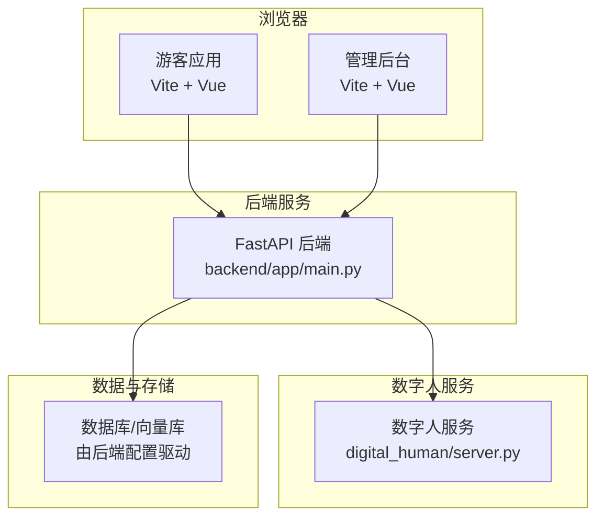
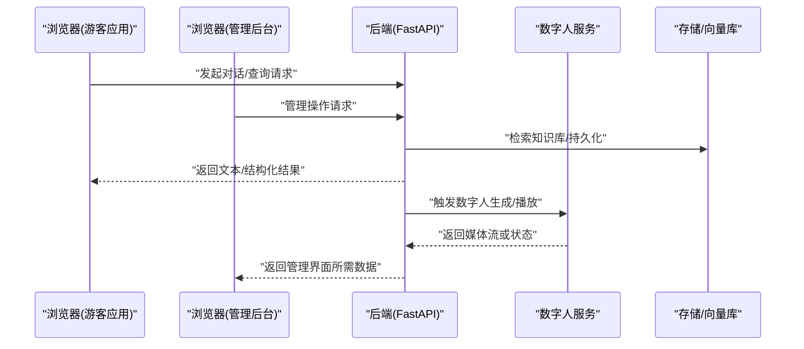
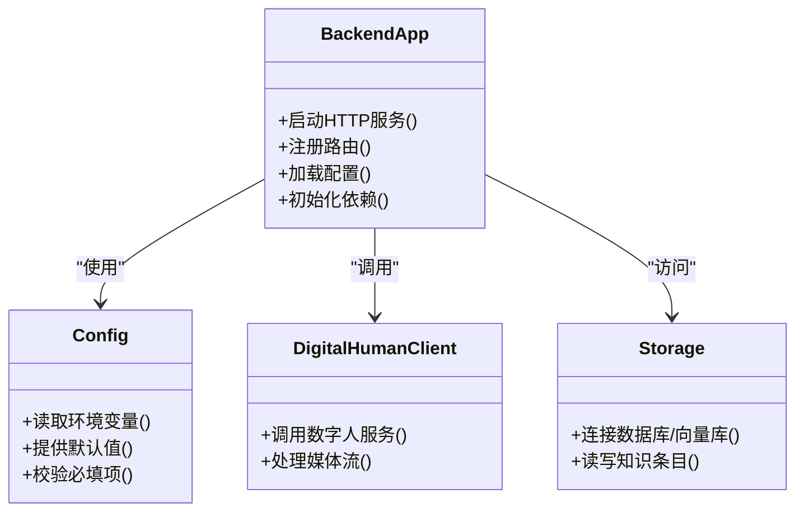
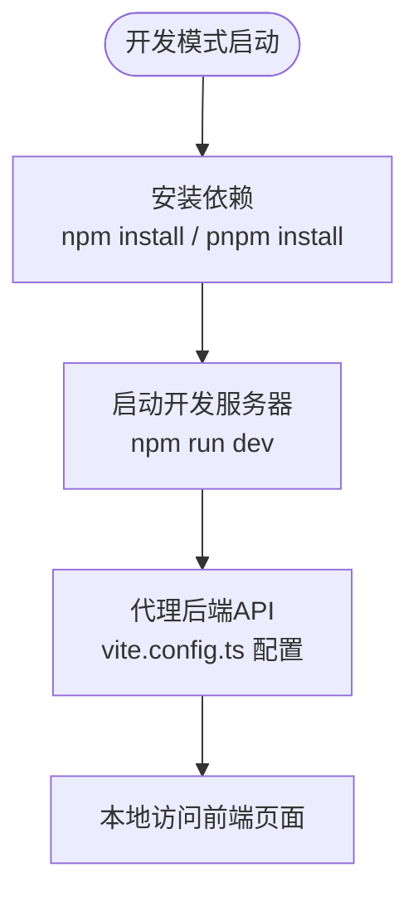
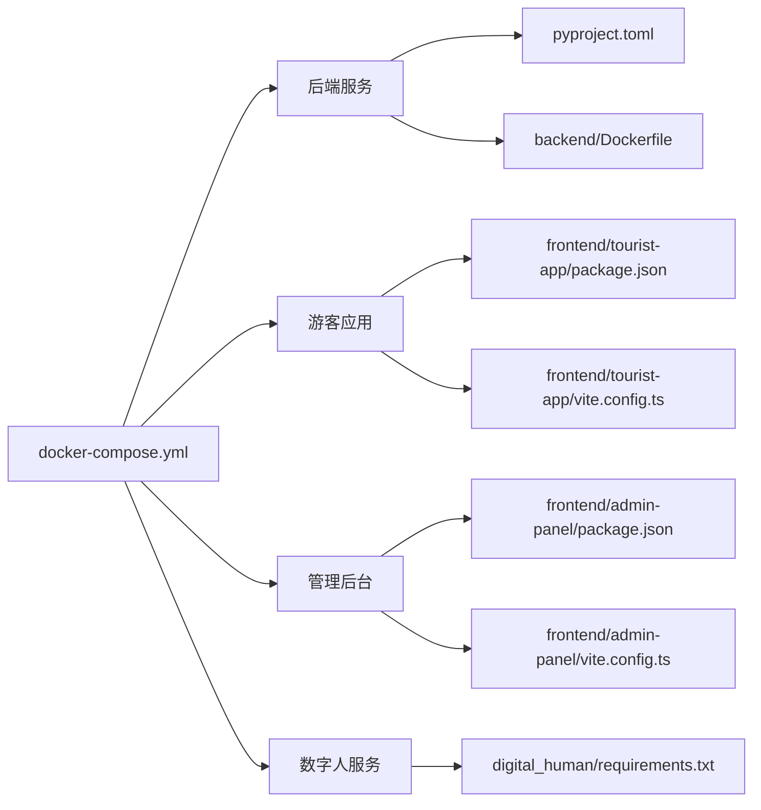

# 快速开始

<cite>
**本文引用的文件**   
- [README.md](file://README.md)
- [docker-compose.yml](file://docker-compose.yml)
- [backend/pyproject.toml](file://backend/pyproject.toml)
- [backend/Dockerfile](file://backend/Dockerfile)
- [backend/app/main.py](file://backend/app/main.py)
- [backend/app/config.py](file://backend/app/config.py)
- [frontend/admin-panel/package.json](file://frontend/admin-panel/package.json)
- [frontend/admin-panel/vite.config.ts](file://frontend/admin-panel/vite.config.ts)
- [frontend/tourist-app/package.json](file://frontend/tourist-app/package.json)
- [frontend/tourist-app/vite.config.ts](file://frontend/tourist-app/vite.config.ts)
- [digital_human/server.py](file://digital_human/server.py)
- [digital_human/requirements.txt](file://digital_human/requirements.txt)
</cite>

## 目录
1. [简介](#简介)
2. [项目结构](#项目结构)
3. [核心组件](#核心组件)
4. [架构总览](#架构总览)
5. [详细组件分析](#详细组件分析)
6. [依赖分析](#依赖分析)
7. [性能考虑](#性能考虑)
8. [故障排除指南](#故障排除指南)
9. [结论](#结论)
10. [附录](#附录)

## 简介
本指南面向首次接触 SmartTour 的新用户，帮助你在最短时间内完成环境准备、安装依赖、配置运行，并通过一键命令启动前后端与数字人服务，体验核心功能。文档同时提供常见问题的排查方法与最佳实践建议。

## 项目结构
SmartTour 采用前后端分离与多容器编排的架构：
- 后端（Python/FastAPI）：提供对话、推荐、知识库、分析等 API
- 前端（Vue/Vite）：包含游客应用与管理后台两个独立前端
- 数字人服务（Python）：独立的数字人渲染/播放服务
- 容器编排：通过 docker-compose 统一拉起各服务

图表来源
- [backend/app/main.py](file://backend/app/main.py)
- [digital_human/server.py](file://digital_human/server.py)
- [frontend/tourist-app/package.json](file://frontend/tourist-app/package.json)
- [frontend/admin-panel/package.json](file://frontend/admin-panel/package.json)

章节来源
- [README.md](file://README.md)
- [docker-compose.yml](file://docker-compose.yml)

## 核心组件
- 后端服务
  - 入口与路由挂载位于后端主模块中，负责对外暴露 REST API
  - 配置中心集中管理环境变量与默认值
  - 依赖 Python 包管理与构建脚本定义在 pyproject.toml 中
- 前端应用
  - 游客应用与管理后台均为 Vite + Vue 工程，分别维护 package.json 与 vite.config.ts
- 数字人服务
  - 独立 Python 服务，依赖 requirements.txt 声明第三方包
- 容器编排
  - docker-compose.yml 统一描述服务、端口映射、网络与依赖关系

章节来源
- [backend/app/main.py](file://backend/app/main.py)
- [backend/app/config.py](file://backend/app/config.py)
- [backend/pyproject.toml](file://backend/pyproject.toml)
- [frontend/tourist-app/package.json](file://frontend/tourist-app/package.json)
- [frontend/tourist-app/vite.config.ts](file://frontend/tourist-app/vite.config.ts)
- [frontend/admin-panel/package.json](file://frontend/admin-panel/package.json)
- [frontend/admin-panel/vite.config.ts](file://frontend/admin-panel/vite.config.ts)
- [digital_human/server.py](file://digital_human/server.py)
- [digital_human/requirements.txt](file://digital_human/requirements.txt)
- [docker-compose.yml](file://docker-compose.yml)

## 架构总览
下图展示了从浏览器到后端、再到数字人与数据存储的整体交互流程。

图表来源
- [backend/app/main.py](file://backend/app/main.py)
- [digital_human/server.py](file://digital_human/server.py)
- [docker-compose.yml](file://docker-compose.yml)

## 详细组件分析

### 后端服务（FastAPI）
- 职责
  - 提供统一的 API 网关，聚合对话、推荐、知识库、分析等功能
  - 加载配置并初始化数据库/向量库连接
  - 作为数字人服务的调用方，协调媒体流处理
- 关键文件
  - 入口与路由：[backend/app/main.py](file://backend/app/main.py)
  - 配置中心：[backend/app/config.py](file://backend/app/config.py)
  - 依赖与构建：[backend/pyproject.toml](file://backend/pyproject.toml)
  - 容器镜像：[backend/Dockerfile](file://backend/Dockerfile)

图表来源
- [backend/app/main.py](file://backend/app/main.py)
- [backend/app/config.py](file://backend/app/config.py)
- [digital_human/server.py](file://digital_human/server.py)

章节来源
- [backend/app/main.py](file://backend/app/main.py)
- [backend/app/config.py](file://backend/app/config.py)
- [backend/pyproject.toml](file://backend/pyproject.toml)
- [backend/Dockerfile](file://backend/Dockerfile)

### 前端应用（游客应用与管理后台）
- 游客应用
  - 基于 Vite + Vue，负责聊天面板、数字人展示、语音输入等
  - 配置文件：package.json、vite.config.ts
- 管理后台
  - 基于 Vite + Vue，负责数据分析、头像配置、知识库管理等
  - 配置文件：package.json、vite.config.ts

图表来源
- [frontend/tourist-app/package.json](file://frontend/tourist-app/package.json)
- [frontend/tourist-app/vite.config.ts](file://frontend/tourist-app/vite.config.ts)
- [frontend/admin-panel/package.json](file://frontend/admin-panel/package.json)
- [frontend/admin-panel/vite.config.ts](file://frontend/admin-panel/vite.config.ts)

章节来源
- [frontend/tourist-app/package.json](file://frontend/tourist-app/package.json)
- [frontend/tourist-app/vite.config.ts](file://frontend/tourist-app/vite.config.ts)
- [frontend/admin-panel/package.json](file://frontend/admin-panel/package.json)
- [frontend/admin-panel/vite.config.ts](file://frontend/admin-panel/vite.config.ts)

### 数字人服务
- 职责
  - 提供数字人渲染/播放能力，供后端调用
- 关键文件
  - 服务入口：[digital_human/server.py](file://digital_human/server.py)
  - 依赖清单：[digital_human/requirements.txt](file://digital_human/requirements.txt)

章节来源
- [digital_human/server.py](file://digital_human/server.py)
- [digital_human/requirements.txt](file://digital_human/requirements.txt)

## 依赖分析
- 容器编排
  - docker-compose.yml 定义了后端、前端、数字人等服务的组合启动方式
- 后端依赖
  - Python 版本与包管理由 pyproject.toml 指定
  - Dockerfile 用于构建后端镜像
- 前端依赖
  - 各自 package.json 声明 Node.js 生态依赖
  - vite.config.ts 控制开发服务器与代理策略
- 数字人依赖
  - requirements.txt 声明 Python 依赖

图表来源
- [docker-compose.yml](file://docker-compose.yml)
- [backend/pyproject.toml](file://backend/pyproject.toml)
- [backend/Dockerfile](file://backend/Dockerfile)
- [frontend/tourist-app/package.json](file://frontend/tourist-app/package.json)
- [frontend/tourist-app/vite.config.ts](file://frontend/tourist-app/vite.config.ts)
- [frontend/admin-panel/package.json](file://frontend/admin-panel/package.json)
- [frontend/admin-panel/vite.config.ts](file://frontend/admin-panel/vite.config.ts)
- [digital_human/requirements.txt](file://digital_human/requirements.txt)

章节来源
- [docker-compose.yml](file://docker-compose.yml)
- [backend/pyproject.toml](file://backend/pyproject.toml)
- [backend/Dockerfile](file://backend/Dockerfile)
- [frontend/tourist-app/package.json](file://frontend/tourist-app/package.json)
- [frontend/tourist-app/vite.config.ts](file://frontend/tourist-app/vite.config.ts)
- [frontend/admin-panel/package.json](file://frontend/admin-panel/package.json)
- [frontend/admin-panel/vite.config.ts](file://frontend/admin-panel/vite.config.ts)
- [digital_human/requirements.txt](file://digital_human/requirements.txt)

## 性能考虑
- 优先使用容器化部署，避免本地环境差异带来的性能波动
- 合理设置后端并发与超时参数，结合数字人服务的资源占用进行调优
- 前端开启生产构建优化，减少首屏体积与请求数
- 对知识库检索与持久化操作进行缓存与索引优化

## 故障排除指南
- 端口冲突
  - 现象：服务无法启动或访问失败
  - 排查：检查 docker-compose.yml 中的端口映射是否与其他进程冲突
- 环境变量缺失
  - 现象：后端启动报错或功能不可用
  - 排查：确认后端配置文件中要求的环境变量已正确设置
- 前端代理错误
  - 现象：浏览器控制台出现跨域或连接拒绝
  - 排查：核对 vite.config.ts 的代理目标地址与后端实际端口
- 数字人服务不可达
  - 现象：后端调用数字人失败
  - 排查：确认数字人服务已启动且网络可达，检查相关依赖是否安装完整
- 依赖安装失败
  - 现象：pip/npm/pnpm 安装报错
  - 排查：检查 Python/Node.js 版本是否与 pyproject.toml/package.json 要求一致；清理缓存后重试

章节来源
- [docker-compose.yml](file://docker-compose.yml)
- [backend/app/config.py](file://backend/app/config.py)
- [frontend/tourist-app/vite.config.ts](file://frontend/tourist-app/vite.config.ts)
- [frontend/admin-panel/vite.config.ts](file://frontend/admin-panel/vite.config.ts)
- [digital_human/requirements.txt](file://digital_human/requirements.txt)

## 结论
通过本指南，你可以快速完成 SmartTour 的环境准备、依赖安装与首次运行，并使用一键命令启动全部服务。若遇到问题，可参考故障排除部分定位与解决。建议在正式使用前完善配置文件与环境变量，以获得稳定体验。

## 附录

### 环境准备要求
- Python
  - 版本：参见后端依赖定义
  - 包管理：建议使用与 pyproject.toml 一致的构建工具
- Node.js
  - 版本：参见前端 package.json 的要求
  - 包管理器：npm 或 pnpm 均可
- Docker 与 Docker Compose
  - 用于一键编排后端、前端与数字人服务

章节来源
- [backend/pyproject.toml](file://backend/pyproject.toml)
- [frontend/tourist-app/package.json](file://frontend/tourist-app/package.json)
- [frontend/admin-panel/package.json](file://frontend/admin-panel/package.json)
- [docker-compose.yml](file://docker-compose.yml)

### 安装步骤（本地开发）
- 克隆仓库并进入项目根目录
- 安装后端依赖（可选，仅本地调试时使用）
  - 依据 backend/pyproject.toml 安装 Python 依赖
- 安装前端依赖
  - 在 frontend/tourist-app 与 frontend/admin-panel 目录下分别执行依赖安装
- 配置环境变量
  - 根据后端配置要求设置必要的环境变量
- 启动后端服务
  - 直接运行后端入口或使用容器镜像
- 启动前端开发服务器
  - 分别在游客应用与管理后台目录启动开发服务器
- 验证
  - 浏览器访问前端页面，测试对话与管理功能

章节来源
- [backend/pyproject.toml](file://backend/pyproject.toml)
- [frontend/tourist-app/package.json](file://frontend/tourist-app/package.json)
- [frontend/admin-panel/package.json](file://frontend/admin-panel/package.json)
- [backend/app/main.py](file://backend/app/main.py)
- [backend/app/config.py](file://backend/app/config.py)

### 一键启动（容器化）
- 在项目根目录执行 docker-compose 启动命令
- 等待所有服务就绪后，访问前端页面进行体验

章节来源
- [docker-compose.yml](file://docker-compose.yml)

### 首次运行配置要点
- 后端配置
  - 确保数据库/向量库连接信息正确
  - 设置必要的密钥与外部服务凭据
- 前端代理
  - 将 vite.config.ts 的代理目标指向后端实际地址
- 数字人服务
  - 确认数字人服务端口与后端调用地址一致

章节来源
- [backend/app/config.py](file://backend/app/config.py)
- [frontend/tourist-app/vite.config.ts](file://frontend/tourist-app/vite.config.ts)
- [frontend/admin-panel/vite.config.ts](file://frontend/admin-panel/vite.config.ts)
- [digital_human/server.py](file://digital_human/server.py)