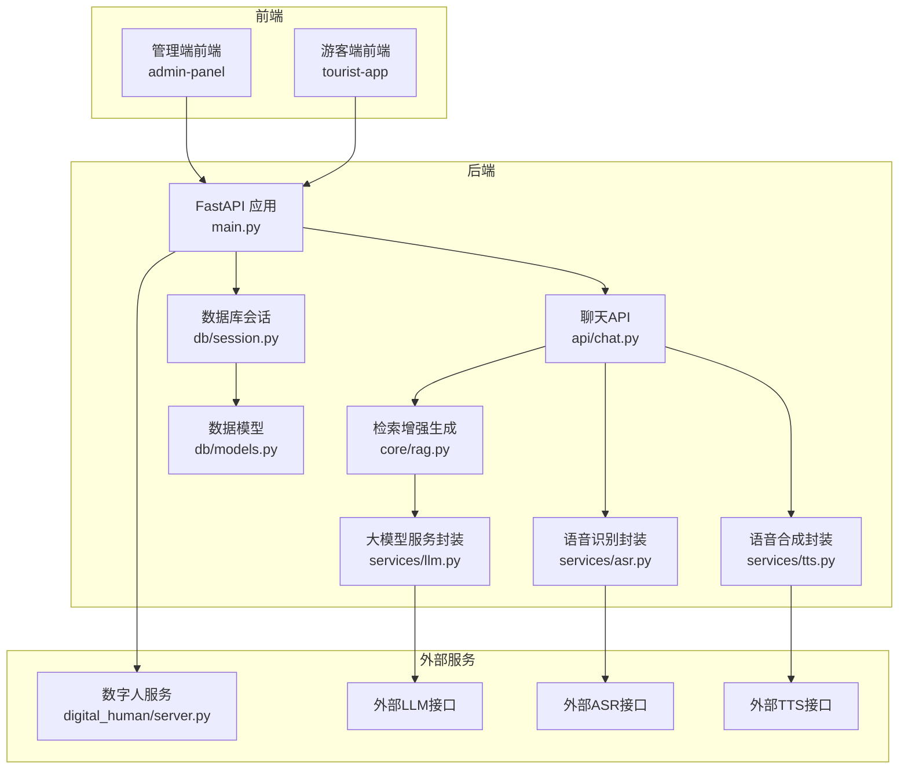
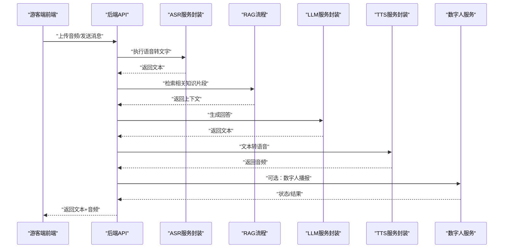
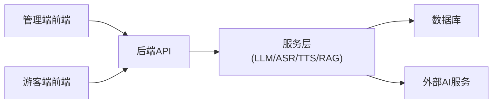

# 故障排除与FAQ

<cite>
**本文引用的文件**   
- [backend/app/main.py](file://backend/app/main.py)
- [backend/app/config.py](file://backend/app/config.py)
- [backend/app/db/session.py](file://backend/app/db/session.py)
- [backend/app/db/models.py](file://backend/app/db/models.py)
- [backend/app/services/llm.py](file://backend/app/services/llm.py)
- [backend/app/services/asr.py](file://backend/app/services/asr.py)
- [backend/app/services/tts.py](file://backend/app/services/tts.py)
- [backend/app/api/chat.py](file://backend/app/api/chat.py)
- [backend/app/core/rag.py](file://backend/app/core/rag.py)
- [backend/Dockerfile](file://backend/Dockerfile)
- [digital_human/server.py](file://digital_human/server.py)
- [frontend/admin-panel/src/services/api.ts](file://frontend/admin-panel/src/services/api.ts)
- [frontend/tourist-app/src/services/api.ts](file://frontend/tourist-app/src/services/api.ts)
- [docker-compose.yml](file://docker-compose.yml)
</cite>

## 目录
1. [简介](#简介)
2. [项目结构](#项目结构)
3. [核心组件](#核心组件)
4. [架构总览](#架构总览)
5. [详细组件分析](#详细组件分析)
6. [依赖关系分析](#依赖关系分析)
7. [性能考虑](#性能考虑)
8. [故障排除指南](#故障排除指南)
9. [结论](#结论)
10. [附录](#附录)

## 简介
本文件面向SmartTour系统的开发、部署与运维人员，聚焦于常见问题定位、错误诊断、日志分析与性能优化。内容覆盖环境配置、依赖冲突、网络连接、数据库连接、外部服务（LLM/ASR/TTS/数字人）集成、前端请求链路、容器化部署等典型问题场景，并提供监控指标解读、告警规则建议与应急响应流程。

## 项目结构
SmartTour采用前后端分离与多服务协作的架构：
- 后端：FastAPI应用，提供聊天、知识库、推荐、分析等API；通过数据库会话管理持久化数据；调用LLM、ASR、TTS等服务。
- 数字人服务：独立进程，提供数字人相关能力。
- 前端：管理端与游客端两个Web应用，分别通过API服务访问后端。
- 容器编排：使用docker-compose统一编排后端、数字人、前端静态资源等。

图表来源
- [backend/app/main.py](file://backend/app/main.py)
- [backend/app/api/chat.py](file://backend/app/api/chat.py)
- [backend/app/core/rag.py](file://backend/app/core/rag.py)
- [backend/app/services/llm.py](file://backend/app/services/llm.py)
- [backend/app/services/asr.py](file://backend/app/services/asr.py)
- [backend/app/services/tts.py](file://backend/app/services/tts.py)
- [backend/app/db/session.py](file://backend/app/db/session.py)
- [backend/app/db/models.py](file://backend/app/db/models.py)
- [digital_human/server.py](file://digital_human/server.py)

章节来源
- [backend/app/main.py](file://backend/app/main.py)
- [backend/app/config.py](file://backend/app/config.py)
- [backend/app/db/session.py](file://backend/app/db/session.py)
- [backend/app/db/models.py](file://backend/app/db/models.py)
- [backend/app/services/llm.py](file://backend/app/services/llm.py)
- [backend/app/services/asr.py](file://backend/app/services/asr.py)
- [backend/app/services/tts.py](file://backend/app/services/tts.py)
- [backend/app/api/chat.py](file://backend/app/api/chat.py)
- [backend/app/core/rag.py](file://backend/app/core/rag.py)
- [digital_human/server.py](file://digital_human/server.py)
- [frontend/admin-panel/src/services/api.ts](file://frontend/admin-panel/src/services/api.ts)
- [frontend/tourist-app/src/services/api.ts](file://frontend/tourist-app/src/services/api.ts)
- [docker-compose.yml](file://docker-compose.yml)

## 核心组件
- 应用入口与路由注册：负责挂载API路由、中间件、生命周期钩子与全局异常处理。
- 数据库会话与模型：提供连接池、事务管理与ORM模型定义。
- 业务服务层：
  - LLM封装：对外部大模型接口的调用、重试与超时控制。
  - ASR/TTS封装：音频流处理、编码格式转换与错误恢复。
  - RAG：检索增强生成流程，包含文本切分、相似度检索与上下文组装。
- 数字人服务：独立进程，提供数字人渲染或交互能力。
- 前端API客户端：统一封装HTTP请求、鉴权、重试与错误提示。

章节来源
- [backend/app/main.py](file://backend/app/main.py)
- [backend/app/db/session.py](file://backend/app/db/session.py)
- [backend/app/db/models.py](file://backend/app/db/models.py)
- [backend/app/services/llm.py](file://backend/app/services/llm.py)
- [backend/app/services/asr.py](file://backend/app/services/asr.py)
- [backend/app/services/tts.py](file://backend/app/services/tts.py)
- [backend/app/core/rag.py](file://backend/app/core/rag.py)
- [digital_human/server.py](file://digital_human/server.py)
- [frontend/admin-panel/src/services/api.ts](file://frontend/admin-panel/src/services/api.ts)
- [frontend/tourist-app/src/services/api.ts](file://frontend/tourist-app/src/services/api.ts)

## 架构总览
下图展示一次“语音对话”端到端流程：游客端发起语音输入，后端进行ASR转写，结合RAG与大模型生成回复，再经TTS合成语音返回前端；同时可选地调用数字人服务进行可视化播报。

图表来源
- [backend/app/api/chat.py](file://backend/app/api/chat.py)
- [backend/app/services/asr.py](file://backend/app/services/asr.py)
- [backend/app/core/rag.py](file://backend/app/core/rag.py)
- [backend/app/services/llm.py](file://backend/app/services/llm.py)
- [backend/app/services/tts.py](file://backend/app/services/tts.py)
- [digital_human/server.py](file://digital_human/server.py)

## 详细组件分析

### 后端主应用与配置
- 主要职责：初始化FastAPI应用、注册路由、加载配置、设置CORS/认证/限流等中间件、全局异常处理与日志。
- 常见故障点：
  - 端口占用或环境变量未正确注入导致启动失败。
  - CORS未放行前端域名导致跨域报错。
  - 全局异常未捕获导致前端收到500且无结构化错误信息。
- 排查要点：
  - 检查应用启动日志中的绑定地址与端口。
  - 验证前端请求是否被CORS拦截。
  - 确认全局异常处理器是否输出可读的错误码与消息。

章节来源
- [backend/app/main.py](file://backend/app/main.py)
- [backend/app/config.py](file://backend/app/config.py)

### 数据库会话与模型
- 主要职责：维护数据库连接池、会话生命周期、事务边界；定义ORM模型与索引。
- 常见故障点：
  - 连接池耗尽导致请求阻塞或超时。
  - 迁移缺失或字段不匹配导致查询失败。
  - 长事务或未释放会话导致内存增长。
- 排查要点：
  - 观察连接数与活跃会话数量。
  - 核对模型变更与数据库实际结构一致性。
  - 确保在异常路径中关闭会话并回滚事务。

章节来源
- [backend/app/db/session.py](file://backend/app/db/session.py)
- [backend/app/db/models.py](file://backend/app/db/models.py)

### LLM/ASR/TTS服务封装
- 主要职责：封装外部AI服务的HTTP/gRPC调用，实现重试、超时、熔断与错误映射。
- 常见故障点：
  - 外部服务不可用或限流导致大量超时与重试风暴。
  - 音频格式不支持或采样率不匹配导致ASR/TTS失败。
  - 密钥或网络策略未配置导致鉴权失败。
- 排查要点：
  - 记录每次调用的耗时、状态码与重试次数。
  - 对音频数据进行格式校验与标准化。
  - 为外部服务配置合理的超时与退避策略。

章节来源
- [backend/app/services/llm.py](file://backend/app/services/llm.py)
- [backend/app/services/asr.py](file://backend/app/services/asr.py)
- [backend/app/services/tts.py](file://backend/app/services/tts.py)

### 检索增强生成（RAG）
- 主要职责：将用户问题切分为可检索片段，从知识库中召回相关内容，拼接上下文后交由LLM生成答案。
- 常见故障点：
  - 文档解析失败或索引损坏导致召回为空。
  - 相似度阈值不当导致噪声过多或漏召回。
  - 上下文过长导致LLM响应缓慢或截断。
- 排查要点：
  - 检查知识库入库日志与索引健康度。
  - 调整相似度阈值与Top-K参数。
  - 限制上下文长度并做摘要压缩。

章节来源
- [backend/app/core/rag.py](file://backend/app/core/rag.py)

### 数字人服务
- 主要职责：提供数字人渲染或播报能力，通常以独立进程运行并通过内部网络与后端通信。
- 常见故障点：
  - 端口未暴露或防火墙阻断导致后端无法连接。
  - 资源不足导致渲染卡顿或崩溃。
- 排查要点：
  - 确认服务监听地址与端口可达。
  - 监控CPU/GPU与显存使用，必要时扩容。

章节来源
- [digital_human/server.py](file://digital_human/server.py)

### 前端API客户端
- 主要职责：封装HTTP请求、鉴权头、错误提示与重试逻辑。
- 常见故障点：
  - 基础URL配置错误导致请求404。
  - 未携带必要Header导致鉴权失败。
  - 未处理网络异常导致用户体验差。
- 排查要点：
  - 检查构建时注入的环境变量。
  - 统一错误码映射与用户提示。
  - 增加重试与降级策略。

章节来源
- [frontend/admin-panel/src/services/api.ts](file://frontend/admin-panel/src/services/api.ts)
- [frontend/tourist-app/src/services/api.ts](file://frontend/tourist-app/src/services/api.ts)

## 依赖关系分析
- 模块耦合：
  - API层依赖服务层（LLM/ASR/TTS/RAG），服务层依赖外部系统与数据库。
  - 前端仅依赖后端API，避免直接访问数据库或外部AI服务。
- 潜在循环依赖：
  - 若服务层反向导入API层会导致启动失败，应严格分层。
- 外部依赖：
  - LLM/ASR/TTS为关键外部依赖，需具备容错与降级方案。
  - 数据库连接池大小应与并发量匹配。

图表来源
- [backend/app/main.py](file://backend/app/main.py)
- [backend/app/api/chat.py](file://backend/app/api/chat.py)
- [backend/app/services/llm.py](file://backend/app/services/llm.py)
- [backend/app/services/asr.py](file://backend/app/services/asr.py)
- [backend/app/services/tts.py](file://backend/app/services/tts.py)
- [backend/app/core/rag.py](file://backend/app/core/rag.py)
- [backend/app/db/session.py](file://backend/app/db/session.py)

章节来源
- [backend/app/main.py](file://backend/app/main.py)
- [backend/app/api/chat.py](file://backend/app/api/chat.py)
- [backend/app/services/llm.py](file://backend/app/services/llm.py)
- [backend/app/services/asr.py](file://backend/app/services/asr.py)
- [backend/app/services/tts.py](file://backend/app/services/tts.py)
- [backend/app/core/rag.py](file://backend/app/core/rag.py)
- [backend/app/db/session.py](file://backend/app/db/session.py)

## 性能考虑
- 连接池与并发：
  - 合理设置数据库连接池大小，避免连接耗尽。
  - 对高并发场景启用异步I/O与缓存。
- 外部服务调用：
  - 为LLM/ASR/TTS设置超时、重试与熔断，防止雪崩。
  - 批量请求合并与流式传输可降低延迟。
- 内存与CPU：
  - 监控Python进程RSS与GC行为，避免大对象长期驻留。
  - 对音频处理与向量检索进行批量化与并行化。
- 磁盘空间：
  - 定期清理临时音频与日志文件，避免磁盘爆满。
  - 对知识库索引与缓存进行容量规划与淘汰策略。

[本节为通用指导，无需特定文件引用]

## 故障排除指南

### 环境与启动问题
- 症状：后端无法启动、端口冲突、环境变量缺失。
- 排查步骤：
  - 查看容器与应用启动日志，确认绑定地址与端口。
  - 检查docker-compose中端口映射与服务名解析。
  - 验证配置文件与环境变量是否正确注入。
- 参考位置：
  - [backend/app/main.py](file://backend/app/main.py)
  - [backend/app/config.py](file://backend/app/config.py)
  - [docker-compose.yml](file://docker-compose.yml)

章节来源
- [backend/app/main.py](file://backend/app/main.py)
- [backend/app/config.py](file://backend/app/config.py)
- [docker-compose.yml](file://docker-compose.yml)

### 依赖冲突与镜像构建
- 症状：Docker构建失败、Python包版本冲突。
- 排查步骤：
  - 检查后端Dockerfile与依赖清单，锁定版本。
  - 使用虚拟环境复现构建过程，定位冲突包。
  - 更新基础镜像与系统库版本。
- 参考位置：
  - [backend/Dockerfile](file://backend/Dockerfile)

章节来源
- [backend/Dockerfile](file://backend/Dockerfile)

### 网络连接与跨域
- 症状：前端请求被CORS拦截、DNS解析失败、代理未生效。
- 排查步骤：
  - 在后端启用并配置CORS白名单。
  - 检查前端基础URL与代理配置。
  - 使用curl或浏览器开发者工具验证网络连通性。
- 参考位置：
  - [backend/app/main.py](file://backend/app/main.py)
  - [frontend/admin-panel/src/services/api.ts](file://frontend/admin-panel/src/services/api.ts)
  - [frontend/tourist-app/src/services/api.ts](file://frontend/tourist-app/src/services/api.ts)

章节来源
- [backend/app/main.py](file://backend/app/main.py)
- [frontend/admin-panel/src/services/api.ts](file://frontend/admin-panel/src/services/api.ts)
- [frontend/tourist-app/src/services/api.ts](file://frontend/tourist-app/src/services/api.ts)

### 数据库连接与事务
- 症状：连接池耗尽、查询超时、死锁。
- 排查步骤：
  - 监控连接数与慢查询，调整池大小与超时。
  - 检查长事务与未释放会话，确保异常路径关闭连接。
  - 核对模型变更与数据库结构一致性。
- 参考位置：
  - [backend/app/db/session.py](file://backend/app/db/session.py)
  - [backend/app/db/models.py](file://backend/app/db/models.py)

章节来源
- [backend/app/db/session.py](file://backend/app/db/session.py)
- [backend/app/db/models.py](file://backend/app/db/models.py)

### 外部AI服务（LLM/ASR/TTS）
- 症状：调用超时、鉴权失败、音频格式不支持。
- 排查步骤：
  - 记录调用链路与状态码，定位失败阶段。
  - 校验音频编码与采样率，标准化输入。
  - 配置重试与退避，避免重试风暴。
- 参考位置：
  - [backend/app/services/llm.py](file://backend/app/services/llm.py)
  - [backend/app/services/asr.py](file://backend/app/services/asr.py)
  - [backend/app/services/tts.py](file://backend/app/services/tts.py)

章节来源
- [backend/app/services/llm.py](file://backend/app/services/llm.py)
- [backend/app/services/asr.py](file://backend/app/services/asr.py)
- [backend/app/services/tts.py](file://backend/app/services/tts.py)

### 数字人服务连通性
- 症状：后端无法连接数字人服务、渲染卡顿。
- 排查步骤：
  - 确认服务监听地址与端口可达。
  - 监控CPU/GPU与显存，必要时扩容。
- 参考位置：
  - [digital_human/server.py](file://digital_human/server.py)

章节来源
- [digital_human/server.py](file://digital_human/server.py)

### 前端请求与鉴权
- 症状：401/403、基础URL错误、重复提交。
- 排查步骤：
  - 检查前端API基础URL与Header注入。
  - 统一错误码映射与用户提示。
  - 增加防抖与重试策略。
- 参考位置：
  - [frontend/admin-panel/src/services/api.ts](file://frontend/admin-panel/src/services/api.ts)
  - [frontend/tourist-app/src/services/api.ts](file://frontend/tourist-app/src/services/api.ts)

章节来源
- [frontend/admin-panel/src/services/api.ts](file://frontend/admin-panel/src/services/api.ts)
- [frontend/tourist-app/src/services/api.ts](file://frontend/tourist-app/src/services/api.ts)

### 日志分析与错误追踪
- 建议：
  - 为每个关键步骤添加结构化日志（请求ID、耗时、状态码）。
  - 集中收集日志并支持按请求ID检索。
  - 对异常堆栈进行脱敏与聚合统计。
- 参考位置：
  - [backend/app/main.py](file://backend/app/main.py)
  - [backend/app/api/chat.py](file://backend/app/api/chat.py)

章节来源
- [backend/app/main.py](file://backend/app/main.py)
- [backend/app/api/chat.py](file://backend/app/api/chat.py)

### 性能瓶颈定位
- 方法：
  - 使用APM或内置指标统计各阶段耗时（ASR/RAG/LLM/TTS）。
  - 定位热点SQL与慢查询，优化索引与分页。
  - 对大对象与音频流进行批处理与流式传输。
- 参考位置：
  - [backend/app/core/rag.py](file://backend/app/core/rag.py)
  - [backend/app/services/llm.py](file://backend/app/services/llm.py)
  - [backend/app/services/asr.py](file://backend/app/services/asr.py)
  - [backend/app/services/tts.py](file://backend/app/services/tts.py)

章节来源
- [backend/app/core/rag.py](file://backend/app/core/rag.py)
- [backend/app/services/llm.py](file://backend/app/services/llm.py)
- [backend/app/services/asr.py](file://backend/app/services/asr.py)
- [backend/app/services/tts.py](file://backend/app/services/tts.py)

### 内存泄漏检测
- 方法：
  - 监控进程RSS与GC计数，发现持续增长趋势。
  - 使用内存分析工具定位大对象与未释放引用。
  - 避免在会话中缓存超大对象，及时清理临时文件。
- 参考位置：
  - [backend/app/db/session.py](file://backend/app/db/session.py)

章节来源
- [backend/app/db/session.py](file://backend/app/db/session.py)

### CPU使用率分析
- 方法：
  - 使用系统工具（如top/htop）与语言级剖析器定位热点函数。
  - 对音频编解码与向量检索进行并行化与向量化优化。
- 参考位置：
  - [backend/app/services/asr.py](file://backend/app/services/asr.py)
  - [backend/app/services/tts.py](file://backend/app/services/tts.py)
  - [backend/app/core/rag.py](file://backend/app/core/rag.py)

章节来源
- [backend/app/services/asr.py](file://backend/app/services/asr.py)
- [backend/app/services/tts.py](file://backend/app/services/tts.py)
- [backend/app/core/rag.py](file://backend/app/core/rag.py)

### 磁盘空间管理
- 方法：
  - 定期清理临时音频、日志与索引文件。
  - 设置日志轮转与保留策略。
  - 监控磁盘使用率并设置告警阈值。
- 参考位置：
  - [backend/app/services/asr.py](file://backend/app/services/asr.py)
  - [backend/app/services/tts.py](file://backend/app/services/tts.py)

章节来源
- [backend/app/services/asr.py](file://backend/app/services/asr.py)
- [backend/app/services/tts.py](file://backend/app/services/tts.py)

### 监控指标与告警
- 建议指标：
  - 请求成功率、P95/P99延迟、错误率。
  - 数据库连接池使用率与慢查询数量。
  - 外部服务调用成功率与超时率。
  - 数字人服务CPU/GPU与显存使用率。
- 告警规则：
  - 错误率超过阈值持续N分钟触发告警。
  - 连接池使用率超过80%触发扩容告警。
  - 外部服务超时率上升触发熔断与降级。
- 参考位置：
  - [backend/app/main.py](file://backend/app/main.py)
  - [backend/app/db/session.py](file://backend/app/db/session.py)
  - [digital_human/server.py](file://digital_human/server.py)

章节来源
- [backend/app/main.py](file://backend/app/main.py)
- [backend/app/db/session.py](file://backend/app/db/session.py)
- [digital_human/server.py](file://digital_human/server.py)

### 应急响应流程
- 快速止血：
  - 对不稳定外部服务启用熔断与降级。
  - 限制并发与流量，保护核心链路。
- 根因定位：
  - 基于请求ID拉取全链路日志与指标。
  - 对比最近变更与发布版本，快速回滚。
- 恢复与复盘：
  - 逐步放开限流与重试，观察稳定性。
  - 完善监控与告警，补充演练与预案。

[本节为通用流程，无需特定文件引用]

## 结论
通过对SmartTour系统的关键组件与链路进行深入分析，本文提供了从环境配置到性能优化的系统化故障排除方法。建议在上线前完善监控与告警，建立标准化的应急响应流程，并在日常运维中持续优化外部服务容错与资源利用率。

## 附录
- 常用命令与脚本：
  - 查看容器日志与状态。
  - 重启单服务与滚动升级。
  - 导出与归档日志。
- 参考配置示例：
  - 连接池大小与超时参数。
  - CORS与鉴权策略。
  - 外部服务重试与熔断策略。

[本节为通用指引，无需特定文件引用]