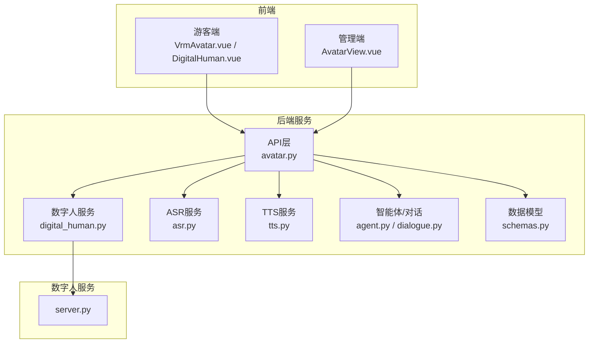
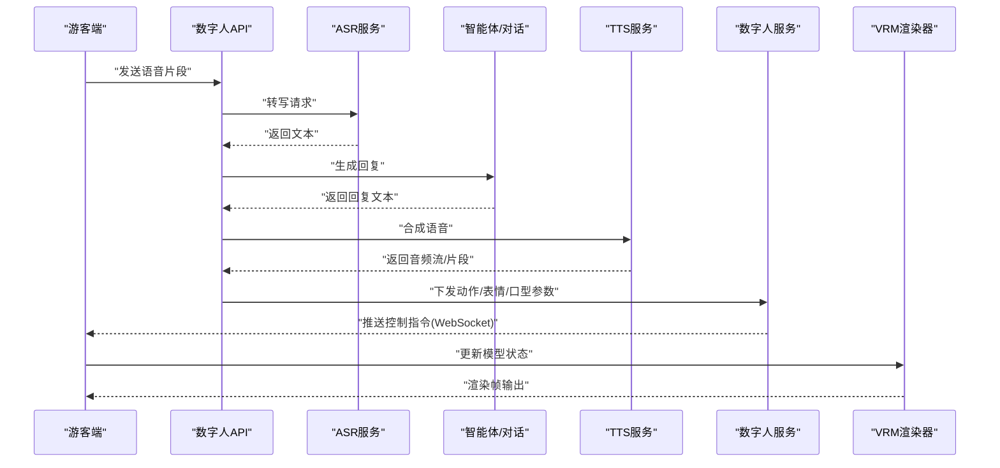
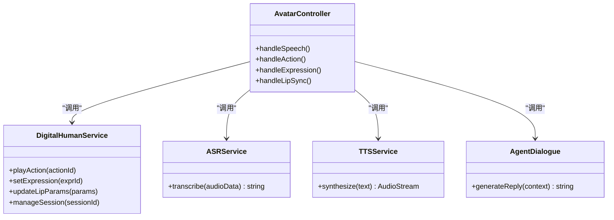
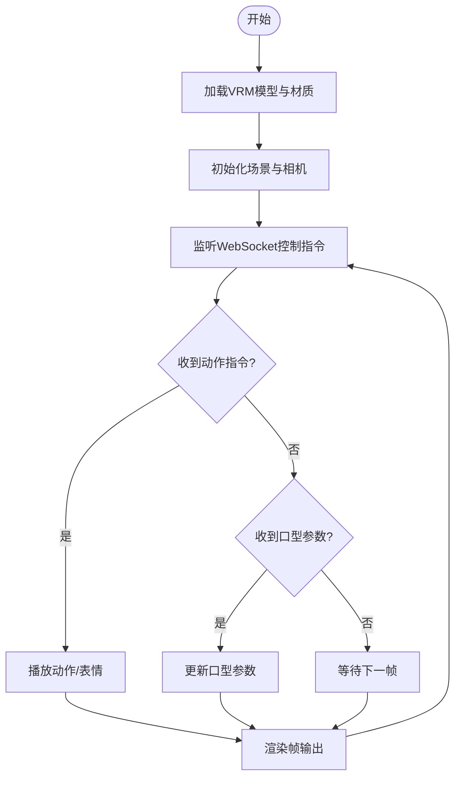
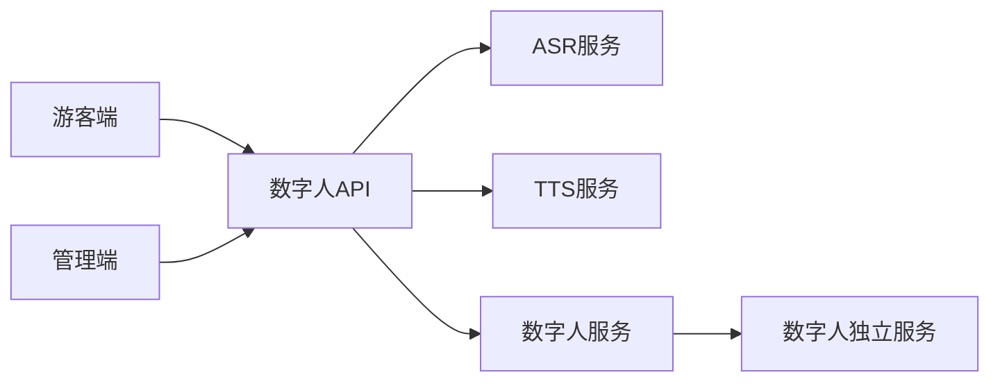

# 数字人服务

<cite>
**本文引用的文件**   
- [backend/app/api/avatar.py](file://backend/app/api/avatar.py)
- [backend/app/services/digital_human.py](file://backend/app/services/digital_human.py)
- [backend/app/services/asr.py](file://backend/app/services/asr.py)
- [backend/app/services/tts.py](file://backend/app/services/tts.py)
- [backend/app/core/agent.py](file://backend/app/core/agent.py)
- [backend/app/core/dialogue.py](file://backend/app/core/dialogue.py)
- [backend/app/models/schemas.py](file://backend/app/models/schemas.py)
- [digital_human/server.py](file://digital_human/server.py)
- [frontend/tourist-app/src/components/DigitalHuman/VrmAvatar.vue](file://frontend/tourist-app/src/components/DigitalHuman/VrmAvatar.vue)
- [frontend/tourist-app/src/components/DigitalHuman/ImageAvatar.vue](file://frontend/tourist-app/src/components/DigitalHuman/ImageAvatar.vue)
- [frontend/tourist-app/src/components/DigitalHuman/DigitalHuman.vue](file://frontend/tourist-app/src/components/DigitalHuman/DigitalHuman.vue)
- [frontend/tourist-app/src/services/api.ts](file://frontend/tourist-app/src/services/api.ts)
- [frontend/tourist-app/src/services/speech.ts](file://frontend/tourist-app/src/services/speech.ts)
- [frontend/admin-panel/src/views/AvatarConfig/AvatarView.vue](file://frontend/admin-panel/src/views/AvatarConfig/AvatarView.vue)
- [frontend/admin-panel/src/services/api.ts](file://frontend/admin-panel/src/services/api.ts)
</cite>

## 目录
1. [简介](#简介)
2. [项目结构](#项目结构)
3. [核心组件](#核心组件)
4. [架构总览](#架构总览)
5. [详细组件分析](#详细组件分析)
6. [依赖关系分析](#依赖关系分析)
7. [性能考虑](#性能考虑)
8. [故障排查指南](#故障排查指南)
9. [结论](#结论)
10. [附录](#附录)

## 简介
本技术文档围绕“数字人服务”展开，聚焦VRM数字人模型的渲染引擎集成、3D图形处理、音频同步机制与实时交互实现。文档从后端API、消息协议、状态管理到前端渲染管线进行系统化说明，并给出资源管理、内存优化与渲染调优策略，为数字人功能的开发与定制提供完整技术指导。

## 项目结构
本项目采用前后端分离与多服务协作的架构：
- 后端服务（Python）：提供数字人相关API、对话与智能体编排、语音识别（ASR）、语音合成（TTS）等能力。
- 数字人独立服务（Python）：承载数字人渲染与媒体流转发逻辑。
- 前端应用（Vue + TypeScript）：游客端负责VRM模型渲染、口型同步与交互；管理端负责数字人配置与资源管理。

图表来源
- [backend/app/api/avatar.py](file://backend/app/api/avatar.py)
- [backend/app/services/digital_human.py](file://backend/app/services/digital_human.py)
- [backend/app/services/asr.py](file://backend/app/services/asr.py)
- [backend/app/services/tts.py](file://backend/app/services/tts.py)
- [backend/app/core/agent.py](file://backend/app/core/agent.py)
- [backend/app/core/dialogue.py](file://backend/app/core/dialogue.py)
- [backend/app/models/schemas.py](file://backend/app/models/schemas.py)
- [digital_human/server.py](file://digital_human/server.py)
- [frontend/tourist-app/src/components/DigitalHuman/VrmAvatar.vue](file://frontend/tourist-app/src/components/DigitalHuman/VrmAvatar.vue)
- [frontend/tourist-app/src/components/DigitalHuman/DigitalHuman.vue](file://frontend/tourist-app/src/components/DigitalHuman/DigitalHuman.vue)
- [frontend/admin-panel/src/views/AvatarConfig/AvatarView.vue](file://frontend/admin-panel/src/views/AvatarConfig/AvatarView.vue)

章节来源
- [backend/app/api/avatar.py](file://backend/app/api/avatar.py)
- [backend/app/services/digital_human.py](file://backend/app/services/digital_human.py)
- [backend/app/services/asr.py](file://backend/app/services/asr.py)
- [backend/app/services/tts.py](file://backend/app/services/tts.py)
- [backend/app/core/agent.py](file://backend/app/core/agent.py)
- [backend/app/core/dialogue.py](file://backend/app/core/dialogue.py)
- [backend/app/models/schemas.py](file://backend/app/models/schemas.py)
- [digital_human/server.py](file://digital_human/server.py)
- [frontend/tourist-app/src/components/DigitalHuman/VrmAvatar.vue](file://frontend/tourist-app/src/components/DigitalHuman/VrmAvatar.vue)
- [frontend/tourist-app/src/components/DigitalHuman/DigitalHuman.vue](file://frontend/tourist-app/src/components/DigitalHuman/DigitalHuman.vue)
- [frontend/admin-panel/src/views/AvatarConfig/AvatarView.vue](file://frontend/admin-panel/src/views/AvatarConfig/AvatarView.vue)

## 核心组件
- 数字人API网关：统一暴露数字人相关的REST/WebSocket接口，协调ASR/TTS/Agent/数字人服务等子模块。
- 数字人服务：负责数字人实例的生命周期、动作播放、表情控制、口型驱动与媒体流转发。
- ASR服务：将用户语音转为文本，供对话系统使用。
- TTS服务：将文本转为语音，驱动数字人口型同步。
- 智能体与对话：生成回复内容、维护会话上下文与状态。
- 前端渲染器：游客端基于VRM模型进行3D渲染，接收后端指令执行动作与表情，并与TTS音频对齐实现口型同步。

章节来源
- [backend/app/api/avatar.py](file://backend/app/api/avatar.py)
- [backend/app/services/digital_human.py](file://backend/app/services/digital_human.py)
- [backend/app/services/asr.py](file://backend/app/services/asr.py)
- [backend/app/services/tts.py](file://backend/app/services/tts.py)
- [backend/app/core/agent.py](file://backend/app/core/agent.py)
- [backend/app/core/dialogue.py](file://backend/app/core/dialogue.py)
- [frontend/tourist-app/src/components/DigitalHuman/VrmAvatar.vue](file://frontend/tourist-app/src/components/DigitalHuman/VrmAvatar.vue)
- [frontend/tourist-app/src/components/DigitalHuman/DigitalHuman.vue](file://frontend/tourist-app/src/components/DigitalHuman/DigitalHuman.vue)

## 架构总览
数字人服务的端到端流程包括：
- 游客端采集语音，通过API上传至后端ASR服务转写为文本。
- 文本进入对话/智能体模块生成回复。
- 回复文本交由TTS服务合成语音。
- 数字人服务根据TTS输出驱动口型与表情，同时可触发预设动作。
- 游客端通过WebSocket或HTTP事件接收控制指令，驱动VRM模型渲染。

图表来源
- [backend/app/api/avatar.py](file://backend/app/api/avatar.py)
- [backend/app/services/asr.py](file://backend/app/services/asr.py)
- [backend/app/core/agent.py](file://backend/app/core/agent.py)
- [backend/app/core/dialogue.py](file://backend/app/core/dialogue.py)
- [backend/app/services/tts.py](file://backend/app/services/tts.py)
- [backend/app/services/digital_human.py](file://backend/app/services/digital_human.py)
- [frontend/tourist-app/src/components/DigitalHuman/VrmAvatar.vue](file://frontend/tourist-app/src/components/DigitalHuman/VrmAvatar.vue)

## 详细组件分析

### 数字人API接口与消息协议
- 职责：统一入口，路由请求到ASR/TTS/数字人服务，维护会话上下文，返回结构化响应。
- 关键能力：
  - 语音输入与转写：接收音频流或分片，调用ASR获取文本。
  - 对话生成：调用智能体/对话模块生成回复。
  - 语音合成：调用TTS生成音频，支持分段流式传输以降低延迟。
  - 数字人控制：下发动作、表情、口型参数，驱动前端渲染。
- 消息协议建议：
  - REST用于配置与批量操作（如数字人配置、动作列表）。
  - WebSocket用于实时控制与音视频流（如口型参数、动作触发、音频片段）。
  - 消息体遵循统一Schema定义，便于前后端契约稳定。

章节来源
- [backend/app/api/avatar.py](file://backend/app/api/avatar.py)
- [backend/app/models/schemas.py](file://backend/app/models/schemas.py)

### 数字人服务（后端）
- 职责：管理数字人实例、动作库、表情映射、口型驱动、媒体流转发。
- 关键能力：
  - 动作播放：按优先级与队列调度动作，避免冲突。
  - 表情控制：根据语义或情绪标签切换面部表情。
  - 口型同步：依据TTS音频特征（能量、频谱）计算口型参数，推送至前端。
  - 资源管理：缓存常用动作与表情，减少重复加载。
- 与数字人独立服务通信：
  - 通过内部RPC或HTTP/WebSocket将控制指令与媒体流转发给独立渲染服务。

图表来源
- [backend/app/api/avatar.py](file://backend/app/api/avatar.py)
- [backend/app/services/digital_human.py](file://backend/app/services/digital_human.py)
- [backend/app/services/asr.py](file://backend/app/services/asr.py)
- [backend/app/services/tts.py](file://backend/app/services/tts.py)
- [backend/app/core/agent.py](file://backend/app/core/agent.py)
- [backend/app/core/dialogue.py](file://backend/app/core/dialogue.py)

章节来源
- [backend/app/services/digital_human.py](file://backend/app/services/digital_human.py)
- [backend/app/services/asr.py](file://backend/app/services/asr.py)
- [backend/app/services/tts.py](file://backend/app/services/tts.py)
- [backend/app/core/agent.py](file://backend/app/core/agent.py)
- [backend/app/core/dialogue.py](file://backend/app/core/dialogue.py)

### 数字人独立服务（渲染与媒体转发）
- 职责：承载高负载的渲染与媒体转发任务，降低主服务压力。
- 关键能力：
  - 接收来自数字人服务的控制指令与媒体流。
  - 将渲染结果或中间数据以流式方式回传。
  - 提供健康检查与负载均衡接口。

章节来源
- [digital_human/server.py](file://digital_human/server.py)

### 前端VRM渲染与交互
- 职责：在浏览器中加载VRM模型，执行动作与表情，与TTS音频对齐实现口型同步。
- 关键能力：
  - VRM模型加载与场景初始化。
  - 动作与表情动画播放，支持混合与插值。
  - 口型同步：根据后端下发的口型参数或音频特征实时更新面部骨骼。
  - 实时交互：通过WebSocket接收控制指令，保持低延迟体验。

图表来源
- [frontend/tourist-app/src/components/DigitalHuman/VrmAvatar.vue](file://frontend/tourist-app/src/components/DigitalHuman/VrmAvatar.vue)
- [frontend/tourist-app/src/components/DigitalHuman/DigitalHuman.vue](file://frontend/tourist-app/src/components/DigitalHuman/DigitalHuman.vue)

章节来源
- [frontend/tourist-app/src/components/DigitalHuman/VrmAvatar.vue](file://frontend/tourist-app/src/components/DigitalHuman/VrmAvatar.vue)
- [frontend/tourist-app/src/components/DigitalHuman/DigitalHuman.vue](file://frontend/tourist-app/src/components/DigitalHuman/DigitalHuman.vue)

### 图像数字人（备选方案）
- 职责：在无VRM环境或低端设备上提供轻量级数字人展示。
- 关键能力：
  - 图片序列或视频帧播放。
  - 简单表情切换与基础动画。
  - 与后端控制指令对接，保证一致性体验。

章节来源
- [frontend/tourist-app/src/components/DigitalHuman/ImageAvatar.vue](file://frontend/tourist-app/src/components/DigitalHuman/ImageAvatar.vue)

### 游客端与服务通信
- 职责：封装HTTP与WebSocket调用，统一管理会话与错误重试。
- 关键能力：
  - 语音采集与上传。
  - 接收TTS音频片段与数字人控制指令。
  - 本地状态管理与UI联动。

章节来源
- [frontend/tourist-app/src/services/api.ts](file://frontend/tourist-app/src/services/api.ts)
- [frontend/tourist-app/src/services/speech.ts](file://frontend/tourist-app/src/services/speech.ts)

### 管理端数字人配置
- 职责：提供数字人资源与行为配置的可视化界面。
- 关键能力：
  - 上传与管理VRM模型与素材。
  - 配置动作、表情映射与默认行为。
  - 查看运行状态与日志。

章节来源
- [frontend/admin-panel/src/views/AvatarConfig/AvatarView.vue](file://frontend/admin-panel/src/views/AvatarConfig/AvatarView.vue)
- [frontend/admin-panel/src/services/api.ts](file://frontend/admin-panel/src/services/api.ts)

## 依赖关系分析
- 组件耦合：
  - API层对ASR/TTS/数字人服务存在直接依赖，需通过接口契约解耦。
  - 数字人服务与独立渲染服务之间通过明确的消息协议通信，避免紧耦合。
- 外部依赖：
  - 语音识别与合成服务可能为第三方或自部署模型。
  - VRM渲染依赖WebGL/Three.js等前端图形库。
- 潜在循环依赖：
  - 确保API层不反向依赖渲染服务，仅通过消息传递。

图表来源
- [backend/app/api/avatar.py](file://backend/app/api/avatar.py)
- [backend/app/services/digital_human.py](file://backend/app/services/digital_human.py)
- [backend/app/services/asr.py](file://backend/app/services/asr.py)
- [backend/app/services/tts.py](file://backend/app/services/tts.py)
- [digital_human/server.py](file://digital_human/server.py)
- [frontend/tourist-app/src/components/DigitalHuman/VrmAvatar.vue](file://frontend/tourist-app/src/components/DigitalHuman/VrmAvatar.vue)
- [frontend/admin-panel/src/views/AvatarConfig/AvatarView.vue](file://frontend/admin-panel/src/views/AvatarConfig/AvatarView.vue)

章节来源
- [backend/app/api/avatar.py](file://backend/app/api/avatar.py)
- [backend/app/services/digital_human.py](file://backend/app/services/digital_human.py)
- [backend/app/services/asr.py](file://backend/app/services/asr.py)
- [backend/app/services/tts.py](file://backend/app/services/tts.py)
- [digital_human/server.py](file://digital_human/server.py)
- [frontend/tourist-app/src/components/DigitalHuman/VrmAvatar.vue](file://frontend/tourist-app/src/components/DigitalHuman/VrmAvatar.vue)
- [frontend/admin-panel/src/views/AvatarConfig/AvatarView.vue](file://frontend/admin-panel/src/views/AvatarConfig/AvatarView.vue)

## 性能考虑
- 渲染性能：
  - 合理设置VRM模型面数与贴图分辨率，按需加载材质。
  - 使用GPU加速与批渲染，减少Draw Call。
  - 动作与表情采用动画压缩与共享骨骼，降低CPU开销。
- 音频同步：
  - 采用分段TTS与流式传输，降低首包延迟。
  - 前端根据音频能量与频谱动态调整口型参数，避免抖动。
- 网络与并发：
  - WebSocket连接复用与心跳保活。
  - 服务端对数字人实例进行池化与限流，防止过载。
- 内存优化：
  - 及时释放不再使用的纹理与动画资源。
  - 使用对象池管理频繁创建销毁的对象（如音频片段）。

[本节为通用指导，无需特定文件引用]

## 故障排查指南
- 常见问题定位：
  - 语音转写失败：检查ASR服务连通性与音频格式。
  - 口型不同步：核对TTS音频时长与控制指令时间戳对齐。
  - 动作冲突：确认动作队列优先级与状态机转换。
  - 渲染卡顿：监控GPU/CPU占用，检查模型复杂度与材质数量。
- 日志与监控：
  - 记录关键节点耗时（ASR/TTS/渲染），建立指标看板。
  - 前端上报渲染帧率与丢帧信息，辅助定位瓶颈。

章节来源
- [backend/app/services/asr.py](file://backend/app/services/asr.py)
- [backend/app/services/tts.py](file://backend/app/services/tts.py)
- [backend/app/services/digital_human.py](file://backend/app/services/digital_human.py)
- [frontend/tourist-app/src/components/DigitalHuman/VrmAvatar.vue](file://frontend/tourist-app/src/components/DigitalHuman/VrmAvatar.vue)

## 结论
数字人服务通过清晰的API分层、稳定的消息协议与前后端协同，实现了VRM模型的实时渲染、音频驱动的口型同步与丰富的交互体验。结合合理的资源管理与性能调优策略，可在复杂场景中保持流畅与稳定。后续可进一步引入更精细的情绪表达、个性化动作库与自适应渲染策略，以提升用户体验。

[本节为总结性内容，无需特定文件引用]

## 附录
- VRM模型规范要点：
  - 模型包含头部、身体、手部等骨骼，需支持表情与口型参数映射。
  - 材质与贴图应遵循Web友好格式，控制体积与加载时间。
- 资源管理最佳实践：
  - 预加载常用资源，按需懒加载大资源。
  - 版本化管理模型与素材，支持灰度发布与回滚。
- 开发定制建议：
  - 扩展动作与表情库时，保持命名与ID一致，便于前后端契约稳定。
  - 新增控制指令时，完善Schema定义与错误码，提升可观测性。

[本节为概念性内容，无需特定文件引用]