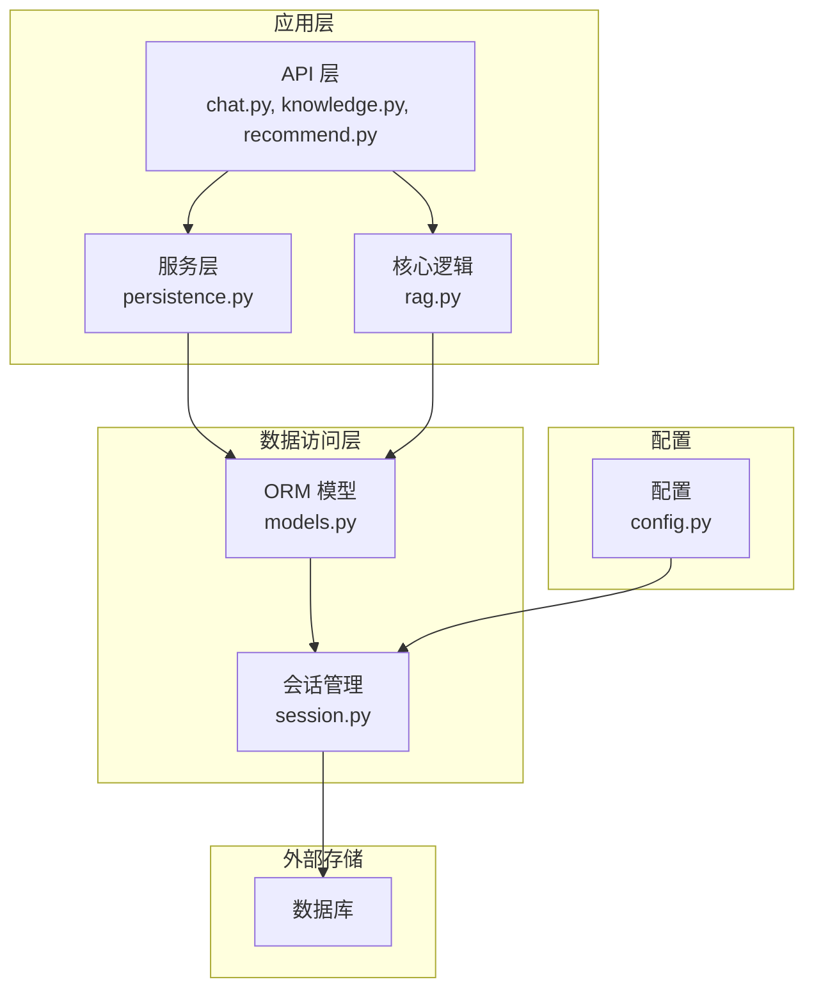
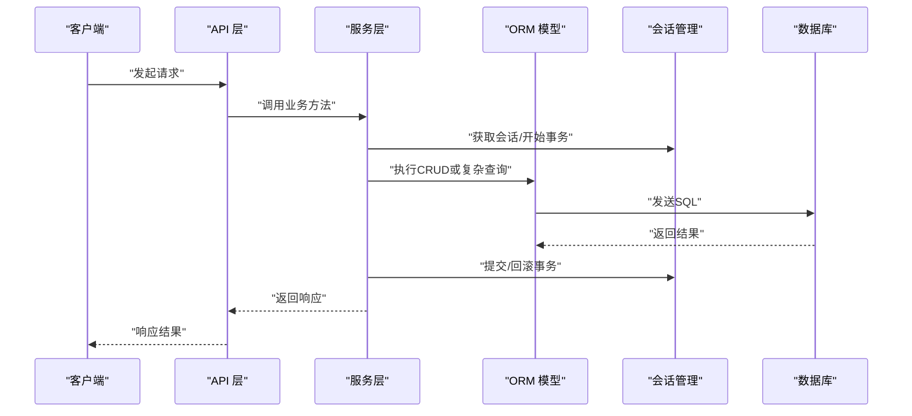
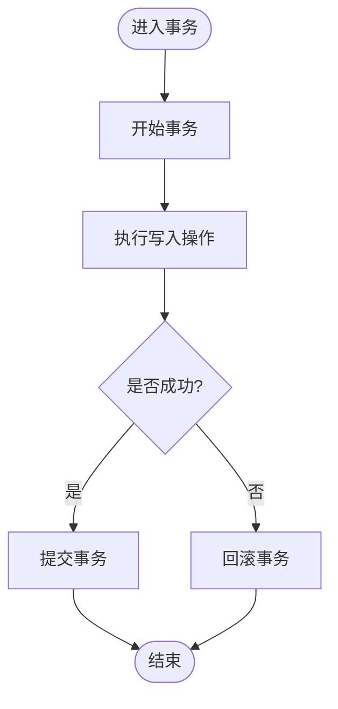
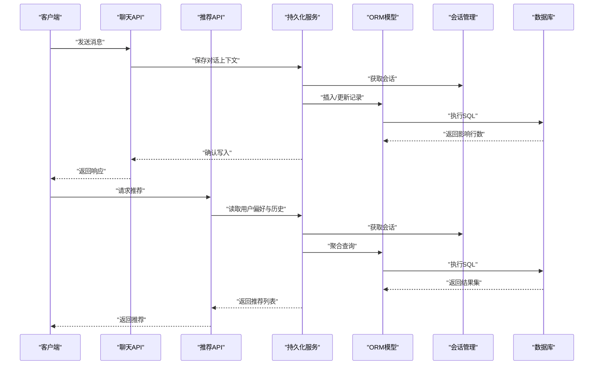
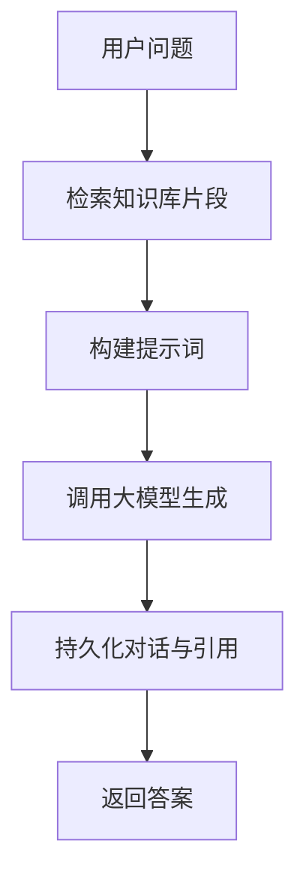
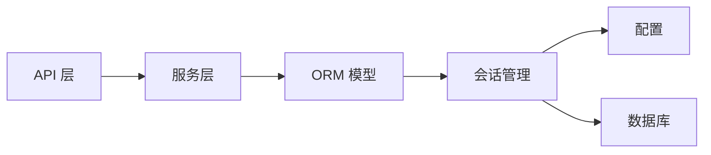

# 数据库设计

<cite>
**本文引用的文件**   
- [backend/app/db/models.py](file://backend/app/db/models.py)
- [backend/app/db/session.py](file://backend/app/db/session.py)
- [backend/app/config.py](file://backend/app/config.py)
- [backend/app/api/chat.py](file://backend/app/api/chat.py)
- [backend/app/api/knowledge.py](file://backend/app/api/knowledge.py)
- [backend/app/api/recommend.py](file://backend/app/api/recommend.py)
- [backend/app/core/rag.py](file://backend/app/core/rag.py)
- [backend/app/services/persistence.py](file://backend/app/services/persistence.py)
</cite>

## 目录
1. [简介](#简介)
2. [项目结构](#项目结构)
3. [核心组件](#核心组件)
4. [架构总览](#架构总览)
5. [详细组件分析](#详细组件分析)
6. [依赖关系分析](#依赖关系分析)
7. [性能考虑](#性能考虑)
8. [故障排查指南](#故障排查指南)
9. [结论](#结论)
10. [附录](#附录)

## 简介
本文件面向SmartTour项目的数据库设计与实现，聚焦基于SQLAlchemy的ORM模型、实体关系映射与数据表结构。文档覆盖以下方面：
- 核心数据模型（用户、对话、知识库、推荐结果等）的设计思路、字段定义与业务规则
- 索引策略、查询优化、事务处理与并发控制
- 数据迁移策略、备份恢复方案、数据完整性约束与访问权限控制
- 数据库性能监控、慢查询分析与容量规划指导

## 项目结构
后端采用分层架构：API层负责路由与请求校验，服务层封装领域逻辑，持久化层通过SQLAlchemy进行数据访问。数据库相关代码集中在db模块中，包含会话管理与模型定义；配置模块提供数据库连接参数；API与服务层按功能域组织。



图表来源
- [backend/app/api/chat.py](file://backend/app/api/chat.py)
- [backend/app/api/knowledge.py](file://backend/app/api/knowledge.py)
- [backend/app/api/recommend.py](file://backend/app/api/recommend.py)
- [backend/app/core/rag.py](file://backend/app/core/rag.py)
- [backend/app/services/persistence.py](file://backend/app/services/persistence.py)
- [backend/app/db/models.py](file://backend/app/db/models.py)
- [backend/app/db/session.py](file://backend/app/db/session.py)
- [backend/app/config.py](file://backend/app/config.py)

章节来源
- [backend/app/db/models.py](file://backend/app/db/models.py)
- [backend/app/db/session.py](file://backend/app/db/session.py)
- [backend/app/config.py](file://backend/app/config.py)
- [backend/app/api/chat.py](file://backend/app/api/chat.py)
- [backend/app/api/knowledge.py](file://backend/app/api/knowledge.py)
- [backend/app/api/recommend.py](file://backend/app/api/recommend.py)
- [backend/app/core/rag.py](file://backend/app/core/rag.py)
- [backend/app/services/persistence.py](file://backend/app/services/persistence.py)

## 核心组件
本节概述与数据库相关的核心组件及其职责：
- ORM模型定义：集中描述用户、对话、知识库、推荐结果等实体的字段、关系与约束
- 会话管理：统一创建、复用和关闭数据库会话，支持事务边界
- 配置：提供数据库URL、连接池大小、超时等关键参数
- API与服务：在业务调用中发起读写操作，遵循事务与一致性要求

章节来源
- [backend/app/db/models.py](file://backend/app/db/models.py)
- [backend/app/db/session.py](file://backend/app/db/session.py)
- [backend/app/config.py](file://backend/app/config.py)

## 架构总览
下图展示从API到数据库的整体数据流与控制流，强调事务边界与一致性保障。



图表来源
- [backend/app/api/chat.py](file://backend/app/api/chat.py)
- [backend/app/api/knowledge.py](file://backend/app/api/knowledge.py)
- [backend/app/api/recommend.py](file://backend/app/api/recommend.py)
- [backend/app/services/persistence.py](file://backend/app/services/persistence.py)
- [backend/app/db/models.py](file://backend/app/db/models.py)
- [backend/app/db/session.py](file://backend/app/db/session.py)

## 详细组件分析

### 数据模型与实体关系
- 用户：标识用户身份，支撑鉴权与会话归属
- 对话：记录用户与系统交互的历史，关联用户与消息
- 知识库：承载知识条目，用于检索增强生成（RAG）
- 推荐结果：保存针对用户的个性化推荐项，便于后续分析与回放

```mermaid
classDiagram
class User {
+主键
+用户名
+邮箱
+密码哈希
+角色
+创建时间
+更新时间
}
class Dialogue {
+主键
+用户ID(外键)
+标题
+状态
+创建时间
+更新时间
}
class KnowledgeBase {
+主键
+名称
+描述
+所有者ID(外键)
+创建时间
+更新时间
}
class Recommendation {
+主键
+用户ID(外键)
+目标类型
+目标ID
+评分
+创建时间
+更新时间
}
User ||--o{ Dialogue : "拥有"
User ||--o{ KnowledgeBase : "拥有"
User ||--o{ Recommendation : "接收"
```

图表来源
- [backend/app/db/models.py](file://backend/app/db/models.py)

章节来源
- [backend/app/db/models.py](file://backend/app/db/models.py)

### 会话管理与事务处理
- 会话生命周期：统一创建、复用与释放，避免连接泄漏
- 事务边界：在写入路径显式开启事务，成功提交，异常回滚
- 并发控制：使用连接池与隔离级别保证并发安全，必要时加锁或乐观锁



图表来源
- [backend/app/db/session.py](file://backend/app/db/session.py)

章节来源
- [backend/app/db/session.py](file://backend/app/db/session.py)

### 配置与环境
- 数据库URL：指定驱动、主机、端口、库名与认证信息
- 连接池：设置最大连接数、空闲回收与超时
- 调试模式：开发环境启用SQL日志便于诊断

章节来源
- [backend/app/config.py](file://backend/app/config.py)

### API与服务的数据访问流程
以聊天、知识库与推荐为例，说明API如何调用服务层，并通过ORM完成数据存取。



图表来源
- [backend/app/api/chat.py](file://backend/app/api/chat.py)
- [backend/app/api/recommend.py](file://backend/app/api/recommend.py)
- [backend/app/services/persistence.py](file://backend/app/services/persistence.py)
- [backend/app/db/models.py](file://backend/app/db/models.py)
- [backend/app/db/session.py](file://backend/app/db/session.py)

章节来源
- [backend/app/api/chat.py](file://backend/app/api/chat.py)
- [backend/app/api/recommend.py](file://backend/app/api/recommend.py)
- [backend/app/services/persistence.py](file://backend/app/services/persistence.py)
- [backend/app/db/models.py](file://backend/app/db/models.py)
- [backend/app/db/session.py](file://backend/app/db/session.py)

### RAG与知识库集成
RAG流程涉及从知识库检索片段并注入提示词，最终由大模型生成回答。数据库侧需确保知识条目的可检索性与版本一致性。



图表来源
- [backend/app/core/rag.py](file://backend/app/core/rag.py)
- [backend/app/api/knowledge.py](file://backend/app/api/knowledge.py)
- [backend/app/db/models.py](file://backend/app/db/models.py)

章节来源
- [backend/app/core/rag.py](file://backend/app/core/rag.py)
- [backend/app/api/knowledge.py](file://backend/app/api/knowledge.py)
- [backend/app/db/models.py](file://backend/app/db/models.py)

## 依赖关系分析
- 低耦合：API层仅依赖服务层接口，服务层依赖ORM模型与会话管理
- 高内聚：模型定义集中于db模块，便于维护与演进
- 外部依赖：数据库驱动与连接池由配置驱动，便于切换与扩展



图表来源
- [backend/app/api/chat.py](file://backend/app/api/chat.py)
- [backend/app/api/knowledge.py](file://backend/app/api/knowledge.py)
- [backend/app/api/recommend.py](file://backend/app/api/recommend.py)
- [backend/app/services/persistence.py](file://backend/app/services/persistence.py)
- [backend/app/db/models.py](file://backend/app/db/models.py)
- [backend/app/db/session.py](file://backend/app/db/session.py)
- [backend/app/config.py](file://backend/app/config.py)

章节来源
- [backend/app/api/chat.py](file://backend/app/api/chat.py)
- [backend/app/api/knowledge.py](file://backend/app/api/knowledge.py)
- [backend/app/api/recommend.py](file://backend/app/api/recommend.py)
- [backend/app/services/persistence.py](file://backend/app/services/persistence.py)
- [backend/app/db/models.py](file://backend/app/db/models.py)
- [backend/app/db/session.py](file://backend/app/db/session.py)
- [backend/app/config.py](file://backend/app/config.py)

## 性能考虑
- 索引策略
  - 高频查询字段建立B树索引（如用户ID、对话状态、知识库标签）
  - 复合索引覆盖常见过滤条件组合（如用户+时间范围）
  - 全文检索场景评估使用FTS或向量索引
- 查询优化
  - 避免N+1查询，使用预加载或批量查询
  - 分页与投影减少数据传输量
  - 统计信息定期收集，避免计划退化
- 事务与并发
  - 合理设置隔离级别，避免长事务
  - 热点行冲突时采用乐观锁或队列串行化
- 连接池与资源
  - 根据QPS与延迟目标调整最大连接数与超时
  - 监控连接等待与活跃连接占比
- 容量规划
  - 预估日增数据量与增长曲线，预留扩容空间
  - 冷热数据分离，归档历史对话与日志

[本节为通用指导，不直接分析具体文件]

## 故障排查指南
- 常见问题定位
  - 连接失败：检查数据库URL、网络连通与凭据
  - 死锁与超时：查看事务时长、锁竞争与重试策略
  - 慢查询：结合数据库慢日志与SQLAlchemy日志定位
- 建议工具与实践
  - 启用SQL日志（开发环境），生产环境使用数据库原生慢查询日志
  - 使用EXPLAIN分析执行计划，关注全表扫描与临时表
  - 对热点接口增加限流与熔断保护

章节来源
- [backend/app/db/session.py](file://backend/app/db/session.py)
- [backend/app/config.py](file://backend/app/config.py)

## 结论
SmartTour的数据库设计围绕清晰的ORM模型与稳健的会话管理展开，API与服务层解耦良好，便于扩展与维护。建议在现有基础上完善索引与监控体系，持续优化查询与事务策略，以满足高并发与大数据量的业务需求。

[本节为总结性内容，不直接分析具体文件]

## 附录

### 数据迁移策略
- 版本化管理：每个变更对应一个迁移脚本，保持向前兼容
- 幂等与回滚：迁移脚本应支持回滚，避免破坏性变更
- 灰度发布：先在小流量环境验证，再逐步推广

[本节为通用指导，不直接分析具体文件]

### 备份与恢复
- 定期全量备份与增量备份结合
- 异地容灾与多副本策略
- 定期演练恢复流程，验证RTO/RPO指标

[本节为通用指导，不直接分析具体文件]

### 数据完整性与权限控制
- 完整性约束：主键、外键、唯一约束与非空约束
- 访问控制：最小权限原则，按角色分配读写权限
- 审计追踪：关键操作记录审计日志，便于追溯

[本节为通用指导，不直接分析具体文件]

### 性能监控与慢查询分析
- 指标采集：QPS、延迟、连接池利用率、锁等待
- 慢查询分析：提取Top N慢查询，优化索引与SQL
- 容量预警：阈值告警与自动扩缩容联动

[本节为通用指导，不直接分析具体文件]