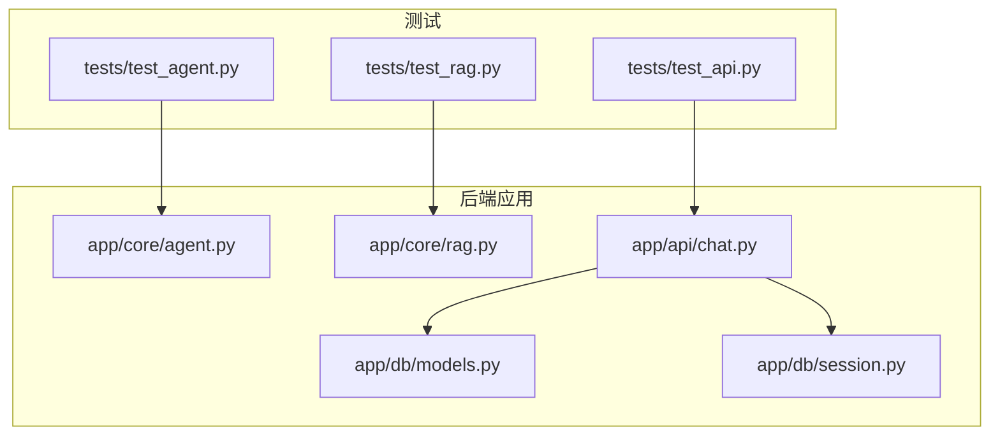
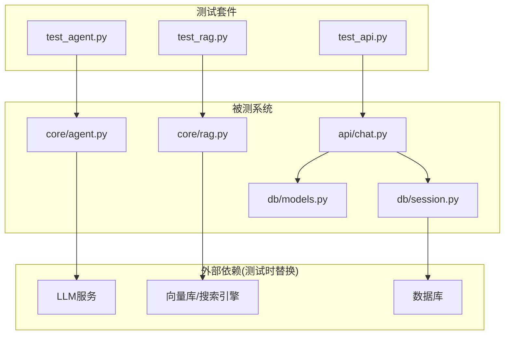
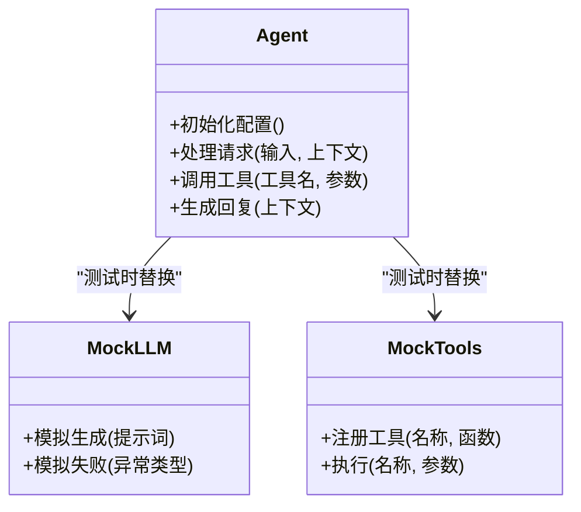
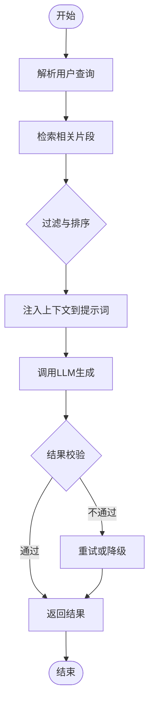
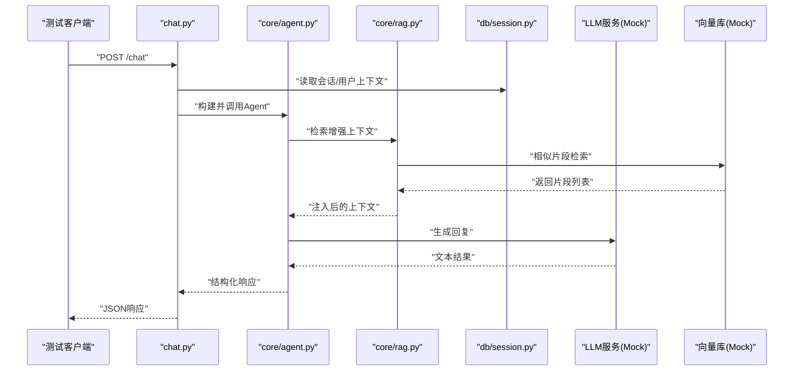
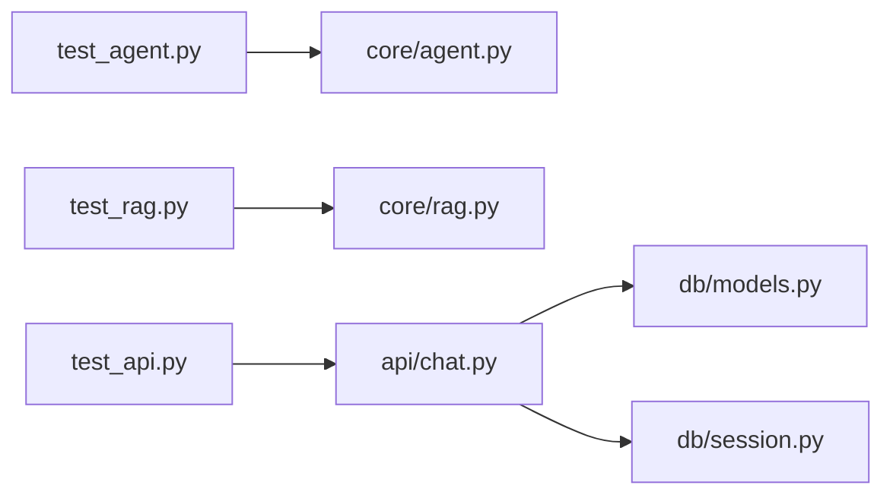

# 单元测试

<cite>
**本文引用的文件**   
- [backend/tests/test_agent.py](file://backend/tests/test_agent.py)
- [backend/tests/test_api.py](file://backend/tests/test_api.py)
- [backend/tests/test_rag.py](file://backend/tests/test_rag.py)
- [backend/app/core/agent.py](file://backend/app/core/agent.py)
- [backend/app/core/rag.py](file://backend/app/core/rag.py)
- [backend/app/api/chat.py](file://backend/app/api/chat.py)
- [backend/app/db/models.py](file://backend/app/db/models.py)
- [backend/app/db/session.py](file://backend/app/db/session.py)
- [backend/pyproject.toml](file://backend/pyproject.toml)
</cite>

## 目录
1. [简介](#简介)
2. [项目结构](#项目结构)
3. [核心组件](#核心组件)
4. [架构总览](#架构总览)
5. [详细组件分析](#详细组件分析)
6. [依赖关系分析](#依赖关系分析)
7. [性能考虑](#性能考虑)
8. [故障排查指南](#故障排查指南)
9. [结论](#结论)
10. [附录](#附录)

## 简介
本文件面向SmartTour项目的后端测试体系，聚焦pytest框架的配置与使用、测试环境搭建、配置文件设置与测试发现机制；围绕Agent智能代理、RAG检索增强生成等核心模块，给出单元测试的编写方法、Mock对象创建与使用、异步代码测试处理、数据库隔离策略；并提供测试数据构造最佳实践、断言方法与错误场景覆盖策略；最后补充覆盖率统计与性能基准测试的实施指导。

## 项目结构
后端测试位于backend/tests目录，包含对API、Agent与RAG的测试用例；被测业务逻辑位于backend/app下，包括core（Agent、RAG）、api（HTTP接口）、db（模型与会话）等模块。

图表来源
- [backend/app/core/agent.py](file://backend/app/core/agent.py)
- [backend/app/core/rag.py](file://backend/app/core/rag.py)
- [backend/app/api/chat.py](file://backend/app/api/chat.py)
- [backend/app/db/models.py](file://backend/app/db/models.py)
- [backend/app/db/session.py](file://backend/app/db/session.py)
- [backend/tests/test_agent.py](file://backend/tests/test_agent.py)
- [backend/tests/test_rag.py](file://backend/tests/test_rag.py)
- [backend/tests/test_api.py](file://backend/tests/test_api.py)

章节来源
- [backend/pyproject.toml](file://backend/pyproject.toml)
- [backend/tests/test_agent.py](file://backend/tests/test_agent.py)
- [backend/tests/test_rag.py](file://backend/tests/test_rag.py)
- [backend/tests/test_api.py](file://backend/tests/test_api.py)

## 核心组件
- Agent智能代理：负责对话编排、意图识别与工具调用等核心流程，是测试重点之一。
- RAG检索增强生成：提供文档检索与上下文注入能力，需关注检索质量、召回结果与生成一致性。
- API层：对外暴露REST接口，用于集成测试与端到端验证。
- 数据层：通过SQLAlchemy模型与会话管理进行持久化操作，测试中需确保隔离与可重复性。

章节来源
- [backend/app/core/agent.py](file://backend/app/core/agent.py)
- [backend/app/core/rag.py](file://backend/app/core/rag.py)
- [backend/app/api/chat.py](file://backend/app/api/chat.py)
- [backend/app/db/models.py](file://backend/app/db/models.py)
- [backend/app/db/session.py](file://backend/app/db/session.py)

## 架构总览
下图展示测试与被测模块之间的交互关系，以及关键外部依赖（如LLM服务、向量库、数据库）在测试中的替换策略。

图表来源
- [backend/tests/test_agent.py](file://backend/tests/test_agent.py)
- [backend/tests/test_rag.py](file://backend/tests/test_rag.py)
- [backend/tests/test_api.py](file://backend/tests/test_api.py)
- [backend/app/core/agent.py](file://backend/app/core/agent.py)
- [backend/app/core/rag.py](file://backend/app/core/rag.py)
- [backend/app/api/chat.py](file://backend/app/api/chat.py)
- [backend/app/db/models.py](file://backend/app/db/models.py)
- [backend/app/db/session.py](file://backend/app/db/session.py)

## 详细组件分析

### Agent智能代理测试
- 目标：验证Agent的输入解析、状态流转、工具调用与输出组装是否正确。
- 设计要点：
  - 使用Mock替换LLM与外部工具调用，避免网络与资源依赖。
  - 针对异常路径（超时、空响应、非法参数）构造失败场景。
  - 对Agent内部状态机或中间结果进行断言，确保可追溯性。
- 推荐断言：
  - 输入校验失败返回明确错误码/消息。
  - 工具调用次数与参数符合预期。
  - 最终输出结构与语义约束满足要求。

章节来源
- [backend/tests/test_agent.py](file://backend/tests/test_agent.py)
- [backend/app/core/agent.py](file://backend/app/core/agent.py)

#### 类图（基于源码结构）

图表来源
- [backend/app/core/agent.py](file://backend/app/core/agent.py)
- [backend/tests/test_agent.py](file://backend/tests/test_agent.py)

### RAG检索增强生成测试
- 目标：验证检索相关性、上下文注入与生成质量的一致性。
- 设计要点：
  - 使用固定种子与预置知识库片段，保证可重复性。
  - 对检索结果数量、相似度阈值与去重策略进行断言。
  - 对生成内容的关键信息点做存在性检查。
- 常见陷阱：
  - 外部向量库不稳定导致结果抖动，应使用本地或内存实现替代。
  - 时间敏感字段影响排序，需在测试中冻结时间或使用确定性排序键。

章节来源
- [backend/tests/test_rag.py](file://backend/tests/test_rag.py)
- [backend/app/core/rag.py](file://backend/app/core/rag.py)

#### 流程图（检索-生成主流程）

图表来源
- [backend/app/core/rag.py](file://backend/app/core/rag.py)
- [backend/tests/test_rag.py](file://backend/tests/test_rag.py)

### API层集成测试
- 目标：验证HTTP接口的请求/响应契约、鉴权与错误处理。
- 设计要点：
  - 使用测试客户端发送请求，断言状态码与响应体结构。
  - 对数据库操作采用事务回滚或内存数据库，确保隔离。
  - 对第三方服务（LLM、TTS、ASR）使用Mock或轻量替代。
- 典型场景：
  - 正常对话流程、知识问答、错误参数、权限不足、服务不可用。

章节来源
- [backend/tests/test_api.py](file://backend/tests/test_api.py)
- [backend/app/api/chat.py](file://backend/app/api/chat.py)
- [backend/app/db/models.py](file://backend/app/db/models.py)
- [backend/app/db/session.py](file://backend/app/db/session.py)

#### 序列图（聊天接口调用链）

图表来源
- [backend/app/api/chat.py](file://backend/app/api/chat.py)
- [backend/app/core/agent.py](file://backend/app/core/agent.py)
- [backend/app/core/rag.py](file://backend/app/core/rag.py)
- [backend/app/db/session.py](file://backend/app/db/session.py)
- [backend/tests/test_api.py](file://backend/tests/test_api.py)

### 异步代码测试处理
- 若被测函数为协程，测试中应使用异步运行器执行，并在断言前await结果。
- 对于并发任务，建议限制并发度并使用固定随机种子，保证稳定性。
- 对超时与取消信号进行显式断言，确保健壮性。

章节来源
- [backend/tests/test_agent.py](file://backend/tests/test_agent.py)
- [backend/tests/test_rag.py](file://backend/tests/test_rag.py)
- [backend/tests/test_api.py](file://backend/tests/test_api.py)

### 数据库操作的隔离测试
- 使用内存数据库或事务回滚策略，确保每个测试用例前后状态一致。
- 对模型字段约束、唯一性与外键关系进行断言。
- 对批量写入与分页查询进行边界条件测试。

章节来源
- [backend/app/db/models.py](file://backend/app/db/models.py)
- [backend/app/db/session.py](file://backend/app/db/session.py)
- [backend/tests/test_api.py](file://backend/tests/test_api.py)

## 依赖关系分析
- 测试与模块耦合：
  - test_agent.py主要依赖core/agent.py。
  - test_rag.py主要依赖core/rag.py。
  - test_api.py依赖api/chat.py及db层。
- 外部依赖替换：
  - LLM与向量库在测试中以Mock或内存实现替代，降低不确定性。
  - 数据库以内存或事务隔离方式保障可重复性。

图表来源
- [backend/tests/test_agent.py](file://backend/tests/test_agent.py)
- [backend/tests/test_rag.py](file://backend/tests/test_rag.py)
- [backend/tests/test_api.py](file://backend/tests/test_api.py)
- [backend/app/core/agent.py](file://backend/app/core/agent.py)
- [backend/app/core/rag.py](file://backend/app/core/rag.py)
- [backend/app/api/chat.py](file://backend/app/api/chat.py)
- [backend/app/db/models.py](file://backend/app/db/models.py)
- [backend/app/db/session.py](file://backend/app/db/session.py)

章节来源
- [backend/pyproject.toml](file://backend/pyproject.toml)

## 性能考虑
- 控制外部调用耗时：对LLM与向量库使用Mock或缓存，避免I/O瓶颈。
- 减少数据库往返：批量插入与查询，避免N+1问题。
- 并行测试：按模块分组并行执行，缩短整体时长。
- 基准测试：对热点路径（检索、生成）建立最小数据集，记录P95/P99延迟与吞吐。

[本节为通用指导，无需列出具体文件来源]

## 故障排查指南
- 常见问题：
  - 测试发现失败：确认pytest配置与命名规范（test_*.py）。
  - 异步测试挂起：检查是否正确使用异步运行器与超时设置。
  - 数据库污染：确认事务回滚或内存库切换生效。
  - 外部依赖不稳定：统一使用Mock或本地替代。
- 定位技巧：
  - 增加日志与断点，打印关键中间状态。
  - 缩小复现范围，逐步注释无关逻辑。
  - 使用覆盖率报告定位未覆盖分支。

章节来源
- [backend/tests/test_agent.py](file://backend/tests/test_agent.py)
- [backend/tests/test_rag.py](file://backend/tests/test_rag.py)
- [backend/tests/test_api.py](file://backend/tests/test_api.py)

## 结论
通过对Agent与RAG等核心模块的单元测试设计与实施，结合Mock、异步测试与数据库隔离策略，可有效提升SmartTour后端的稳定性与可维护性。配合覆盖率统计与性能基准，形成闭环的质量保障体系。

[本节为总结性内容，无需列出具体文件来源]

## 附录

### pytest配置与测试发现
- 配置文件位置：backend/pyproject.toml
- 测试发现规则：默认匹配tests目录下以test_开头的Python文件与以test_开头的方法。
- 常用选项：
  - 指定根目录与插件加载。
  - 设置日志级别与显示模式。
  - 启用并行执行与缓存优化。

章节来源
- [backend/pyproject.toml](file://backend/pyproject.toml)

### 测试数据构造最佳实践
- 使用工厂函数或夹具集中管理测试数据，避免硬编码。
- 对敏感信息脱敏，使用占位符与常量。
- 对时间相关字段使用固定值或冻结时间。

[本节为通用指导，无需列出具体文件来源]

### 断言方法与错误场景覆盖策略
- 断言层次：
  - 结构断言：响应体字段存在性与类型。
  - 语义断言：关键字段取值范围与业务规则。
  - 行为断言：副作用（如数据库写入、外部调用）被触发且参数正确。
- 错误场景：
  - 参数缺失/非法、权限不足、服务超时、数据不存在、重复提交。

[本节为通用指导，无需列出具体文件来源]

### 覆盖率统计与性能基准
- 覆盖率：
  - 使用覆盖率工具收集行覆盖率与分支覆盖率。
  - 设定阈值并纳入CI门禁。
- 性能基准：
  - 选择代表性用例，固定输入与随机种子。
  - 记录平均延迟、P95/P99与吞吐，对比回归。

[本节为通用指导，无需列出具体文件来源]