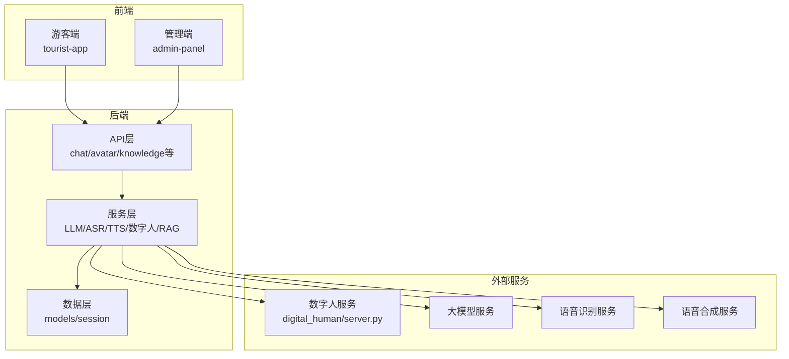
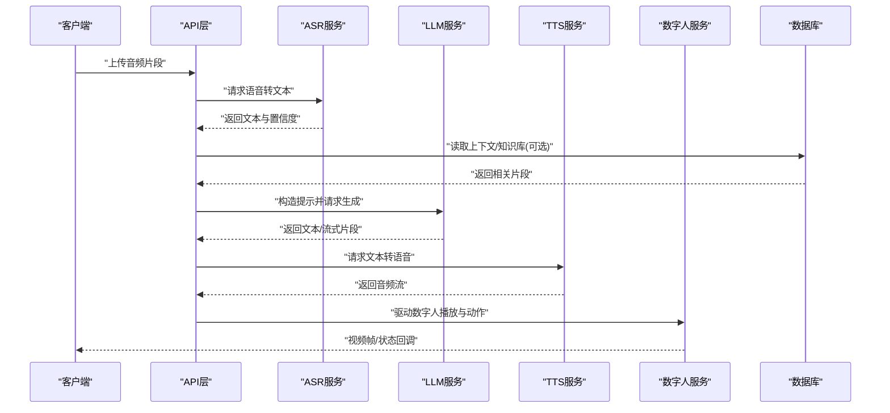
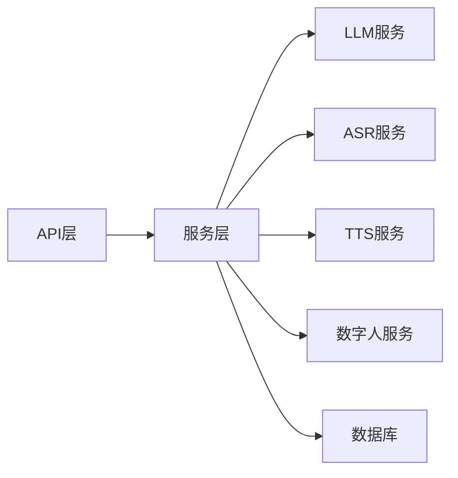
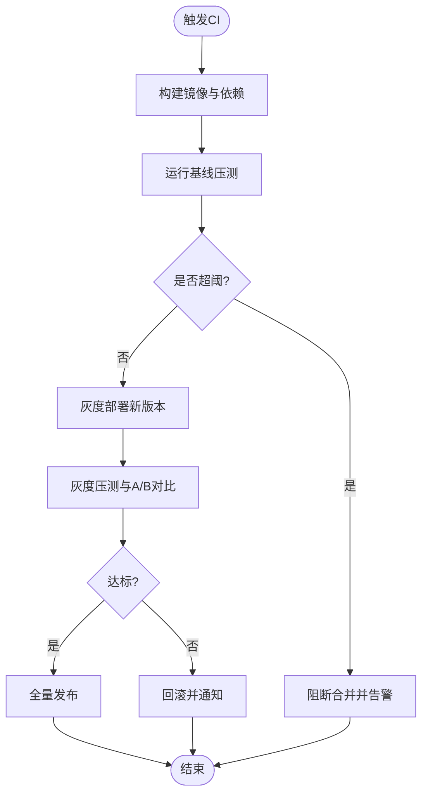

# 性能测试

<cite>
**本文引用的文件**   
- [backend/app/main.py](file://backend/app/main.py)
- [backend/app/api/chat.py](file://backend/app/api/chat.py)
- [backend/app/services/llm.py](file://backend/app/services/llm.py)
- [backend/app/services/asr.py](file://backend/app/services/asr.py)
- [backend/app/services/tts.py](file://backend/app/services/tts.py)
- [backend/app/services/digital_human.py](file://backend/app/services/digital_human.py)
- [backend/app/db/models.py](file://backend/app/db/models.py)
- [backend/app/db/session.py](file://backend/app/db/session.py)
- [backend/app/core/rag.py](file://backend/app/core/rag.py)
- [backend/app/config.py](file://backend/app/config.py)
- [digital_human/server.py](file://digital_human/server.py)
- [frontend/tourist-app/src/services/speech.ts](file://frontend/tourist-app/src/services/speech.ts)
- [docker-compose.yml](file://docker-compose.yml)
</cite>

## 目录
1. [简介](#简介)
2. [项目结构](#项目结构)
3. [核心组件](#核心组件)
4. [架构总览](#架构总览)
5. [详细组件分析](#详细组件分析)
6. [依赖分析](#依赖分析)
7. [性能考虑](#性能考虑)
8. [故障排查指南](#故障排查指南)
9. [结论](#结论)
10. [附录](#附录)

## 简介
本文件面向SmartTour项目的性能测试与基准评估，覆盖以下关键目标：
- AI服务性能基准：LLM响应时间、ASR识别准确率、TTS合成质量
- 高并发压力测试：数字人渲染性能优化与内存监控
- 数据库查询性能分析、缓存命中率优化、API响应时间监控
- 负载测试工具选择与配置、瓶颈识别方法、容量规划指导
- A/B测试框架搭建、灰度发布验证、性能回归检测自动化流程

## 项目结构
后端采用分层架构：API层暴露REST接口，服务层封装AI能力（LLM/ASR/TTS/数字人），数据层通过ORM访问数据库；前端提供游客端与管理端。数字人服务独立部署并通过HTTP交互。

图表来源
- [backend/app/main.py](file://backend/app/main.py)
- [backend/app/api/chat.py](file://backend/app/api/chat.py)
- [backend/app/services/llm.py](file://backend/app/services/llm.py)
- [backend/app/services/asr.py](file://backend/app/services/asr.py)
- [backend/app/services/tts.py](file://backend/app/services/tts.py)
- [backend/app/services/digital_human.py](file://backend/app/services/digital_human.py)
- [backend/app/db/models.py](file://backend/app/db/models.py)
- [backend/app/db/session.py](file://backend/app/db/session.py)
- [digital_human/server.py](file://digital_human/server.py)

章节来源
- [backend/app/main.py](file://backend/app/main.py)
- [backend/app/api/chat.py](file://backend/app/api/chat.py)
- [backend/app/services/llm.py](file://backend/app/services/llm.py)
- [backend/app/services/asr.py](file://backend/app/services/asr.py)
- [backend/app/services/tts.py](file://backend/app/services/tts.py)
- [backend/app/services/digital_human.py](file://backend/app/services/digital_human.py)
- [backend/app/db/models.py](file://backend/app/db/models.py)
- [backend/app/db/session.py](file://backend/app/db/session.py)
- [digital_human/server.py](file://digital_human/server.py)

## 核心组件
- API层：统一入口，承载聊天、数字人、知识检索等接口，负责参数校验、路由分发与结果序列化。
- 服务层：
  - LLM：调用大模型生成文本，支持流式与非流式返回。
  - ASR：音频转文本，输出转录结果与置信度。
  - TTS：文本转语音，输出音频流或文件。
  - 数字人：驱动形象渲染与动作同步。
  - RAG：检索增强生成，结合知识库提升回答质量。
- 数据层：基于ORM的会话管理与模型定义，支撑持久化与查询。
- 外部服务：数字人服务独立进程，通过HTTP与后端交互。

章节来源
- [backend/app/api/chat.py](file://backend/app/api/chat.py)
- [backend/app/services/llm.py](file://backend/app/services/llm.py)
- [backend/app/services/asr.py](file://backend/app/services/asr.py)
- [backend/app/services/tts.py](file://backend/app/services/tts.py)
- [backend/app/services/digital_human.py](file://backend/app/services/digital_human.py)
- [backend/app/core/rag.py](file://backend/app/core/rag.py)
- [backend/app/db/models.py](file://backend/app/db/models.py)
- [backend/app/db/session.py](file://backend/app/db/session.py)

## 架构总览
下图展示一次典型“语音对话”端到端流程，涵盖ASR→LLM→TTS→数字人渲染的关键路径，便于定位性能瓶颈与埋点位置。

图表来源
- [backend/app/api/chat.py](file://backend/app/api/chat.py)
- [backend/app/services/asr.py](file://backend/app/services/asr.py)
- [backend/app/services/llm.py](file://backend/app/services/llm.py)
- [backend/app/services/tts.py](file://backend/app/services/tts.py)
- [backend/app/services/digital_human.py](file://backend/app/services/digital_human.py)
- [backend/app/db/models.py](file://backend/app/db/models.py)
- [backend/app/db/session.py](file://backend/app/db/session.py)

## 详细组件分析

### LLM响应时间基准测试
- 指标定义
  - 首字节延迟（TTFT）：从请求到首个响应字节的时间
  - 完整响应延迟：端到端完成时间
  - 吞吐：每秒请求数（RPS）与每秒Token数
- 测试设计
  - 单测场景：固定Prompt长度分布，统计P50/P95/P99延迟
  - 压测场景：阶梯式增加并发，观察延迟与错误率拐点
  - 流式模式：按分片统计TTFT与整体时延
- 实施要点
  - 在API与服务层埋点记录耗时与错误码
  - 使用异步调用避免阻塞，合理设置超时与重试
  - 对长上下文进行采样与裁剪，控制输入规模
- 参考实现位置
  - [backend/app/api/chat.py](file://backend/app/api/chat.py)
  - [backend/app/services/llm.py](file://backend/app/services/llm.py)

章节来源
- [backend/app/api/chat.py](file://backend/app/api/chat.py)
- [backend/app/services/llm.py](file://backend/app/services/llm.py)

### ASR识别准确率评估
- 指标定义
  - 字错率（CER）、句错率（SER）、置信度阈值下的召回/精确率
- 测试设计
  - 构建多口音、多噪声语料集，标注黄金答案
  - 对比不同采样率、编码格式与VAD策略的效果
  - 离线批量评测与在线A/B对比
- 实施要点
  - 统一音频预处理流水线，确保公平比较
  - 记录每段音频的时长、信噪比与识别耗时
- 参考实现位置
  - [backend/app/services/asr.py](file://backend/app/services/asr.py)

章节来源
- [backend/app/services/asr.py](file://backend/app/services/asr.py)

### TTS合成质量评估
- 指标定义
  - 自然度（MOS主观评分）、相似度（Speaker Similarity）、端到端延迟、CPU/GPU占用
- 测试设计
  - 固定文本集，对比不同音色、语速与后处理效果
  - 流式合成下测量首包延迟与抖动
- 实施要点
  - 音频格式标准化，避免重采样引入失真
  - 服务端缓存热门模板音，降低冷启动开销
- 参考实现位置
  - [backend/app/services/tts.py](file://backend/app/services/tts.py)

章节来源
- [backend/app/services/tts.py](file://backend/app/services/tts.py)

### 数字人渲染性能优化与内存监控
- 关注点
  - 帧率（FPS）、首帧时间、渲染管线GPU/CPU占用、显存峰值
  - 网络传输带宽与丢包对卡顿的影响
- 优化建议
  - 按需加载模型与纹理，减少首屏体积
  - 帧率自适应与降级策略（简化动画、降低分辨率）
  - 资源池复用与对象回收，避免GC抖动
- 监控手段
  - 采集渲染引擎指标与系统资源使用
  - 前端侧统计卡顿与掉帧事件
- 参考实现位置
  - [backend/app/services/digital_human.py](file://backend/app/services/digital_human.py)
  - [digital_human/server.py](file://digital_human/server.py)
  - [frontend/tourist-app/src/services/speech.ts](file://frontend/tourist-app/src/services/speech.ts)

章节来源
- [backend/app/services/digital_human.py](file://backend/app/services/digital_human.py)
- [digital_human/server.py](file://digital_human/server.py)
- [frontend/tourist-app/src/services/speech.ts](file://frontend/tourist-app/src/services/speech.ts)

### 数据库查询性能分析与缓存优化
- 分析方法
  - 慢查询日志与执行计划分析，识别N+1与全表扫描
  - 索引命中与覆盖索引优化
  - 连接池大小与事务粒度调优
- 缓存策略
  - 热点问答与知识片段多级缓存（本地+分布式）
  - 缓存键设计与失效策略（TTL/版本号）
  - 缓存命中率与回源率监控
- 参考实现位置
  - [backend/app/db/models.py](file://backend/app/db/models.py)
  - [backend/app/db/session.py](file://backend/app/db/session.py)
  - [backend/app/core/rag.py](file://backend/app/core/rag.py)

章节来源
- [backend/app/db/models.py](file://backend/app/db/models.py)
- [backend/app/db/session.py](file://backend/app/db/session.py)
- [backend/app/core/rag.py](file://backend/app/core/rag.py)

### API响应时间监控与可观测性
- 监控维度
  - 接口级P50/P95/P99延迟、错误率、QPS
  - 下游依赖（LLM/ASR/TTS/DB/DH）延迟与失败率
- 实现建议
  - 中间件统一打点，关联TraceID贯穿链路
  - 结构化日志与指标上报，告警阈值分级
- 参考实现位置
  - [backend/app/main.py](file://backend/app/main.py)
  - [backend/app/api/chat.py](file://backend/app/api/chat.py)

章节来源
- [backend/app/main.py](file://backend/app/main.py)
- [backend/app/api/chat.py](file://backend/app/api/chat.py)

## 依赖分析
- 组件耦合
  - API层强依赖服务层；服务层依赖外部AI服务与数据库
  - 数字人服务为独立进程，通过HTTP解耦
- 外部依赖
  - LLM/ASR/TTS为外部服务，需考虑限流、熔断与降级
- 潜在风险
  - 外部服务抖动导致级联失败
  - 数据库连接池不足引发排队
- 缓解措施
  - 超时与重试退避、舱壁隔离、熔断器
  - 连接池与队列容量上限保护

图表来源
- [backend/app/api/chat.py](file://backend/app/api/chat.py)
- [backend/app/services/llm.py](file://backend/app/services/llm.py)
- [backend/app/services/asr.py](file://backend/app/services/asr.py)
- [backend/app/services/tts.py](file://backend/app/services/tts.py)
- [backend/app/services/digital_human.py](file://backend/app/services/digital_human.py)
- [backend/app/db/models.py](file://backend/app/db/models.py)
- [backend/app/db/session.py](file://backend/app/db/session.py)

章节来源
- [backend/app/api/chat.py](file://backend/app/api/chat.py)
- [backend/app/services/llm.py](file://backend/app/services/llm.py)
- [backend/app/services/asr.py](file://backend/app/services/asr.py)
- [backend/app/services/tts.py](file://backend/app/services/tts.py)
- [backend/app/services/digital_human.py](file://backend/app/services/digital_human.py)
- [backend/app/db/models.py](file://backend/app/db/models.py)
- [backend/app/db/session.py](file://backend/app/db/session.py)

## 性能考虑
- 并发与吞吐
  - 根据CPU/IO特征选择线程/协程模型，合理设置工作进程数
  - 对长耗时任务采用异步与背压控制
- 资源与容量
  - 连接池、队列与缓存容量按峰值QPS与尾延迟目标计算
  - 数字人渲染节点按GPU显存与帧率目标规划实例数
- 稳定性
  - 限流、熔断、重试与优雅降级
  - 健康检查与自动扩缩容
- 成本与效率
  - 模型量化与批处理
  - 冷热数据分层与预取

[本节为通用指导，不直接分析具体文件]

## 故障排查指南
- 常见问题
  - 外部服务超时：检查超时配置与重试策略
  - 数据库慢查询：查看执行计划与索引命中
  - 数字人卡顿：检查帧率、带宽与解码性能
- 定位步骤
  - 通过TraceID串联日志与指标
  - 分层采集各组件延迟与错误码
  - 复现最小用例并逐步放大负载
- 参考实现位置
  - [backend/app/config.py](file://backend/app/config.py)
  - [backend/app/main.py](file://backend/app/main.py)
  - [backend/app/api/chat.py](file://backend/app/api/chat.py)

章节来源
- [backend/app/config.py](file://backend/app/config.py)
- [backend/app/main.py](file://backend/app/main.py)
- [backend/app/api/chat.py](file://backend/app/api/chat.py)

## 结论
通过建立端到端的性能基线与持续压测体系，可在AI服务、数字人渲染与数据库层面提前发现瓶颈并制定优化方案。配合A/B与灰度机制，可将性能回归风险降至最低，保障上线质量与用户体验。

[本节为总结性内容，不直接分析具体文件]

## 附录

### 负载测试工具选择与配置建议
- 工具选型
  - HTTP/WS压测：Locust、k6、JMeter
  - 流媒体/音视频：FFmpeg+自定义脚本、GStreamer管道
  - 指标采集：Prometheus+Grafana、APM（如OpenTelemetry）
- 环境编排
  - 使用容器编排快速拉起被测系统与压测节点
  - 将外部AI服务替换为Mock以稳定基线
- 参考编排
  - [docker-compose.yml](file://docker-compose.yml)

章节来源
- [docker-compose.yml](file://docker-compose.yml)

### A/B测试与灰度发布验证
- 流量切分
  - 基于用户ID/会话ID哈希分流至新旧版本
  - 渐进放量：1%→5%→20%→100%
- 指标对比
  - 核心KPI：延迟分位、错误率、转化率、卡顿率
  - 显著性检验与置信区间
- 自动化回归
  - 压测门禁：超过阈值阻断合并
  - 报告归档与趋势分析

[本节为概念性说明，不直接分析具体文件]

### 性能回归检测自动化流程

[本节为概念性流程图，不直接映射具体源码文件]