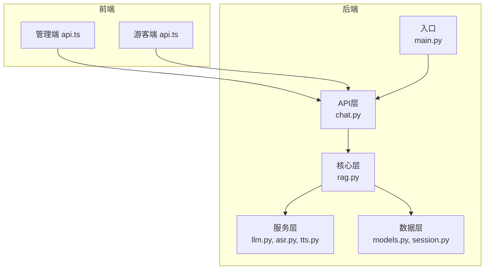
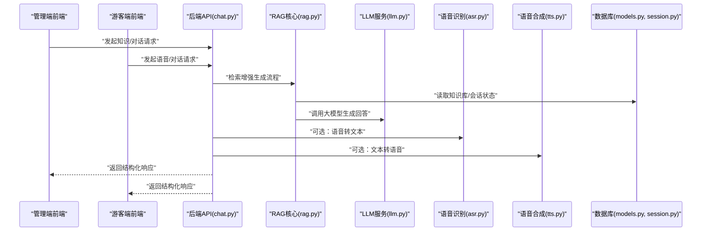
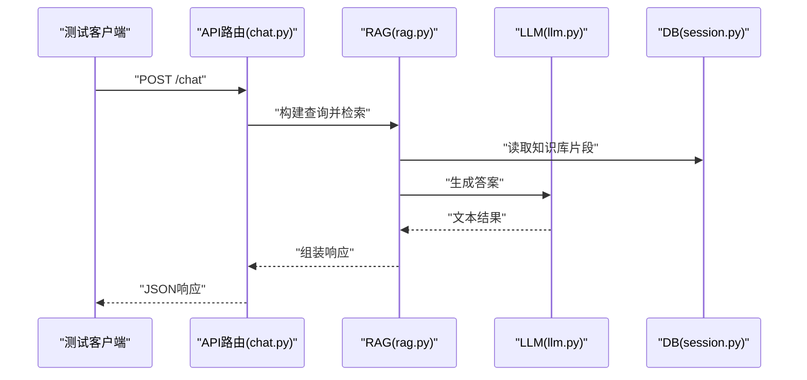
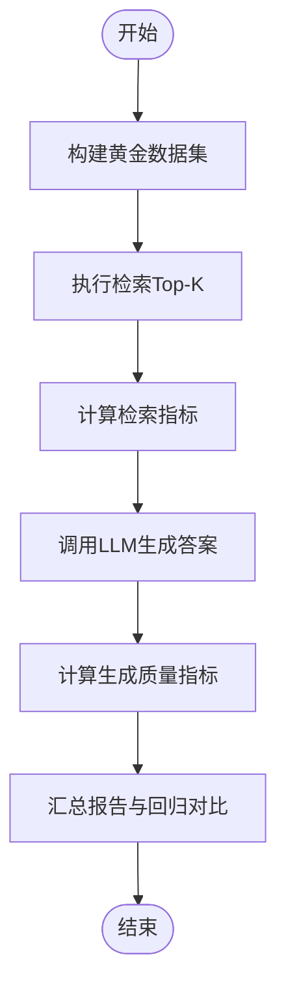
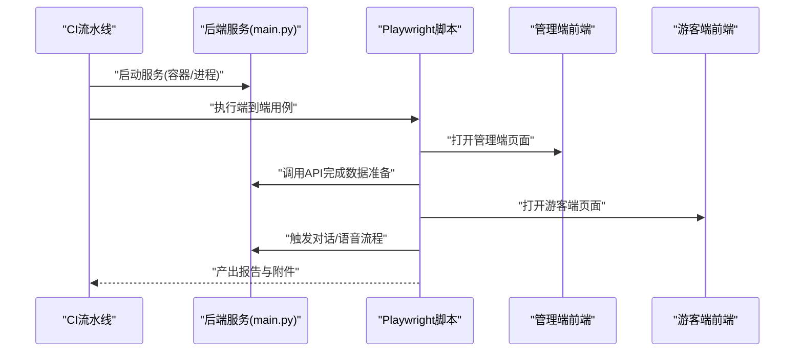
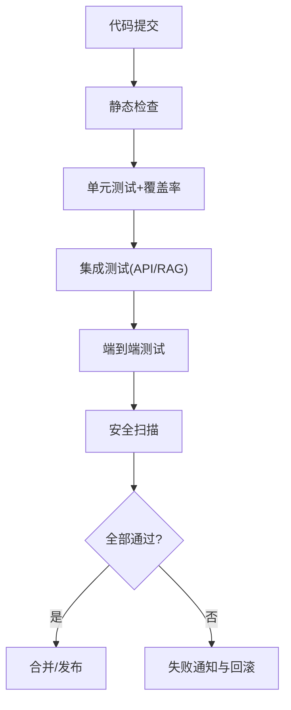
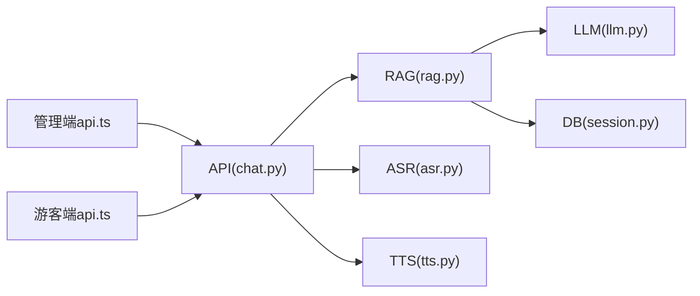

# 测试策略

<cite>
**本文引用的文件**   
- [backend/app/main.py](file://backend/app/main.py)
- [backend/app/api/chat.py](file://backend/app/api/chat.py)
- [backend/app/core/rag.py](file://backend/app/core/rag.py)
- [backend/app/services/llm.py](file://backend/app/services/llm.py)
- [backend/app/services/asr.py](file://backend/app/services/asr.py)
- [backend/app/services/tts.py](file://backend/app/services/tts.py)
- [backend/app/db/models.py](file://backend/app/db/models.py)
- [backend/app/db/session.py](file://backend/app/db/session.py)
- [backend/tests/test_api.py](file://backend/tests/test_api.py)
- [backend/tests/test_rag.py](file://backend/tests/test_rag.py)
- [backend/tests/test_agent.py](file://backend/tests/test_agent.py)
- [backend/pyproject.toml](file://backend/pyproject.toml)
- [docker-compose.yml](file://docker-compose.yml)
- [frontend/admin-panel/src/services/api.ts](file://frontend/admin-panel/src/services/api.ts)
- [frontend/tourist-app/src/services/api.ts](file://frontend/tourist-app/src/services/api.ts)
</cite>

## 目录
1. [简介](#简介)
2. [项目结构](#项目结构)
3. [核心组件](#核心组件)
4. [架构总览](#架构总览)
5. [详细组件分析](#详细组件分析)
6. [依赖分析](#依赖分析)
7. [性能考虑](#性能考虑)
8. [故障排查指南](#故障排查指南)
9. [结论](#结论)
10. [附录](#附录)

## 简介
本测试策略面向SmartTour项目的后端与前端，覆盖单元测试、集成测试、RAG专项测试、AI模型评估、端到端自动化、持续集成与质量门禁、覆盖率统计、性能基准与安全扫描。目标是在保证交付质量的同时，提升可维护性与可观测性，确保RAG与多模态能力（ASR/TTS）稳定可靠。

## 项目结构
- 后端采用模块化分层：API层、核心逻辑层、服务层、数据访问层；测试位于 backend/tests。
- 前端包含管理端与游客端两个应用，均通过HTTP调用后端API。
- 容器编排由 docker-compose.yml 统一协调。

**图表来源**
- [backend/app/main.py](file://backend/app/main.py)
- [backend/app/api/chat.py](file://backend/app/api/chat.py)
- [backend/app/core/rag.py](file://backend/app/core/rag.py)
- [backend/app/services/llm.py](file://backend/app/services/llm.py)
- [backend/app/services/asr.py](file://backend/app/services/asr.py)
- [backend/app/services/tts.py](file://backend/app/services/tts.py)
- [backend/app/db/models.py](file://backend/app/db/models.py)
- [backend/app/db/session.py](file://backend/app/db/session.py)
- [frontend/admin-panel/src/services/api.ts](file://frontend/admin-panel/src/services/api.ts)
- [frontend/tourist-app/src/services/api.ts](file://frontend/tourist-app/src/services/api.ts)

**章节来源**
- [backend/app/main.py](file://backend/app/main.py)
- [backend/app/api/chat.py](file://backend/app/api/chat.py)
- [backend/app/core/rag.py](file://backend/app/core/rag.py)
- [backend/app/services/llm.py](file://backend/app/services/llm.py)
- [backend/app/services/asr.py](file://backend/app/services/asr.py)
- [backend/app/services/tts.py](file://backend/app/services/tts.py)
- [backend/app/db/models.py](file://backend/app/db/models.py)
- [backend/app/db/session.py](file://backend/app/db/session.py)
- [frontend/admin-panel/src/services/api.ts](file://frontend/admin-panel/src/services/api.ts)
- [frontend/tourist-app/src/services/api.ts](file://frontend/tourist-app/src/services/api.ts)

## 核心组件
- 测试框架与配置
  - 使用 pytest 作为统一测试框架，结合 pytest-asyncio 支持异步测试。
  - 通过 backend/pyproject.toml 声明依赖与运行命令，便于在CI中复用。
- 现有测试用例
  - API集成测试：backend/tests/test_api.py
  - RAG专项测试：backend/tests/test_rag.py
  - Agent相关测试：backend/tests/test_agent.py
- 关键被测模块
  - API路由：backend/app/api/chat.py
  - RAG核心：backend/app/core/rag.py
  - LLM/ASR/TTS服务：backend/app/services/*.py
  - 数据库模型与会话：backend/app/db/*.py

**章节来源**
- [backend/pyproject.toml](file://backend/pyproject.toml)
- [backend/tests/test_api.py](file://backend/tests/test_api.py)
- [backend/tests/test_rag.py](file://backend/tests/test_rag.py)
- [backend/tests/test_agent.py](file://backend/tests/test_agent.py)
- [backend/app/api/chat.py](file://backend/app/api/chat.py)
- [backend/app/core/rag.py](file://backend/app/core/rag.py)
- [backend/app/services/llm.py](file://backend/app/services/llm.py)
- [backend/app/services/asr.py](file://backend/app/services/asr.py)
- [backend/app/services/tts.py](file://backend/app/services/tts.py)
- [backend/app/db/models.py](file://backend/app/db/models.py)
- [backend/app/db/session.py](file://backend/app/db/session.py)

## 架构总览
下图展示从前端到后端的请求链路，以及测试在各层的落点。

**图表来源**
- [backend/app/api/chat.py](file://backend/app/api/chat.py)
- [backend/app/core/rag.py](file://backend/app/core/rag.py)
- [backend/app/services/llm.py](file://backend/app/services/llm.py)
- [backend/app/services/asr.py](file://backend/app/services/asr.py)
- [backend/app/services/tts.py](file://backend/app/services/tts.py)
- [backend/app/db/models.py](file://backend/app/db/models.py)
- [backend/app/db/session.py](file://backend/app/db/session.py)
- [frontend/admin-panel/src/services/api.ts](file://frontend/admin-panel/src/services/api.ts)
- [frontend/tourist-app/src/services/api.ts](file://frontend/tourist-app/src/services/api.ts)

## 详细组件分析

### 单元测试策略
- 框架与工具
  - pytest + pytest-asyncio：统一断言与异步支持。
  - pytest-cov：覆盖率统计。
  - httpx.AsyncClient / TestClient：对FastAPI进行无服务器测试。
  - unittest.mock / pytest-mock：对外部依赖（LLM、ASR、TTS、DB）进行Mock。
- 编写规范
  - 命名：test_<模块>_<场景>.py，函数名体现输入与期望结果。
  - 隔离：外部IO与网络必须Mock或替换为内存实现。
  - 幂等：每个用例独立准备与清理数据。
  - 参数化：使用 @pytest.mark.parametrize 覆盖边界与异常路径。
- 最佳实践
  - 将共享夹具放在 conftest.py，按模块拆分。
  - 使用环境变量控制测试开关（如是否启用真实LLM）。
  - 对耗时操作设置超时与重试上限。

**章节来源**
- [backend/pyproject.toml](file://backend/pyproject.toml)
- [backend/tests/test_api.py](file://backend/tests/test_api.py)
- [backend/tests/test_rag.py](file://backend/tests/test_rag.py)
- [backend/tests/test_agent.py](file://backend/tests/test_agent.py)

### API集成测试方案
- 目标
  - 验证路由契约、鉴权、参数校验、错误码与响应结构。
  - 覆盖同步与异步接口，包括流式响应（如有）。
- 设计要点
  - 使用 TestClient 启动应用上下文，避免真实网络。
  - Mock LLM/ASR/TTS 以固定输出，确保可重复性。
  - 构造最小有效载荷与典型非法输入，覆盖边界条件。
- 示例流程（概念）
  - 客户端发送请求 -> API路由处理 -> 调用RAG/服务层 -> 返回响应。

**图表来源**
- [backend/app/api/chat.py](file://backend/app/api/chat.py)
- [backend/app/core/rag.py](file://backend/app/core/rag.py)
- [backend/app/services/llm.py](file://backend/app/services/llm.py)
- [backend/app/db/session.py](file://backend/app/db/session.py)

**章节来源**
- [backend/tests/test_api.py](file://backend/tests/test_api.py)
- [backend/app/api/chat.py](file://backend/app/api/chat.py)

### Mock数据构造与异步测试处理
- Mock策略
  - LLM/ASR/TTS：使用 pytest-mock 或 unittest.mock.patch 替换为固定返回值或延迟抛出异常，模拟超时与限流。
  - DB：使用内存SQLite或事务回滚夹具，避免污染持久化数据。
- 异步处理
  - 使用 pytest-asyncio 的 async def 用例与 await 调用。
  - 对长耗时任务引入超时装饰器与取消语义，防止阻塞。
- 数据构造
  - 工厂函数集中生成知识库条目、对话历史、用户画像等。
  - 针对RAG检索，构造不同长度与噪声的文档片段，验证鲁棒性。

**章节来源**
- [backend/tests/test_rag.py](file://backend/tests/test_rag.py)
- [backend/app/services/llm.py](file://backend/app/services/llm.py)
- [backend/app/services/asr.py](file://backend/app/services/asr.py)
- [backend/app/services/tts.py](file://backend/app/services/tts.py)
- [backend/app/db/session.py](file://backend/app/db/session.py)

### RAG系统专项测试
- 测试维度
  - 检索准确性：Top-K召回、相关性排序、去重与截断。
  - 生成质量：事实一致性、引用完整性、幻觉率。
  - 稳定性：长上下文、噪声注入、缺失字段容错。
- 指标与方法
  - 检索：Precision@K、Recall@K、NDCG@K。
  - 生成：BLEU/ROUGE（参考基线）、人工抽检、事实一致性评分。
  - 端到端：问答准确率、首字延迟、吞吐。
- 数据与基线
  - 构建黄金数据集（问题-标准答案-参考片段），用于回归对比。
  - 固定随机种子与分词器版本，保证可复现。

**图表来源**
- [backend/app/core/rag.py](file://backend/app/core/rag.py)
- [backend/app/services/llm.py](file://backend/app/services/llm.py)

**章节来源**
- [backend/tests/test_rag.py](file://backend/tests/test_rag.py)
- [backend/app/core/rag.py](file://backend/app/core/rag.py)

### AI模型性能评估与准确率验证
- 评估环境
  - 固定硬件与驱动，记录GPU/CPU利用率与显存占用。
  - 使用相同批大小与并发度，采集P50/P95/P99延迟。
- 准确率验证
  - 基于黄金集计算准确率、F1、事实一致性。
  - 定期回归对比，阈值不达标则阻断发布。
- 监控与采样
  - 线上采样日志，离线复核偏差与漂移。
  - 对高风险领域（如医疗、法律）提高抽样比例。

[本节为通用指导，不直接分析具体文件]

### 端到端测试与自动化流程
- 范围
  - 管理端与游客端页面交互，覆盖登录、知识库上传、对话、语音输入/输出。
- 技术选型
  - Playwright（跨浏览器、支持录制与并行）。
  - 通过环境变量切换后端地址，配合本地或容器化服务。
- 流程
  - 启动依赖服务（数据库、向量库、后端）。
  - 初始化测试数据（知识库、用户）。
  - 执行UI脚本，断言关键路径。
  - 收集截图、视频与日志，失败自动归档。

**图表来源**
- [backend/app/main.py](file://backend/app/main.py)
- [frontend/admin-panel/src/services/api.ts](file://frontend/admin-panel/src/services/api.ts)
- [frontend/tourist-app/src/services/api.ts](file://frontend/tourist-app/src/services/api.ts)

**章节来源**
- [backend/app/main.py](file://backend/app/main.py)
- [frontend/admin-panel/src/services/api.ts](file://frontend/admin-panel/src/services/api.ts)
- [frontend/tourist-app/src/services/api.ts](file://frontend/tourist-app/src/services/api.ts)

### 持续集成配置与质量门禁
- 阶段划分
  - 代码检查：lint、类型检查、格式化。
  - 单测与覆盖率：pytest + pytest-cov，设定最低覆盖率阈值。
  - 集成测试：API与RAG专项，Mock外部依赖。
  - E2E测试：Playwright，并行执行。
  - 安全扫描：依赖漏洞与SAST。
  - 制品与报告：上传覆盖率与测试报告。
- 门禁规则
  - 单测通过率100%。
  - 覆盖率不低于阈值（可按模块差异化）。
  - 严重漏洞数为0。
  - 性能回归检测：关键接口P95延迟不劣于基线。

**图表来源**
- [backend/pyproject.toml](file://backend/pyproject.toml)
- [docker-compose.yml](file://docker-compose.yml)

**章节来源**
- [backend/pyproject.toml](file://backend/pyproject.toml)
- [docker-compose.yml](file://docker-compose.yml)

### 测试覆盖率统计
- 工具链
  - pytest-cov：生成HTML与XML报告。
  - 覆盖率阈值：在CI中解析XML并判定是否达标。
- 范围
  - 后端：业务逻辑与服务层优先，API路由次之。
  - 前端：核心服务与视图逻辑。
- 报告
  - 每次PR附带覆盖率差异，关注新增/修改文件的覆盖率变化。

**章节来源**
- [backend/pyproject.toml](file://backend/pyproject.toml)

### 性能基准测试
- 方法
  - 使用压测工具（如locust/k6）对关键接口进行负载测试。
  - 固定QPS与并发，记录P50/P95/P99延迟与错误率。
- 指标
  - 吞吐量、延迟分布、资源利用率（CPU/GPU/内存）。
- 回归
  - 与基线对比，超过阈值即告警。

[本节为通用指导，不直接分析具体文件]

### 安全漏洞扫描
- 依赖扫描
  - 使用安全工具扫描Python与前端依赖，阻断高危漏洞。
- 代码扫描
  - 静态分析发现潜在安全问题（硬编码密钥、SQL注入风险等）。
- 容器镜像
  - 扫描镜像层漏洞，及时更新基础镜像。

[本节为通用指导，不直接分析具体文件]

## 依赖分析
- 组件耦合
  - API层依赖RAG与外部服务（LLM/ASR/TTS），RAG依赖DB与LLM。
  - 前端仅依赖后端API契约，解耦良好。
- 外部依赖
  - LLM/ASR/TTS需Mock或沙箱化，避免不稳定因素。
  - 数据库建议使用内存或事务回滚，保障测试隔离。

**图表来源**
- [backend/app/api/chat.py](file://backend/app/api/chat.py)
- [backend/app/core/rag.py](file://backend/app/core/rag.py)
- [backend/app/services/llm.py](file://backend/app/services/llm.py)
- [backend/app/services/asr.py](file://backend/app/services/asr.py)
- [backend/app/services/tts.py](file://backend/app/services/tts.py)
- [backend/app/db/session.py](file://backend/app/db/session.py)
- [frontend/admin-panel/src/services/api.ts](file://frontend/admin-panel/src/services/api.ts)
- [frontend/tourist-app/src/services/api.ts](file://frontend/tourist-app/src/services/api.ts)

**章节来源**
- [backend/app/api/chat.py](file://backend/app/api/chat.py)
- [backend/app/core/rag.py](file://backend/app/core/rag.py)
- [backend/app/services/llm.py](file://backend/app/services/llm.py)
- [backend/app/services/asr.py](file://backend/app/services/asr.py)
- [backend/app/services/tts.py](file://backend/app/services/tts.py)
- [backend/app/db/session.py](file://backend/app/db/session.py)
- [frontend/admin-panel/src/services/api.ts](file://frontend/admin-panel/src/services/api.ts)
- [frontend/tourist-app/src/services/api.ts](file://frontend/tourist-app/src/services/api.ts)

## 性能考虑
- 测试数据规模
  - 小样本快速反馈，大数据集仅在夜间跑批。
- 并发与超时
  - 合理设置并发数与超时，避免CI资源耗尽。
- 缓存与预热
  - 对向量索引与模型权重进行预热，减少冷启动抖动。
- 资源隔离
  - 使用容器隔离测试环境，避免相互干扰。

[本节为通用指导，不直接分析具体文件]

## 故障排查指南
- 常见问题
  - 外部服务不可用：确认Mock是否生效，检查环境变量与端口映射。
  - 数据库冲突：确保每个用例使用独立事务或内存库。
  - 异步超时：增加超时时间或降低并发。
- 定位手段
  - 开启详细日志，捕获请求ID与堆栈。
  - 保存失败时的快照与回放。
  - 使用最小可复现用例逐步缩小范围。

**章节来源**
- [backend/tests/test_api.py](file://backend/tests/test_api.py)
- [backend/tests/test_rag.py](file://backend/tests/test_rag.py)
- [backend/tests/test_agent.py](file://backend/tests/test_agent.py)

## 结论
本测试策略围绕“可重复、可隔离、可度量”的原则，构建了从单元到端到端的完整质量体系。通过严格的Mock与数据治理，确保RAG与AI能力的稳定性与可评估性；借助CI与质量门禁，将风险前置，持续提升交付质量。

## 附录
- 术语
  - RAG：检索增强生成
  - P95/P99：延迟百分位
  - NDCG：归一化折损累计增益
- 参考
  - pytest官方文档
  - Playwright官方文档
  - 覆盖率工具文档