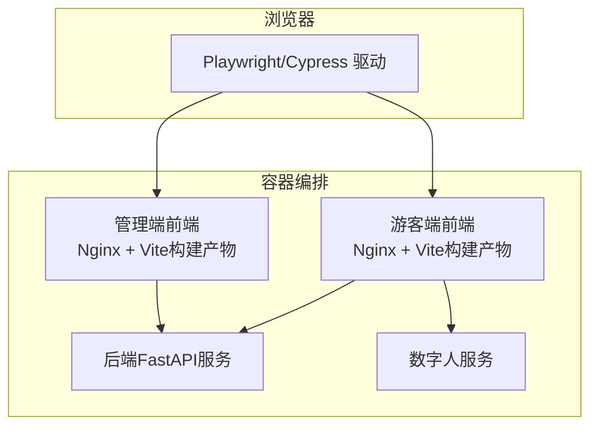
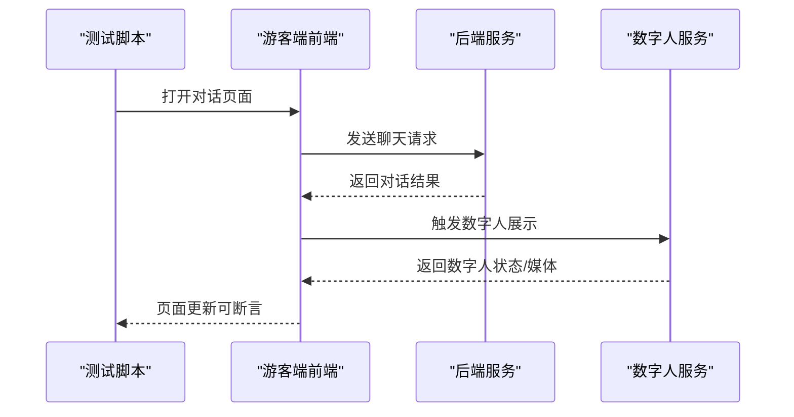
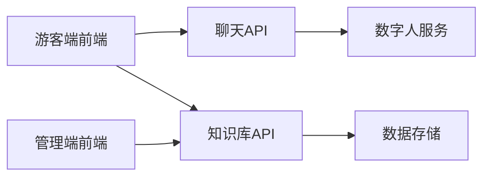

# 端到端测试

<cite>
**本文引用的文件**   
- [docker-compose.yml](file://docker-compose.yml)
- [frontend/tourist-app/package.json](file://frontend/tourist-app/package.json)
- [frontend/admin-panel/package.json](file://frontend/admin-panel/package.json)
- [backend/pyproject.toml](file://backend/pyproject.toml)
- [backend/app/main.py](file://backend/app/main.py)
- [backend/app/api/chat.py](file://backend/app/api/chat.py)
- [backend/app/api/knowledge.py](file://backend/app/api/knowledge.py)
- [backend/app/services/digital_human.py](file://backend/app/services/digital_human.py)
- [digital_human/server.py](file://digital_human/server.py)
- [frontend/tourist-app/src/views/ChatView.vue](file://frontend/tourist-app/src/views/ChatView.vue)
- [frontend/tourist-app/src/components/DigitalHuman/DigitalHuman.vue](file://frontend/tourist-app/src/components/DigitalHuman/DigitalHuman.vue)
- [frontend/admin-panel/src/views/KnowledgeBase/KnowledgeView.vue](file://frontend/admin-panel/src/views/KnowledgeBase/KnowledgeView.vue)
</cite>

## 目录
1. [简介](#简介)
2. [项目结构](#项目结构)
3. [核心组件](#核心组件)
4. [架构总览](#架构总览)
5. [详细组件分析](#详细组件分析)
6. [依赖分析](#依赖分析)
7. [性能考虑](#性能考虑)
8. [故障排查指南](#故障排查指南)
9. [结论](#结论)
10. [附录](#附录)

## 简介
本文件面向SmartTour项目的端到端（E2E）测试，覆盖游客端对话交互、数字人展示与管理端知识库管理等关键业务流程。文档将说明：
- E2E测试框架选型与配置建议（Playwright/Cypress）
- 容器化环境下的测试执行策略
- 跨浏览器兼容性与移动端适配验证方案
- 测试数据准备与清理策略
- 截图对比与视觉回归测试实现方法
- 持续集成流水线中的E2E测试配置与报告生成

## 项目结构
SmartTour包含前端应用（游客端与管理端）、后端API服务、数字人服务以及容器编排文件。E2E测试需要以容器为边界，启动完整链路并驱动真实浏览器访问前端页面，触发后端接口与数字人服务。

图表来源
- [docker-compose.yml](file://docker-compose.yml)
- [backend/app/main.py](file://backend/app/main.py)
- [digital_human/server.py](file://digital_human/server.py)
- [frontend/tourist-app/package.json](file://frontend/tourist-app/package.json)
- [frontend/admin-panel/package.json](file://frontend/admin-panel/package.json)

章节来源
- [docker-compose.yml](file://docker-compose.yml)
- [backend/app/main.py](file://backend/app/main.py)
- [digital_human/server.py](file://digital_human/server.py)
- [frontend/tourist-app/package.json](file://frontend/tourist-app/package.json)
- [frontend/admin-panel/package.json](file://frontend/admin-panel/package.json)

## 核心组件
- 游客端前端：提供对话界面与数字人渲染，调用后端聊天与数字人相关接口。
- 管理端前端：提供知识库管理界面，调用后端知识库接口进行增删改查。
- 后端服务：基于FastAPI暴露REST接口，包括聊天、知识库、数字人等能力。
- 数字人服务：独立服务，负责数字人渲染或流式输出，供前端或后端调用。

章节来源
- [frontend/tourist-app/src/views/ChatView.vue](file://frontend/tourist-app/src/views/ChatView.vue)
- [frontend/tourist-app/src/components/DigitalHuman/DigitalHuman.vue](file://frontend/tourist-app/src/components/DigitalHuman/DigitalHuman.vue)
- [frontend/admin-panel/src/views/KnowledgeBase/KnowledgeView.vue](file://frontend/admin-panel/src/views/KnowledgeBase/KnowledgeView.vue)
- [backend/app/api/chat.py](file://backend/app/api/chat.py)
- [backend/app/api/knowledge.py](file://backend/app/api/knowledge.py)
- [backend/app/services/digital_human.py](file://backend/app/services/digital_human.py)
- [digital_human/server.py](file://digital_human/server.py)

## 架构总览
下图展示了E2E测试在容器化环境中的整体交互流程：测试脚本通过浏览器驱动访问前端页面，前端向后端发起请求，后端可能调用数字人服务完成业务逻辑。

图表来源
- [frontend/tourist-app/src/views/ChatView.vue](file://frontend/tourist-app/src/views/ChatView.vue)
- [backend/app/api/chat.py](file://backend/app/api/chat.py)
- [backend/app/services/digital_human.py](file://backend/app/services/digital_human.py)
- [digital_human/server.py](file://digital_human/server.py)

## 详细组件分析

### 游客端对话交互E2E场景
- 目标：验证用户输入消息后，系统能正确返回对话内容并在UI上呈现。
- 关键步骤：
  - 启动容器环境，确保后端与数字人服务可用。
  - 使用浏览器驱动打开游客端对话页面。
  - 模拟输入文本并发送。
  - 等待响应加载并断言消息列表更新。
  - 可选：断言数字人区域状态变化。
- 断言要点：
  - 页面元素可见性、消息文本片段、时间戳格式等。
  - 网络请求状态码与响应体关键字段。
- 失败处理：
  - 捕获超时与网络错误，记录日志与截图。
  - 重试机制用于偶发性网络抖动。

章节来源
- [frontend/tourist-app/src/views/ChatView.vue](file://frontend/tourist-app/src/views/ChatView.vue)
- [backend/app/api/chat.py](file://backend/app/api/chat.py)

### 数字人展示E2E场景
- 目标：验证数字人模块的初始化、播放与停止流程。
- 关键步骤：
  - 进入数字人页面或从对话页触发数字人展示。
  - 检查数字人容器是否挂载成功。
  - 触发播放/暂停动作并断言UI反馈。
  - 若涉及媒体流，断言资源加载状态。
- 断言要点：
  - DOM节点存在性与属性。
  - 控制台无关键错误。
  - 媒体资源加载成功。

章节来源
- [frontend/tourist-app/src/components/DigitalHuman/DigitalHuman.vue](file://frontend/tourist-app/src/components/DigitalHuman/DigitalHuman.vue)
- [backend/app/services/digital_human.py](file://backend/app/services/digital_human.py)
- [digital_human/server.py](file://digital_human/server.py)

### 管理端知识库管理E2E场景
- 目标：验证知识库的创建、编辑、删除与查询功能。
- 关键步骤：
  - 登录管理端（如需要）。
  - 进入知识库页面，执行新增条目操作。
  - 校验列表刷新与详情展示。
  - 执行编辑与删除，断言持久化结果。
- 断言要点：
  - 表单提交后的成功提示。
  - 列表项数量与字段值。
  - 后端接口返回状态码与数据结构。

章节来源
- [frontend/admin-panel/src/views/KnowledgeBase/KnowledgeView.vue](file://frontend/admin-panel/src/views/KnowledgeBase/KnowledgeView.vue)
- [backend/app/api/knowledge.py](file://backend/app/api/knowledge.py)

### 测试框架选择与配置建议
- Playwright：
  - 优势：多浏览器支持、内置并行、强大的定位器与截图能力。
  - 配置要点：
    - 指定浏览器类型（Chromium/Firefox/WebKit）。
    - 设置视口大小以覆盖桌面与移动端断点。
    - 启用截图与视频录制以便失败诊断。
    - 配置基础URL指向容器内前端服务。
- Cypress：
  - 优势：开发体验友好、插件生态丰富。
  - 配置要点：
    - 设置baseUrl与viewport。
    - 使用cy.intercept拦截并断言网络请求。
    - 结合cypress-image-snapshot-plugin进行视觉回归。

章节来源
- [frontend/tourist-app/package.json](file://frontend/tourist-app/package.json)
- [frontend/admin-panel/package.json](file://frontend/admin-panel/package.json)

### 容器化环境的测试执行
- 使用docker-compose启动完整链路：
  - 构建并运行前后端与数字人服务。
  - 暴露端口供浏览器访问。
- 测试执行策略：
  - 在CI中先拉起容器，再运行E2E测试脚本。
  - 使用健康检查确保服务就绪后再开始测试。
  - 测试完成后销毁容器，释放资源。

章节来源
- [docker-compose.yml](file://docker-compose.yml)

### 跨浏览器兼容性与移动端适配验证
- 跨浏览器：
  - 在Playwright中并行运行Chromium、Firefox、WebKit用例。
  - 针对Cypress，可通过插件或外部工具扩展浏览器矩阵。
- 移动端适配：
  - 设置设备尺寸与像素比，模拟主流手机屏幕。
  - 验证触摸事件与滚动行为。
  - 断言布局在不同视口下的稳定性。

章节来源
- [frontend/tourist-app/package.json](file://frontend/tourist-app/package.json)
- [frontend/admin-panel/package.json](file://frontend/admin-panel/package.json)

### 测试数据的准备与清理策略
- 准备：
  - 使用种子数据初始化知识库条目。
  - 预置用户会话或令牌（如需认证）。
- 清理：
  - 每个用例结束后重置数据库或清空缓存。
  - 删除上传的文件与临时资源。
- 隔离：
  - 为每个用例生成唯一标识，避免数据污染。

章节来源
- [backend/app/api/knowledge.py](file://backend/app/api/knowledge.py)
- [backend/app/api/chat.py](file://backend/app/api/chat.py)

### 截图对比与视觉回归测试
- 基线图片：
  - 在稳定版本下生成基准截图。
- 对比策略：
  - 使用像素级或感知哈希算法比较差异。
  - 允许阈值以避免微小渲染差异导致误报。
- 失败处理：
  - 自动保存差异图与上下文信息。
  - 人工审核变更是否合理。

章节来源
- [frontend/tourist-app/package.json](file://frontend/tourist-app/package.json)
- [frontend/admin-panel/package.json](file://frontend/admin-panel/package.json)

### 持续集成流水线中的E2E测试配置与报告生成
- CI阶段：
  - 拉取代码并安装依赖。
  - 构建前端与后端镜像。
  - 启动容器并等待健康检查通过。
  - 执行E2E测试套件。
- 报告：
  - 生成HTML报告与JUnit XML。
  - 上传截图与视频到制品库。
  - 失败时通知团队并标记构建状态。

章节来源
- [docker-compose.yml](file://docker-compose.yml)
- [backend/pyproject.toml](file://backend/pyproject.toml)

## 依赖分析
E2E测试对以下组件存在直接依赖：
- 前端应用：提供页面与交互入口。
- 后端服务：提供API契约与业务逻辑。
- 数字人服务：提供渲染或媒体能力。
- 容器编排：统一生命周期管理与网络拓扑。

图表来源
- [backend/app/api/chat.py](file://backend/app/api/chat.py)
- [backend/app/api/knowledge.py](file://backend/app/api/knowledge.py)
- [backend/app/services/digital_human.py](file://backend/app/services/digital_human.py)
- [digital_human/server.py](file://digital_human/server.py)
- [frontend/tourist-app/src/views/ChatView.vue](file://frontend/tourist-app/src/views/ChatView.vue)
- [frontend/admin-panel/src/views/KnowledgeBase/KnowledgeView.vue](file://frontend/admin-panel/src/views/KnowledgeBase/KnowledgeView.vue)

章节来源
- [backend/app/api/chat.py](file://backend/app/api/chat.py)
- [backend/app/api/knowledge.py](file://backend/app/api/knowledge.py)
- [backend/app/services/digital_human.py](file://backend/app/services/digital_human.py)
- [digital_human/server.py](file://digital_human/server.py)
- [frontend/tourist-app/src/views/ChatView.vue](file://frontend/tourist-app/src/views/ChatView.vue)
- [frontend/admin-panel/src/views/KnowledgeBase/KnowledgeView.vue](file://frontend/admin-panel/src/views/KnowledgeBase/KnowledgeView.vue)

## 性能考虑
- 并行执行：
  - 按功能域拆分用例集，最大化并发度。
- 资源限制：
  - 控制并发浏览器实例数，避免宿主机资源耗尽。
- 网络优化：
  - 使用本地镜像与缓存加速构建。
  - 减少不必要的截图与视频录制。
- 断言优化：
  - 优先断言关键路径与核心元素，降低脆弱性。

## 故障排查指南
- 常见问题：
  - 服务未就绪：增加健康检查与重试。
  - 定位不稳定：使用更稳定的选择器与等待条件。
  - 网络超时：调整超时参数与重试策略。
- 诊断手段：
  - 收集浏览器控制台日志与网络请求。
  - 保存失败时的页面截图与视频。
  - 查看后端与服务日志定位根因。

章节来源
- [backend/app/main.py](file://backend/app/main.py)
- [digital_human/server.py](file://digital_human/server.py)

## 结论
通过容器化部署与浏览器驱动的E2E测试，SmartTour能够在接近生产的环境中验证游客端对话、数字人展示与管理端知识库等关键流程。结合跨浏览器与移动端适配、数据隔离与视觉回归，可显著提升质量保障能力。建议在CI中固化测试流程，形成自动化质量门禁。

## 附录
- 术语：
  - E2E：端到端测试，覆盖用户完整业务流程。
  - 视觉回归：通过截图对比检测UI变化。
- 参考实践：
  - 使用幂等接口与种子数据进行数据准备。
  - 采用分层断言策略，兼顾稳定性与覆盖率。