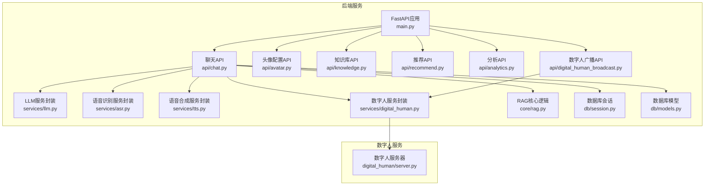
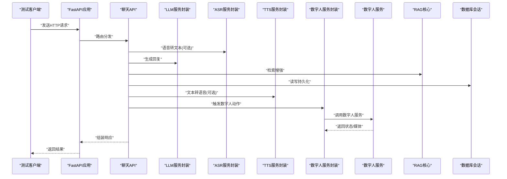
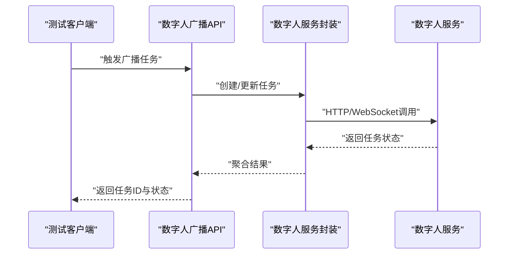
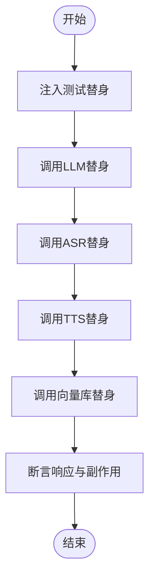
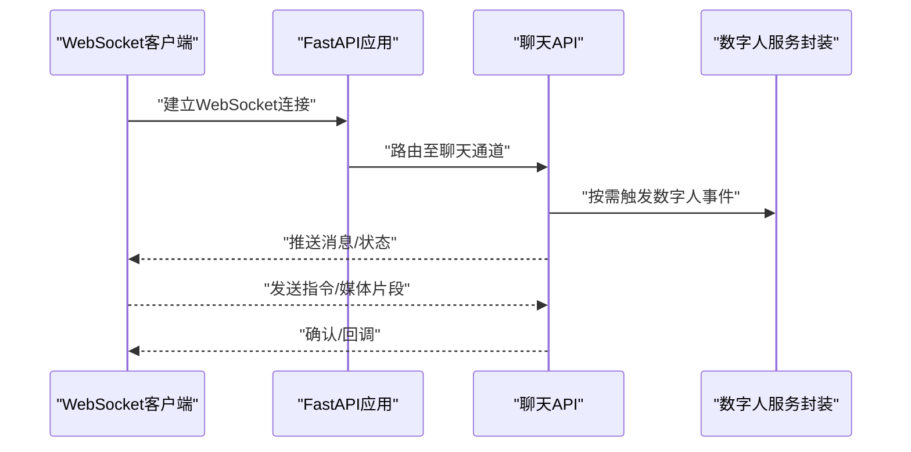
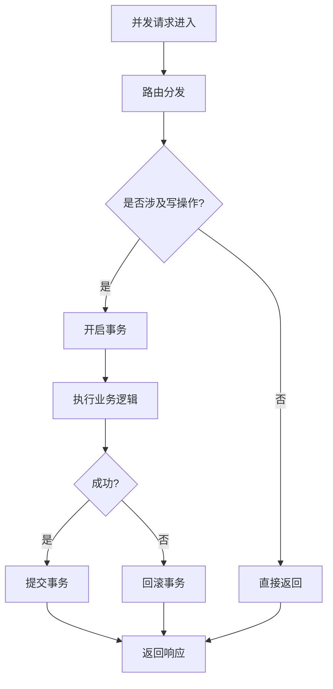
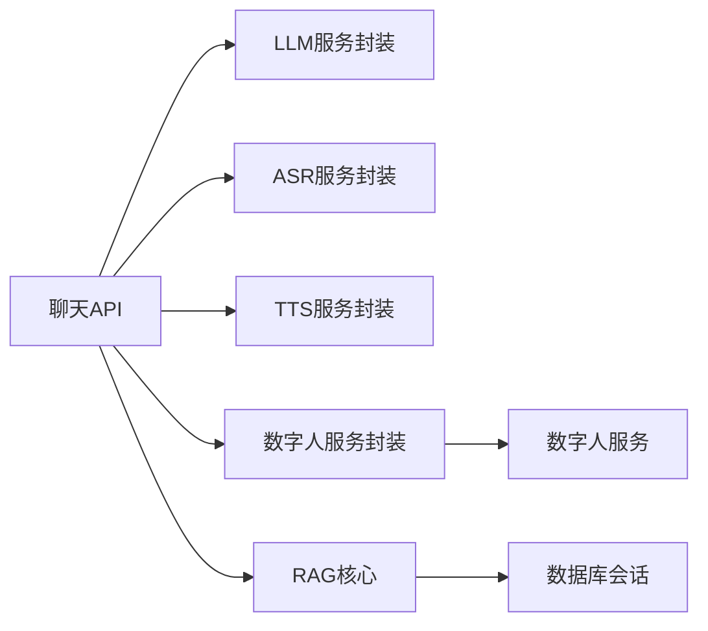

# 集成测试

<cite>
**本文引用的文件**   
- [backend/app/main.py](file://backend/app/main.py)
- [backend/tests/test_api.py](file://backend/tests/test_api.py)
- [backend/tests/test_agent.py](file://backend/tests/test_agent.py)
- [backend/tests/test_rag.py](file://backend/tests/test_rag.py)
- [backend/app/api/chat.py](file://backend/app/api/chat.py)
- [backend/app/api/avatar.py](file://backend/app/api/avatar.py)
- [backend/app/api/knowledge.py](file://backend/app/api/knowledge.py)
- [backend/app/api/recommend.py](file://backend/app/api/recommend.py)
- [backend/app/api/analytics.py](file://backend/app/api/analytics.py)
- [backend/app/api/digital_human_broadcast.py](file://backend/app/api/digital_human_broadcast.py)
- [backend/app/services/llm.py](file://backend/app/services/llm.py)
- [backend/app/services/asr.py](file://backend/app/services/asr.py)
- [backend/app/services/tts.py](file://backend/app/services/tts.py)
- [backend/app/services/digital_human.py](file://backend/app/services/digital_human.py)
- [backend/app/core/rag.py](file://backend/app/core/rag.py)
- [backend/app/db/session.py](file://backend/app/db/session.py)
- [backend/app/db/models.py](file://backend/app/db/models.py)
- [digital_human/server.py](file://digital_human/server.py)
- [docker-compose.yml](file://docker-compose.yml)
</cite>

## 目录
1. [简介](#简介)
2. [项目结构](#项目结构)
3. [核心组件](#核心组件)
4. [架构总览](#架构总览)
5. [详细组件分析](#详细组件分析)
6. [依赖分析](#依赖分析)
7. [性能考虑](#性能考虑)
8. [故障排查指南](#故障排查指南)
9. [结论](#结论)
10. [附录](#附录)

## 简介
本文件面向SmartTour项目的API接口集成测试，聚焦以下目标：
- 使用FastAPI测试客户端进行端到端与模块级集成测试
- 制定RESTful API的测试策略（正向、异常、边界、幂等、版本兼容）
- 设计多服务间通信的集成测试方案（后端服务与数字人服务交互）
- 外部依赖Mock策略（LLM、ASR、TTS、向量数据库）
- WebSocket实时通信测试方法
- 并发请求处理与事务回滚测试
- API版本兼容性测试、错误响应验证与安全漏洞扫描自动化流程

## 项目结构
SmartTour采用前后端分离与多服务架构。后端基于FastAPI，提供聊天、知识管理、推荐、分析、数字人广播等API；数字人服务独立部署并通过HTTP或WebSocket与后端交互；数据层通过数据库会话管理。

图表来源
- [backend/app/main.py](file://backend/app/main.py)
- [backend/app/api/chat.py](file://backend/app/api/chat.py)
- [backend/app/api/avatar.py](file://backend/app/api/avatar.py)
- [backend/app/api/knowledge.py](file://backend/app/api/knowledge.py)
- [backend/app/api/recommend.py](file://backend/app/api/recommend.py)
- [backend/app/api/analytics.py](file://backend/app/api/analytics.py)
- [backend/app/api/digital_human_broadcast.py](file://backend/app/api/digital_human_broadcast.py)
- [backend/app/services/llm.py](file://backend/app/services/llm.py)
- [backend/app/services/asr.py](file://backend/app/services/asr.py)
- [backend/app/services/tts.py](file://backend/app/services/tts.py)
- [backend/app/services/digital_human.py](file://backend/app/services/digital_human.py)
- [backend/app/core/rag.py](file://backend/app/core/rag.py)
- [backend/app/db/session.py](file://backend/app/db/session.py)
- [backend/app/db/models.py](file://backend/app/db/models.py)
- [digital_human/server.py](file://digital_human/server.py)

章节来源
- [backend/app/main.py](file://backend/app/main.py)
- [backend/app/api/chat.py](file://backend/app/api/chat.py)
- [backend/app/api/avatar.py](file://backend/app/api/avatar.py)
- [backend/app/api/knowledge.py](file://backend/app/api/knowledge.py)
- [backend/app/api/recommend.py](file://backend/app/api/recommend.py)
- [backend/app/api/analytics.py](file://backend/app/api/analytics.py)
- [backend/app/api/digital_human_broadcast.py](file://backend/app/api/digital_human_broadcast.py)
- [backend/app/services/llm.py](file://backend/app/services/llm.py)
- [backend/app/services/asr.py](file://backend/app/services/asr.py)
- [backend/app/services/tts.py](file://backend/app/services/tts.py)
- [backend/app/services/digital_human.py](file://backend/app/services/digital_human.py)
- [backend/app/core/rag.py](file://backend/app/core/rag.py)
- [backend/app/db/session.py](file://backend/app/db/session.py)
- [backend/app/db/models.py](file://backend/app/db/models.py)
- [digital_human/server.py](file://digital_human/server.py)

## 核心组件
- FastAPI应用入口与路由注册：负责挂载各功能API路由，统一生命周期与中间件配置。
- 聊天API：聚合LLM、ASR、TTS、数字人与RAG能力，提供对话、语音输入输出、知识检索与个性化推荐。
- 数字人广播API：驱动数字人服务进行播报与状态同步。
- 知识库API：文档解析、入库、检索与管理。
- 推荐与分析API：用户行为分析与内容推荐。
- 服务封装层：对LLM、ASR、TTS、数字人服务进行抽象与调用。
- RAG核心：检索增强生成逻辑，结合向量数据库与业务上下文。
- 数据层：数据库会话与模型定义，支持事务与一致性保障。

章节来源
- [backend/app/main.py](file://backend/app/main.py)
- [backend/app/api/chat.py](file://backend/app/api/chat.py)
- [backend/app/api/digital_human_broadcast.py](file://backend/app/api/digital_human_broadcast.py)
- [backend/app/api/knowledge.py](file://backend/app/api/knowledge.py)
- [backend/app/api/recommend.py](file://backend/app/api/recommend.py)
- [backend/app/api/analytics.py](file://backend/app/api/analytics.py)
- [backend/app/services/llm.py](file://backend/app/services/llm.py)
- [backend/app/services/asr.py](file://backend/app/services/asr.py)
- [backend/app/services/tts.py](file://backend/app/services/tts.py)
- [backend/app/services/digital_human.py](file://backend/app/services/digital_human.py)
- [backend/app/core/rag.py](file://backend/app/core/rag.py)
- [backend/app/db/session.py](file://backend/app/db/session.py)
- [backend/app/db/models.py](file://backend/app/db/models.py)

## 架构总览
下图展示从测试客户端到后端API、服务封装、外部依赖与数字人服务的完整调用链，便于理解集成测试覆盖范围。

图表来源
- [backend/app/api/chat.py](file://backend/app/api/chat.py)
- [backend/app/services/llm.py](file://backend/app/services/llm.py)
- [backend/app/services/asr.py](file://backend/app/services/asr.py)
- [backend/app/services/tts.py](file://backend/app/services/tts.py)
- [backend/app/services/digital_human.py](file://backend/app/services/digital_human.py)
- [backend/app/core/rag.py](file://backend/app/core/rag.py)
- [backend/app/db/session.py](file://backend/app/db/session.py)
- [digital_human/server.py](file://digital_human/server.py)

## 详细组件分析

### RESTful API测试策略（FastAPI测试客户端）
- 使用FastAPI提供的测试客户端启动应用实例，避免真实网络开销，确保可重复性与隔离性。
- 针对每个API端点编写用例：
  - 正常路径：校验状态码、响应体结构与关键字段
  - 异常路径：参数缺失、类型错误、权限不足、资源不存在
  - 边界条件：空字符串、超长输入、特殊字符、大文件上传
  - 幂等性：相同请求多次执行结果一致
  - 版本兼容：不同API版本的路由共存与向后兼容
- 建议将测试数据准备与清理放入fixture，保证事务回滚与数据一致性。

章节来源
- [backend/tests/test_api.py](file://backend/tests/test_api.py)
- [backend/app/main.py](file://backend/app/main.py)

### 多服务间通信集成测试（后端与数字人服务）
- 在测试环境中启动数字人服务容器，或使用轻量模拟实现替代真实服务。
- 通过数字人服务封装层发起调用，验证：
  - 心跳与连接建立
  - 媒体流传输（音频/图像）
  - 状态同步与错误重试
- 若数字人服务不可用，应降级为本地模拟并记录告警。

图表来源
- [backend/app/api/digital_human_broadcast.py](file://backend/app/api/digital_human_broadcast.py)
- [backend/app/services/digital_human.py](file://backend/app/services/digital_human.py)
- [digital_human/server.py](file://digital_human/server.py)

章节来源
- [backend/app/api/digital_human_broadcast.py](file://backend/app/api/digital_human_broadcast.py)
- [backend/app/services/digital_human.py](file://backend/app/services/digital_human.py)
- [digital_human/server.py](file://digital_human/server.py)

### 外部依赖Mock策略（LLM、ASR、TTS、向量数据库）
- 使用依赖注入替换真实服务为测试替身：
  - LLM：返回固定提示词与结构化答案，覆盖长文本、JSON格式、安全过滤
  - ASR：模拟音频转文本，包含噪声、静音、语种切换场景
  - TTS：模拟文本转音频，控制采样率、时长与错误码
  - 向量数据库：模拟相似度检索，返回可控候选集
- Mock需具备断言能力，记录调用次数、入参与出参，用于回归与覆盖率统计。

图表来源
- [backend/app/services/llm.py](file://backend/app/services/llm.py)
- [backend/app/services/asr.py](file://backend/app/services/asr.py)
- [backend/app/services/tts.py](file://backend/app/services/tts.py)
- [backend/app/core/rag.py](file://backend/app/core/rag.py)

章节来源
- [backend/app/services/llm.py](file://backend/app/services/llm.py)
- [backend/app/services/asr.py](file://backend/app/services/asr.py)
- [backend/app/services/tts.py](file://backend/app/services/tts.py)
- [backend/app/core/rag.py](file://backend/app/core/rag.py)

### WebSocket实时通信测试方法
- 使用异步WebSocket客户端建立连接，订阅频道与事件。
- 验证消息序列、重连机制、心跳超时与错误恢复。
- 模拟服务端推送与客户端断开，检查资源释放与状态一致性。

图表来源
- [backend/app/api/chat.py](file://backend/app/api/chat.py)
- [backend/app/services/digital_human.py](file://backend/app/services/digital_human.py)

章节来源
- [backend/app/api/chat.py](file://backend/app/api/chat.py)
- [backend/app/services/digital_human.py](file://backend/app/services/digital_human.py)

### 并发请求处理与事务回滚测试
- 并发场景：
  - 同一会话的多路对话请求
  - 批量上传与解析
  - 数字人广播任务的并发调度
- 事务回滚：
  - 使用数据库会话在测试中开启事务，用例结束后自动回滚
  - 校验写入失败时的补偿逻辑与一致性约束

图表来源
- [backend/app/db/session.py](file://backend/app/db/session.py)
- [backend/app/db/models.py](file://backend/app/db/models.py)

章节来源
- [backend/app/db/session.py](file://backend/app/db/session.py)
- [backend/app/db/models.py](file://backend/app/db/models.py)

### API版本兼容性测试
- 在多版本路由并存时，验证：
  - 旧版接口继续可用且行为不变
  - 新版接口新增字段与扩展语义
  - 弃用接口的警告与迁移指引
- 通过请求头或URL路径区分版本，并在测试中覆盖各版本用例。

章节来源
- [backend/app/main.py](file://backend/app/main.py)

### 错误响应验证
- 统一错误码与错误体结构，确保客户端可解析与重试。
- 覆盖常见错误：参数校验失败、认证失败、资源不存在、服务超时、内部错误。
- 在日志与监控中记录关键错误上下文，便于定位问题。

章节来源
- [backend/app/api/chat.py](file://backend/app/api/chat.py)
- [backend/app/api/knowledge.py](file://backend/app/api/knowledge.py)
- [backend/app/api/recommend.py](file://backend/app/api/recommend.py)
- [backend/app/api/analytics.py](file://backend/app/api/analytics.py)
- [backend/app/api/digital_human_broadcast.py](file://backend/app/api/digital_human_broadcast.py)

### 安全漏洞扫描自动化
- 在CI流水线中加入依赖漏洞扫描与代码静态分析。
- 定期运行第三方安全工具，生成报告并阻断高风险构建。
- 对敏感配置与密钥进行保护，避免泄露到测试环境。

章节来源
- [docker-compose.yml](file://docker-compose.yml)

## 依赖分析
- 组件耦合：
  - API层依赖服务封装层，服务封装层再依赖外部服务与数据库
  - RAG核心依赖向量数据库与LLM，形成强耦合链路
- 外部依赖：
  - LLM、ASR、TTS、数字人服务可通过Mock或容器化测试环境解耦
- 潜在循环依赖：
  - 应避免API与服务封装之间的相互导入，保持单向依赖

图表来源
- [backend/app/api/chat.py](file://backend/app/api/chat.py)
- [backend/app/services/llm.py](file://backend/app/services/llm.py)
- [backend/app/services/asr.py](file://backend/app/services/asr.py)
- [backend/app/services/tts.py](file://backend/app/services/tts.py)
- [backend/app/services/digital_human.py](file://backend/app/services/digital_human.py)
- [backend/app/core/rag.py](file://backend/app/core/rag.py)
- [backend/app/db/session.py](file://backend/app/db/session.py)
- [digital_human/server.py](file://digital_human/server.py)

章节来源
- [backend/app/api/chat.py](file://backend/app/api/chat.py)
- [backend/app/services/llm.py](file://backend/app/services/llm.py)
- [backend/app/services/asr.py](file://backend/app/services/asr.py)
- [backend/app/services/tts.py](file://backend/app/services/tts.py)
- [backend/app/services/digital_human.py](file://backend/app/services/digital_human.py)
- [backend/app/core/rag.py](file://backend/app/core/rag.py)
- [backend/app/db/session.py](file://backend/app/db/session.py)
- [digital_human/server.py](file://digital_human/server.py)

## 性能考虑
- 测试并行化：
  - 使用并发测试框架提高执行效率，注意共享资源隔离
- 数据库优化：
  - 使用内存数据库或轻量SQLite减少I/O开销
- 外部服务Mock：
  - 降低网络延迟与不确定性，提升稳定性
- 压测与基准：
  - 对热点接口进行压力测试，评估吞吐与延迟

[本节为通用指导，不直接分析具体文件]

## 故障排查指南
- 常见问题：
  - 端口冲突：检查容器编排与端口映射
  - 依赖未就绪：增加健康检查与重试机制
  - 事务未回滚：确认测试夹具正确开启与关闭事务
- 调试技巧：
  - 启用详细日志与追踪ID
  - 捕获异常堆栈与上下文信息
  - 使用最小复现用例定位问题

章节来源
- [backend/app/db/session.py](file://backend/app/db/session.py)
- [backend/app/api/chat.py](file://backend/app/api/chat.py)
- [backend/app/api/digital_human_broadcast.py](file://backend/app/api/digital_human_broadcast.py)

## 结论
通过系统化的集成测试策略，SmartTour能够在多服务环境下保证API的正确性、稳定性与安全性。借助FastAPI测试客户端、外部依赖Mock、WebSocket测试与并发/事务回滚用例，可有效覆盖关键路径与异常场景。建议在CI中持续运行这些测试，并结合安全扫描与性能基准，持续提升质量与交付效率。

[本节为总结，不直接分析具体文件]

## 附录
- 参考测试文件：
  - [backend/tests/test_api.py](file://backend/tests/test_api.py)
  - [backend/tests/test_agent.py](file://backend/tests/test_agent.py)
  - [backend/tests/test_rag.py](file://backend/tests/test_rag.py)
- 服务与编排：
  - [docker-compose.yml](file://docker-compose.yml)
  - [digital_human/server.py](file://digital_human/server.py)

章节来源
- [backend/tests/test_api.py](file://backend/tests/test_api.py)
- [backend/tests/test_agent.py](file://backend/tests/test_agent.py)
- [backend/tests/test_rag.py](file://backend/tests/test_rag.py)
- [docker-compose.yml](file://docker-compose.yml)
- [digital_human/server.py](file://digital_human/server.py)