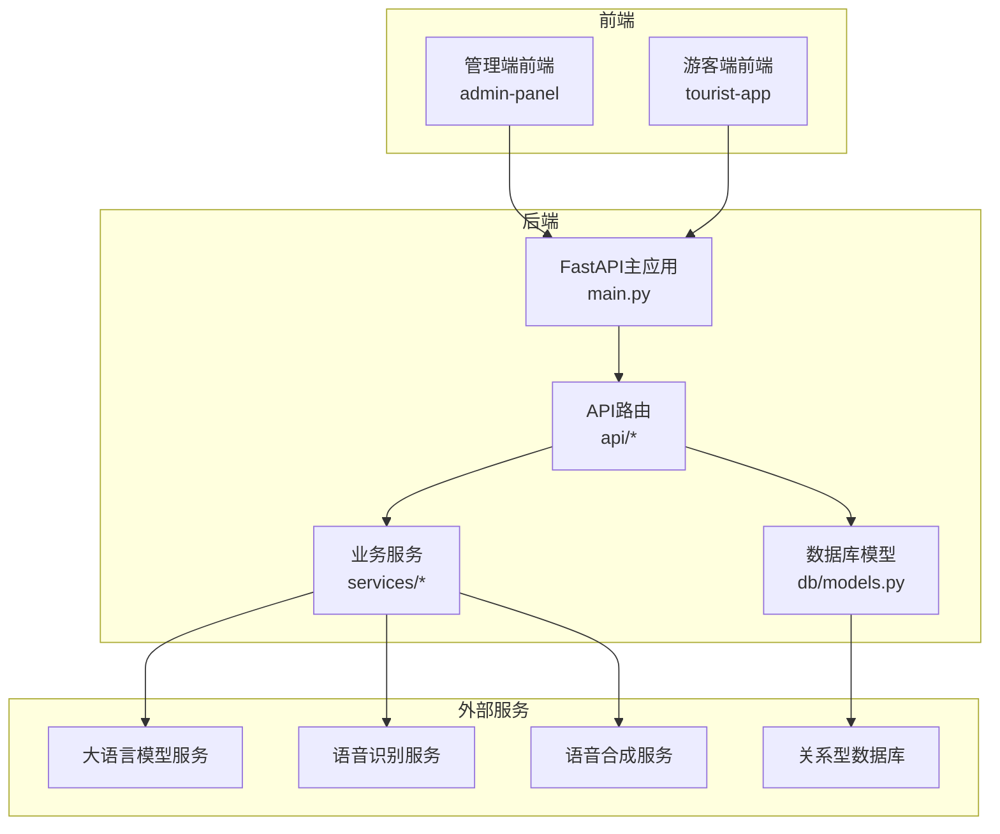
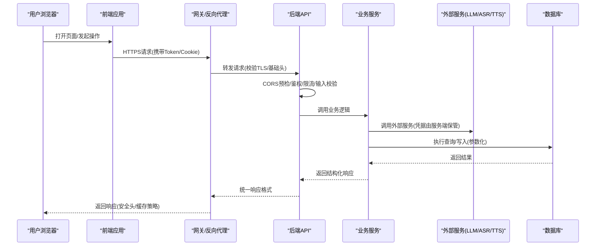
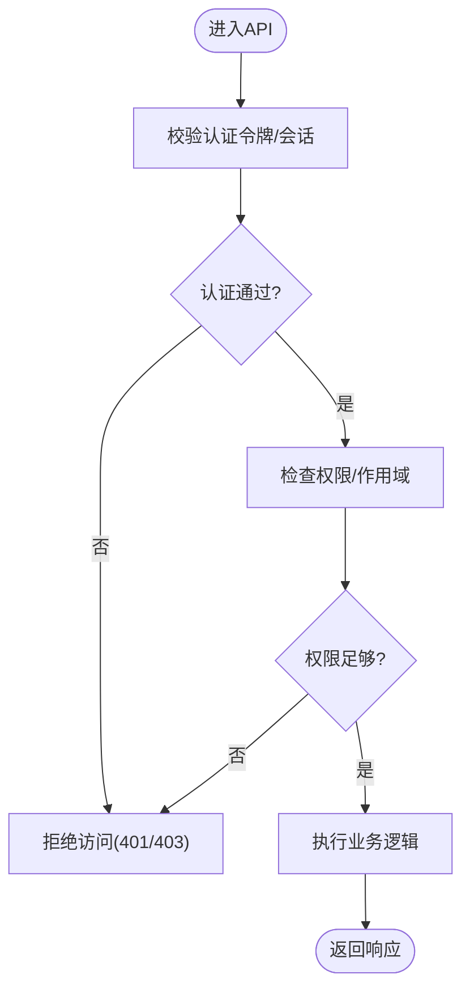
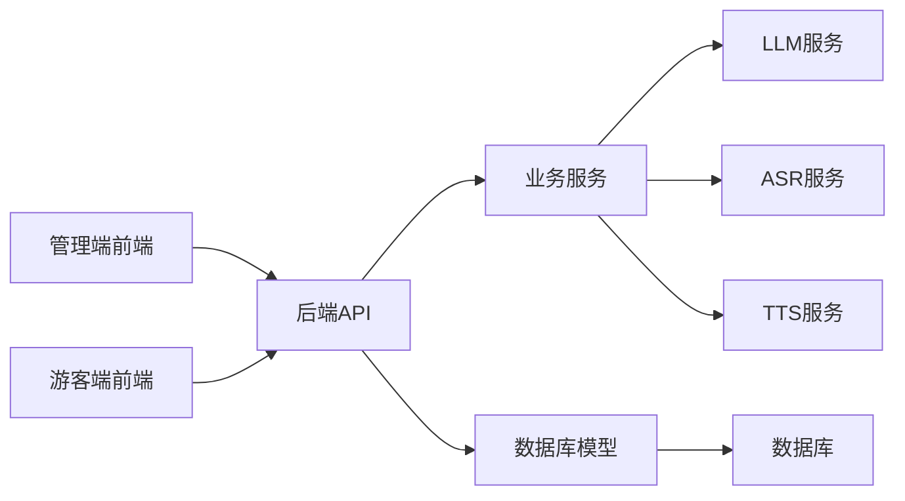

# 安全架构设计

<cite>
**本文引用的文件**   
- [backend/app/main.py](file://backend/app/main.py)
- [backend/app/config.py](file://backend/app/config.py)
- [backend/app/api/chat.py](file://backend/app/api/chat.py)
- [backend/app/db/models.py](file://backend/app/db/models.py)
- [backend/app/services/llm.py](file://backend/app/services/llm.py)
- [frontend/admin-panel/src/services/api.ts](file://frontend/admin-panel/src/services/api.ts)
- [frontend/tourist-app/src/services/api.ts](file://frontend/tourist-app/src/services/api.ts)
- [frontend/tourist-app/src/components/VoiceInput/VoiceInput.vue](file://frontend/tourist-app/src/components/VoiceInput/VoiceInput.vue)
- [docker-compose.yml](file://docker-compose.yml)
</cite>

## 目录
1. [引言](#引言)
2. [项目结构](#项目结构)
3. [核心组件](#核心组件)
4. [架构总览](#架构总览)
5. [详细组件分析](#详细组件分析)
6. [依赖分析](#依赖分析)
7. [性能考虑](#性能考虑)
8. [故障排查指南](#故障排查指南)
9. [结论](#结论)
10. [附录](#附录)

## 引言
本文件面向SmartTour系统的安全工程师与开发者，系统化阐述后端、前端与部署层的安全策略与防护措施。内容覆盖身份认证与授权、API访问控制、数据加密传输、敏感信息保护（API密钥、隐私数据、会话）、网络安全（HTTPS、CORS、限流、SQL注入防护）、前端安全（XSS、CSRF、输入验证）、以及安全审计与日志记录、威胁检测机制。文档同时提供可落地的实施建议与图示，帮助团队在现有代码基础上完善安全能力。

## 项目结构
SmartTour采用前后端分离与多服务编排：
- 后端：基于Python的Web服务，包含API路由、数据库模型、LLM与语音服务等。
- 前端：管理端与游客端两个独立应用，通过HTTP调用后端API。
- 部署：使用容器编排进行服务组合。

**图表来源** 
- [backend/app/main.py](file://backend/app/main.py)
- [backend/app/api/chat.py](file://backend/app/api/chat.py)
- [backend/app/db/models.py](file://backend/app/db/models.py)
- [backend/app/services/llm.py](file://backend/app/services/llm.py)
- [frontend/admin-panel/src/services/api.ts](file://frontend/admin-panel/src/services/api.ts)
- [frontend/tourist-app/src/services/api.ts](file://frontend/tourist-app/src/services/api.ts)

**章节来源**
- [backend/app/main.py](file://backend/app/main.py)
- [backend/app/api/chat.py](file://backend/app/api/chat.py)
- [backend/app/db/models.py](file://backend/app/db/models.py)
- [backend/app/services/llm.py](file://backend/app/services/llm.py)
- [frontend/admin-panel/src/services/api.ts](file://frontend/admin-panel/src/services/api.ts)
- [frontend/tourist-app/src/services/api.ts](file://frontend/tourist-app/src/services/api.ts)

## 核心组件
- 应用入口与中间件：负责全局配置、跨域、请求体大小限制、统一异常处理等。
- API路由层：按功能划分模块，承载鉴权、参数校验、权限控制与响应封装。
- 数据访问层：ORM模型定义、查询构建与事务边界。
- 外部服务集成：LLM、ASR、TTS等第三方或内部服务的调用封装。
- 前端API客户端：统一的请求封装、错误处理与安全头设置。

关键实现位置参考：
- 应用入口与中间件：[backend/app/main.py](file://backend/app/main.py)
- 聊天API示例：[backend/app/api/chat.py](file://backend/app/api/chat.py)
- 数据库模型：[backend/app/db/models.py](file://backend/app/db/models.py)
- LLM服务封装：[backend/app/services/llm.py](file://backend/app/services/llm.py)
- 管理端API客户端：[frontend/admin-panel/src/services/api.ts](file://frontend/admin-panel/src/services/api.ts)
- 游客端API客户端：[frontend/tourist-app/src/services/api.ts](file://frontend/tourist-app/src/services/api.ts)

**章节来源**
- [backend/app/main.py](file://backend/app/main.py)
- [backend/app/api/chat.py](file://backend/app/api/chat.py)
- [backend/app/db/models.py](file://backend/app/db/models.py)
- [backend/app/services/llm.py](file://backend/app/services/llm.py)
- [frontend/admin-panel/src/services/api.ts](file://frontend/admin-panel/src/services/api.ts)
- [frontend/tourist-app/src/services/api.ts](file://frontend/tourist-app/src/services/api.ts)

## 架构总览
下图展示从前端到后端的端到端请求路径，并标注安全相关的关键点（如HTTPS、CORS、鉴权、限流、输入校验、日志）。

**图表来源** 
- [backend/app/main.py](file://backend/app/main.py)
- [backend/app/api/chat.py](file://backend/app/api/chat.py)
- [backend/app/services/llm.py](file://backend/app/services/llm.py)
- [backend/app/db/models.py](file://backend/app/db/models.py)
- [frontend/tourist-app/src/services/api.ts](file://frontend/tourist-app/src/services/api.ts)
- [frontend/admin-panel/src/services/api.ts](file://frontend/admin-panel/src/services/api.ts)

## 详细组件分析

### 身份认证与授权机制
- 目标：确保只有合法用户与服务能访问受保护资源，并按角色/权限控制操作范围。
- 建议方案：
  - 用户登录：支持用户名/密码或第三方OAuth2/OIDC；返回短期JWT或会话Cookie。
  - 令牌校验：在API层引入统一鉴权中间件，校验签名、过期时间、作用域。
  - 权限控制：基于资源的RBAC或ABAC，结合路由装饰器或中间件实现细粒度授权。
  - 会话安全：优先使用HttpOnly+Secure+SameSite Cookie；若使用JWT，注意刷新与撤销策略。
  - 管理员接口：额外强校验（二次确认、IP白名单、设备指纹）。
- 落地位置参考：
  - 鉴权中间件与路由注册：[backend/app/main.py](file://backend/app/main.py)
  - 聊天API鉴权示例：[backend/app/api/chat.py](file://backend/app/api/chat.py)

**图表来源** 
- [backend/app/main.py](file://backend/app/main.py)
- [backend/app/api/chat.py](file://backend/app/api/chat.py)

**章节来源**
- [backend/app/main.py](file://backend/app/main.py)
- [backend/app/api/chat.py](file://backend/app/api/chat.py)

### API访问控制
- 目标：对API进行最小暴露、严格校验与可控访问。
- 措施：
  - 统一入口与路由分组，关闭调试接口。
  - 请求体大小限制、超时与重试上限。
  - 速率限制与熔断：按用户/IP/接口维度限流，防止滥用。
  - 输出过滤：避免泄露内部错误栈与敏感字段。
- 落地位置参考：
  - 全局配置与中间件：[backend/app/main.py](file://backend/app/main.py)
  - 具体API实现：[backend/app/api/chat.py](file://backend/app/api/chat.py)

**章节来源**
- [backend/app/main.py](file://backend/app/main.py)
- [backend/app/api/chat.py](file://backend/app/api/chat.py)

### 数据加密传输
- 目标：保障端到端通信机密性与完整性。
- 措施：
  - 强制HTTPS：在反向代理或网关层启用TLS证书与强套件。
  - HSTS、安全响应头（Strict-Transport-Security、Content-Type Options、X-Frame-Options等）。
  - 前端仅允许HTTPS请求，禁用明文协议。
- 落地位置参考：
  - 应用入口配置：[backend/app/main.py](file://backend/app/main.py)
  - 前端API客户端：[frontend/tourist-app/src/services/api.ts](file://frontend/tourist-app/src/services/api.ts)、[frontend/admin-panel/src/services/api.ts](file://frontend/admin-panel/src/services/api.ts)

**章节来源**
- [backend/app/main.py](file://backend/app/main.py)
- [frontend/tourist-app/src/services/api.ts](file://frontend/tourist-app/src/services/api.ts)
- [frontend/admin-panel/src/services/api.ts](file://frontend/admin-panel/src/services/api.ts)

### 敏感信息保护策略
- API密钥管理：
  - 所有密钥与凭据通过环境变量或密钥管理服务注入，禁止硬编码。
  - 对外部服务（LLM/ASR/TTS）的调用在服务端完成，不暴露至前端。
- 用户隐私数据保护：
  - 最小化采集原则，明确用途与保留期限。
  - 存储前脱敏/去标识化，必要时加密存储。
  - 访问审计与最小权限。
- 会话安全管理：
  - 使用安全的Cookie属性或短生命周期令牌。
  - 登出即失效，支持主动撤销。
- 落地位置参考：
  - 配置加载与环境变量：[backend/app/config.py](file://backend/app/config.py)
  - 外部服务调用封装（避免前端直连）：[backend/app/services/llm.py](file://backend/app/services/llm.py)

**章节来源**
- [backend/app/config.py](file://backend/app/config.py)
- [backend/app/services/llm.py](file://backend/app/services/llm.py)

### 网络安全措施
- HTTPS配置：
  - 在网关/反向代理层启用TLS，强制重定向HTTP到HTTPS。
  - 定期轮换证书，启用OCSP装订与HSTS。
- CORS策略：
  - 仅允许可信源，区分GET与POST/带凭证请求。
  - 预检请求缓存与最小暴露。
- 请求频率限制：
  - 基于IP/用户/接口的滑动窗口或令牌桶限流。
  - 针对AI生成类接口设置更严格的配额。
- SQL注入防护：
  - 使用ORM与参数化查询，禁止拼接SQL。
  - 输入校验与类型约束，拒绝非法字符。
- 落地位置参考：
  - 全局中间件与配置：[backend/app/main.py](file://backend/app/main.py)
  - 数据库模型与查询：[backend/app/db/models.py](file://backend/app/db/models.py)

**章节来源**
- [backend/app/main.py](file://backend/app/main.py)
- [backend/app/db/models.py](file://backend/app/db/models.py)

### 前端安全防护
- XSS防护：
  - 模板渲染自动转义，谨慎使用危险API（如innerHTML）。
  - 设置CSP策略，限制脚本来源。
- CSRF防护：
  - 使用SameSite Cookie与双因子提交（CSRF Token）。
  - 对状态变更接口要求自定义头或表单校验。
- 输入验证：
  - 前端快速校验提升体验，后端必须再次校验。
  - 对富文本/语音转写内容进行清洗与长度限制。
- 落地位置参考：
  - 游客端语音输入组件（涉及用户输入）：[frontend/tourist-app/src/components/VoiceInput/VoiceInput.vue](file://frontend/tourist-app/src/components/VoiceInput/VoiceInput.vue)
  - 前端API客户端（统一请求封装）：[frontend/tourist-app/src/services/api.ts](file://frontend/tourist-app/src/services/api.ts)、[frontend/admin-panel/src/services/api.ts](file://frontend/admin-panel/src/services/api.ts)

**章节来源**
- [frontend/tourist-app/src/components/VoiceInput/VoiceInput.vue](file://frontend/tourist-app/src/components/VoiceInput/VoiceInput.vue)
- [frontend/tourist-app/src/services/api.ts](file://frontend/tourist-app/src/services/api.ts)
- [frontend/admin-panel/src/services/api.ts](file://frontend/admin-panel/src/services/api.ts)

### 安全审计、日志记录与威胁检测
- 审计日志：
  - 记录关键操作（登录、权限变更、数据导出、外部调用），包含时间、主体、动作、结果、来源IP。
  - 日志脱敏，避免记录口令、密钥与敏感个人信息。
- 告警与检测：
  - 异常登录、暴力破解、高频失败、越权尝试等规则告警。
  - 结合WAF/网关层拦截恶意流量。
- 落地位置参考：
  - 应用入口与中间件（集中日志与异常处理）：[backend/app/main.py](file://backend/app/main.py)
  - API路由（按接口埋点）：[backend/app/api/chat.py](file://backend/app/api/chat.py)

**章节来源**
- [backend/app/main.py](file://backend/app/main.py)
- [backend/app/api/chat.py](file://backend/app/api/chat.py)

## 依赖分析
- 组件耦合：
  - API层依赖服务层与数据层，服务层依赖外部服务与数据库。
  - 前端通过API客户端与后端交互，不应直接依赖外部服务。
- 外部依赖：
  - LLM/ASR/TTS等服务需通过服务端代理调用，避免前端持有凭据。
- 潜在风险：
  - 外部服务不可用时的降级与熔断。
  - 第三方库漏洞治理与版本锁定。

**图表来源** 
- [backend/app/main.py](file://backend/app/main.py)
- [backend/app/api/chat.py](file://backend/app/api/chat.py)
- [backend/app/services/llm.py](file://backend/app/services/llm.py)
- [backend/app/db/models.py](file://backend/app/db/models.py)
- [frontend/admin-panel/src/services/api.ts](file://frontend/admin-panel/src/services/api.ts)
- [frontend/tourist-app/src/services/api.ts](file://frontend/tourist-app/src/services/api.ts)

**章节来源**
- [backend/app/main.py](file://backend/app/main.py)
- [backend/app/api/chat.py](file://backend/app/api/chat.py)
- [backend/app/services/llm.py](file://backend/app/services/llm.py)
- [backend/app/db/models.py](file://backend/app/db/models.py)
- [frontend/admin-panel/src/services/api.ts](file://frontend/admin-panel/src/services/api.ts)
- [frontend/tourist-app/src/services/api.ts](file://frontend/tourist-app/src/services/api.ts)

## 性能考虑
- 鉴权与限流应尽可能前置，减少无效请求进入业务层。
- 外部服务调用增加超时、重试与熔断策略，避免雪崩。
- 数据库查询优化与索引策略，避免N+1问题。
- 前端缓存与按需加载，减少重复请求。

## 故障排查指南
- 常见问题定位：
  - 鉴权失败：检查令牌签发、校验中间件与Cookie属性。
  - CORS报错：核对允许的源、方法与头部。
  - 限流触发：查看阈值与计数窗口配置。
  - SQL错误：确认参数化查询与输入校验。
- 日志与追踪：
  - 在API入口处添加请求ID，贯穿各层以便关联。
  - 对异常堆栈进行脱敏与采样上报。
- 参考位置：
  - 全局异常与日志：[backend/app/main.py](file://backend/app/main.py)
  - 接口级日志埋点：[backend/app/api/chat.py](file://backend/app/api/chat.py)

**章节来源**
- [backend/app/main.py](file://backend/app/main.py)
- [backend/app/api/chat.py](file://backend/app/api/chat.py)

## 结论
通过在应用入口、API层、数据层与前端统一落实认证授权、访问控制、传输加密、输入校验、限流与审计等措施，SmartTour可在现有架构上形成纵深防御体系。建议持续完善密钥管理、威胁检测与演练机制，确保安全能力随业务演进同步升级。

## 附录
- 部署与安全基线：
  - 容器编排中为服务间通信启用网络隔离与最小端口暴露。
  - 生产环境关闭调试模式与冗余接口。
- 参考位置：
  - 服务编排与安全上下文：[docker-compose.yml](file://docker-compose.yml)

**章节来源**
- [docker-compose.yml](file://docker-compose.yml)