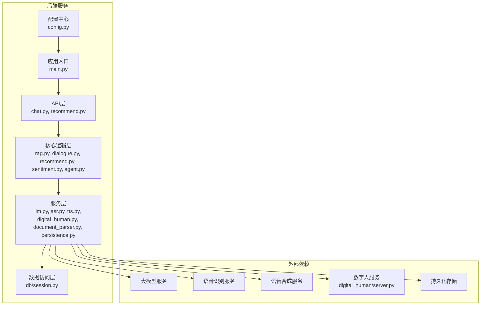
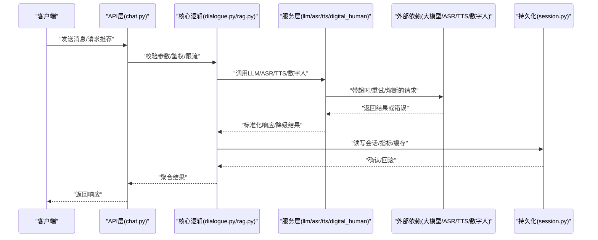
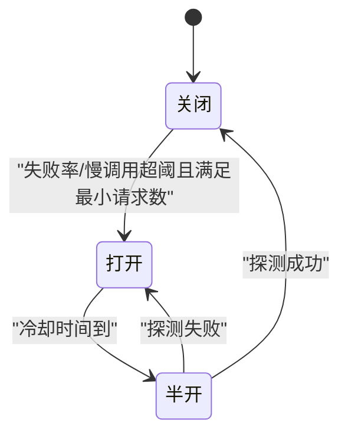
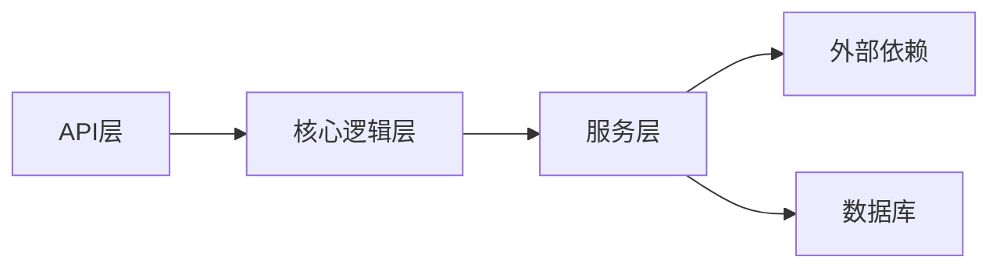

# 容错与可靠性设计

<cite>
**本文引用的文件**   
- [backend/app/main.py](file://backend/app/main.py)
- [backend/app/config.py](file://backend/app/config.py)
- [backend/app/services/llm.py](file://backend/app/services/llm.py)
- [backend/app/services/asr.py](file://backend/app/services/asr.py)
- [backend/app/services/tts.py](file://backend/app/services/tts.py)
- [backend/app/services/digital_human.py](file://backend/app/services/digital_human.py)
- [backend/app/services/document_parser.py](file://backend/app/services/document_parser.py)
- [backend/app/services/persistence.py](file://backend/app/services/persistence.py)
- [backend/app/db/session.py](file://backend/app/db/session.py)
- [backend/app/api/chat.py](file://backend/app/api/chat.py)
- [backend/app/api/recommend.py](file://backend/app/api/recommend.py)
- [backend/app/core/rag.py](file://backend/app/core/rag.py)
- [backend/app/core/dialogue.py](file://backend/app/core/dialogue.py)
- [backend/app/core/recommend.py](file://backend/app/core/recommend.py)
- [backend/app/core/sentiment.py](file://backend/app/core/sentiment.py)
- [backend/app/core/agent.py](file://backend/app/core/agent.py)
- [digital_human/server.py](file://digital_human/server.py)
- [docker-compose.yml](file://docker-compose.yml)
</cite>

## 目录
1. [引言](#引言)
2. [项目结构](#项目结构)
3. [核心组件](#核心组件)
4. [架构总览](#架构总览)
5. [详细组件分析](#详细组件分析)
6. [依赖关系分析](#依赖关系分析)
7. [性能考量](#性能考量)
8. [故障排查指南](#故障排查指南)
9. [结论](#结论)
10. [附录](#附录)

## 引言
本设计文档聚焦于SmartTour微服务的容错与可靠性，围绕以下目标展开：
- 熔断器模式：在外部依赖不稳定时快速失败并隔离故障，防止级联扩散。
- 重试策略：基于指数退避与最大重试次数限制，避免雪崩与抖动放大。
- 超时控制：为所有外部调用设置合理超时，避免线程/协程长期阻塞。
- 降级策略：当关键依赖不可用时提供可用但功能受限的备用路径。
- 健康检查与监控：实现服务健康端点、状态采集与自动恢复机制。
- 分布式事务与一致性：在跨服务/跨存储操作时采用补偿与幂等策略保障最终一致。
- 故障转移：通过多实例与健康探测实现流量切换与自愈。

## 项目结构
后端以FastAPI为核心，按“API层—核心逻辑层—服务层—数据访问层”分层组织；数字人服务独立部署并通过HTTP交互。

图表来源
- [backend/app/main.py](file://backend/app/main.py)
- [backend/app/api/chat.py](file://backend/app/api/chat.py)
- [backend/app/api/recommend.py](file://backend/app/api/recommend.py)
- [backend/app/core/rag.py](file://backend/app/core/rag.py)
- [backend/app/core/dialogue.py](file://backend/app/core/dialogue.py)
- [backend/app/core/recommend.py](file://backend/app/core/recommend.py)
- [backend/app/core/sentiment.py](file://backend/app/core/sentiment.py)
- [backend/app/core/agent.py](file://backend/app/core/agent.py)
- [backend/app/services/llm.py](file://backend/app/services/llm.py)
- [backend/app/services/asr.py](file://backend/app/services/asr.py)
- [backend/app/services/tts.py](file://backend/app/services/tts.py)
- [backend/app/services/digital_human.py](file://backend/app/services/digital_human.py)
- [backend/app/services/document_parser.py](file://backend/app/services/document_parser.py)
- [backend/app/services/persistence.py](file://backend/app/services/persistence.py)
- [backend/app/db/session.py](file://backend/app/db/session.py)
- [backend/app/config.py](file://backend/app/config.py)
- [digital_human/server.py](file://digital_human/server.py)

章节来源
- [backend/app/main.py](file://backend/app/main.py)
- [backend/app/config.py](file://backend/app/config.py)
- [backend/app/api/chat.py](file://backend/app/api/chat.py)
- [backend/app/api/recommend.py](file://backend/app/api/recommend.py)
- [backend/app/core/rag.py](file://backend/app/core/rag.py)
- [backend/app/core/dialogue.py](file://backend/app/core/dialogue.py)
- [backend/app/core/recommend.py](file://backend/app/core/recommend.py)
- [backend/app/core/sentiment.py](file://backend/app/core/sentiment.py)
- [backend/app/core/agent.py](file://backend/app/core/agent.py)
- [backend/app/services/llm.py](file://backend/app/services/llm.py)
- [backend/app/services/asr.py](file://backend/app/services/asr.py)
- [backend/app/services/tts.py](file://backend/app/services/tts.py)
- [backend/app/services/digital_human.py](file://backend/app/services/digital_human.py)
- [backend/app/services/document_parser.py](file://backend/app/services/document_parser.py)
- [backend/app/services/persistence.py](file://backend/app/services/persistence.py)
- [backend/app/db/session.py](file://backend/app/db/session.py)
- [digital_human/server.py](file://digital_human/server.py)

## 核心组件
- 应用入口与中间件：负责启动、路由注册、全局异常处理、健康检查端点挂载、CORS/请求日志等。
- 配置管理：集中管理超时、重试、熔断阈值、降级开关、健康探针等参数。
- 服务层封装：对LLM、ASR、TTS、数字人、文档解析、持久化等外部能力进行统一封装，内置重试、熔断、超时与降级。
- 核心逻辑层：编排业务流（对话、检索增强生成、推荐、情感分析、智能体），调用服务层完成具体动作。
- 数据访问层：数据库会话管理与连接池配置，确保资源释放与错误回滚。
- 数字人服务：独立进程，提供图像/视频渲染接口，具备自身健康检查与限流保护。

章节来源
- [backend/app/main.py](file://backend/app/main.py)
- [backend/app/config.py](file://backend/app/config.py)
- [backend/app/services/llm.py](file://backend/app/services/llm.py)
- [backend/app/services/asr.py](file://backend/app/services/asr.py)
- [backend/app/services/tts.py](file://backend/app/services/tts.py)
- [backend/app/services/digital_human.py](file://backend/app/services/digital_human.py)
- [backend/app/services/document_parser.py](file://backend/app/services/document_parser.py)
- [backend/app/services/persistence.py](file://backend/app/services/persistence.py)
- [backend/app/db/session.py](file://backend/app/db/session.py)

## 架构总览
下图展示一次“聊天+推荐+数字人播报”的典型调用链，以及各层的容错点。

图表来源
- [backend/app/api/chat.py](file://backend/app/api/chat.py)
- [backend/app/core/dialogue.py](file://backend/app/core/dialogue.py)
- [backend/app/core/rag.py](file://backend/app/core/rag.py)
- [backend/app/services/llm.py](file://backend/app/services/llm.py)
- [backend/app/services/asr.py](file://backend/app/services/asr.py)
- [backend/app/services/tts.py](file://backend/app/services/tts.py)
- [backend/app/services/digital_human.py](file://backend/app/services/digital_human.py)
- [backend/app/services/persistence.py](file://backend/app/services/persistence.py)
- [backend/app/db/session.py](file://backend/app/db/session.py)

## 详细组件分析

### 熔断器模式（Circuit Breaker）
- 适用场景：对大模型、ASR、TTS、数字人等外部依赖调用实施熔断，避免下游抖动导致上游雪崩。
- 状态机：关闭→半开→打开。关闭时正常放行；达到失败阈值或慢调用比例阈值后进入打开；等待冷却时间后进入半开试探少量请求，成功则关闭，失败则继续打开。
- 关键参数：失败率阈值、慢调用阈值、最小请求数、冷却时间、半开并发数。
- 实现要点：
  - 在服务层封装中为每个外部依赖维护独立的熔断器实例。
  - 记录最近窗口内的成功/失败/慢调用计数与耗时分布。
  - 半开阶段限制并发，仅允许少量探测请求。
  - 熔断触发时立即短路返回降级结果，减少延迟与资源占用。

图表来源
- [backend/app/services/llm.py](file://backend/app/services/llm.py)
- [backend/app/services/asr.py](file://backend/app/services/asr.py)
- [backend/app/services/tts.py](file://backend/app/services/tts.py)
- [backend/app/services/digital_human.py](file://backend/app/services/digital_human.py)
- [backend/app/services/document_parser.py](file://backend/app/services/document_parser.py)

章节来源
- [backend/app/services/llm.py](file://backend/app/services/llm.py)
- [backend/app/services/asr.py](file://backend/app/services/asr.py)
- [backend/app/services/tts.py](file://backend/app/services/tts.py)
- [backend/app/services/digital_human.py](file://backend/app/services/digital_human.py)
- [backend/app/services/document_parser.py](file://backend/app/services/document_parser.py)

### 重试策略（指数退避与最大重试次数）
- 适用性：仅对幂等或可安全重试的操作启用（如查询、去重写入）。写操作需结合幂等键与补偿。
- 算法：基础间隔×指数增长，叠加抖动因子，避免同步风暴。
- 限制：最大重试次数、单次重试最大间隔、总重试超时上限。
- 失败判定：网络错误、超时、特定HTTP状态码、业务错误码。
- 实现要点：
  - 在服务层封装中统一注入重试装饰器/包装函数。
  - 将重试与熔断组合：熔断打开时跳过重试直接降级。
  - 记录重试次数与耗时用于监控告警。

```mermaid
flowchart TD
Start(["开始"]) --> CheckCB["熔断是否打开?"]
CheckCB --> |是| Fallback["返回降级结果"]
CheckCB --> |否| Attempt["发起请求"]
Attempt --> Success{"成功?"}
Success --> |是| ReturnOK["返回结果"]
Success --> |否| RetryCount{"已达最大重试?"}
RetryCount --> |是| Fallback
RetryCount --> |否| Backoff["计算退避间隔(含抖动)"]
Backoff --> Sleep["等待"]
Sleep --> Attempt
```

图表来源
- [backend/app/services/llm.py](file://backend/app/services/llm.py)
- [backend/app/services/asr.py](file://backend/app/services/asr.py)
- [backend/app/services/tts.py](file://backend/app/services/tts.py)
- [backend/app/services/digital_human.py](file://backend/app/services/digital_human.py)
- [backend/app/services/document_parser.py](file://backend/app/services/document_parser.py)

章节来源
- [backend/app/services/llm.py](file://backend/app/services/llm.py)
- [backend/app/services/asr.py](file://backend/app/services/asr.py)
- [backend/app/services/tts.py](file://backend/app/services/tts.py)
- [backend/app/services/digital_human.py](file://backend/app/services/digital_human.py)
- [backend/app/services/document_parser.py](file://backend/app/services/document_parser.py)

### 超时控制机制
- 原则：所有外部调用必须设置合理的请求超时与连接超时，避免线程/协程长期阻塞。
- 层级：
  - HTTP客户端：连接超时、读超时、写超时。
  - 服务层：整体调用超时，内部子步骤拆分超时。
  - 网关/反向代理：上游超时与缓冲限制。
- 建议值：根据SLA与P99目标设定，典型范围毫秒至秒级，结合重试与熔断综合评估。
- 实现要点：
  - 在服务层封装中强制传入超时参数，未显式设置则使用默认安全值。
  - 超时异常归类为“可重试错误”，由重试策略决定是否重试。

章节来源
- [backend/app/services/llm.py](file://backend/app/services/llm.py)
- [backend/app/services/asr.py](file://backend/app/services/asr.py)
- [backend/app/services/tts.py](file://backend/app/services/tts.py)
- [backend/app/services/digital_human.py](file://backend/app/services/digital_human.py)
- [backend/app/services/document_parser.py](file://backend/app/services/document_parser.py)

### 降级策略设计
- 触发条件：熔断打开、超时、依赖返回错误、资源不足（CPU/内存/队列满）。
- 策略类型：
  - 快速失败：返回明确错误码与友好提示。
  - 缓存命中：返回最近成功结果或过期容忍的数据。
  - 简化流程：跳过非核心步骤（如情感分析、个性化推荐）。
  - 默认内容：使用模板化回复或通用答案。
- 实现要点：
  - 在服务层封装中定义统一的降级回调。
  - 在核心逻辑层提供降级分支，保证主流程可用。
  - 对外暴露降级开关，支持动态调整。

章节来源
- [backend/app/core/dialogue.py](file://backend/app/core/dialogue.py)
- [backend/app/core/rag.py](file://backend/app/core/rag.py)
- [backend/app/core/recommend.py](file://backend/app/core/recommend.py)
- [backend/app/core/sentiment.py](file://backend/app/core/sentiment.py)
- [backend/app/services/llm.py](file://backend/app/services/llm.py)
- [backend/app/services/asr.py](file://backend/app/services/asr.py)
- [backend/app/services/tts.py](file://backend/app/services/tts.py)
- [backend/app/services/digital_human.py](file://backend/app/services/digital_human.py)

### 健康检查与监控
- 健康检查端点：
  - /health：存活探针，检查进程状态、依赖可达性（可选）。
  - /ready：就绪探针，检查数据库连接、缓存、外部依赖初始化完成。
- 指标上报：QPS、延迟分位、错误率、熔断状态、重试次数、降级次数、连接池使用率。
- 自动恢复：
  - 容器编排层根据健康探针重启不健康实例。
  - 熔断半开探测成功后自动恢复正常流量。
  - 连接池/线程池空闲回收与扩容。
- 实现要点：
  - 在应用入口注册健康与就绪端点。
  - 在服务层埋点统计，输出结构化日志与指标。
  - 配置Prometheus/Grafana或等效方案进行可视化。

章节来源
- [backend/app/main.py](file://backend/app/main.py)
- [backend/app/db/session.py](file://backend/app/db/session.py)
- [backend/app/services/persistence.py](file://backend/app/services/persistence.py)

### 分布式事务与一致性
- 挑战：跨服务/跨存储的最终一致性难以用强一致事务保证。
- 策略：
  - 本地事务+消息表/出队表：先落库再发消息，消费者幂等消费。
  - 补偿事务（Saga）：长流程拆分为多个步骤，失败执行逆向补偿。
  - 幂等键：为写操作生成唯一ID，服务端去重。
  - 死信队列与重试：失败消息入DLQ，人工介入或定时重试。
- 实现要点：
  - 在持久化服务中封装事务边界与补偿逻辑。
  - 在核心逻辑层编排Saga步骤与补偿顺序。
  - 对外暴露幂等接口，客户端携带幂等键。

章节来源
- [backend/app/services/persistence.py](file://backend/app/services/persistence.py)
- [backend/app/db/session.py](file://backend/app/db/session.py)
- [backend/app/core/dialogue.py](file://backend/app/core/dialogue.py)
- [backend/app/core/rag.py](file://backend/app/core/rag.py)

### 故障转移与高可用
- 多实例部署：同一服务多副本，负载均衡分发流量。
- 健康探测：Kubernetes/编排平台依据健康端点剔除不健康实例。
- 区域/可用性域隔离：跨AZ部署，单域故障不影响整体。
- 连接复用与池化：数据库/HTTP连接池提升吞吐与稳定性。
- 限流与背压：在入口或服务层限流，防止过载。

章节来源
- [docker-compose.yml](file://docker-compose.yml)
- [backend/app/main.py](file://backend/app/main.py)
- [backend/app/db/session.py](file://backend/app/db/session.py)

## 依赖关系分析
- 耦合度：API层仅编排参数与路由，核心逻辑层专注业务流程，服务层屏蔽外部差异，降低耦合。
- 内聚性：服务层按能力划分（LLM/ASR/TTS/数字人/文档解析/持久化），职责清晰。
- 外部依赖：大模型、ASR、TTS、数字人均为外部系统，需统一封装容错。
- 潜在环依赖：应避免核心逻辑与服务层相互引用，保持单向依赖。

图表来源
- [backend/app/api/chat.py](file://backend/app/api/chat.py)
- [backend/app/api/recommend.py](file://backend/app/api/recommend.py)
- [backend/app/core/rag.py](file://backend/app/core/rag.py)
- [backend/app/core/dialogue.py](file://backend/app/core/dialogue.py)
- [backend/app/core/recommend.py](file://backend/app/core/recommend.py)
- [backend/app/core/sentiment.py](file://backend/app/core/sentiment.py)
- [backend/app/core/agent.py](file://backend/app/core/agent.py)
- [backend/app/services/llm.py](file://backend/app/services/llm.py)
- [backend/app/services/asr.py](file://backend/app/services/asr.py)
- [backend/app/services/tts.py](file://backend/app/services/tts.py)
- [backend/app/services/digital_human.py](file://backend/app/services/digital_human.py)
- [backend/app/services/document_parser.py](file://backend/app/services/document_parser.py)
- [backend/app/services/persistence.py](file://backend/app/services/persistence.py)
- [backend/app/db/session.py](file://backend/app/db/session.py)

章节来源
- [backend/app/api/chat.py](file://backend/app/api/chat.py)
- [backend/app/api/recommend.py](file://backend/app/api/recommend.py)
- [backend/app/core/rag.py](file://backend/app/core/rag.py)
- [backend/app/core/dialogue.py](file://backend/app/core/dialogue.py)
- [backend/app/core/recommend.py](file://backend/app/core/recommend.py)
- [backend/app/core/sentiment.py](file://backend/app/core/sentiment.py)
- [backend/app/core/agent.py](file://backend/app/core/agent.py)
- [backend/app/services/llm.py](file://backend/app/services/llm.py)
- [backend/app/services/asr.py](file://backend/app/services/asr.py)
- [backend/app/services/tts.py](file://backend/app/services/tts.py)
- [backend/app/services/digital_human.py](file://backend/app/services/digital_human.py)
- [backend/app/services/document_parser.py](file://backend/app/services/document_parser.py)
- [backend/app/services/persistence.py](file://backend/app/services/persistence.py)
- [backend/app/db/session.py](file://backend/app/db/session.py)

## 性能考量
- 连接池与并发：数据库与HTTP连接池大小需根据负载与外部依赖容量调优。
- 批处理与合并：对批量请求进行合并以减少外部调用次数。
- 缓存：热点数据与中间结果缓存，降低重复计算与外部压力。
- 异步与非阻塞：I/O密集型操作尽量异步，避免阻塞事件循环。
- 资源隔离：不同外部依赖使用独立线程池/连接池，避免互相影响。
- 压测与容量规划：基于P99/P999延迟与错误率目标进行容量规划与弹性伸缩。

[本节为通用指导，无需代码来源]

## 故障排查指南
- 常见问题定位：
  - 超时：检查外部依赖延迟、连接池耗尽、线程/协程阻塞。
  - 熔断频繁打开：观察错误率与慢调用比例，调整阈值与冷却时间。
  - 重试风暴：检查抖动与最大重试次数，必要时引入退避上限与全局限流。
  - 降级过多：评估降级策略是否过于激进，优化上游稳定性。
- 诊断手段：
  - 健康与就绪端点：确认服务状态与依赖可达性。
  - 指标与日志：关注错误码分布、重试次数、熔断状态、延迟分位。
  - 链路追踪：串联API→核心→服务→外部依赖，定位瓶颈与失败点。
- 应急措施：
  - 临时扩大超时与重试上限（谨慎），优先开启降级。
  - 滚动重启不健康实例，清理僵死连接。
  - 回滚变更，恢复稳定版本。

章节来源
- [backend/app/main.py](file://backend/app/main.py)
- [backend/app/services/llm.py](file://backend/app/services/llm.py)
- [backend/app/services/asr.py](file://backend/app/services/asr.py)
- [backend/app/services/tts.py](file://backend/app/services/tts.py)
- [backend/app/services/digital_human.py](file://backend/app/services/digital_human.py)
- [backend/app/services/document_parser.py](file://backend/app/services/document_parser.py)
- [backend/app/services/persistence.py](file://backend/app/services/persistence.py)
- [backend/app/db/session.py](file://backend/app/db/session.py)

## 结论
通过在服务层统一实现熔断、重试、超时与降级，并在核心逻辑层提供降级分支与一致性保障，SmartTour能够在外部依赖不稳定时维持基本可用性与用户体验。配合健康检查、监控与自动恢复机制，系统具备较强的韧性与可运维性。建议在上线前完成容量规划与压测，持续优化阈值与策略，确保在真实负载下稳定运行。

[本节为总结，无需代码来源]

## 附录
- 配置项建议（示例字段，具体以实际实现为准）：
  - 超时：connect_timeout、read_timeout、write_timeout、total_timeout
  - 重试：max_retries、base_backoff、max_backoff、jitter_factor、retryable_errors
  - 熔断：failure_rate_threshold、slow_call_threshold、min_requests、cool_down_seconds、half_open_concurrency
  - 降级：fallback_enabled、cache_ttl、default_response
  - 健康：liveness_path、readiness_path、dependency_checks
- 参考实现位置：
  - 应用入口与健康端点：[backend/app/main.py](file://backend/app/main.py)
  - 配置中心：[backend/app/config.py](file://backend/app/config.py)
  - 服务层封装（LLM/ASR/TTS/数字人/文档解析/持久化）：
    - [backend/app/services/llm.py](file://backend/app/services/llm.py)
    - [backend/app/services/asr.py](file://backend/app/services/asr.py)
    - [backend/app/services/tts.py](file://backend/app/services/tts.py)
    - [backend/app/services/digital_human.py](file://backend/app/services/digital_human.py)
    - [backend/app/services/document_parser.py](file://backend/app/services/document_parser.py)
    - [backend/app/services/persistence.py](file://backend/app/services/persistence.py)
  - 核心逻辑（对话/RAG/推荐/情感/智能体）：
    - [backend/app/core/dialogue.py](file://backend/app/core/dialogue.py)
    - [backend/app/core/rag.py](file://backend/app/core/rag.py)
    - [backend/app/core/recommend.py](file://backend/app/core/recommend.py)
    - [backend/app/core/sentiment.py](file://backend/app/core/sentiment.py)
    - [backend/app/core/agent.py](file://backend/app/core/agent.py)
  - 数据访问与会话：
    - [backend/app/db/session.py](file://backend/app/db/session.py)
  - 数字人服务：
    - [digital_human/server.py](file://digital_human/server.py)
  - 编排与多实例：
    - [docker-compose.yml](file://docker-compose.yml)