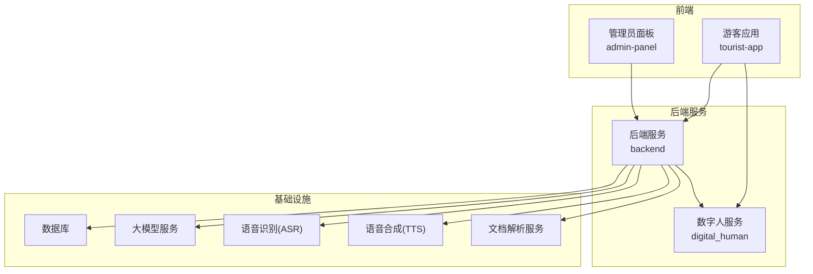
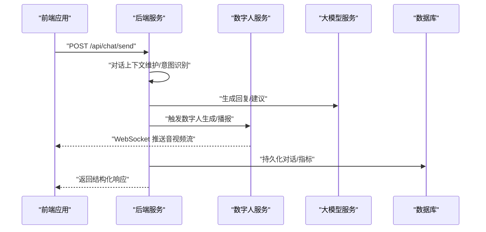
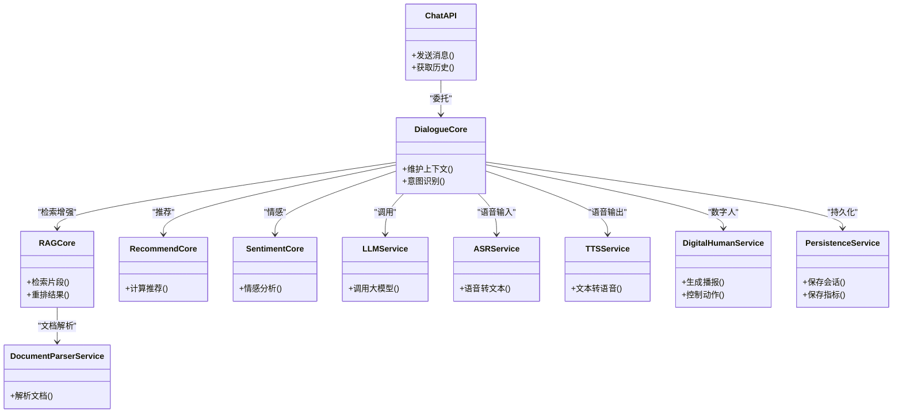
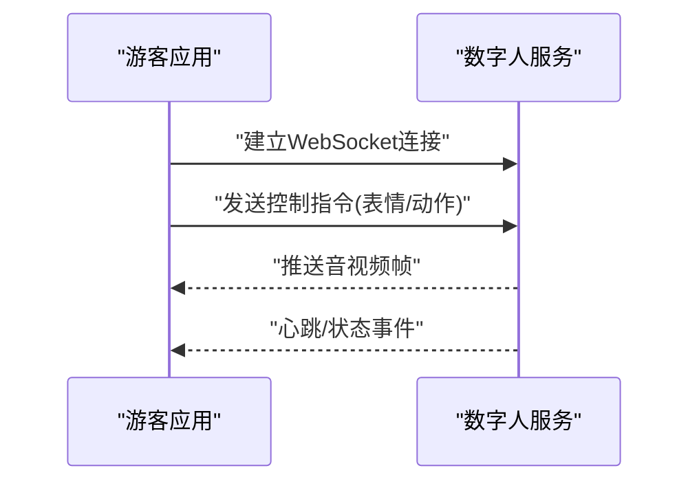
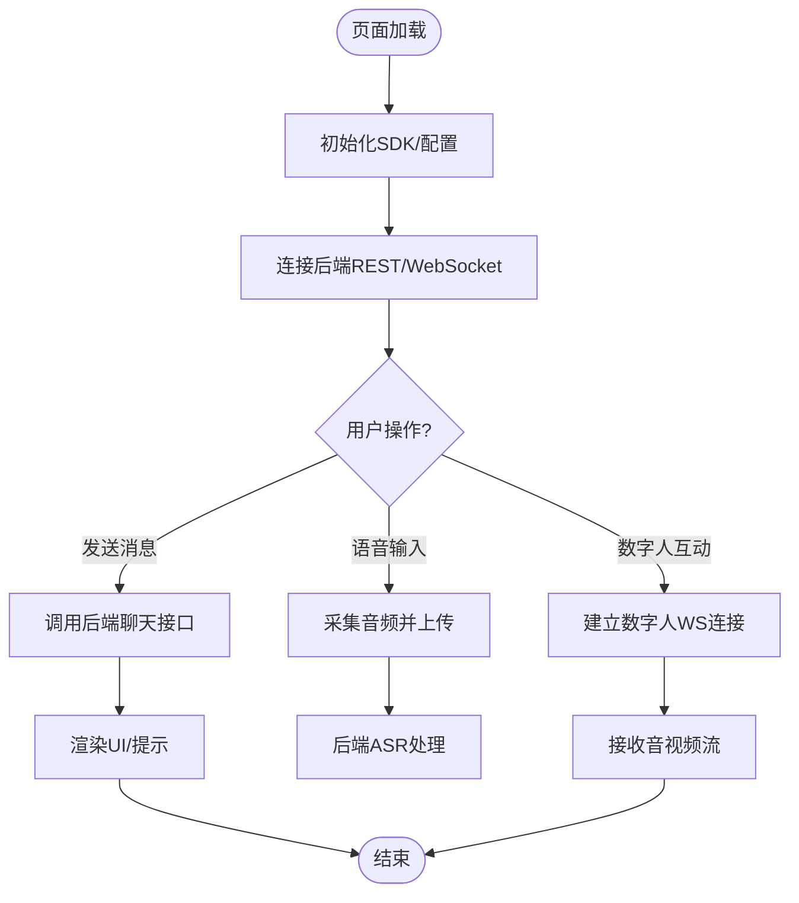
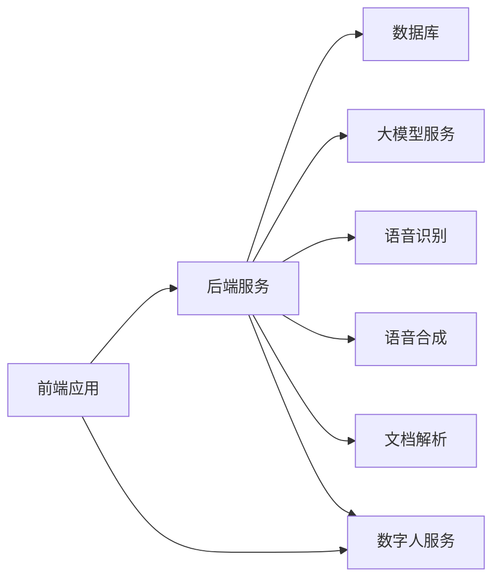
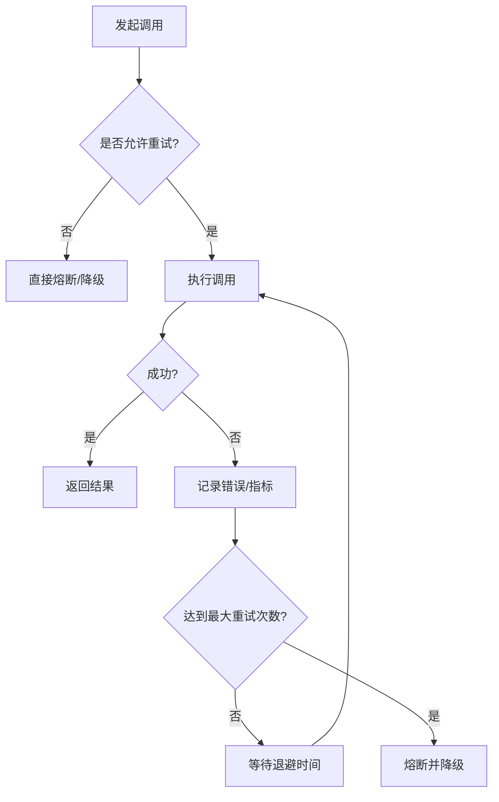

# 微服务架构设计

<cite>
**本文引用的文件**   
- [backend/app/main.py](file://backend/app/main.py)
- [backend/app/config.py](file://backend/app/config.py)
- [backend/app/api/chat.py](file://backend/app/api/chat.py)
- [backend/app/api/analytics.py](file://backend/app/api/analytics.py)
- [backend/app/api/avatar.py](file://backend/app/api/avatar.py)
- [backend/app/api/digital_human_broadcast.py](file://backend/app/api/digital_human_broadcast.py)
- [backend/app/api/knowledge.py](file://backend/app/api/knowledge.py)
- [backend/app/api/recommend.py](file://backend/app/api/recommend.py)
- [backend/app/core/agent.py](file://backend/app/core/agent.py)
- [backend/app/core/dialogue.py](file://backend/app/core/dialogue.py)
- [backend/app/core/rag.py](file://backend/app/core/rag.py)
- [backend/app/core/recommend.py](file://backend/app/core/recommend.py)
- [backend/app/core/sentiment.py](file://backend/app/core/sentiment.py)
- [backend/app/services/asr.py](file://backend/app/services/asr.py)
- [backend/app/services/tts.py](file://backend/app/services/tts.py)
- [backend/app/services/digital_human.py](file://backend/app/services/digital_human.py)
- [backend/app/services/document_parser.py](file://backend/app/services/document_parser.py)
- [backend/app/services/llm.py](file://backend/app/services/llm.py)
- [backend/app/services/persistence.py](file://backend/app/services/persistence.py)
- [backend/app/db/models.py](file://backend/app/db/models.py)
- [backend/app/db/session.py](file://backend/app/db/session.py)
- [backend/Dockerfile](file://backend/Dockerfile)
- [digital_human/server.py](file://digital_human/server.py)
- [digital_human/Dockerfile](file://digital_human/Dockerfile)
- [frontend/admin-panel/src/services/api.ts](file://frontend/admin-panel/src/services/api.ts)
- [frontend/tourist-app/src/services/api.ts](file://frontend/tourist-app/src/services/api.ts)
- [frontend/tourist-app/src/components/VoiceInput/VoiceInput.vue](file://frontend/tourist-app/src/components/VoiceInput/VoiceInput.vue)
- [frontend/tourist-app/src/components/DigitalHuman/DigitalHuman.vue](file://frontend/tourist-app/src/components/DigitalHuman/DigitalHuman.vue)
- [docker-compose.yml](file://docker-compose.yml)
</cite>

## 目录
1. [引言](#引言)
2. [项目结构](#项目结构)
3. [核心组件](#核心组件)
4. [架构总览](#架构总览)
5. [详细组件分析](#详细组件分析)
6. [依赖关系分析](#依赖关系分析)
7. [性能与扩展性](#性能与扩展性)
8. [故障处理与容错](#故障处理与容错)
9. [运维与可观测性](#运维与可观测性)
10. [结论](#结论)
11. [附录：通信协议规范](#附录通信协议规范)

## 引言
本设计文档面向系统架构师与DevOps工程师，围绕SmartTour项目的微服务划分、服务边界、通信机制、服务发现与注册、负载均衡、容错与熔断、重试策略、监控与可观测性等主题进行系统化阐述。目标是为后端服务、数字人服务、前端应用的独立部署与服务治理提供清晰指导。

## 项目结构
仓库采用多模块组织方式，按“领域+前后端”的维度拆分：
- backend：智能导览后端服务（REST API、对话编排、RAG、推荐、ASR/TTS集成、持久化等）
- digital_human：数字人渲染与流式播放服务
- frontend：管理后台与游客应用两个前端工程
- docker-compose.yml：本地编排入口

图表来源
- [docker-compose.yml](file://docker-compose.yml)
- [backend/app/main.py](file://backend/app/main.py)
- [digital_human/server.py](file://digital_human/server.py)

章节来源
- [docker-compose.yml](file://docker-compose.yml)
- [backend/app/main.py](file://backend/app/main.py)
- [digital_human/server.py](file://digital_human/server.py)

## 核心组件
- 后端服务（backend）
  - 对外暴露REST API，负责对话编排、知识检索增强（RAG）、推荐、用户画像与情感分析、音视频能力编排（ASR/TTS）、数字人控制、数据分析等。
  - 内部分层：API层 -> 核心逻辑层（Agent/Dialogue/RAG/Recommend/Sentiment）-> 服务层（LLM/ASR/TTS/DigitalHuman/Persistence/DocumentParser）-> 数据访问层（DB）。
- 数字人服务（digital_human）
  - 提供数字人形象渲染、动作驱动、音视频流输出能力，供前端直接调用或经后端编排调用。
- 前端应用（frontend）
  - 管理后台：知识库管理、头像配置、数据分析等。
  - 游客应用：聊天交互、语音输入、数字人展示、路线规划等。

章节来源
- [backend/app/main.py](file://backend/app/main.py)
- [backend/app/api/chat.py](file://backend/app/api/chat.py)
- [backend/app/api/analytics.py](file://backend/app/api/analytics.py)
- [backend/app/api/avatar.py](file://backend/app/api/avatar.py)
- [backend/app/api/digital_human_broadcast.py](file://backend/app/api/digital_human_broadcast.py)
- [backend/app/api/knowledge.py](file://backend/app/api/knowledge.py)
- [backend/app/api/recommend.py](file://backend/app/api/recommend.py)
- [backend/app/core/agent.py](file://backend/app/core/agent.py)
- [backend/app/core/dialogue.py](file://backend/app/core/dialogue.py)
- [backend/app/core/rag.py](file://backend/app/core/rag.py)
- [backend/app/core/recommend.py](file://backend/app/core/recommend.py)
- [backend/app/core/sentiment.py](file://backend/app/core/sentiment.py)
- [backend/app/services/asr.py](file://backend/app/services/asr.py)
- [backend/app/services/tts.py](file://backend/app/services/tts.py)
- [backend/app/services/digital_human.py](file://backend/app/services/digital_human.py)
- [backend/app/services/document_parser.py](file://backend/app/services/document_parser.py)
- [backend/app/services/llm.py](file://backend/app/services/llm.py)
- [backend/app/services/persistence.py](file://backend/app/services/persistence.py)
- [backend/app/db/models.py](file://backend/app/db/models.py)
- [backend/app/db/session.py](file://backend/app/db/session.py)
- [digital_human/server.py](file://digital_human/server.py)
- [frontend/admin-panel/src/services/api.ts](file://frontend/admin-panel/src/services/api.ts)
- [frontend/tourist-app/src/services/api.ts](file://frontend/tourist-app/src/services/api.ts)

## 架构总览
整体采用“前后端分离 + 领域微服务”的架构形态：
- 前端通过网关或直接HTTP调用后端REST API；实时场景使用WebSocket直连数字人服务。
- 后端作为业务编排中心，聚合LLM、ASR、TTS、文档解析、数字人等外部能力，并通过数据库持久化会话与知识索引。
- 数字人服务独立部署，专注渲染与流媒体输出，降低主服务资源压力。

图表来源
- [backend/app/api/chat.py](file://backend/app/api/chat.py)
- [backend/app/core/dialogue.py](file://backend/app/core/dialogue.py)
- [backend/app/services/llm.py](file://backend/app/services/llm.py)
- [backend/app/services/digital_human.py](file://backend/app/services/digital_human.py)
- [digital_human/server.py](file://digital_human/server.py)
- [backend/app/db/persistence.py](file://backend/app/services/persistence.py)

## 详细组件分析

### 后端服务（backend）
职责边界
- 统一API入口与路由分发
- 对话编排与状态管理
- RAG检索与推荐计算
- 外部AI能力编排（LLM/ASR/TTS/文档解析）
- 数字人控制与广播
- 指标与分析数据持久化

关键路径
- 聊天流程：API -> 对话核心 -> LLM/ASR/TTS -> 数字人 -> 持久化
- 知识管理：API -> 文档解析 -> 索引/存储
- 推荐与画像：API -> 推荐/情感 -> 持久化

图表来源
- [backend/app/api/chat.py](file://backend/app/api/chat.py)
- [backend/app/core/dialogue.py](file://backend/app/core/dialogue.py)
- [backend/app/core/rag.py](file://backend/app/core/rag.py)
- [backend/app/core/recommend.py](file://backend/app/core/recommend.py)
- [backend/app/core/sentiment.py](file://backend/app/core/sentiment.py)
- [backend/app/services/llm.py](file://backend/app/services/llm.py)
- [backend/app/services/asr.py](file://backend/app/services/asr.py)
- [backend/app/services/tts.py](file://backend/app/services/tts.py)
- [backend/app/services/digital_human.py](file://backend/app/services/digital_human.py)
- [backend/app/services/document_parser.py](file://backend/app/services/document_parser.py)
- [backend/app/services/persistence.py](file://backend/app/services/persistence.py)

章节来源
- [backend/app/api/chat.py](file://backend/app/api/chat.py)
- [backend/app/core/dialogue.py](file://backend/app/core/dialogue.py)
- [backend/app/core/rag.py](file://backend/app/core/rag.py)
- [backend/app/core/recommend.py](file://backend/app/core/recommend.py)
- [backend/app/core/sentiment.py](file://backend/app/core/sentiment.py)
- [backend/app/services/llm.py](file://backend/app/services/llm.py)
- [backend/app/services/asr.py](file://backend/app/services/asr.py)
- [backend/app/services/tts.py](file://backend/app/services/tts.py)
- [backend/app/services/digital_human.py](file://backend/app/services/digital_human.py)
- [backend/app/services/document_parser.py](file://backend/app/services/document_parser.py)
- [backend/app/services/persistence.py](file://backend/app/services/persistence.py)

### 数字人服务（digital_human）
职责边界
- 接收后端或前端的指令，驱动数字人形象与动作
- 输出音视频流（如WebRTC/RTMP/HLS），支持低延迟直播体验
- 提供健康检查与扩缩容友好的无状态接口

图表来源
- [digital_human/server.py](file://digital_human/server.py)
- [frontend/tourist-app/src/components/DigitalHuman/DigitalHuman.vue](file://frontend/tourist-app/src/components/DigitalHuman/DigitalHuman.vue)

章节来源
- [digital_human/server.py](file://digital_human/server.py)
- [frontend/tourist-app/src/components/DigitalHuman/DigitalHuman.vue](file://frontend/tourist-app/src/components/DigitalHuman/DigitalHuman.vue)

### 前端应用（frontend）
职责边界
- 管理后台：知识库上传、头像配置、数据分析看板
- 游客应用：聊天界面、语音输入、数字人渲染、路线规划

图表来源
- [frontend/admin-panel/src/services/api.ts](file://frontend/admin-panel/src/services/api.ts)
- [frontend/tourist-app/src/services/api.ts](file://frontend/tourist-app/src/services/api.ts)
- [frontend/tourist-app/src/components/VoiceInput/VoiceInput.vue](file://frontend/tourist-app/src/components/VoiceInput/VoiceInput.vue)
- [frontend/tourist-app/src/components/DigitalHuman/DigitalHuman.vue](file://frontend/tourist-app/src/components/DigitalHuman/DigitalHuman.vue)

章节来源
- [frontend/admin-panel/src/services/api.ts](file://frontend/admin-panel/src/services/api.ts)
- [frontend/tourist-app/src/services/api.ts](file://frontend/tourist-app/src/services/api.ts)
- [frontend/tourist-app/src/components/VoiceInput/VoiceInput.vue](file://frontend/tourist-app/src/components/VoiceInput/VoiceInput.vue)
- [frontend/tourist-app/src/components/DigitalHuman/DigitalHuman.vue](file://frontend/tourist-app/src/components/DigitalHuman/DigitalHuman.vue)

## 依赖关系分析
- 后端服务依赖
  - 外部AI：LLM、ASR、TTS、文档解析
  - 数字人服务：用于渲染与播报
  - 数据库：会话、指标、知识索引等
- 前端依赖
  - 后端REST API
  - 数字人WebSocket流
- 数字人服务依赖
  - 渲染引擎/媒体库
  - 可选：后端控制面（指令下发）

图表来源
- [backend/app/main.py](file://backend/app/main.py)
- [backend/app/services/llm.py](file://backend/app/services/llm.py)
- [backend/app/services/asr.py](file://backend/app/services/asr.py)
- [backend/app/services/tts.py](file://backend/app/services/tts.py)
- [backend/app/services/document_parser.py](file://backend/app/services/document_parser.py)
- [backend/app/services/digital_human.py](file://backend/app/services/digital_human.py)
- [digital_human/server.py](file://digital_human/server.py)

章节来源
- [backend/app/main.py](file://backend/app/main.py)
- [backend/app/services/llm.py](file://backend/app/services/llm.py)
- [backend/app/services/asr.py](file://backend/app/services/asr.py)
- [backend/app/services/tts.py](file://backend/app/services/tts.py)
- [backend/app/services/document_parser.py](file://backend/app/services/document_parser.py)
- [backend/app/services/digital_human.py](file://backend/app/services/digital_human.py)
- [digital_human/server.py](file://digital_human/server.py)

## 性能与扩展性
- 水平扩展
  - 后端服务无状态化，便于多副本部署；结合负载均衡器实现请求分流。
  - 数字人服务为CPU/GPU密集型，建议按实例隔离与GPU资源配额管理。
- 缓存与异步
  - 对热点问答与推荐结果引入缓存层，降低LLM与数据库压力。
  - 将耗时任务（文档解析、批量推荐）放入消息队列异步处理。
- 连接复用与超时
  - 对外部AI服务调用启用连接池与合理超时，避免雪崩。
- 流式传输优化
  - 数字人音视频流采用分片与自适应码率，提升弱网体验。

[本节为通用指导，不直接分析具体文件]

## 故障处理与容错
- 熔断与降级
  - 对LLM、ASR、TTS、数字人等外部依赖设置熔断阈值，失败时快速失败并降级到本地缓存或默认回复。
- 重试与退避
  - 对幂等接口实施指数退避重试；非幂等接口避免自动重试。
- 超时与限流
  - 全链路设置合理的请求超时；对敏感接口实施令牌桶/漏桶限流。
- 错误分类与上报
  - 区分客户端错误、服务端错误、第三方错误；统一错误码与日志字段，便于追踪。

[本节为通用指导，不直接分析具体文件]

## 运维与可观测性
- 服务监控
  - 暴露健康检查与指标端点，接入Prometheus/Grafana。
- 日志收集
  - 结构化JSON日志，集中采集至ELK/Loki，关联traceId。
- 分布式追踪
  - 在跨服务调用中注入traceId，端到端定位慢调用与异常。
- 告警与演练
  - 基于SLO设定告警规则；定期开展混沌工程演练验证容错。

[本节为通用指导，不直接分析具体文件]

## 结论
SmartTour采用清晰的微服务边界与分层架构，后端聚焦业务编排与AI能力整合，数字人服务专注渲染与流媒体，前端按需消费REST与WebSocket能力。通过熔断、重试、超时、限流与可观测性体系，保障系统在复杂AI与多媒体场景下的稳定性与可扩展性。

[本节为总结性内容，不直接分析具体文件]

## 附录：通信协议规范
- REST API
  - 基础路径：/api/v1
  - 认证：Bearer Token（由鉴权服务签发）
  - 内容类型：application/json
  - 典型接口
    - POST /api/chat/send：发送消息，返回结构化对话响应
    - GET /api/knowledge/list：列出知识条目
    - POST /api/knowledge/upload：上传文档，触发解析与入库
    - GET /api/analytics/summary：获取分析摘要
    - POST /api/avatar/config：更新头像配置
    - POST /api/recommend/get：获取个性化推荐
- WebSocket
  - 数字人流：ws(s)://{host}/dh/stream
  - 事件：control（控制指令）、frame（音视频帧）、heartbeat（心跳）
- 错误码约定
  - 2xx：成功
  - 4xx：客户端错误（参数校验失败、权限不足）
  - 5xx：服务端错误（上游不可用、内部异常）
  - 业务错误：在响应体中包含code/message字段

[本节为通用规范说明，不直接分析具体文件]