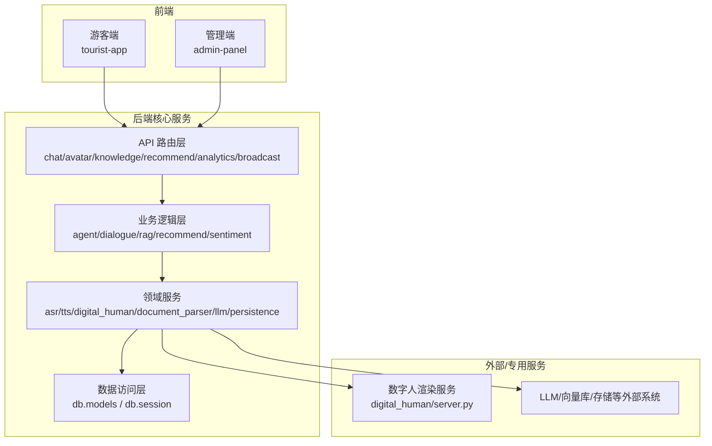
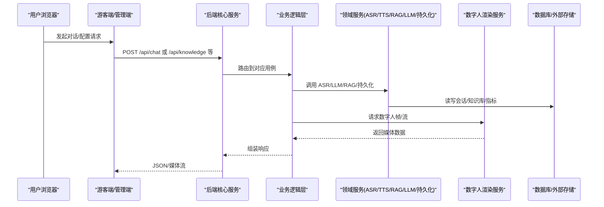
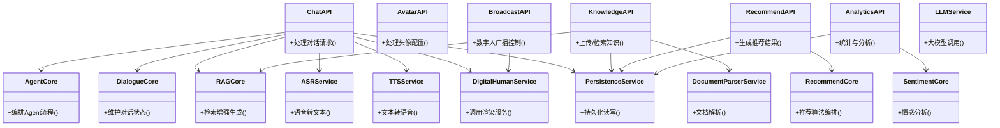
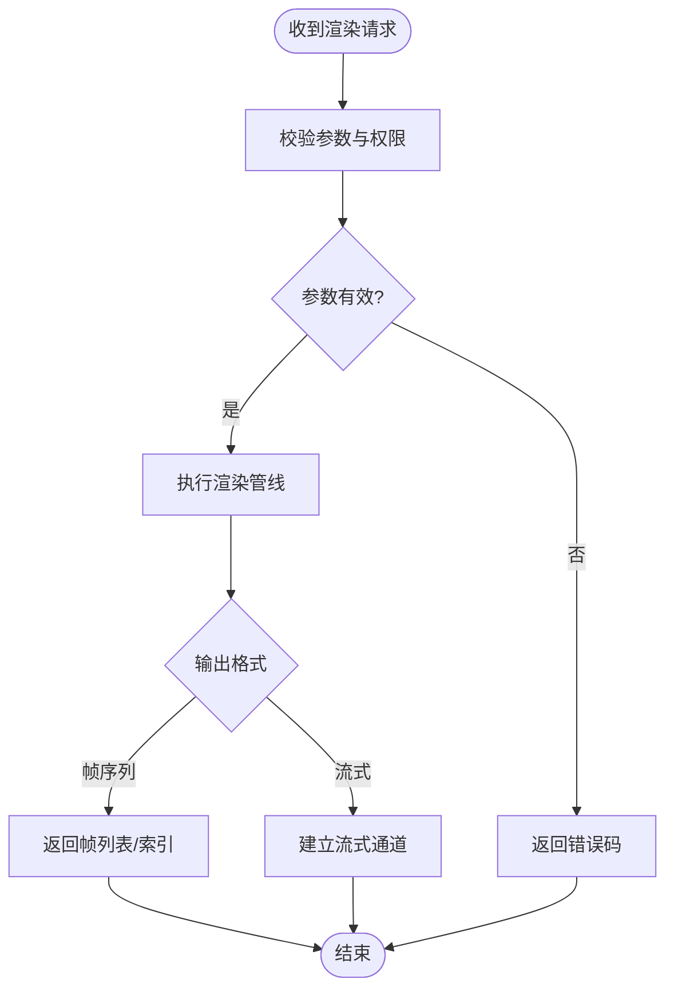
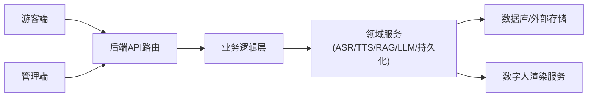

# 服务边界与划分

<cite>
**本文引用的文件**   
- [backend/app/main.py](file://backend/app/main.py)
- [backend/app/api/chat.py](file://backend/app/api/chat.py)
- [backend/app/api/avatar.py](file://backend/app/api/avatar.py)
- [backend/app/api/knowledge.py](file://backend/app/api/knowledge.py)
- [backend/app/api/recommend.py](file://backend/app/api/recommend.py)
- [backend/app/api/analytics.py](file://backend/app/api/analytics.py)
- [backend/app/api/digital_human_broadcast.py](file://backend/app/api/digital_human_broadcast.py)
- [backend/app/core/agent.py](file://backend/app/core/agent.py)
- [backend/app/core/dialogue.py](file://backend/app/core/dialogue.py)
- [backend/app/core/rag.py](file://backend/app/core/rag.py)
- [backend/app/core/recommend.py](file://backend/app/core/recommend.py)
- [backend/app/core/sentiment.py](file://backend/app/core/sentiment.py)
- [backend/app/services/asr.py](file://backend/app/services/asr.py)
- [backend/app/services/tts.py](file://backend/app/services/tts.py)
- [backend/app/services/digital_human.py](file://backend/app/services/digital_human.py)
- [backend/app/services/document_parser.py](file://backend/app/services/document_parser.py)
- [backend/app/services/llm.py](file://backend/app/services/llm.py)
- [backend/app/services/persistence.py](file://backend/app/services/persistence.py)
- [backend/app/db/models.py](file://backend/app/db/models.py)
- [backend/app/db/session.py](file://backend/app/db/session.py)
- [backend/Dockerfile](file://backend/Dockerfile)
- [digital_human/server.py](file://digital_human/server.py)
- [digital_human/Dockerfile](file://digital_human/Dockerfile)
- [frontend/admin-panel/src/services/api.ts](file://frontend/admin-panel/src/services/api.ts)
- [frontend/tourist-app/src/services/api.ts](file://frontend/tourist-app/src/services/api.ts)
- [frontend/tourist-app/src/components/DigitalHuman/VrmAvatar.vue](file://frontend/tourist-app/src/components/DigitalHuman/VrmAvatar.vue)
- [docker-compose.yml](file://docker-compose.yml)
</cite>

## 目录
1. [简介](#简介)
2. [项目结构](#项目结构)
3. [核心组件](#核心组件)
4. [架构总览](#架构总览)
5. [详细组件分析](#详细组件分析)
6. [依赖关系分析](#依赖关系分析)
7. [性能考虑](#性能考虑)
8. [故障排查指南](#故障排查指南)
9. [结论](#结论)
10. [附录](#附录)

## 简介
本文件面向架构师与工程团队，系统化梳理 SmartTour 微服务的职责边界与拆分原则，明确后端核心服务、数字人渲染服务、前端应用服务的独立部署策略。文档基于仓库现有代码结构与服务实现进行归纳，给出服务接口契约建议、数据流向图、扩展性与性能考量，并提供可操作的微服务划分最佳实践指导。

## 项目结构
SmartTour 采用前后端分离与多进程部署的形态：
- 后端核心服务（Python）：提供对话、知识检索、推荐、分析、数字人广播等能力，封装 LLM、ASR/TTS、RAG、持久化等通用服务。
- 数字人渲染服务（独立进程）：负责数字人视频流或帧序列生成，供后端以 HTTP 调用。
- 前端应用服务（两个独立站点）：游客端与后台管理端，分别通过 API 访问后端与数字人服务。

图示来源
- [backend/app/main.py](file://backend/app/main.py)
- [backend/app/api/chat.py](file://backend/app/api/chat.py)
- [backend/app/api/avatar.py](file://backend/app/api/avatar.py)
- [backend/app/api/knowledge.py](file://backend/app/api/knowledge.py)
- [backend/app/api/recommend.py](file://backend/app/api/recommend.py)
- [backend/app/api/analytics.py](file://backend/app/api/analytics.py)
- [backend/app/api/digital_human_broadcast.py](file://backend/app/api/digital_human_broadcast.py)
- [backend/app/core/agent.py](file://backend/app/core/agent.py)
- [backend/app/core/dialogue.py](file://backend/app/core/dialogue.py)
- [backend/app/core/rag.py](file://backend/app/core/rag.py)
- [backend/app/core/recommend.py](file://backend/app/core/recommend.py)
- [backend/app/core/sentiment.py](file://backend/app/core/sentiment.py)
- [backend/app/services/asr.py](file://backend/app/services/asr.py)
- [backend/app/services/tts.py](file://backend/app/services/tts.py)
- [backend/app/services/digital_human.py](file://backend/app/services/digital_human.py)
- [backend/app/services/document_parser.py](file://backend/app/services/document_parser.py)
- [backend/app/services/llm.py](file://backend/app/services/llm.py)
- [backend/app/services/persistence.py](file://backend/app/services/persistence.py)
- [backend/app/db/models.py](file://backend/app/db/models.py)
- [backend/app/db/session.py](file://backend/app/db/session.py)
- [digital_human/server.py](file://digital_human/server.py)

章节来源
- [backend/app/main.py](file://backend/app/main.py)
- [docker-compose.yml](file://docker-compose.yml)

## 核心组件
- API 路由层：按领域划分 REST 路由，包括对话、头像、知识库、推荐、分析与数字人广播。
- 业务逻辑层：聚合领域能力，编排 Agent、对话状态、RAG、推荐与情感分析。
- 领域服务层：封装 ASR、TTS、数字人、文档解析、LLM、持久化等横向能力。
- 数据访问层：定义模型与数据库会话，统一读写。
- 数字人渲染服务：独立部署的渲染进程，提供视频/帧流接口。
- 前端应用：游客端与管理端，分别对接后端 API 与数字人服务。

章节来源
- [backend/app/api/chat.py](file://backend/app/api/chat.py)
- [backend/app/api/avatar.py](file://backend/app/api/avatar.py)
- [backend/app/api/knowledge.py](file://backend/app/api/knowledge.py)
- [backend/app/api/recommend.py](file://backend/app/api/recommend.py)
- [backend/app/api/analytics.py](file://backend/app/api/analytics.py)
- [backend/app/api/digital_human_broadcast.py](file://backend/app/api/digital_human_broadcast.py)
- [backend/app/core/agent.py](file://backend/app/core/agent.py)
- [backend/app/core/dialogue.py](file://backend/app/core/dialogue.py)
- [backend/app/core/rag.py](file://backend/app/core/rag.py)
- [backend/app/core/recommend.py](file://backend/app/core/recommend.py)
- [backend/app/core/sentiment.py](file://backend/app/core/sentiment.py)
- [backend/app/services/asr.py](file://backend/app/services/asr.py)
- [backend/app/services/tts.py](file://backend/app/services/tts.py)
- [backend/app/services/digital_human.py](file://backend/app/services/digital_human.py)
- [backend/app/services/document_parser.py](file://backend/app/services/document_parser.py)
- [backend/app/services/llm.py](file://backend/app/services/llm.py)
- [backend/app/services/persistence.py](file://backend/app/services/persistence.py)
- [backend/app/db/models.py](file://backend/app/db/models.py)
- [backend/app/db/session.py](file://backend/app/db/session.py)
- [digital_human/server.py](file://digital_human/server.py)

## 架构总览
从“单一职责、高内聚低耦合”的原则出发，将系统拆分为以下边界清晰的服务：
- 后端核心服务：承载所有业务编排与对外 API；内部再按“路由层-业务层-领域服务层-数据层”分层。
- 数字人渲染服务：专注渲染计算，避免阻塞主业务线程。
- 前端应用服务：游客端与管理端独立构建与部署，按需访问不同 API。

图示来源
- [backend/app/api/chat.py](file://backend/app/api/chat.py)
- [backend/app/api/knowledge.py](file://backend/app/api/knowledge.py)
- [backend/app/core/rag.py](file://backend/app/core/rag.py)
- [backend/app/services/asr.py](file://backend/app/services/asr.py)
- [backend/app/services/tts.py](file://backend/app/services/tts.py)
- [backend/app/services/digital_human.py](file://backend/app/services/digital_human.py)
- [backend/app/services/llm.py](file://backend/app/services/llm.py)
- [backend/app/services/persistence.py](file://backend/app/services/persistence.py)
- [backend/app/db/models.py](file://backend/app/db/models.py)
- [backend/app/db/session.py](file://backend/app/db/session.py)
- [digital_human/server.py](file://digital_human/server.py)

## 详细组件分析

### 后端核心服务（API 网关与业务编排）
- 职责边界
  - API 路由层：暴露稳定的 REST 接口，如对话、头像、知识库、推荐、分析、数字人广播。
  - 业务逻辑层：编排 Agent、对话上下文、RAG 检索、推荐策略与情感分析。
  - 领域服务层：封装 ASR、TTS、数字人、文档解析、LLM、持久化等横切能力。
  - 数据访问层：统一模型与连接生命周期。
- 设计要点
  - 路由层仅做参数校验与简单转换，不写复杂业务。
  - 业务层组合多个领域服务完成用例，保持对外的稳定契约。
  - 领域服务尽量无状态或弱状态，便于水平扩展。
  - 数据访问层集中管理事务与连接池。

图示来源
- [backend/app/api/chat.py](file://backend/app/api/chat.py)
- [backend/app/api/avatar.py](file://backend/app/api/avatar.py)
- [backend/app/api/knowledge.py](file://backend/app/api/knowledge.py)
- [backend/app/api/recommend.py](file://backend/app/api/recommend.py)
- [backend/app/api/analytics.py](file://backend/app/api/analytics.py)
- [backend/app/api/digital_human_broadcast.py](file://backend/app/api/digital_human_broadcast.py)
- [backend/app/core/agent.py](file://backend/app/core/agent.py)
- [backend/app/core/dialogue.py](file://backend/app/core/dialogue.py)
- [backend/app/core/rag.py](file://backend/app/core/rag.py)
- [backend/app/core/recommend.py](file://backend/app/core/recommend.py)
- [backend/app/core/sentiment.py](file://backend/app/core/sentiment.py)
- [backend/app/services/asr.py](file://backend/app/services/asr.py)
- [backend/app/services/tts.py](file://backend/app/services/tts.py)
- [backend/app/services/digital_human.py](file://backend/app/services/digital_human.py)
- [backend/app/services/document_parser.py](file://backend/app/services/document_parser.py)
- [backend/app/services/llm.py](file://backend/app/services/llm.py)
- [backend/app/services/persistence.py](file://backend/app/services/persistence.py)

章节来源
- [backend/app/api/chat.py](file://backend/app/api/chat.py)
- [backend/app/api/knowledge.py](file://backend/app/api/knowledge.py)
- [backend/app/api/recommend.py](file://backend/app/api/recommend.py)
- [backend/app/api/analytics.py](file://backend/app/api/analytics.py)
- [backend/app/api/digital_human_broadcast.py](file://backend/app/api/digital_human_broadcast.py)
- [backend/app/core/agent.py](file://backend/app/core/agent.py)
- [backend/app/core/dialogue.py](file://backend/app/core/dialogue.py)
- [backend/app/core/rag.py](file://backend/app/core/rag.py)
- [backend/app/core/recommend.py](file://backend/app/core/recommend.py)
- [backend/app/core/sentiment.py](file://backend/app/core/sentiment.py)
- [backend/app/services/asr.py](file://backend/app/services/asr.py)
- [backend/app/services/tts.py](file://backend/app/services/tts.py)
- [backend/app/services/digital_human.py](file://backend/app/services/digital_human.py)
- [backend/app/services/document_parser.py](file://backend/app/services/document_parser.py)
- [backend/app/services/llm.py](file://backend/app/services/llm.py)
- [backend/app/services/persistence.py](file://backend/app/services/persistence.py)

### 数字人渲染服务
- 职责边界
  - 接收后端数字人服务调用的渲染任务，输出视频帧或流。
  - 与后端解耦，独立扩缩容，避免影响主业务延迟。
- 接口契约建议
  - 启动/停止广播、获取当前帧、订阅流等 REST/WebSocket 接口。
  - 错误码与重试语义需明确，支持超时与降级。
- 部署策略
  - 独立容器镜像，按 GPU/CPU 资源需求单独调度。
  - 与后端通过环境变量或配置中心发现地址。

图示来源
- [digital_human/server.py](file://digital_human/server.py)
- [backend/app/services/digital_human.py](file://backend/app/services/digital_human.py)

章节来源
- [digital_human/server.py](file://digital_human/server.py)
- [backend/app/services/digital_human.py](file://backend/app/services/digital_human.py)

### 前端应用服务（游客端与管理端）
- 职责边界
  - 游客端：对话交互、数字人展示、语音输入、路线规划等。
  - 管理端：知识库管理、头像配置、数据分析看板等。
- 依赖关系
  - 均通过 API 客户端访问后端核心服务；游客端可能直接访问数字人渲染服务以获取媒体流。
- 部署策略
  - 静态站点构建产物由 Nginx 托管，独立镜像与域名。
  - 通过环境变量注入后端与数字人服务地址。

章节来源
- [frontend/tourist-app/src/services/api.ts](file://frontend/tourist-app/src/services/api.ts)
- [frontend/admin-panel/src/services/api.ts](file://frontend/admin-panel/src/services/api.ts)
- [frontend/tourist-app/src/components/DigitalHuman/VrmAvatar.vue](file://frontend/tourist-app/src/components/DigitalHuman/VrmAvatar.vue)

## 依赖关系分析
- 服务间依赖
  - 前端 → 后端 API（REST）
  - 后端 API → 业务逻辑层 → 领域服务 → 数据访问层
  - 领域服务 → 数字人渲染服务（HTTP/流）
  - 领域服务 → 外部系统（LLM、向量库、对象存储等）
- 耦合点与解耦建议
  - 数字人渲染通过独立服务解耦，避免阻塞主线程。
  - 领域服务之间通过清晰的接口契约通信，减少跨模块隐式依赖。
  - 数据访问层集中管理连接与事务，降低上层复杂度。

图示来源
- [backend/app/api/chat.py](file://backend/app/api/chat.py)
- [backend/app/api/knowledge.py](file://backend/app/api/knowledge.py)
- [backend/app/api/recommend.py](file://backend/app/api/recommend.py)
- [backend/app/api/analytics.py](file://backend/app/api/analytics.py)
- [backend/app/api/digital_human_broadcast.py](file://backend/app/api/digital_human_broadcast.py)
- [backend/app/core/agent.py](file://backend/app/core/agent.py)
- [backend/app/core/dialogue.py](file://backend/app/core/dialogue.py)
- [backend/app/core/rag.py](file://backend/app/core/rag.py)
- [backend/app/core/recommend.py](file://backend/app/core/recommend.py)
- [backend/app/core/sentiment.py](file://backend/app/core/sentiment.py)
- [backend/app/services/asr.py](file://backend/app/services/asr.py)
- [backend/app/services/tts.py](file://backend/app/services/tts.py)
- [backend/app/services/digital_human.py](file://backend/app/services/digital_human.py)
- [backend/app/services/document_parser.py](file://backend/app/services/document_parser.py)
- [backend/app/services/llm.py](file://backend/app/services/llm.py)
- [backend/app/services/persistence.py](file://backend/app/services/persistence.py)
- [backend/app/db/models.py](file://backend/app/db/models.py)
- [backend/app/db/session.py](file://backend/app/db/session.py)
- [digital_human/server.py](file://digital_human/server.py)

章节来源
- [backend/app/db/models.py](file://backend/app/db/models.py)
- [backend/app/db/session.py](file://backend/app/db/session.py)
- [digital_human/server.py](file://digital_human/server.py)

## 性能考虑
- 异步与并发
  - 长耗时操作（ASR/TTS/渲染/LLM）应使用异步或队列化，避免阻塞请求线程。
- 缓存与预取
  - 对热点知识片段、推荐结果、头像资源进行缓存，降低重复计算与 IO。
- 流式传输
  - 数字人媒体流优先采用流式协议，减小首帧时延。
- 资源隔离
  - 数字人渲染服务独立部署并按需扩容，避免与 CPU/IO 密集型业务争抢资源。
- 连接与池化
  - 数据库与外部 LLM 调用使用连接池与限流，防止雪崩。

[本节为通用性能建议，无需特定文件引用]

## 故障排查指南
- 常见问题定位
  - 数字人渲染失败：检查渲染服务健康检查、GPU 资源、网络连通性。
  - LLM 调用超时：查看限流与重试策略、上游可用性。
  - 知识库检索异常：确认文档解析链路、向量库索引状态。
  - 会话丢失：检查持久化服务与数据库连接池。
- 日志与追踪
  - 在关键路径埋点（路由入口、领域服务调用、外部依赖），统一日志格式与 TraceID。
- 回退与降级
  - 当数字人或 LLM 不可用时，返回友好提示或降级内容，保障用户体验。

章节来源
- [backend/app/services/digital_human.py](file://backend/app/services/digital_human.py)
- [backend/app/services/llm.py](file://backend/app/services/llm.py)
- [backend/app/services/document_parser.py](file://backend/app/services/document_parser.py)
- [backend/app/services/persistence.py](file://backend/app/services/persistence.py)
- [backend/app/db/session.py](file://backend/app/db/session.py)

## 结论
通过将后端核心服务、数字人渲染服务与前端应用服务进行清晰拆分，并遵循单一职责与高内聚低耦合的设计思想，SmartTour 实现了良好的可扩展性与可维护性。建议在后续演进中持续完善服务契约、可观测性与弹性伸缩策略，确保在高并发与多媒体场景下的稳定性与性能。

[本节为总结性内容，无需特定文件引用]

## 附录

### 服务接口契约建议（示例）
- 对话接口
  - 方法：POST /api/chat
  - 入参：消息文本、会话标识、可选音频
  - 出参：回复文本、可选 TTS 音频链接、数字人动作指令
- 知识库接口
  - 方法：POST /api/knowledge/upload、GET /api/knowledge/search
  - 入参：文档、查询语句
  - 出参：解析结果、检索片段
- 数字人广播接口
  - 方法：POST /api/broadcast/start、GET /api/broadcast/status
  - 入参：场景、角色、动作
  - 出参：任务 ID、状态、媒体流地址

章节来源
- [backend/app/api/chat.py](file://backend/app/api/chat.py)
- [backend/app/api/knowledge.py](file://backend/app/api/knowledge.py)
- [backend/app/api/digital_human_broadcast.py](file://backend/app/api/digital_human_broadcast.py)

### 部署与编排
- 容器化
  - 后端与数字人渲染服务均提供 Dockerfile，便于独立构建与发布。
- 编排
  - 使用 docker-compose 统一管理各服务实例，便于本地开发与联调。

章节来源
- [backend/Dockerfile](file://backend/Dockerfile)
- [digital_human/Dockerfile](file://digital_human/Dockerfile)
- [docker-compose.yml](file://docker-compose.yml)