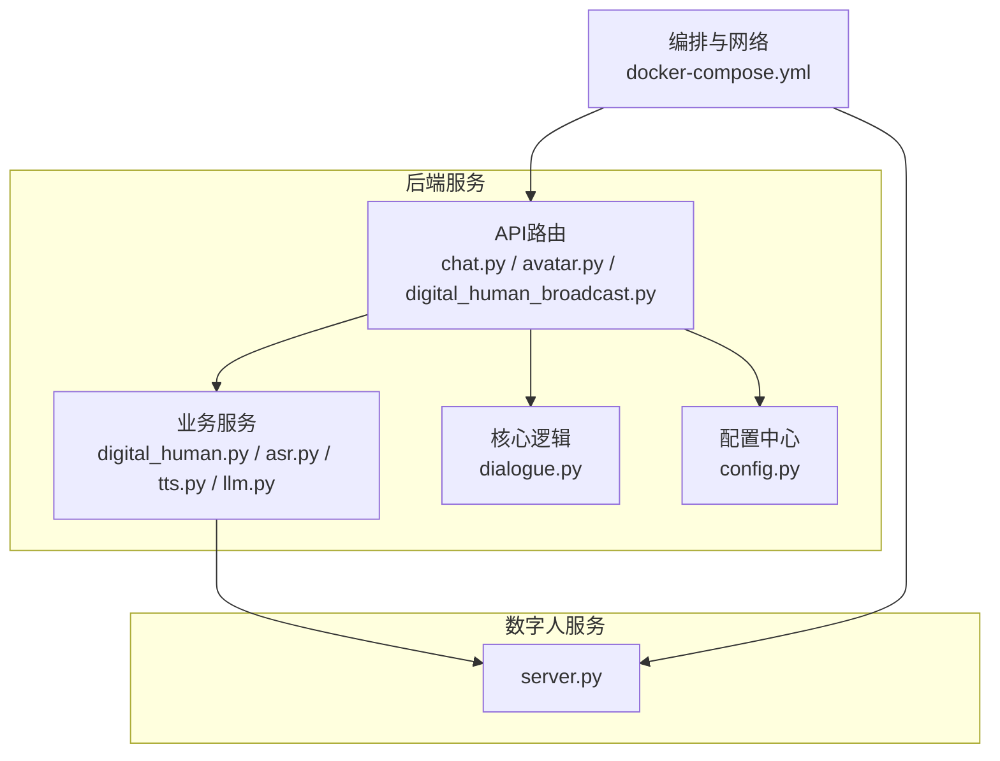
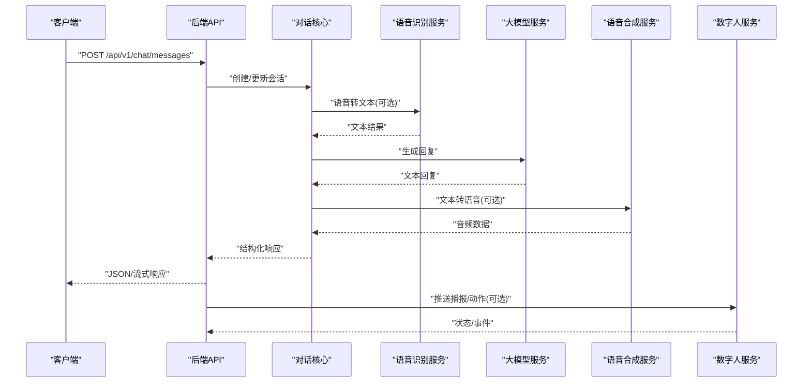
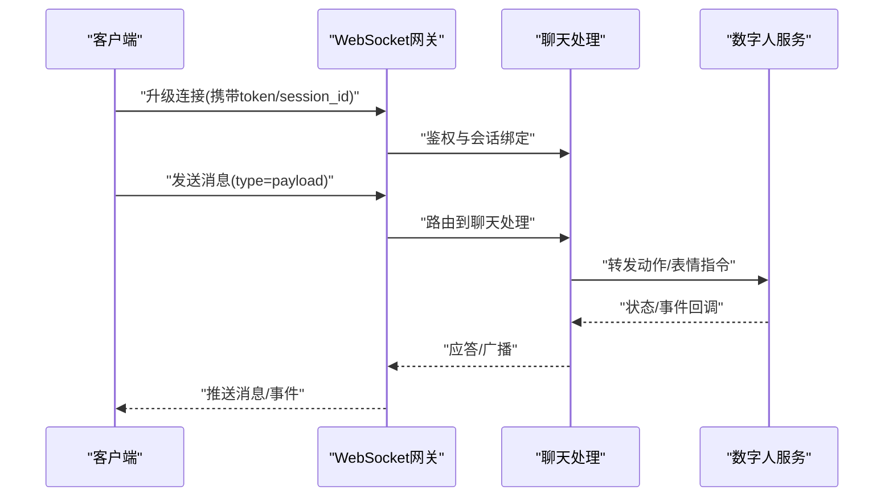
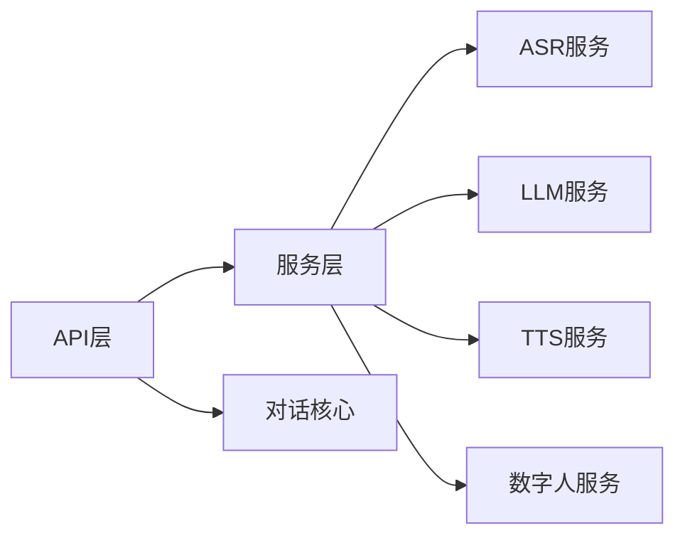

# 服务间通信机制

<cite>
**本文引用的文件**   
- [backend/app/main.py](file://backend/app/main.py)
- [backend/app/api/chat.py](file://backend/app/api/chat.py)
- [backend/app/api/avatar.py](file://backend/app/api/avatar.py)
- [backend/app/api/digital_human_broadcast.py](file://backend/app/api/digital_human_broadcast.py)
- [backend/app/services/digital_human.py](file://backend/app/services/digital_human.py)
- [backend/app/services/asr.py](file://backend/app/services/asr.py)
- [backend/app/services/tts.py](file://backend/app/services/tts.py)
- [backend/app/services/llm.py](file://backend/app/services/llm.py)
- [backend/app/core/dialogue.py](file://backend/app/core/dialogue.py)
- [backend/app/config.py](file://backend/app/config.py)
- [digital_human/server.py](file://digital_human/server.py)
- [docker-compose.yml](file://docker-compose.yml)
</cite>

## 目录
1. [简介](#简介)
2. [项目结构](#项目结构)
3. [核心组件](#核心组件)
4. [架构总览](#架构总览)
5. [详细组件分析](#详细组件分析)
6. [依赖分析](#依赖分析)
7. [性能考虑](#性能考虑)
8. [故障排查指南](#故障排查指南)
9. [结论](#结论)
10. [附录](#附录)

## 简介
本文件面向SmartTour项目的开发者与运维人员，系统化阐述服务间通信机制。内容覆盖：
- RESTful API设计规范（HTTP方法、URL命名、请求响应格式）
- WebSocket实时通信实现（聊天对话、数字人交互）
- 服务发现与注册、负载均衡策略配置
- 微服务间认证授权传递
- 消息队列集成与异步通信模式
- 协议版本管理、向后兼容性与统一错误码规范
- 面向开发者的实现指南与最佳实践

## 项目结构
后端采用模块化分层组织：API层暴露REST接口；Service层封装外部服务调用；Core层承载领域逻辑；配置集中管理。数字人服务独立部署，通过HTTP/WebSocket与后端交互。容器编排由docker-compose统一管理。

图示来源
- [backend/app/api/chat.py](file://backend/app/api/chat.py)
- [backend/app/api/avatar.py](file://backend/app/api/avatar.py)
- [backend/app/api/digital_human_broadcast.py](file://backend/app/api/digital_human_broadcast.py)
- [backend/app/services/digital_human.py](file://backend/app/services/digital_human.py)
- [backend/app/services/asr.py](file://backend/app/services/asr.py)
- [backend/app/services/tts.py](file://backend/app/services/tts.py)
- [backend/app/services/llm.py](file://backend/app/services/llm.py)
- [backend/app/core/dialogue.py](file://backend/app/core/dialogue.py)
- [backend/app/config.py](file://backend/app/config.py)
- [digital_human/server.py](file://digital_human/server.py)
- [docker-compose.yml](file://docker-compose.yml)

章节来源
- [backend/app/main.py](file://backend/app/main.py)
- [backend/app/config.py](file://backend/app/config.py)
- [docker-compose.yml](file://docker-compose.yml)

## 核心组件
- API网关与路由：负责对外暴露REST接口与WebSocket端点，统一鉴权、限流与日志。
- 领域服务：封装ASR、TTS、LLM、数字人等外部能力调用，提供稳定内部接口。
- 核心对话引擎：维护会话上下文、历史与状态，协调多服务协作。
- 数字人服务：提供音视频渲染与交互能力，支持HTTP与WebSocket。
- 配置与可观测性：集中化配置、健康检查、指标与追踪。

章节来源
- [backend/app/api/chat.py](file://backend/app/api/chat.py)
- [backend/app/api/avatar.py](file://backend/app/api/avatar.py)
- [backend/app/api/digital_human_broadcast.py](file://backend/app/api/digital_human_broadcast.py)
- [backend/app/services/digital_human.py](file://backend/app/services/digital_human.py)
- [backend/app/services/asr.py](file://backend/app/services/asr.py)
- [backend/app/services/tts.py](file://backend/app/services/tts.py)
- [backend/app/services/llm.py](file://backend/app/services/llm.py)
- [backend/app/core/dialogue.py](file://backend/app/core/dialogue.py)

## 架构总览
整体采用“前端/客户端 -> 后端API -> 领域服务 -> 外部服务”的层次化通信模型。关键路径包括：
- 文本/语音对话：客户端 -> 聊天API -> 对话核心 -> ASR/LLM/TTS -> 数字人
- 数字人广播：客户端 -> 广播API -> 数字人服务
- 实时交互：WebSocket通道用于长连接消息与媒体流控制

图示来源
- [backend/app/api/chat.py](file://backend/app/api/chat.py)
- [backend/app/core/dialogue.py](file://backend/app/core/dialogue.py)
- [backend/app/services/asr.py](file://backend/app/services/asr.py)
- [backend/app/services/llm.py](file://backend/app/services/llm.py)
- [backend/app/services/tts.py](file://backend/app/services/tts.py)
- [backend/app/services/digital_human.py](file://backend/app/services/digital_human.py)

## 详细组件分析

### RESTful API设计规范
- HTTP方法约定
  - GET：查询资源列表或详情
  - POST：创建资源或触发操作
  - PUT/PATCH：更新资源
  - DELETE：删除资源
- URL命名约定
  - 使用小写英文与连字符分隔，名词复数表示集合
  - 按功能域划分路径前缀，如 /api/v1/chat、/api/v1/avatar、/api/v1/digital-human
  - 资源层级清晰，避免深层嵌套
- 请求/响应格式
  - Content-Type: application/json
  - 统一响应体包含：code、message、data、trace_id
  - 分页参数：page、page_size、sort、filter
  - 时间字段使用ISO 8601与时区信息
- 版本管理
  - 通过URL路径携带版本号，如 /api/v1/...
  - 废弃策略：保留至少两个主版本，弃用通知与迁移期
- 错误码规范
  - 业务错误码三位数字，范围1xx~9xx
  - 标准HTTP状态码配合业务码共同表达语义
  - 错误响应包含：error_code、error_message、details、request_id

章节来源
- [backend/app/api/chat.py](file://backend/app/api/chat.py)
- [backend/app/api/avatar.py](file://backend/app/api/avatar.py)
- [backend/app/api/digital_human_broadcast.py](file://backend/app/api/digital_human_broadcast.py)

### WebSocket实时通信实现
- 适用场景
  - 聊天对话：双向消息、打字指示、已读回执
  - 数字人交互：动作指令、表情切换、直播控制
- 连接建立
  - 客户端在握手阶段携带鉴权令牌与会话标识
  - 服务端校验令牌并绑定用户/会话上下文
- 消息协议
  - 基于JSON帧，包含：type、payload、seq、timestamp、session_id
  - 心跳保活：ping/pong，超时重连
- 断线重连与幂等
  - 指数退避重连，最大重试次数限制
  - 序列号保证消息去重与顺序
- 安全与限流
  - 速率限制、黑名单、IP白名单
  - 敏感消息脱敏与审计日志

图示来源
- [backend/app/api/chat.py](file://backend/app/api/chat.py)
- [backend/app/services/digital_human.py](file://backend/app/services/digital_human.py)

章节来源
- [backend/app/api/chat.py](file://backend/app/api/chat.py)
- [backend/app/services/digital_human.py](file://backend/app/services/digital_human.py)

### 服务发现与注册、负载均衡
- 服务发现
  - 启动时向注册中心上报实例信息与元数据
  - 定期心跳续约，异常自动摘除
- 负载均衡
  - 客户端侧负载均衡：轮询、最少连接、一致性哈希
  - 服务端侧负载均衡：反向代理加权轮询、健康检查
- 容错与熔断
  - 超时、重试、熔断器、降级策略
  - 舱壁隔离与线程池隔离
- 配置项建议
  - 服务名、实例地址、权重、标签、健康检查路径
  - 重试次数、超时时间、熔断阈值

章节来源
- [backend/app/config.py](file://backend/app/config.py)
- [docker-compose.yml](file://docker-compose.yml)

### 认证授权在微服务间的传递
- 入口鉴权
  - 网关校验JWT/OAuth2令牌，提取用户与权限
- 跨服务传递
  - 通过HTTP头传递标准化身份上下文（如user_id、tenant_id、scopes）
  - 内部服务二次校验签名与有效期
- 最小权限原则
  - 按需授权，细粒度作用域控制
- 审计与追踪
  - 全链路trace_id透传，便于问题定位

章节来源
- [backend/app/api/chat.py](file://backend/app/api/chat.py)
- [backend/app/api/avatar.py](file://backend/app/api/avatar.py)
- [backend/app/api/digital_human_broadcast.py](file://backend/app/api/digital_human_broadcast.py)

### 消息队列集成与异步通信模式
- 适用场景
  - 高吞吐写入、削峰填谷、解耦服务
  - 离线任务：报表生成、索引构建、批量处理
- 设计要点
  - 消息模型：幂等键、重试策略、死信队列
  - 消费者：幂等处理、顺序消费、背压控制
  - 监控：延迟、积压、失败率
- 典型流程
  - 生产者发布事件 -> 队列持久化 -> 消费者拉取处理 -> 确认提交

章节来源
- [backend/app/services/digital_human.py](file://backend/app/services/digital_human.py)
- [backend/app/services/asr.py](file://backend/app/services/asr.py)
- [backend/app/services/tts.py](file://backend/app/services/tts.py)

### 数字人交互与服务边界
- 职责边界
  - 数字人服务专注渲染与交互，后端负责编排与业务逻辑
- 通信方式
  - HTTP：配置、状态查询、一次性指令
  - WebSocket：实时动作、表情、直播控制
- 错误恢复
  - 连接断开自动重连，状态同步与补偿

章节来源
- [digital_human/server.py](file://digital_human/server.py)
- [backend/app/services/digital_human.py](file://backend/app/services/digital_human.py)
- [backend/app/api/digital_human_broadcast.py](file://backend/app/api/digital_human_broadcast.py)

### 对话核心与编排
- 会话管理
  - 会话生命周期、上下文缓存、历史归档
- 编排流程
  - 输入预处理 -> 意图识别 -> 工具调用 -> 输出后处理
- 可观测性
  - 埋点、指标、分布式追踪

章节来源
- [backend/app/core/dialogue.py](file://backend/app/core/dialogue.py)
- [backend/app/api/chat.py](file://backend/app/api/chat.py)

## 依赖分析
- 模块耦合
  - API层依赖Service层，Service层依赖外部服务（ASR/TTS/LLM/数字人）
  - 核心对话逻辑相对内聚，降低对外部实现的直接耦合
- 外部依赖
  - 数字人服务、语音与语言模型服务、存储与缓存
- 潜在风险
  - 循环依赖需避免
  - 外部服务不稳定时的熔断与降级

图示来源
- [backend/app/api/chat.py](file://backend/app/api/chat.py)
- [backend/app/services/asr.py](file://backend/app/services/asr.py)
- [backend/app/services/llm.py](file://backend/app/services/llm.py)
- [backend/app/services/tts.py](file://backend/app/services/tts.py)
- [backend/app/services/digital_human.py](file://backend/app/services/digital_human.py)
- [backend/app/core/dialogue.py](file://backend/app/core/dialogue.py)

章节来源
- [backend/app/main.py](file://backend/app/main.py)
- [backend/app/config.py](file://backend/app/config.py)

## 性能考虑
- 连接复用与池化
  - HTTP连接池、WebSocket连接池、数据库连接池
- 缓存策略
  - 热点数据缓存、会话片段缓存、结果集缓存
- 流式传输
  - 大对象分块上传下载、SSE/WS流式返回
- 并发与限流
  - 线程/进程隔离、令牌桶/漏桶限流、优雅关闭
- 监控与告警
  - QPS、P99延迟、错误率、资源利用率

[本节为通用指导，不直接分析具体文件]

## 故障排查指南
- 常见问题
  - 连接失败：检查网络连通、证书、端口映射
  - 鉴权失败：核对令牌有效期与作用域
  - 超时与重试风暴：调整超时与重试策略，启用熔断
  - 消息乱序：确保顺序消费与幂等键
- 诊断手段
  - 查看trace_id关联日志
  - 抓取请求/响应报文与中间件日志
  - 检查健康检查与注册中心状态

章节来源
- [backend/app/api/chat.py](file://backend/app/api/chat.py)
- [backend/app/api/avatar.py](file://backend/app/api/avatar.py)
- [backend/app/api/digital_human_broadcast.py](file://backend/app/api/digital_human_broadcast.py)

## 结论
通过统一的REST规范、稳定的WebSocket通道、完善的服务治理与可观测性，SmartTour实现了高可用、可扩展的服务间通信体系。遵循本文规范将有助于提升系统稳定性与团队协作效率。

[本节为总结性内容，不直接分析具体文件]

## 附录

### 统一错误码与响应格式示例（说明性）
- 成功响应
  - code: 0
  - message: "success"
  - data: 业务数据
  - trace_id: 链路ID
- 业务错误
  - code: 1xxx
  - message: 人类可读描述
  - details: 附加信息
  - request_id: 请求ID
- 系统错误
  - code: 5xxx
  - message: 系统级错误
  - details: 堆栈摘要（生产环境脱敏）

[本节为概念性说明，不直接分析具体文件]