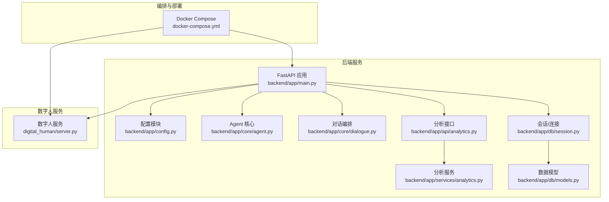
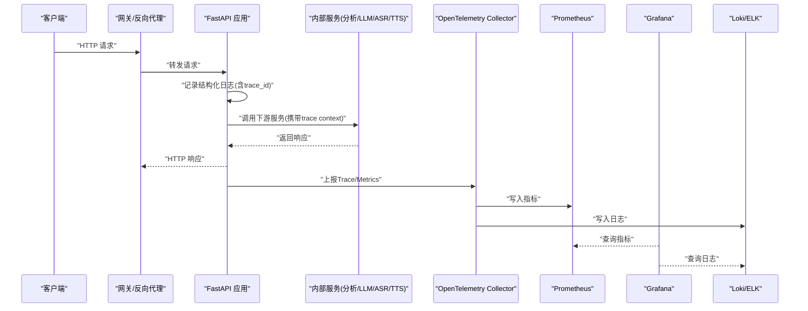
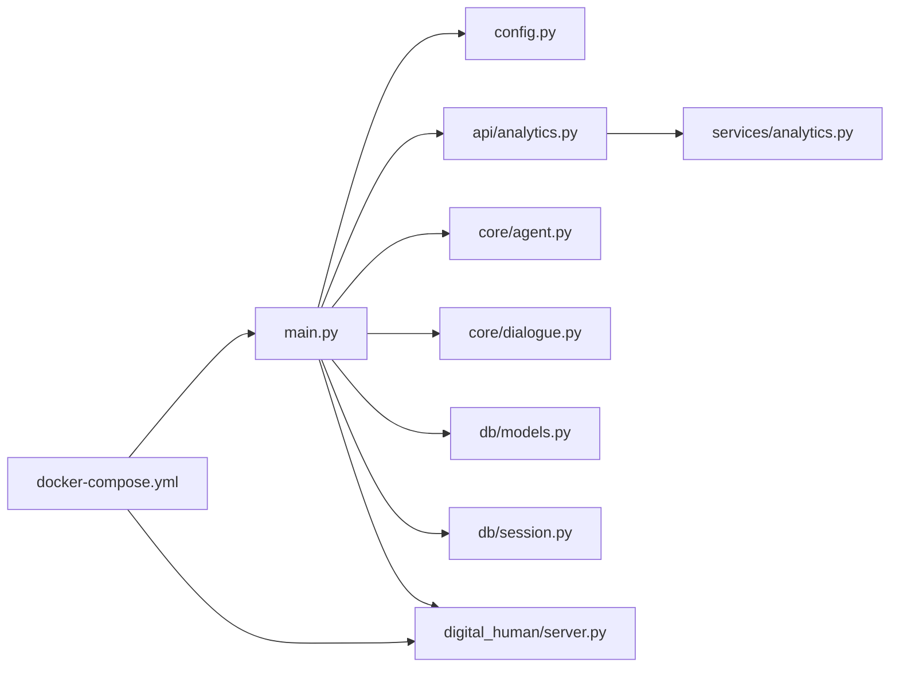

# 监控与可观测性

<cite>
**本文引用的文件**   
- [backend/app/main.py](file://backend/app/main.py)
- [backend/app/config.py](file://backend/app/config.py)
- [backend/app/api/analytics.py](file://backend/app/api/analytics.py)
- [backend/app/services/analytics.py](file://backend/app/services/analytics.py)
- [backend/app/core/agent.py](file://backend/app/core/agent.py)
- [backend/app/core/dialogue.py](file://backend/app/core/dialogue.py)
- [backend/app/db/models.py](file://backend/app/db/models.py)
- [backend/app/db/session.py](file://backend/app/db/session.py)
- [digital_human/server.py](file://digital_human/server.py)
- [docker-compose.yml](file://docker-compose.yml)
</cite>

## 目录
1. [简介](#简介)
2. [项目结构](#项目结构)
3. [核心组件](#核心组件)
4. [架构总览](#架构总览)
5. [详细组件分析](#详细组件分析)
6. [依赖关系分析](#依赖关系分析)
7. [性能考虑](#性能考虑)
8. [故障排查指南](#故障排查指南)
9. [结论](#结论)
10. [附录](#附录)

## 简介
本文件为 SmartTour 微服务提供一套完整的监控与可观测性方案，覆盖分布式日志、分布式追踪、指标采集与告警、健康检查、可视化面板、存储优化与合规性。目标是帮助 DevOps 团队快速落地“可观测即能力”的工程体系，提升问题定位效率与系统稳定性。

## 项目结构
SmartTour 后端采用 Python FastAPI 应用，数字人服务为独立进程；前端包含管理端与游客端。当前仓库未内置专用监控 SDK，建议通过中间件与外部可观测性栈（如 OpenTelemetry + Prometheus + Grafana + Loki/ELK）进行集成。

图表来源
- [backend/app/main.py](file://backend/app/main.py)
- [backend/app/config.py](file://backend/app/config.py)
- [backend/app/api/analytics.py](file://backend/app/api/analytics.py)
- [backend/app/services/analytics.py](file://backend/app/services/analytics.py)
- [backend/app/core/agent.py](file://backend/app/core/agent.py)
- [backend/app/core/dialogue.py](file://backend/app/core/dialogue.py)
- [backend/app/db/models.py](file://backend/app/db/models.py)
- [backend/app/db/session.py](file://backend/app/db/session.py)
- [digital_human/server.py](file://digital_human/server.py)
- [docker-compose.yml](file://docker-compose.yml)

章节来源
- [backend/app/main.py](file://backend/app/main.py)
- [backend/app/config.py](file://backend/app/config.py)
- [backend/app/api/analytics.py](file://backend/app/api/analytics.py)
- [backend/app/services/analytics.py](file://backend/app/services/analytics.py)
- [backend/app/core/agent.py](file://backend/app/core/agent.py)
- [backend/app/core/dialogue.py](file://backend/app/core/dialogue.py)
- [backend/app/db/models.py](file://backend/app/db/models.py)
- [backend/app/db/session.py](file://backend/app/db/session.py)
- [digital_human/server.py](file://digital_human/server.py)
- [docker-compose.yml](file://docker-compose.yml)

## 核心组件
- 统一日志中间件：在请求进入/退出时记录结构化日志（trace_id、span_id、用户标识、耗时、状态码等），并输出到标准输出以便容器化收集。
- 分布式追踪：基于 OpenTelemetry 注入 trace context，跨服务传播上下文，形成端到端调用链。
- 指标采集：暴露 /metrics 端点，采集 HTTP 请求计数、延迟分位、错误率、业务指标（如对话轮次、推荐点击）、资源指标（CPU/内存/GC）。
- 健康检查：/healthz 返回存活与就绪状态，供 K8s/编排器探测。
- 配置中心：集中化管理可观测性开关、采样率、目标地址等。

章节来源
- [backend/app/main.py](file://backend/app/main.py)
- [backend/app/config.py](file://backend/app/config.py)

## 架构总览
下图展示从客户端到后端、再到外部可观测性组件的完整链路。

图表来源
- [backend/app/main.py](file://backend/app/main.py)
- [backend/app/api/analytics.py](file://backend/app/api/analytics.py)
- [backend/app/services/analytics.py](file://backend/app/services/analytics.py)
- [digital_human/server.py](file://digital_human/server.py)
- [docker-compose.yml](file://docker-compose.yml)

## 详细组件分析

### 分布式日志收集
- 日志格式标准化
  - 字段建议：timestamp、level、service、version、trace_id、span_id、user_id、method、path、status_code、latency_ms、message、tags。
  - 使用 JSON 行格式，便于 Loki/ELK 解析。
- 采集与传输
  - 容器内 stdout/stderr 由 sidecar 或 DaemonSet 采集至 Loki/ELK。
  - 建议开启异步写入与批量发送，降低对主流程影响。
- 索引与保留
  - 按 service、env、date 建立索引策略；冷热分层与生命周期管理。
- 隐私与合规
  - 自动脱敏 PII（手机号、邮箱、身份证等）；敏感字段黑名单。
  - 审计日志单独落盘并加密归档。

章节来源
- [backend/app/main.py](file://backend/app/main.py)
- [backend/app/config.py](file://backend/app/config.py)

### 分布式追踪实现
- 上下文传播
  - 在入口中间件生成/提取 trace_id/span_id，注入响应头与下游请求头。
  - 跨语言场景遵循 W3C Trace Context。
- 关键埋点
  - HTTP 入站/出站、数据库访问、消息队列、外部 LLM/ASR/TTS 调用。
- 采样策略
  - 默认低采样率，针对错误/慢请求提高采样比例。
- 可视化
  - 通过 Jaeger/Tempo 查看链路拓扑与耗时分布。

章节来源
- [backend/app/main.py](file://backend/app/main.py)
- [backend/app/api/analytics.py](file://backend/app/api/analytics.py)
- [backend/app/services/analytics.py](file://backend/app/services/analytics.py)
- [digital_human/server.py](file://digital_human/server.py)

### 指标收集与告警机制
- 技术类指标
  - HTTP：QPS、P50/P95/P99 延迟、错误率、连接数。
  - 运行时：CPU、内存、GC、线程/协程数、文件描述符。
  - 数据库：连接池使用率、慢查询、锁等待。
- 业务类指标
  - 对话轮次、意图识别成功率、推荐点击率、数字人播放时长。
- 采集与存储
  - 暴露 /metrics，Prometheus 拉取；可选 Pushgateway 用于短任务。
- 告警规则
  - 错误率突增、延迟超阈、资源水位告警、业务异常阈值。
  - 分级通知（企业微信/钉钉/邮件/电话），抑制风暴与合并重复。

章节来源
- [backend/app/main.py](file://backend/app/main.py)
- [backend/app/api/analytics.py](file://backend/app/api/analytics.py)
- [backend/app/services/analytics.py](file://backend/app/services/analytics.py)
- [docker-compose.yml](file://docker-compose.yml)

### 服务健康检查
- 存活探针 /healthz
  - 返回 200 表示进程存活；可叠加依赖检查（DB、缓存、下游）。
- 就绪探针 /readyz
  - 启动完成后返回 200；依赖初始化完成、连接池预热成功。
- 组合策略
  - 失败次数与冷却时间，避免抖动误判。

章节来源
- [backend/app/main.py](file://backend/app/main.py)
- [backend/app/config.py](file://backend/app/config.py)

### 可视化监控面板
- Grafana 面板
  - 概览：QPS、错误率、延迟分位、资源水位。
  - 链路：Top N 慢接口、热点路径。
  - 日志：按 trace_id 聚合关联日志与指标。
- 模板与共享
  - 将常用面板导出为模板，纳入版本管理。

章节来源
- [docker-compose.yml](file://docker-compose.yml)

### 日志轮转、存储优化与合规
- 轮转策略
  - 按大小/时间切分，保留期与压缩；侧车或宿主层统一处理。
- 存储优化
  - 去重、降采样、字段裁剪；冷热分层与对象存储归档。
- 合规要求
  - 数据最小化、目的限定、留存期限、访问审计、跨境传输控制。

章节来源
- [backend/app/config.py](file://backend/app/config.py)

## 依赖关系分析
- 组件耦合
  - main.py 作为入口，挂载中间件、路由与健康检查；analytics 接口与服务解耦，便于扩展。
- 外部依赖
  - 可观测性组件（OTel、Prometheus、Grafana、Loki/ELK）通过 docker-compose 编排。
- 潜在风险
  - 若中间件阻塞或采样过高，可能影响吞吐；需压测验证。

图表来源
- [backend/app/main.py](file://backend/app/main.py)
- [backend/app/config.py](file://backend/app/config.py)
- [backend/app/api/analytics.py](file://backend/app/api/analytics.py)
- [backend/app/services/analytics.py](file://backend/app/services/analytics.py)
- [backend/app/core/agent.py](file://backend/app/core/agent.py)
- [backend/app/core/dialogue.py](file://backend/app/core/dialogue.py)
- [backend/app/db/models.py](file://backend/app/db/models.py)
- [backend/app/db/session.py](file://backend/app/db/session.py)
- [digital_human/server.py](file://digital_human/server.py)
- [docker-compose.yml](file://docker-compose.yml)

章节来源
- [backend/app/main.py](file://backend/app/main.py)
- [backend/app/config.py](file://backend/app/config.py)
- [backend/app/api/analytics.py](file://backend/app/api/analytics.py)
- [backend/app/services/analytics.py](file://backend/app/services/analytics.py)
- [backend/app/core/agent.py](file://backend/app/core/agent.py)
- [backend/app/core/dialogue.py](file://backend/app/core/dialogue.py)
- [backend/app/db/models.py](file://backend/app/db/models.py)
- [backend/app/db/session.py](file://backend/app/db/session.py)
- [digital_human/server.py](file://digital_human/server.py)
- [docker-compose.yml](file://docker-compose.yml)

## 性能考虑
- 日志
  - 异步写入、批量发送、按需采样；避免在主路径做昂贵序列化。
- 追踪
  - 合理采样率；仅对关键 span 附加额外属性；减少网络往返。
- 指标
  - 标签基数控制，避免高基标签导致存储膨胀；预聚合与降采样。
- 健康检查
  - 轻量级检查，避免触发级联失败；设置超时与重试退避。

[本节为通用指导，不直接分析具体文件]

## 故障排查指南
- 快速定位
  - 通过 trace_id 串联日志与指标，定位慢节点与错误根因。
- 常见症状
  - 错误率飙升：检查上游依赖、限流熔断、证书过期。
  - 延迟升高：关注 GC、锁竞争、慢查询、外部服务抖动。
  - 资源告警：扩容或优化算法；检查泄漏与连接池耗尽。
- 回滚与降级
  - 灰度发布、功能开关、只读模式、缓存兜底。

章节来源
- [backend/app/main.py](file://backend/app/main.py)
- [backend/app/api/analytics.py](file://backend/app/api/analytics.py)
- [backend/app/services/analytics.py](file://backend/app/services/analytics.py)

## 结论
通过统一的日志规范、端到端追踪、完善的指标与告警、以及可视化的面板，SmartTour 可实现“看得见、找得到、能恢复”的可观测性闭环。建议在 CI/CD 中纳入可观测性验收用例，持续演进监控质量。

[本节为总结性内容，不直接分析具体文件]

## 附录

### 关键接口定义（概念说明）
- GET /healthz：存活探针，返回 200 表示进程存活。
- GET /readyz：就绪探针，返回 200 表示服务已就绪。
- GET /metrics：Prometheus 指标端点。
- 其他业务接口：在入口中间件下自动采集日志与追踪。

章节来源
- [backend/app/main.py](file://backend/app/main.py)

### 配置项建议（示例字段）
- observability.enabled：是否启用可观测性
- observability.tracing.sampling_rate：追踪采样率
- observability.metrics.exporter：指标导出器类型
- observability.logging.format：日志格式（json/text）
- observability.health.check_timeout：健康检查超时

章节来源
- [backend/app/config.py](file://backend/app/config.py)