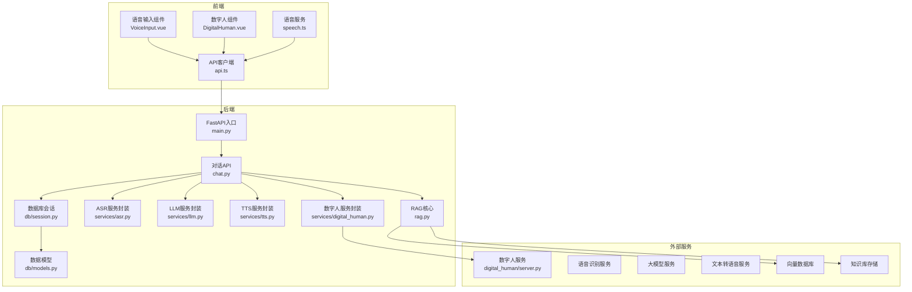
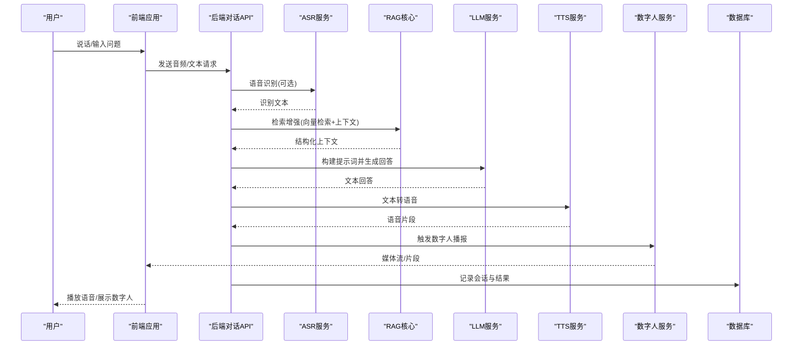
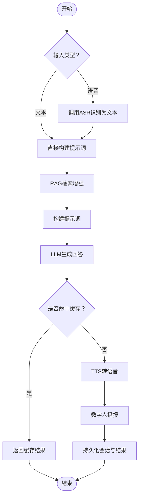
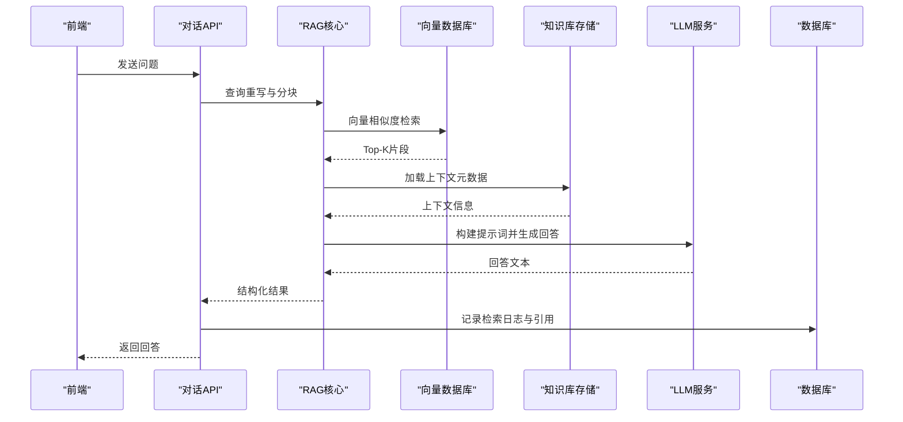
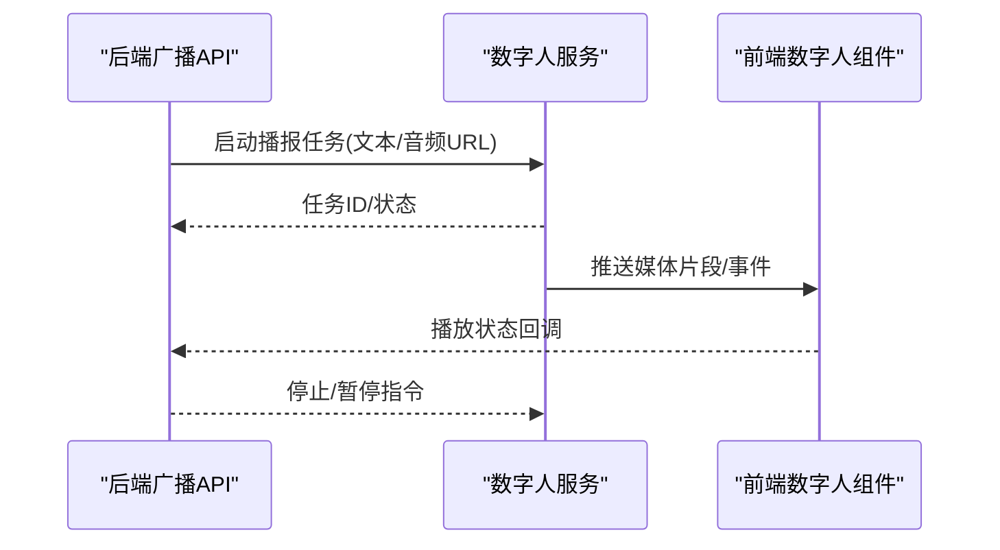
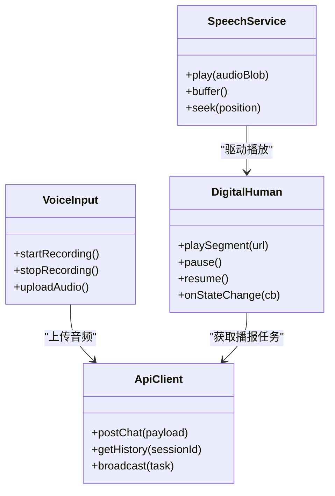
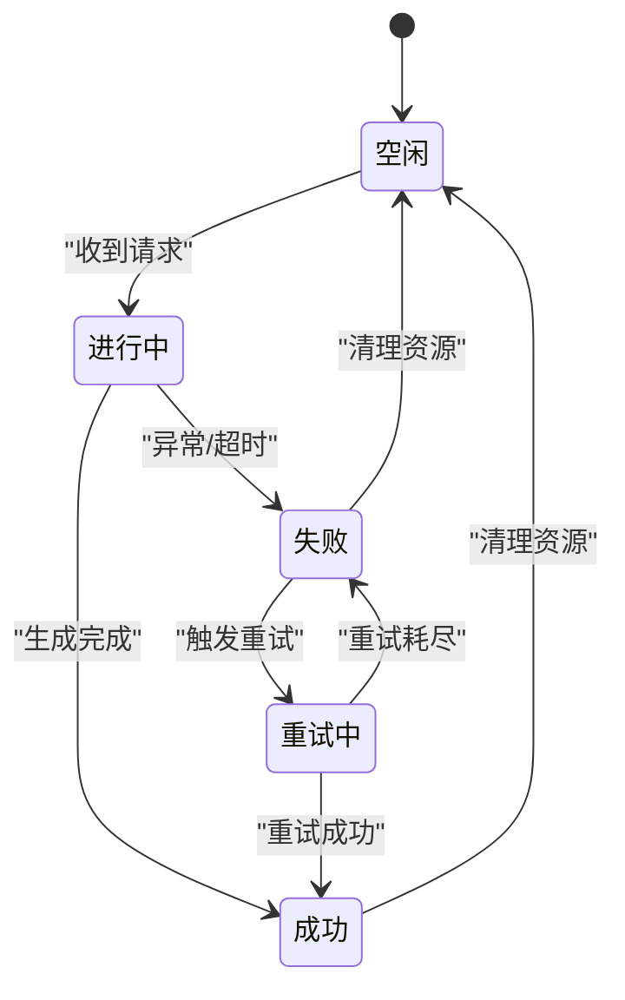
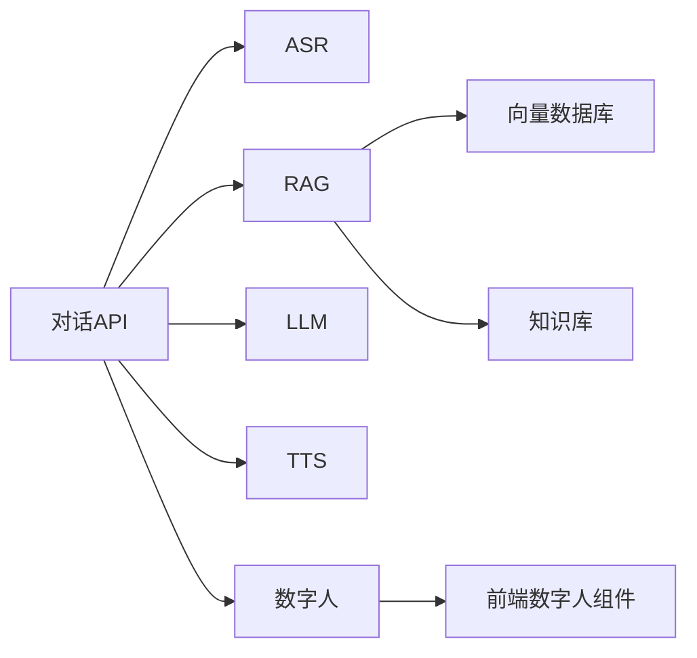

# 数据流设计

<cite>
**本文引用的文件**   
- [backend/app/main.py](file://backend/app/main.py)
- [backend/app/api/chat.py](file://backend/app/api/chat.py)
- [backend/app/api/digital_human_broadcast.py](file://backend/app/api/digital_human_broadcast.py)
- [backend/app/core/rag.py](file://backend/app/core/rag.py)
- [backend/app/services/asr.py](file://backend/app/services/asr.py)
- [backend/app/services/tts.py](file://backend/app/services/tts.py)
- [backend/app/services/llm.py](file://backend/app/services/llm.py)
- [backend/app/services/digital_human.py](file://backend/app/services/digital_human.py)
- [backend/app/db/models.py](file://backend/app/db/models.py)
- [backend/app/db/session.py](file://backend/app/db/session.py)
- [digital_human/server.py](file://digital_human/server.py)
- [frontend/tourist-app/src/components/VoiceInput/VoiceInput.vue](file://frontend/tourist-app/src/components/VoiceInput/VoiceInput.vue)
- [frontend/tourist-app/src/components/DigitalHuman/DigitalHuman.vue](file://frontend/tourist-app/src/components/DigitalHuman/DigitalHuman.vue)
- [frontend/tourist-app/src/services/speech.ts](file://frontend/tourist-app/src/services/speech.ts)
- [frontend/tourist-app/src/services/api.ts](file://frontend/tourist-app/src/services/api.ts)
</cite>

## 目录
1. [引言](#引言)
2. [项目结构](#项目结构)
3. [核心组件](#核心组件)
4. [架构总览](#架构总览)
5. [详细组件分析](#详细组件分析)
6. [依赖分析](#依赖分析)
7. [性能考虑](#性能考虑)
8. [故障排查指南](#故障排查指南)
9. [结论](#结论)
10. [附录](#附录)

## 引言
本文件面向开发者，系统化阐述 SmartTour 系统的数据流设计，覆盖从前端用户交互到后端业务处理、再到数据存储的完整链路。重点说明两类关键数据流：
- 智能对话数据流：用户输入→语音识别(ASR)→大模型(LLM)处理→文本转语音(TTS)→数字人播报
- RAG检索增强生成数据流：用户问题→向量检索→知识库匹配→提示词构建→回答生成

文档包含数据流图、状态转换图与缓存策略说明，并讨论实时数据同步、消息队列使用和数据一致性保证机制，帮助读者建立对系统数据流转的深入理解。

## 项目结构
SmartTour 采用前后端分离与微服务化倾向的模块化组织方式：
- 前端（tourist-app）：提供聊天界面、语音输入、数字人渲染与播放能力
- 后端（backend）：提供 API、核心业务逻辑（对话、RAG）、AI 服务封装（ASR、LLM、TTS）、持久化与数据库访问
- 数字人服务（digital_human）：独立服务，负责数字人驱动与媒体输出
- 配置与部署：Docker 编排与容器化

图表来源
- [backend/app/main.py](file://backend/app/main.py)
- [backend/app/api/chat.py](file://backend/app/api/chat.py)
- [backend/app/core/rag.py](file://backend/app/core/rag.py)
- [backend/app/services/asr.py](file://backend/app/services/asr.py)
- [backend/app/services/llm.py](file://backend/app/services/llm.py)
- [backend/app/services/tts.py](file://backend/app/services/tts.py)
- [backend/app/services/digital_human.py](file://backend/app/services/digital_human.py)
- [backend/app/db/models.py](file://backend/app/db/models.py)
- [backend/app/db/session.py](file://backend/app/db/session.py)
- [digital_human/server.py](file://digital_human/server.py)
- [frontend/tourist-app/src/components/VoiceInput/VoiceInput.vue](file://frontend/tourist-app/src/components/VoiceInput/VoiceInput.vue)
- [frontend/tourist-app/src/components/DigitalHuman/DigitalHuman.vue](file://frontend/tourist-app/src/components/DigitalHuman/DigitalHuman.vue)
- [frontend/tourist-app/src/services/speech.ts](file://frontend/tourist-app/src/services/speech.ts)
- [frontend/tourist-app/src/services/api.ts](file://frontend/tourist-app/src/services/api.ts)

章节来源
- [backend/app/main.py](file://backend/app/main.py)
- [backend/app/api/chat.py](file://backend/app/api/chat.py)
- [backend/app/core/rag.py](file://backend/app/core/rag.py)
- [backend/app/services/asr.py](file://backend/app/services/asr.py)
- [backend/app/services/llm.py](file://backend/app/services/llm.py)
- [backend/app/services/tts.py](file://backend/app/services/tts.py)
- [backend/app/services/digital_human.py](file://backend/app/services/digital_human.py)
- [backend/app/db/models.py](file://backend/app/db/models.py)
- [backend/app/db/session.py](file://backend/app/db/session.py)
- [digital_human/server.py](file://digital_human/server.py)
- [frontend/tourist-app/src/components/VoiceInput/VoiceInput.vue](file://frontend/tourist-app/src/components/VoiceInput/VoiceInput.vue)
- [frontend/tourist-app/src/components/DigitalHuman/DigitalHuman.vue](file://frontend/tourist-app/src/components/DigitalHuman/DigitalHuman.vue)
- [frontend/tourist-app/src/services/speech.ts](file://frontend/tourist-app/src/services/speech.ts)
- [frontend/tourist-app/src/services/api.ts](file://frontend/tourist-app/src/services/api.ts)

## 核心组件
- 前端交互层
  - 语音输入组件：采集音频、压缩上传、错误重试
  - 数字人组件：接收媒体流或片段、驱动动画与播放
  - 语音服务：本地播放控制、缓冲与进度管理
  - API客户端：统一请求封装、鉴权、超时与重试
- 后端API层
  - 对话API：协调ASR→RAG/LLM→TTS→数字人播报的端到端流程
  - 数字人广播API：用于批量或长文本播报任务
- 核心业务层
  - RAG核心：查询重写、向量检索、上下文拼接、提示词构建
- AI服务封装
  - ASR：将音频转为文本
  - LLM：根据提示词生成回答
  - TTS：将文本转为语音片段
  - 数字人：驱动数字人进行播报
- 数据持久化
  - 数据库会话与模型：会话历史、知识条目、索引元数据等

章节来源
- [backend/app/api/chat.py](file://backend/app/api/chat.py)
- [backend/app/api/digital_human_broadcast.py](file://backend/app/api/digital_human_broadcast.py)
- [backend/app/core/rag.py](file://backend/app/core/rag.py)
- [backend/app/services/asr.py](file://backend/app/services/asr.py)
- [backend/app/services/llm.py](file://backend/app/services/llm.py)
- [backend/app/services/tts.py](file://backend/app/services/tts.py)
- [backend/app/services/digital_human.py](file://backend/app/services/digital_human.py)
- [backend/app/db/models.py](file://backend/app/db/models.py)
- [backend/app/db/session.py](file://backend/app/db/session.py)

## 架构总览
整体架构遵循“前端交互→后端编排→AI服务→外部存储”的分层模式。对话流程由后端API统一编排，确保各阶段可观测、可重试、可回滚；RAG流程在问答前进行检索增强，提升答案准确性与时效性。

图表来源
- [backend/app/api/chat.py](file://backend/app/api/chat.py)
- [backend/app/core/rag.py](file://backend/app/core/rag.py)
- [backend/app/services/asr.py](file://backend/app/services/asr.py)
- [backend/app/services/llm.py](file://backend/app/services/llm.py)
- [backend/app/services/tts.py](file://backend/app/services/tts.py)
- [backend/app/services/digital_human.py](file://backend/app/services/digital_human.py)
- [backend/app/db/models.py](file://backend/app/db/models.py)
- [backend/app/db/session.py](file://backend/app/db/session.py)

## 详细组件分析

### 智能对话数据流（语音→LLM→TTS→数字人）
该流程支持两种输入路径：纯文本与语音。语音路径需先进行ASR识别，再进入统一的问答编排。

图表来源
- [backend/app/api/chat.py](file://backend/app/api/chat.py)
- [backend/app/core/rag.py](file://backend/app/core/rag.py)
- [backend/app/services/asr.py](file://backend/app/services/asr.py)
- [backend/app/services/llm.py](file://backend/app/services/llm.py)
- [backend/app/services/tts.py](file://backend/app/services/tts.py)
- [backend/app/services/digital_human.py](file://backend/app/services/digital_human.py)
- [backend/app/db/models.py](file://backend/app/db/models.py)
- [backend/app/db/session.py](file://backend/app/db/session.py)

章节来源
- [backend/app/api/chat.py](file://backend/app/api/chat.py)
- [backend/app/core/rag.py](file://backend/app/core/rag.py)
- [backend/app/services/asr.py](file://backend/app/services/asr.py)
- [backend/app/services/llm.py](file://backend/app/services/llm.py)
- [backend/app/services/tts.py](file://backend/app/services/tts.py)
- [backend/app/services/digital_human.py](file://backend/app/services/digital_human.py)
- [backend/app/db/models.py](file://backend/app/db/models.py)
- [backend/app/db/session.py](file://backend/app/db/session.py)

### RAG检索增强生成数据流
RAG流程通过向量检索召回相关片段，结合用户问题构建高质量提示词，再由LLM生成回答。

图表来源
- [backend/app/api/chat.py](file://backend/app/api/chat.py)
- [backend/app/core/rag.py](file://backend/app/core/rag.py)
- [backend/app/db/models.py](file://backend/app/db/models.py)
- [backend/app/db/session.py](file://backend/app/db/session.py)

章节来源
- [backend/app/api/chat.py](file://backend/app/api/chat.py)
- [backend/app/core/rag.py](file://backend/app/core/rag.py)
- [backend/app/db/models.py](file://backend/app/db/models.py)
- [backend/app/db/session.py](file://backend/app/db/session.py)

### 数字人播报数据流
数字人播报作为独立服务，接受来自后端的指令与媒体片段，驱动渲染与播放。

图表来源
- [backend/app/api/digital_human_broadcast.py](file://backend/app/api/digital_human_broadcast.py)
- [backend/app/services/digital_human.py](file://backend/app/services/digital_human.py)
- [digital_human/server.py](file://digital_human/server.py)
- [frontend/tourist-app/src/components/DigitalHuman/DigitalHuman.vue](file://frontend/tourist-app/src/components/DigitalHuman/DigitalHuman.vue)

章节来源
- [backend/app/api/digital_human_broadcast.py](file://backend/app/api/digital_human_broadcast.py)
- [backend/app/services/digital_human.py](file://backend/app/services/digital_human.py)
- [digital_human/server.py](file://digital_human/server.py)
- [frontend/tourist-app/src/components/DigitalHuman/DigitalHuman.vue](file://frontend/tourist-app/src/components/DigitalHuman/DigitalHuman.vue)

### 前端交互与媒体处理
前端负责采集语音、播放媒体、管理会话状态，并通过API客户端与后端通信。

图表来源
- [frontend/tourist-app/src/components/VoiceInput/VoiceInput.vue](file://frontend/tourist-app/src/components/VoiceInput/VoiceInput.vue)
- [frontend/tourist-app/src/components/DigitalHuman/DigitalHuman.vue](file://frontend/tourist-app/src/components/DigitalHuman/DigitalHuman.vue)
- [frontend/tourist-app/src/services/speech.ts](file://frontend/tourist-app/src/services/speech.ts)
- [frontend/tourist-app/src/services/api.ts](file://frontend/tourist-app/src/services/api.ts)

章节来源
- [frontend/tourist-app/src/components/VoiceInput/VoiceInput.vue](file://frontend/tourist-app/src/components/VoiceInput/VoiceInput.vue)
- [frontend/tourist-app/src/components/DigitalHuman/DigitalHuman.vue](file://frontend/tourist-app/src/components/DigitalHuman/DigitalHuman.vue)
- [frontend/tourist-app/src/services/speech.ts](file://frontend/tourist-app/src/services/speech.ts)
- [frontend/tourist-app/src/services/api.ts](file://frontend/tourist-app/src/services/api.ts)

### 状态转换图（对话生命周期）
对话状态涵盖创建、进行中、完成、失败与重试等阶段，便于前端展示与后端恢复。

[此图为概念性状态图，不直接映射具体源码文件，故无图表来源]

## 依赖分析
- 模块耦合
  - 对话API强依赖ASR、RAG、LLM、TTS与数字人服务，属于编排中心
  - RAG核心依赖向量数据库与知识库存储
  - 数字人服务独立于后端，通过HTTP/WebSocket与后端和前端交互
- 外部依赖
  - ASR/LLM/TTS为外部AI服务，需考虑网络抖动与限流
  - 向量数据库与知识库为持久化依赖，需关注索引一致性与更新延迟
- 潜在循环依赖
  - 当前分层清晰，未见明显循环依赖；建议保持API层仅做编排，避免业务逻辑下沉

图表来源
- [backend/app/api/chat.py](file://backend/app/api/chat.py)
- [backend/app/core/rag.py](file://backend/app/core/rag.py)
- [backend/app/services/asr.py](file://backend/app/services/asr.py)
- [backend/app/services/llm.py](file://backend/app/services/llm.py)
- [backend/app/services/tts.py](file://backend/app/services/tts.py)
- [backend/app/services/digital_human.py](file://backend/app/services/digital_human.py)
- [frontend/tourist-app/src/components/DigitalHuman/DigitalHuman.vue](file://frontend/tourist-app/src/components/DigitalHuman/DigitalHuman.vue)

章节来源
- [backend/app/api/chat.py](file://backend/app/api/chat.py)
- [backend/app/core/rag.py](file://backend/app/core/rag.py)
- [backend/app/services/asr.py](file://backend/app/services/asr.py)
- [backend/app/services/llm.py](file://backend/app/services/llm.py)
- [backend/app/services/tts.py](file://backend/app/services/tts.py)
- [backend/app/services/digital_human.py](file://backend/app/services/digital_human.py)
- [frontend/tourist-app/src/components/DigitalHuman/DigitalHuman.vue](file://frontend/tourist-app/src/components/DigitalHuman/DigitalHuman.vue)

## 性能考虑
- 缓存策略
  - 回答缓存：基于问题指纹与上下文摘要的键值缓存，减少重复LLM调用
  - 向量检索缓存：热门查询的Top-K片段缓存，降低向量库压力
  - TTS缓存：常用短语的语音片段缓存，加速播报
- 并发与批处理
  - 对话API采用异步编排，并行调用ASR与RAG（若适用），串行执行LLM与TTS以保证顺序
  - 数字人播报支持分段播放，降低首帧延迟
- 资源管理
  - 音频流与媒体片段采用流式传输，避免一次性加载大文件
  - 连接池与超时设置合理配置，防止雪崩

[本节为通用指导，不直接分析具体文件，故无章节来源]

## 故障排查指南
- 常见问题定位
  - ASR失败：检查音频格式、采样率与网络连通性
  - LLM超时：查看提示词长度与模型限流策略
  - TTS失败：确认文本长度与编码格式
  - 数字人未播放：核对媒体URL可达性与前端播放器状态
- 日志与追踪
  - 建议在对话API层增加请求ID贯穿全链路，便于跨服务追踪
  - 记录RAG检索命中率与LLM调用耗时，辅助性能优化
- 重试与降级
  - 对非关键步骤（如统计上报）实施快速失败
  - 对关键步骤（ASR/LLM/TTS）实现指数退避重试与熔断

章节来源
- [backend/app/api/chat.py](file://backend/app/api/chat.py)
- [backend/app/core/rag.py](file://backend/app/core/rag.py)
- [backend/app/services/asr.py](file://backend/app/services/asr.py)
- [backend/app/services/llm.py](file://backend/app/services/llm.py)
- [backend/app/services/tts.py](file://backend/app/services/tts.py)
- [backend/app/services/digital_human.py](file://backend/app/services/digital_human.py)

## 结论
SmartTour的数据流设计以对话API为核心编排点，串联ASR、RAG、LLM、TTS与数字人服务，形成端到端的智能对话链路。RAG增强提升了回答质量与时效性，缓存与流式传输保障了性能体验。通过明确的状态管理与可观测性设计，系统在复杂场景下仍具备良好的稳定性与可维护性。

[本节为总结性内容，不直接分析具体文件，故无章节来源]

## 附录
- 实时数据同步
  - 建议使用WebSocket或SSE在前端与数字人服务之间建立双向通道，实现低延迟播报与状态同步
- 消息队列使用
  - 对于高吞吐场景，可在对话API与TTS/数字人之间引入消息队列，解耦生产与消费，提升弹性
- 数据一致性保证
  - 会话写入采用事务或幂等键，避免重复提交
  - 向量索引更新采用增量同步与版本标记，确保检索结果与知识库一致

[本节为补充说明，不直接分析具体文件，故无章节来源]