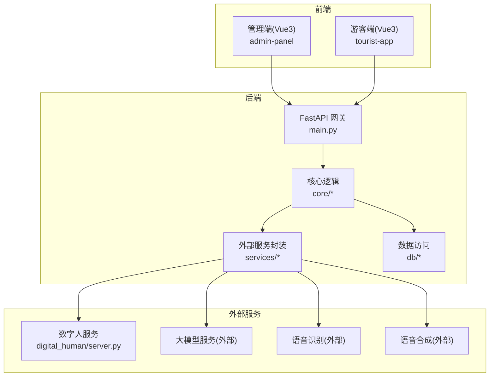
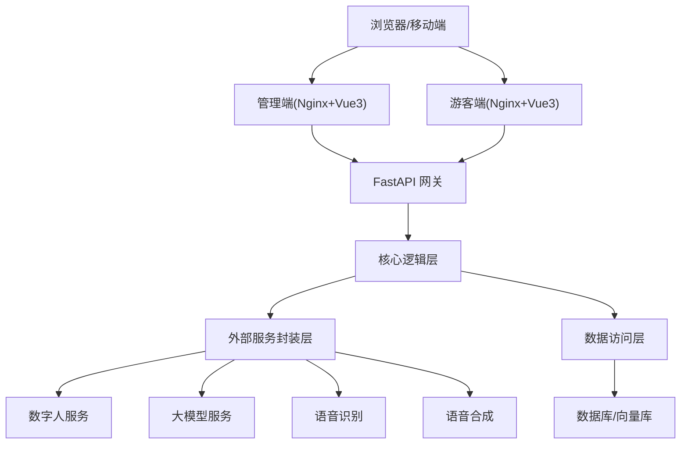
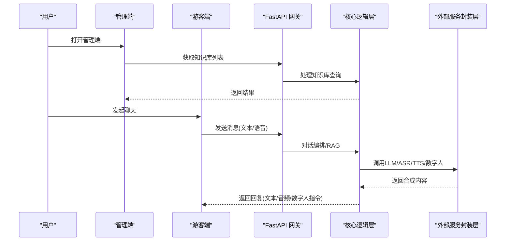
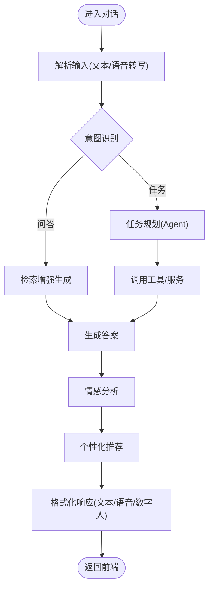
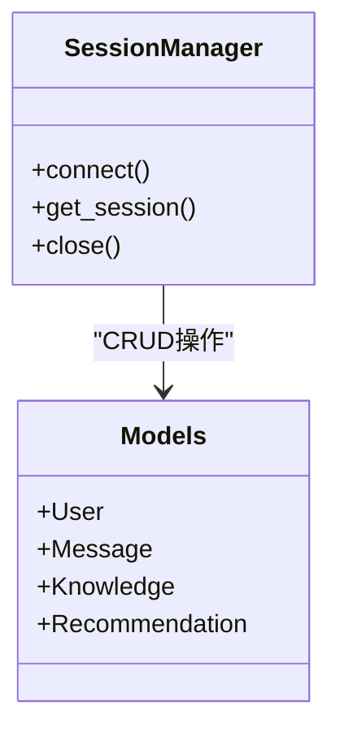
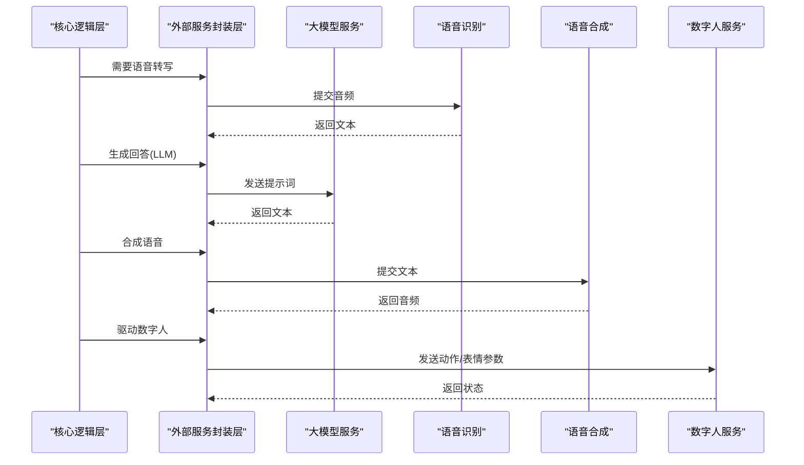
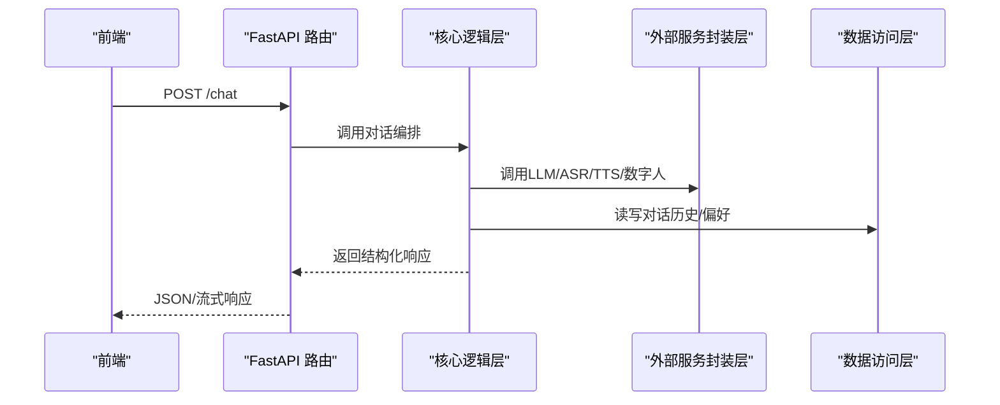
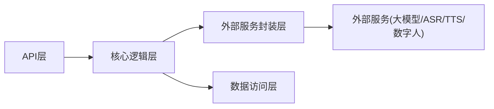
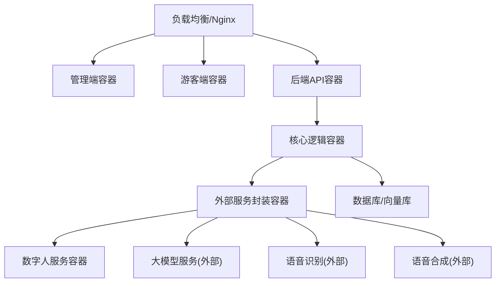

# 整体架构概览

<cite>
**本文引用的文件**   
- [backend/app/main.py](file://backend/app/main.py)
- [backend/app/config.py](file://backend/app/config.py)
- [backend/app/api/chat.py](file://backend/app/api/chat.py)
- [backend/app/api/knowledge.py](file://backend/app/api/knowledge.py)
- [backend/app/api/recommend.py](file://backend/app/api/recommend.py)
- [backend/app/core/rag.py](file://backend/app/core/rag.py)
- [backend/app/core/agent.py](file://backend/app/core/agent.py)
- [backend/app/services/llm.py](file://backend/app/services/llm.py)
- [backend/app/services/asr.py](file://backend/app/services/asr.py)
- [backend/app/services/tts.py](file://backend/app/services/tts.py)
- [backend/app/services/digital_human.py](file://backend/app/services/digital_human.py)
- [backend/app/db/models.py](file://backend/app/db/models.py)
- [backend/app/db/session.py](file://backend/app/db/session.py)
- [digital_human/server.py](file://digital_human/server.py)
- [frontend/admin-panel/src/router/index.ts](file://frontend/admin-panel/src/router/index.ts)
- [frontend/admin-panel/src/views/Dashboard/DashboardView.vue](file://frontend/admin-panel/src/views/Dashboard/DashboardView.vue)
- [frontend/admin-panel/src/views/KnowledgeBase/KnowledgeView.vue](file://frontend/admin-panel/src/views/KnowledgeBase/KnowledgeView.vue)
- [frontend/admin-panel/src/services/api.ts](file://frontend/admin-panel/src/services/api.ts)
- [frontend/tourist-app/src/router/index.ts](file://frontend/tourist-app/src/router/index.ts)
- [frontend/tourist-app/src/views/ChatView.vue](file://frontend/tourist-app/src/views/ChatView.vue)
- [frontend/tourist-app/src/components/DigitalHuman/DigitalHuman.vue](file://frontend/tourist-app/src/components/DigitalHuman/DigitalHuman.vue)
- [frontend/tourist-app/src/services/speech.ts](file://frontend/tourist-app/src/services/speech.ts)
- [docker-compose.yml](file://docker-compose.yml)
</cite>

## 目录
1. [引言](#引言)
2. [项目结构](#项目结构)
3. [核心组件](#核心组件)
4. [架构总览](#架构总览)
5. [详细组件分析](#详细组件分析)
6. [依赖关系分析](#依赖关系分析)
7. [性能考量](#性能考量)
8. [故障排查指南](#故障排查指南)
9. [结论](#结论)
10. [附录](#附录)

## 引言
本文件面向架构师与技术负责人，提供SmartTour系统的整体架构概览。系统采用前后端分离与容器化部署，后端基于Python/FastAPI，前端为Vue3应用（游客端与管理端），并集成数字人、语音识别/合成、检索增强生成等能力。文档从设计模式、技术选型、分层职责、组件边界、拓扑与部署图等方面给出全局视角，帮助读者快速理解系统结构与演进方向。

## 项目结构
仓库采用多模块组织：
- backend：FastAPI后端服务，包含API路由、领域核心逻辑、外部服务封装、数据库模型与会话管理。
- digital_human：独立的数字人服务，提供数字人渲染/推流相关接口。
- frontend：两个独立的前端应用，分别服务于游客交互（聊天、数字人展示）与后台管理（知识管理、仪表盘）。
- docker-compose.yml：编排所有服务的容器化部署。

图表来源
- [backend/app/main.py](file://backend/app/main.py)
- [backend/app/core/rag.py](file://backend/app/core/rag.py)
- [backend/app/services/llm.py](file://backend/app/services/llm.py)
- [backend/app/services/asr.py](file://backend/app/services/asr.py)
- [backend/app/services/tts.py](file://backend/app/services/tts.py)
- [backend/app/services/digital_human.py](file://backend/app/services/digital_human.py)
- [backend/app/db/models.py](file://backend/app/db/models.py)
- [backend/app/db/session.py](file://backend/app/db/session.py)
- [digital_human/server.py](file://digital_human/server.py)
- [frontend/admin-panel/src/router/index.ts](file://frontend/admin-panel/src/router/index.ts)
- [frontend/tourist-app/src/router/index.ts](file://frontend/tourist-app/src/router/index.ts)

章节来源
- [backend/app/main.py](file://backend/app/main.py)
- [backend/app/config.py](file://backend/app/config.py)
- [docker-compose.yml](file://docker-compose.yml)

## 核心组件
- 表现层（前端）
  - 管理端：路由与页面组织、知识库管理、数据分析看板。
  - 游客端：聊天界面、数字人展示、语音输入输出。
- 业务逻辑层（后端核心）
  - 对话编排、检索增强生成（RAG）、智能体调度、情感分析、推荐策略。
- 数据访问层
  - 数据库模型定义、会话管理与事务控制。
- 外部服务集成层
  - 大模型调用、ASR/TTS、数字人服务、文档解析、持久化存储。

章节来源
- [backend/app/core/rag.py](file://backend/app/core/rag.py)
- [backend/app/core/agent.py](file://backend/app/core/agent.py)
- [backend/app/db/models.py](file://backend/app/db/models.py)
- [backend/app/db/session.py](file://backend/app/db/session.py)
- [backend/app/services/llm.py](file://backend/app/services/llm.py)
- [backend/app/services/asr.py](file://backend/app/services/asr.py)
- [backend/app/services/tts.py](file://backend/app/services/tts.py)
- [backend/app/services/digital_human.py](file://backend/app/services/digital_human.py)

## 架构总览
系统采用“前后端分离 + 微服务化”的混合模式：
- 前后端分离：前端通过HTTP/WebSocket与后端交互；管理端与游客端独立构建与部署。
- 微服务化：数字人服务独立部署，后端按功能域拆分为API、Core、Services、DB四层，便于扩展与维护。
- 容器化：使用Docker与docker-compose统一编排，简化本地开发与生产部署。

图表来源
- [frontend/admin-panel/src/router/index.ts](file://frontend/admin-panel/src/router/index.ts)
- [frontend/tourist-app/src/router/index.ts](file://frontend/tourist-app/src/router/index.ts)
- [backend/app/main.py](file://backend/app/main.py)
- [backend/app/core/rag.py](file://backend/app/core/rag.py)
- [backend/app/services/digital_human.py](file://backend/app/services/digital_human.py)
- [backend/app/services/llm.py](file://backend/app/services/llm.py)
- [backend/app/services/asr.py](file://backend/app/services/asr.py)
- [backend/app/services/tts.py](file://backend/app/services/tts.py)
- [backend/app/db/models.py](file://backend/app/db/models.py)
- [backend/app/db/session.py](file://backend/app/db/session.py)
- [docker-compose.yml](file://docker-compose.yml)

## 详细组件分析

### 表现层（前端）
- 管理端
  - 路由与视图：集中式路由配置，Dashboard与KnowledgeBase页面负责运营与知识维护。
  - 服务层：统一的API客户端封装，向后端发送请求。
- 游客端
  - 路由与视图：Home、Chat、RoutePlan等页面，聚焦游客体验。
  - 数字人组件：在页面中嵌入数字人渲染与交互。
  - 语音能力：浏览器端录音与播放，结合后端ASR/TTS完成语音对话。

图表来源
- [frontend/admin-panel/src/router/index.ts](file://frontend/admin-panel/src/router/index.ts)
- [frontend/admin-panel/src/views/Dashboard/DashboardView.vue](file://frontend/admin-panel/src/views/Dashboard/DashboardView.vue)
- [frontend/admin-panel/src/views/KnowledgeBase/KnowledgeView.vue](file://frontend/admin-panel/src/views/KnowledgeBase/KnowledgeView.vue)
- [frontend/admin-panel/src/services/api.ts](file://frontend/admin-panel/src/services/api.ts)
- [frontend/tourist-app/src/router/index.ts](file://frontend/tourist-app/src/router/index.ts)
- [frontend/tourist-app/src/views/ChatView.vue](file://frontend/tourist-app/src/views/ChatView.vue)
- [frontend/tourist-app/src/components/DigitalHuman/DigitalHuman.vue](file://frontend/tourist-app/src/components/DigitalHuman/DigitalHuman.vue)
- [frontend/tourist-app/src/services/speech.ts](file://frontend/tourist-app/src/services/speech.ts)
- [backend/app/main.py](file://backend/app/main.py)
- [backend/app/core/rag.py](file://backend/app/core/rag.py)
- [backend/app/services/llm.py](file://backend/app/services/llm.py)
- [backend/app/services/asr.py](file://backend/app/services/asr.py)
- [backend/app/services/tts.py](file://backend/app/services/tts.py)
- [backend/app/services/digital_human.py](file://backend/app/services/digital_human.py)

章节来源
- [frontend/admin-panel/src/router/index.ts](file://frontend/admin-panel/src/router/index.ts)
- [frontend/admin-panel/src/views/Dashboard/DashboardView.vue](file://frontend/admin-panel/src/views/Dashboard/DashboardView.vue)
- [frontend/admin-panel/src/views/KnowledgeBase/KnowledgeView.vue](file://frontend/admin-panel/src/views/KnowledgeBase/KnowledgeView.vue)
- [frontend/admin-panel/src/services/api.ts](file://frontend/admin-panel/src/services/api.ts)
- [frontend/tourist-app/src/router/index.ts](file://frontend/tourist-app/src/router/index.ts)
- [frontend/tourist-app/src/views/ChatView.vue](file://frontend/tourist-app/src/views/ChatView.vue)
- [frontend/tourist-app/src/components/DigitalHuman/DigitalHuman.vue](file://frontend/tourist-app/src/components/DigitalHuman/DigitalHuman.vue)
- [frontend/tourist-app/src/services/speech.ts](file://frontend/tourist-app/src/services/speech.ts)

### 业务逻辑层（后端核心）
- 对话编排：整合RAG、Agent、情感分析与推荐，形成端到端对话流程。
- RAG：检索知识库片段，结合上下文生成高质量回答。
- Agent：根据意图进行任务规划与工具调用。
- 推荐：基于用户画像与上下文生成个性化建议。

图表来源
- [backend/app/core/rag.py](file://backend/app/core/rag.py)
- [backend/app/core/agent.py](file://backend/app/core/agent.py)
- [backend/app/core/sentiment.py](file://backend/app/core/sentiment.py)
- [backend/app/core/recommend.py](file://backend/app/core/recommend.py)

章节来源
- [backend/app/core/rag.py](file://backend/app/core/rag.py)
- [backend/app/core/agent.py](file://backend/app/core/agent.py)
- [backend/app/core/sentiment.py](file://backend/app/core/sentiment.py)
- [backend/app/core/recommend.py](file://backend/app/core/recommend.py)

### 数据访问层
- 模型定义：实体与字段映射，支撑业务对象持久化。
- 会话管理：连接池、事务与资源释放，保证并发安全。

图表来源
- [backend/app/db/session.py](file://backend/app/db/session.py)
- [backend/app/db/models.py](file://backend/app/db/models.py)

章节来源
- [backend/app/db/session.py](file://backend/app/db/session.py)
- [backend/app/db/models.py](file://backend/app/db/models.py)

### 外部服务集成层
- 大模型服务：封装LLM调用，支持重试、超时与错误降级。
- 语音服务：ASR将语音转为文本，TTS将文本转为语音。
- 数字人服务：独立服务，提供形象驱动与动作控制。
- 文档解析与持久化：对上传文档进行解析与索引，供RAG检索。

图表来源
- [backend/app/services/llm.py](file://backend/app/services/llm.py)
- [backend/app/services/asr.py](file://backend/app/services/asr.py)
- [backend/app/services/tts.py](file://backend/app/services/tts.py)
- [backend/app/services/digital_human.py](file://backend/app/services/digital_human.py)
- [digital_human/server.py](file://digital_human/server.py)

章节来源
- [backend/app/services/llm.py](file://backend/app/services/llm.py)
- [backend/app/services/asr.py](file://backend/app/services/asr.py)
- [backend/app/services/tts.py](file://backend/app/services/tts.py)
- [backend/app/services/digital_human.py](file://backend/app/services/digital_human.py)
- [digital_human/server.py](file://digital_human/server.py)

### API层（路由与控制器）
- 聊天API：接收消息、触发对话流程、返回文本/音频/数字人指令。
- 知识库API：增删改查知识条目，触发索引更新。
- 推荐API：根据上下文与用户画像生成推荐结果。

图表来源
- [backend/app/api/chat.py](file://backend/app/api/chat.py)
- [backend/app/api/knowledge.py](file://backend/app/api/knowledge.py)
- [backend/app/api/recommend.py](file://backend/app/api/recommend.py)
- [backend/app/main.py](file://backend/app/main.py)
- [backend/app/core/rag.py](file://backend/app/core/rag.py)
- [backend/app/services/llm.py](file://backend/app/services/llm.py)
- [backend/app/db/models.py](file://backend/app/db/models.py)
- [backend/app/db/session.py](file://backend/app/db/session.py)

章节来源
- [backend/app/api/chat.py](file://backend/app/api/chat.py)
- [backend/app/api/knowledge.py](file://backend/app/api/knowledge.py)
- [backend/app/api/recommend.py](file://backend/app/api/recommend.py)
- [backend/app/main.py](file://backend/app/main.py)

## 依赖关系分析
- 组件耦合
  - API层仅依赖核心逻辑与外部服务封装，避免直接访问数据库，保持高内聚低耦合。
  - 核心逻辑不感知具体外部实现细节，通过封装层屏蔽差异。
- 外部依赖
  - 大模型、ASR/TTS、数字人均为外部服务，需考虑网络延迟与可用性。
- 潜在循环依赖
  - 当前分层清晰，未见明显循环依赖；建议在新增服务时严格遵循单向依赖原则。

图表来源
- [backend/app/main.py](file://backend/app/main.py)
- [backend/app/core/rag.py](file://backend/app/core/rag.py)
- [backend/app/services/llm.py](file://backend/app/services/llm.py)
- [backend/app/db/models.py](file://backend/app/db/models.py)

章节来源
- [backend/app/main.py](file://backend/app/main.py)
- [backend/app/core/rag.py](file://backend/app/core/rag.py)
- [backend/app/services/llm.py](file://backend/app/services/llm.py)
- [backend/app/db/models.py](file://backend/app/db/models.py)

## 性能考量
- 异步与并发
  - FastAPI天然支持异步I/O，适合高并发场景；对外部服务调用应使用异步客户端，避免阻塞。
- 缓存与索引
  - 对高频问答与推荐结果引入缓存；知识库增量索引，减少全量重建开销。
- 流式响应
  - 长文本或语音合成可考虑流式传输，降低首字节延迟。
- 资源隔离
  - 数字人服务独立部署，避免CPU/GPU争用影响主服务稳定性。

[本节为通用指导，无需特定文件引用]

## 故障排查指南
- 常见问题定位
  - 前端无法连接后端：检查Nginx反向代理与域名/端口配置。
  - 语音转写失败：确认ASR服务可用性与音频格式。
  - 数字人无响应：检查数字人服务健康检查与网络连通性。
  - 知识库检索为空：验证文档解析与索引是否成功。
- 日志与监控
  - 在后端关键路径添加结构化日志；对外部服务调用记录耗时与错误码。
  - 使用容器编排平台收集指标与健康检查状态。

章节来源
- [backend/app/services/asr.py](file://backend/app/services/asr.py)
- [backend/app/services/tts.py](file://backend/app/services/tts.py)
- [backend/app/services/digital_human.py](file://backend/app/services/digital_human.py)
- [backend/app/services/llm.py](file://backend/app/services/llm.py)
- [docker-compose.yml](file://docker-compose.yml)

## 结论
SmartTour采用前后端分离与微服务化的混合架构，通过清晰的层次划分与容器化编排，实现了可扩展、易维护的系统形态。技术选型以Python/FastAPI的高并发与生态优势、Vue3的前端开发效率、以及Docker的标准化部署为核心依据。未来可在服务治理、可观测性与弹性伸缩方面持续优化，进一步提升用户体验与系统可靠性。

[本节为总结性内容，无需特定文件引用]

## 附录
- 部署架构图（概念）

[此图为概念性部署示意，未直接映射到具体源码文件]