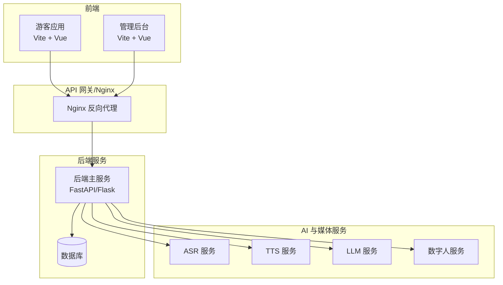
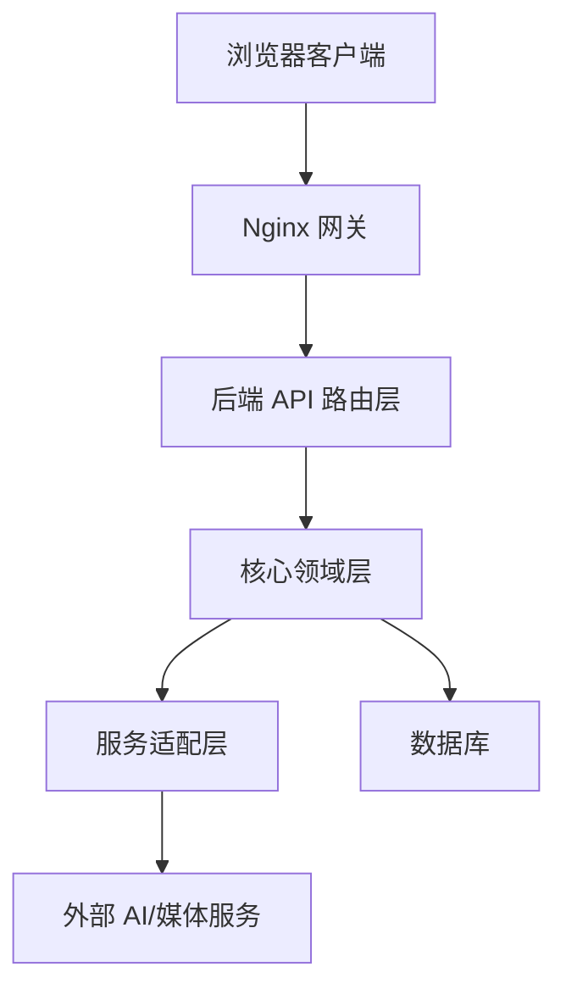
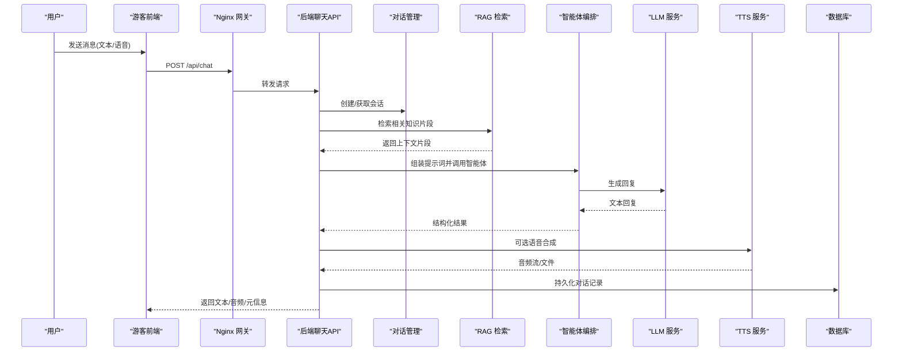
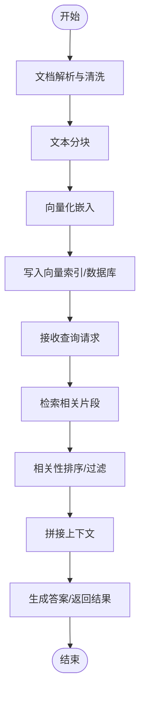
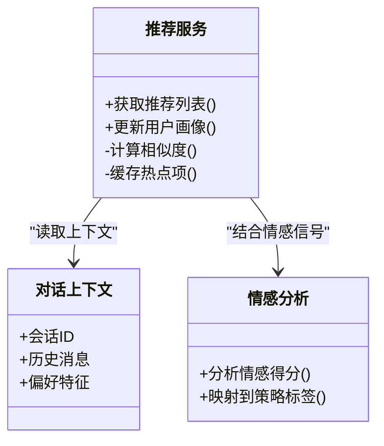
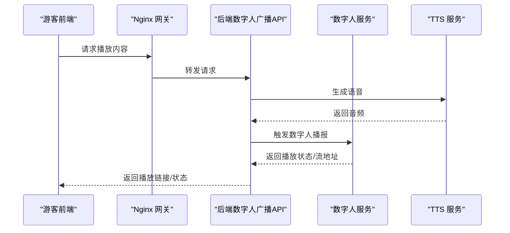
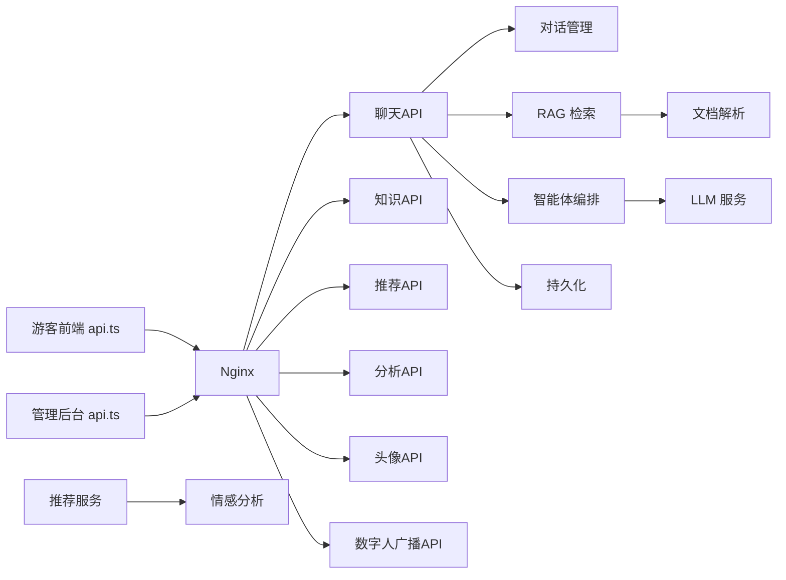

# 系统架构设计

<cite>
**本文引用的文件**   
- [backend/app/main.py](file://backend/app/main.py)
- [backend/app/config.py](file://backend/app/config.py)
- [backend/app/api/analytics.py](file://backend/app/api/analytics.py)
- [backend/app/api/avatar.py](file://backend/app/api/avatar.py)
- [backend/app/api/chat.py](file://backend/app/api/chat.py)
- [backend/app/api/digital_human_broadcast.py](file://backend/app/api/digital_human_broadcast.py)
- [backend/app/api/knowledge.py](file://backend/app/api/knowledge.py)
- [backend/app/api/recommend.py](file://backend/app/api/recommend.py)
- [backend/app/core/agent.py](file://backend/app/core/agent.py)
- [backend/app/core/dialogue.py](file://backend/app/core/dialogue.py)
- [backend/app/core/rag.py](file://backend/app/core/rag.py)
- [backend/app/core/recommend.py](file://backend/app/core/recommend.py)
- [backend/app/core/sentiment.py](file://backend/app/core/sentiment.py)
- [backend/app/db/models.py](file://backend/app/db/models.py)
- [backend/app/db/session.py](file://backend/app/db/session.py)
- [backend/app/services/asr.py](file://backend/app/services/asr.py)
- [backend/app/services/tts.py](file://backend/app/services/tts.py)
- [backend/app/services/llm.py](file://backend/app/services/llm.py)
- [backend/app/services/document_parser.py](file://backend/app/services/document_parser.py)
- [backend/app/services/persistence.py](file://backend/app/services/persistence.py)
- [backend/app/services/digital_human.py](file://backend/app/services/digital_human.py)
- [digital_human/server.py](file://digital_human/server.py)
- [frontend/admin-panel/src/services/api.ts](file://frontend/admin-panel/src/services/api.ts)
- [frontend/tourist-app/src/services/api.ts](file://frontend/tourist-app/src/services/api.ts)
- [docker-compose.yml](file://docker-compose.yml)
</cite>

## 目录
1. [简介](#简介)
2. [项目结构](#项目结构)
3. [核心组件](#核心组件)
4. [架构总览](#架构总览)
5. [详细组件分析](#详细组件分析)
6. [依赖关系分析](#依赖关系分析)
7. [性能与可扩展性](#性能与可扩展性)
8. [安全性设计](#安全性设计)
9. [部署与运维](#部署与运维)
10. [故障排查指南](#故障排查指南)
11. [结论](#结论)

## 简介
本文件面向架构师与高级开发者，系统化阐述 SmartTour 系统的整体架构、边界定义、核心组件交互与数据流向，并给出技术选型权衡、安全与容错策略、性能优化建议及部署拓扑。SmartTour 采用前后端分离与分层架构，后端以 Python Web 服务为核心，集成对话智能体、RAG 检索增强生成、语音识别（ASR）、语音合成（TTS）、数字人播报等能力；前端包含游客应用与管理后台两个独立 SPA，通过统一 API 网关访问后端服务。

## 项目结构
仓库采用多模块组织：
- backend：Python 后端服务，提供 REST API、领域核心逻辑、数据库模型与外部服务适配层
- digital_human：数字人直播/播报微服务，提供视频流或媒体播放接口
- frontend：两个独立前端应用（游客端与管理后台），分别打包为静态资源并通过 Nginx 提供服务
- docker-compose.yml：编排容器化部署

图表来源
- [backend/app/main.py](file://backend/app/main.py)
- [frontend/tourist-app/src/services/api.ts](file://frontend/tourist-app/src/services/api.ts)
- [frontend/admin-panel/src/services/api.ts](file://frontend/admin-panel/src/services/api.ts)
- [digital_human/server.py](file://digital_human/server.py)
- [docker-compose.yml](file://docker-compose.yml)

章节来源
- [backend/app/main.py](file://backend/app/main.py)
- [frontend/tourist-app/src/services/api.ts](file://frontend/tourist-app/src/services/api.ts)
- [frontend/admin-panel/src/services/api.ts](file://frontend/admin-panel/src/services/api.ts)
- [digital_human/server.py](file://digital_human/server.py)
- [docker-compose.yml](file://docker-compose.yml)

## 核心组件
- API 层：按业务域划分路由模块，如聊天、知识、推荐、分析、头像、数字人广播等
- 核心领域层：对话管理、智能体编排、RAG 检索增强、情感分析、推荐算法
- 服务适配层：ASR/TTS/LLM/文档解析/持久化/数字人等外部能力封装
- 数据层：ORM 模型与会话管理
- 配置中心：集中式配置加载与环境变量注入
- 前端应用：游客端与管理后台，分别调用不同 API 子集

章节来源
- [backend/app/api/chat.py](file://backend/app/api/chat.py)
- [backend/app/api/knowledge.py](file://backend/app/api/knowledge.py)
- [backend/app/api/recommend.py](file://backend/app/api/recommend.py)
- [backend/app/api/analytics.py](file://backend/app/api/analytics.py)
- [backend/app/api/avatar.py](file://backend/app/api/avatar.py)
- [backend/app/api/digital_human_broadcast.py](file://backend/app/api/digital_human_broadcast.py)
- [backend/app/core/dialogue.py](file://backend/app/core/dialogue.py)
- [backend/app/core/agent.py](file://backend/app/core/agent.py)
- [backend/app/core/rag.py](file://backend/app/core/rag.py)
- [backend/app/core/recommend.py](file://backend/app/core/recommend.py)
- [backend/app/core/sentiment.py](file://backend/app/core/sentiment.py)
- [backend/app/services/asr.py](file://backend/app/services/asr.py)
- [backend/app/services/tts.py](file://backend/app/services/tts.py)
- [backend/app/services/llm.py](file://backend/app/services/llm.py)
- [backend/app/services/document_parser.py](file://backend/app/services/document_parser.py)
- [backend/app/services/persistence.py](file://backend/app/services/persistence.py)
- [backend/app/services/digital_human.py](file://backend/app/services/digital_human.py)
- [backend/app/db/models.py](file://backend/app/db/models.py)
- [backend/app/db/session.py](file://backend/app/db/session.py)
- [backend/app/config.py](file://backend/app/config.py)

## 架构总览
SmartTour 采用“前后端分离 + 分层架构”的总体模式：
- 表现层：游客端与管理后台作为独立 SPA，通过 Nginx 反向代理暴露给浏览器
- 网关层：Nginx 负责静态资源托管、路径转发、TLS 终止与基础限流
- 应用层：后端主服务承载 API 路由、请求校验、会话编排与跨服务协调
- 领域层：对话、智能体、RAG、推荐、情感分析等业务核心
- 服务适配层：对 ASR/TTS/LLM/文档解析/数字人等外部能力的统一封装
- 数据层：关系型数据库与 ORM 抽象

图表来源
- [backend/app/main.py](file://backend/app/main.py)
- [backend/app/api/chat.py](file://backend/app/api/chat.py)
- [backend/app/core/agent.py](file://backend/app/core/agent.py)
- [backend/app/services/llm.py](file://backend/app/services/llm.py)
- [backend/app/db/models.py](file://backend/app/db/models.py)

## 详细组件分析

### 聊天与智能体编排
聊天流程串联用户输入、意图理解、检索增强、大模型生成与语音输出，同时维护对话上下文与状态。

图表来源
- [backend/app/api/chat.py](file://backend/app/api/chat.py)
- [backend/app/core/dialogue.py](file://backend/app/core/dialogue.py)
- [backend/app/core/rag.py](file://backend/app/core/rag.py)
- [backend/app/core/agent.py](file://backend/app/core/agent.py)
- [backend/app/services/llm.py](file://backend/app/services/llm.py)
- [backend/app/services/tts.py](file://backend/app/services/tts.py)
- [backend/app/db/models.py](file://backend/app/db/models.py)

章节来源
- [backend/app/api/chat.py](file://backend/app/api/chat.py)
- [backend/app/core/dialogue.py](file://backend/app/core/dialogue.py)
- [backend/app/core/rag.py](file://backend/app/core/rag.py)
- [backend/app/core/agent.py](file://backend/app/core/agent.py)
- [backend/app/services/llm.py](file://backend/app/services/llm.py)
- [backend/app/services/tts.py](file://backend/app/services/tts.py)
- [backend/app/db/models.py](file://backend/app/db/models.py)

### 知识库与 RAG 处理
知识入库涉及文档解析、分块、向量化与索引构建；查询时进行语义检索与重排，结合对话上下文生成回答。

图表来源
- [backend/app/api/knowledge.py](file://backend/app/api/knowledge.py)
- [backend/app/core/rag.py](file://backend/app/core/rag.py)
- [backend/app/services/document_parser.py](file://backend/app/services/document_parser.py)
- [backend/app/db/models.py](file://backend/app/db/models.py)

章节来源
- [backend/app/api/knowledge.py](file://backend/app/api/knowledge.py)
- [backend/app/core/rag.py](file://backend/app/core/rag.py)
- [backend/app/services/document_parser.py](file://backend/app/services/document_parser.py)
- [backend/app/db/models.py](file://backend/app/db/models.py)

### 推荐与情感分析
推荐模块基于用户画像与上下文进行个性化推荐；情感分析用于评估用户情绪并影响推荐策略或对话风格。

图表来源
- [backend/app/core/recommend.py](file://backend/app/core/recommend.py)
- [backend/app/core/sentiment.py](file://backend/app/core/sentiment.py)
- [backend/app/api/recommend.py](file://backend/app/api/recommend.py)

章节来源
- [backend/app/core/recommend.py](file://backend/app/core/recommend.py)
- [backend/app/core/sentiment.py](file://backend/app/core/sentiment.py)
- [backend/app/api/recommend.py](file://backend/app/api/recommend.py)

### 数字人广播与媒体服务
数字人服务提供媒体流或播放控制接口，后端通过适配层调用以实现导游讲解、景点介绍等场景。

图表来源
- [backend/app/api/digital_human_broadcast.py](file://backend/app/api/digital_human_broadcast.py)
- [backend/app/services/digital_human.py](file://backend/app/services/digital_human.py)
- [digital_human/server.py](file://digital_human/server.py)
- [backend/app/services/tts.py](file://backend/app/services/tts.py)

章节来源
- [backend/app/api/digital_human_broadcast.py](file://backend/app/api/digital_human_broadcast.py)
- [backend/app/services/digital_human.py](file://backend/app/services/digital_human.py)
- [digital_human/server.py](file://digital_human/server.py)
- [backend/app/services/tts.py](file://backend/app/services/tts.py)

### 头像与多媒体资源
头像上传、预览与配置由专门 API 处理，静态资源通常由 Nginx 直接托管以提升性能。

章节来源
- [backend/app/api/avatar.py](file://backend/app/api/avatar.py)

### 数据分析与运营指标
分析 API 聚合对话、推荐、使用行为等指标，供管理后台可视化展示。

章节来源
- [backend/app/api/analytics.py](file://backend/app/api/analytics.py)

### 配置与环境
集中配置加载环境变量与默认值，支持多环境切换与敏感信息隔离。

章节来源
- [backend/app/config.py](file://backend/app/config.py)

## 依赖关系分析
- 前端依赖：游客端与管理后台均通过各自 services/api.ts 调用后端 API，路径前缀由 Nginx 统一转发
- 后端内部依赖：API 路由层依赖核心领域层与服务适配层；核心层依赖数据库模型与会话管理
- 外部依赖：ASR/TTS/LLM/数字人服务以 HTTP/gRPC 等方式被后端适配层调用

图表来源
- [frontend/tourist-app/src/services/api.ts](file://frontend/tourist-app/src/services/api.ts)
- [frontend/admin-panel/src/services/api.ts](file://frontend/admin-panel/src/services/api.ts)
- [backend/app/api/chat.py](file://backend/app/api/chat.py)
- [backend/app/api/knowledge.py](file://backend/app/api/knowledge.py)
- [backend/app/api/recommend.py](file://backend/app/api/recommend.py)
- [backend/app/api/analytics.py](file://backend/app/api/analytics.py)
- [backend/app/api/avatar.py](file://backend/app/api/avatar.py)
- [backend/app/api/digital_human_broadcast.py](file://backend/app/api/digital_human_broadcast.py)
- [backend/app/core/dialogue.py](file://backend/app/core/dialogue.py)
- [backend/app/core/rag.py](file://backend/app/core/rag.py)
- [backend/app/core/agent.py](file://backend/app/core/agent.py)
- [backend/app/services/llm.py](file://backend/app/services/llm.py)
- [backend/app/services/document_parser.py](file://backend/app/services/document_parser.py)
- [backend/app/services/persistence.py](file://backend/app/services/persistence.py)
- [backend/app/core/recommend.py](file://backend/app/core/recommend.py)
- [backend/app/core/sentiment.py](file://backend/app/core/sentiment.py)

章节来源
- [frontend/tourist-app/src/services/api.ts](file://frontend/tourist-app/src/services/api.ts)
- [frontend/admin-panel/src/services/api.ts](file://frontend/admin-panel/src/services/api.ts)
- [backend/app/api/chat.py](file://backend/app/api/chat.py)
- [backend/app/api/knowledge.py](file://backend/app/api/knowledge.py)
- [backend/app/api/recommend.py](file://backend/app/api/recommend.py)
- [backend/app/api/analytics.py](file://backend/app/api/analytics.py)
- [backend/app/api/avatar.py](file://backend/app/api/avatar.py)
- [backend/app/api/digital_human_broadcast.py](file://backend/app/api/digital_human_broadcast.py)
- [backend/app/core/dialogue.py](file://backend/app/core/dialogue.py)
- [backend/app/core/rag.py](file://backend/app/core/rag.py)
- [backend/app/core/agent.py](file://backend/app/core/agent.py)
- [backend/app/services/llm.py](file://backend/app/services/llm.py)
- [backend/app/services/document_parser.py](file://backend/app/services/document_parser.py)
- [backend/app/services/persistence.py](file://backend/app/services/persistence.py)
- [backend/app/core/recommend.py](file://backend/app/core/recommend.py)
- [backend/app/core/sentiment.py](file://backend/app/core/sentiment.py)

## 性能与可扩展性
- 异步与并发：I/O 密集操作（网络请求、数据库读写）建议使用异步框架与连接池，避免阻塞事件循环
- 缓存策略：热点问答、推荐结果、向量检索中间结果可引入内存缓存与分布式缓存，降低重复计算与外部服务压力
- 批处理与分页：知识库入库与检索采用批量处理与分页查询，减少单次负载峰值
- 水平扩展：无状态 API 服务可横向扩容，配合负载均衡器实现弹性伸缩
- 流式传输：TTS 与数字人媒体流采用流式响应，提升首帧时间与用户体验
- 资源隔离：将 CPU 密集型任务（如嵌入、转码）放入独立工作进程或专用节点，避免影响主线程

[本节为通用指导，不直接分析具体文件]

## 安全性设计
- 身份认证与授权：在网关层实施 TLS 终止与访问控制，API 层引入 JWT/OAuth2 鉴权与细粒度权限校验
- 输入校验与防护：对所有入参进行严格校验，防止注入与越权访问
- 密钥管理：敏感配置（API Key、数据库密码）通过环境变量或密钥管理服务注入，禁止硬编码
- 审计与日志：关键操作留痕，集中收集日志与指标，便于追踪与合规审计
- 数据安全：传输加密、存储加密与最小权限原则贯穿全链路

[本节为通用指导，不直接分析具体文件]

## 部署与运维
- 容器编排：使用 docker-compose 编排后端、数字人服务与数据库，便于本地与测试环境快速启动
- 反向代理：Nginx 统一入口，静态资源直出，动态请求转发至后端
- 健康检查与自愈：为各服务添加健康检查探针，配合编排平台实现自动重启与滚动升级
- 监控告警：采集 QPS、延迟、错误率与资源使用率，设置阈值告警
- 灰度发布：通过网关权重路由逐步放量新版本，降低风险

章节来源
- [docker-compose.yml](file://docker-compose.yml)

## 故障排查指南
- 常见问题定位
  - 网关层：检查 Nginx 错误日志与上游服务可达性
  - API 层：核对路由注册、参数校验与异常堆栈
  - 领域层：关注对话状态机、RAG 检索命中率与提示词质量
  - 服务适配层：验证外部服务超时、重试与熔断配置
  - 数据层：检查连接池、慢查询与索引命中
- 诊断手段
  - 启用结构化日志与链路追踪，关联请求 ID
  - 使用压测工具模拟高并发，观察瓶颈点
  - 针对 LLM/ASR/TTS 增加降级策略与兜底模板

[本节为通用指导，不直接分析具体文件]

## 结论
SmartTour 以分层架构与前后端分离为基础，结合智能体编排、RAG 检索增强与多媒体播报能力，形成完整的智慧导览解决方案。通过合理的网关设计、服务适配与数据持久化，系统在可扩展性、性能与安全方面具备良好基础。后续可在缓存、流式处理、灰度发布与可观测性方面持续演进，以满足更大规模与更复杂场景的需求。