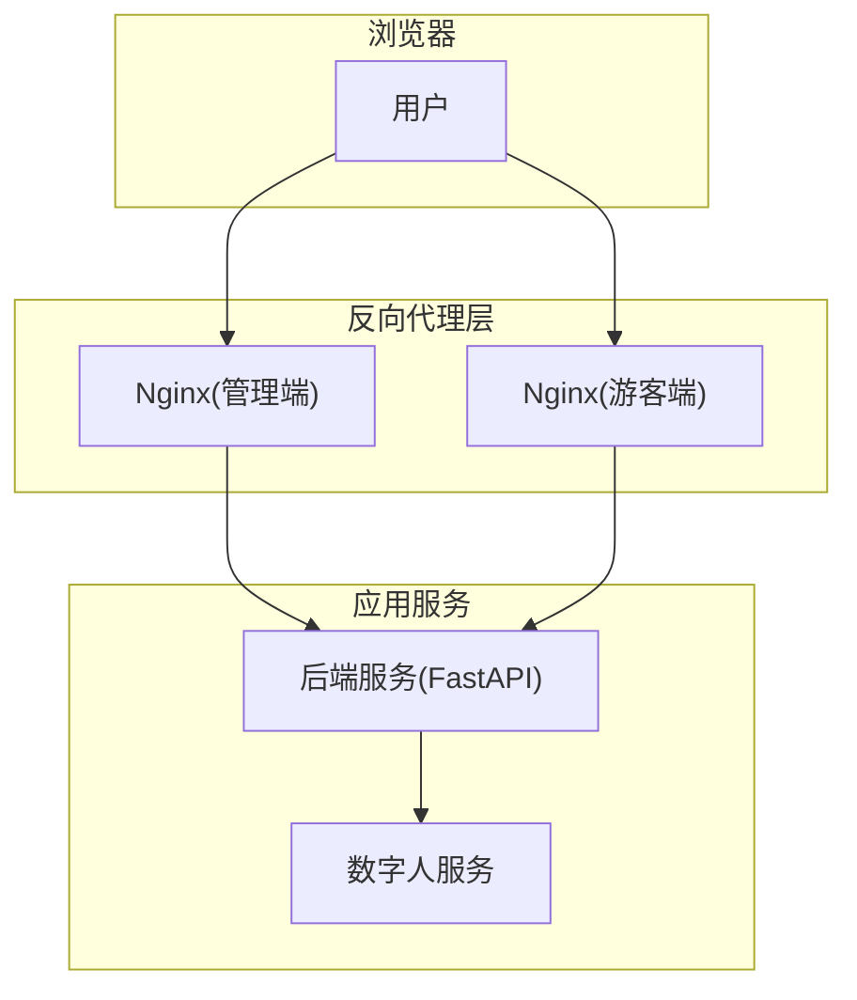
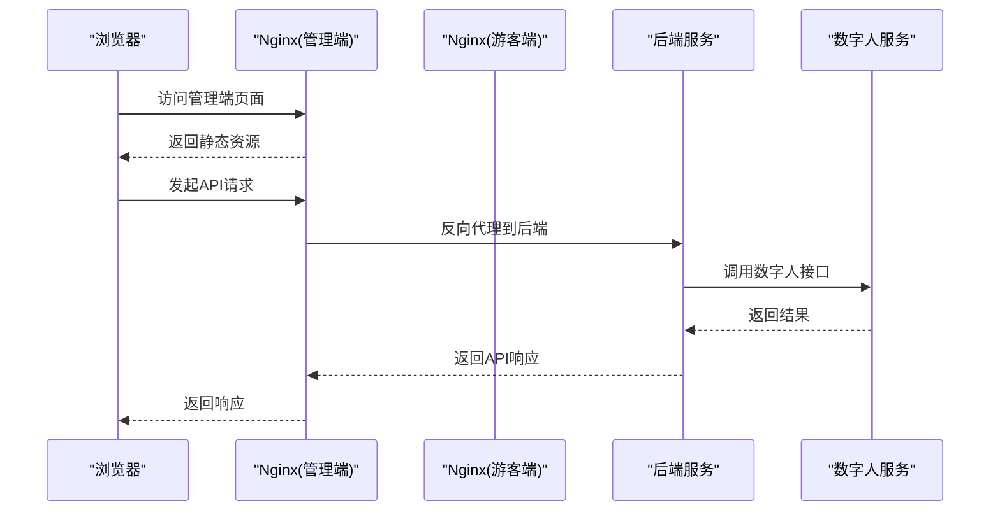
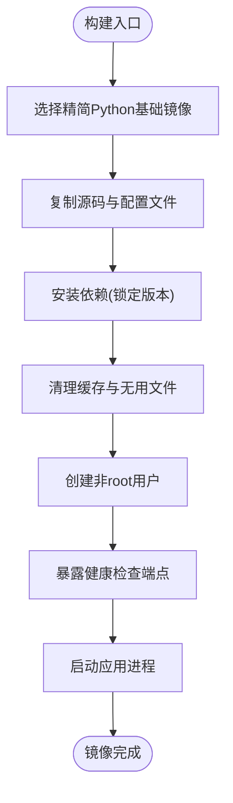
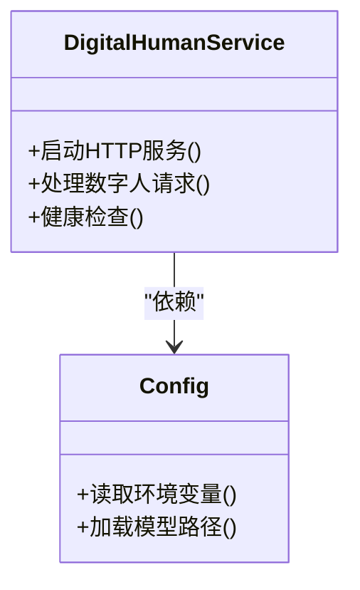
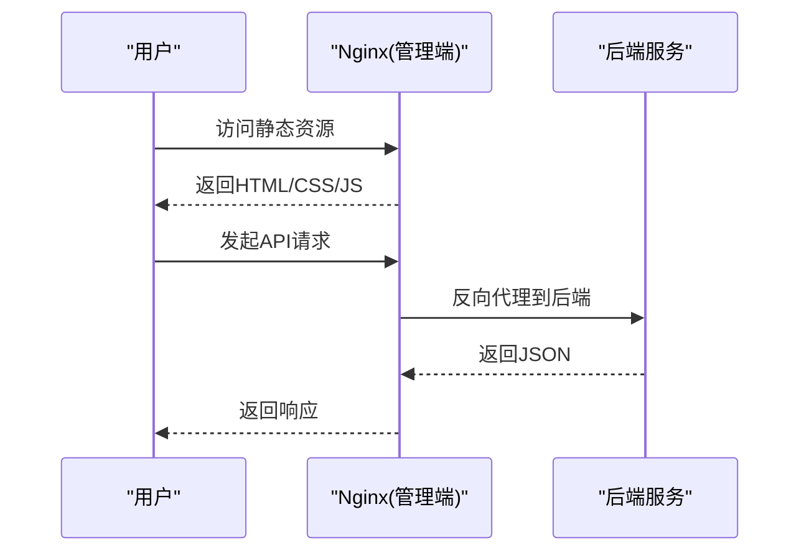
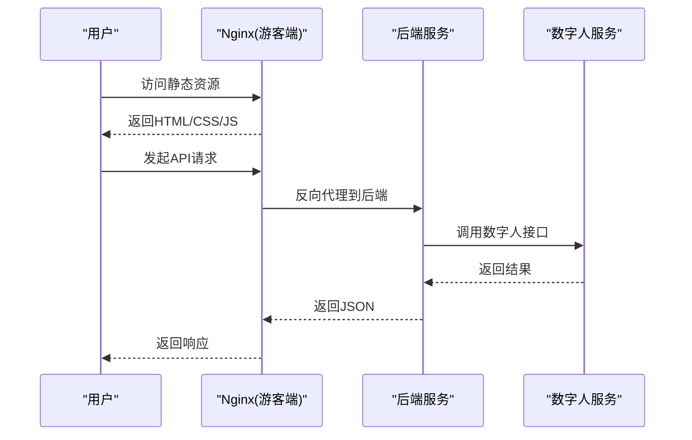
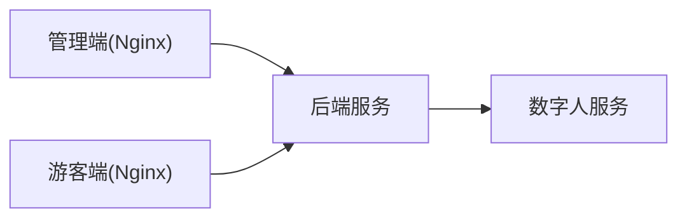

# Docker容器化部署

<cite>
**本文引用的文件**   
- [docker-compose.yml](file://docker-compose.yml)
- [backend/Dockerfile](file://backend/Dockerfile)
- [backend/pyproject.toml](file://backend/pyproject.toml)
- [backend/.dockerignore](file://backend/.dockerignore)
- [digital_human/Dockerfile](file://digital_human/Dockerfile)
- [digital_human/requirements.txt](file://digital_human/requirements.txt)
- [frontend/admin-panel/Dockerfile](file://frontend/admin-panel/Dockerfile)
- [frontend/admin-panel/nginx.conf](file://frontend/admin-panel/nginx.conf)
- [frontend/tourist-app/Dockerfile](file://frontend/tourist-app/Dockerfile)
- [frontend/tourist-app/nginx.conf](file://frontend/tourist-app/nginx.conf)
</cite>

## 目录
1. [简介](#简介)
2. [项目结构](#项目结构)
3. [核心组件](#核心组件)
4. [架构总览](#架构总览)
5. [详细组件分析](#详细组件分析)
6. [依赖关系分析](#依赖关系分析)
7. [性能与镜像优化](#性能与镜像优化)
8. [故障排查指南](#故障排查指南)
9. [结论](#结论)
10. [附录](#附录)

## 简介
本指南面向SmartTour系统的Docker容器化部署，覆盖后端服务、数字人服务以及两个前端应用（游客端与管理端）的镜像构建与服务编排。文档深入解释每个服务的Dockerfile构建过程（基础镜像选择、依赖安装、应用打包与镜像优化策略），详细说明docker-compose.yml的服务编排配置（服务间通信、网络设置、数据卷挂载与环境变量管理），并提供开发环境与生产环境的差异化方案（多阶段构建、镜像分层优化与安全加固）。同时给出容器健康检查、重启策略和资源限制的配置建议。

## 项目结构
SmartTour采用前后端分离与微服务化的思路：
- 后端服务：Python FastAPI应用，提供业务API、RAG、推荐、对话等能力。
- 数字人服务：独立的轻量HTTP服务，负责数字人相关逻辑。
- 前端应用：
  - 游客端：面向游客的Web应用，静态资源由Nginx托管。
  - 管理端：面向管理员的后台系统，静态资源由Nginx托管。
- 编排：通过docker-compose统一编排各服务、网络与数据卷。

图表来源
- [docker-compose.yml](file://docker-compose.yml)
- [frontend/admin-panel/Dockerfile](file://frontend/admin-panel/Dockerfile)
- [frontend/tourist-app/Dockerfile](file://frontend/tourist-app/Dockerfile)
- [backend/Dockerfile](file://backend/Dockerfile)
- [digital_human/Dockerfile](file://digital_human/Dockerfile)

章节来源
- [docker-compose.yml](file://docker-compose.yml)
- [backend/Dockerfile](file://backend/Dockerfile)
- [digital_human/Dockerfile](file://digital_human/Dockerfile)
- [frontend/admin-panel/Dockerfile](file://frontend/admin-panel/Dockerfile)
- [frontend/tourist-app/Dockerfile](file://frontend/tourist-app/Dockerfile)

## 核心组件
- 后端服务（FastAPI）
  - 职责：对外暴露REST API，集成RAG、推荐、对话、情感分析、ASR/TTS等能力。
  - 构建要点：基于Python运行时镜像，使用pyproject.toml声明依赖，按需安装并运行uvicorn/gunicorn。
  - 关键文件路径参考：[backend/Dockerfile](file://backend/Dockerfile)、[backend/pyproject.toml](file://backend/pyproject.toml)。
- 数字人服务
  - 职责：提供数字人相关的HTTP接口，供后端调用。
  - 构建要点：基于Python或Node运行时镜像，按requirements.txt或package.json安装依赖并启动服务。
  - 关键文件路径参考：[digital_human/Dockerfile](file://digital_human/Dockerfile)、[digital_human/requirements.txt](file://digital_human/requirements.txt)。
- 管理端前端
  - 职责：管理员后台界面，静态资源由Nginx托管。
  - 构建要点：多阶段构建（Node构建产物拷贝至Nginx镜像），配置反向代理到后端。
  - 关键文件路径参考：[frontend/admin-panel/Dockerfile](file://frontend/admin-panel/Dockerfile)、[frontend/admin-panel/nginx.conf](file://frontend/admin-panel/nginx.conf)。
- 游客端前端
  - 职责：游客交互界面，静态资源由Nginx托管。
  - 构建要点：多阶段构建（Node构建产物拷贝至Nginx镜像），配置反向代理到后端。
  - 关键文件路径参考：[frontend/tourist-app/Dockerfile](file://frontend/tourist-app/Dockerfile)、[frontend/tourist-app/nginx.conf](file://frontend/tourist-app/nginx.conf)。

章节来源
- [backend/Dockerfile](file://backend/Dockerfile)
- [backend/pyproject.toml](file://backend/pyproject.toml)
- [digital_human/Dockerfile](file://digital_human/Dockerfile)
- [digital_human/requirements.txt](file://digital_human/requirements.txt)
- [frontend/admin-panel/Dockerfile](file://frontend/admin-panel/Dockerfile)
- [frontend/admin-panel/nginx.conf](file://frontend/admin-panel/nginx.conf)
- [frontend/tourist-app/Dockerfile](file://frontend/tourist-app/Dockerfile)
- [frontend/tourist-app/nginx.conf](file://frontend/tourist-app/nginx.conf)

## 架构总览
下图展示了容器化后的整体架构与请求流转：浏览器访问Nginx（管理端/游客端），Nginx将API请求反向代理到后端服务；后端服务在需要时调用数字人服务。

图表来源
- [docker-compose.yml](file://docker-compose.yml)
- [frontend/admin-panel/nginx.conf](file://frontend/admin-panel/nginx.conf)
- [frontend/tourist-app/nginx.conf](file://frontend/tourist-app/nginx.conf)
- [backend/Dockerfile](file://backend/Dockerfile)
- [digital_human/Dockerfile](file://digital_human/Dockerfile)

## 详细组件分析

### 后端服务（FastAPI）
- 基础镜像选择
  - 建议使用官方Python精简版镜像作为基础，以减小体积并提升安全性。
- 依赖安装
  - 通过pyproject.toml声明依赖，在构建阶段一次性安装，避免运行期动态安装带来的不稳定。
- 应用打包
  - 将源码复制到镜像工作目录，确保仅包含必要文件（配合.dockerignore排除测试、日志、临时文件等）。
- 运行方式
  - 使用高性能WSGI/ASGI服务器（如uvicorn/gunicorn）启动应用，绑定0.0.0.0并监听指定端口。
- 环境变量
  - 通过docker-compose注入数据库连接、第三方服务密钥、日志级别等配置项。
- 健康检查
  - 定义HTTP健康检查端点，用于编排器探测服务可用性。
- 安全加固
  - 非root用户运行、最小权限原则、关闭调试模式、限制依赖来源。

图表来源
- [backend/Dockerfile](file://backend/Dockerfile)
- [backend/pyproject.toml](file://backend/pyproject.toml)
- [backend/.dockerignore](file://backend/.dockerignore)

章节来源
- [backend/Dockerfile](file://backend/Dockerfile)
- [backend/pyproject.toml](file://backend/pyproject.toml)
- [backend/.dockerignore](file://backend/.dockerignore)

### 数字人服务
- 基础镜像选择
  - 根据语言栈选择对应精简运行时镜像（Python/Node等）。
- 依赖安装
  - 使用requirements.txt或包管理器锁定版本，减少镜像体积与构建时间。
- 应用打包
  - 仅复制运行所需代码与资源，剔除无关文件。
- 运行方式
  - 启动轻量HTTP服务，监听指定端口，暴露健康检查接口。
- 环境变量
  - 通过compose注入模型路径、并发参数、外部服务地址等。
- 安全加固
  - 非root用户运行、最小依赖集、禁用不必要的系统工具。

图表来源
- [digital_human/Dockerfile](file://digital_human/Dockerfile)
- [digital_human/requirements.txt](file://digital_human/requirements.txt)

章节来源
- [digital_human/Dockerfile](file://digital_human/Dockerfile)
- [digital_human/requirements.txt](file://digital_human/requirements.txt)

### 管理端前端（Nginx托管）
- 多阶段构建
  - 第一阶段：Node环境安装依赖并构建静态资源。
  - 第二阶段：将构建产物拷贝至Nginx镜像，配置反向代理到后端。
- Nginx配置
  - 静态资源缓存、Gzip压缩、错误页定制、API反向代理路径映射。
- 环境变量
  - 通过构建参数或Nginx模板注入后端API地址。
- 安全加固
  - 隐藏版本号、启用HTTPS（可选）、限制请求大小。

图表来源
- [frontend/admin-panel/Dockerfile](file://frontend/admin-panel/Dockerfile)
- [frontend/admin-panel/nginx.conf](file://frontend/admin-panel/nginx.conf)

章节来源
- [frontend/admin-panel/Dockerfile](file://frontend/admin-panel/Dockerfile)
- [frontend/admin-panel/nginx.conf](file://frontend/admin-panel/nginx.conf)

### 游客端前端（Nginx托管）
- 多阶段构建
  - 与“管理端”类似，分阶段构建并最小化最终镜像。
- Nginx配置
  - 静态资源缓存、路由重定向、WebSocket支持（如需实时语音/视频）。
- 环境变量
  - 注入后端API地址、数字人服务地址等。
- 安全加固
  - 同管理端，结合CDN与缓存策略提升性能。

图表来源
- [frontend/tourist-app/Dockerfile](file://frontend/tourist-app/Dockerfile)
- [frontend/tourist-app/nginx.conf](file://frontend/tourist-app/nginx.conf)

章节来源
- [frontend/tourist-app/Dockerfile](file://frontend/tourist-app/Dockerfile)
- [frontend/tourist-app/nginx.conf](file://frontend/tourist-app/nginx.conf)

## 依赖关系分析
- 服务间依赖
  - 管理端与游客端均依赖后端服务；后端服务可能依赖数字人服务。
- 网络设置
  - 使用Compose默认网络，服务名即主机名，便于内部通信。
- 数据卷挂载
  - 为持久化数据（如知识库、日志、上传文件）配置命名卷或绑定挂载。
- 环境变量管理
  - 通过.env文件或compose中直接注入敏感配置，避免硬编码。

图表来源
- [docker-compose.yml](file://docker-compose.yml)

章节来源
- [docker-compose.yml](file://docker-compose.yml)

## 性能与镜像优化
- 多阶段构建
  - 前端：Node构建阶段与Nginx运行阶段分离，显著减小镜像体积。
  - 后端：仅在构建阶段安装依赖，运行阶段保持精简。
- 镜像分层优化
  - 将频繁变更的文件（如源码）放在较后层，稳定层（依赖）尽量复用缓存。
  - 清理包管理器缓存、下载缓存与临时文件。
- 安全加固
  - 使用非root用户运行、最小基础镜像、禁用调试模式、限制依赖来源。
- 资源限制
  - 在compose中为各服务设置CPU与内存上限，防止单服务占用过多资源。
- 健康检查
  - 为关键服务定义健康检查，确保编排器自动恢复异常实例。

章节来源
- [frontend/admin-panel/Dockerfile](file://frontend/admin-panel/Dockerfile)
- [frontend/tourist-app/Dockerfile](file://frontend/tourist-app/Dockerfile)
- [backend/Dockerfile](file://backend/Dockerfile)
- [digital_human/Dockerfile](file://digital_human/Dockerfile)
- [docker-compose.yml](file://docker-compose.yml)

## 故障排查指南
- 常见构建问题
  - 依赖安装失败：检查网络与镜像源，确认依赖版本兼容性与锁文件一致性。
  - 构建缓存失效：调整Dockerfile层顺序，将稳定依赖前置。
- 运行期问题
  - 端口冲突：确认各服务端口未重复，必要时在compose中映射不同宿主机端口。
  - 环境变量缺失：核对.env或compose中的变量注入是否完整。
  - 健康检查失败：检查健康检查端点可达性与返回状态码。
- 日志定位
  - 查看各服务容器日志，结合Nginx访问与错误日志定位问题。
- 回滚策略
  - 使用镜像标签进行版本管理，快速回滚到已知稳定版本。

章节来源
- [docker-compose.yml](file://docker-compose.yml)
- [backend/Dockerfile](file://backend/Dockerfile)
- [frontend/admin-panel/Dockerfile](file://frontend/admin-panel/Dockerfile)
- [frontend/tourist-app/Dockerfile](file://frontend/tourist-app/Dockerfile)
- [digital_human/Dockerfile](file://digital_human/Dockerfile)

## 结论
通过对SmartTour各服务的Dockerfile与docker-compose配置的深入分析，我们明确了多阶段构建、镜像分层优化、安全加固与健康检查的最佳实践。在生产环境中，应严格区分开发与生产配置，合理设置资源限制与重启策略，并通过环境变量集中管理敏感信息。持续监控与日志收集是保障系统稳定运行的关键。

## 附录
- 开发环境与生产环境差异建议
  - 开发环境：开启热重载、详细日志、调试模式；使用本地数据卷便于调试。
  - 生产环境：关闭调试、精简镜像、启用健康检查与资源限制、使用只读根文件系统（可选）。
- 常用命令
  - 构建与启动：使用compose一键构建与启动所有服务。
  - 查看日志：按服务名称过滤日志输出。
  - 进入容器：在容器中执行诊断命令。
- 扩展建议
  - 引入CI/CD流水线自动化构建与推送镜像。
  - 使用镜像扫描工具检测漏洞。
  - 结合Kubernetes实现弹性伸缩与滚动更新。