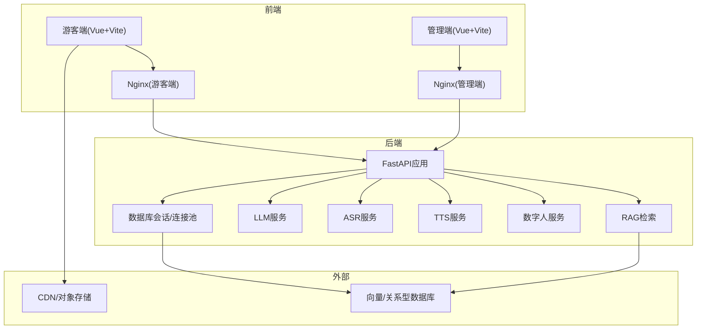
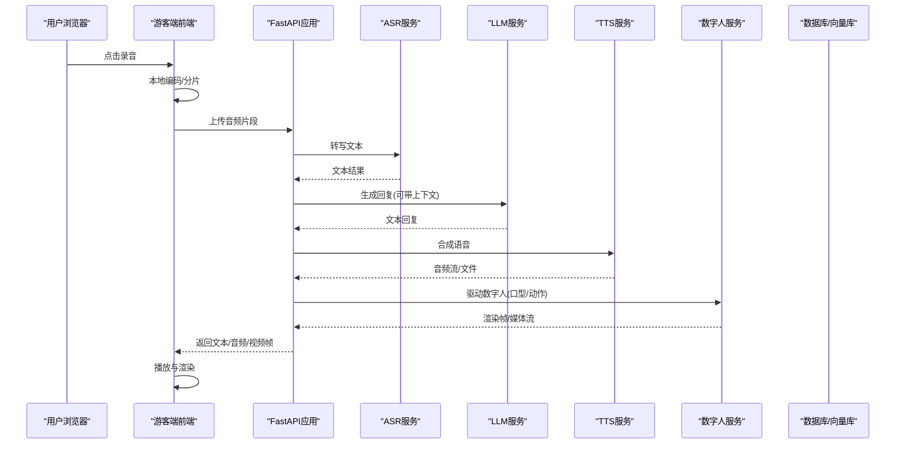
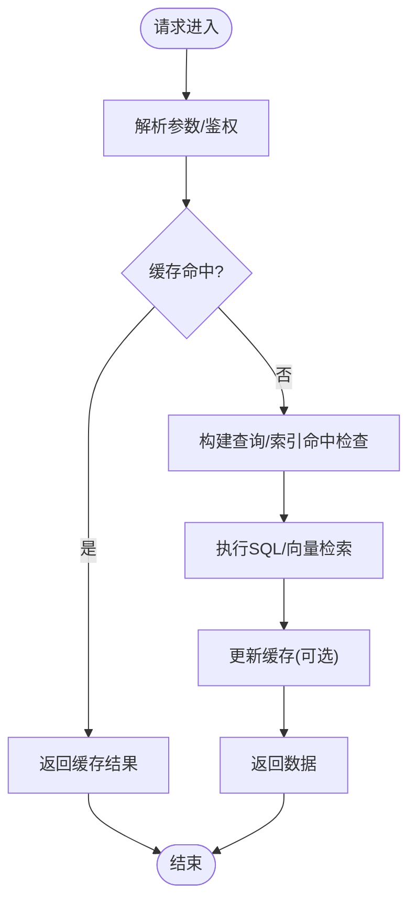
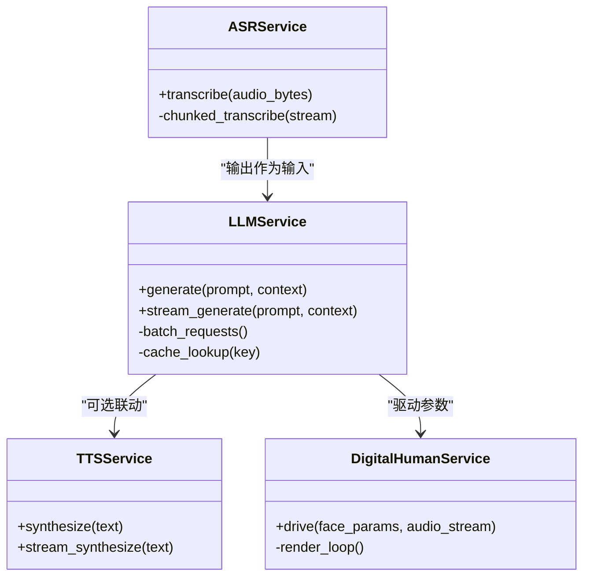
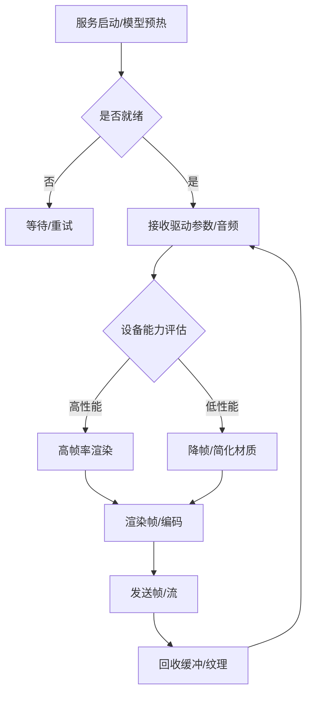
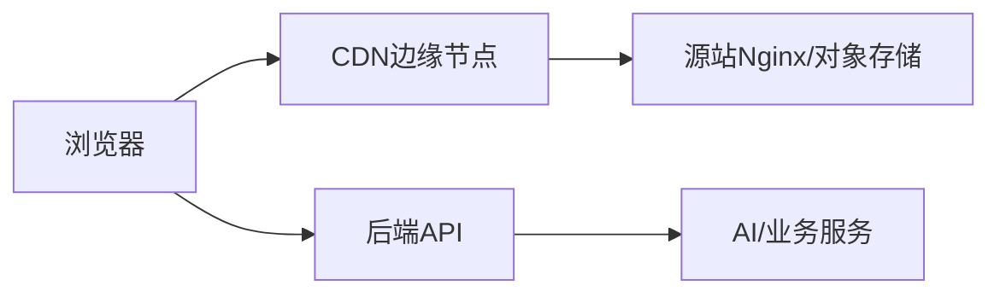
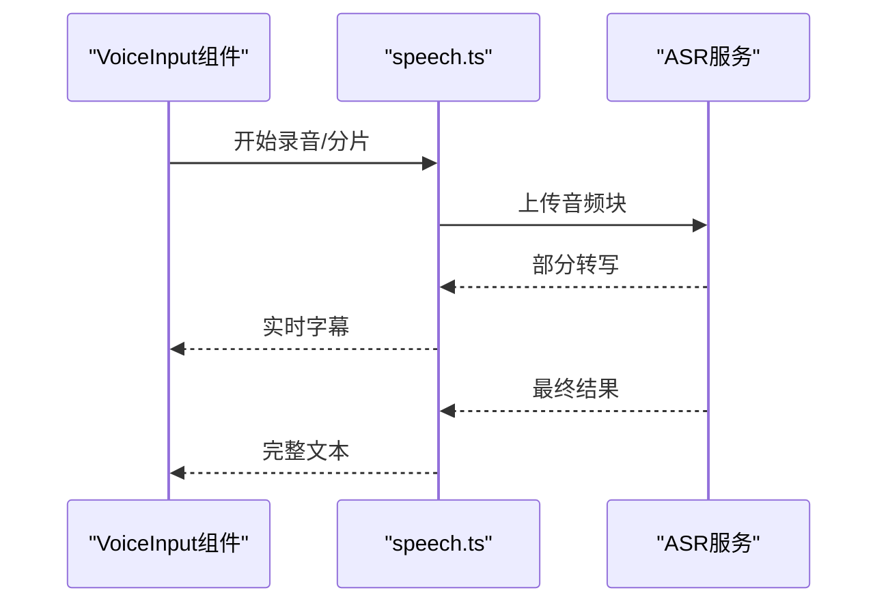
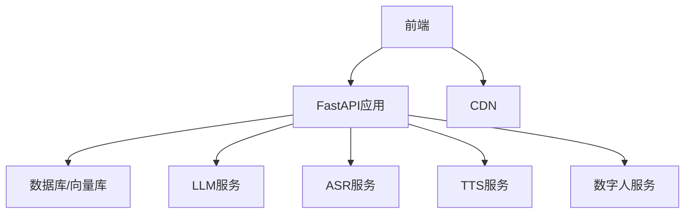

# 性能优化与调优

<cite>
**本文引用的文件**   
- [backend/app/main.py](file://backend/app/main.py)
- [backend/app/config.py](file://backend/app/config.py)
- [backend/app/db/session.py](file://backend/app/db/session.py)
- [backend/app/db/models.py](file://backend/app/db/models.py)
- [backend/app/services/llm.py](file://backend/app/services/llm.py)
- [backend/app/services/asr.py](file://backend/app/services/asr.py)
- [backend/app/services/tts.py](file://backend/app/services/tts.py)
- [backend/app/services/digital_human.py](file://backend/app/services/digital_human.py)
- [backend/app/api/chat.py](file://backend/app/api/chat.py)
- [backend/app/api/avatar.py](file://backend/app/api/avatar.py)
- [backend/app/core/rag.py](file://backend/app/core/rag.py)
- [digital_human/server.py](file://digital_human/server.py)
- [frontend/tourist-app/src/components/DigitalHuman/VrmAvatar.vue](file://frontend/tourist-app/src/components/DigitalHuman/VrmAvatar.vue)
- [frontend/tourist-app/src/components/DigitalHuman/ImageAvatar.vue](file://frontend/tourist-app/src/components/DigitalHuman/ImageAvatar.vue)
- [frontend/tourist-app/src/components/VoiceInput/VoiceInput.vue](file://frontend/tourist-app/src/components/VoiceInput/VoiceInput.vue)
- [frontend/tourist-app/src/services/speech.ts](file://frontend/tourist-app/src/services/speech.ts)
- [frontend/admin-panel/nginx.conf](file://frontend/admin-panel/nginx.conf)
- [frontend/tourist-app/nginx.conf](file://frontend/tourist-app/nginx.conf)
- [docker-compose.yml](file://docker-compose.yml)
</cite>

## 目录
1. [简介](#简介)
2. [项目结构](#项目结构)
3. [核心组件](#核心组件)
4. [架构总览](#架构总览)
5. [详细组件分析](#详细组件分析)
6. [依赖关系分析](#依赖关系分析)
7. [性能考量](#性能考量)
8. [故障排查指南](#故障排查指南)
9. [结论](#结论)
10. [附录](#附录)

## 简介
本指南面向SmartTour系统的性能优化与调优，覆盖后端服务、数据库、AI服务（LLM/ASR/TTS）、数字人渲染、前端资源与CDN、负载均衡与容量规划。目标是通过系统化的瓶颈识别方法、可落地的优化策略与基准测试流程，帮助团队在真实负载下稳定提升吞吐、降低延迟并控制成本。

## 项目结构
SmartTour采用前后端分离与微服务化思路：
- 后端：FastAPI应用，提供聊天、知识库、推荐、数字人等API；通过SQLAlchemy管理数据库会话；封装LLM/ASR/TTS/Digital Human等服务层。
- 数字人服务：独立进程，负责模型加载与渲染推理。
- 前端：游客端与管理端，分别由Vite构建并通过Nginx静态托管。
- 编排：Docker Compose统一启动各服务。

图表来源
- [backend/app/main.py](file://backend/app/main.py)
- [backend/app/db/session.py](file://backend/app/db/session.py)
- [backend/app/services/llm.py](file://backend/app/services/llm.py)
- [backend/app/services/asr.py](file://backend/app/services/asr.py)
- [backend/app/services/tts.py](file://backend/app/services/tts.py)
- [backend/app/services/digital_human.py](file://backend/app/services/digital_human.py)
- [backend/app/core/rag.py](file://backend/app/core/rag.py)
- [frontend/tourist-app/nginx.conf](file://frontend/tourist-app/nginx.conf)
- [frontend/admin-panel/nginx.conf](file://frontend/admin-panel/nginx.conf)
- [docker-compose.yml](file://docker-compose.yml)

章节来源
- [backend/app/main.py](file://backend/app/main.py)
- [backend/app/config.py](file://backend/app/config.py)
- [backend/app/db/session.py](file://backend/app/db/session.py)
- [backend/app/db/models.py](file://backend/app/db/models.py)
- [backend/app/services/llm.py](file://backend/app/services/llm.py)
- [backend/app/services/asr.py](file://backend/app/services/asr.py)
- [backend/app/services/tts.py](file://backend/app/services/tts.py)
- [backend/app/services/digital_human.py](file://backend/app/services/digital_human.py)
- [backend/app/core/rag.py](file://backend/app/core/rag.py)
- [frontend/tourist-app/nginx.conf](file://frontend/tourist-app/nginx.conf)
- [frontend/admin-panel/nginx.conf](file://frontend/admin-panel/nginx.conf)
- [docker-compose.yml](file://docker-compose.yml)

## 核心组件
- 应用入口与路由：定义HTTP接口、中间件、生命周期钩子与跨域配置。
- 数据库与会话：连接池参数、事务边界、慢查询日志开关。
- AI服务：LLM调用、ASR转写、TTS合成、数字人推理。
- 数字人服务：模型预热、批处理、帧率控制与内存回收。
- 前端与CDN：静态资源压缩、缓存头、懒加载与按需渲染。

章节来源
- [backend/app/main.py](file://backend/app/main.py)
- [backend/app/config.py](file://backend/app/config.py)
- [backend/app/db/session.py](file://backend/app/db/session.py)
- [backend/app/services/llm.py](file://backend/app/services/llm.py)
- [backend/app/services/asr.py](file://backend/app/services/asr.py)
- [backend/app/services/tts.py](file://backend/app/services/tts.py)
- [backend/app/services/digital_human.py](file://backend/app/services/digital_human.py)
- [digital_human/server.py](file://digital_human/server.py)
- [frontend/tourist-app/src/components/DigitalHuman/VrmAvatar.vue](file://frontend/tourist-app/src/components/DigitalHuman/VrmAvatar.vue)
- [frontend/tourist-app/src/components/DigitalHuman/ImageAvatar.vue](file://frontend/tourist-app/src/components/DigitalHuman/ImageAvatar.vue)
- [frontend/tourist-app/src/components/VoiceInput/VoiceInput.vue](file://frontend/tourist-app/src/components/VoiceInput/VoiceInput.vue)
- [frontend/tourist-app/src/services/speech.ts](file://frontend/tourist-app/src/services/speech.ts)

## 架构总览
下图展示一次“语音对话+数字人播报”的关键路径，涵盖前端采集、后端编排、AI服务与数字人渲染。

图表来源
- [backend/app/api/chat.py](file://backend/app/api/chat.py)
- [backend/app/services/asr.py](file://backend/app/services/asr.py)
- [backend/app/services/llm.py](file://backend/app/services/llm.py)
- [backend/app/services/tts.py](file://backend/app/services/tts.py)
- [backend/app/services/digital_human.py](file://backend/app/services/digital_human.py)
- [digital_human/server.py](file://digital_human/server.py)
- [frontend/tourist-app/src/components/VoiceInput/VoiceInput.vue](file://frontend/tourist-app/src/components/VoiceInput/VoiceInput.vue)
- [frontend/tourist-app/src/components/DigitalHuman/VrmAvatar.vue](file://frontend/tourist-app/src/components/DigitalHuman/VrmAvatar.vue)

## 详细组件分析

### 后端服务与数据库
- 连接池与超时：合理设置最大连接数、最小空闲连接、连接获取超时与空闲回收时间，避免连接泄漏与抖动。
- 事务与批量写入：将多步写入合并为单次事务，减少往返开销；对高吞吐写入使用批量插入。
- 索引与查询计划：针对高频过滤字段建立复合索引；定期分析慢查询并重构SQL或改写JOIN顺序。
- 读写分离与缓存：热点数据引入Redis缓存，读多写少场景显著降低DB压力。

图表来源
- [backend/app/db/session.py](file://backend/app/db/session.py)
- [backend/app/db/models.py](file://backend/app/db/models.py)
- [backend/app/core/rag.py](file://backend/app/core/rag.py)

章节来源
- [backend/app/db/session.py](file://backend/app/db/session.py)
- [backend/app/db/models.py](file://backend/app/db/models.py)
- [backend/app/core/rag.py](file://backend/app/core/rag.py)

### AI服务调用优化（LLM/ASR/TTS）
- 请求批处理：对短文本/小音频进行聚合，提高GPU/CPU利用率，降低尾延迟。
- 异步与流式：优先使用流式响应，减少首字节等待时间；长任务采用队列+回调。
- 缓存与去重：对常见问答/提示词做语义缓存；相同输入直接命中。
- 降级与熔断：当上游限流或错误率升高时快速失败并回退到模板答案。

图表来源
- [backend/app/services/llm.py](file://backend/app/services/llm.py)
- [backend/app/services/asr.py](file://backend/app/services/asr.py)
- [backend/app/services/tts.py](file://backend/app/services/tts.py)
- [backend/app/services/digital_human.py](file://backend/app/services/digital_human.py)

章节来源
- [backend/app/services/llm.py](file://backend/app/services/llm.py)
- [backend/app/services/asr.py](file://backend/app/services/asr.py)
- [backend/app/services/tts.py](file://backend/app/services/tts.py)
- [backend/app/services/digital_human.py](file://backend/app/services/digital_human.py)

### 数字人渲染性能优化
- 模型加载优化：启动期预加载模型与纹理，冷启动后复用实例；按需卸载闲置模型。
- 动画帧率控制：根据设备能力动态调整目标FPS，避免掉帧；关键路径使用增量更新。
- 内存管理：及时释放不再使用的缓冲区与纹理；限制并发渲染任务数量。
- 网络传输：对视频帧采用高效编码与差量传输；必要时降级为图片序列。

图表来源
- [digital_human/server.py](file://digital_human/server.py)
- [backend/app/services/digital_human.py](file://backend/app/services/digital_human.py)
- [frontend/tourist-app/src/components/DigitalHuman/VrmAvatar.vue](file://frontend/tourist-app/src/components/DigitalHuman/VrmAvatar.vue)
- [frontend/tourist-app/src/components/DigitalHuman/ImageAvatar.vue](file://frontend/tourist-app/src/components/DigitalHuman/ImageAvatar.vue)

章节来源
- [digital_human/server.py](file://digital_human/server.py)
- [backend/app/services/digital_human.py](file://backend/app/services/digital_human.py)
- [frontend/tourist-app/src/components/DigitalHuman/VrmAvatar.vue](file://frontend/tourist-app/src/components/DigitalHuman/VrmAvatar.vue)
- [frontend/tourist-app/src/components/DigitalHuman/ImageAvatar.vue](file://frontend/tourist-app/src/components/DigitalHuman/ImageAvatar.vue)

### 前端资源与CDN加速
- 静态资源：启用Gzip/Brotli压缩、开启强缓存与协商缓存；拆分包与懒加载。
- 媒体资源：音视频走CDN，按地域就近分发；切片与自适应码率。
- 交互优化：防抖/节流、虚拟列表、Web Worker处理重型计算。
- 监控埋点：上报首屏时间、FCP/LCP、JS错误与接口耗时。

图表来源
- [frontend/tourist-app/nginx.conf](file://frontend/tourist-app/nginx.conf)
- [frontend/admin-panel/nginx.conf](file://frontend/admin-panel/nginx.conf)

章节来源
- [frontend/tourist-app/nginx.conf](file://frontend/tourist-app/nginx.conf)
- [frontend/admin-panel/nginx.conf](file://frontend/admin-panel/nginx.conf)

### 语音输入链路优化
- 前端采集：分段录制、边录边传、断线重连与丢包补偿。
- 服务端处理：并行ASR、结果合并与纠错；对静音段裁剪减少无效计算。
- 端到端延迟：端到端计时埋点，定位瓶颈环节。

图表来源
- [frontend/tourist-app/src/components/VoiceInput/VoiceInput.vue](file://frontend/tourist-app/src/components/VoiceInput/VoiceInput.vue)
- [frontend/tourist-app/src/services/speech.ts](file://frontend/tourist-app/src/services/speech.ts)
- [backend/app/services/asr.py](file://backend/app/services/asr.py)

章节来源
- [frontend/tourist-app/src/components/VoiceInput/VoiceInput.vue](file://frontend/tourist-app/src/components/VoiceInput/VoiceInput.vue)
- [frontend/tourist-app/src/services/speech.ts](file://frontend/tourist-app/src/services/speech.ts)
- [backend/app/services/asr.py](file://backend/app/services/asr.py)

## 依赖关系分析
- 模块耦合：API层依赖服务层，服务层依赖外部AI与数据库；数字人服务独立部署，通过HTTP/gRPC通信。
- 外部依赖：LLM/ASR/TTS供应商、向量数据库、对象存储与CDN。
- 潜在环依赖：确保服务间单向依赖，避免循环引用。

图表来源
- [backend/app/main.py](file://backend/app/main.py)
- [backend/app/db/session.py](file://backend/app/db/session.py)
- [backend/app/services/llm.py](file://backend/app/services/llm.py)
- [backend/app/services/asr.py](file://backend/app/services/asr.py)
- [backend/app/services/tts.py](file://backend/app/services/tts.py)
- [backend/app/services/digital_human.py](file://backend/app/services/digital_human.py)
- [frontend/tourist-app/nginx.conf](file://frontend/tourist-app/nginx.conf)

章节来源
- [backend/app/main.py](file://backend/app/main.py)
- [backend/app/db/session.py](file://backend/app/db/session.py)
- [backend/app/services/llm.py](file://backend/app/services/llm.py)
- [backend/app/services/asr.py](file://backend/app/services/asr.py)
- [backend/app/services/tts.py](file://backend/app/services/tts.py)
- [backend/app/services/digital_human.py](file://backend/app/services/digital_human.py)
- [frontend/tourist-app/nginx.conf](file://frontend/tourist-app/nginx.conf)

## 性能考量
- CPU与线程：Python GIL限制多线程CPU密集型任务，建议对计算密集路径使用多进程或C扩展；合理设置工作进程数。
- 内存与GC：大对象及时释放，避免持有全局引用；对图像/音频数据使用内存映射或流式处理。
- I/O与网络：连接复用、超时与重试策略；对长连接（WebSocket/SSE）做好心跳与背压。
- 数据库：索引命中率、锁竞争、慢查询；读写分离与分库分表策略。
- AI服务：批大小、并发度、显存占用；模型量化与蒸馏以降低延迟。
- 前端：首屏体积、关键渲染路径、图片懒加载与WebAssembly加速。
- 容器与编排：资源限制、健康检查、滚动升级与弹性扩缩容。

[本节为通用指导，不直接分析具体文件]

## 故障排查指南
- 指标与日志：收集QPS、P95/P99延迟、错误率、CPU/内存/磁盘/网络；结构化日志包含trace_id。
- 链路追踪：从前端到后端再到AI服务的端到端时序，定位慢步骤。
- 数据库诊断：慢查询日志、索引缺失、锁等待；使用EXPLAIN分析执行计划。
- 内存泄漏：堆快照对比、对象引用链分析；关注未关闭的文件句柄与连接。
- 网络问题：DNS解析、TLS握手、TCP重传、丢包与拥塞；CDN命中率与回源延迟。
- 数字人渲染：GPU利用率、帧时间分布、纹理/缓冲泄漏；逐步降级验证。

章节来源
- [backend/app/main.py](file://backend/app/main.py)
- [backend/app/db/session.py](file://backend/app/db/session.py)
- [backend/app/services/llm.py](file://backend/app/services/llm.py)
- [backend/app/services/asr.py](file://backend/app/services/asr.py)
- [backend/app/services/tts.py](file://backend/app/services/tts.py)
- [backend/app/services/digital_human.py](file://backend/app/services/digital_human.py)
- [digital_human/server.py](file://digital_human/server.py)

## 结论
通过分层优化（前端/网关/后端/AI/数据库/数字人），结合完善的监控与压测体系，SmartTour可在保证用户体验的同时显著提升吞吐与稳定性。建议以基线测试为起点，持续迭代优化策略并纳入发布门禁。

[本节为总结性内容，不直接分析具体文件]

## 附录

### 压测与基准
- 工具与方法：使用专业压测工具模拟并发用户，覆盖典型场景（纯文本对话、语音对话、数字人播报）。
- 指标：QPS、P95/P99延迟、错误率、资源利用率、缓存命中率、CDN命中率。
- 容量规划：基于峰值与增长趋势，确定水平扩容阈值与自动伸缩策略。

[本节为通用指导，不直接分析具体文件]

### 负载均衡与CDN
- 负载均衡：七层负载均衡、健康检查、灰度发布与流量切分。
- CDN策略：静态资源与媒体文件上云；按地域与域名隔离；缓存失效与预热。
- 安全与限流：WAF、速率限制、IP黑白名单与异常流量清洗。

章节来源
- [frontend/tourist-app/nginx.conf](file://frontend/tourist-app/nginx.conf)
- [frontend/admin-panel/nginx.conf](file://frontend/admin-panel/nginx.conf)
- [docker-compose.yml](file://docker-compose.yml)