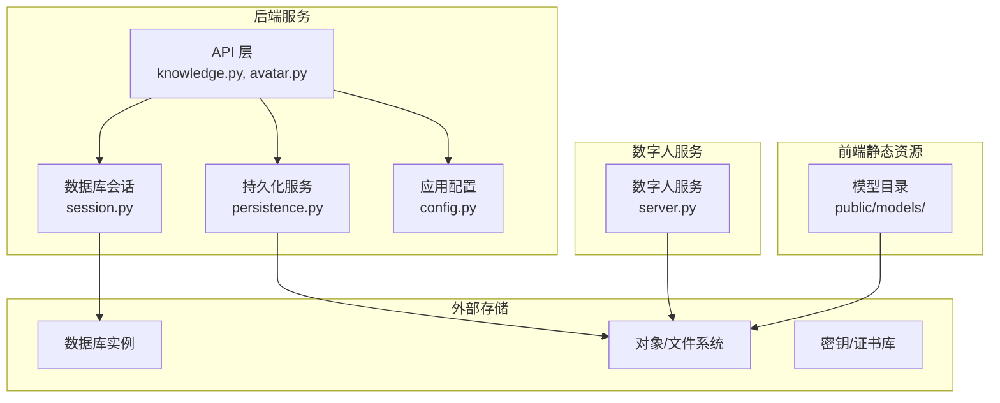
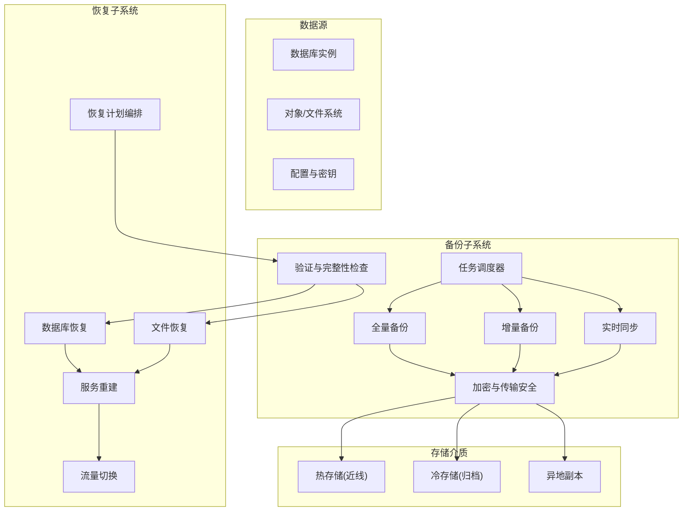
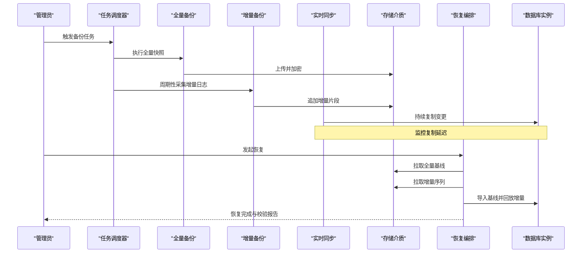
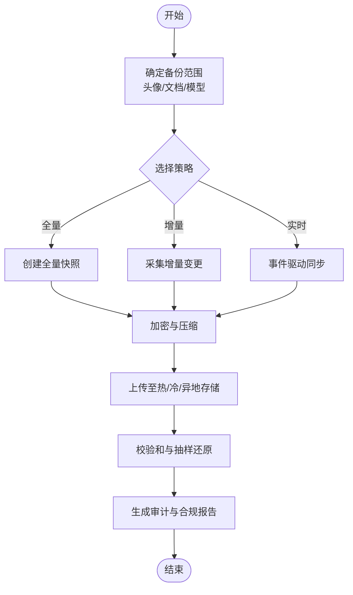
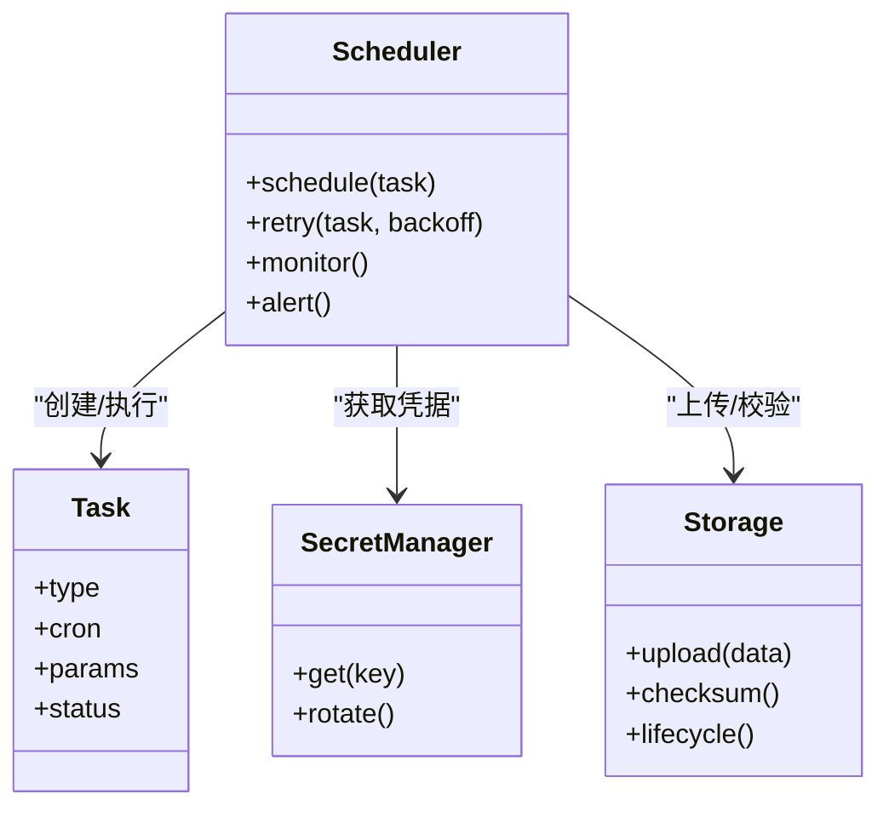
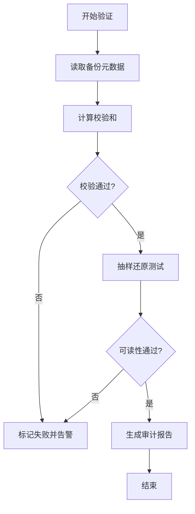
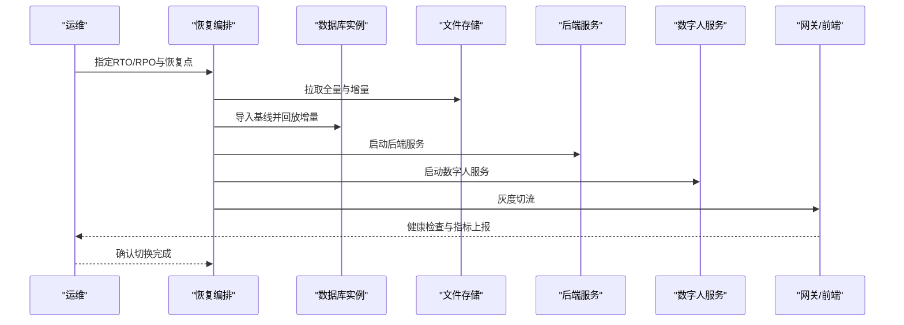
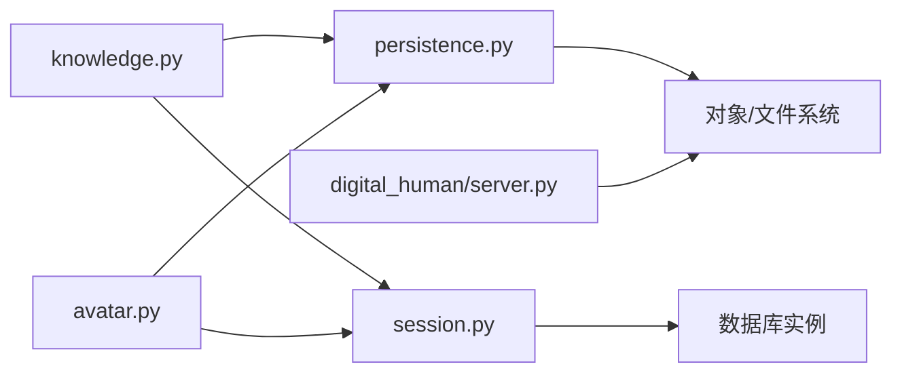

# 数据备份与恢复

<cite>
**本文引用的文件**   
- [docker-compose.yml](file://docker-compose.yml)
- [backend/app/config.py](file://backend/app/config.py)
- [backend/app/db/session.py](file://backend/app/db/session.py)
- [backend/app/services/persistence.py](file://backend/app/services/persistence.py)
- [backend/app/api/knowledge.py](file://backend/app/api/knowledge.py)
- [backend/app/api/avatar.py](file://backend/app/api/avatar.py)
- [digital_human/server.py](file://digital_human/server.py)
- [frontend/tourist-app/public/models/](file://frontend/tourist-app/public/models/)
</cite>

## 目录
1. [引言](#引言)
2. [项目结构](#项目结构)
3. [核心组件](#核心组件)
4. [架构总览](#架构总览)
5. [详细组件分析](#详细组件分析)
6. [依赖分析](#依赖分析)
7. [性能考虑](#性能考虑)
8. [故障排查指南](#故障排查指南)
9. [结论](#结论)
10. [附录](#附录)

## 引言
本方案面向SmartTour系统，提供覆盖数据库、文件存储（用户上传文件、知识库文档、数字人模型）的完整备份与恢复策略。方案包含全量备份、增量备份与实时同步机制；自动化任务调度、备份验证与完整性检查；灾难恢复流程与服务重建；以及加密、传输安全与成本优化策略。同时给出备份演练计划与RTO/RPO目标设定指导，确保业务连续性与数据安全。

## 项目结构
SmartTour采用前后端分离与容器化部署：后端服务通过配置管理数据库连接与持久化路径，API层暴露知识管理与头像上传等能力；数字人服务独立运行；前端静态资源中包含可下载的模型文件。备份范围需覆盖：
- 数据库：由后端会话与ORM访问的数据持久化存储
- 对象/文件系统：用户上传头像、知识库文档、数字人模型与相关产物
- 配置与密钥：应用配置、证书与密钥材料
- 容器编排：docker-compose定义及镜像清单

图表来源
- [backend/app/api/knowledge.py](file://backend/app/api/knowledge.py)
- [backend/app/api/avatar.py](file://backend/app/api/avatar.py)
- [backend/app/db/session.py](file://backend/app/db/session.py)
- [backend/app/services/persistence.py](file://backend/app/services/persistence.py)
- [backend/app/config.py](file://backend/app/config.py)
- [digital_human/server.py](file://digital_human/server.py)
- [frontend/tourist-app/public/models/](file://frontend/tourist-app/public/models/)

章节来源
- [docker-compose.yml](file://docker-compose.yml)
- [backend/app/config.py](file://backend/app/config.py)
- [backend/app/db/session.py](file://backend/app/db/session.py)
- [backend/app/services/persistence.py](file://backend/app/services/persistence.py)
- [backend/app/api/knowledge.py](file://backend/app/api/knowledge.py)
- [backend/app/api/avatar.py](file://backend/app/api/avatar.py)
- [digital_human/server.py](file://digital_human/server.py)
- [frontend/tourist-app/public/models/](file://frontend/tourist-app/public/models/)

## 核心组件
- 数据库备份组件
  - 负责全量快照、增量日志归档与实时复制（如基于WAL或binlog）。
  - 支持校验和生成与元数据记录，便于恢复时一致性选择。
- 文件存储备份组件
  - 对用户上传头像、知识库文档、数字人模型进行版本化与跨域复制。
  - 支持去重、压缩与分片，降低带宽与存储成本。
- 任务调度与编排
  - 统一调度全量/增量/同步任务，处理失败重试与告警。
  - 与密钥管理服务集成，自动轮换与注入备份凭据。
- 验证与完整性检查
  - 对备份集执行哈希校验、抽样还原与可读性测试。
  - 输出审计日志与合规报告。
- 灾难恢复编排器
  - 根据RTO/RPO目标选择恢复点，按依赖顺序重建服务。
  - 提供回滚与灰度切换能力。

章节来源
- [backend/app/config.py](file://backend/app/config.py)
- [backend/app/db/session.py](file://backend/app/db/session.py)
- [backend/app/services/persistence.py](file://backend/app/services/persistence.py)
- [backend/app/api/knowledge.py](file://backend/app/api/knowledge.py)
- [backend/app/api/avatar.py](file://backend/app/api/avatar.py)
- [digital_human/server.py](file://digital_human/server.py)
- [docker-compose.yml](file://docker-compose.yml)

## 架构总览
下图展示备份与恢复的整体架构，包括数据源、备份通道、存储介质与恢复流程。

图表来源
- [docker-compose.yml](file://docker-compose.yml)
- [backend/app/config.py](file://backend/app/config.py)
- [backend/app/db/session.py](file://backend/app/db/session.py)
- [backend/app/services/persistence.py](file://backend/app/services/persistence.py)
- [backend/app/api/knowledge.py](file://backend/app/api/knowledge.py)
- [backend/app/api/avatar.py](file://backend/app/api/avatar.py)
- [digital_human/server.py](file://digital_human/server.py)

## 详细组件分析

### 数据库备份策略
- 全量备份
  - 周期：每日一次，低峰期执行。
  - 内容：数据库逻辑导出或物理快照，附带事务边界与时间戳。
  - 校验：生成校验和并写入元数据索引。
- 增量备份
  - 周期：每15分钟至每小时一次，依据RPO调整。
  - 内容：基于WAL/binlog的增量日志，支持断点续传。
  - 合并：定期将增量合并为新的全量基线，减少恢复复杂度。
- 实时同步
  - 模式：主从复制或流式复制，延迟监控与阈值告警。
  - 切换：在故障场景下快速提升备库为读/写节点。
- 恢复流程
  - 选择最近的全量基线与对应增量序列。
  - 回放增量日志至一致时间点。
  - 启动只读验证查询，确认关键表与索引状态。
  - 切换流量至新实例，观察错误率与延迟指标。

图表来源
- [backend/app/db/session.py](file://backend/app/db/session.py)
- [backend/app/config.py](file://backend/app/config.py)
- [docker-compose.yml](file://docker-compose.yml)

章节来源
- [backend/app/db/session.py](file://backend/app/db/session.py)
- [backend/app/config.py](file://backend/app/config.py)

### 文件存储备份方案
- 备份范围
  - 用户上传头像：通过头像API接收并落盘的对象。
  - 知识库文档：通过知识管理API上传与解析的文档。
  - 数字人模型：数字人服务加载的模型文件与缓存。
- 策略
  - 全量：每周一次，对根目录进行快照。
  - 增量：每日一次，仅备份变更文件。
  - 实时：基于事件驱动的文件变更同步，保证近实时一致性。
- 版本与生命周期
  - 保留策略：热存储保留30天，冷存储保留1年，归档保留7年。
  - 去重与压缩：启用块级去重与压缩，降低容量与带宽。
- 校验与审计
  - 生成SHA-256校验和，记录到元数据索引。
  - 随机抽样还原与打开测试，确保可用性。

图表来源
- [backend/app/api/avatar.py](file://backend/app/api/avatar.py)
- [backend/app/api/knowledge.py](file://backend/app/api/knowledge.py)
- [backend/app/services/persistence.py](file://backend/app/services/persistence.py)
- [digital_human/server.py](file://digital_human/server.py)
- [frontend/tourist-app/public/models/](file://frontend/tourist-app/public/models/)

章节来源
- [backend/app/api/avatar.py](file://backend/app/api/avatar.py)
- [backend/app/api/knowledge.py](file://backend/app/api/knowledge.py)
- [backend/app/services/persistence.py](file://backend/app/services/persistence.py)
- [digital_human/server.py](file://digital_human/server.py)
- [frontend/tourist-app/public/models/](file://frontend/tourist-app/public/models/)

### 自动化备份任务调度
- 调度器职责
  - 维护任务拓扑：全量、增量、同步、校验、清理。
  - 失败重试与退避策略，超时与熔断保护。
  - 与密钥管理服务集成，动态注入凭据与证书。
- 监控与告警
  - 指标：备份时长、大小、成功率、延迟、存储用量。
  - 告警：失败、延迟超阈、空间不足、校验失败。
- 编排示例
  - 每日凌晨执行全量；每15分钟执行增量；每小时执行校验；每月执行异地复制。

图表来源
- [docker-compose.yml](file://docker-compose.yml)
- [backend/app/config.py](file://backend/app/config.py)

章节来源
- [docker-compose.yml](file://docker-compose.yml)
- [backend/app/config.py](file://backend/app/config.py)

### 备份验证与完整性检查
- 校验方法
  - 哈希校验：对每个备份包计算并比对校验和。
  - 抽样还原：随机抽取若干对象进行打开与读取测试。
  - 元数据一致性：核对索引、时间戳与版本号。
- 报告与审计
  - 输出结构化报告，包含成功/失败项、耗时、大小与风险等级。
  - 留存审计日志，满足合规要求。

图表来源
- [backend/app/services/persistence.py](file://backend/app/services/persistence.py)
- [backend/app/config.py](file://backend/app/config.py)

章节来源
- [backend/app/services/persistence.py](file://backend/app/services/persistence.py)
- [backend/app/config.py](file://backend/app/config.py)

### 灾难恢复流程
- 恢复目标
  - RTO（恢复时间目标）：以分钟计的服务可用时间上限。
  - RPO（恢复点目标）：允许丢失数据的最大时间窗口。
- 恢复步骤
  - 选择恢复点：最近全量+增量序列或实时复制位点。
  - 数据恢复：先数据库后文件，确保依赖顺序。
  - 服务重建：按编排顺序拉起后端、数字人、前端网关。
  - 流量切换：灰度切流，观察错误率与延迟，必要时回滚。
- 回滚与灰度
  - 保留上一版本快照，支持一键回滚。
  - 双活或多区域部署，缩短切换时间。

图表来源
- [docker-compose.yml](file://docker-compose.yml)
- [backend/app/config.py](file://backend/app/config.py)
- [digital_human/server.py](file://digital_human/server.py)

章节来源
- [docker-compose.yml](file://docker-compose.yml)
- [backend/app/config.py](file://backend/app/config.py)
- [digital_human/server.py](file://digital_human/server.py)

### 加密、传输安全与成本控制
- 加密
  - 静态加密：对备份包使用强算法加密，密钥由密钥管理服务托管。
  - 传输加密：使用TLS/HTTPS通道上传下载，强制证书校验。
- 成本控制
  - 分层存储：热/冷/归档分级，结合生命周期策略自动迁移。
  - 去重与压缩：块级去重与高压缩比算法，降低容量与带宽。
  - 地域策略：本地热存、同城灾备、异地归档，平衡成本与风险。
- 合规与审计
  - 保留策略与访问控制，最小权限原则。
  - 审计日志与报表，满足内审与外审要求。

章节来源
- [backend/app/config.py](file://backend/app/config.py)
- [backend/app/services/persistence.py](file://backend/app/services/persistence.py)
- [docker-compose.yml](file://docker-compose.yml)

### 备份演练计划与RTO设定指导
- 演练频率
  - 季度演练：全链路恢复演练，覆盖数据库与文件。
  - 月度演练：单组件恢复演练，验证工具链与脚本。
- 演练步骤
  - 准备隔离环境，克隆生产配置与数据样本。
  - 执行恢复流程，记录时间与问题。
  - 复盘改进：更新SOP、脚本与告警规则。
- RTO/RPO设定
  - 业务影响评估：识别关键接口与数据。
  - 目标分解：数据库RPO≤15分钟，文件RPO≤1小时；RTO≤30分钟。
  - 持续优化：通过演练与压测逐步逼近目标。

章节来源
- [docker-compose.yml](file://docker-compose.yml)
- [backend/app/config.py](file://backend/app/config.py)

## 依赖分析
- 组件耦合
  - API层依赖持久化服务与数据库会话，形成清晰分层。
  - 数字人服务与文件存储存在直接读写关系。
- 外部依赖
  - 数据库实例、对象/文件系统、密钥管理服务。
- 潜在循环依赖
  - 当前分层设计避免循环依赖，建议保持API不直接访问底层存储。

图表来源
- [backend/app/api/knowledge.py](file://backend/app/api/knowledge.py)
- [backend/app/api/avatar.py](file://backend/app/api/avatar.py)
- [backend/app/services/persistence.py](file://backend/app/services/persistence.py)
- [backend/app/db/session.py](file://backend/app/db/session.py)
- [digital_human/server.py](file://digital_human/server.py)

章节来源
- [backend/app/api/knowledge.py](file://backend/app/api/knowledge.py)
- [backend/app/api/avatar.py](file://backend/app/api/avatar.py)
- [backend/app/services/persistence.py](file://backend/app/services/persistence.py)
- [backend/app/db/session.py](file://backend/app/db/session.py)
- [digital_human/server.py](file://digital_human/server.py)

## 性能考虑
- 备份窗口
  - 全量避开高峰，增量高频低耗，实时同步限流。
- 并发与吞吐
  - 并行上传与分片，利用多核与网络带宽。
- 存储优化
  - 去重、压缩、冷热分层，降低I/O与成本。
- 监控与调优
  - 跟踪备份时长、吞吐、错误率，设置阈值与自动扩缩容。

[本节为通用指导，无需特定文件引用]

## 故障排查指南
- 常见问题
  - 备份失败：检查网络连通、凭据有效性、存储空间与配额。
  - 校验失败：核对哈希算法与编码，确认文件未损坏。
  - 恢复超时：评估数据量与带宽，优化并发与分片大小。
- 定位手段
  - 查看调度器日志与任务状态。
  - 检索存储介质的访问日志与审计记录。
  - 使用抽样还原与只读查询验证一致性。

章节来源
- [backend/app/config.py](file://backend/app/config.py)
- [backend/app/services/persistence.py](file://backend/app/services/persistence.py)
- [docker-compose.yml](file://docker-compose.yml)

## 结论
本方案围绕SmartTour的核心数据资产，构建了覆盖数据库与文件系统的备份与恢复体系。通过全量、增量与实时同步的组合策略，配合自动化调度、严格校验与安全加固，能够在保障业务连续性的同时控制成本与风险。建议定期开展演练与复盘，持续优化RTO/RPO与操作流程。

[本节为总结性内容，无需特定文件引用]

## 附录
- 术语
  - RTO：恢复时间目标，指从故障发生到服务恢复可用的时间上限。
  - RPO：恢复点目标，指允许丢失数据的最大时间窗口。
- 参考实践
  - 3-2-1备份法则：至少3份副本、2种介质、1份异地。
  - 零信任安全：最小权限、持续验证、端到端加密。

[本节为概念性内容，无需特定文件引用]