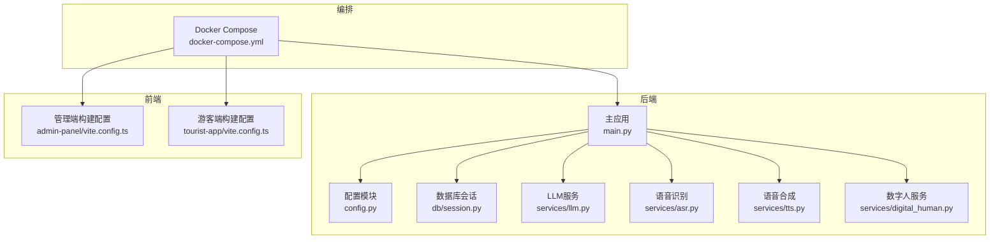
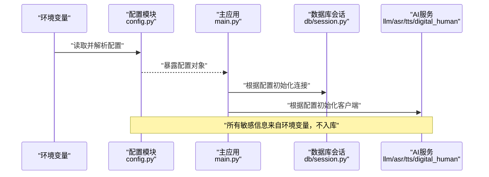
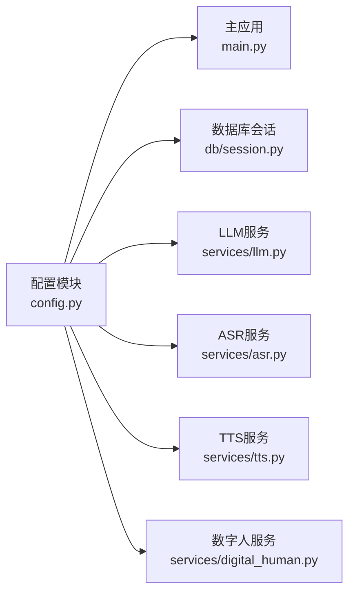

# 环境配置管理

<cite>
**本文引用的文件**   
- [backend/app/config.py](file://backend/app/config.py)
- [backend/app/main.py](file://backend/app/main.py)
- [backend/app/db/session.py](file://backend/app/db/session.py)
- [backend/app/services/llm.py](file://backend/app/services/llm.py)
- [backend/app/services/asr.py](file://backend/app/services/asr.py)
- [backend/app/services/tts.py](file://backend/app/services/tts.py)
- [backend/app/services/digital_human.py](file://backend/app/services/digital_human.py)
- [frontend/admin-panel/vite.config.ts](file://frontend/admin-panel/vite.config.ts)
- [frontend/tourist-app/vite.config.ts](file://frontend/tourist-app/vite.config.ts)
- [docker-compose.yml](file://docker-compose.yml)
</cite>

## 目录
1. [简介](#简介)
2. [项目结构](#项目结构)
3. [核心组件](#核心组件)
4. [架构总览](#架构总览)
5. [详细组件分析](#详细组件分析)
6. [依赖关系分析](#依赖关系分析)
7. [性能考虑](#性能考虑)
8. [故障排查指南](#故障排查指南)
9. [结论](#结论)
10. [附录](#附录)

## 简介
本指南面向SmartTour系统的环境配置管理，覆盖后端Python配置、前端构建与变量注入、静态资源管理，以及开发/测试/生产多环境的差异化策略。文档同时给出配置验证、默认值管理与热重载的落地方案建议，帮助团队在安全、可维护的前提下高效运维。

## 项目结构
SmartTour采用前后端分离与容器化部署：
- 后端位于 backend/app，核心配置入口为配置文件与主应用启动模块；数据库会话、AI服务（LLM/ASR/TTS/数字人）等通过配置驱动初始化。
- 前端包含两个独立应用（admin-panel、tourist-app），各自使用Vite进行构建，并通过环境变量注入API地址等运行时参数。
- docker-compose.yml用于编排各服务与环境变量。

图表来源
- [backend/app/config.py](file://backend/app/config.py)
- [backend/app/main.py](file://backend/app/main.py)
- [backend/app/db/session.py](file://backend/app/db/session.py)
- [backend/app/services/llm.py](file://backend/app/services/llm.py)
- [backend/app/services/asr.py](file://backend/app/services/asr.py)
- [backend/app/services/tts.py](file://backend/app/services/tts.py)
- [backend/app/services/digital_human.py](file://backend/app/services/digital_human.py)
- [frontend/admin-panel/vite.config.ts](file://frontend/admin-panel/vite.config.ts)
- [frontend/tourist-app/vite.config.ts](file://frontend/tourist-app/vite.config.ts)
- [docker-compose.yml](file://docker-compose.yml)

章节来源
- [backend/app/config.py](file://backend/app/config.py)
- [backend/app/main.py](file://backend/app/main.py)
- [backend/app/db/session.py](file://backend/app/db/session.py)
- [backend/app/services/llm.py](file://backend/app/services/llm.py)
- [backend/app/services/asr.py](file://backend/app/services/asr.py)
- [backend/app/services/tts.py](file://backend/app/services/tts.py)
- [backend/app/services/digital_human.py](file://backend/app/services/digital_human.py)
- [frontend/admin-panel/vite.config.ts](file://frontend/admin-panel/vite.config.ts)
- [frontend/tourist-app/vite.config.ts](file://frontend/tourist-app/vite.config.ts)
- [docker-compose.yml](file://docker-compose.yml)

## 核心组件
- 后端配置中心
  - 统一从环境变量加载配置项，提供类型转换与默认值，集中暴露给各模块使用。
  - 关键领域：数据库连接、AI服务密钥、Redis缓存、日志级别、跨域与调试开关等。
- 数据库会话
  - 基于配置中的数据库URL创建引擎与会话工厂，支持连接池与事务生命周期。
- AI服务客户端
  - LLM/ASR/TTS/数字人等外部服务通过配置中的端点与密钥初始化，避免硬编码。
- 前端构建配置
  - Vite中通过环境变量注入API基础路径、功能开关等，构建产物仅包含构建期常量。
- 编排与环境注入
  - docker-compose.yml按环境注入不同变量集，实现“同构代码、异构运行”。

章节来源
- [backend/app/config.py](file://backend/app/config.py)
- [backend/app/db/session.py](file://backend/app/db/session.py)
- [backend/app/services/llm.py](file://backend/app/services/llm.py)
- [backend/app/services/asr.py](file://backend/app/services/asr.py)
- [backend/app/services/tts.py](file://backend/app/services/tts.py)
- [backend/app/services/digital_human.py](file://backend/app/services/digital_human.py)
- [frontend/admin-panel/vite.config.ts](file://frontend/admin-panel/vite.config.ts)
- [frontend/tourist-app/vite.config.ts](file://frontend/tourist-app/vite.config.ts)
- [docker-compose.yml](file://docker-compose.yml)

## 架构总览
下图展示配置在各层之间的流向：环境变量→配置模块→业务模块与服务客户端→运行时行为。

图表来源
- [backend/app/config.py](file://backend/app/config.py)
- [backend/app/main.py](file://backend/app/main.py)
- [backend/app/db/session.py](file://backend/app/db/session.py)
- [backend/app/services/llm.py](file://backend/app/services/llm.py)
- [backend/app/services/asr.py](file://backend/app/services/asr.py)
- [backend/app/services/tts.py](file://backend/app/services/tts.py)
- [backend/app/services/digital_human.py](file://backend/app/services/digital_human.py)

## 详细组件分析

### 后端配置模块（config.py）
职责
- 定义配置键空间与默认值
- 从环境变量加载并做类型校验
- 提供只读配置视图供其他模块导入

典型配置域
- 数据库：连接URL、池大小、超时等
- Redis：主机、端口、密码、库号、连接池
- AI服务：LLM/ASR/TTS/数字人的端点与密钥
- 日志：级别、输出目标、格式
- 应用：调试开关、CORS、监听端口等

建议实践
- 所有敏感字段必须来自环境变量，禁止写死或提交到版本库
- 对必填项进行存在性校验，缺失时抛出明确错误
- 对数值型字段进行范围校验（如端口、超时）
- 将配置对象设计为不可变或冻结视图，防止运行时篡改

章节来源
- [backend/app/config.py](file://backend/app/config.py)

### 数据库会话（db/session.py）
职责
- 依据配置中的数据库URL创建引擎与会话
- 管理连接池与事务边界
- 提供统一的查询入口

关键点
- 连接字符串由配置模块提供，避免硬编码
- 连接池大小与超时受配置控制
- 异常需捕获并转换为应用级错误，便于上层处理

章节来源
- [backend/app/db/session.py](file://backend/app/db/session.py)

### AI服务客户端（llm.py / asr.py / tts.py / digital_human.py）
职责
- 封装对外部AI服务的调用
- 从配置中读取端点与密钥
- 处理重试、超时、鉴权头等通用逻辑

要点
- 密钥仅存在于进程内存，不落盘
- 端点与密钥变更可通过重启或热重载生效
- 失败时应返回明确的错误码与消息，便于监控告警

章节来源
- [backend/app/services/llm.py](file://backend/app/services/llm.py)
- [backend/app/services/asr.py](file://backend/app/services/asr.py)
- [backend/app/services/tts.py](file://backend/app/services/tts.py)
- [backend/app/services/digital_human.py](file://backend/app/services/digital_human.py)

### 前端构建配置（vite.config.ts）
职责
- 定义构建期环境变量前缀与注入规则
- 配置代理、静态资源路径、输出目录等
- 区分开发/生产构建模式

常见变量
- API基础地址、功能开关、第三方服务域名等
- 注意：构建期变量会打包进静态资源，不应包含敏感信息

章节来源
- [frontend/admin-panel/vite.config.ts](file://frontend/admin-panel/vite.config.ts)
- [frontend/tourist-app/vite.config.ts](file://frontend/tourist-app/vite.config.ts)

### 编排与环境注入（docker-compose.yml）
职责
- 为各服务注入不同的环境变量集合
- 统一管理镜像、端口映射、依赖服务
- 支持按环境切换配置集（通过不同compose文件或env文件）

章节来源
- [docker-compose.yml](file://docker-compose.yml)

## 依赖关系分析
配置依赖图展示了模块间的耦合关系与数据流向。

图表来源
- [backend/app/config.py](file://backend/app/config.py)
- [backend/app/main.py](file://backend/app/main.py)
- [backend/app/db/session.py](file://backend/app/db/session.py)
- [backend/app/services/llm.py](file://backend/app/services/llm.py)
- [backend/app/services/asr.py](file://backend/app/services/asr.py)
- [backend/app/services/tts.py](file://backend/app/services/tts.py)
- [backend/app/services/digital_human.py](file://backend/app/services/digital_human.py)

章节来源
- [backend/app/config.py](file://backend/app/config.py)
- [backend/app/main.py](file://backend/app/main.py)
- [backend/app/db/session.py](file://backend/app/db/session.py)
- [backend/app/services/llm.py](file://backend/app/services/llm.py)
- [backend/app/services/asr.py](file://backend/app/services/asr.py)
- [backend/app/services/tts.py](file://backend/app/services/tts.py)
- [backend/app/services/digital_human.py](file://backend/app/services/digital_human.py)

## 性能考虑
- 连接池与超时
  - 数据库与Redis的连接池大小应与并发量匹配，避免过多上下文切换或排队等待。
  - 合理设置读写超时，防止慢请求拖垮整体吞吐。
- 日志级别
  - 开发环境可开启更详细的日志以便定位问题；生产环境降低冗余日志，减少I/O开销。
- 前端静态资源
  - 启用压缩与缓存策略，按需拆分包，减少首屏体积。
- 外部服务调用
  - 为AI服务增加重试与熔断策略，避免雪崩效应。

[本节为通用指导，无需源码引用]

## 故障排查指南
常见问题与定位步骤
- 启动时报缺少环境变量
  - 检查docker-compose或宿主机的环境变量是否已正确注入
  - 确认配置模块对必填项的校验逻辑是否触发
- 数据库连接失败
  - 核对数据库URL、用户名、密码、网络可达性与白名单
  - 查看连接池与超时配置是否合理
- AI服务鉴权失败
  - 确认密钥未过期且权限正确
  - 检查端点地址与协议（http/https）
- 前端无法访问后端API
  - 检查构建期注入的API基础地址是否正确
  - 确认反向代理或网关的路由转发配置

章节来源
- [backend/app/config.py](file://backend/app/config.py)
- [backend/app/db/session.py](file://backend/app/db/session.py)
- [backend/app/services/llm.py](file://backend/app/services/llm.py)
- [backend/app/services/asr.py](file://backend/app/services/asr.py)
- [backend/app/services/tts.py](file://backend/app/services/tts.py)
- [backend/app/services/digital_human.py](file://backend/app/services/digital_human.py)
- [frontend/admin-panel/vite.config.ts](file://frontend/admin-panel/vite.config.ts)
- [frontend/tourist-app/vite.config.ts](file://frontend/tourist-app/vite.config.ts)
- [docker-compose.yml](file://docker-compose.yml)

## 结论
通过统一的后端配置中心与严格的环境变量管理，结合前端构建期变量注入与容器编排，SmartTour实现了安全、可移植、易扩展的配置体系。建议在现有基础上完善配置校验、默认值与热重载机制，进一步提升系统的稳定性与可观测性。

[本节为总结性内容，无需源码引用]

## 附录

### 多环境差异化管理策略
- 配置文件分层
  - 基础配置：公共默认值
  - 环境配置：按开发/测试/生产覆盖差异项
  - 敏感配置：仅通过环境变量注入，不参与版本控制
- 版本控制
  - 仅提交非敏感模板与示例，真实密钥由CI/CD或平台注入
- 动态配置更新
  - 推荐方案：配置中心（如Consul/Nacos）+ 健康检查 + 灰度发布
  - 轻量方案：基于Redis的键值存储 + 定时拉取 + 进程内缓存失效
- 配置验证与默认值
  - 启动时执行强校验，缺失或非法则拒绝启动
  - 对可选项提供安全默认值，避免空指针或越界
- 配置热重载
  - 后端：监听配置变更事件，重建受影响的服务客户端（如AI客户端、数据库会话）
  - 前端：通过运行时接口获取非敏感开关，避免重新构建

[本节为概念性说明，无需源码引用]