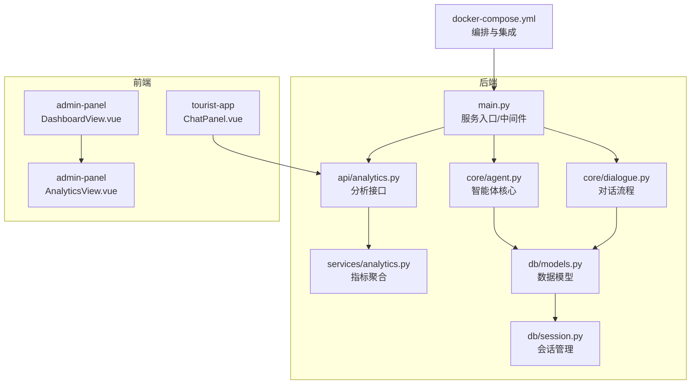
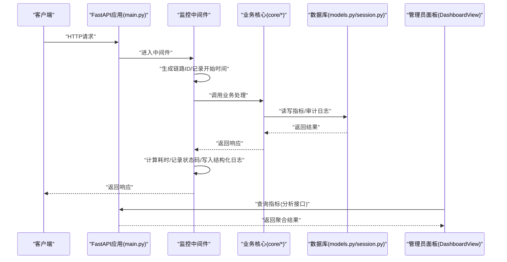
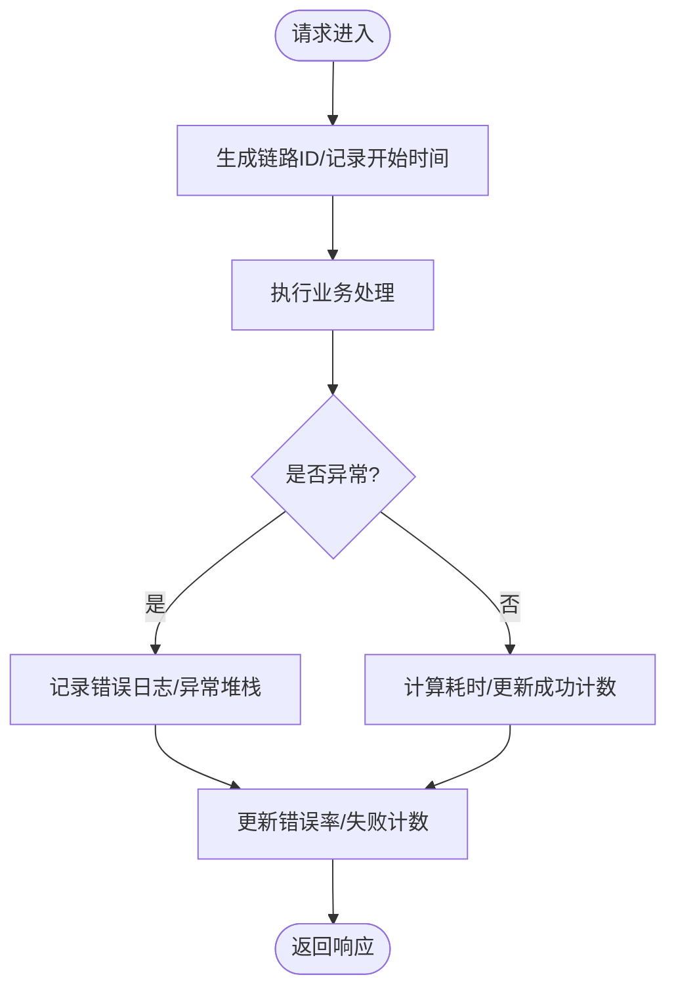
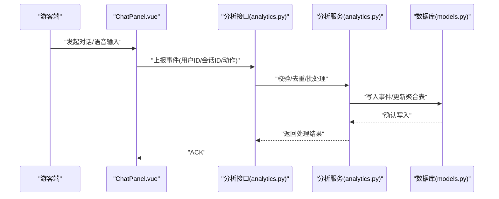
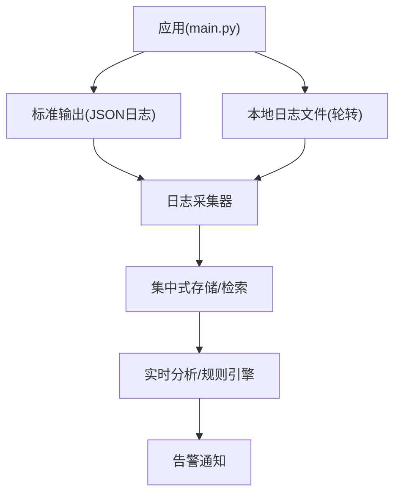
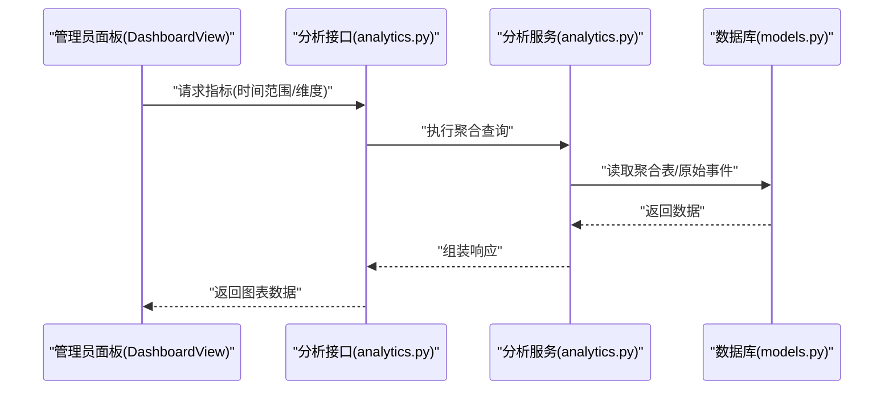
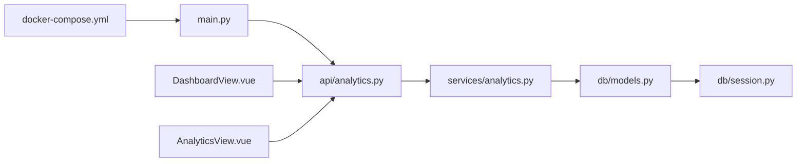

# 监控与日志管理

<cite>
**本文引用的文件**   
- [backend/app/main.py](file://backend/app/main.py)
- [backend/app/config.py](file://backend/app/config.py)
- [backend/app/api/analytics.py](file://backend/app/api/analytics.py)
- [backend/app/services/analytics.py](file://backend/app/services/analytics.py)
- [backend/app/core/agent.py](file://backend/app/core/agent.py)
- [backend/app/core/dialogue.py](file://backend/app/core/dialogue.py)
- [backend/app/db/models.py](file://backend/app/db/models.py)
- [backend/app/db/session.py](file://backend/app/db/session.py)
- [frontend/admin-panel/src/views/Dashboard/DashboardView.vue](file://frontend/admin-panel/src/views/Dashboard/DashboardView.vue)
- [frontend/admin-panel/src/views/Analytics/AnalyticsView.vue](file://frontend/admin-panel/src/views/Analytics/AnalyticsView.vue)
- [frontend/tourist-app/src/components/ChatPanel/ChatPanel.vue](file://frontend/tourist-app/src/components/ChatPanel/ChatPanel.vue)
- [docker-compose.yml](file://docker-compose.yml)
</cite>

## 目录
1. [引言](#引言)
2. [项目结构](#项目结构)
3. [核心组件](#核心组件)
4. [架构总览](#架构总览)
5. [详细组件分析](#详细组件分析)
6. [依赖分析](#依赖分析)
7. [性能考虑](#性能考虑)
8. [故障排查指南](#故障排查指南)
9. [结论](#结论)
10. [附录](#附录)

## 引言
本方案面向SmartTour系统，提供端到端的监控与日志管理设计。目标包括：
- 应用性能监控指标采集：API响应时间、错误率统计、用户行为分析与业务指标追踪
- 结构化日志规范：格式定义、分级策略、上下文捕获、敏感信息脱敏
- 日志收集架构：本地轮转、集中式收集、实时分析
- 告警规则配置、异常检测与故障诊断工具使用
- 监控仪表板搭建与数据可视化展示

## 项目结构
后端采用FastAPI风格的服务入口与模块化分层（api、core、services、db），前端包含管理员面板与游客端应用。监控与日志相关的关键位置如下：
- 服务入口与中间件挂载点：用于统一拦截请求、记录指标与日志
- 分析接口与服务层：暴露与分析相关的API并实现指标聚合逻辑
- 数据库模型与会话：为持久化埋点与审计日志提供存储能力
- 前端页面：管理员面板的仪表盘与分析视图，游客端聊天交互埋点

图表来源
- [backend/app/main.py](file://backend/app/main.py)
- [backend/app/api/analytics.py](file://backend/app/api/analytics.py)
- [backend/app/services/analytics.py](file://backend/app/services/analytics.py)
- [backend/app/core/agent.py](file://backend/app/core/agent.py)
- [backend/app/core/dialogue.py](file://backend/app/core/dialogue.py)
- [backend/app/db/models.py](file://backend/app/db/models.py)
- [backend/app/db/session.py](file://backend/app/db/session.py)
- [frontend/admin-panel/src/views/Dashboard/DashboardView.vue](file://frontend/admin-panel/src/views/Dashboard/DashboardView.vue)
- [frontend/admin-panel/src/views/Analytics/AnalyticsView.vue](file://frontend/admin-panel/src/views/Analytics/AnalyticsView.vue)
- [frontend/tourist-app/src/components/ChatPanel/ChatPanel.vue](file://frontend/tourist-app/src/components/ChatPanel/ChatPanel.vue)
- [docker-compose.yml](file://docker-compose.yml)

章节来源
- [backend/app/main.py](file://backend/app/main.py)
- [backend/app/config.py](file://backend/app/config.py)
- [backend/app/api/analytics.py](file://backend/app/api/analytics.py)
- [backend/app/services/analytics.py](file://backend/app/services/analytics.py)
- [backend/app/core/agent.py](file://backend/app/core/agent.py)
- [backend/app/core/dialogue.py](file://backend/app/core/dialogue.py)
- [backend/app/db/models.py](file://backend/app/db/models.py)
- [backend/app/db/session.py](file://backend/app/db/session.py)
- [frontend/admin-panel/src/views/Dashboard/DashboardView.vue](file://frontend/admin-panel/src/views/Dashboard/DashboardView.vue)
- [frontend/admin-panel/src/views/Analytics/AnalyticsView.vue](file://frontend/admin-panel/src/views/Analytics/AnalyticsView.vue)
- [frontend/tourist-app/src/components/ChatPanel/ChatPanel.vue](file://frontend/tourist-app/src/components/ChatPanel/ChatPanel.vue)
- [docker-compose.yml](file://docker-compose.yml)

## 核心组件
- 服务入口与中间件
  - 在应用启动时注册全局中间件，统一采集请求级指标（方法、路径、状态码、耗时）与结构化日志
  - 将链路ID注入到请求上下文，贯穿后续处理链路与日志输出
- 分析接口与服务层
  - 提供查询与分析类接口，供前端仪表板拉取指标
  - 内部实现指标聚合、窗口统计与缓存策略
- 数据库模型与会话
  - 定义指标与审计日志的数据模型，支持按时间范围查询与分页
  - 封装会话创建、事务与连接池参数
- 前端仪表板与分析页
  - 管理员面板展示关键指标趋势、错误分布与热点接口
  - 游客端在关键交互处上报埋点事件

章节来源
- [backend/app/main.py](file://backend/app/main.py)
- [backend/app/api/analytics.py](file://backend/app/api/analytics.py)
- [backend/app/services/analytics.py](file://backend/app/services/analytics.py)
- [backend/app/db/models.py](file://backend/app/db/models.py)
- [backend/app/db/session.py](file://backend/app/db/session.py)
- [frontend/admin-panel/src/views/Dashboard/DashboardView.vue](file://frontend/admin-panel/src/views/Dashboard/DashboardView.vue)
- [frontend/admin-panel/src/views/Analytics/AnalyticsView.vue](file://frontend/admin-panel/src/views/Analytics/AnalyticsView.vue)
- [frontend/tourist-app/src/components/ChatPanel/ChatPanel.vue](file://frontend/tourist-app/src/components/ChatPanel/ChatPanel.vue)

## 架构总览
整体监控与日志架构分为三层：
- 采集层：后端中间件与SDK埋点采集指标与日志；前端在关键交互上报事件
- 传输与存储层：本地日志轮转与集中式收集（如通过容器编排集成日志采集器）；指标可落库或推送到时序系统
- 分析与展示层：实时分析管道与可视化仪表板，结合告警规则进行异常检测

图表来源
- [backend/app/main.py](file://backend/app/main.py)
- [backend/app/core/agent.py](file://backend/app/core/agent.py)
- [backend/app/core/dialogue.py](file://backend/app/core/dialogue.py)
- [backend/app/db/models.py](file://backend/app/db/models.py)
- [backend/app/db/session.py](file://backend/app/db/session.py)
- [frontend/admin-panel/src/views/Dashboard/DashboardView.vue](file://frontend/admin-panel/src/views/Dashboard/DashboardView.vue)

## 详细组件分析

### 指标采集与API性能监控
- 采集维度
  - 请求级：HTTP方法、路径、状态码、耗时、上游IP、用户代理
  - 业务级：对话轮次、推荐命中率、数字人调用成功率、ASR/TTS耗时
  - 资源级：CPU、内存、GC、数据库连接池使用率（由运行时或宿主环境提供）
- 实现要点
  - 在中间件中统一计时与状态码记录，避免侵入业务代码
  - 使用固定标签集（method、path、status_code、service）便于聚合与查询
  - 对慢请求与异常分支单独打点，便于定位瓶颈与问题
- 指标存储与查询
  - 短期热数据可缓存于内存或Redis，长期数据落库或推送至时序系统
  - 分析接口提供按时间窗口的聚合查询，支持分组与排序

图表来源
- [backend/app/main.py](file://backend/app/main.py)
- [backend/app/api/analytics.py](file://backend/app/api/analytics.py)
- [backend/app/services/analytics.py](file://backend/app/services/analytics.py)

章节来源
- [backend/app/main.py](file://backend/app/main.py)
- [backend/app/api/analytics.py](file://backend/app/api/analytics.py)
- [backend/app/services/analytics.py](file://backend/app/services/analytics.py)

### 结构化日志规范
- 日志级别
  - DEBUG：调试信息，仅开发环境开启
  - INFO：关键流程节点、业务里程碑
  - WARN：潜在风险与降级触发
  - ERROR：可恢复错误与异常堆栈
  - CRITICAL：不可恢复错误，需立即介入
- 字段约定
  - 基础字段：时间戳、级别、服务名、实例ID、链路ID、模块、消息
  - 业务字段：用户ID、会话ID、操作类型、资源标识、结果码
  - 上下文字段：请求头白名单、环境变量、依赖调用结果摘要
- 脱敏策略
  - 自动过滤手机号、邮箱、身份证、银行卡等敏感字段
  - 对密码、令牌、密钥等强制掩码或丢弃
  - 对外部第三方响应体进行摘要或采样记录
- 输出格式
  - JSON行格式，便于解析与检索
  - 统一键名与枚举值，避免歧义

章节来源
- [backend/app/main.py](file://backend/app/main.py)
- [backend/app/config.py](file://backend/app/config.py)

### 用户行为分析与业务指标追踪
- 埋点范围
  - 游客端：页面访问、聊天发送/接收、语音输入、数字人交互
  - 管理端：看板刷新、配置变更、知识库导入导出
- 指标定义
  - 活跃用户数、会话数、消息吞吐、平均响应时长、功能渗透率
  - 推荐点击率、知识召回命中率、数字人播放完成率
- 数据流
  - 前端上报事件到分析接口，后端聚合后落库或推送至分析系统
  - 提供按日/周/月粒度汇总与TopN排行

图表来源
- [frontend/tourist-app/src/components/ChatPanel/ChatPanel.vue](file://frontend/tourist-app/src/components/ChatPanel/ChatPanel.vue)
- [backend/app/api/analytics.py](file://backend/app/api/analytics.py)
- [backend/app/services/analytics.py](file://backend/app/services/analytics.py)
- [backend/app/db/models.py](file://backend/app/db/models.py)

章节来源
- [frontend/tourist-app/src/components/ChatPanel/ChatPanel.vue](file://frontend/tourist-app/src/components/ChatPanel/ChatPanel.vue)
- [backend/app/api/analytics.py](file://backend/app/api/analytics.py)
- [backend/app/services/analytics.py](file://backend/app/services/analytics.py)
- [backend/app/db/models.py](file://backend/app/db/models.py)

### 日志收集架构设计
- 本地日志轮转
  - 按大小与时间双阈值轮转，保留最近N天，压缩归档
  - 限制单文件大小与磁盘占用上限，避免撑爆磁盘
- 集中式收集
  - 容器化部署下，通过stdout/stderr输出JSON日志，由编排平台采集
  - 可选接入日志采集器，转发至集中式存储与检索系统
- 实时分析
  - 基于流式管道对热点错误与慢请求进行实时统计
  - 结合规则引擎触发告警与自动处置

图表来源
- [backend/app/main.py](file://backend/app/main.py)
- [docker-compose.yml](file://docker-compose.yml)

章节来源
- [backend/app/main.py](file://backend/app/main.py)
- [docker-compose.yml](file://docker-compose.yml)

### 告警规则配置与异常检测
- 指标告警
  - 错误率阈值：5分钟滑动窗口超过设定比例
  - 延迟P95/P99：超过SLA阈值持续N分钟
  - 资源水位：CPU/内存/连接池使用率超阈
- 异常检测
  - 基于历史基线的动态阈值，识别突增/突降
  - 关联多源指标，降低误报
- 告警通道
  - 邮件、IM、短信等多通道，支持升级策略与静默期

章节来源
- [backend/app/api/analytics.py](file://backend/app/api/analytics.py)
- [backend/app/services/analytics.py](file://backend/app/services/analytics.py)

### 故障诊断工具使用指南
- 链路追踪
  - 使用链路ID串联请求全生命周期，快速定位跨服务调用问题
- 指标回溯
  - 通过时间范围与标签筛选，对比变更前后的指标差异
- 日志检索
  - 以链路ID、用户ID、会话ID为索引，过滤错误堆栈与关键上下文
- 根因分析
  - 结合数据库慢查询、外部依赖超时与资源争用情况综合判断

章节来源
- [backend/app/main.py](file://backend/app/main.py)
- [backend/app/db/session.py](file://backend/app/db/session.py)

### 监控仪表板搭建与数据可视化
- 管理员面板
  - 概览：QPS、错误率、P95/P99延迟、活跃用户、会话数
  - 详情：接口维度热力图、错误TOPN、慢请求列表
  - 行为：功能渗透率、用户留存、转化漏斗
- 数据来源
  - 从分析接口拉取聚合结果，前端渲染图表
  - 支持时间选择器与多维度筛选

图表来源
- [frontend/admin-panel/src/views/Dashboard/DashboardView.vue](file://frontend/admin-panel/src/views/Dashboard/DashboardView.vue)
- [backend/app/api/analytics.py](file://backend/app/api/analytics.py)
- [backend/app/services/analytics.py](file://backend/app/services/analytics.py)
- [backend/app/db/models.py](file://backend/app/db/models.py)

章节来源
- [frontend/admin-panel/src/views/Dashboard/DashboardView.vue](file://frontend/admin-panel/src/views/Dashboard/DashboardView.vue)
- [frontend/admin-panel/src/views/Analytics/AnalyticsView.vue](file://frontend/admin-panel/src/views/Analytics/AnalyticsView.vue)
- [backend/app/api/analytics.py](file://backend/app/api/analytics.py)
- [backend/app/services/analytics.py](file://backend/app/services/analytics.py)
- [backend/app/db/models.py](file://backend/app/db/models.py)

## 依赖分析
- 组件耦合
  - main.py作为入口，依赖中间件与路由注册；analytics接口依赖分析服务；分析服务依赖数据库模型与会话
  - 前端Dashboard与Analytics页面依赖分析接口
- 外部依赖
  - 容器编排与日志采集集成（docker-compose）
  - 数据库驱动与连接池配置

图表来源
- [backend/app/main.py](file://backend/app/main.py)
- [backend/app/api/analytics.py](file://backend/app/api/analytics.py)
- [backend/app/services/analytics.py](file://backend/app/services/analytics.py)
- [backend/app/db/models.py](file://backend/app/db/models.py)
- [backend/app/db/session.py](file://backend/app/db/session.py)
- [frontend/admin-panel/src/views/Dashboard/DashboardView.vue](file://frontend/admin-panel/src/views/Dashboard/DashboardView.vue)
- [frontend/admin-panel/src/views/Analytics/AnalyticsView.vue](file://frontend/admin-panel/src/views/Analytics/AnalyticsView.vue)
- [docker-compose.yml](file://docker-compose.yml)

章节来源
- [backend/app/main.py](file://backend/app/main.py)
- [backend/app/api/analytics.py](file://backend/app/api/analytics.py)
- [backend/app/services/analytics.py](file://backend/app/services/analytics.py)
- [backend/app/db/models.py](file://backend/app/db/models.py)
- [backend/app/db/session.py](file://backend/app/db/session.py)
- [frontend/admin-panel/src/views/Dashboard/DashboardView.vue](file://frontend/admin-panel/src/views/Dashboard/DashboardView.vue)
- [frontend/admin-panel/src/views/Analytics/AnalyticsView.vue](file://frontend/admin-panel/src/views/Analytics/AnalyticsView.vue)
- [docker-compose.yml](file://docker-compose.yml)

## 性能考虑
- 指标采集开销控制
  - 采样与批量写入，避免高频写盘造成抖动
  - 使用内存缓冲与异步落盘，减少主线程阻塞
- 日志体积治理
  - 合理设置轮转阈值与保留天数，启用压缩
  - 对大对象与长文本进行截断或摘要
- 查询优化
  - 预聚合与物化视图，缩短查询延迟
  - 索引设计围绕时间戳与常用标签

[本节为通用指导，不直接分析具体文件]

## 故障排查指南
- 常见问题
  - 指标缺失：检查中间件注册与链路ID传播
  - 日志丢失：确认容器输出与采集器连通性
  - 告警风暴：调整阈值与静默期，增加相关性过滤
- 定位步骤
  - 通过链路ID检索前后日志，查看异常堆栈与依赖调用
  - 对比指标曲线，定位突变时间点与变更版本
  - 检查数据库连接池与慢查询，评估资源瓶颈

章节来源
- [backend/app/main.py](file://backend/app/main.py)
- [backend/app/db/session.py](file://backend/app/db/session.py)

## 结论
本方案围绕SmartTour系统的监控与日志管理，构建了从采集、传输、存储到分析与可视化的完整闭环。通过统一的中间件与结构化日志规范，确保指标与日志的一致性与可观测性；结合告警与诊断工具，提升问题发现与定位效率；最终在前端仪表板呈现直观的业务与技术指标，支撑运维与产品决策。

[本节为总结性内容，不直接分析具体文件]

## 附录
- 术语
  - 链路ID：一次请求的全局唯一标识，贯穿所有日志与指标
  - 滑动窗口：用于计算近N分钟指标的时间窗口
  - P95/P99：延迟分位数，衡量尾部延迟
- 最佳实践
  - 指标命名遵循“服务_模块_度量”的层级结构
  - 日志字段保持最小必要集合，避免冗余
  - 告警规则定期评审，剔除无效与重复告警

[本节为补充说明，不直接分析具体文件]