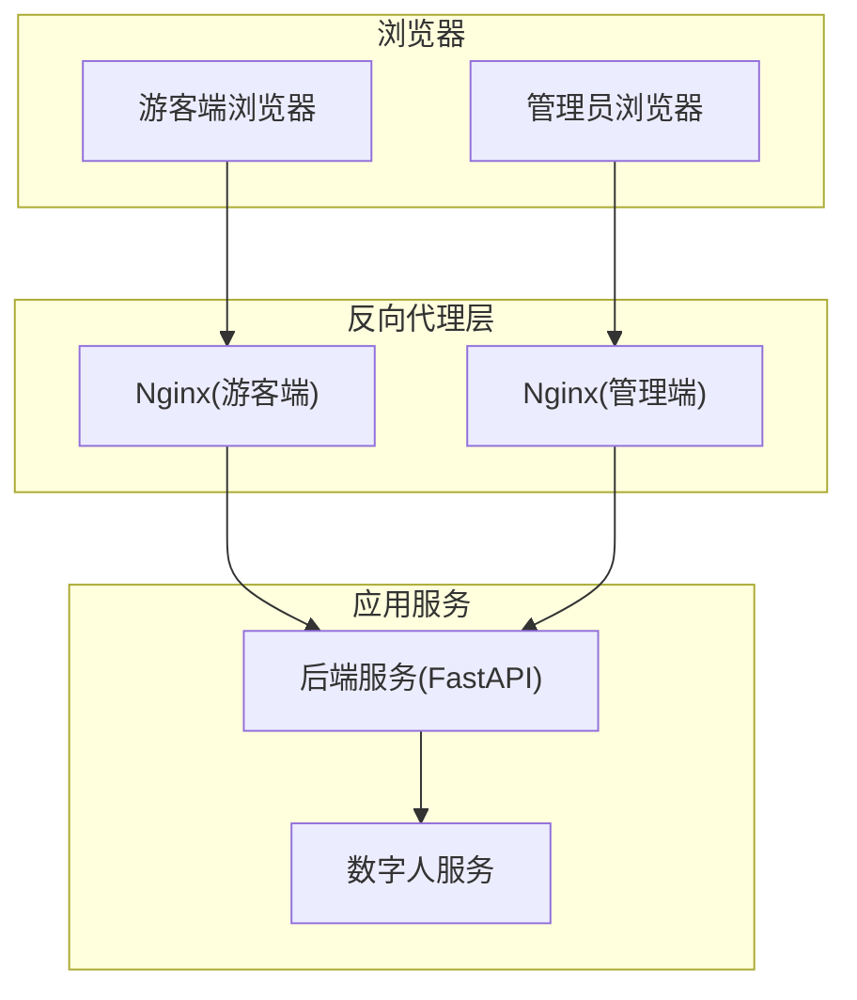
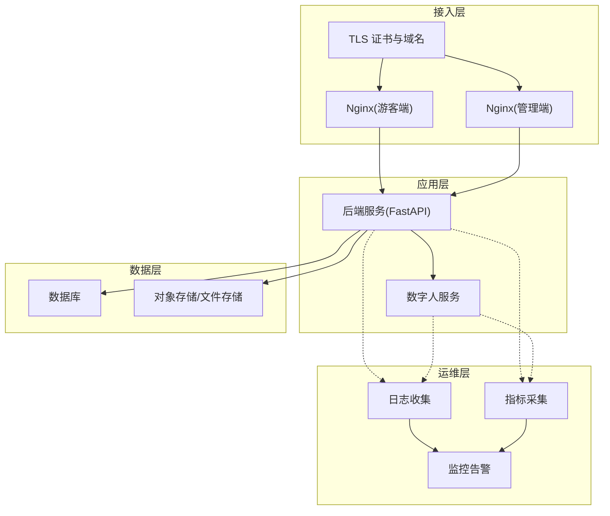
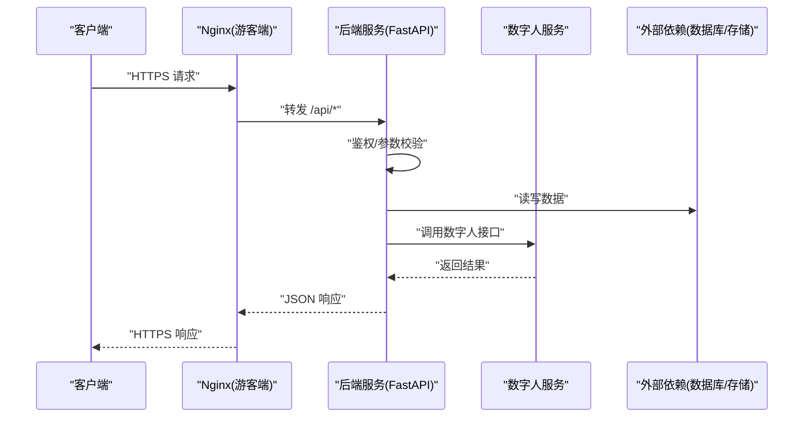
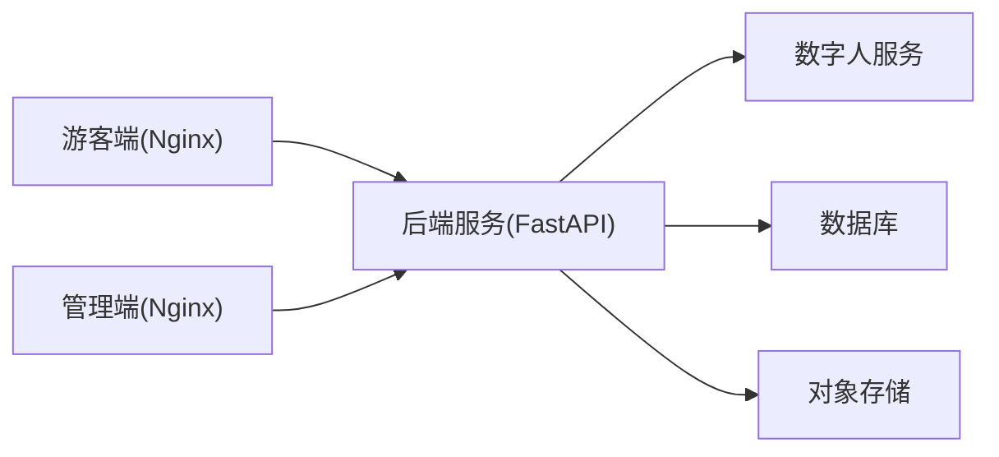

# 部署与运维

<cite>
**本文引用的文件**   
- [docker-compose.yml](file://docker-compose.yml)
- [backend/Dockerfile](file://backend/Dockerfile)
- [backend/app/main.py](file://backend/app/main.py)
- [backend/app/config.py](file://backend/app/config.py)
- [backend/pyproject.toml](file://backend/pyproject.toml)
- [frontend/admin-panel/Dockerfile](file://frontend/admin-panel/Dockerfile)
- [frontend/admin-panel/nginx.conf](file://frontend/admin-panel/nginx.conf)
- [frontend/tourist-app/Dockerfile](file://frontend/tourist-app/Dockerfile)
- [frontend/tourist-app/nginx.conf](file://frontend/tourist-app/nginx.conf)
- [digital_human/Dockerfile](file://digital_human/Dockerfile)
- [digital_human/server.py](file://digital_human/server.py)
</cite>

## 目录
1. [简介](#简介)
2. [项目结构](#项目结构)
3. [核心组件](#核心组件)
4. [架构总览](#架构总览)
5. [详细组件分析](#详细组件分析)
6. [依赖关系分析](#依赖关系分析)
7. [性能考虑](#性能考虑)
8. [故障排查指南](#故障排查指南)
9. [结论](#结论)
10. [附录](#附录)

## 简介
本指南面向生产环境的 SmartTour 系统，提供基于 Docker 的容器化部署与运维方案。内容涵盖镜像构建、服务编排、环境变量配置、网络通信、负载均衡、SSL 证书与域名绑定、监控告警、日志收集、指标采集、备份恢复、数据迁移、版本升级与回滚、容量规划、性能调优、安全加固与高可用配置等。文档以仓库中现有 Dockerfile、编排文件与前端 Nginx 配置为依据，结合通用最佳实践给出可操作的步骤与建议。

## 项目结构
SmartTour 采用前后端分离与多服务架构：
- 后端服务（FastAPI）：提供 API、RAG、推荐、数字人集成等能力
- 管理端前端（Vue + Vite + Nginx）：知识管理、数据分析、头像配置等
- 游客端前端（Vue + Vite + Nginx）：聊天、数字人展示、语音输入等
- 数字人服务：独立微服务，负责数字人渲染/播放相关逻辑
- 容器编排：使用 docker-compose 统一启动各服务

图表来源
- [frontend/tourist-app/Dockerfile](file://frontend/tourist-app/Dockerfile)
- [frontend/tourist-app/nginx.conf](file://frontend/tourist-app/nginx.conf)
- [frontend/admin-panel/Dockerfile](file://frontend/admin-panel/Dockerfile)
- [frontend/admin-panel/nginx.conf](file://frontend/admin-panel/nginx.conf)
- [backend/Dockerfile](file://backend/Dockerfile)
- [digital_human/Dockerfile](file://digital_human/Dockerfile)

章节来源
- [docker-compose.yml](file://docker-compose.yml)
- [backend/Dockerfile](file://backend/Dockerfile)
- [frontend/admin-panel/Dockerfile](file://frontend/admin-panel/Dockerfile)
- [frontend/tourist-app/Dockerfile](file://frontend/tourist-app/Dockerfile)
- [digital_human/Dockerfile](file://digital_human/Dockerfile)

## 核心组件
- 后端服务
  - 入口与路由定义位于后端主程序文件中
  - 配置通过配置文件加载，支持环境变量注入
  - 依赖声明在 Python 工程配置中
- 管理端前端
  - 使用 Nginx 静态资源托管，反向代理到后端 API
  - 提供管理面板页面与路由
- 游客端前端
  - 使用 Nginx 静态资源托管，反向代理到后端 API
  - 提供聊天、数字人展示、语音交互等页面
- 数字人服务
  - 独立进程提供服务接口，供后端调用
- 容器编排
  - 使用 docker-compose 定义服务、网络、端口映射与依赖关系

章节来源
- [backend/app/main.py](file://backend/app/main.py)
- [backend/app/config.py](file://backend/app/config.py)
- [backend/pyproject.toml](file://backend/pyproject.toml)
- [frontend/admin-panel/nginx.conf](file://frontend/admin-panel/nginx.conf)
- [frontend/tourist-app/nginx.conf](file://frontend/tourist-app/nginx.conf)
- [digital_human/server.py](file://digital_human/server.py)
- [docker-compose.yml](file://docker-compose.yml)

## 架构总览
生产环境建议采用如下分层架构：
- 接入层：Nginx 作为反向代理与静态资源服务器，承担 SSL 终止、域名绑定、请求转发与限流
- 应用层：后端 FastAPI 服务与数字人服务，按功能拆分，便于水平扩展
- 数据层：数据库与对象存储（根据实际选型），通过内部网络访问
- 运维层：日志收集、指标采集、健康检查、自动重启与滚动更新

图表来源
- [frontend/tourist-app/nginx.conf](file://frontend/tourist-app/nginx.conf)
- [frontend/admin-panel/nginx.conf](file://frontend/admin-panel/nginx.conf)
- [backend/Dockerfile](file://backend/Dockerfile)
- [digital_human/Dockerfile](file://digital_human/Dockerfile)

## 详细组件分析

### 后端服务（FastAPI）
- 职责
  - 暴露 REST API，处理业务逻辑
  - 集成 RAG、推荐、情感分析、ASR/TTS、数字人等子服务
  - 读取配置与环境变量，连接外部依赖（数据库、对象存储等）
- 关键文件
  - 入口与路由：[backend/app/main.py](file://backend/app/main.py)
  - 配置加载：[backend/app/config.py](file://backend/app/config.py)
  - 依赖声明：[backend/pyproject.toml](file://backend/pyproject.toml)
- 部署要点
  - 镜像构建：参考 [backend/Dockerfile](file://backend/Dockerfile)，确保安装依赖、拷贝代码、设置工作目录与启动命令
  - 环境变量：通过 docker-compose 或运行时注入，如数据库连接串、第三方服务密钥、模型路径等
  - 健康检查：在编排文件中为后端服务添加健康检查，以便编排器自动重启异常实例
  - 横向扩展：无状态设计时可通过增加副本数实现水平扩展；有状态依赖需配合共享存储或外部数据库

图表来源
- [frontend/tourist-app/nginx.conf](file://frontend/tourist-app/nginx.conf)
- [backend/app/main.py](file://backend/app/main.py)
- [digital_human/server.py](file://digital_human/server.py)

章节来源
- [backend/app/main.py](file://backend/app/main.py)
- [backend/app/config.py](file://backend/app/config.py)
- [backend/pyproject.toml](file://backend/pyproject.toml)
- [backend/Dockerfile](file://backend/Dockerfile)

### 管理端前端（Nginx + Vue）
- 职责
  - 提供静态资源托管与页面路由
  - 将 API 请求反向代理至后端服务
- 关键文件
  - 镜像构建：[frontend/admin-panel/Dockerfile](file://frontend/admin-panel/Dockerfile)
  - Nginx 配置：[frontend/admin-panel/nginx.conf](file://frontend/admin-panel/nginx.conf)
- 部署要点
  - 静态资源缓存策略与压缩
  - 反向代理路径与后端 API 前缀一致
  - 跨域与 Cookie 安全策略

章节来源
- [frontend/admin-panel/Dockerfile](file://frontend/admin-panel/Dockerfile)
- [frontend/admin-panel/nginx.conf](file://frontend/admin-panel/nginx.conf)

### 游客端前端（Nginx + Vue）
- 职责
  - 提供游客交互界面（聊天、数字人展示、语音输入）
  - 将 API 请求反向代理至后端服务
- 关键文件
  - 镜像构建：[frontend/tourist-app/Dockerfile](file://frontend/tourist-app/Dockerfile)
  - Nginx 配置：[frontend/tourist-app/nginx.conf](file://frontend/tourist-app/nginx.conf)
- 部署要点
  - 长连接与 WebSocket 支持（如需）
  - 媒体资源优化与 CDN 加速
  - 安全头与 CSP 策略

章节来源
- [frontend/tourist-app/Dockerfile](file://frontend/tourist-app/Dockerfile)
- [frontend/tourist-app/nginx.conf](file://frontend/tourist-app/nginx.conf)

### 数字人服务
- 职责
  - 提供数字人渲染/播放/控制等接口
  - 被后端服务按需调用
- 关键文件
  - 镜像构建：[digital_human/Dockerfile](file://digital_human/Dockerfile)
  - 服务入口：[digital_human/server.py](file://digital_human/server.py)
- 部署要点
  - 资源隔离与 GPU/CPU 限制（视具体实现而定）
  - 超时与重试策略
  - 健康检查与优雅退出

章节来源
- [digital_human/Dockerfile](file://digital_human/Dockerfile)
- [digital_human/server.py](file://digital_human/server.py)

### 容器编排（docker-compose）
- 职责
  - 定义服务、网络、端口映射、卷挂载、环境变量与依赖关系
  - 提供一键启动、停止与扩展能力
- 关键文件
  - 编排文件：[docker-compose.yml](file://docker-compose.yml)
- 部署要点
  - 服务间通信使用内部网络与容器名解析
  - 敏感信息通过环境变量或外部密钥管理
  - 健康检查与重启策略保障可用性
  - 卷持久化用于日志、配置与数据

章节来源
- [docker-compose.yml](file://docker-compose.yml)

## 依赖关系分析
- 服务间依赖
  - 游客端与管理端均依赖后端 API
  - 后端依赖数字人服务与外部数据/存储
- 外部依赖
  - 数据库、对象存储、第三方 AI 服务（LLM、ASR/TTS 等）
- 网络拓扑
  - 所有服务运行在同一编排网络内，通过容器名互相访问
  - 对外仅暴露 Nginx 端口，后端与数字人服务不直接暴露

图表来源
- [frontend/tourist-app/nginx.conf](file://frontend/tourist-app/nginx.conf)
- [frontend/admin-panel/nginx.conf](file://frontend/admin-panel/nginx.conf)
- [backend/app/main.py](file://backend/app/main.py)
- [digital_human/server.py](file://digital_human/server.py)

章节来源
- [docker-compose.yml](file://docker-compose.yml)
- [backend/app/main.py](file://backend/app/main.py)
- [digital_human/server.py](file://digital_human/server.py)

## 性能考虑
- 容器资源限制
  - 为每个服务设置 CPU/内存上限，避免争抢与抖动
- 连接池与并发
  - 合理配置数据库连接池、HTTP 客户端并发与线程/协程池
- 缓存策略
  - 对热点数据引入本地或分布式缓存，降低数据库压力
- 静态资源优化
  - 启用 Gzip/Brotli 压缩、HTTP 缓存与 CDN
- 反压与限流
  - 在 Nginx 层进行速率限制与熔断保护
- 水平扩展
  - 无状态服务通过增加副本提升吞吐；有状态服务采用分片或外部化存储

## 故障排查指南
- 常见问题定位
  - 服务无法启动：检查镜像构建日志、依赖安装与健康检查
  - 端口冲突：核对 docker-compose 端口映射与服务监听端口
  - 网络不通：确认容器网络、DNS 解析与防火墙规则
  - 配置错误：验证环境变量与配置文件是否生效
- 日志与指标
  - 集中收集容器标准输出与应用日志
  - 暴露 Prometheus 指标端点并采集关键指标（QPS、延迟、错误率、资源使用）
- 健康检查与自愈
  - 为关键服务配置健康检查，失败自动重启或替换
- 调试工具
  - 进入容器执行诊断命令，查看进程、网络与磁盘使用情况
  - 使用链路追踪定位慢请求与下游依赖问题

## 结论
通过容器化与编排，SmartTour 实现了模块化、可移植与可扩展的生产部署。结合 Nginx 的反向代理与 SSL 终止、完善的监控与日志体系、合理的容量规划与安全加固，可在保证高可用的同时持续演进与快速迭代。

## 附录

### 一、镜像构建与发布
- 后端镜像
  - 依据 [backend/Dockerfile](file://backend/Dockerfile) 构建，注意依赖缓存与最小化镜像体积
- 前端镜像
  - 管理端与游客端分别依据各自 Dockerfile 构建，静态资源由 Nginx 托管
- 数字人镜像
  - 依据 [digital_human/Dockerfile](file://digital_human/Dockerfile) 构建，必要时包含运行时依赖与模型文件

章节来源
- [backend/Dockerfile](file://backend/Dockerfile)
- [frontend/admin-panel/Dockerfile](file://frontend/admin-panel/Dockerfile)
- [frontend/tourist-app/Dockerfile](file://frontend/tourist-app/Dockerfile)
- [digital_human/Dockerfile](file://digital_human/Dockerfile)

### 二、服务编排与环境变量
- 服务定义
  - 在 [docker-compose.yml](file://docker-compose.yml) 中定义服务、端口、卷、网络与依赖
- 环境变量
  - 通过 .env 文件或编排文件中的 environment 字段注入
  - 建议将敏感信息放入外部密钥管理或运行时注入
- 健康检查
  - 为后端与数字人服务添加健康检查，确保编排器自动修复异常实例

章节来源
- [docker-compose.yml](file://docker-compose.yml)
- [backend/app/config.py](file://backend/app/config.py)

### 三、网络通信与反向代理
- 内部网络
  - 服务间通过容器名与内部网络通信，避免暴露不必要端口
- 反向代理
  - 游客端与管理端 Nginx 将 /api 请求转发至后端服务
  - 参考 [frontend/tourist-app/nginx.conf](file://frontend/tourist-app/nginx.conf) 与 [frontend/admin-panel/nginx.conf](file://frontend/admin-panel/nginx.conf)
- 跨域与安全头
  - 在 Nginx 中配置 CORS、安全头与访问控制策略

章节来源
- [frontend/tourist-app/nginx.conf](file://frontend/tourist-app/nginx.conf)
- [frontend/admin-panel/nginx.conf](file://frontend/admin-panel/nginx.conf)

### 四、负载均衡与高可用
- 单节点多副本
  - 通过编排器增加后端与数字人服务副本，实现水平扩展
- 多节点集群
  - 使用容器编排平台（如 Kubernetes）或服务网格实现更高级的负载均衡与故障转移
- 会话与状态
  - 保持后端无状态，会话与状态外置（Redis/数据库）

### 五、SSL 证书与域名绑定
- 证书获取
  - 使用自动化证书管理（如 Let's Encrypt）定期续期
- Nginx 配置
  - 在 Nginx 中配置 HTTPS 监听、证书路径与强制跳转
- 域名解析
  - 将域名指向 Nginx 所在节点的公网 IP 或负载均衡地址

### 六、监控告警与日志收集
- 指标采集
  - 在后端与数字人服务暴露指标端点，由采集器抓取并可视化
- 日志收集
  - 将容器标准输出与文件日志统一收集，支持检索与告警
- 告警规则
  - 针对错误率、延迟、资源使用与业务指标设定阈值与通知渠道

### 七、备份恢复与数据迁移
- 备份策略
  - 定时全量与增量备份，保留多份历史快照
- 恢复演练
  - 定期进行恢复演练，验证备份有效性与恢复时间目标
- 数据迁移
  - 使用版本化迁移脚本，灰度发布与回滚策略并行准备

### 八、版本升级与回滚
- 蓝绿/金丝雀发布
  - 逐步切换流量，观察指标与日志，确认稳定后全量上线
- 回滚机制
  - 保留上一版本镜像与配置，出现问题快速回滚
- 兼容性
  - 确保 API 向后兼容，数据库变更具备回滚脚本

### 九、容量规划与性能调优
- 容量评估
  - 基于 QPS、P99 延迟与资源使用估算所需实例数量
- 性能调优
  - 调整连接池、线程/协程池、缓存命中率与静态资源缓存
- 压测与基准
  - 建立压测基线，持续回归与对比

### 十、安全加固
- 最小权限
  - 容器以非 root 用户运行，限制文件系统与网络访问
- 密钥管理
  - 使用外部密钥管理服务，避免硬编码
- 网络安全
  - 仅开放必要端口，启用 WAF 与访问控制
- 供应链安全
  - 扫描镜像漏洞，锁定依赖版本，定期更新