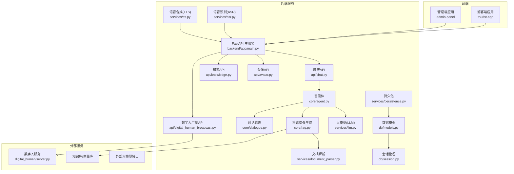
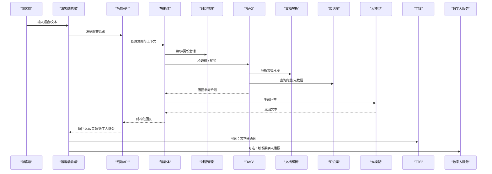
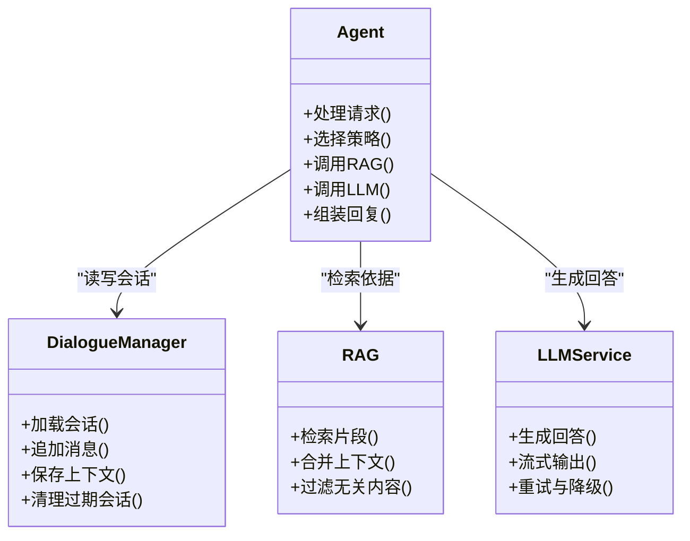
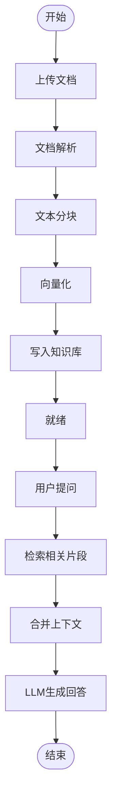
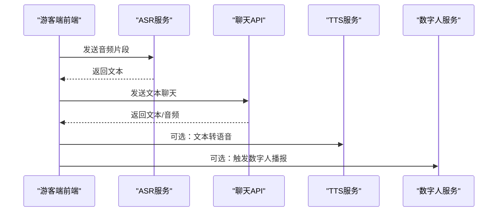
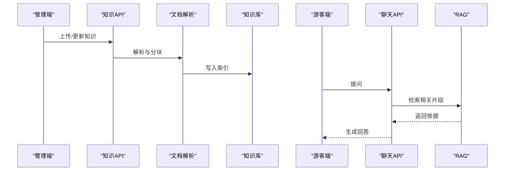
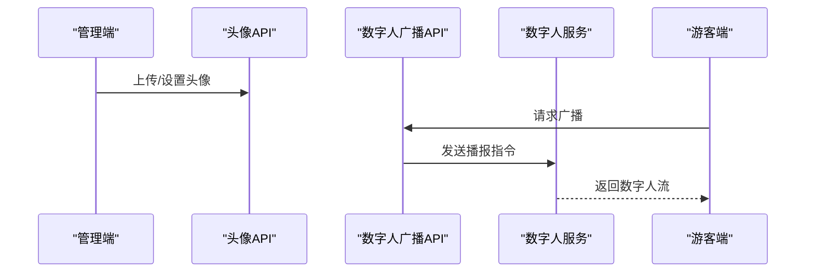
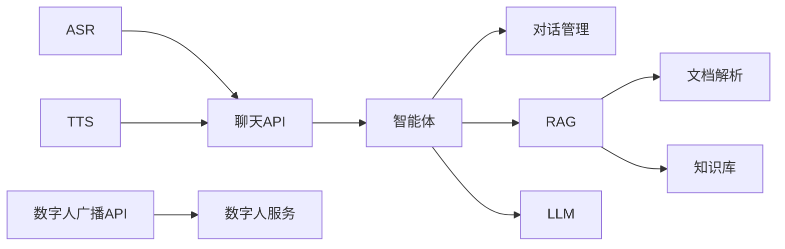

# 项目概述

<cite>
**本文引用的文件**   
- [README.md](file://README.md)
- [docker-compose.yml](file://docker-compose.yml)
- [backend/app/main.py](file://backend/app/main.py)
- [backend/app/config.py](file://backend/app/config.py)
- [backend/app/api/chat.py](file://backend/app/api/chat.py)
- [backend/app/api/knowledge.py](file://backend/app/api/knowledge.py)
- [backend/app/api/avatar.py](file://backend/app/api/avatar.py)
- [backend/app/api/digital_human_broadcast.py](file://backend/app/api/digital_human_broadcast.py)
- [backend/app/core/agent.py](file://backend/app/core/agent.py)
- [backend/app/core/dialogue.py](file://backend/app/core/dialogue.py)
- [backend/app/core/rag.py](file://backend/app/core/rag.py)
- [backend/app/services/asr.py](file://backend/app/services/asr.py)
- [backend/app/services/tts.py](file://backend/app/services/tts.py)
- [backend/app/services/llm.py](file://backend/app/services/llm.py)
- [backend/app/services/document_parser.py](file://backend/app/services/document_parser.py)
- [backend/app/services/persistence.py](file://backend/app/services/persistence.py)
- [backend/app/db/models.py](file://backend/app/db/models.py)
- [backend/app/db/session.py](file://backend/app/db/session.py)
- [digital_human/server.py](file://digital_human/server.py)
- [frontend/tourist-app/src/views/ChatView.vue](file://frontend/tourist-app/src/views/ChatView.vue)
- [frontend/tourist-app/src/components/DigitalHuman/DigitalHuman.vue](file://frontend/tourist-app/src/components/DigitalHuman/DigitalHuman.vue)
- [frontend/tourist-app/src/components/VoiceInput/VoiceInput.vue](file://frontend/tourist-app/src/components/VoiceInput/VoiceInput.vue)
- [frontend/tourist-app/src/services/speech.ts](file://frontend/tourist-app/src/services/speech.ts)
- [frontend/admin-panel/src/views/KnowledgeView.vue](file://frontend/admin-panel/src/views/KnowledgeView.vue)
</cite>

## 目录
1. [引言](#引言)
2. [项目结构](#项目结构)
3. [核心组件](#核心组件)
4. [架构总览](#架构总览)
5. [详细组件分析](#详细组件分析)
6. [依赖关系分析](#依赖关系分析)
7. [性能考量](#性能考量)
8. [故障排查指南](#故障排查指南)
9. [结论](#结论)
10. [附录](#附录)

## 引言
SmartTour智能旅游导览系统面向景区与文旅场景，提供“智能对话、数字人交互、语音输入、知识问答、路线规划”等一体化能力。系统通过后端大模型与检索增强生成（RAG）结合知识库，为游客提供实时、准确、可解释的导览服务；前端以Web应用形式呈现，支持多端访问与管理后台配置。与传统静态导览相比，SmartTour解决以下痛点：
- 信息滞后与碎片化：通过RAG与统一知识库，确保答案基于权威资料并持续更新。
- 交互门槛高：支持语音输入与数字人播报，降低使用门槛，提升沉浸感。
- 个性化不足：结合对话历史与偏好，提供个性化推荐与路线建议。
- 运维复杂：容器化部署与模块化设计，便于扩展与维护。

## 项目结构
仓库采用前后端分离与微服务化组织方式：
- backend：FastAPI后端，提供聊天、知识管理、数字人广播、分析等API，集成LLM、ASR/TTS、RAG、持久化与数据库。
- digital_human：独立的数字人服务，负责数字人渲染与流式播放。
- frontend：包含游客端与管理员端两个Vue应用，分别提供导览交互与知识/头像配置。
- docs：设计与技术选型文档。
- docker-compose.yml：一键编排启动各服务。

图表来源
- [backend/app/main.py](file://backend/app/main.py)
- [backend/app/api/chat.py](file://backend/app/api/chat.py)
- [backend/app/api/knowledge.py](file://backend/app/api/knowledge.py)
- [backend/app/api/avatar.py](file://backend/app/api/avatar.py)
- [backend/app/api/digital_human_broadcast.py](file://backend/app/api/digital_human_broadcast.py)
- [backend/app/core/agent.py](file://backend/app/core/agent.py)
- [backend/app/core/dialogue.py](file://backend/app/core/dialogue.py)
- [backend/app/core/rag.py](file://backend/app/core/rag.py)
- [backend/app/services/asr.py](file://backend/app/services/asr.py)
- [backend/app/services/tts.py](file://backend/app/services/tts.py)
- [backend/app/services/llm.py](file://backend/app/services/llm.py)
- [backend/app/services/document_parser.py](file://backend/app/services/document_parser.py)
- [backend/app/services/persistence.py](file://backend/app/services/persistence.py)
- [backend/app/db/models.py](file://backend/app/db/models.py)
- [backend/app/db/session.py](file://backend/app/db/session.py)
- [digital_human/server.py](file://digital_human/server.py)

章节来源
- [docker-compose.yml](file://docker-compose.yml)
- [backend/app/main.py](file://backend/app/main.py)

## 核心组件
- 智能对话与智能体
  - 智能体协调对话上下文、调用RAG与大模型，输出结构化回复。
  - 对话管理维护会话状态、消息历史与策略路由。
- 检索增强生成（RAG）
  - 将用户问题转化为检索请求，从知识库召回相关片段，结合提示词交由大模型生成回答。
- 语音能力
  - ASR将语音转为文本，TTS将文本转语音，实现端到端语音交互。
- 数字人交互
  - 数字人服务接收文本或音频流，驱动形象进行播报与互动。
- 知识管理
  - 文档解析入库、索引构建、版本管理与权限控制，保障答案准确性与可追溯性。
- 持久化与数据模型
  - 会话、消息、知识条目、头像配置等数据的CRUD与事务管理。

章节来源
- [backend/app/core/agent.py](file://backend/app/core/agent.py)
- [backend/app/core/dialogue.py](file://backend/app/core/dialogue.py)
- [backend/app/core/rag.py](file://backend/app/core/rag.py)
- [backend/app/services/asr.py](file://backend/app/services/asr.py)
- [backend/app/services/tts.py](file://backend/app/services/tts.py)
- [backend/app/services/llm.py](file://backend/app/services/llm.py)
- [backend/app/services/document_parser.py](file://backend/app/services/document_parser.py)
- [backend/app/services/persistence.py](file://backend/app/services/persistence.py)
- [backend/app/db/models.py](file://backend/app/db/models.py)
- [backend/app/db/session.py](file://backend/app/db/session.py)

## 架构总览
系统采用分层与模块化架构：
- 表现层：游客端与管理端Web应用，提供对话界面、数字人展示、语音输入与知识管理。
- 网关与API层：FastAPI暴露REST接口，承载聊天、知识、头像、广播与分析等能力。
- 业务核心层：智能体、对话管理、RAG、推荐与情感分析等。
- 服务层：ASR、TTS、LLM、文档解析、持久化等横向能力。
- 数据层：数据库模型与会话管理，支撑会话、消息、知识与配置存储。
- 外部服务：数字人服务、向量知识库、外部大模型接口。

图表来源
- [backend/app/api/chat.py](file://backend/app/api/chat.py)
- [backend/app/core/agent.py](file://backend/app/core/agent.py)
- [backend/app/core/dialogue.py](file://backend/app/core/dialogue.py)
- [backend/app/core/rag.py](file://backend/app/core/rag.py)
- [backend/app/services/document_parser.py](file://backend/app/services/document_parser.py)
- [backend/app/services/llm.py](file://backend/app/services/llm.py)
- [backend/app/services/tts.py](file://backend/app/services/tts.py)
- [digital_human/server.py](file://digital_human/server.py)

## 详细组件分析

### 智能体与对话管理
- 职责
  - 智能体负责意图识别、策略选择、工具调用与结果组装。
  - 对话管理维护会话ID、消息序列、上下文窗口与记忆摘要。
- 关键流程
  - 接收API请求，加载会话上下文，调用RAG获取依据，组合提示词，调用LLM生成回答，更新会话与持久化。
- 复杂度与优化
  - 对话上下文长度影响延迟与成本，可采用滑动窗口与摘要压缩。
  - RAG召回质量直接影响回答准确性，需优化分块策略与相似度阈值。

图表来源
- [backend/app/core/agent.py](file://backend/app/core/agent.py)
- [backend/app/core/dialogue.py](file://backend/app/core/dialogue.py)
- [backend/app/core/rag.py](file://backend/app/core/rag.py)
- [backend/app/services/llm.py](file://backend/app/services/llm.py)

章节来源
- [backend/app/core/agent.py](file://backend/app/core/agent.py)
- [backend/app/core/dialogue.py](file://backend/app/core/dialogue.py)

### 检索增强生成（RAG）与文档解析
- 职责
  - 文档解析将PDF/Word/Markdown等多格式文档清洗、分块、向量化入库。
  - RAG根据问题检索相关片段，注入提示词，提高回答准确性与可解释性。
- 关键流程
  - 上传文档→解析→分块→嵌入→入库→检索→合并→生成。
- 优化点
  - 分块大小与重叠率、嵌入模型选择、检索排序与去重策略。

图表来源
- [backend/app/services/document_parser.py](file://backend/app/services/document_parser.py)
- [backend/app/core/rag.py](file://backend/app/core/rag.py)

章节来源
- [backend/app/services/document_parser.py](file://backend/app/services/document_parser.py)
- [backend/app/core/rag.py](file://backend/app/core/rag.py)

### 语音输入与数字人交互
- 语音输入
  - 前端采集麦克风音频，调用ASR服务转换为文本，再进入聊天流程。
- 数字人交互
  - 前端可选择数字人模式，将文本或音频流发送至数字人服务，驱动形象播报与动作。
- 关键流程
  - 录音→ASR→聊天→TTS→数字人播报。

图表来源
- [backend/app/services/asr.py](file://backend/app/services/asr.py)
- [backend/app/services/tts.py](file://backend/app/services/tts.py)
- [digital_human/server.py](file://digital_human/server.py)
- [frontend/tourist-app/src/components/VoiceInput/VoiceInput.vue](file://frontend/tourist-app/src/components/VoiceInput/VoiceInput.vue)
- [frontend/tourist-app/src/services/speech.ts](file://frontend/tourist-app/src/services/speech.ts)
- [frontend/tourist-app/src/components/DigitalHuman/DigitalHuman.vue](file://frontend/tourist-app/src/components/DigitalHuman/DigitalHuman.vue)

章节来源
- [backend/app/services/asr.py](file://backend/app/services/asr.py)
- [backend/app/services/tts.py](file://backend/app/services/tts.py)
- [digital_human/server.py](file://digital_human/server.py)
- [frontend/tourist-app/src/components/VoiceInput/VoiceInput.vue](file://frontend/tourist-app/src/components/VoiceInput/VoiceInput.vue)
- [frontend/tourist-app/src/services/speech.ts](file://frontend/tourist-app/src/services/speech.ts)
- [frontend/tourist-app/src/components/DigitalHuman/DigitalHuman.vue](file://frontend/tourist-app/src/components/DigitalHuman/DigitalHuman.vue)

### 知识问答与管理
- 功能
  - 管理员上传、编辑、删除知识条目；游客端基于RAG进行问答。
- 关键流程
  - 管理端提交知识→后端解析入库→游客端检索生成回答。
- 典型场景
  - 景区景点介绍、开放时间、交通指引、活动公告等。

图表来源
- [backend/app/api/knowledge.py](file://backend/app/api/knowledge.py)
- [backend/app/services/document_parser.py](file://backend/app/services/document_parser.py)
- [backend/app/core/rag.py](file://backend/app/core/rag.py)
- [frontend/admin-panel/src/views/KnowledgeView.vue](file://frontend/admin-panel/src/views/KnowledgeView.vue)
- [frontend/tourist-app/src/views/ChatView.vue](file://frontend/tourist-app/src/views/ChatView.vue)

章节来源
- [backend/app/api/knowledge.py](file://backend/app/api/knowledge.py)
- [frontend/admin-panel/src/views/KnowledgeView.vue](file://frontend/admin-panel/src/views/KnowledgeView.vue)
- [frontend/tourist-app/src/views/ChatView.vue](file://frontend/tourist-app/src/views/ChatView.vue)

### 头像与数字人广播
- 头像配置
  - 管理端配置头像资源，游客端按需切换显示。
- 数字人广播
  - 后端提供广播API，数字人服务接收指令进行播报与动画。

图表来源
- [backend/app/api/avatar.py](file://backend/app/api/avatar.py)
- [backend/app/api/digital_human_broadcast.py](file://backend/app/api/digital_human_broadcast.py)
- [digital_human/server.py](file://digital_human/server.py)

章节来源
- [backend/app/api/avatar.py](file://backend/app/api/avatar.py)
- [backend/app/api/digital_human_broadcast.py](file://backend/app/api/digital_human_broadcast.py)

## 依赖关系分析
- 模块耦合
  - API层依赖核心智能体与对话管理；智能体依赖RAG与LLM；RAG依赖文档解析与知识库；语音与数字人作为横向服务被多处调用。
- 外部依赖
  - 外部大模型接口、向量知识库、数字人服务。
- 潜在风险
  - 外部服务可用性（LLM、数字人）、知识库索引一致性、并发下的会话竞争。

图表来源
- [backend/app/api/chat.py](file://backend/app/api/chat.py)
- [backend/app/api/digital_human_broadcast.py](file://backend/app/api/digital_human_broadcast.py)
- [backend/app/core/agent.py](file://backend/app/core/agent.py)
- [backend/app/core/dialogue.py](file://backend/app/core/dialogue.py)
- [backend/app/core/rag.py](file://backend/app/core/rag.py)
- [backend/app/services/asr.py](file://backend/app/services/asr.py)
- [backend/app/services/tts.py](file://backend/app/services/tts.py)
- [backend/app/services/llm.py](file://backend/app/services/llm.py)
- [backend/app/services/document_parser.py](file://backend/app/services/document_parser.py)
- [digital_human/server.py](file://digital_human/server.py)

章节来源
- [backend/app/api/chat.py](file://backend/app/api/chat.py)
- [backend/app/api/digital_human_broadcast.py](file://backend/app/api/digital_human_broadcast.py)
- [backend/app/core/agent.py](file://backend/app/core/agent.py)
- [backend/app/core/dialogue.py](file://backend/app/core/dialogue.py)
- [backend/app/core/rag.py](file://backend/app/core/rag.py)
- [backend/app/services/asr.py](file://backend/app/services/asr.py)
- [backend/app/services/tts.py](file://backend/app/services/tts.py)
- [backend/app/services/llm.py](file://backend/app/services/llm.py)
- [backend/app/services/document_parser.py](file://backend/app/services/document_parser.py)
- [digital_human/server.py](file://digital_human/server.py)

## 性能考量
- 响应时延
  - 减少不必要的RAG召回范围，缓存高频问答对，启用LLM流式输出。
- 吞吐与并发
  - 异步I/O、连接池复用、数字人流式传输；合理设置队列与限流。
- 资源占用
  - 控制对话上下文长度，定期清理过期会话；知识库索引增量更新。
- 稳定性
  - 外部服务降级策略（如回退到本地模板回答），重试与熔断机制。

[本节为通用指导，不直接分析具体文件]

## 故障排查指南
- 常见问题
  - 语音无法识别：检查ASR服务连通性与音频格式。
  - 数字人不播放：确认广播API参数与数字人服务状态。
  - 回答不准确：核查知识库索引是否最新、分块策略与检索阈值。
  - 会话丢失：检查持久化与数据库连接是否正常。
- 定位步骤
  - 查看API日志与错误码；验证环境变量与配置项；逐步隔离外部依赖。

章节来源
- [backend/app/config.py](file://backend/app/config.py)
- [backend/app/services/persistence.py](file://backend/app/services/persistence.py)
- [backend/app/db/session.py](file://backend/app/db/session.py)

## 结论
SmartTour通过“智能体+RAG+语音+数字人”的组合，构建了高可用、可扩展的智能旅游导览平台。其模块化架构与容器化部署降低了运维复杂度，同时为游客提供了自然、沉浸、个性化的体验。未来可在多模态理解、离线推理与边缘部署方面继续演进。

[本节为总结性内容，不直接分析具体文件]

## 附录
- 快速上手
  - 使用docker-compose一键启动所有服务，访问游客端与管理端页面。
- 使用场景示例
  - 游客在景区入口通过语音询问“附近有哪些适合拍照的景点”，系统基于RAG返回推荐并给出步行路线；如需更生动讲解，可开启数字人播报。
  - 管理员在后台上传最新活动公告，游客端即时获得准确信息。

章节来源
- [docker-compose.yml](file://docker-compose.yml)
- [frontend/tourist-app/src/views/ChatView.vue](file://frontend/tourist-app/src/views/ChatView.vue)
- [frontend/admin-panel/src/views/KnowledgeView.vue](file://frontend/admin-panel/src/views/KnowledgeView.vue)