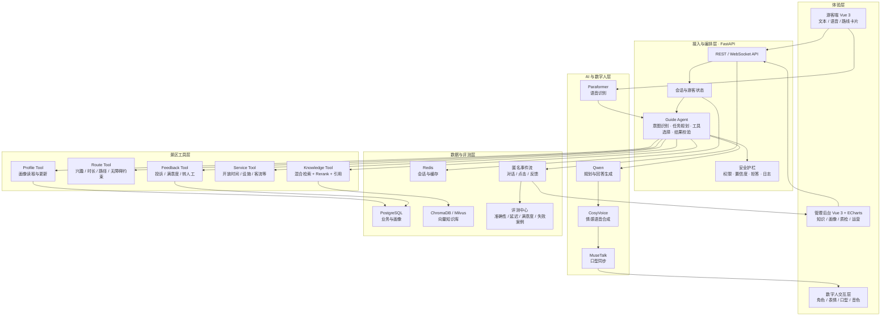

# 智游灵境 SmartTour Copilot

> **面向智慧景区的多模态智能体数字人服务与运营平台**<br>
> 第十五届中国软件杯 A 组赛题 · 锐捷网络（苏州）有限公司

SmartTour Copilot 不只是一个“会回答问题的数字人”，而是一套连接**游客服务、导览执行与景区运营**的 AI 产品：游客可以通过文本或语音提出游览目标，系统结合景区知识、个人偏好与实时约束规划任务并调用工具，数字人以可追溯的讲解结果完成服务；管理方则通过知识治理、服务质检和运营洞察持续优化景区体验。

## 目录

- [为什么做](#为什么做)
- [项目定位](#项目定位)
- [当前实现与目标边界](#当前实现与目标边界)
- [核心创新](#核心创新)
- [系统架构](#系统架构)
- [产品功能](#产品功能)
- [技术方案](#技术方案)
- [量化指标与评测](#量化指标与评测)
- [比赛演示路径](#比赛演示路径)
- [快速开始](#快速开始)
- [项目结构](#项目结构)
- [商业落地](#商业落地)
- [30 天开发路线](#30-天开发路线)
- [项目文档](#项目文档)

## 为什么做

传统景区导览通常面临四类问题：

| 对象 | 真实痛点 | 现有方案局限 |
|---|---|---|
| 游客 | 信息分散、路线固定、临时需求无人响应 | 地图和语音包只提供单向、标准化内容 |
| 讲解员 | 高峰期供给不足，重复讲解占用人力 | 人工服务难以低成本覆盖长尾时段 |
| 景区 | 不知道游客“在问什么、为何不满意” | 统计停留在客流量，缺少语义层洞察 |
| 运营人员 | 知识更新慢，错误信息难以及时纠正 | 内容散落在文档、公众号和员工经验中 |

项目将一次导览抽象为“**理解需求 → 规划任务 → 调用景区工具 → 生成可信讲解 → 沉淀运营数据**”的闭环，使 AI 从内容展示组件升级为可管理、可评测、可运营的景区服务基础设施。

## 项目定位

### 一句话定位

**为游客提供千人千面的可信导览，为景区提供可量化、可持续优化的 AI 服务运营能力。**

### 产品价值

```text
游客侧：少搜索、少绕路、随时问、听得懂
景区侧：降重复服务成本、统一讲解口径、发现服务问题、辅助运营决策
```

### 与普通 ChatGPT 导游的区别

| 维度 | 通用大模型导游 | SmartTour Copilot |
|---|---|---|
| 知识来源 | 依赖模型参数，信息可能过时 | 景区专属知识库，回答附来源与置信度 |
| 任务能力 | 以问答为主 | Agent 规划并调用路线、知识、画像等工具 |
| 个性化 | 依赖单轮提示词 | 持续维护游客偏好、时间、同行人等画像 |
| 交互体验 | 文本或通用语音 | 数字人口型、语音、表情和角色协同输出 |
| 管理能力 | 对话结束即终止 | 知识治理、服务质检、热点与负面问题闭环 |
| 落地方式 | 面向个人的通用应用 | 面向景区的可配置、可私有化部署产品 |

## 当前实现与目标边界

> 本仓库坚持“已实现能力”和“规划能力”分开展示，避免将接口占位或演示数据包装成完成成果。

| 能力 | 当前状态 | 说明 |
|---|---|---|
| 游客端与管理后台 | **原型可用** | Vue 3 双端页面，包含问答、路线、知识库、形象和数据分析界面 |
| 文本流式问答 | **原型可用** | FastAPI + WebSocket；支持会话上下文与 Qwen 兼容 API |
| 景区知识检索 | **基础可用** | 当前采用 FAQ 与关键词检索；向量化、重排、引用溯源待升级 |
| 个性化路线 | **基础可用** | 当前按游览时长和兴趣标签进行约束筛选 |
| 游客画像 | **基础可用** | 当前保存会话级兴趣，长期画像和行为更新待实现 |
| 情感反馈 | **演示可用** | 当前采用规则分析并驱动表情状态 |
| 运营分析 | **演示数据** | 页面和 API 已具备，真实事件采集与指标计算待接入 |
| ASR / TTS | **接口预留** | 已规划 Paraformer 与 CosyVoice，尚未完成推理接入 |
| MuseTalk 数字人 | **接口预留** | 已提供独立服务和 GPU Profile，推理链路尚未接通 |
| Agent 编排与评测 | **重点规划** | 作为 30 天升级的核心任务，不引入不可控的多智能体集群 |

## 核心创新

### 1. 可执行的景区导览 Agent

系统不直接把所有问题交给大模型，而是由轻量 Agent 判断意图、拆分任务并调用受控工具。

```text
“带老人游玩 3 小时，想看古建筑，尽量少爬坡”
    ↓
识别：同行人=老人、时长=3h、兴趣=古建、约束=少爬坡
    ↓
调用：游客画像工具 + 景点检索工具 + 路线规划工具
    ↓
校验：时长、无障碍、开放状态、知识来源
    ↓
输出：路线卡片 + 分段讲解 + 数字人播报
```

相比普通问答，结果是**可执行、可解释、可校验**的服务方案。

### 2. 有依据、会拒答的可信 RAG

采用“FAQ 精确匹配 + BGE-M3 混合召回 + Reranker 精排 + 引用与置信度”的检索链路；当证据不足时不编造答案，而是提示补充知识或转人工。管理后台支持文档上传、切片预览、问答测试和问题回流。

### 3. 游客状态驱动的多模态数字人

将语音识别结果、对话意图和情绪状态映射为数字人的语速、语调、表情与讲解风格。例如面对老人降低语速，面对儿童切换故事化讲解，面对投诉使用关切表情并触发服务反馈工具。数字人因此承担“服务界面”而非装饰动画。

### 4. 动态游客画像与约束型推荐

画像不只记录兴趣标签，还包括可支配时间、同行结构、行动能力、历史偏好与当前反馈。路线推荐同时考虑兴趣匹配、游览时长、路径顺序和无障碍约束，并展示推荐理由，避免黑盒推荐。

### 5. 从对话到运营决策的闭环

将匿名化对话事件聚合为热点问题、未命中知识、负面情绪、景点关注度和服务质量指标。运营人员可以看到“游客为什么不满意”，将高频未回答问题一键转为知识库待办，形成“服务—分析—优化—再服务”的闭环。

创新方案的技术实现、比赛价值和开发难度详见 [项目总体优化方案](docs/competition/optimization-plan.md)。

## 系统架构

### 目标架构



### Agent 执行链

```text
输入理解 → 场景分类 → 读取游客状态 → 生成最小任务计划
   → 调用白名单工具 → 汇总证据 → 约束与安全校验
   → 生成带来源回答 → TTS / 表情 / 口型驱动 → 记录评测事件
```

Agent 推荐使用 **LangGraph 的单编排器状态机**。它复用现有 Python、FastAPI、LangChain 和 Qwen 技术路线，便于观察每一步执行状态；不采用复杂多 Agent 自由协作，降低 30 天周期内的开发和演示风险。

## 产品功能

### 游客端

| 功能 | 竞争力设计 |
|---|---|
| 可信智能问答 | 来源引用、置信度、追问建议、证据不足时拒答 |
| 多模态交互 | 文本/语音输入，流式文字、语音和数字人同步输出 |
| 目标式路线规划 | 输入时长、兴趣、同行人和行动约束，输出可解释路线 |
| 行中动态调整 | 游客说“累了、下雨了、时间不够”时重新规划剩余行程 |
| 个性化讲解 | 儿童故事版、历史深度版、无障碍简明版等讲解模式 |
| 服务助手 | 查询卫生间、停车、餐饮、开放时间并支持反馈或转人工 |
| 隐私控制 | 游客可查看、重置会话画像，不采集非必要身份信息 |

### 数字人端

| 功能 | 竞争力设计 |
|---|---|
| 流式语音与口型同步 | 句级 TTS 流式输出，MuseTalk 生成口型视频流 |
| 情绪与动作策略 | 根据意图和情感选择 happy / caring / explaining 等状态 |
| 多角色导游 | 历史文化、亲子研学、无障碍服务等角色共用知识与工具 |
| 讲解节奏控制 | 根据游客类型调节语速、停顿、用词和讲解长度 |
| 降级保障 | GPU 服务不可用时自动降级为静态形象 + 语音，不中断问答 |

### 管理后台

| 功能 | 竞争力设计 |
|---|---|
| 知识库治理 | 文档上传、切片预览、版本、来源、有效期和问答回归测试 |
| 游客画像分析 | 匿名兴趣分布、同行结构、路线偏好与满意度交叉分析 |
| 服务质量分析 | RAG 命中率、拒答率、工具成功率、响应延迟和人工接管率 |
| 运营洞察 | 热点问题、负面主题、景点热度、时段趋势与优化建议 |
| 问题闭环 | 高频未回答问题自动形成知识补充待办，更新后触发回归评测 |
| 数字人配置 | 角色、形象、音色、语速、人格与适用场景配置 |

## 技术方案

| 层级 | 保留方案 | 30 天内的升级重点 |
|---|---|---|
| 前端 | Vue 3、TypeScript、Vite、Pinia、ECharts | 增加引用卡片、Agent 执行状态、画像与质检页面 |
| API | FastAPI、WebSocket | 增加统一事件模型、流式音频协议、错误降级和链路追踪 |
| 大模型 | Qwen / OpenAI 兼容 API | 结构化输出、工具调用、低温度事实问答 |
| Agent | 复用 LangChain | 增加 LangGraph 单编排器，不做高风险多 Agent 集群 |
| RAG | BGE-M3、ChromaDB/Milvus | 落地向量检索、BGE Reranker、引用、阈值拒答 |
| 语音 | Paraformer、CosyVoice | 优先接通可演示的流式 ASR/TTS 链路 |
| 数字人 | MuseTalk | 接通推理服务、表情状态映射与静态降级 |
| 数据 | PostgreSQL、Redis | 保存匿名事件、游客状态、评测结果和知识版本 |
| 工程 | Docker Compose、Ruff | 增加 Pytest、前端 Lint、RAG 离线评测和压力测试 |

## 量化指标与评测

以下均为**验收目标**，未完成实测前不作为已达成数据宣传：

| 指标 | 30 天可实现目标 | 测试口径 |
|---|---:|---|
| 景区事实问答准确率 | ≥ 90% | 200 道人工标注问题，逐题判定事实正确 |
| RAG Recall@5 | ≥ 90% | 标注标准证据段落是否进入 Top 5 |
| 回答忠实度 | ≥ 85% | 回答中的事实是否可由引用证据支持 |
| 无依据问题正确拒答率 | ≥ 90% | 50 道知识库外问题，检查拒答而非编造 |
| 文本首字响应 P95 | ≤ 1.5 秒 | 从提交到首个流式文本片段 |
| 语音问答端到端 P95 | ≤ 5 秒 | 停止录音到开始播报首句 |
| 安静环境 ASR 字错率 | ≤ 10% | 100 条普通话景区问句 |
| 路线约束满足率 | ≥ 95% | 100 组时长、兴趣和行动约束用例 |
| 推荐满意度 | ≥ 4.2 / 5 | 至少 30 名体验者匿名问卷 |
| 服务并发 | 50 会话稳定运行 | 10 分钟压测，错误率 < 1% |
| 知识更新生效时间 | ≤ 60 秒 | 上传至新内容可被检索 |

评测分为三层：

1. **离线评测**：固定问题集测试检索召回、答案正确性、引用和拒答。
2. **链路评测**：记录 Agent 工具选择、执行成功率、延迟和 Token 消耗。
3. **用户评测**：通过任务完成率、推荐满意度和 SUS 可用性量表验证体验。

## 比赛演示路径

建议用 5 分钟讲清“服务闭环”，而不是逐页展示功能：

1. **游客提出复杂目标**：带老人游玩 3 小时、喜欢古建筑、尽量少爬坡。
2. **展示 Agent 过程**：读取画像，调用景点知识和路线工具，完成约束校验。
3. **展示可信回答**：路线卡片附推荐理由，讲解内容标出知识来源。
4. **制造行中变化**：游客说“下雨了，只剩 1 小时”，系统动态重规划。
5. **展示数字人价值**：切换关切表情、放慢语速并完成口型同步播报。
6. **切到管理后台**：查看本次会话的延迟、命中来源和匿名反馈。
7. **完成运营闭环**：把一个未回答问题加入知识库，再次提问后正确命中。

答辩问题与推荐回答见 [比赛答辩手册](docs/competition/defense-guide.md)。

## 快速开始

### 环境要求

- Python 3.10+
- Node.js 20+
- Docker 与 Docker Compose（推荐）
- 可选：NVIDIA GPU，用于 MuseTalk 数字人推理

### Docker Compose

```bash
git clone https://github.com/vstralcn/AI-SmartTour.git
cd AI-SmartTour
docker compose up --build
```

| 服务 | 地址 |
|---|---|
| 游客端 | `http://localhost:3000` |
| 管理后台 | `http://localhost:3001` |
| FastAPI 文档 | `http://localhost:8000/docs` |
| 后端健康检查 | `http://localhost:8000/health` |

启用 GPU 数字人占位服务：

```bash
docker compose --profile gpu up --build
```

### 本地开发

```bash
# 后端
cd backend
pip install -e ".[dev]"
uvicorn app.main:app --reload --port 8000

# 游客端
cd frontend/tourist-app
npm ci
npm run dev

# 管理后台
cd frontend/admin-panel
npm ci
npm run dev
```

如需调用 Qwen 兼容 API，请在运行后端前配置 `LLM_API_KEY`、`LLM_API_BASE` 和 `LLM_MODEL`。不得将密钥提交到仓库。

## 项目结构

```text
AI-SmartTour/
├── frontend/
│   ├── tourist-app/             # 游客交互端
│   └── admin-panel/             # 景区管理后台
├── backend/
│   └── app/
│       ├── api/                 # 对话、推荐、知识、数字人、分析 API
│       ├── core/                # 对话、RAG、推荐、情感核心逻辑
│       ├── models/              # API 数据模型
│       └── services/            # LLM、ASR、TTS、数字人服务适配
├── digital_human/               # MuseTalk 独立推理服务入口
├── docs/
│   ├── design/                  # 架构与技术选型
│   └── competition/             # 比赛优化方案与答辩手册
└── docker-compose.yml
```

## 商业落地

### 客户与交付形态

- **客户**：4A/5A 景区、博物馆、文旅综合体、研学基地。
- **SaaS 版**：按景区和年订阅收费，适合中小景区快速上线。
- **私有化版**：知识与日志部署在景区内网，适合大型景区和政企客户。
- **增值服务**：特色数字人形象、专属音色、知识治理和运营分析报告。

### 最小商业闭环

```text
游客扫码进入 → AI 完成导览服务 → 景区获得匿名洞察
→ 运营人员补充知识/优化服务 → 问答和满意度提升 → 形成续费价值
```

产品不以“替代全部讲解员”为目标，而是覆盖高频重复咨询和长尾服务时段，并把复杂投诉、紧急事件和特殊需求转交人工。

## 30 天开发路线

| 周期 | 关键交付 | 验收方式 |
|---|---|---|
| 第 1 周 | 评测集、混合 RAG、引用与拒答 | 200 题离线评测报告 |
| 第 2 周 | LangGraph 编排、画像工具、约束路线工具 | 复杂目标可展示完整工具调用轨迹 |
| 第 3 周 | ASR/TTS/MuseTalk 最短链路、情绪策略与降级 | 语音提问到数字人播报全链路可运行 |
| 第 4 周 | 真实事件分析、服务质检、压测和答辩材料 | 5 分钟闭环 Demo + 指标看板 |

**高优先级**：可信 RAG、Agent 工具调用、真实数据闭环、核心评测、可重复演示。<br>
**中优先级**：多角色、长期画像、实时路线调整、数字人情绪策略。<br>
**低优先级**：复杂 3D 数字人、跨景区联邦学习、全自动多 Agent 协作、重型预测平台。

完整优先级与实施拆解见 [项目总体优化方案](docs/competition/optimization-plan.md)。

## 项目文档

- [系统架构设计](docs/design/architecture.md)
- [技术选型说明](docs/design/tech-selection.md)
- [比赛竞争力与产品化优化方案](docs/competition/optimization-plan.md)
- [比赛答辩手册](docs/competition/defense-guide.md)

### 建议补充的展示素材

README 和答辩材料应优先补充以下真实素材，避免使用与系统无关的概念图：

| 位置 | 建议素材 |
|---|---|
| README 首屏 | 20–30 秒 GIF：语音提问 → Agent 调用 → 数字人回答 |
| 核心创新后 | Agent 工具调用时间线截图、带来源的 RAG 回答截图 |
| 产品功能后 | 游客端、路线卡片、管理后台三张统一尺寸截图 |
| 量化指标后 | RAG 评测结果图、P95 延迟图、用户满意度图 |
| 商业落地后 | 单景区部署拓扑或试点流程图 |

## 团队

vstralcn

## License

MIT
